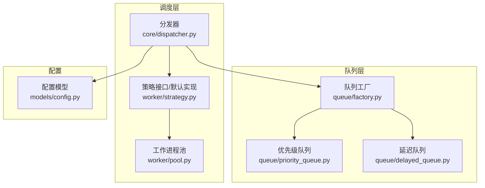
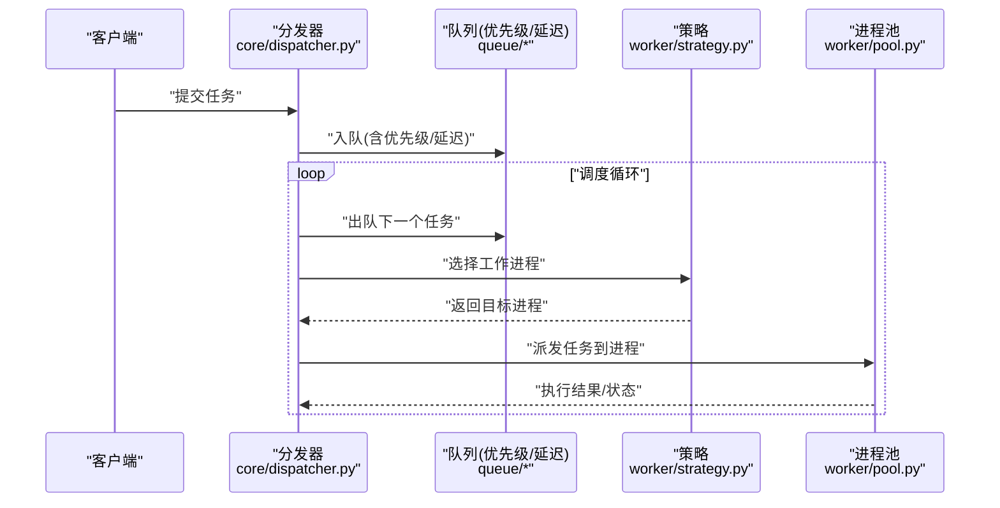
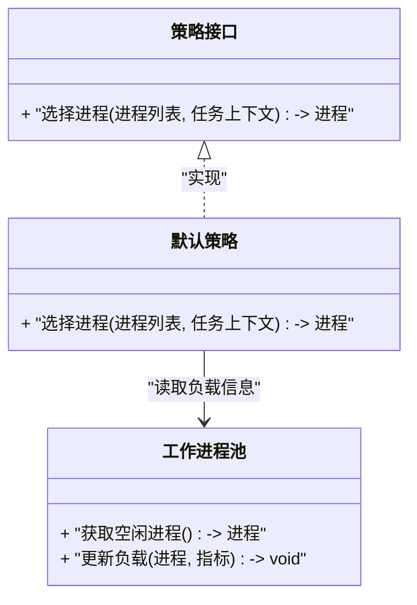
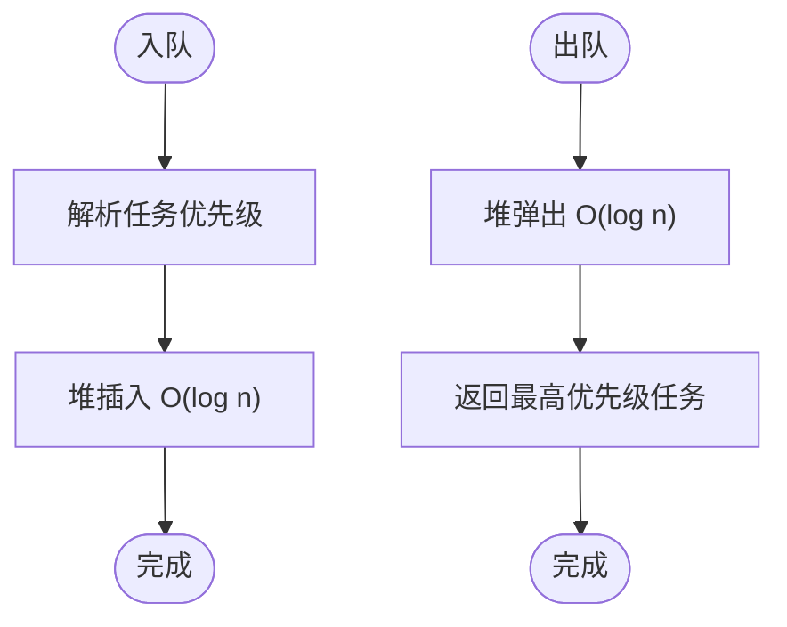
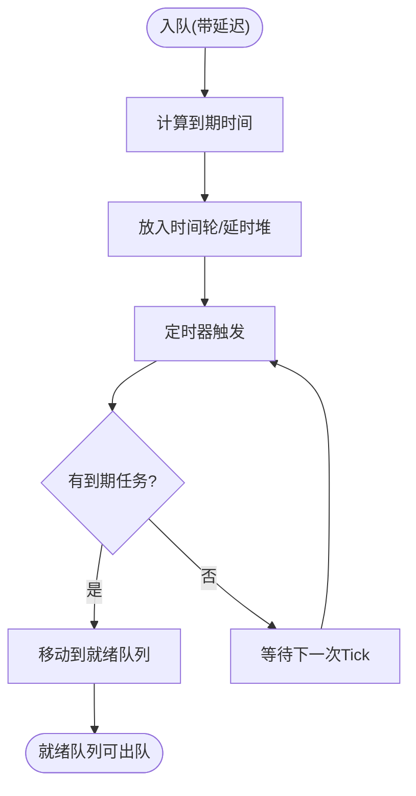
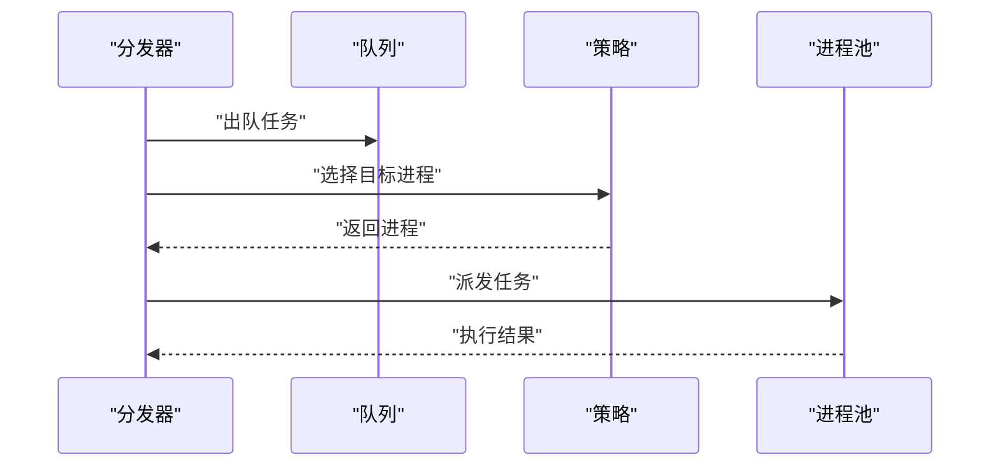
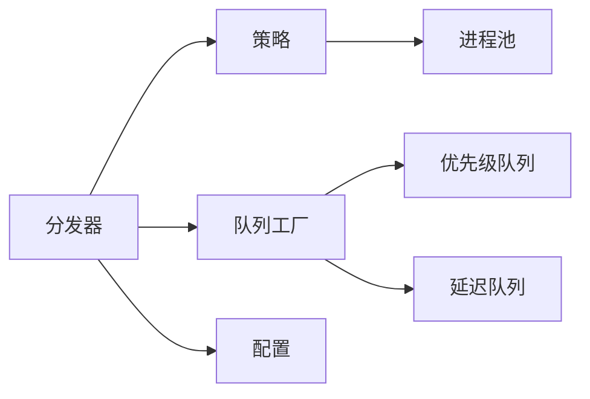

# 调度策略

<cite>
**本文引用的文件**   
- [src/neotask/worker/strategy.py](file://src/neotask/worker/strategy.py)
- [src/neotask/worker/pool.py](file://src/neotask/worker/pool.py)
- [src/neotask/queue/priority_queue.py](file://src/neotask/queue/priority_queue.py)
- [src/neotask/queue/delayed_queue.py](file://src/neotask/queue/delayed_queue.py)
- [src/neotask/queue/factory.py](file://src/neotask/queue/factory.py)
- [src/neotask/core/dispatcher.py](file://src/neotask/core/dispatcher.py)
- [src/neotask/models/config.py](file://src/neotask/models/config.py)
- [examples/03_priority.py](file://examples/03_priority.py)
</cite>

## 目录
1. [简介](#简介)
2. [项目结构](#项目结构)
3. [核心组件](#核心组件)
4. [架构总览](#架构总览)
5. [详细组件分析](#详细组件分析)
6. [依赖关系分析](#依赖关系分析)
7. [性能考量](#性能考量)
8. [故障排查指南](#故障排查指南)
9. [结论](#结论)
10. [附录](#附录)

## 简介
本章节聚焦工作进程的调度策略与算法实现，涵盖负载均衡、任务分配、优先级调度等核心机制。文档将解释不同调度策略的适用场景与性能特点，并提供自定义调度策略的开发指南、扩展方法以及配置选项与调优建议，帮助读者在本地或分布式环境中高效部署与优化任务调度系统。

## 项目结构
围绕调度策略的关键代码主要分布在以下模块：
- 工作进程池与策略接口：worker/pool.py、worker/strategy.py
- 队列与优先级/延迟调度：queue/priority_queue.py、queue/delayed_queue.py、queue/factory.py
- 分发器（调度入口）：core/dispatcher.py
- 配置模型：models/config.py
- 示例：examples/03_priority.py

图表来源
- [src/neotask/core/dispatcher.py](file://src/neotask/core/dispatcher.py)
- [src/neotask/worker/strategy.py](file://src/neotask/worker/strategy.py)
- [src/neotask/worker/pool.py](file://src/neotask/worker/pool.py)
- [src/neotask/queue/priority_queue.py](file://src/neotask/queue/priority_queue.py)
- [src/neotask/queue/delayed_queue.py](file://src/neotask/queue/delayed_queue.py)
- [src/neotask/queue/factory.py](file://src/neotask/queue/factory.py)
- [src/neotask/models/config.py](file://src/neotask/models/config.py)

章节来源
- [src/neotask/worker/strategy.py](file://src/neotask/worker/strategy.py)
- [src/neotask/worker/pool.py](file://src/neotask/worker/pool.py)
- [src/neotask/queue/priority_queue.py](file://src/neotask/queue/priority_queue.py)
- [src/neotask/queue/delayed_queue.py](file://src/neotask/queue/delayed_queue.py)
- [src/neotask/queue/factory.py](file://src/neotask/queue/factory.py)
- [src/neotask/core/dispatcher.py](file://src/neotask/core/dispatcher.py)
- [src/neotask/models/config.py](file://src/neotask/models/config.py)

## 核心组件
- 策略接口与默认实现：定义选择工作进程的策略抽象与默认策略，支持按负载最小、轮询、亲和性等方式进行任务分配。
- 工作进程池：维护可用工作进程集合、健康状态、容量与并发度，提供获取空闲进程的能力。
- 优先级队列：基于堆结构的优先队列，支持按优先级出队，适合高优任务快速响应。
- 延迟队列：基于时间轮或延时堆实现，支持任务在指定时刻入队并按时触发。
- 队列工厂：根据配置创建具体队列实例（如优先级队列、延迟队列），屏蔽底层差异。
- 分发器：调度主流程，负责从队列取任务、调用策略选择目标进程、派发执行并处理结果。
- 配置模型：集中管理调度相关参数，包括策略类型、队列类型、并发度、超时、重试等。

章节来源
- [src/neotask/worker/strategy.py](file://src/neotask/worker/strategy.py)
- [src/neotask/worker/pool.py](file://src/neotask/worker/pool.py)
- [src/neotask/queue/priority_queue.py](file://src/neotask/queue/priority_queue.py)
- [src/neotask/queue/delayed_queue.py](file://src/neotask/queue/delayed_queue.py)
- [src/neotask/queue/factory.py](file://src/neotask/queue/factory.py)
- [src/neotask/core/dispatcher.py](file://src/neotask/core/dispatcher.py)
- [src/neotask/models/config.py](file://src/neotask/models/config.py)

## 架构总览
下图展示了调度主流程中各组件的交互关系：分发器从队列取出任务，通过策略选择工作进程，再交由进程池执行；配置驱动队列与策略的选择。

图表来源
- [src/neotask/core/dispatcher.py](file://src/neotask/core/dispatcher.py)
- [src/neotask/queue/priority_queue.py](file://src/neotask/queue/priority_queue.py)
- [src/neotask/queue/delayed_queue.py](file://src/neotask/queue/delayed_queue.py)
- [src/neotask/worker/strategy.py](file://src/neotask/worker/strategy.py)
- [src/neotask/worker/pool.py](file://src/neotask/worker/pool.py)

## 详细组件分析

### 策略接口与默认实现
- 职责：定义“如何选择一个工作进程”的抽象，并提供默认实现（例如最小负载、轮询、亲和性）。
- 关键点：
  - 策略需具备无状态或轻量状态，保证高吞吐下的低开销。
  - 支持扩展新策略（如加权轮询、一致性哈希、区域亲和）。
  - 与进程池协作，读取进程负载指标（如待执行数、CPU使用率、内存占用）。

图表来源
- [src/neotask/worker/strategy.py](file://src/neotask/worker/strategy.py)
- [src/neotask/worker/pool.py](file://src/neotask/worker/pool.py)

章节来源
- [src/neotask/worker/strategy.py](file://src/neotask/worker/strategy.py)
- [src/neotask/worker/pool.py](file://src/neotask/worker/pool.py)

### 工作进程池
- 职责：管理工作进程的生命周期、健康检查、容量与并发度，提供获取空闲进程的方法。
- 关键点：
  - 维护进程状态（空闲、忙碌、下线）。
  - 支持动态扩缩容与健康探测。
  - 为策略提供实时负载数据。

章节来源
- [src/neotask/worker/pool.py](file://src/neotask/worker/pool.py)

### 优先级队列
- 职责：基于优先级的任务队列，确保高优先级任务优先被调度。
- 关键点：
  - 采用堆结构，插入/弹出复杂度近似对数级。
  - 支持多优先级级别与公平性控制（避免低优先级饥饿）。
  - 与延迟队列结合可实现“延迟+优先级”的组合调度。

图表来源
- [src/neotask/queue/priority_queue.py](file://src/neotask/queue/priority_queue.py)

章节来源
- [src/neotask/queue/priority_queue.py](file://src/neotask/queue/priority_queue.py)

### 延迟队列
- 职责：支持任务在指定时间之后入队并按时触发，常用于定时任务与退避重试。
- 关键点：
  - 基于时间轮或延时堆实现，按到期时间组织任务。
  - 与优先级队列组合可形成“先延迟后按优先级”的调度路径。
  - 需要周期性扫描到期任务并转入就绪队列。

图表来源
- [src/neotask/queue/delayed_queue.py](file://src/neotask/queue/delayed_queue.py)

章节来源
- [src/neotask/queue/delayed_queue.py](file://src/neotask/queue/delayed_queue.py)

### 队列工厂
- 职责：根据配置创建具体队列实例（优先级队列、延迟队列），屏蔽底层差异。
- 关键点：
  - 支持多种队列后端切换。
  - 与分发器解耦，便于测试与替换。

章节来源
- [src/neotask/queue/factory.py](file://src/neotask/queue/factory.py)

### 分发器（调度入口）
- 职责：调度主流程，协调队列、策略与进程池，完成任务的出队、选路与执行。
- 关键点：
  - 支持并行出队与批量调度以提升吞吐。
  - 与策略配合实现负载均衡与亲和性。
  - 处理异常与重试，保障稳定性。

图表来源
- [src/neotask/core/dispatcher.py](file://src/neotask/core/dispatcher.py)
- [src/neotask/worker/strategy.py](file://src/neotask/worker/strategy.py)
- [src/neotask/worker/pool.py](file://src/neotask/worker/pool.py)

章节来源
- [src/neotask/core/dispatcher.py](file://src/neotask/core/dispatcher.py)

### 配置模型
- 职责：集中管理调度相关参数，包括策略类型、队列类型、并发度、超时、重试等。
- 关键点：
  - 提供默认值与校验。
  - 支持运行时热更新（若实现）。
  - 与工厂/分发器联动，决定实际行为。

章节来源
- [src/neotask/models/config.py](file://src/neotask/models/config.py)

### 示例：优先级调度
- 说明：演示如何设置任务优先级并使用优先级队列进行调度。
- 要点：
  - 通过配置启用优先级队列。
  - 在任务上下文中设置优先级字段。
  - 观察高优先级任务优先执行的效果。

章节来源
- [examples/03_priority.py](file://examples/03_priority.py)

## 依赖关系分析
- 耦合关系：
  - 分发器依赖策略与队列工厂，策略依赖进程池。
  - 队列工厂依赖具体队列实现（优先级/延迟）。
  - 配置驱动队列与策略的选择。
- 潜在环依赖：
  - 应确保策略不反向依赖分发器，避免循环。
- 外部依赖：
  - 时间轮/延时堆用于延迟队列。
  - 堆数据结构用于优先级队列。

图表来源
- [src/neotask/core/dispatcher.py](file://src/neotask/core/dispatcher.py)
- [src/neotask/worker/strategy.py](file://src/neotask/worker/strategy.py)
- [src/neotask/worker/pool.py](file://src/neotask/worker/pool.py)
- [src/neotask/queue/factory.py](file://src/neotask/queue/factory.py)
- [src/neotask/queue/priority_queue.py](file://src/neotask/queue/priority_queue.py)
- [src/neotask/queue/delayed_queue.py](file://src/neotask/queue/delayed_queue.py)
- [src/neotask/models/config.py](file://src/neotask/models/config.py)

章节来源
- [src/neotask/core/dispatcher.py](file://src/neotask/core/dispatcher.py)
- [src/neotask/worker/strategy.py](file://src/neotask/worker/strategy.py)
- [src/neotask/worker/pool.py](file://src/neotask/worker/pool.py)
- [src/neotask/queue/factory.py](file://src/neotask/queue/factory.py)
- [src/neotask/queue/priority_queue.py](file://src/neotask/queue/priority_queue.py)
- [src/neotask/queue/delayed_queue.py](file://src/neotask/queue/delayed_queue.py)
- [src/neotask/models/config.py](file://src/neotask/models/config.py)

## 性能考量
- 优先级队列：
  - 插入/弹出复杂度近似对数级，适合大量任务的高频调度。
  - 注意避免过多优先级级别导致比较开销上升。
- 延迟队列：
  - 时间轮粒度影响扫描频率与内存占用，需权衡精度与性能。
  - 大批量到期任务时，批量迁移至就绪队列可降低抖动。
- 策略选择：
  - 最小负载策略在高并发下能更好均衡，但需定期刷新负载指标。
  - 亲和性策略可减少跨节点迁移成本，适用于有状态任务。
- 进程池：
  - 合理设置并发度与预取数量，避免过度竞争与上下文切换。
  - 健康检查间隔与失败恢复策略影响整体可用性。

[本节为通用指导，无需特定文件引用]

## 故障排查指南
- 常见问题：
  - 任务堆积：检查队列出队速率与进程池并发度是否匹配。
  - 高优先级饥饿：确认公平性机制是否开启，调整权重或引入时间片。
  - 延迟任务未触发：核对时间轮/定时器配置与到期扫描逻辑。
  - 策略选择不均：验证负载指标采集频率与策略阈值。
- 定位步骤：
  - 查看分发器日志，确认出队与派发链路。
  - 检查进程池健康状态与负载指标。
  - 对比队列长度与到期任务数量。
  - 临时切换到更简单的策略（如轮询）以隔离问题。

[本节为通用指导，无需特定文件引用]

## 结论
本方案通过策略接口与工作进程池解耦，结合优先级与延迟队列，实现了灵活且高性能的调度体系。推荐在生产环境根据业务特征选择合适的策略与队列组合，并通过配置与监控持续调优，以获得最佳吞吐与延迟表现。

[本节为总结，无需特定文件引用]

## 附录

### 自定义调度策略开发指南
- 步骤：
  - 实现策略接口，编写“选择进程”的核心逻辑。
  - 在配置中注册新策略名称。
  - 在分发器中加载并应用新策略。
- 注意事项：
  - 保持策略无状态或轻量状态，避免锁竞争。
  - 提供单元测试覆盖边界条件与异常路径。
  - 与进程池的负载指标保持一致口径。

章节来源
- [src/neotask/worker/strategy.py](file://src/neotask/worker/strategy.py)
- [src/neotask/models/config.py](file://src/neotask/models/config.py)

### 调度策略配置选项与调优建议
- 关键选项：
  - 策略类型：最小负载/轮询/亲和性等。
  - 队列类型：优先级/延迟/混合。
  - 并发度：每进程最大并发任务数。
  - 超时与重试：任务执行超时、重试次数与退避策略。
  - 公平性：防止低优先级任务长期饥饿。
- 调优建议：
  - 根据任务分布与SLA选择合适策略与队列。
  - 调整时间轮粒度与扫描频率，平衡精度与性能。
  - 监控关键指标（队列长度、出队速率、策略选择耗时、进程负载），持续迭代。

章节来源
- [src/neotask/models/config.py](file://src/neotask/models/config.py)
- [src/neotask/queue/factory.py](file://src/neotask/queue/factory.py)
- [src/neotask/core/dispatcher.py](file://src/neotask/core/dispatcher.py)