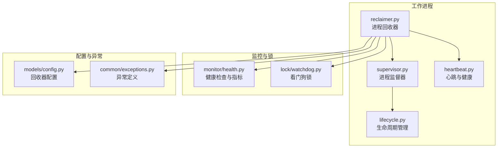
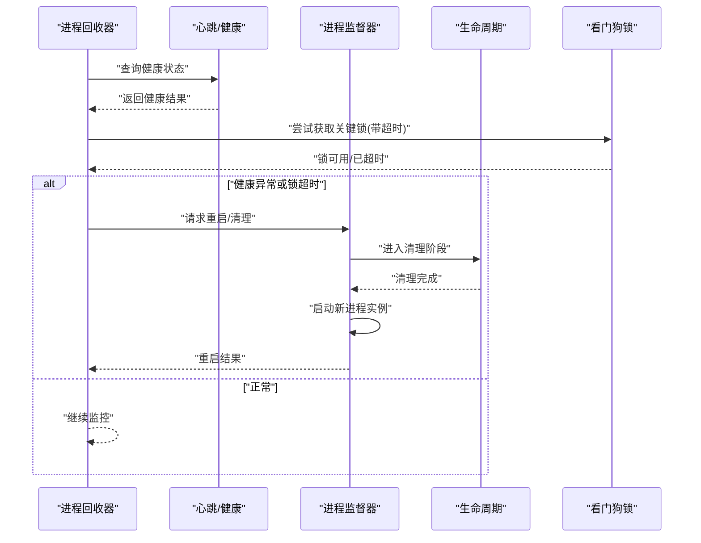
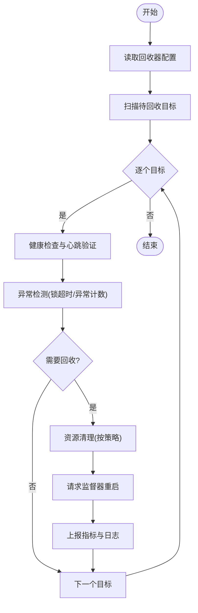
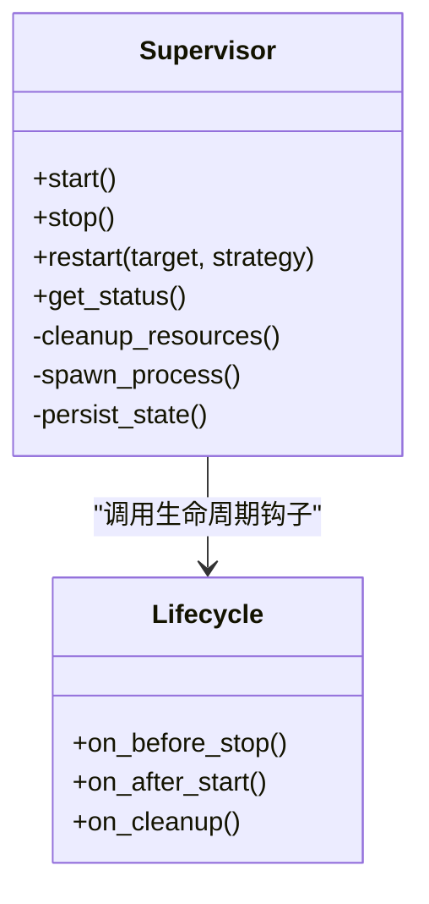
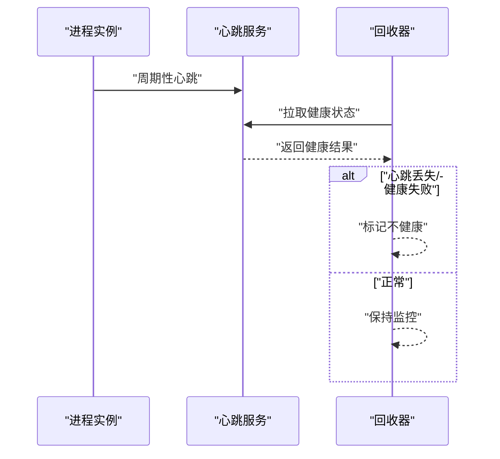
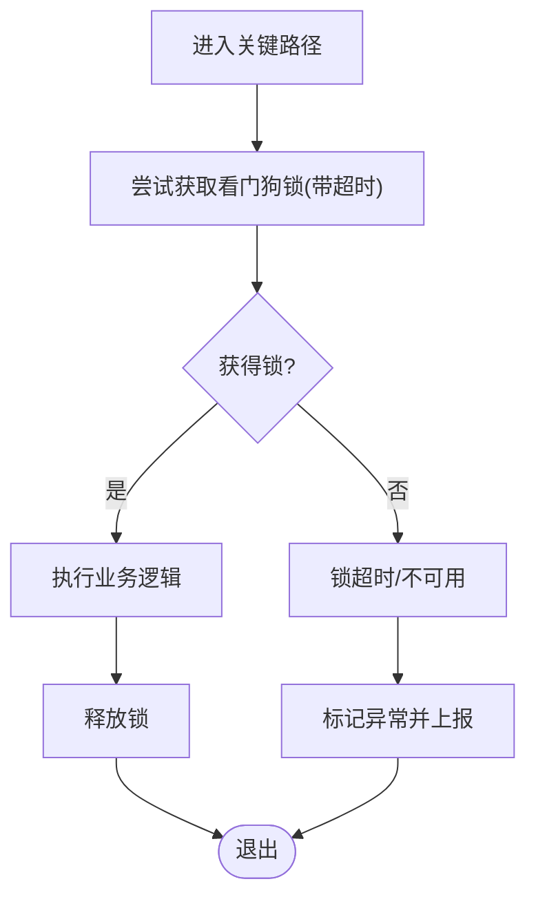
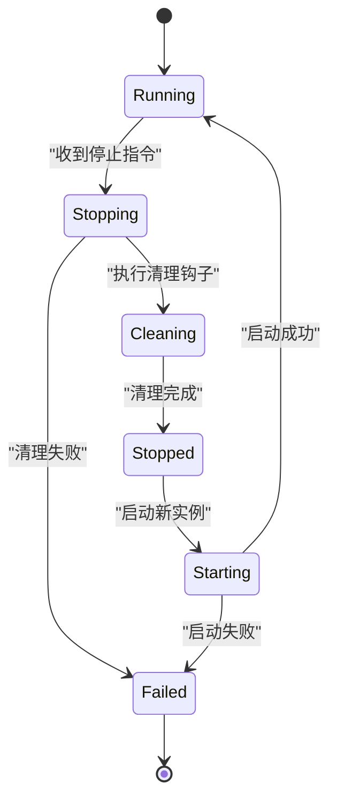
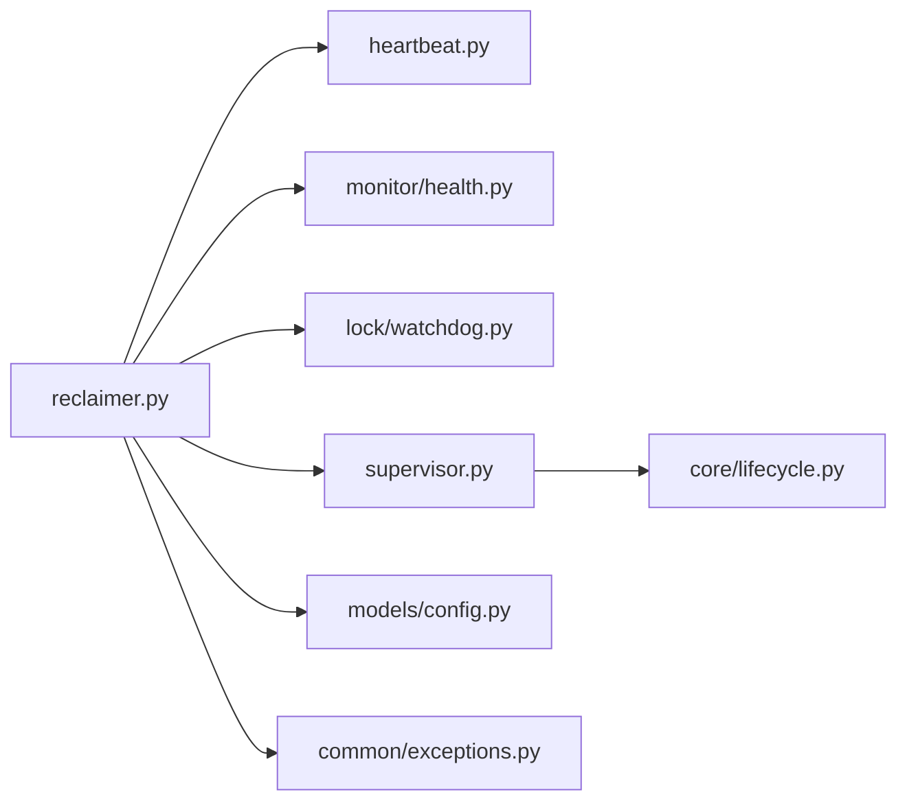

# 进程回收器

<cite>
**本文引用的文件**   
- [src/neotask/worker/reclaimer.py](file://src/neotask/worker/reclaimer.py)
- [src/neotask/worker/supervisor.py](file://src/neotask/worker/supervisor.py)
- [src/neotask/core/lifecycle.py](file://src/neotask/core/lifecycle.py)
- [src/neotask/core/heartbeat.py](file://src/neotask/core/heartbeat.py)
- [src/neotask/models/config.py](file://src/neotask/models/config.py)
- [src/neotask/monitor/health.py](file://src/neotask/monitor/health.py)
- [src/neotask/lock/watchdog.py](file://src/neotask/lock/watchdog.py)
- [src/neotask/common/exceptions.py](file://src/neotask/common/exceptions.py)
- [tests/unit/worker/test_worker.py](file://tests/unit/worker/test_worker.py)
- [tests/integration/test_failure_recovery.py](file://tests/integration/test_failure_recovery.py)
</cite>

## 目录
1. [简介](#简介)
2. [项目结构](#项目结构)
3. [核心组件](#核心组件)
4. [架构总览](#架构总览)
5. [详细组件分析](#详细组件分析)
6. [依赖关系分析](#依赖关系分析)
7. [性能考量](#性能考量)
8. [故障排查指南](#故障排查指南)
9. [结论](#结论)
10. [附录](#附录)

## 简介
本文件系统性阐述进程回收器的设计与实现，覆盖健康检查、异常检测、自动恢复、资源清理与内存泄漏防护等关键机制。同时给出配置项说明、故障处理方案以及对系统性能的影响分析与优化建议，帮助读者在生产环境中正确部署和调优进程回收能力。

## 项目结构
进程回收相关代码主要分布在 worker、core、monitor、lock、models 等模块中：
- worker/reclaimer.py：进程回收主循环与策略执行
- worker/supervisor.py：进程生命周期管理与重启协调
- core/lifecycle.py：任务/进程生命周期钩子与状态机
- core/heartbeat.py：心跳与健康探测
- models/config.py：回收器相关配置模型
- monitor/health.py：健康检查与指标上报
- lock/watchdog.py：看门狗锁与超时保护
- common/exceptions.py：统一异常类型
- tests：单元与集成测试覆盖回收流程与异常场景

图表来源
- [src/neotask/worker/reclaimer.py](file://src/neotask/worker/reclaimer.py)
- [src/neotask/worker/supervisor.py](file://src/neotask/worker/supervisor.py)
- [src/neotask/core/lifecycle.py](file://src/neotask/core/lifecycle.py)
- [src/neotask/core/heartbeat.py](file://src/neotask/core/heartbeat.py)
- [src/neotask/monitor/health.py](file://src/neotask/monitor/health.py)
- [src/neotask/lock/watchdog.py](file://src/neotask/lock/watchdog.py)
- [src/neotask/models/config.py](file://src/neotask/models/config.py)
- [src/neotask/common/exceptions.py](file://src/neotask/common/exceptions.py)

章节来源
- [src/neotask/worker/reclaimer.py](file://src/neotask/worker/reclaimer.py)
- [src/neotask/worker/supervisor.py](file://src/neotask/worker/supervisor.py)
- [src/neotask/core/lifecycle.py](file://src/neotask/core/lifecycle.py)
- [src/neotask/core/heartbeat.py](file://src/neotask/core/heartbeat.py)
- [src/neotask/monitor/health.py](file://src/neotask/monitor/health.py)
- [src/neotask/lock/watchdog.py](file://src/neotask/lock/watchdog.py)
- [src/neotask/models/config.py](file://src/neotask/models/config.py)
- [src/neotask/common/exceptions.py](file://src/neotask/common/exceptions.py)

## 核心组件
- 进程回收器（Reclaimer）
  - 职责：周期性扫描进程状态，触发健康检查、异常检测、资源清理与自动恢复；协调 supervisor 完成重启与迁移。
  - 关键行为：读取配置、订阅事件、调用心跳与健康检查、执行清理策略、记录指标与日志。
- 进程监督器（Supervisor）
  - 职责：维护进程实例的生命周期，负责启动、停止、重启与状态同步。
  - 关键行为：监听回收器指令、执行进程启停、更新持久化状态、处理失败回退。
- 心跳与健康（Heartbeat & Health）
  - 职责：提供进程存活信号与健康探针，支撑超时判定与快速故障发现。
- 看门狗锁（Watchdog Lock）
  - 职责：在关键路径加锁并设置超时，防止死锁与长时间阻塞导致的假死。
- 生命周期（Lifecycle）
  - 职责：定义进程/任务的状态转换与钩子，确保清理与恢复顺序正确。
- 配置（Config）
  - 职责：集中管理回收器阈值、重试次数、超时时间、最大内存占用等参数。
- 异常（Exceptions）
  - 职责：统一定义可观测的异常类型，便于分类处理与告警。

章节来源
- [src/neotask/worker/reclaimer.py](file://src/neotask/worker/reclaimer.py)
- [src/neotask/worker/supervisor.py](file://src/neotask/worker/supervisor.py)
- [src/neotask/core/heartbeat.py](file://src/neotask/core/heartbeat.py)
- [src/neotask/monitor/health.py](file://src/neotask/monitor/health.py)
- [src/neotask/lock/watchdog.py](file://src/neotask/lock/watchdog.py)
- [src/neotask/core/lifecycle.py](file://src/neotask/core/lifecycle.py)
- [src/neotask/models/config.py](file://src/neotask/models/config.py)
- [src/neotask/common/exceptions.py](file://src/neotask/common/exceptions.py)

## 架构总览
进程回收器作为控制面，围绕“检测—决策—执行”的闭环运行：
- 检测：通过心跳与健康检查获取进程状态，结合看门狗锁判断是否卡死或异常退出。
- 决策：依据配置阈值与异常类型决定是否需要清理资源、重启进程或上报告警。
- 执行：调用 supervisor 进行进程重启，触发生命周期钩子完成资源释放与状态复位。

图表来源
- [src/neotask/worker/reclaimer.py](file://src/neotask/worker/reclaimer.py)
- [src/neotask/core/heartbeat.py](file://src/neotask/core/heartbeat.py)
- [src/neotask/monitor/health.py](file://src/neotask/monitor/health.py)
- [src/neotask/lock/watchdog.py](file://src/neotask/lock/watchdog.py)
- [src/neotask/worker/supervisor.py](file://src/neotask/worker/supervisor.py)
- [src/neotask/core/lifecycle.py](file://src/neotask/core/lifecycle.py)

## 详细组件分析

### 进程回收器（Reclaimer）
- 设计要点
  - 周期性调度：基于定时器或事件驱动轮询，避免忙轮询带来的 CPU 抖动。
  - 多源健康数据：聚合心跳、健康探针、锁超时、异常计数等多维度指标。
  - 幂等性：重复触发清理与重启需具备幂等保障，避免二次清理导致错误。
  - 可观测性：对关键动作（检测、决策、执行）打点与记录，便于定位问题。
- 关键流程
  - 读取配置与上下文，初始化健康与锁客户端。
  - 遍历待回收目标，依次执行健康检查与异常检测。
  - 根据策略选择清理范围（仅资源、仅重启、全量恢复）。
  - 调用 supervisor 执行重启，并在生命周期钩子中完成资源释放。
  - 上报指标与日志，进入下一轮监控。

图表来源
- [src/neotask/worker/reclaimer.py](file://src/neotask/worker/reclaimer.py)
- [src/neotask/core/heartbeat.py](file://src/neotask/core/heartbeat.py)
- [src/neotask/monitor/health.py](file://src/neotask/monitor/health.py)
- [src/neotask/lock/watchdog.py](file://src/neotask/lock/watchdog.py)
- [src/neotask/worker/supervisor.py](file://src/neotask/worker/supervisor.py)
- [src/neotask/core/lifecycle.py](file://src/neotask/core/lifecycle.py)

章节来源
- [src/neotask/worker/reclaimer.py](file://src/neotask/worker/reclaimer.py)
- [src/neotask/core/heartbeat.py](file://src/neotask/core/heartbeat.py)
- [src/neotask/monitor/health.py](file://src/neotask/monitor/health.py)
- [src/neotask/lock/watchdog.py](file://src/neotask/lock/watchdog.py)
- [src/neotask/worker/supervisor.py](file://src/neotask/worker/supervisor.py)
- [src/neotask/core/lifecycle.py](file://src/neotask/core/lifecycle.py)

### 进程监督器（Supervisor）
- 设计要点
  - 进程池管理：维护进程实例集合，支持动态扩缩容与优雅停机。
  - 重启策略：支持立即重启、延迟重启与指数退避，避免雪崩。
  - 状态一致性：重启前后状态持久化与校验，保证可恢复性。
- 关键流程
  - 接收回收器指令，进入清理阶段，调用生命周期钩子释放资源。
  - 启动新进程实例，注册心跳与健康端点。
  - 更新状态并通知回收器，完成一次恢复闭环。

图表来源
- [src/neotask/worker/supervisor.py](file://src/neotask/worker/supervisor.py)
- [src/neotask/core/lifecycle.py](file://src/neotask/core/lifecycle.py)

章节来源
- [src/neotask/worker/supervisor.py](file://src/neotask/worker/supervisor.py)
- [src/neotask/core/lifecycle.py](file://src/neotask/core/lifecycle.py)

### 心跳与健康（Heartbeat & Health）
- 设计要点
  - 心跳频率与超时阈值分离，避免误判。
  - 健康探针可扩展，支持自定义业务健康检查。
  - 指标采集与上报，用于可视化与告警。
- 关键流程
  - 进程定期发送心跳，回收器周期性拉取健康状态。
  - 若心跳丢失或健康检查失败，标记为不健康并触发后续流程。

图表来源
- [src/neotask/core/heartbeat.py](file://src/neotask/core/heartbeat.py)
- [src/neotask/monitor/health.py](file://src/neotask/monitor/health.py)
- [src/neotask/worker/reclaimer.py](file://src/neotask/worker/reclaimer.py)

章节来源
- [src/neotask/core/heartbeat.py](file://src/neotask/core/heartbeat.py)
- [src/neotask/monitor/health.py](file://src/neotask/monitor/health.py)
- [src/neotask/worker/reclaimer.py](file://src/neotask/worker/reclaimer.py)

### 看门狗锁（Watchdog Lock）
- 设计要点
  - 关键路径加锁并设置超时，防止长时间阻塞导致假死。
  - 锁持有者异常退出时，锁自动释放，避免死锁。
- 关键流程
  - 回收器在执行高风险操作前尝试获取锁，若超时则判定为异常并触发恢复。

图表来源
- [src/neotask/lock/watchdog.py](file://src/neotask/lock/watchdog.py)
- [src/neotask/worker/reclaimer.py](file://src/neotask/worker/reclaimer.py)

章节来源
- [src/neotask/lock/watchdog.py](file://src/neotask/lock/watchdog.py)
- [src/neotask/worker/reclaimer.py](file://src/neotask/worker/reclaimer.py)

### 生命周期（Lifecycle）
- 设计要点
  - 明确状态转换与钩子顺序，确保清理与恢复有序进行。
  - 钩子可插拔，允许扩展自定义清理逻辑。
- 关键流程
  - 在进程停止前执行 on_before_stop，在清理后执行 on_cleanup，在新进程启动后执行 on_after_start。

图表来源
- [src/neotask/core/lifecycle.py](file://src/neotask/core/lifecycle.py)
- [src/neotask/worker/supervisor.py](file://src/neotask/worker/supervisor.py)

章节来源
- [src/neotask/core/lifecycle.py](file://src/neotask/core/lifecycle.py)
- [src/neotask/worker/supervisor.py](file://src/neotask/worker/supervisor.py)

### 配置（Config）
- 回收器相关配置项（示例字段，具体以源码为准）
  - 健康检查间隔、心跳超时阈值、最大内存占用、异常阈值、重启退避策略、清理深度等。
- 使用方式
  - 通过配置模型加载参数，注入到回收器与监督器中，支持运行时热更新。

章节来源
- [src/neotask/models/config.py](file://src/neotask/models/config.py)

### 异常（Exceptions）
- 统一异常类型
  - 健康异常、锁超时异常、重启失败异常等，便于分类处理与告警。
- 处理策略
  - 根据异常类型选择不同恢复路径，如重试、降级、熔断。

章节来源
- [src/neotask/common/exceptions.py](file://src/neotask/common/exceptions.py)

## 依赖关系分析
- 组件耦合
  - 回收器依赖心跳、健康、看门狗锁与监督器，形成松耦合的协作网络。
  - 监督器依赖生命周期钩子，确保清理与重启的顺序正确。
- 外部依赖
  - 存储与队列可能用于状态持久化与任务分发（视具体实现而定）。
- 潜在环依赖
  - 通过接口抽象与事件解耦避免直接循环导入。

图表来源
- [src/neotask/worker/reclaimer.py](file://src/neotask/worker/reclaimer.py)
- [src/neotask/core/heartbeat.py](file://src/neotask/core/heartbeat.py)
- [src/neotask/monitor/health.py](file://src/neotask/monitor/health.py)
- [src/neotask/lock/watchdog.py](file://src/neotask/lock/watchdog.py)
- [src/neotask/worker/supervisor.py](file://src/neotask/worker/supervisor.py)
- [src/neotask/core/lifecycle.py](file://src/neotask/core/lifecycle.py)
- [src/neotask/models/config.py](file://src/neotask/models/config.py)
- [src/neotask/common/exceptions.py](file://src/neotask/common/exceptions.py)

章节来源
- [src/neotask/worker/reclaimer.py](file://src/neotask/worker/reclaimer.py)
- [src/neotask/core/heartbeat.py](file://src/neotask/core/heartbeat.py)
- [src/neotask/monitor/health.py](file://src/neotask/monitor/health.py)
- [src/neotask/lock/watchdog.py](file://src/neotask/lock/watchdog.py)
- [src/neotask/worker/supervisor.py](file://src/neotask/worker/supervisor.py)
- [src/neotask/core/lifecycle.py](file://src/neotask/core/lifecycle.py)
- [src/neotask/models/config.py](file://src/neotask/models/config.py)
- [src/neotask/common/exceptions.py](file://src/neotask/common/exceptions.py)

## 性能考量
- 检测开销
  - 心跳与健康检查的频率需权衡灵敏度与开销，避免频繁 I/O 与 CPU 占用。
- 锁竞争
  - 看门狗锁的超时与粒度影响并发度，过短超时可能导致误判，过长则降低响应速度。
- 重启风暴
  - 采用指数退避与随机抖动，避免大规模进程同时重启造成雪崩。
- 资源清理
  - 清理策略应幂等且可中断，避免长时间阻塞；优先释放大对象与外部连接。
- 指标与日志
  - 合理采样与分级日志，减少磁盘 I/O 压力；关键路径保留必要信息以便排障。

[本节为通用指导，无需特定文件引用]

## 故障排查指南
- 常见问题
  - 心跳丢失：检查网络连通性与心跳服务可用性。
  - 锁超时：确认关键路径是否存在长事务或阻塞操作。
  - 重启失败：查看生命周期钩子日志与进程启动脚本。
  - 内存泄漏：结合内存指标与堆快照定位泄漏点。
- 定位步骤
  - 查看健康与心跳指标趋势，识别异常时间点。
  - 检索回收器与监督器日志，定位触发条件与决策路径。
  - 检查看门狗锁持有者与等待队列，确认是否存在死锁。
  - 复现异常场景，逐步缩小范围至具体钩子或外部依赖。

章节来源
- [src/neotask/worker/reclaimer.py](file://src/neotask/worker/reclaimer.py)
- [src/neotask/worker/supervisor.py](file://src/neotask/worker/supervisor.py)
- [src/neotask/core/heartbeat.py](file://src/neotask/core/heartbeat.py)
- [src/neotask/monitor/health.py](file://src/neotask/monitor/health.py)
- [src/neotask/lock/watchdog.py](file://src/neotask/lock/watchdog.py)
- [src/neotask/common/exceptions.py](file://src/neotask/common/exceptions.py)

## 结论
进程回收器通过心跳与健康检查、看门狗锁与生命周期钩子的协同，实现了健壮的异常检测与自动恢复能力。合理的配置与策略能有效降低资源泄漏风险，提升系统稳定性。建议在上线前进行充分的压测与混沌演练，持续优化检测阈值与清理策略，确保在高负载与异常场景下的可靠性。

[本节为总结，无需特定文件引用]

## 附录
- 测试覆盖
  - 单元测试覆盖回收器基本流程与边界条件。
  - 集成测试覆盖异常场景与恢复路径，验证端到端稳定性。

章节来源
- [tests/unit/worker/test_worker.py](file://tests/unit/worker/test_worker.py)
- [tests/integration/test_failure_recovery.py](file://tests/integration/test_failure_recovery.py)