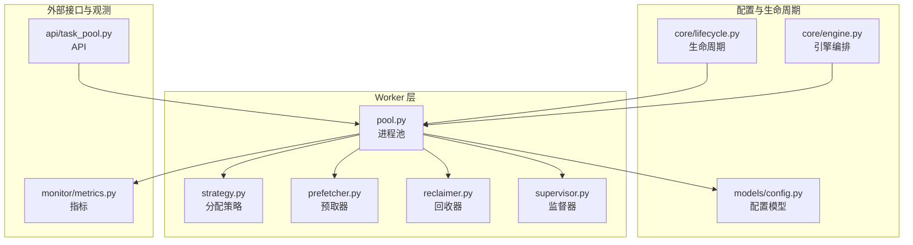
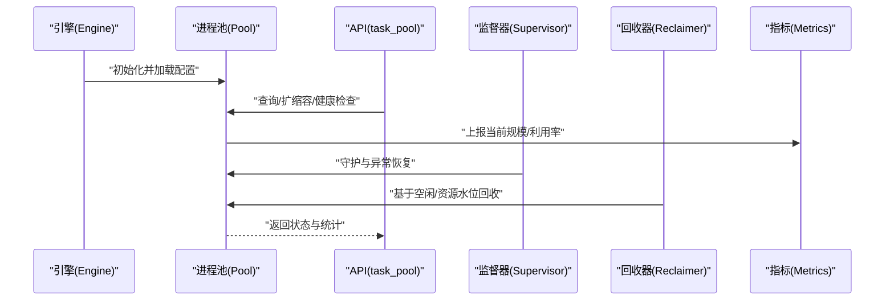
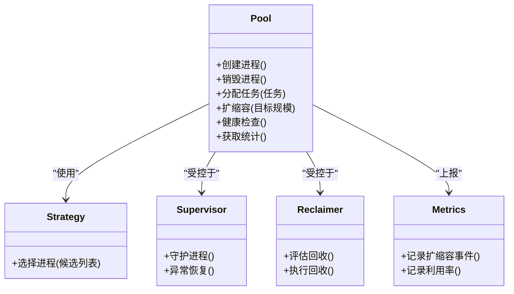
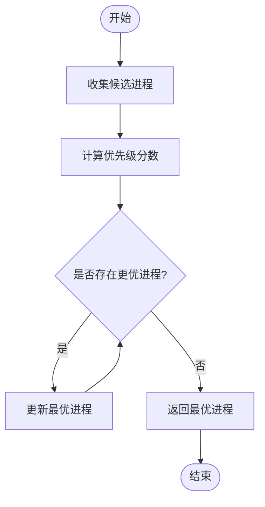
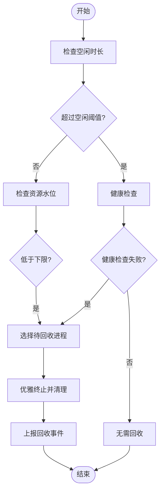
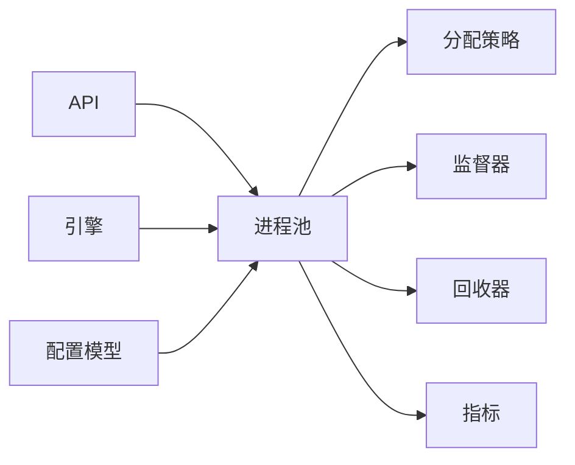

# 进程池管理

<cite>
**本文引用的文件**   
- [src/neotask/worker/pool.py](file://src/neotask/worker/pool.py)
- [src/neotask/worker/supervisor.py](file://src/neotask/worker/supervisor.py)
- [src/neotask/worker/strategy.py](file://src/neotask/worker/strategy.py)
- [src/neotask/worker/prefetcher.py](file://src/neotask/worker/prefetcher.py)
- [src/neotask/worker/reclaimer.py](file://src/neotask/worker/reclaimer.py)
- [src/neotask/models/config.py](file://src/neotask/models/config.py)
- [src/neotask/core/lifecycle.py](file://src/neotask/core/lifecycle.py)
- [src/neotask/core/engine.py](file://src/neotask/core/engine.py)
- [src/neotask/api/task_pool.py](file://src/neotask/api/task_pool.py)
- [src/neotask/monitor/metrics.py](file://src/neotask/monitor/metrics.py)
- [examples/01_simple.py](file://examples/01_simple.py)
- [tests/unit/worker/test_pool.py](file://tests/unit/worker/test_pool.py)
</cite>

## 目录
1. [简介](#简介)
2. [项目结构](#项目结构)
3. [核心组件](#核心组件)
4. [架构总览](#架构总览)
5. [详细组件分析](#详细组件分析)
6. [依赖关系分析](#依赖关系分析)
7. [性能与扩缩容策略](#性能与扩缩容策略)
8. [配置示例与最佳实践](#配置示例与最佳实践)
9. [故障排查指南](#故障排查指南)
10. [结论](#结论)

## 简介
本文件围绕工作进程池的设计与实现，系统阐述其创建、配置与管理机制。重点覆盖最大进程数、最小空闲进程数、生命周期管理、动态扩缩容、资源监控与性能调优等主题，并提供可操作的配置示例与最佳实践建议，帮助读者在生产环境中稳定高效地运行任务调度系统。

## 项目结构
与进程池相关的代码主要分布在 worker 子模块中，并配合模型配置、生命周期与引擎协调、API 暴露以及监控指标等模块协同工作：
- worker 层：负责进程池的创建、调度策略、预取、回收与监督
- models.config：提供进程池相关配置项的数据模型
- core.lifecycle / core.engine：提供生命周期钩子与上层编排入口
- api.task_pool：对外暴露进程池管理能力
- monitor.metrics：采集与上报关键指标
- examples：提供使用示例
- tests：单元测试覆盖关键路径

图表来源
- [src/neotask/worker/pool.py](file://src/neotask/worker/pool.py)
- [src/neotask/worker/strategy.py](file://src/neotask/worker/strategy.py)
- [src/neotask/worker/prefetcher.py](file://src/neotask/worker/prefetcher.py)
- [src/neotask/worker/reclaimer.py](file://src/neotask/worker/reclaimer.py)
- [src/neotask/worker/supervisor.py](file://src/neotask/worker/supervisor.py)
- [src/neotask/models/config.py](file://src/neotask/models/config.py)
- [src/neotask/core/lifecycle.py](file://src/neotask/core/lifecycle.py)
- [src/neotask/core/engine.py](file://src/neotask/core/engine.py)
- [src/neotask/api/task_pool.py](file://src/neotask/api/task_pool.py)
- [src/neotask/monitor/metrics.py](file://src/neotask/monitor/metrics.py)

章节来源
- [src/neotask/worker/pool.py](file://src/neotask/worker/pool.py)
- [src/neotask/models/config.py](file://src/neotask/models/config.py)
- [src/neotask/core/lifecycle.py](file://src/neotask/core/lifecycle.py)
- [src/neotask/core/engine.py](file://src/neotask/core/engine.py)
- [src/neotask/api/task_pool.py](file://src/neotask/api/task_pool.py)
- [src/neotask/monitor/metrics.py](file://src/neotask/monitor/metrics.py)

## 核心组件
- 进程池（Pool）：维护可用工作进程集合，负责进程的创建、销毁、分配与回收；承载扩缩容决策与状态同步。
- 分配策略（Strategy）：定义任务到进程的分配规则（如轮询、最少负载、亲和性等）。
- 预取器（Prefetcher）：在队列侧或进程侧进行任务预取，降低分配延迟。
- 回收器（Reclaimer）：基于空闲时间、资源水位或健康检查触发进程回收。
- 监督器（Supervisor）：守护进程存活、异常重启、资源泄漏检测与自愈。
- 配置模型（Config）：集中描述最大进程数、最小空闲数、扩缩容阈值、超时与重试等参数。
- 生命周期（Lifecycle）：为进程池启动、停止、优雅关闭等阶段提供钩子。
- 引擎（Engine）：上层编排者，驱动进程池与其他子系统协作。
- API（task_pool）：对外暴露进程池能力（查询、扩缩容、健康检查等）。
- 指标（Metrics）：采集并发度、利用率、扩缩容事件、错误率等关键指标。

章节来源
- [src/neotask/worker/pool.py](file://src/neotask/worker/pool.py)
- [src/neotask/worker/strategy.py](file://src/neotask/worker/strategy.py)
- [src/neotask/worker/prefetcher.py](file://src/neotask/worker/prefetcher.py)
- [src/neotask/worker/reclaimer.py](file://src/neotask/worker/reclaimer.py)
- [src/neotask/worker/supervisor.py](file://src/neotask/worker/supervisor.py)
- [src/neotask/models/config.py](file://src/neotask/models/config.py)
- [src/neotask/core/lifecycle.py](file://src/neotask/core/lifecycle.py)
- [src/neotask/core/engine.py](file://src/neotask/core/engine.py)
- [src/neotask/api/task_pool.py](file://src/neotask/api/task_pool.py)
- [src/neotask/monitor/metrics.py](file://src/neotask/monitor/metrics.py)

## 架构总览
下图展示了进程池在系统中的位置及关键交互：引擎初始化后加载配置，构建进程池；API 接收扩缩容与健康检查请求；监督器与回收器按策略调整进程规模；指标模块持续采集运行数据。

图表来源
- [src/neotask/core/engine.py](file://src/neotask/core/engine.py)
- [src/neotask/api/task_pool.py](file://src/neotask/api/task_pool.py)
- [src/neotask/worker/pool.py](file://src/neotask/worker/pool.py)
- [src/neotask/worker/supervisor.py](file://src/neotask/worker/supervisor.py)
- [src/neotask/worker/reclaimer.py](file://src/neotask/worker/reclaimer.py)
- [src/neotask/monitor/metrics.py](file://src/neotask/monitor/metrics.py)

## 详细组件分析

### 进程池（Pool）
- 职责
  - 维护进程集合与状态（活跃、空闲、阻塞、退出）
  - 根据策略将任务分配到具体进程
  - 执行扩缩容决策（扩容/缩容）
  - 与监督器、回收器协作完成生命周期管理
- 关键流程
  - 创建：依据配置实例化进程，注册到内部集合
  - 分配：结合策略选择目标进程，派发任务
  - 回收：根据空闲时长、资源水位或健康检查结果释放进程
  - 扩缩容：响应外部指令或内部阈值触发，动态调整规模
- 复杂度与性能
  - 分配通常为 O(1)~O(logN)，取决于策略与数据结构
  - 扩缩容涉及进程创建/销毁，应控制频率避免抖动

图表来源
- [src/neotask/worker/pool.py](file://src/neotask/worker/pool.py)
- [src/neotask/worker/strategy.py](file://src/neotask/worker/strategy.py)
- [src/neotask/worker/supervisor.py](file://src/neotask/worker/supervisor.py)
- [src/neotask/worker/reclaimer.py](file://src/neotask/worker/reclaimer.py)
- [src/neotask/monitor/metrics.py](file://src/neotask/monitor/metrics.py)

章节来源
- [src/neotask/worker/pool.py](file://src/neotask/worker/pool.py)

### 分配策略（Strategy）
- 常见策略
  - 轮询：均匀分发，适合无状态任务
  - 最少负载：优先选择当前任务较少的进程
  - 亲和性：将特定任务固定到某类进程
- 选择过程
  - 收集候选进程
  - 计算优先级分数
  - 返回最优进程

图表来源
- [src/neotask/worker/strategy.py](file://src/neotask/worker/strategy.py)

章节来源
- [src/neotask/worker/strategy.py](file://src/neotask/worker/strategy.py)

### 预取器（Prefetcher）
- 作用
  - 提前从队列拉取任务，减少分配等待时间
  - 与进程容量和内存水位联动，防止过度预取
- 关键点
  - 预取上限由配置控制
  - 失败重试与退避策略

章节来源
- [src/neotask/worker/prefetcher.py](file://src/neotask/worker/prefetcher.py)

### 回收器（Reclaimer）
- 触发条件
  - 空闲时间超过阈值
  - 资源水位低于下限
  - 健康检查失败
- 执行步骤
  - 评估候选进程
  - 安全终止（等待任务收尾）
  - 清理资源并上报指标

图表来源
- [src/neotask/worker/reclaimer.py](file://src/neotask/worker/reclaimer.py)

章节来源
- [src/neotask/worker/reclaimer.py](file://src/neotask/worker/reclaimer.py)

### 监督器（Supervisor）
- 职责
  - 守护进程存活，异常时自动重启
  - 监控资源泄漏与僵尸进程
  - 与回收器协同，确保整体稳定性
- 行为
  - 周期性巡检
  - 事件驱动恢复
  - 告警与指标上报

章节来源
- [src/neotask/worker/supervisor.py](file://src/neotask/worker/supervisor.py)

### 配置模型（Config）
- 关键参数
  - 最大进程数：限制进程池上限
  - 最小空闲进程数：维持一定冗余以应对突发
  - 扩缩容阈值：CPU/内存/队列长度等触发点
  - 空闲超时：空闲进程回收阈值
  - 预取上限：控制预取数量
  - 健康检查间隔与超时
- 数据来源
  - 配置文件与环境变量
  - 运行时动态调整（通过 API）

章节来源
- [src/neotask/models/config.py](file://src/neotask/models/config.py)

### 生命周期（Lifecycle）与引擎（Engine）
- 生命周期
  - 启动：加载配置、初始化进程池、启动监督与回收
  - 运行：处理任务分配、扩缩容、健康检查
  - 停止：优雅关闭、等待任务完成、释放资源
- 引擎
  - 编排进程池与其他子系统（队列、存储、监控）
  - 提供统一入口与上下文

章节来源
- [src/neotask/core/lifecycle.py](file://src/neotask/core/lifecycle.py)
- [src/neotask/core/engine.py](file://src/neotask/core/engine.py)

### API（task_pool）
- 能力
  - 查询进程池状态与统计
  - 动态扩缩容
  - 健康检查与诊断信息
- 集成
  - 与引擎和进程池对接
  - 输出结构化结果供前端或监控系统消费

章节来源
- [src/neotask/api/task_pool.py](file://src/neotask/api/task_pool.py)

## 依赖关系分析
- 内聚与耦合
  - 进程池对策略、监督器、回收器存在强依赖，但通过接口隔离，保持较高内聚
  - 指标模块为横切关注点，低耦合接入
- 外部依赖
  - 配置模型提供参数来源
  - 引擎作为编排者，向上提供统一入口
- 潜在循环依赖
  - 应避免进程池直接反向依赖引擎，采用回调或事件解耦

图表来源
- [src/neotask/worker/pool.py](file://src/neotask/worker/pool.py)
- [src/neotask/worker/strategy.py](file://src/neotask/worker/strategy.py)
- [src/neotask/worker/supervisor.py](file://src/neotask/worker/supervisor.py)
- [src/neotask/worker/reclaimer.py](file://src/neotask/worker/reclaimer.py)
- [src/neotask/monitor/metrics.py](file://src/neotask/monitor/metrics.py)
- [src/neotask/api/task_pool.py](file://src/neotask/api/task_pool.py)
- [src/neotask/core/engine.py](file://src/neotask/core/engine.py)
- [src/neotask/models/config.py](file://src/neotask/models/config.py)

章节来源
- [src/neotask/worker/pool.py](file://src/neotask/worker/pool.py)
- [src/neotask/models/config.py](file://src/neotask/models/config.py)
- [src/neotask/core/engine.py](file://src/neotask/core/engine.py)
- [src/neotask/api/task_pool.py](file://src/neotask/api/task_pool.py)
- [src/neotask/monitor/metrics.py](file://src/neotask/monitor/metrics.py)

## 性能与扩缩容策略
- 扩缩容策略
  - 基于队列长度：当排队任务超过阈值且平均处理时间较长时扩容；反之缩容
  - 基于资源水位：CPU/内存占用过高时扩容，过低时缩容
  - 基于空闲进程：空闲进程低于最小空闲数时扩容；高于空闲阈值且持续一段时间后缩容
- 防抖与平滑
  - 设置冷却时间与最小扩缩容步长，避免频繁抖动
  - 渐进式扩缩容，逐步增加/减少进程
- 资源监控
  - 采集并发度、利用率、扩缩容事件、错误率、任务延迟等指标
  - 结合告警阈值进行主动干预
- 性能调优
  - 合理设置最大进程数与最小空闲数，平衡吞吐与资源消耗
  - 调整预取上限，避免内存压力
  - 优化分配策略，减少热点与倾斜
  - 定期评估健康检查间隔与超时，提升自愈效率

[本节为通用指导，不直接分析具体文件]

## 配置示例与最佳实践
- 示例参考
  - 快速上手示例：展示如何创建与运行任务，间接体现进程池的使用方式
  - 单元测试：覆盖进程池关键路径，验证扩缩容与回收逻辑
- 最佳实践
  - 初始规模：根据历史峰值与平均负载设定最小空闲与最大进程数
  - 扩缩容阈值：结合业务 SLA 与资源成本，设置合理的触发点
  - 健康检查：短间隔+快速失败，提高异常发现速度
  - 优雅关闭：确保任务完成后再释放资源，避免中断
  - 指标与告警：建立关键指标看板与告警规则，及时发现问题

章节来源
- [examples/01_simple.py](file://examples/01_simple.py)
- [tests/unit/worker/test_pool.py](file://tests/unit/worker/test_pool.py)

## 故障排查指南
- 常见问题
  - 进程频繁重启：检查健康检查与异常恢复逻辑，确认资源是否不足
  - 扩缩容抖动：调整冷却时间与扩缩容步长，避免阈值过于敏感
  - 任务堆积：评估预取上限与分配策略，必要时扩容或优化任务粒度
  - 资源泄漏：观察监督器日志与指标，定位未释放资源
- 排查步骤
  - 查看进程池状态与统计（API）
  - 核对扩缩容事件与指标趋势
  - 检查健康检查与回收器日志
  - 复现问题并调整配置，观察效果

章节来源
- [src/neotask/api/task_pool.py](file://src/neotask/api/task_pool.py)
- [src/neotask/worker/supervisor.py](file://src/neotask/worker/supervisor.py)
- [src/neotask/worker/reclaimer.py](file://src/neotask/worker/reclaimer.py)
- [src/neotask/monitor/metrics.py](file://src/neotask/monitor/metrics.py)

## 结论
进程池通过策略化分配、自动化扩缩容与完善的生命周期管理，实现了高吞吐与高可用的任务处理能力。结合资源监控与性能调优，可在不同负载场景下保持稳定与高效。建议在生产环境结合业务特征与资源约束，制定合理的配置与告警策略，并持续迭代优化。