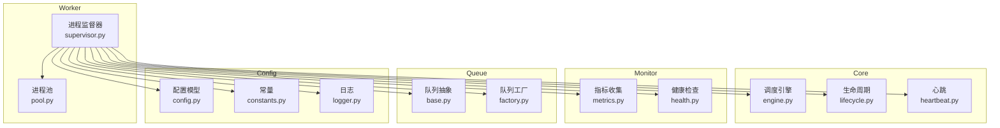
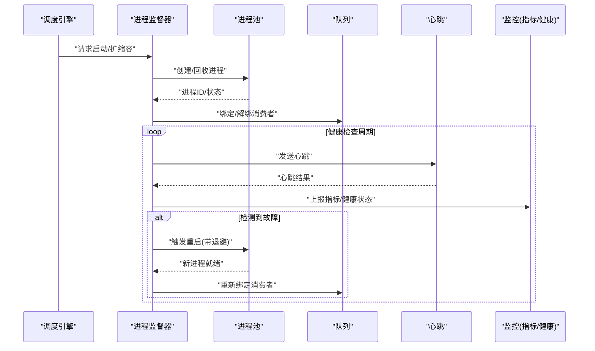
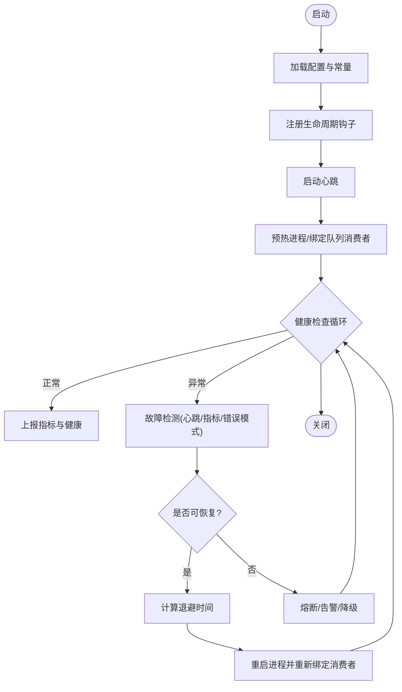
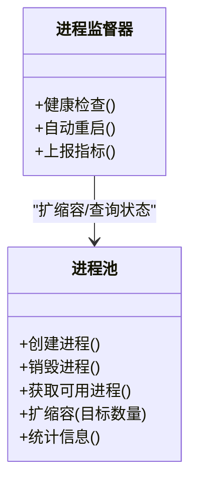
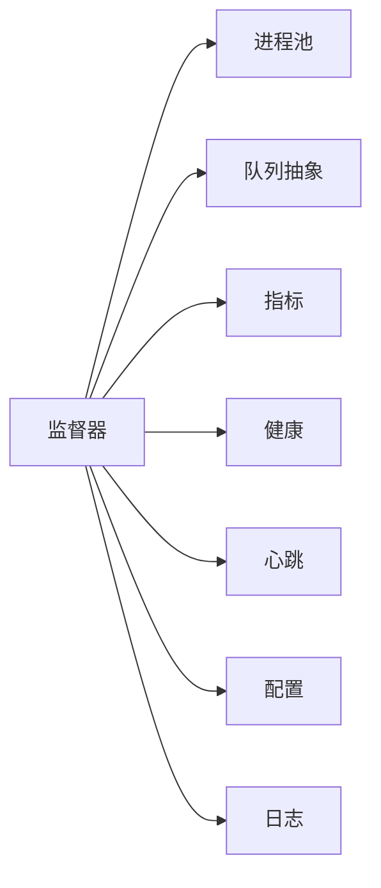

# 进程监督器

<cite>
**本文引用的文件**   
- [src/neotask/worker/supervisor.py](file://src/neotask/worker/supervisor.py)
- [src/neotask/worker/pool.py](file://src/neotask/worker/pool.py)
- [src/neotask/core/engine.py](file://src/neotask/core/engine.py)
- [src/neotask/core/lifecycle.py](file://src/neotask/core/lifecycle.py)
- [src/neotask/core/heartbeat.py](file://src/neotask/core/heartbeat.py)
- [src/neotask/monitor/metrics.py](file://src/neotask/monitor/metrics.py)
- [src/neotask/monitor/health.py](file://src/neotask/monitor/health.py)
- [src/neotask/queue/base.py](file://src/neotask/queue/base.py)
- [src/neotask/queue/factory.py](file://src/neotask/queue/factory.py)
- [src/neotask/models/config.py](file://src/neotask/models/config.py)
- [src/neotask/common/constants.py](file://src/neotask/common/constants.py)
- [src/neotask/common/logger.py](file://src/neotask/common/logger.py)
- [examples/01_simple.py](file://examples/01_simple.py)
</cite>

## 目录
1. [简介](#简介)
2. [项目结构](#项目结构)
3. [核心组件](#核心组件)
4. [架构总览](#架构总览)
5. [详细组件分析](#详细组件分析)
6. [依赖关系分析](#依赖关系分析)
7. [性能考量](#性能考量)
8. [故障排查指南](#故障排查指南)
9. [结论](#结论)
10. [附录](#附录)

## 简介
本文件聚焦于“进程监督器”的架构设计与实现原理，围绕以下目标展开：
- 进程状态监控与故障检测机制
- 自动重启策略与恢复流程
- 与进程池、任务队列的交互方式
- 配置参数与监控指标
- 故障恢复最佳实践与性能优化建议

该监督器位于 worker 层，负责生命周期管理、健康检查、异常捕获与重启编排，并与调度引擎、队列、存储和监控系统协同工作。

## 项目结构
与进程监督器相关的代码主要分布在如下模块：
- worker：进程监督器与进程池的实现
- core：调度引擎、生命周期与心跳
- monitor：指标与健康检查
- queue：队列抽象与工厂
- models/config：配置模型
- common：常量、日志等通用能力
- examples：示例用法

图表来源
- [src/neotask/worker/supervisor.py](file://src/neotask/worker/supervisor.py)
- [src/neotask/worker/pool.py](file://src/neotask/worker/pool.py)
- [src/neotask/core/engine.py](file://src/neotask/core/engine.py)
- [src/neotask/core/lifecycle.py](file://src/neotask/core/lifecycle.py)
- [src/neotask/core/heartbeat.py](file://src/neotask/core/heartbeat.py)
- [src/neotask/monitor/metrics.py](file://src/neotask/monitor/metrics.py)
- [src/neotask/monitor/health.py](file://src/neotask/monitor/health.py)
- [src/neotask/queue/base.py](file://src/neotask/queue/base.py)
- [src/neotask/queue/factory.py](file://src/neotask/queue/factory.py)
- [src/neotask/models/config.py](file://src/neotask/models/config.py)
- [src/neotask/common/constants.py](file://src/neotask/common/constants.py)
- [src/neotask/common/logger.py](file://src/neotask/common/logger.py)

章节来源
- [src/neotask/worker/supervisor.py](file://src/neotask/worker/supervisor.py)
- [src/neotask/worker/pool.py](file://src/neotask/worker/pool.py)
- [src/neotask/core/engine.py](file://src/neotask/core/engine.py)
- [src/neotask/core/lifecycle.py](file://src/neotask/core/lifecycle.py)
- [src/neotask/core/heartbeat.py](file://src/neotask/core/heartbeat.py)
- [src/neotask/monitor/metrics.py](file://src/neotask/monitor/metrics.py)
- [src/neotask/monitor/health.py](file://src/neotask/monitor/health.py)
- [src/neotask/queue/base.py](file://src/neotask/queue/base.py)
- [src/neotask/queue/factory.py](file://src/neotask/queue/factory.py)
- [src/neotask/models/config.py](file://src/neotask/models/config.py)
- [src/neotask/common/constants.py](file://src/neotask/common/constants.py)
- [src/neotask/common/logger.py](file://src/neotask/common/logger.py)

## 核心组件
- 进程监督器：负责进程的创建、启动、停止、重启、健康检查与事件上报；协调与进程池、队列、引擎的交互。
- 进程池：维护一组可复用的工作进程，提供分配、回收、扩容缩容能力。
- 调度引擎：负责任务分发、执行上下文管理与整体运行控制。
- 生命周期：定义系统各阶段的启动、就绪、关闭等钩子。
- 心跳：周期性上报健康状态，支撑外部监控与故障判定。
- 指标与健康：采集关键指标（吞吐、延迟、失败率等）并暴露健康探针。
- 队列抽象与工厂：统一任务入队/出队接口，支持多种后端。
- 配置与常量：集中管理监督器行为参数与全局常量。
- 日志：结构化输出与分级控制，便于定位问题。

章节来源
- [src/neotask/worker/supervisor.py](file://src/neotask/worker/supervisor.py)
- [src/neotask/worker/pool.py](file://src/neotask/worker/pool.py)
- [src/neotask/core/engine.py](file://src/neotask/core/engine.py)
- [src/neotask/core/lifecycle.py](file://src/neotask/core/lifecycle.py)
- [src/neotask/core/heartbeat.py](file://src/neotask/core/heartbeat.py)
- [src/neotask/monitor/metrics.py](file://src/neotask/monitor/metrics.py)
- [src/neotask/monitor/health.py](file://src/neotask/monitor/health.py)
- [src/neotask/queue/base.py](file://src/neotask/queue/base.py)
- [src/neotask/queue/factory.py](file://src/neotask/queue/factory.py)
- [src/neotask/models/config.py](file://src/neotask/models/config.py)
- [src/neotask/common/constants.py](file://src/neotask/common/constants.py)
- [src/neotask/common/logger.py](file://src/neotask/common/logger.py)

## 架构总览
进程监督器作为 Worker 层的“管家”，向上对接调度引擎与监控子系统，向下管理进程池与队列资源。其职责包括：
- 进程生命周期编排：创建、启动、停止、优雅关闭
- 健康探测与故障检测：基于心跳、指标阈值与错误模式
- 自动重启与退避：指数退避、最大重试次数、熔断保护
- 与队列协作：在进程不可用时暂停消费或降级处理
- 指标上报：将关键指标推送到监控系统

图表来源
- [src/neotask/worker/supervisor.py](file://src/neotask/worker/supervisor.py)
- [src/neotask/worker/pool.py](file://src/neotask/worker/pool.py)
- [src/neotask/core/engine.py](file://src/neotask/core/engine.py)
- [src/neotask/core/heartbeat.py](file://src/neotask/core/heartbeat.py)
- [src/neotask/monitor/metrics.py](file://src/neotask/monitor/metrics.py)
- [src/neotask/monitor/health.py](file://src/neotask/monitor/health.py)
- [src/neotask/queue/base.py](file://src/neotask/queue/base.py)

## 详细组件分析

### 进程监督器（Supervisor）
- 职责
  - 进程生命周期管理：创建、启动、停止、优雅关闭
  - 健康检查：心跳、指标阈值、错误模式识别
  - 自动重启：指数退避、最大重试、熔断保护
  - 与进程池协作：按需扩缩容、资源隔离
  - 与队列协作：消费者绑定/解绑、背压与降级
  - 指标与健康上报：吞吐、延迟、失败率、存活状态
- 关键流程
  - 启动阶段：初始化配置、注册生命周期钩子、启动心跳、预热进程
  - 运行阶段：周期性健康检查、指标采集、动态扩缩容
  - 故障处理：检测异常、记录根因、触发重启、上报告警
  - 关闭阶段：优雅停止、释放资源、持久化状态

图表来源
- [src/neotask/worker/supervisor.py](file://src/neotask/worker/supervisor.py)
- [src/neotask/core/heartbeat.py](file://src/neotask/core/heartbeat.py)
- [src/neotask/monitor/metrics.py](file://src/neotask/monitor/metrics.py)
- [src/neotask/monitor/health.py](file://src/neotask/monitor/health.py)
- [src/neotask/queue/base.py](file://src/neotask/queue/base.py)

章节来源
- [src/neotask/worker/supervisor.py](file://src/neotask/worker/supervisor.py)
- [src/neotask/core/heartbeat.py](file://src/neotask/core/heartbeat.py)
- [src/neotask/monitor/metrics.py](file://src/neotask/monitor/metrics.py)
- [src/neotask/monitor/health.py](file://src/neotask/monitor/health.py)
- [src/neotask/queue/base.py](file://src/neotask/queue/base.py)

### 进程池（Pool）
- 职责
  - 维护固定或弹性大小的工作进程集合
  - 提供进程创建、销毁、复用与隔离
  - 支持按容量/负载进行扩缩容
- 与监督器交互
  - 接收监督器的扩缩容指令
  - 返回进程状态与资源占用信息
  - 在进程异常退出时通知监督器

图表来源
- [src/neotask/worker/pool.py](file://src/neotask/worker/pool.py)
- [src/neotask/worker/supervisor.py](file://src/neotask/worker/supervisor.py)

章节来源
- [src/neotask/worker/pool.py](file://src/neotask/worker/pool.py)
- [src/neotask/worker/supervisor.py](file://src/neotask/worker/supervisor.py)

### 调度引擎（Engine）
- 职责
  - 任务分发与执行上下文管理
  - 与监督器协作以保障执行环境稳定
- 与监督器交互
  - 在需要时触发扩缩容
  - 接收健康状态变更，调整任务派发策略

章节来源
- [src/neotask/core/engine.py](file://src/neotask/core/engine.py)
- [src/neotask/worker/supervisor.py](file://src/neotask/worker/supervisor.py)

### 生命周期（Lifecycle）
- 职责
  - 定义系统启动、就绪、关闭等阶段钩子
  - 为监督器提供扩展点，便于接入自定义逻辑

章节来源
- [src/neotask/core/lifecycle.py](file://src/neotask/core/lifecycle.py)
- [src/neotask/worker/supervisor.py](file://src/neotask/worker/supervisor.py)

### 心跳（Heartbeat）
- 职责
  - 周期性上报健康状态
  - 支撑外部系统与监督器进行故障判定

章节来源
- [src/neotask/core/heartbeat.py](file://src/neotask/core/heartbeat.py)
- [src/neotask/worker/supervisor.py](file://src/neotask/worker/supervisor.py)

### 监控（Metrics & Health）
- 指标
  - 进程存活数、重启次数、失败率、平均延迟、吞吐
- 健康
  - 存活探针、依赖健康（队列/存储）、资源水位

章节来源
- [src/neotask/monitor/metrics.py](file://src/neotask/monitor/metrics.py)
- [src/neotask/monitor/health.py](file://src/neotask/monitor/health.py)
- [src/neotask/worker/supervisor.py](file://src/neotask/worker/supervisor.py)

### 队列（Queue Base & Factory）
- 职责
  - 统一任务入队/出队接口
  - 支持多后端实现与动态选择
- 与监督器交互
  - 在进程不可用时暂停消费或降级
  - 在进程恢复后重新绑定消费者

章节来源
- [src/neotask/queue/base.py](file://src/neotask/queue/base.py)
- [src/neotask/queue/factory.py](file://src/neotask/queue/factory.py)
- [src/neotask/worker/supervisor.py](file://src/neotask/worker/supervisor.py)

### 配置与常量（Config & Constants）
- 配置项
  - 进程池大小、最大并发、超时、退避策略、熔断阈值、指标采样频率等
- 常量
  - 默认值、状态码、错误分类等

章节来源
- [src/neotask/models/config.py](file://src/neotask/models/config.py)
- [src/neotask/common/constants.py](file://src/neotask/common/constants.py)
- [src/neotask/worker/supervisor.py](file://src/neotask/worker/supervisor.py)

### 日志（Logger）
- 职责
  - 结构化日志输出、分级控制、上下文注入
- 使用场景
  - 故障定位、审计追踪、调试诊断

章节来源
- [src/neotask/common/logger.py](file://src/neotask/common/logger.py)
- [src/neotask/worker/supervisor.py](file://src/neotask/worker/supervisor.py)

## 依赖关系分析
- 内聚性
  - 监督器对进程池、队列、监控、心跳、配置的依赖清晰，职责单一且边界明确
- 耦合度
  - 通过抽象接口（队列、指标、健康）降低与具体实现的耦合
- 外部依赖
  - 队列后端、存储、监控系统等通过工厂与配置注入

图表来源
- [src/neotask/worker/supervisor.py](file://src/neotask/worker/supervisor.py)
- [src/neotask/worker/pool.py](file://src/neotask/worker/pool.py)
- [src/neotask/queue/base.py](file://src/neotask/queue/base.py)
- [src/neotask/monitor/metrics.py](file://src/neotask/monitor/metrics.py)
- [src/neotask/monitor/health.py](file://src/neotask/monitor/health.py)
- [src/neotask/core/heartbeat.py](file://src/neotask/core/heartbeat.py)
- [src/neotask/models/config.py](file://src/neotask/models/config.py)
- [src/neotask/common/logger.py](file://src/neotask/common/logger.py)

章节来源
- [src/neotask/worker/supervisor.py](file://src/neotask/worker/supervisor.py)
- [src/neotask/worker/pool.py](file://src/neotask/worker/pool.py)
- [src/neotask/queue/base.py](file://src/neotask/queue/base.py)
- [src/neotask/monitor/metrics.py](file://src/neotask/monitor/metrics.py)
- [src/neotask/monitor/health.py](file://src/neotask/monitor/health.py)
- [src/neotask/core/heartbeat.py](file://src/neotask/core/heartbeat.py)
- [src/neotask/models/config.py](file://src/neotask/models/config.py)
- [src/neotask/common/logger.py](file://src/neotask/common/logger.py)

## 性能考量
- 扩缩容策略
  - 基于负载与队列积压动态调整进程数量，避免频繁抖动
- 退避与熔断
  - 指数退避减少雪崩风险；熔断防止持续失败导致资源耗尽
- 指标采样
  - 合理采样频率与聚合窗口，平衡精度与开销
- 资源隔离
  - 进程级隔离提升稳定性，结合内存/CPU限制避免争用
- 队列背压
  - 在进程不可用时暂停消费，避免堆积放大

[本节为通用指导，不直接分析具体文件]

## 故障排查指南
- 常见问题
  - 进程频繁重启：检查心跳超时、指标阈值、错误模式与退避配置
  - 任务堆积：确认队列消费者绑定、进程可用性、扩缩容策略
  - 指标缺失：核对指标上报路径与采样频率
- 定位步骤
  - 查看日志：关注异常堆栈、重启原因、健康状态变化
  - 检查配置：对比当前配置与期望值，验证常量默认值
  - 观察指标：失败率、延迟、吞吐、存活进程数
  - 验证依赖：队列、存储、监控服务的连通性与健康
- 恢复建议
  - 临时扩容缓解压力
  - 启用熔断与降级，优先保证核心链路
  - 逐步回滚到稳定版本

章节来源
- [src/neotask/common/logger.py](file://src/neotask/common/logger.py)
- [src/neotask/monitor/metrics.py](file://src/neotask/monitor/metrics.py)
- [src/neotask/monitor/health.py](file://src/neotask/monitor/health.py)
- [src/neotask/models/config.py](file://src/neotask/models/config.py)
- [src/neotask/common/constants.py](file://src/neotask/common/constants.py)

## 结论
进程监督器通过健康检查、自动重启与退避熔断等机制，保障了工作进程的高可用与系统的韧性。其与进程池、任务队列、监控与心跳的紧密协作，形成了稳定的执行底座。合理的配置与监控指标是发挥其效能的关键。

[本节为总结性内容，不直接分析具体文件]

## 附录

### 配置参数清单（节选）
- 进程池相关
  - 初始进程数、最大进程数、最小空闲进程数
- 健康检查
  - 心跳间隔、超时阈值、健康探针路径
- 重启策略
  - 最大重试次数、退避基数、退避上限、熔断阈值
- 指标与监控
  - 指标采样频率、上报目标、保留窗口
- 队列集成
  - 消费者绑定策略、背压阈值、重连间隔

章节来源
- [src/neotask/models/config.py](file://src/neotask/models/config.py)
- [src/neotask/common/constants.py](file://src/neotask/common/constants.py)
- [src/neotask/worker/supervisor.py](file://src/neotask/worker/supervisor.py)

### 监控指标清单（节选）
- 进程存活数、重启次数、失败率
- 平均延迟、P95/P99 延迟
- 吞吐（任务完成/秒）
- 队列积压、消费者活跃数
- 资源水位（CPU/内存）

章节来源
- [src/neotask/monitor/metrics.py](file://src/neotask/monitor/metrics.py)
- [src/neotask/monitor/health.py](file://src/neotask/monitor/health.py)
- [src/neotask/worker/supervisor.py](file://src/neotask/worker/supervisor.py)

### 快速上手示例
- 参考示例脚本了解基本用法与常见配置项

章节来源
- [examples/01_simple.py](file://examples/01_simple.py)