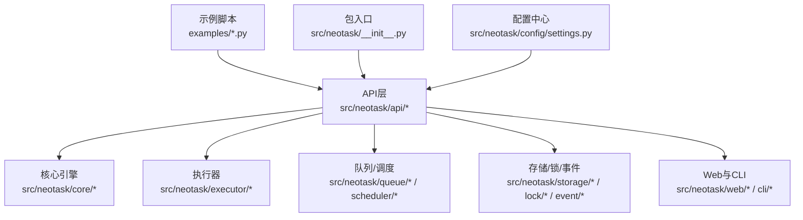
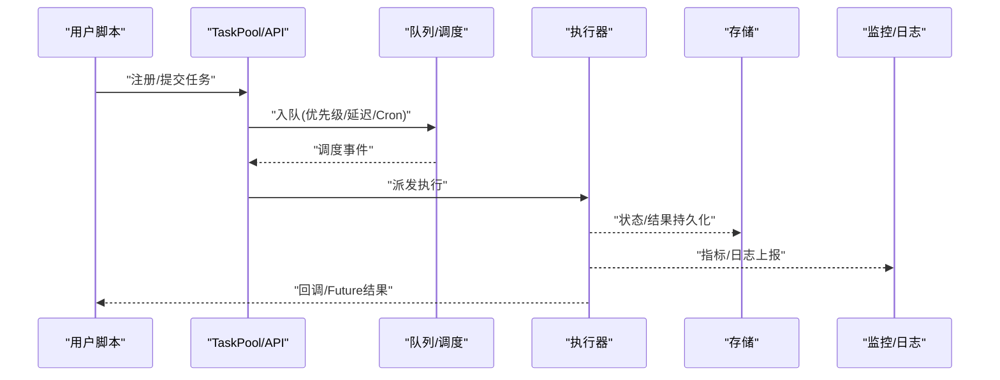
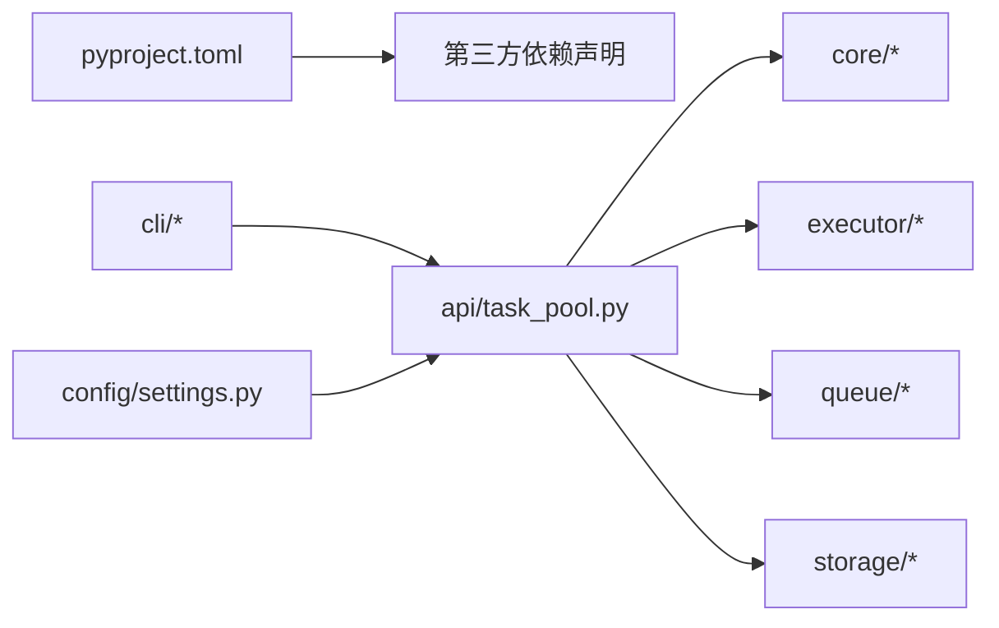

# 快速开始

<cite>
**本文引用的文件**   
- [README_zh.md](file://README_zh.md)
- [pyproject.toml](file://pyproject.toml)
- [00_quick_start.py](file://examples/00_quick_start.py)
- [01_simple.py](file://examples/01_simple.py)
- [02_context_manager.py](file://examples/02_context_manager.py)
- [03_priority.py](file://examples/03_priority.py)
- [04_events.py](file://examples/04_events.py)
- [05_cron_tasks.py](file://examples/05_cron_tasks.py)
- [06_delayed_tasks.py](file://examples/06_delayed_tasks.py)
- [07_batch.py](file://examples/07_batch.py)
- [08_periodic.py](file://examples/08_periodic.py)
- [09_retry_and_cancel.py](file://examples/09_retry_and_cancel.py)
- [10_task_query.py](file://examples/10_task查询.py)
- [99_all_features.py](file://examples/99_all_features.py)
- [task_pool.py](file://src/neotask/api/task_pool.py)
- [task_scheduler.py](file://src/neotask/api/task_scheduler.py)
- [__init__.py](file://src/neotask/__init__.py)
- [settings.py](file://src/neotask/config/settings.py)
- [main.py](file://src/neotask/cli/main.py)
- [start.py](file://src/neotask/cli/commands/start.py)
- [webui.py](file://src/neotask/cli/webui.py)
</cite>

## 目录
1. [简介](#简介)
2. [项目结构](#项目结构)
3. [核心组件](#核心组件)
4. [架构总览](#架构总览)
5. [详细组件分析](#详细组件分析)
6. [依赖分析](#依赖分析)
7. [性能考虑](#性能考虑)
8. [故障排查指南](#故障排查指南)
9. [结论](#结论)
10. [附录](#附录)

## 简介
本快速开始指南帮助你在5分钟内运行第一个任务调度程序。你将完成环境准备、安装（pip/源码/Docker）、基础配置与使用示例，并逐步从简单任务过渡到复杂调度。文档涵盖核心概念：TaskPool、任务注册、任务执行等，确保新手顺利上手并理解基本工作原理。

## 项目结构
仓库采用分层模块化组织，核心API位于 src/neotask/api，CLI入口在 src/neotask/cli，示例脚本集中在 examples。配置文件位于 src/neotask/config，分布式、存储、队列、锁、监控等能力按模块划分。

图表来源
- [task_pool.py](file://src/neotask/api/task_pool.py)
- [task_scheduler.py](file://src/neotask/api/task_scheduler.py)
- [__init__.py](file://src/neotask/__init__.py)
- [settings.py](file://src/neotask/config/settings.py)
- [main.py](file://src/neotask/cli/main.py)

章节来源
- [README_zh.md](file://README_zh.md)
- [pyproject.toml](file://pyproject.toml)

## 核心组件
- TaskPool：任务池，负责任务的注册、生命周期管理与执行分发。
- 任务调度器：提供定时、周期、延迟、Cron等调度能力。
- 执行器：线程/进程/异步等多种执行后端。
- 存储与队列：内存/SQLite/Redis等持久化与任务队列。
- CLI与WebUI：命令行启动与可视化界面。

章节来源
- [task_pool.py](file://src/neotask/api/task_pool.py)
- [task_scheduler.py](file://src/neotask/api/task_scheduler.py)
- [__init__.py](file://src/neotask/__init__.py)

## 架构总览
下图展示了从用户脚本到任务执行的端到端流程：示例脚本通过API创建任务，任务进入队列，由调度器触发，执行器执行，结果可落盘或上报监控。

图表来源
- [task_pool.py](file://src/neotask/api/task_pool.py)
- [task_scheduler.py](file://src/neotask/api/task_scheduler.py)
- [settings.py](file://src/neotask/config/settings.py)

## 详细组件分析

### 5分钟快速开始（推荐路径）
- 目标：在本地运行一个最简单的任务。
- 步骤概览：
  1) 安装依赖与环境准备
  2) 运行示例脚本
  3) 查看输出与日志
- 参考示例：
  - [00_quick_start.py](file://examples/00_quick_start.py)
  - [01_simple.py](file://examples/01_simple.py)

章节来源
- [00_quick_start.py](file://examples/00_quick_start.py)
- [01_simple.py](file://examples/01_simple.py)

### 安装与环境准备
- Python版本要求：参见项目配置。
- pip安装：
  - 使用包管理器安装当前发行版。
  - 参考：[pyproject.toml](file://pyproject.toml)
- 源码安装：
  - 克隆仓库后，在项目根目录执行安装命令。
  - 参考：[pyproject.toml](file://pyproject.toml)
- Docker部署：
  - 使用官方镜像拉取并运行容器，挂载必要目录。
  - 参考：[pyproject.toml](file://pyproject.toml)

章节来源
- [pyproject.toml](file://pyproject.toml)

### 基础配置
- 全局设置：通过配置中心加载默认值与环境变量覆盖。
- 常用项：日志级别、存储后端、队列类型、并发度等。
- 参考：
  - [settings.py](file://src/neotask/config/settings.py)
  - [__init__.py](file://src/neotask/__init__.py)

章节来源
- [settings.py](file://src/neotask/config/settings.py)
- [__init__.py](file://src/neotask/__init__.py)

### 基本用法与渐进式学习路径
- 简单任务：定义函数并提交到任务池。
  - 参考：[01_simple.py](file://examples/01_simple.py)
- 上下文管理器模式：自动管理任务池生命周期。
  - 参考：[02_context_manager.py](file://examples/02_context_manager.py)
- 优先级任务：为任务设置优先级，高优先先执行。
  - 参考：[03_priority.py](file://examples/03_priority.py)
- 事件机制：订阅任务生命周期事件（开始、完成、失败）。
  - 参考：[04_events.py](file://examples/04_events.py)
- Cron任务：基于表达式周期性执行。
  - 参考：[05_cron_tasks.py](file://examples/05_cron_tasks.py)
- 延迟任务：指定未来时间执行。
  - 参考：[06_delayed_tasks.py](file://examples/06_delayed_tasks.py)
- 批量任务：一次性提交多个任务。
  - 参考：[07_batch.py](file://examples/07_batch.py)
- 周期任务：固定间隔重复执行。
  - 参考：[08_periodic.py](file://examples/08_periodic.py)
- 重试与取消：失败重试策略与任务取消。
  - 参考：[09_retry_and_cancel.py](file://examples/09_retry_and_cancel.py)
- 任务查询：查询任务状态、统计信息。
  - 参考：[10_task_query.py](file://examples/10_task查询.py)
- 全功能演示：综合展示所有特性。
  - 参考：[99_all_features.py](file://examples/99_all_features.py)

章节来源
- [01_simple.py](file://examples/01_simple.py)
- [02_context_manager.py](file://examples/02_context_manager.py)
- [03_priority.py](file://examples/03_priority.py)
- [04_events.py](file://examples/04_events.py)
- [05_cron_tasks.py](file://examples/05_cron_tasks.py)
- [06_delayed_tasks.py](file://examples/06_delayed_tasks.py)
- [07_batch.py](file://examples/07_batch.py)
- [08_periodic.py](file://examples/08_periodic.py)
- [09_retry_and_cancel.py](file://examples/09_retry_and_cancel.py)
- [10_task_query.py](file://examples/10_task查询.py)
- [99_all_features.py](file://examples/99_all_features.py)

### 命令行与WebUI
- 启动服务：通过CLI启动调度服务。
  - 参考：[main.py](file://src/neotask/cli/main.py)、[start.py](file://src/neotask/cli/commands/start.py)
- WebUI：访问可视化界面查看任务与监控。
  - 参考：[webui.py](file://src/neotask/cli/webui.py)

章节来源
- [main.py](file://src/neotask/cli/main.py)
- [start.py](file://src/neotask/cli/commands/start.py)
- [webui.py](file://src/neotask/cli/webui.py)

## 依赖分析
- 外部依赖：Python标准库与第三方库（如存储/队列/监控相关），以 pyproject.toml 为准。
- 内部依赖：API层依赖核心引擎、执行器、队列与存储；CLI依赖API与配置。

图表来源
- [pyproject.toml](file://pyproject.toml)
- [task_pool.py](file://src/neotask/api/task_pool.py)
- [settings.py](file://src/neotask/config/settings.py)

章节来源
- [pyproject.toml](file://pyproject.toml)
- [task_pool.py](file://src/neotask/api/task_pool.py)
- [settings.py](file://src/neotask/config/settings.py)

## 性能考虑
- 合理设置并发度与队列容量，避免阻塞与内存膨胀。
- 选择合适存储后端（内存/SQLite/Redis）权衡吞吐与持久化。
- 利用优先级与批处理提升吞吐。
- 开启监控与日志以便定位瓶颈。

## 故障排查指南
- 常见问题：
  - 端口冲突：检查WebUI与API端口占用。
  - 存储不可用：确认SQLite/Redis连接与权限。
  - 任务不执行：检查调度表达式、延迟时间与队列状态。
- 建议操作：
  - 提高日志级别，观察关键链路。
  - 使用任务查询接口核对任务状态。
  - 隔离测试：先用内存存储验证逻辑。

## 结论
通过本指南，你已掌握安装、配置、基础用法与进阶特性，能够从零构建并运行任务调度程序。建议结合示例脚本逐步实践，并根据业务需求选择合适的执行器、存储与监控方案。

## 附录
- 示例索引：
  - [00_quick_start.py](file://examples/00_quick_start.py)
  - [01_simple.py](file://examples/01_simple.py)
  - [02_context_manager.py](file://examples/02_context_manager.py)
  - [03_priority.py](file://examples/03_priority.py)
  - [04_events.py](file://examples/04_events.py)
  - [05_cron_tasks.py](file://examples/05_cron_tasks.py)
  - [06_delayed_tasks.py](file://examples/06_delayed_tasks.py)
  - [07_batch.py](file://examples/07_batch.py)
  - [08_periodic.py](file://examples/08_periodic.py)
  - [09_retry_and_cancel.py](file://examples/09_retry_and_cancel.py)
  - [10_task_query.py](file://examples/10_task查询.py)
  - [99_all_features.py](file://examples/99_all_features.py)
- 核心API：
  - [task_pool.py](file://src/neotask/api/task_pool.py)
  - [task_scheduler.py](file://src/neotask/api/task_scheduler.py)
- 配置与入口：
  - [settings.py](file://src/neotask/config/settings.py)
  - [main.py](file://src/neotask/cli/main.py)
  - [start.py](file://src/neotask/cli/commands/start.py)
  - [webui.py](file://src/neotask/cli/webui.py)
- 包元数据：
  - [pyproject.toml](file://pyproject.toml)
  - [README_zh.md](file://README_zh.md)