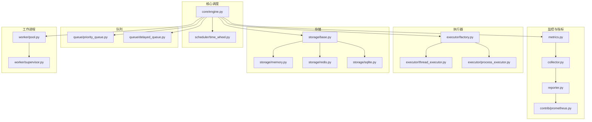
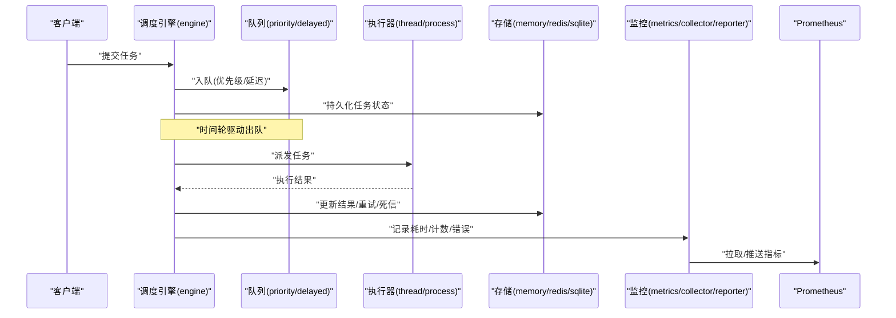
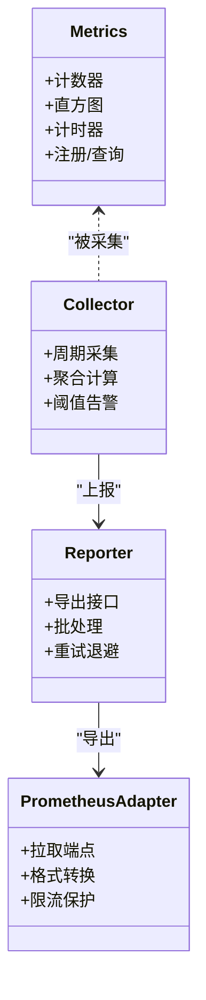
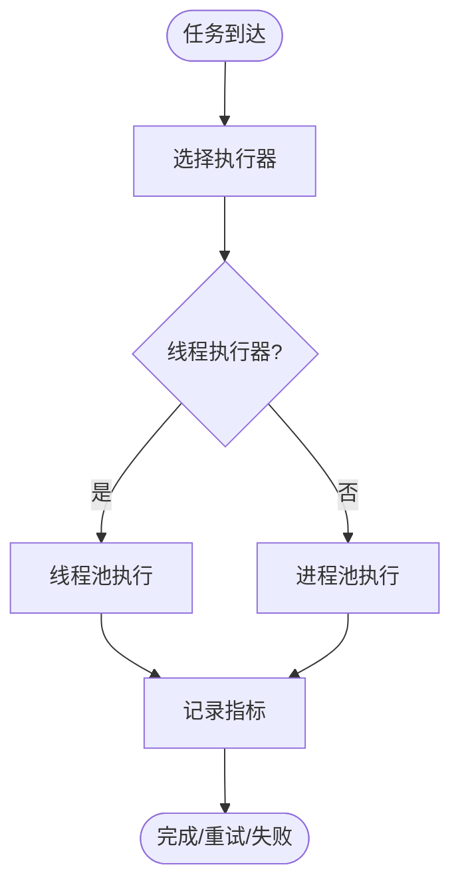
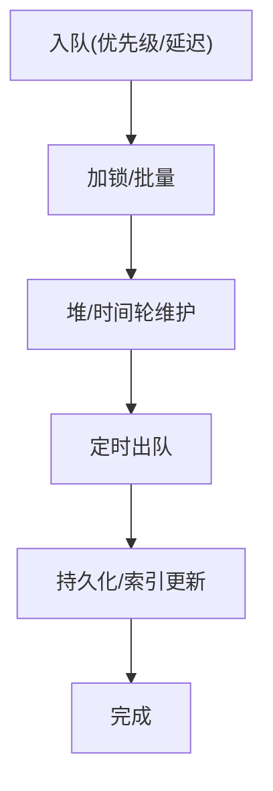
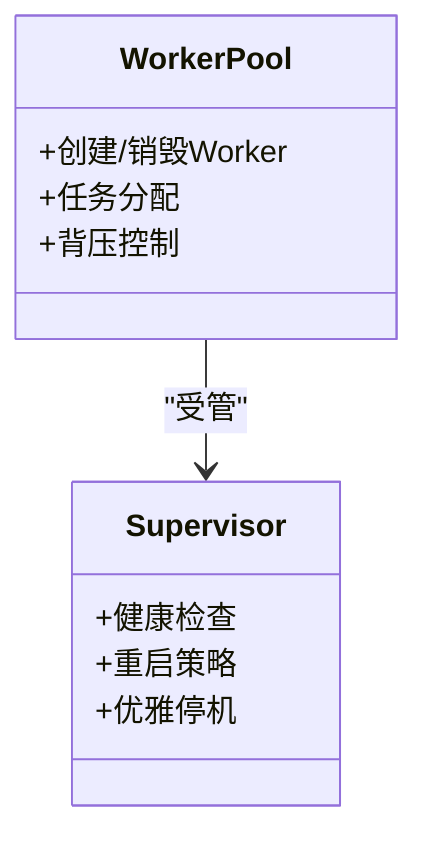
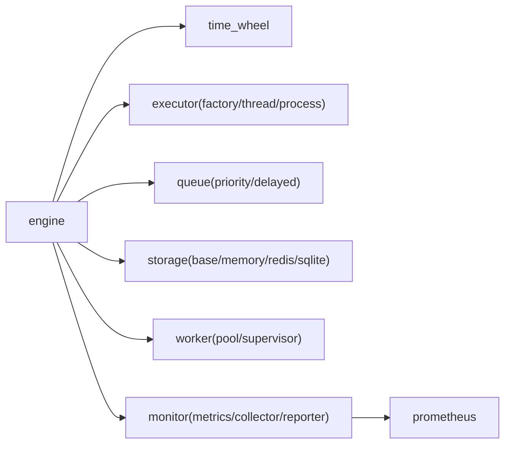

# 性能优化

<cite>
**本文引用的文件**   
- [README_zh.md](file://README_zh.md)
- [pyproject.toml](file://pyproject.toml)
- [src/neotask/monitor/metrics.py](file://src/neotask/monitor/metrics.py)
- [src/neotask/monitor/collector.py](file://src/neotask/monitor/collector.py)
- [src/neotask/monitor/reporter.py](file://src/neotask/monitor/reporter.py)
- [src/neotask/contrib/prometheus.py](file://src/neotask/contrib/prometheus.py)
- [src/neotask/core/engine.py](file://src/neotask/core/engine.py)
- [src/neotask/executor/factory.py](file://src/neotask/executor/factory.py)
- [src/neotask/executor/thread_executor.py](file://src/neotask/executor/thread_executor.py)
- [src/neotask/executor/process_executor.py](file://src/neotask/executor/process_executor.py)
- [src/neotask/queue/priority_queue.py](file://src/neotask/queue/priority_queue.py)
- [src/neotask/queue/delayed_queue.py](file://src/neotask/queue/delayed_queue.py)
- [src/neotask/scheduler/time_wheel.py](file://src/neotask/scheduler/time_wheel.py)
- [src/neotask/storage/base.py](file://src/neotask/storage/base.py)
- [src/neotask/storage/memory.py](file://src/neotask/storage/memory.py)
- [src/neotask/storage/redis.py](file://src/neotask/storage/redis.py)
- [src/neotask/storage/sqlite.py](file://src/neotask/storage/sqlite.py)
- [src/neotask/worker/pool.py](file://src/neotask/worker/pool.py)
- [src/neotask/worker/supervisor.py](file://src/neotask/worker/supervisor.py)
- [tests/benchmark/run_benchmark.py](file://tests/benchmark/run_benchmark.py)
- [tests/benchmark/run_fast.py](file://tests/benchmark/run_fast.py)
- [tests/benchmark/test_performance.py](file://tests/benchmark/test_performance.py)
- [scripts/run_benchmarks.sh](file://scripts/run_benchmarks.sh)
- [docs/性能基准测试.md](file://docs/性能基准测试.md)
</cite>

## 目录
1. [简介](#简介)
2. [项目结构](#项目结构)
3. [核心组件](#核心组件)
4. [架构总览](#架构总览)
5. [详细组件分析](#详细组件分析)
6. [依赖分析](#依赖分析)
7. [性能考虑](#性能考虑)
8. [故障排查指南](#故障排查指南)
9. [结论](#结论)
10. [附录](#附录)

## 简介
本文件聚焦于任务调度系统的性能优化方法与工程实践，覆盖以下主题：
- 性能基准测试的搭建与执行方法
- 关键性能指标的监控与分析技术
- 系统瓶颈识别、性能调优与容量规划
- 不同场景下的优化案例与最佳实践
- 性能问题诊断工具与排查技巧

目标读者包括开发者、运维工程师与性能工程师。文档以仓库现有实现为依据，结合通用性能工程方法论，提供可落地的指导。

## 项目结构
本项目在源码中提供了完善的监控与度量基础设施（metrics、collector、reporter、prometheus），并在测试与脚本层提供了基准测试入口与快速运行方式。存储层支持内存、SQLite、Redis等多种后端；执行器支持线程与进程两种模式；队列包含优先级队列与延迟队列；调度器包含时间轮等高效数据结构。这些模块共同决定了系统的吞吐、时延与可扩展性上限。

图表来源
- [src/neotask/core/engine.py](file://src/neotask/core/engine.py)
- [src/neotask/scheduler/time_wheel.py](file://src/neotask/scheduler/time_wheel.py)
- [src/neotask/executor/factory.py](file://src/neotask/executor/factory.py)
- [src/neotask/executor/thread_executor.py](file://src/neotask/executor/thread_executor.py)
- [src/neotask/executor/process_executor.py](file://src/neotask/executor/process_executor.py)
- [src/neotask/queue/priority_queue.py](file://src/neotask/queue/priority_queue.py)
- [src/neotask/queue/delayed_queue.py](file://src/neotask/queue/delayed_queue.py)
- [src/neotask/storage/base.py](file://src/neotask/storage/base.py)
- [src/neotask/storage/memory.py](file://src/neotask/storage/memory.py)
- [src/neotask/storage/redis.py](file://src/neotask/storage/redis.py)
- [src/neotask/storage/sqlite.py](file://src/neotask/storage/sqlite.py)
- [src/neotask/worker/pool.py](file://src/neotask/worker/pool.py)
- [src/neotask/worker/supervisor.py](file://src/neotask/worker/supervisor.py)
- [src/neotask/monitor/metrics.py](file://src/neotask/monitor/metrics.py)
- [src/neotask/monitor/collector.py](file://src/neotask/monitor/collector.py)
- [src/neotask/monitor/reporter.py](file://src/neotask/monitor/reporter.py)
- [src/neotask/contrib/prometheus.py](file://src/neotask/contrib/prometheus.py)

章节来源
- [README_zh.md](file://README_zh.md)
- [pyproject.toml](file://pyproject.toml)

## 核心组件
- 监控与指标子系统
  - metrics：定义计数器、直方图、计时器等指标类型与采集接口
  - collector：周期性收集各模块指标并聚合
  - reporter：将指标导出到外部系统（如Prometheus）
  - prometheus：Prometheus集成适配层
- 调度与执行
  - engine：调度主循环、任务分发、生命周期管理
  - time_wheel：时间轮用于周期/延迟任务的触发
  - executor factory：根据配置选择线程或进程执行器
  - thread/process executor：具体执行上下文与资源隔离
- 队列与存储
  - priority_queue：基于堆的高并发优先级队列
  - delayed_queue：基于时间轮/堆的延迟出队
  - storage base/memory/redis/sqlite：统一存储抽象及多后端实现
- 工作进程
  - worker pool：工作池管理与复用
  - supervisor：进程级健康检查与重启策略

章节来源
- [src/neotask/monitor/metrics.py](file://src/neotask/monitor/metrics.py)
- [src/neotask/monitor/collector.py](file://src/neotask/monitor/collector.py)
- [src/neotask/monitor/reporter.py](file://src/neotask/monitor/reporter.py)
- [src/neotask/contrib/prometheus.py](file://src/neotask/contrib/prometheus.py)
- [src/neotask/core/engine.py](file://src/neotask/core/engine.py)
- [src/neotask/scheduler/time_wheel.py](file://src/neotask/scheduler/time_wheel.py)
- [src/neotask/executor/factory.py](file://src/neotask/executor/factory.py)
- [src/neotask/executor/thread_executor.py](file://src/neotask/executor/thread_executor.py)
- [src/neotask/executor/process_executor.py](file://src/neotask/executor/process_executor.py)
- [src/neotask/queue/priority_queue.py](file://src/neotask/queue/priority_queue.py)
- [src/neotask/queue/delayed_queue.py](file://src/neotask/queue/delayed_queue.py)
- [src/neotask/storage/base.py](file://src/neotask/storage/base.py)
- [src/neotask/storage/memory.py](file://src/neotask/storage/memory.py)
- [src/neotask/storage/redis.py](file://src/neotask/storage/redis.py)
- [src/neotask/storage/sqlite.py](file://src/neotask/storage/sqlite.py)
- [src/neotask/worker/pool.py](file://src/neotask/worker/pool.py)
- [src/neotask/worker/supervisor.py](file://src/neotask/worker/supervisor.py)

## 架构总览
下图展示了从任务提交到执行、再到指标上报的关键路径，以及存储与队列的交互关系。

图表来源
- [src/neotask/core/engine.py](file://src/neotask/core/engine.py)
- [src/neotask/queue/priority_queue.py](file://src/neotask/queue/priority_queue.py)
- [src/neotask/queue/delayed_queue.py](file://src/neotask/queue/delayed_queue.py)
- [src/neotask/executor/thread_executor.py](file://src/neotask/executor/thread_executor.py)
- [src/neotask/executor/process_executor.py](file://src/neotask/executor/process_executor.py)
- [src/neotask/storage/base.py](file://src/neotask/storage/base.py)
- [src/neotask/storage/memory.py](file://src/neotask/storage/memory.py)
- [src/neotask/storage/redis.py](file://src/neotask/storage/redis.py)
- [src/neotask/storage/sqlite.py](file://src/neotask/storage/sqlite.py)
- [src/neotask/monitor/metrics.py](file://src/neotask/monitor/metrics.py)
- [src/neotask/monitor/collector.py](file://src/neotask/monitor/collector.py)
- [src/neotask/monitor/reporter.py](file://src/neotask/monitor/reporter.py)
- [src/neotask/contrib/prometheus.py](file://src/neotask/contrib/prometheus.py)

## 详细组件分析

### 监控与指标子系统
- 设计要点
  - 指标类型：计数器（累计量）、直方图（分布与时延）、计时器（区间统计）
  - 采集频率：collector按周期聚合，避免高频采样带来的开销
  - 导出通道：reporter对接Prometheus或其他监控系统
- 关键路径
  - 任务生命周期埋点：入队、出队、开始、完成、失败、重试、超时
  - 资源使用：CPU、内存、GC、锁等待、IO等待
  - 业务指标：吞吐、P95/P99、错误率、积压量
- 优化建议
  - 控制采样粒度与频率，避免热点路径上的额外同步
  - 对高基数标签进行降维，防止指标爆炸
  - 批量上报与合并，降低网络与序列化开销

图表来源
- [src/neotask/monitor/metrics.py](file://src/neotask/monitor/metrics.py)
- [src/neotask/monitor/collector.py](file://src/neotask/monitor/collector.py)
- [src/neotask/monitor/reporter.py](file://src/neotask/monitor/reporter.py)
- [src/neotask/contrib/prometheus.py](file://src/neotask/contrib/prometheus.py)

章节来源
- [src/neotask/monitor/metrics.py](file://src/neotask/monitor/metrics.py)
- [src/neotask/monitor/collector.py](file://src/neotask/monitor/collector.py)
- [src/neotask/monitor/reporter.py](file://src/neotask/monitor/reporter.py)
- [src/neotask/contrib/prometheus.py](file://src/neotask/contrib/prometheus.py)

### 调度与执行
- 调度引擎
  - 负责任务生命周期、事件分发、重试与补偿
  - 与时间轮协作，保证周期/延迟任务的高效触发
- 执行器
  - 线程执行器：适合I/O密集型、轻量CPU任务
  - 进程执行器：适合CPU密集、需隔离的任务
  - 工厂根据配置动态选择执行器
- 优化建议
  - 合理设置线程/进程池大小，避免过度竞争
  - 使用无锁或低锁数据结构减少争用
  - 对长尾任务采用分片与并行化

图表来源
- [src/neotask/core/engine.py](file://src/neotask/core/engine.py)
- [src/neotask/executor/factory.py](file://src/neotask/executor/factory.py)
- [src/neotask/executor/thread_executor.py](file://src/neotask/executor/thread_executor.py)
- [src/neotask/executor/process_executor.py](file://src/neotask/executor/process_executor.py)

章节来源
- [src/neotask/core/engine.py](file://src/neotask/core/engine.py)
- [src/neotask/executor/factory.py](file://src/neotask/executor/factory.py)
- [src/neotask/executor/thread_executor.py](file://src/neotask/executor/thread_executor.py)
- [src/neotask/executor/process_executor.py](file://src/neotask/executor/process_executor.py)

### 队列与存储
- 优先级队列
  - 基于堆结构，O(log n)插入与弹出
  - 在高并发下注意锁粒度与批量操作
- 延迟队列
  - 结合时间轮/堆实现延迟出队
  - 关注过期扫描频率与内存占用
- 存储后端
  - memory：零拷贝、极低延迟，适合单机与缓存
  - sqlite：简单部署，适合中小规模
  - redis：分布式共享、高吞吐，但存在网络与序列化成本
- 优化建议
  - 批量入队/出队，减少锁竞争与网络往返
  - 大对象外存化，避免内存膨胀
  - 读写分离与冷热分层

图表来源
- [src/neotask/queue/priority_queue.py](file://src/neotask/queue/priority_queue.py)
- [src/neotask/queue/delayed_queue.py](file://src/neotask/queue/delayed_queue.py)
- [src/neotask/storage/base.py](file://src/neotask/storage/base.py)
- [src/neotask/storage/memory.py](file://src/neotask/storage/memory.py)
- [src/neotask/storage/redis.py](file://src/neotask/storage/redis.py)
- [src/neotask/storage/sqlite.py](file://src/neotask/storage/sqlite.py)

章节来源
- [src/neotask/queue/priority_queue.py](file://src/neotask/queue/priority_queue.py)
- [src/neotask/queue/delayed_queue.py](file://src/neotask/queue/delayed_queue.py)
- [src/neotask/storage/base.py](file://src/neotask/storage/base.py)
- [src/neotask/storage/memory.py](file://src/neotask/storage/memory.py)
- [src/neotask/storage/redis.py](file://src/neotask/storage/redis.py)
- [src/neotask/storage/sqlite.py](file://src/neotask/storage/sqlite.py)

### 工作进程与容错
- 工作池
  - 管理Worker生命周期、任务分配与回收
  - 支持预取与背压，避免过载
- 监督者
  - 健康检查、自动重启、优雅停机
- 优化建议
  - 根据CPU核数与任务特性调整池大小
  - 引入限流与熔断，保护下游依赖
  - 使用幂等设计与重试策略，提升鲁棒性

图表来源
- [src/neotask/worker/pool.py](file://src/neotask/worker/pool.py)
- [src/neotask/worker/supervisor.py](file://src/neotask/worker/supervisor.py)

章节来源
- [src/neotask/worker/pool.py](file://src/neotask/worker/pool.py)
- [src/neotask/worker/supervisor.py](file://src/neotask/worker/supervisor.py)

## 依赖分析
- 内部依赖
  - engine依赖time_wheel、executor、queue、storage、worker与monitor
  - monitor通过collector聚合各模块指标，并通过reporter导出
- 外部依赖
  - Redis/SQLite作为存储后端
  - Prometheus作为指标采集系统
- 潜在风险
  - 存储后端切换可能带来性能差异
  - 高并发下锁竞争与序列化开销
  - 指标上报阻塞主流程的风险

图表来源
- [src/neotask/core/engine.py](file://src/neotask/core/engine.py)
- [src/neotask/scheduler/time_wheel.py](file://src/neotask/scheduler/time_wheel.py)
- [src/neotask/executor/factory.py](file://src/neotask/executor/factory.py)
- [src/neotask/executor/thread_executor.py](file://src/neotask/executor/thread_executor.py)
- [src/neotask/executor/process_executor.py](file://src/neotask/executor/process_executor.py)
- [src/neotask/queue/priority_queue.py](file://src/neotask/queue/priority_queue.py)
- [src/neotask/queue/delayed_queue.py](file://src/neotask/queue/delayed_queue.py)
- [src/neotask/storage/base.py](file://src/neotask/storage/base.py)
- [src/neotask/storage/memory.py](file://src/neotask/storage/memory.py)
- [src/neotask/storage/redis.py](file://src/neotask/storage/redis.py)
- [src/neotask/storage/sqlite.py](file://src/neotask/storage/sqlite.py)
- [src/neotask/worker/pool.py](file://src/neotask/worker/pool.py)
- [src/neotask/worker/supervisor.py](file://src/neotask/worker/supervisor.py)
- [src/neotask/monitor/metrics.py](file://src/neotask/monitor/metrics.py)
- [src/neotask/monitor/collector.py](file://src/neotask/monitor/collector.py)
- [src/neotask/monitor/reporter.py](file://src/neotask/monitor/reporter.py)
- [src/neotask/contrib/prometheus.py](file://src/neotask/contrib/prometheus.py)

## 性能考虑
- 基准测试搭建与执行
  - 使用测试套件中的基准入口与快速脚本，构建端到端负载模型
  - 推荐指标：吞吐（TPS/QPS）、时延（P50/P95/P99）、错误率、资源利用率
  - 参考路径：
    - [tests/benchmark/run_benchmark.py](file://tests/benchmark/run_benchmark.py)
    - [tests/benchmark/run_fast.py](file://tests/benchmark/run_fast.py)
    - [tests/benchmark/test_performance.py](file://tests/benchmark/test_performance.py)
    - [scripts/run_benchmarks.sh](file://scripts/run_benchmarks.sh)
    - [docs/性能基准测试.md](file://docs/性能基准测试.md)
- 关键指标监控与分析
  - 任务维度：入队/出队耗时、执行耗时、重试次数、失败原因
  - 系统维度：CPU、内存、GC、锁等待、IO吞吐、网络RTT
  - 存储维度：写放大、读放大、命中率、连接池使用率
  - 参考实现：
    - [src/neotask/monitor/metrics.py](file://src/neotask/monitor/metrics.py)
    - [src/neotask/monitor/collector.py](file://src/neotask/monitor/collector.py)
    - [src/neotask/monitor/reporter.py](file://src/neotask/monitor/reporter.py)
    - [src/neotask/contrib/prometheus.py](file://src/neotask/contrib/prometheus.py)
- 瓶颈识别与调优
  - CPU瓶颈：增加并行度、优化算法复杂度、减少锁竞争
  - IO瓶颈：批量操作、异步化、缓存热点数据
  - 存储瓶颈：选择合适的后端、索引优化、读写分离
  - 网络瓶颈：压缩、连接复用、就近部署
- 容量规划
  - 依据峰值QPS与P99时延目标，估算所需CPU核数与内存
  - 评估存储IOPS与带宽需求，预留冗余
  - 设计水平扩展方案（分片、多实例、负载均衡）

章节来源
- [tests/benchmark/run_benchmark.py](file://tests/benchmark/run_benchmark.py)
- [tests/benchmark/run_fast.py](file://tests/benchmark/run_fast.py)
- [tests/benchmark/test_performance.py](file://tests/benchmark/test_performance.py)
- [scripts/run_benchmarks.sh](file://scripts/run_benchmarks.sh)
- [docs/性能基准测试.md](file://docs/性能基准测试.md)
- [src/neotask/monitor/metrics.py](file://src/neotask/monitor/metrics.py)
- [src/neotask/monitor/collector.py](file://src/neotask/monitor/collector.py)
- [src/neotask/monitor/reporter.py](file://src/neotask/monitor/reporter.py)
- [src/neotask/contrib/prometheus.py](file://src/neotask/contrib/prometheus.py)

## 故障排查指南
- 定位慢任务
  - 通过任务ID追踪全链路耗时，对比入队、出队、执行阶段
  - 检查执行器日志与异常栈，确认是否由锁等待或外部依赖导致
- 监控异常
  - 观察错误率与时延突增，关联最近变更（代码、配置、依赖）
  - 使用Prometheus面板查看指标趋势与热点
- 存储问题
  - 检查连接池、慢查询、磁盘IO与锁冲突
  - 对比memory/redis/sqlite在不同负载下的表现
- 常用工具
  - 内置指标与报告：[src/neotask/monitor/reporter.py](file://src/neotask/monitor/reporter.py)
  - Prometheus抓取：[src/neotask/contrib/prometheus.py](file://src/neotask/contrib/prometheus.py)
  - 基准回归：[tests/benchmark/test_performance.py](file://tests/benchmark/test_performance.py)

章节来源
- [src/neotask/monitor/reporter.py](file://src/neotask/monitor/reporter.py)
- [src/neotask/contrib/prometheus.py](file://src/neotask/contrib/prometheus.py)
- [tests/benchmark/test_performance.py](file://tests/benchmark/test_performance.py)

## 结论
通过建立完善的指标体系与基准测试，结合对调度、执行、队列与存储的深度优化，可以显著提升任务调度系统的吞吐与时延表现。建议在上线前进行容量规划与压测，持续监控关键指标，形成闭环的性能治理机制。

## 附录
- 相关文档与示例
  - 中文说明：[README_zh.md](file://README_zh.md)
  - 项目配置与依赖：[pyproject.toml](file://pyproject.toml)
  - 基准测试文档：[docs/性能基准测试.md](file://docs/性能基准测试.md)