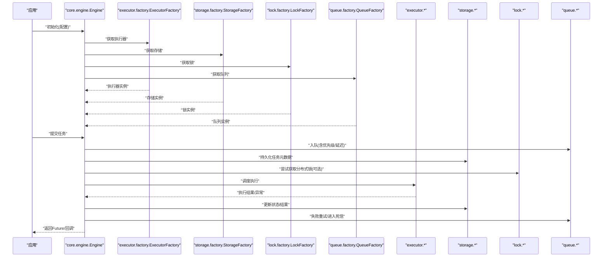
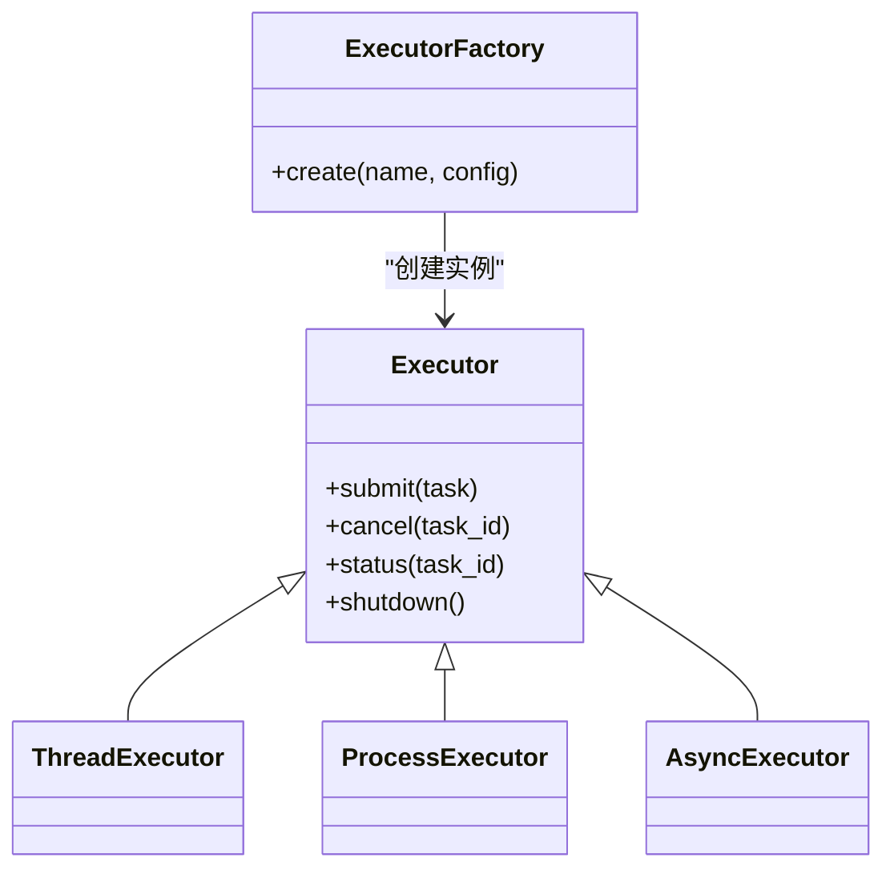
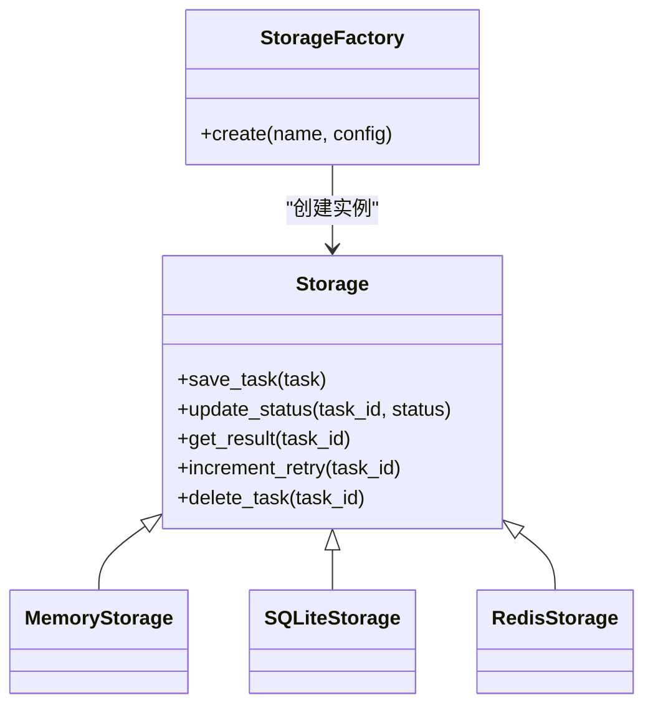
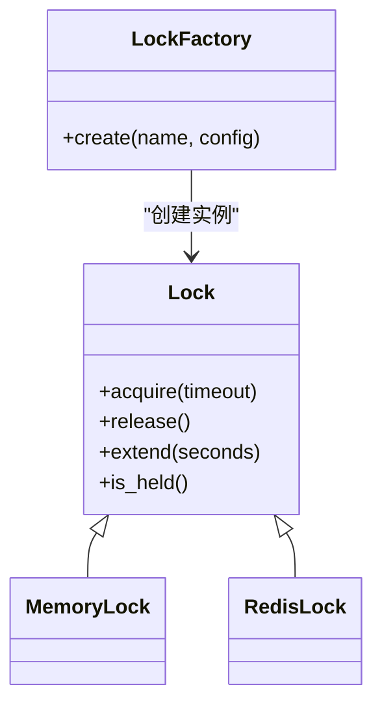
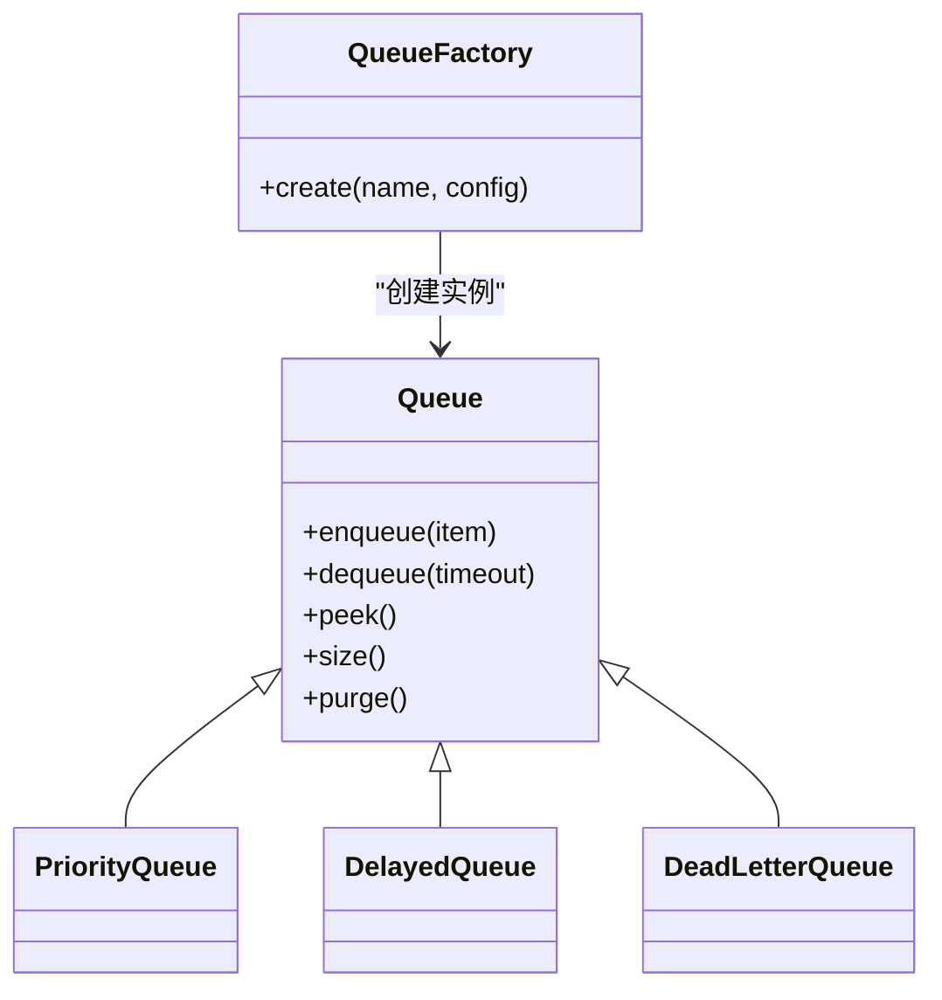
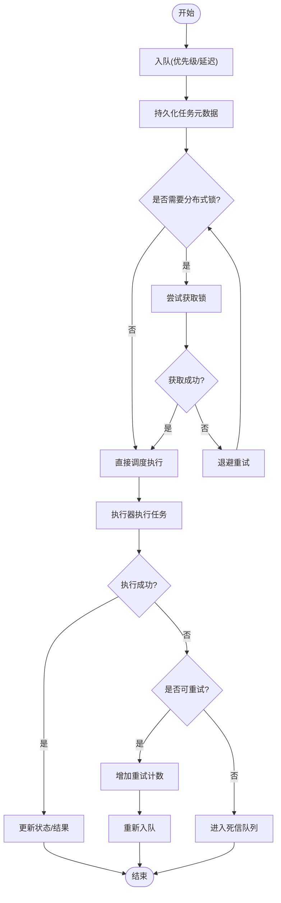
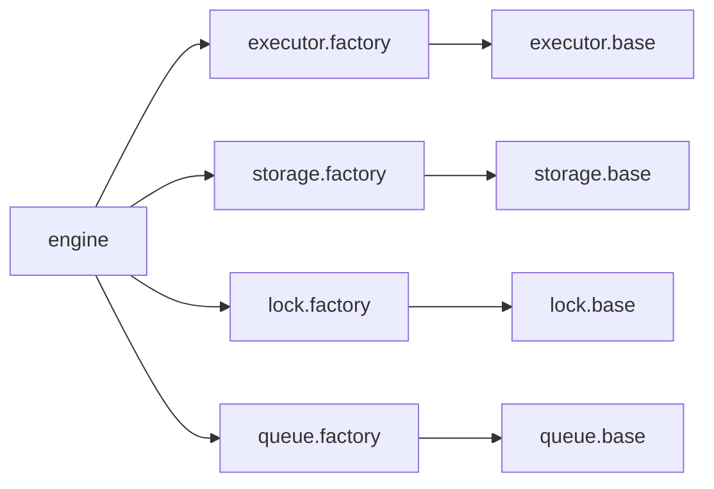

# 扩展开发

<cite>
**本文引用的文件**   
- [src/neotask/executor/base.py](file://src/neotask/executor/base.py)
- [src/neotask/executor/factory.py](file://src/neotask/executor/factory.py)
- [src/neotask/executor/thread_executor.py](file://src/neotask/executor/thread_executor.py)
- [src/neotask/executor/process_executor.py](file://src/neotask/executor/process_executor.py)
- [src/neotask/executor/async_executor.py](file://src/neotask/executor/async_executor.py)
- [src/neotask/storage/base.py](file://src/neotask/storage/base.py)
- [src/neotask/storage/factory.py](file://src/neotask/storage/factory.py)
- [src/neotask/storage/memory.py](file://src/neotask/storage/memory.py)
- [src/neotask/storage/sqlite.py](file://src/neotask/storage/sqlite.py)
- [src/neotask/storage/redis.py](file://src/neotask/storage/redis.py)
- [src/neotask/lock/base.py](file://src/neotask/lock/base.py)
- [src/neotask/lock/factory.py](file://src/neotask/lock/factory.py)
- [src/neotask/lock/memory.py](file://src/neotask/lock/memory.py)
- [src/neotask/lock/redis.py](file://src/neotask/lock/redis.py)
- [src/neotask/queue/base.py](file://src/neotask/queue/base.py)
- [src/neotask/queue/factory.py](file://src/neotask/queue/factory.py)
- [src/neotask/queue/priority_queue.py](file://src/neotask/queue/priority_queue.py)
- [src/neotask/queue/delayed_queue.py](file://src/neotask/queue/delayed_queue.py)
- [src/neotask/queue/dead_letter.py](file://src/neotask/queue/dead_letter.py)
- [src/neotask/core/engine.py](file://src/neotask/core/engine.py)
- [src/neotask/models/task.py](file://src/neotask/models/task.py)
- [src/neotask/common/exceptions.py](file://src/neotask/common/exceptions.py)
- [tests/unit/test_executors.py](file://tests/unit/test_executors.py)
- [tests/unit/test_storage.py](file://tests/unit/test_storage.py)
- [tests/unit/test_redis_storage.py](file://tests/unit/test_redis_storage.py)
- [tests/unit/test_priority_queue.py](file://tests/unit/test_priority_queue.py)
- [tests/unit/test_delayed_queue.py](file://tests/unit/test_delayed_queue.py)
</cite>

## 目录
1. [简介](#简介)
2. [项目结构](#项目结构)
3. [核心组件](#核心组件)
4. [架构总览](#架构总览)
5. [详细组件分析](#详细组件分析)
6. [依赖分析](#依赖分析)
7. [性能考虑](#性能考虑)
8. [故障排查指南](#故障排查指南)
9. [结论](#结论)
10. [附录](#附录)

## 简介
本指南面向希望为任务调度系统编写自定义插件的开发者，覆盖以下扩展点：
- 自定义执行器（线程、进程、异步等）
- 自定义存储实现（内存、SQLite、Redis 等）
- 自定义锁机制（内存、Redis 等）
- 自定义队列类型（优先级、延迟、死信等）

文档将解释扩展点的设计模式与接口规范，提供完整的示例路径与最佳实践，并说明插件的测试、打包、分发方法以及生态系统的构建与维护策略。

## 项目结构
仓库采用按功能域分层的组织方式，核心扩展点集中在如下模块：
- executor：执行器抽象与工厂
- storage：持久化抽象与工厂
- lock：分布式/本地锁抽象与工厂
- queue：队列抽象与多种队列实现
- core：引擎与生命周期编排
- models：任务模型定义
- common：通用异常与常量
- tests：单元测试与集成测试

```mermaid
graph TB
subgraph "核心"
Engine["core.engine.Engine"]
TaskModel["models.task.Task"]
Exceptions["common.exceptions"]
end
subgraph "执行器"
ExecBase["executor.base.Executor"]
ExecFactory["executor.factory.ExecutorFactory"]
ThreadExec["executor.thread_executor.ThreadExecutor"]
ProcExec["executor.process_executor.ProcessExecutor"]
AsyncExec["executor.async_executor.AsyncExecutor"]
end
subgraph "存储"
StoreBase["storage.base.Storage"]
StoreFactory["storage.factory.StorageFactory"]
MemStore["storage.memory.MemoryStorage"]
SqliteStore["storage.sqlite.SQLiteStorage"]
RedisStore["storage.redis.RedisStorage"]
end
subgraph "锁"
LockBase["lock.base.Lock"]
LockFactory["lock.factory.LockFactory"]
MemLock["lock.memory.MemoryLock"]
RedisLock["lock.redis.RedisLock"]
end
subgraph "队列"
QueueBase["queue.base.Queue"]
QueueFactory["queue.factory.QueueFactory"]
PriorityQ["queue.priority_queue.PriorityQueue"]
DelayedQ["queue.delayed_queue.DelayedQueue"]
DeadLetterQ["queue.dead_letter.DeadLetterQueue"]
end
Engine --> ExecFactory
Engine --> StoreFactory
Engine --> LockFactory
Engine --> QueueFactory
ExecFactory --> ExecBase
ExecBase --> ThreadExec
ExecBase --> ProcExec
ExecBase --> AsyncExec
StoreFactory --> StoreBase
StoreBase --> MemStore
StoreBase --> SqliteStore
StoreBase --> RedisStore
LockFactory --> LockBase
LockBase --> MemLock
LockBase --> RedisLock
QueueFactory --> QueueBase
QueueBase --> PriorityQ
QueueBase --> DelayedQ
QueueBase --> DeadLetterQ
Engine --> TaskModel
Engine --> Exceptions
```

图表来源
- [src/neotask/core/engine.py](file://src/neotask/core/engine.py)
- [src/neotask/executor/base.py](file://src/neotask/executor/base.py)
- [src/neotask/executor/factory.py](file://src/neotask/executor/factory.py)
- [src/neotask/storage/base.py](file://src/neotask/storage/base.py)
- [src/neotask/storage/factory.py](file://src/neotask/storage/factory.py)
- [src/neotask/lock/base.py](file://src/neotask/lock/base.py)
- [src/neotask/lock/factory.py](file://src/neotask/lock/factory.py)
- [src/neotask/queue/base.py](file://src/neotask/queue/base.py)
- [src/neotask/queue/factory.py](file://src/neotask/queue/factory.py)
- [src/neotask/models/task.py](file://src/neotask/models/task.py)
- [src/neotask/common/exceptions.py](file://src/neotask/common/exceptions.py)

章节来源
- [src/neotask/core/engine.py](file://src/neotask/core/engine.py)
- [src/neotask/executor/base.py](file://src/neotask/executor/base.py)
- [src/neotask/storage/base.py](file://src/neotask/storage/base.py)
- [src/neotask/lock/base.py](file://src/neotask/lock/base.py)
- [src/neotask/queue/base.py](file://src/neotask/queue/base.py)
- [src/neotask/models/task.py](file://src/neotask/models/task.py)
- [src/neotask/common/exceptions.py](file://src/neotask/common/exceptions.py)

## 核心组件
本节聚焦四大扩展点的基础抽象与工厂注册机制，帮助理解如何以最小成本接入自定义实现。

- 执行器扩展点
  - 抽象基类定义了统一的执行接口与生命周期钩子，用于提交任务、取消、状态查询等。
  - 工厂负责根据配置或名称解析并创建具体执行器实例。
  - 内置实现包括线程、进程、异步三种执行器，分别适用于不同并发模型与资源隔离需求。

- 存储扩展点
  - 抽象基类定义了任务元数据、结果、重试计数、状态变更等持久化操作。
  - 工厂支持多后端切换，便于在内存、SQLite、Redis 之间无缝替换。
  - 内置实现覆盖了单机与分布式场景。

- 锁扩展点
  - 抽象基类定义了加锁、解锁、续期、超时等原子语义。
  - 工厂支持内存与 Redis 两种实现，满足单机与集群一致性需求。

- 队列扩展点
  - 抽象基类定义了入队、出队、延迟、优先级、死信等通用能力。
  - 工厂支持多种队列类型组合，如优先级队列、延迟队列、死信队列。

章节来源
- [src/neotask/executor/base.py](file://src/neotask/executor/base.py)
- [src/neotask/executor/factory.py](file://src/neotask/executor/factory.py)
- [src/neotask/executor/thread_executor.py](file://src/neotask/executor/thread_executor.py)
- [src/neotask/executor/process_executor.py](file://src/neotask/executor/process_executor.py)
- [src/neotask/executor/async_executor.py](file://src/neotask/executor/async_executor.py)
- [src/neotask/storage/base.py](file://src/neotask/storage/base.py)
- [src/neotask/storage/factory.py](file://src/neotask/storage/factory.py)
- [src/neotask/storage/memory.py](file://src/neotask/storage/memory.py)
- [src/neotask/storage/sqlite.py](file://src/neotask/storage/sqlite.py)
- [src/neotask/storage/redis.py](file://src/neotask/storage/redis.py)
- [src/neotask/lock/base.py](file://src/neotask/lock/base.py)
- [src/neotask/lock/factory.py](file://src/neotask/lock/factory.py)
- [src/neotask/lock/memory.py](file://src/neotask/lock/memory.py)
- [src/neotask/lock/redis.py](file://src/neotask/lock/redis.py)
- [src/neotask/queue/base.py](file://src/neotask/queue/base.py)
- [src/neotask/queue/factory.py](file://src/neotask/queue/factory.py)
- [src/neotask/queue/priority_queue.py](file://src/neotask/queue/priority_queue.py)
- [src/neotask/queue/delayed_queue.py](file://src/neotask/queue/delayed_queue.py)
- [src/neotask/queue/dead_letter.py](file://src/neotask/queue/dead_letter.py)

## 架构总览
下图展示了引擎如何通过工厂选择并组合不同的执行器、存储、锁与队列，形成可插拔的任务处理流水线。

图表来源
- [src/neotask/core/engine.py](file://src/neotask/core/engine.py)
- [src/neotask/executor/factory.py](file://src/neotask/executor/factory.py)
- [src/neotask/storage/factory.py](file://src/neotask/storage/factory.py)
- [src/neotask/lock/factory.py](file://src/neotask/lock/factory.py)
- [src/neotask/queue/factory.py](file://src/neotask/queue/factory.py)

## 详细组件分析

### 执行器扩展点
- 设计要点
  - 通过统一基类暴露提交、取消、状态查询等方法，屏蔽底层差异。
  - 工厂根据配置项或命名空间动态创建具体执行器。
  - 内置实现覆盖多线程、多进程与协程模型，满足不同隔离与吞吐需求。

- 关键关系图

图表来源
- [src/neotask/executor/base.py](file://src/neotask/executor/base.py)
- [src/neotask/executor/factory.py](file://src/neotask/executor/factory.py)
- [src/neotask/executor/thread_executor.py](file://src/neotask/executor/thread_executor.py)
- [src/neotask/executor/process_executor.py](file://src/neotask/executor/process_executor.py)
- [src/neotask/executor/async_executor.py](file://src/neotask/executor/async_executor.py)

- 开发步骤
  - 继承执行器基类，实现提交、取消、状态查询与生命周期管理。
  - 在工厂中注册新执行器的名称与构造参数映射。
  - 使用引擎配置指定执行器名称，完成热插拔切换。

- 最佳实践
  - 明确资源边界：进程级隔离适合 CPU 密集且需崩溃恢复的场景；线程级适合 I/O 密集；协程适合高并发 I/O。
  - 错误传播：将底层异常包装为统一异常类型，便于上层统一处理。
  - 可观测性：记录关键指标（排队时长、执行耗时、失败率）。

- 参考测试
  - [tests/unit/test_executors.py](file://tests/unit/test_executors.py)

章节来源
- [src/neotask/executor/base.py](file://src/neotask/executor/base.py)
- [src/neotask/executor/factory.py](file://src/neotask/executor/factory.py)
- [src/neotask/executor/thread_executor.py](file://src/neotask/executor/thread_executor.py)
- [src/neotask/executor/process_executor.py](file://src/neotask/executor/process_executor.py)
- [src/neotask/executor/async_executor.py](file://src/neotask/executor/async_executor.py)
- [tests/unit/test_executors.py](file://tests/unit/test_executors.py)

### 存储扩展点
- 设计要点
  - 抽象基类定义任务元数据、结果、重试次数、状态变更等接口。
  - 工厂支持多后端切换，便于在不同环境部署时灵活选择。
  - 内置实现覆盖内存、SQLite、Redis，兼顾单机与分布式。

- 关键关系图

图表来源
- [src/neotask/storage/base.py](file://src/neotask/storage/base.py)
- [src/neotask/storage/factory.py](file://src/neotask/storage/factory.py)
- [src/neotask/storage/memory.py](file://src/neotask/storage/memory.py)
- [src/neotask/storage/sqlite.py](file://src/neotask/storage/sqlite.py)
- [src/neotask/storage/redis.py](file://src/neotask/storage/redis.py)

- 开发步骤
  - 继承存储基类，实现任务持久化、状态更新、结果读取与删除。
  - 在工厂中注册新的存储后端名称与连接参数。
  - 通过引擎配置切换到新存储后端。

- 最佳实践
  - 事务与幂等：确保状态更新具备幂等性，避免重复写入导致不一致。
  - 索引与分页：对高频查询字段建立索引，避免全表扫描。
  - 序列化：任务对象应可稳定序列化，避免版本不兼容。

- 参考测试
  - [tests/unit/test_storage.py](file://tests/unit/test_storage.py)
  - [tests/unit/test_redis_storage.py](file://tests/unit/test_redis_storage.py)

章节来源
- [src/neotask/storage/base.py](file://src/neotask/storage/base.py)
- [src/neotask/storage/factory.py](file://src/neotask/storage/factory.py)
- [src/neotask/storage/memory.py](file://src/neotask/storage/memory.py)
- [src/neotask/storage/sqlite.py](file://src/neotask/storage/sqlite.py)
- [src/neotask/storage/redis.py](file://src/neotask/storage/redis.py)
- [tests/unit/test_storage.py](file://tests/unit/test_storage.py)
- [tests/unit/test_redis_storage.py](file://tests/unit/test_redis_storage.py)

### 锁扩展点
- 设计要点
  - 抽象基类定义加锁、解锁、续期、超时等原子语义。
  - 工厂支持内存与 Redis 两种实现，满足单机与集群一致性需求。

- 关键关系图

图表来源
- [src/neotask/lock/base.py](file://src/neotask/lock/base.py)
- [src/neotask/lock/factory.py](file://src/neotask/lock/factory.py)
- [src/neotask/lock/memory.py](file://src/neotask/lock/memory.py)
- [src/neotask/lock/redis.py](file://src/neotask/lock/redis.py)

- 开发步骤
  - 继承锁基类，实现跨进程/跨节点的互斥语义。
  - 在工厂中注册新锁后端名称与连接参数。
  - 在需要互斥的业务逻辑中使用锁进行保护。

- 最佳实践
  - 原子性与公平性：确保加锁/解锁操作的原子性，避免死锁。
  - 超时与续期：合理设置超时时间，必要时实现自动续期。
  - 监控与告警：记录锁竞争情况与等待时长。

章节来源
- [src/neotask/lock/base.py](file://src/neotask/lock/base.py)
- [src/neotask/lock/factory.py](file://src/neotask/lock/factory.py)
- [src/neotask/lock/memory.py](file://src/neotask/lock/memory.py)
- [src/neotask/lock/redis.py](file://src/neotask/lock/redis.py)

### 队列扩展点
- 设计要点
  - 抽象基类定义入队、出队、延迟、优先级、死信等通用能力。
  - 工厂支持多种队列类型组合，如优先级队列、延迟队列、死信队列。

- 关键关系图

图表来源
- [src/neotask/queue/base.py](file://src/neotask/queue/base.py)
- [src/neotask/queue/factory.py](file://src/neotask/queue/factory.py)
- [src/neotask/queue/priority_queue.py](file://src/neotask/queue/priority_queue.py)
- [src/neotask/queue/delayed_queue.py](file://src/neotask/queue/delayed_queue.py)
- [src/neotask/queue/dead_letter.py](file://src/neotask/queue/dead_letter.py)

- 开发步骤
  - 继承队列基类，实现入队、出队、延迟与优先级等特性。
  - 在工厂中注册新队列类型名称与构造参数。
  - 通过引擎配置选择合适队列类型。

- 最佳实践
  - 顺序与公平：在高并发下保证出队顺序与公平性。
  - 背压与限流：结合消费者速率控制，防止积压。
  - 死信与重试：失败任务进入死信队列，便于人工干预与重放。

- 参考测试
  - [tests/unit/test_priority_queue.py](file://tests/unit/test_priority_queue.py)
  - [tests/unit/test_delayed_queue.py](file://tests/unit/test_delayed_queue.py)

章节来源
- [src/neotask/queue/base.py](file://src/neotask/queue/base.py)
- [src/neotask/queue/factory.py](file://src/neotask/queue/factory.py)
- [src/neotask/queue/priority_queue.py](file://src/neotask/queue/priority_queue.py)
- [src/neotask/queue/delayed_queue.py](file://src/neotask/queue/delayed_queue.py)
- [src/neotask/queue/dead_letter.py](file://src/neotask/queue/dead_letter.py)
- [tests/unit/test_priority_queue.py](file://tests/unit/test_priority_queue.py)
- [tests/unit/test_delayed_queue.py](file://tests/unit/test_delayed_queue.py)

### 复杂逻辑流程：任务从入队到执行的完整链路

图表来源
- [src/neotask/core/engine.py](file://src/neotask/core/engine.py)
- [src/neotask/queue/base.py](file://src/neotask/queue/base.py)
- [src/neotask/storage/base.py](file://src/neotask/storage/base.py)
- [src/neotask/lock/base.py](file://src/neotask/lock/base.py)
- [src/neotask/executor/base.py](file://src/neotask/executor/base.py)
- [src/neotask/models/task.py](file://src/neotask/models/task.py)
- [src/neotask/common/exceptions.py](file://src/neotask/common/exceptions.py)

## 依赖分析
- 耦合与内聚
  - 引擎通过工厂解耦具体实现，降低耦合度，提高可测试性。
  - 各扩展点内部保持高内聚，对外仅暴露稳定的接口契约。
- 外部依赖
  - 存储与锁可能依赖外部中间件（如 Redis），需在工厂中处理连接与异常。
- 循环依赖
  - 当前设计避免循环导入，扩展点之间通过工厂与接口间接协作。

图表来源
- [src/neotask/core/engine.py](file://src/neotask/core/engine.py)
- [src/neotask/executor/factory.py](file://src/neotask/executor/factory.py)
- [src/neotask/storage/factory.py](file://src/neotask/storage/factory.py)
- [src/neotask/lock/factory.py](file://src/neotask/lock/factory.py)
- [src/neotask/queue/factory.py](file://src/neotask/queue/factory.py)

章节来源
- [src/neotask/core/engine.py](file://src/neotask/core/engine.py)
- [src/neotask/executor/factory.py](file://src/neotask/executor/factory.py)
- [src/neotask/storage/factory.py](file://src/neotask/storage/factory.py)
- [src/neotask/lock/factory.py](file://src/neotask/lock/factory.py)
- [src/neotask/queue/factory.py](file://src/neotask/queue/factory.py)

## 性能考虑
- 执行器选择
  - 线程执行器适合 I/O 密集型任务，注意 GIL 限制。
  - 进程执行器适合 CPU 密集型任务，注意进程间通信开销。
  - 异步执行器适合高并发 I/O，注意事件循环阻塞风险。
- 存储优化
  - 批量写入与事务合并，减少网络往返。
  - 合理索引与分页，避免热点键倾斜。
- 锁竞争
  - 缩短临界区，减少锁持有时间。
  - 使用指数退避与随机抖动降低冲突概率。
- 队列背压
  - 结合消费者速率控制与最大队列长度，防止内存溢出。
  - 优先级与延迟队列需权衡排序与插入复杂度。

[本节为通用指导，无需特定文件引用]

## 故障排查指南
- 常见问题定位
  - 执行器无法启动：检查工厂注册与配置项是否正确。
  - 存储写入失败：确认连接参数、权限与网络连通性。
  - 锁超时或死锁：检查超时配置与业务逻辑中的释放路径。
  - 队列积压：观察消费者消费速率与生产者生产速率。
- 日志与指标
  - 记录关键路径日志（入队、出队、执行、失败重试、死信）。
  - 暴露核心指标（延迟、吞吐、错误率、锁等待时长）。
- 参考异常与测试
  - 统一异常类型与错误码，便于上层捕获与告警。
  - 利用现有单元测试与集成测试复现问题。

章节来源
- [src/neotask/common/exceptions.py](file://src/neotask/common/exceptions.py)
- [tests/unit/test_executors.py](file://tests/unit/test_executors.py)
- [tests/unit/test_storage.py](file://tests/unit/test_storage.py)
- [tests/unit/test_redis_storage.py](file://tests/unit/test_redis_storage.py)
- [tests/unit/test_priority_queue.py](file://tests/unit/test_priority_queue.py)
- [tests/unit/test_delayed_queue.py](file://tests/unit/test_delayed_queue.py)

## 结论
通过统一的抽象与工厂机制，系统实现了高度可插拔的执行器、存储、锁与队列扩展点。遵循接口契约与最佳实践，可以快速构建符合业务需求的插件，并通过测试与指标保障稳定性与性能。建议在生产环境中逐步引入新插件，配合灰度发布与回滚策略，确保平滑演进。

[本节为总结性内容，无需特定文件引用]

## 附录

### 插件开发与集成清单
- 执行器
  - 继承执行器基类，实现必要方法
  - 在工厂中注册新执行器名称与构造参数
  - 在引擎配置中指定执行器名称
  - 参考测试：[tests/unit/test_executors.py](file://tests/unit/test_executors.py)

- 存储
  - 继承存储基类，实现持久化与状态更新
  - 在工厂中注册新存储后端名称与连接参数
  - 在引擎配置中指定存储后端
  - 参考测试：[tests/unit/test_storage.py](file://tests/unit/test_storage.py)、[tests/unit/test_redis_storage.py](file://tests/unit/test_redis_storage.py)

- 锁
  - 继承锁基类，实现加锁/解锁/续期
  - 在工厂中注册新锁后端名称与连接参数
  - 在需要互斥的逻辑中使用锁
  - 参考测试：见锁相关单元测试（如有）

- 队列
  - 继承队列基类，实现入队/出队/延迟/优先级
  - 在工厂中注册新队列类型名称与构造参数
  - 在引擎配置中指定队列类型
  - 参考测试：[tests/unit/test_priority_queue.py](file://tests/unit/test_priority_queue.py)、[tests/unit/test_delayed_queue.py](file://tests/unit/test_delayed_queue.py)

### 测试策略
- 单元测试
  - 针对每个扩展点的接口契约编写用例，覆盖正常路径与异常路径。
  - 使用夹具模拟外部依赖（如 Redis、SQLite）。
- 集成测试
  - 端到端验证任务从入队到执行的全链路。
  - 验证存储、锁、队列的组合行为。
- 基准测试
  - 评估不同实现的吞吐与延迟，辅助选型与调优。

### 打包与分发
- 包结构
  - 将插件代码放入独立包，遵循 Python 包规范。
- 依赖声明
  - 在包描述文件中声明运行时依赖与可选依赖。
- 安装与启用
  - 通过包管理器安装插件包。
  - 在引擎配置中指定插件名称与参数，完成热插拔。

### 生态系统构建与维护
- 版本兼容性
  - 保持接口稳定，向后兼容升级。
- 文档与示例
  - 提供清晰的接口文档与示例代码。
- 社区贡献
  - 制定贡献指南与代码审查流程。
  - 建立问题反馈与版本发布节奏。

[本节为通用指导，无需特定文件引用]