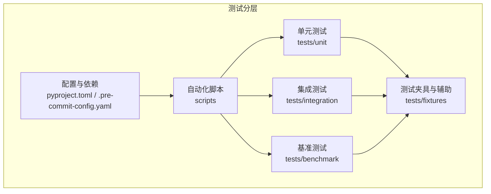
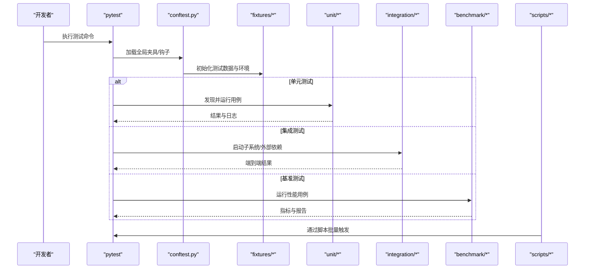
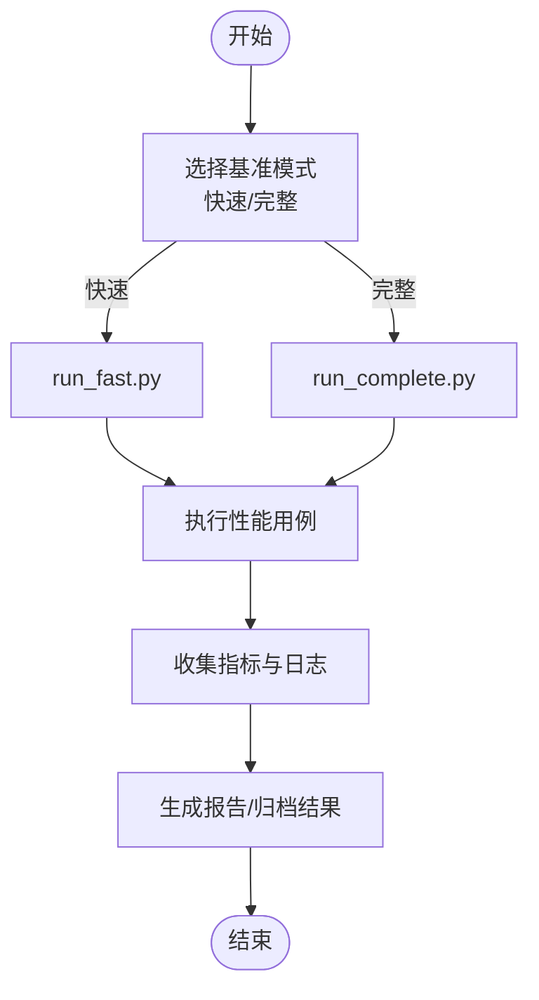
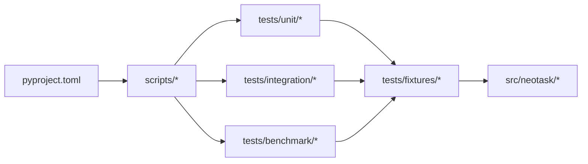

# 插件测试与验证

<cite>
**本文引用的文件**   
- [tests/conftest.py](file://tests/conftest.py)
- [tests/pytest.ini](file://tests/pytest.ini)
- [tests/unit/test_simple.py](file://tests/unit/test_simple.py)
- [tests/unit/test_task.py](file://tests/unit/test_task.py)
- [tests/unit/test_executors.py](file://tests/unit/test_executors.py)
- [tests/unit/test_queue.py](file://tests/unit/test_queue.py)
- [tests/unit/test_priority_queue.py](file://tests/unit/test_priority_queue.py)
- [tests/unit/test_delayed_queue.py](file://tests/unit/test_delayed_queue.py)
- [tests/unit/test_cron_parser.py](file://tests/unit/test_cron_parser.py)
- [tests/unit/test_time_wheel.py](file://tests/unit/test_time_wheel.py)
- [tests/unit/test_periodic_manager.py](file://tests/unit/test_periodic_manager.py)
- [tests/unit/test_event_bus.py](file://tests/unit/test_event_bus.py)
- [tests/unit/test_future.py](file://tests/unit/test_future.py)
- [tests/unit/test_lifecycle.py](file://tests/unit/test_lifecycle.py)
- [tests/unit/test_storage.py](file://tests/unit/test_storage.py)
- [tests/unit/test_redis_storage.py](file://tests/unit/test_redis_storage.py)
- [tests/unit/test_metrics.py](file://tests/unit/test_metrics.py)
- [tests/unit/worker/test_worker.py](file://tests/unit/worker/test_worker.py)
- [tests/unit/worker/test_pool.py](file://tests/unit/worker/test_pool.py)
- [tests/integration/test_end_to_end.py](file://tests/integration/test_end_to_end.py)
- [tests/integration/test_task_scheduler.py](file://tests/integration/test_task_scheduler.py)
- [tests/integration/test_task_pool.py](file://tests/integration/test_task_pool.py)
- [tests/integration/test_worker_integration.py](file://tests/integration/test_worker_integration.py)
- [tests/integration/test_failure_recovery.py](file://tests/integration/test_failure_recovery.py)
- [tests/fixtures/__init__.py](file://tests/fixtures/__init__.py)
- [tests/fixtures/helpers.py](file://tests/fixtures/helpers.py)
- [tests/fixtures/storage.py](file://tests/fixtures/storage.py)
- [tests/fixtures/executor.py](file://tests/fixtures/executor.py)
- [tests/fixtures/event.py](file://tests/fixtures/event.py)
- [tests/fixtures/queue.py](file://tests/fixtures/queue.py)
- [tests/fixtures/task.py](file://tests/fixtures/task.py)
- [tests/fixtures/distributed.py](file://tests/fixtures/distributed.py)
- [tests/fixtures/monitor.py](file://tests/fixtures/monitor.py)
- [tests/benchmark/run_benchmark.py](file://tests/benchmark/run_benchmark.py)
- [tests/benchmark/run_complete.py](file://tests/benchmark/run_complete.py)
- [tests/benchmark/run_fast.py](file://tests/benchmark/run_fast.py)
- [tests/benchmark/test_performance.py](file://tests/benchmark/test_performance.py)
- [tests/benchmark/test_performance_simple.py](file://tests/benchmark/test_performance_simple.py)
- [scripts/run_benchmarks.sh](file://scripts/run_benchmarks.sh)
- [scripts/run_chaos_tests.sh](file://scripts/run_chaos_tests.sh)
- [scripts/run_v04_validation.sh](file://scripts/run_v04_validation.sh)
- [pyproject.toml](file://pyproject.toml)
- [.pre-commit-config.yaml](file://.pre-commit-config.yaml)
- [README.md](file://README.md)
</cite>

## 目录
1. [简介](#简介)
2. [项目结构](#项目结构)
3. [核心组件](#核心组件)
4. [架构总览](#架构总览)
5. [详细组件分析](#详细组件分析)
6. [依赖分析](#依赖分析)
7. [性能考虑](#性能考虑)
8. [故障排查指南](#故障排查指南)
9. [结论](#结论)
10. [附录](#附录)

## 简介
本指南面向插件开发者与维护者，围绕“插件测试与验证”目标，系统化阐述单元测试、集成测试、Mock策略、基准测试、兼容性/回归测试自动化、质量检查与覆盖率统计、静态分析配置、持续集成流水线以及发布前验证清单。文档基于仓库现有测试结构与脚本进行提炼，确保可落地执行。

## 项目结构
仓库采用按测试类型分层的组织方式：
- tests/unit：单元级测试，覆盖调度器、队列、执行器、存储、事件等核心模块
- tests/integration：端到端与子系统集成测试，覆盖任务调度、工作池、失败恢复等场景
- tests/fixtures：共享夹具与辅助工具，提供统一的数据构造、环境准备与Mock对象
- tests/benchmark：基准测试套件，包含快速与完整两种运行模式
- scripts：一键运行基准、混沌与兼容性验证的Shell脚本
- pyproject.toml/.pre-commit-config.yaml：依赖声明与代码质量门禁

图表来源
- [tests/conftest.py](file://tests/conftest.py)
- [tests/pytest.ini](file://tests/pytest.ini)
- [tests/fixtures/__init__.py](file://tests/fixtures/__init__.py)
- [tests/benchmark/run_benchmark.py](file://tests/benchmark/run_benchmark.py)
- [scripts/run_benchmarks.sh](file://scripts/run_benchmarks.sh)
- [pyproject.toml](file://pyproject.toml)
- [.pre-commit-config.yaml](file://.pre-commit-config.yaml)

章节来源
- [tests/conftest.py](file://tests/conftest.py)
- [tests/pytest.ini](file://tests/pytest.ini)
- [tests/fixtures/__init__.py](file://tests/fixtures/__init__.py)
- [tests/benchmark/run_benchmark.py](file://tests/benchmark/run_benchmark.py)
- [scripts/run_benchmarks.sh](file://scripts/run_benchmarks.sh)
- [pyproject.toml](file://pyproject.toml)
- [.pre-commit-config.yaml](file://.pre-commit-config.yaml)

## 核心组件
- 测试框架与入口
  - pytest为统一测试运行器，配置文件位于tests/pytest.ini；conftest.py集中定义全局夹具与钩子
- 夹具与辅助（fixtures）
  - helpers.py提供通用断言与时间控制工具
  - storage.py、executor.py、event.py、queue.py、task.py、distributed.py、monitor.py分别封装对应子系统的测试数据与环境
- 单元测试套件
  - 覆盖任务模型、生命周期、执行器、队列（含优先级与延迟）、Cron解析、时间轮、周期任务管理、事件总线、Future、存储（内存/Redis）、指标采集等
- 集成测试套件
  - 端到端流程、任务调度器与工作池协作、失败恢复路径等
- 基准测试套件
  - run_benchmark.py、run_complete.py、run_fast.py三种运行入口；test_performance.py与test_performance_simple.py提供用例
- 自动化脚本
  - run_benchmarks.sh、run_chaos_tests.sh、run_v04_validation.sh用于批量执行不同测试集

章节来源
- [tests/conftest.py](file://tests/conftest.py)
- [tests/pytest.ini](file://tests/pytest.ini)
- [tests/fixtures/helpers.py](file://tests/fixtures/helpers.py)
- [tests/fixtures/storage.py](file://tests/fixtures/storage.py)
- [tests/fixtures/executor.py](file://tests/fixtures/executor.py)
- [tests/fixtures/event.py](file://tests/fixtures/event.py)
- [tests/fixtures/queue.py](file://tests/fixtures/queue.py)
- [tests/fixtures/task.py](file://tests/fixtures/task.py)
- [tests/fixtures/distributed.py](file://tests/fixtures/distributed.py)
- [tests/fixtures/monitor.py](file://tests/fixtures/monitor.py)
- [tests/unit/test_simple.py](file://tests/unit/test_simple.py)
- [tests/unit/test_task.py](file://tests/unit/test_task.py)
- [tests/unit/test_executors.py](file://tests/unit/test_executors.py)
- [tests/unit/test_queue.py](file://tests/unit/test_queue.py)
- [tests/unit/test_priority_queue.py](file://tests/unit/test_priority_queue.py)
- [tests/unit/test_delayed_queue.py](file://tests/unit/test_delayed_queue.py)
- [tests/unit/test_cron_parser.py](file://tests/unit/test_cron_parser.py)
- [tests/unit/test_time_wheel.py](file://tests/unit/test_time_wheel.py)
- [tests/unit/test_periodic_manager.py](file://tests/unit/test_periodic_manager.py)
- [tests/unit/test_event_bus.py](file://tests/unit/test_event_bus.py)
- [tests/unit/test_future.py](file://tests/unit/test_future.py)
- [tests/unit/test_lifecycle.py](file://tests/unit/test_lifecycle.py)
- [tests/unit/test_storage.py](file://tests/unit/test_storage.py)
- [tests/unit/test_redis_storage.py](file://tests/unit/test_redis_storage.py)
- [tests/unit/test_metrics.py](file://tests/unit/test_metrics.py)
- [tests/unit/worker/test_worker.py](file://tests/unit/worker/test_worker.py)
- [tests/unit/worker/test_pool.py](file://tests/unit/worker/test_pool.py)
- [tests/integration/test_end_to_end.py](file://tests/integration/test_end_to_end.py)
- [tests/integration/test_task_scheduler.py](file://tests/integration/test_task_scheduler.py)
- [tests/integration/test_task_pool.py](file://tests/integration/test_task_pool.py)
- [tests/integration/test_worker_integration.py](file://tests/integration/test_worker_integration.py)
- [tests/integration/test_failure_recovery.py](file://tests/integration/test_failure_recovery.py)
- [tests/benchmark/run_benchmark.py](file://tests/benchmark/run_benchmark.py)
- [tests/benchmark/run_complete.py](file://tests/benchmark/run_complete.py)
- [tests/benchmark/run_fast.py](file://tests/benchmark/run_fast.py)
- [tests/benchmark/test_performance.py](file://tests/benchmark/test_performance.py)
- [tests/benchmark/test_performance_simple.py](file://tests/benchmark/test_performance_simple.py)
- [scripts/run_benchmarks.sh](file://scripts/run_benchmarks.sh)
- [scripts/run_chaos_tests.sh](file://scripts/run_chaos_tests.sh)
- [scripts/run_v04_validation.sh](file://scripts/run_v04_validation.sh)

## 架构总览
下图展示从测试入口到具体用例的执行路径，以及夹具与外部依赖的交互关系。

图表来源
- [tests/conftest.py](file://tests/conftest.py)
- [tests/pytest.ini](file://tests/pytest.ini)
- [tests/fixtures/__init__.py](file://tests/fixtures/__init__.py)
- [tests/benchmark/run_benchmark.py](file://tests/benchmark/run_benchmark.py)
- [scripts/run_benchmarks.sh](file://scripts/run_benchmarks.sh)

## 详细组件分析

### 单元测试编写方法与最佳实践
- 用例组织
  - 以功能域划分目录（如worker、scheduler、queue），每个模块对应一组用例文件
  - 使用描述性命名：test_<模块>_<场景>.py
- 夹具复用
  - 在fixtures中抽象公共数据构造（任务、队列、执行器、存储、事件总线等），避免重复样板代码
  - 使用conftest.py注入全局行为（例如时区、异步事件循环、临时目录）
- Mock策略
  - 对外部依赖（网络、文件系统、数据库）优先使用fixtures中的轻量实现或标准库mock
  - 对内部接口采用协议式替换，保证被测单元边界清晰
- 断言与可观测性
  - 明确断言输入输出、状态变更与副作用（日志、指标、事件）
  - 结合fixtures.helpers中的工具函数简化常见断言

章节来源
- [tests/conftest.py](file://tests/conftest.py)
- [tests/pytest.ini](file://tests/pytest.ini)
- [tests/fixtures/helpers.py](file://tests/fixtures/helpers.py)
- [tests/unit/test_simple.py](file://tests/unit/test_simple.py)
- [tests/unit/test_task.py](file://tests/unit/test_task.py)
- [tests/unit/test_executors.py](file://tests/unit/test_executors.py)
- [tests/unit/test_queue.py](file://tests/unit/test_queue.py)
- [tests/unit/test_priority_queue.py](file://tests/unit/test_priority_queue.py)
- [tests/unit/test_delayed_queue.py](file://tests/unit/test_delayed_queue.py)
- [tests/unit/test_cron_parser.py](file://tests/unit/test_cron_parser.py)
- [tests/unit/test_time_wheel.py](file://tests/unit/test_time_wheel.py)
- [tests/unit/test_periodic_manager.py](file://tests/unit/test_periodic_manager.py)
- [tests/unit/test_event_bus.py](file://tests/unit/test_event_bus.py)
- [tests/unit/test_future.py](file://tests/unit/test_future.py)
- [tests/unit/test_lifecycle.py](file://tests/unit/test_lifecycle.py)
- [tests/unit/test_storage.py](file://tests/unit/test_storage.py)
- [tests/unit/test_redis_storage.py](file://tests/unit/test_redis_storage.py)
- [tests/unit/test_metrics.py](file://tests/unit/test_metrics.py)
- [tests/unit/worker/test_worker.py](file://tests/unit/worker/test_worker.py)
- [tests/unit/worker/test_pool.py](file://tests/unit/worker/test_pool.py)

### 集成测试设计与外部依赖隔离
- 设计原则
  - 以真实子系统组合为目标，覆盖跨模块协作路径（调度器+执行器+队列+存储）
  - 通过fixtures隔离外部依赖，必要时启用最小可用服务（如Redis）
- 关键场景
  - 端到端任务提交、调度、执行、完成与清理
  - 任务池与工作进程协同
  - 失败恢复与重试路径
- 执行建议
  - 将耗时较长的集成用例标记为独立标签，按需执行
  - 使用临时资源与自动清理，避免污染宿主环境

章节来源
- [tests/integration/test_end_to_end.py](file://tests/integration/test_end_to_end.py)
- [tests/integration/test_task_scheduler.py](file://tests/integration/test_task_scheduler.py)
- [tests/integration/test_task_pool.py](file://tests/integration/test_task_pool.py)
- [tests/integration/test_worker_integration.py](file://tests/integration/test_worker_integration.py)
- [tests/integration/test_failure_recovery.py](file://tests/integration/test_failure_recovery.py)
- [tests/fixtures/storage.py](file://tests/fixtures/storage.py)
- [tests/fixtures/executor.py](file://tests/fixtures/executor.py)
- [tests/fixtures/queue.py](file://tests/fixtures/queue.py)

### Mock对象创建策略
- 策略要点
  - 优先使用fixtures提供的轻量实现替代真实依赖
  - 对不可控外部系统（网络、磁盘、第三方服务）采用协议式替换或标准库mock
  - 保持Mock契约稳定，便于长期维护
- 常用位置
  - fixtures/executor.py：模拟执行器行为
  - fixtures/storage.py：模拟持久化层
  - fixtures/event.py：模拟事件总线
  - fixtures/queue.py：模拟队列后端
  - fixtures/distributed.py：模拟分布式协调与锁

章节来源
- [tests/fixtures/executor.py](file://tests/fixtures/executor.py)
- [tests/fixtures/storage.py](file://tests/fixtures/storage.py)
- [tests/fixtures/event.py](file://tests/fixtures/event.py)
- [tests/fixtures/queue.py](file://tests/fixtures/queue.py)
- [tests/fixtures/distributed.py](file://tests/fixtures/distributed.py)

### 性能基准测试方法与工具
- 入口与模式
  - run_benchmark.py：基准主入口
  - run_complete.py：完整基准（全面但耗时）
  - run_fast.py：快速基准（适合CI快速反馈）
  - test_performance.py与test_performance_simple.py：具体性能用例
- 执行方式
  - 直接通过Python运行入口脚本
  - 或通过scripts/run_benchmarks.sh一键触发
- 指标与报告
  - 关注吞吐、延迟分布、资源占用趋势
  - 建议在相同硬件与负载条件下对比历史结果

图表来源
- [tests/benchmark/run_benchmark.py](file://tests/benchmark/run_benchmark.py)
- [tests/benchmark/run_complete.py](file://tests/benchmark/run_complete.py)
- [tests/benchmark/run_fast.py](file://tests/benchmark/run_fast.py)
- [tests/benchmark/test_performance.py](file://tests/benchmark/test_performance.py)
- [tests/benchmark/test_performance_simple.py](file://tests/benchmark/test_performance_simple.py)
- [scripts/run_benchmarks.sh](file://scripts/run_benchmarks.sh)

章节来源
- [tests/benchmark/run_benchmark.py](file://tests/benchmark/run_benchmark.py)
- [tests/benchmark/run_complete.py](file://tests/benchmark/run_complete.py)
- [tests/benchmark/run_fast.py](file://tests/benchmark/run_fast.py)
- [tests/benchmark/test_performance.py](file://tests/benchmark/test_performance.py)
- [tests/benchmark/test_performance_simple.py](file://tests/benchmark/test_performance_simple.py)
- [scripts/run_benchmarks.sh](file://scripts/run_benchmarks.sh)

### 兼容性与回归测试自动化
- 兼容性验证
  - 使用scripts/run_v04_validation.sh执行v0.x系列兼容用例，确保向后兼容
- 回归测试
  - 将关键路径用例纳入每日/每次PR构建，防止旧缺陷复现
- 混沌测试
  - 使用scripts/run_chaos_tests.sh注入异常场景，验证鲁棒性

章节来源
- [scripts/run_v04_validation.sh](file://scripts/run_v04_validation.sh)
- [scripts/run_chaos_tests.sh](file://scripts/run_chaos_tests.sh)

### 质量检查、覆盖率与静态分析
- 依赖与配置
  - pyproject.toml集中声明测试与质量工具依赖
  - .pre-commit-config.yaml定义提交前检查项（格式化、Lint、类型检查等）
- 覆盖率统计
  - 使用pytest-cov生成覆盖率报告，建议对核心模块设置阈值
- 静态分析
  - 结合flake8/ruff、mypy等工具提升代码一致性

章节来源
- [pyproject.toml](file://pyproject.toml)
- [.pre-commit-config.yaml](file://.pre-commit-config.yaml)

### 持续集成流水线与发布前验证清单
- CI流水线建议
  - 安装依赖 → 预提交检查 → 单元测试 → 集成测试 → 基准测试（快速）→ 覆盖率汇总 → 产物归档
- 发布前验证清单
  - 全量单测通过
  - 集成测试通过（含失败恢复）
  - 快速基准无退化
  - 覆盖率达标
  - 静态分析与格式检查通过
  - v0.x兼容验证通过
  - 文档与示例可运行

章节来源
- [scripts/run_benchmarks.sh](file://scripts/run_benchmarks.sh)
- [scripts/run_chaos_tests.sh](file://scripts/run_chaos_tests.sh)
- [scripts/run_v04_validation.sh](file://scripts/run_v04_validation.sh)
- [pyproject.toml](file://pyproject.toml)
- [.pre-commit-config.yaml](file://.pre-commit-config.yaml)

## 依赖分析
测试套件与核心模块的依赖关系如下：

图表来源
- [tests/unit/test_simple.py](file://tests/unit/test_simple.py)
- [tests/integration/test_end_to_end.py](file://tests/integration/test_end_to_end.py)
- [tests/benchmark/run_benchmark.py](file://tests/benchmark/run_benchmark.py)
- [scripts/run_benchmarks.sh](file://scripts/run_benchmarks.sh)
- [pyproject.toml](file://pyproject.toml)

章节来源
- [tests/unit/test_simple.py](file://tests/unit/test_simple.py)
- [tests/integration/test_end_to_end.py](file://tests/integration/test_end_to_end.py)
- [tests/benchmark/run_benchmark.py](file://tests/benchmark/run_benchmark.py)
- [scripts/run_benchmarks.sh](file://scripts/run_benchmarks.sh)
- [pyproject.toml](file://pyproject.toml)

## 性能考虑
- 基准测试环境
  - 固定CPU/内存/IO条件，避免噪声干扰
  - 预热阶段后采集指标，剔除冷启动影响
- 指标解读
  - 关注P95/P99延迟与吞吐拐点
  - 对比历史基线，识别退化趋势
- 优化建议
  - 减少不必要的序列化/反序列化
  - 合理调整并发度与批大小
  - 利用缓存与惰性加载降低热点路径开销

[本节为通用指导，不直接分析具体文件]

## 故障排查指南
- 常见问题
  - 异步事件循环未正确配置：检查conftest与pytest.ini中的事件循环策略
  - 外部依赖不可用：确认Redis/网络/文件系统可用性或使用fixtures替换
  - 基准结果不稳定：增加预热、固定随机种子、隔离资源
- 定位手段
  - 使用pytest -s/-vv增强输出
  - 结合fixtures.helpers中的工具打印中间状态
  - 查看日志与指标采集点

章节来源
- [tests/conftest.py](file://tests/conftest.py)
- [tests/pytest.ini](file://tests/pytest.ini)
- [tests/fixtures/helpers.py](file://tests/fixtures/helpers.py)

## 结论
通过分层清晰的测试体系、完善的夹具与Mock策略、可复用的基准与自动化脚本，以及严格的质量门禁与CI流水线，可有效保障插件的稳定性、性能与兼容性。建议在新功能开发中同步补充相应测试与基准，并在发布前逐项核对验证清单。

[本节为总结性内容，不直接分析具体文件]

## 附录
- 参考文档
  - README.md：项目总体说明与使用说明
- 相关用例与脚本
  - 单元测试：tests/unit/*
  - 集成测试：tests/integration/*
  - 基准测试：tests/benchmark/*
  - 自动化脚本：scripts/*

章节来源
- [README.md](file://README.md)