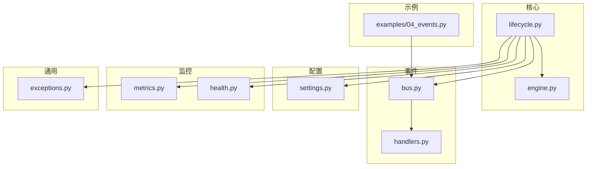
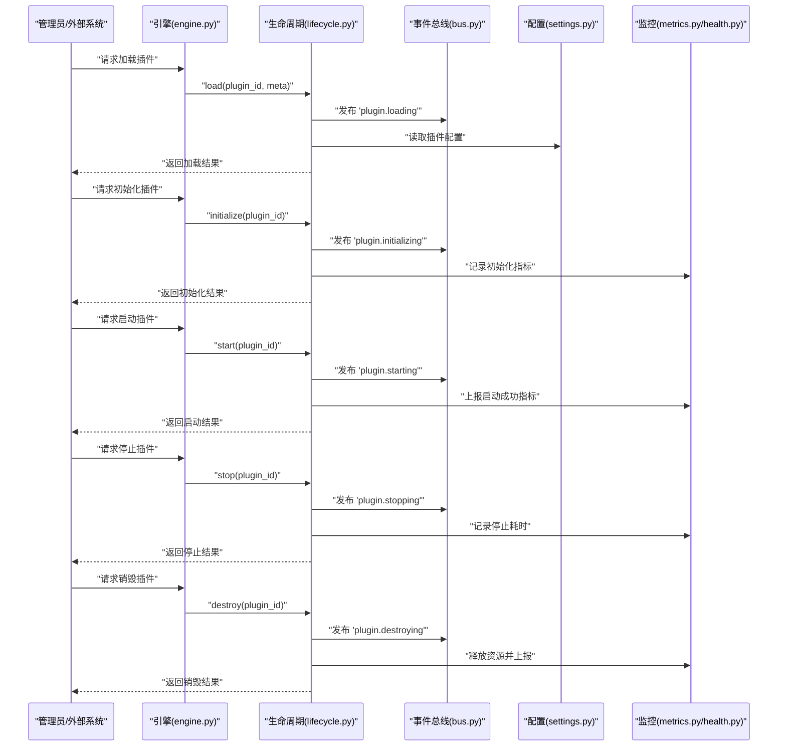
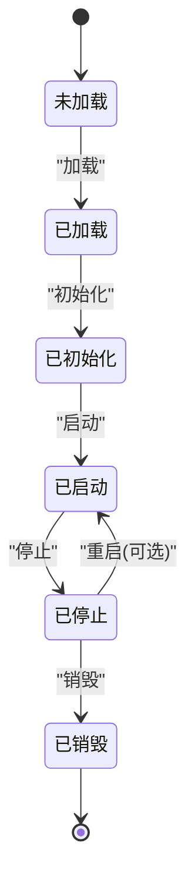
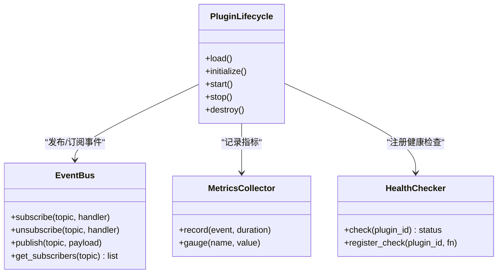
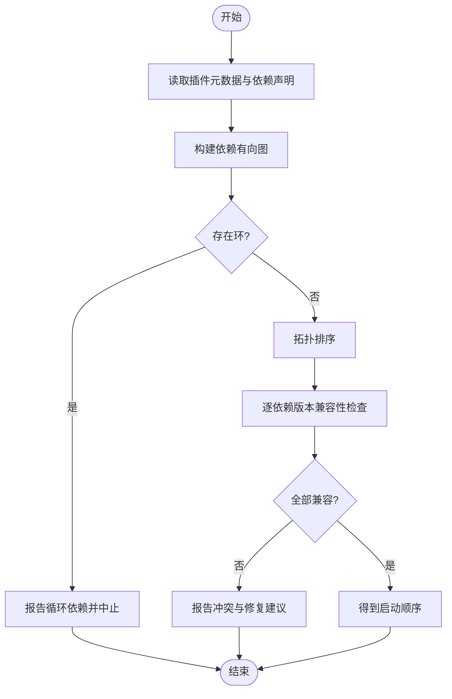
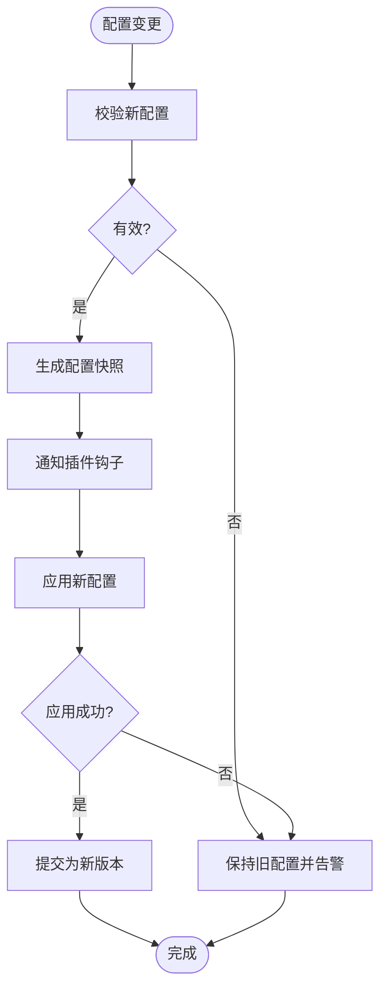
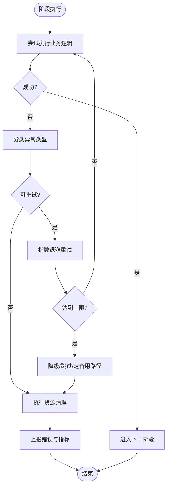
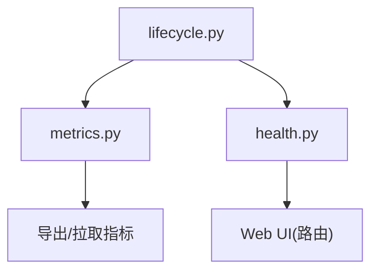
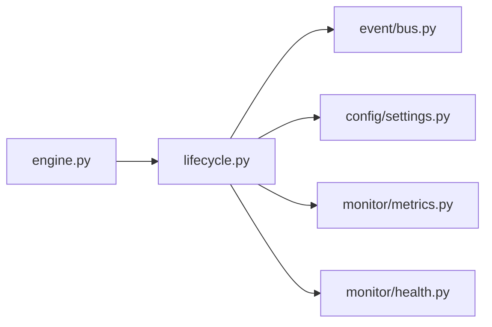

# 插件生命周期管理

<cite>
**本文引用的文件**
- [src/neotask/core/lifecycle.py](file://src/neotask/core/lifecycle.py)
- [src/neotask/core/engine.py](file://src/neotask/core/engine.py)
- [src/neotask/event/bus.py](file://src/neotask/event/bus.py)
- [src/neotask/event/handlers.py](file://src/neotask/event/handlers.py)
- [src/neotask/config/settings.py](file://src/neotask/config/settings.py)
- [src/neotask/monitor/metrics.py](file://src/neotask/monitor/metrics.py)
- [src/neotask/monitor/health.py](file://src/neotask/monitor/health.py)
- [src/neotask/common/exceptions.py](file://src/neotask/common/exceptions.py)
- [examples/04_events.py](file://examples/04_events.py)
</cite>

## 目录
1. [简介](#简介)
2. [项目结构](#项目结构)
3. [核心组件](#核心组件)
4. [架构总览](#架构总览)
5. [详细组件分析](#详细组件分析)
6. [依赖关系分析](#依赖关系分析)
7. [性能考虑](#性能考虑)
8. [故障排查指南](#故障排查指南)
9. [结论](#结论)
10. [附录](#附录)

## 简介
本文件围绕“插件”在任务调度系统中的全生命周期进行系统化说明，覆盖加载、初始化、启动、停止与销毁等阶段；阐述依赖管理与版本兼容性检查机制；解释配置热重载与动态更新能力；描述插件间通信与事件总线集成；给出错误处理、异常恢复与资源清理策略；并提供监控与调试工具的使用建议以及开发最佳实践。

## 项目结构
本项目采用分层与模块化组织方式，与插件生命周期相关的核心代码主要分布在以下模块：
- 核心生命周期与引擎：core/lifecycle.py、core/engine.py
- 事件总线与处理器：event/bus.py、event/handlers.py
- 配置与设置：config/settings.py
- 监控指标与健康检查：monitor/metrics.py、monitor/health.py
- 通用异常定义：common/exceptions.py
- 示例：examples/04_events.py（展示事件使用）

图表来源
- [src/neotask/core/lifecycle.py](file://src/neotask/core/lifecycle.py)
- [src/neotask/core/engine.py](file://src/neotask/core/engine.py)
- [src/neotask/event/bus.py](file://src/neotask/event/bus.py)
- [src/neotask/event/handlers.py](file://src/neotask/event/handlers.py)
- [src/neotask/config/settings.py](file://src/neotask/config/settings.py)
- [src/neotask/monitor/metrics.py](file://src/neotask/monitor/metrics.py)
- [src/neotask/monitor/health.py](file://src/neotask/monitor/health.py)
- [src/neotask/common/exceptions.py](file://src/neotask/common/exceptions.py)
- [examples/04_events.py](file://examples/04_events.py)

章节来源
- [src/neotask/core/lifecycle.py](file://src/neotask/core/lifecycle.py)
- [src/neotask/core/engine.py](file://src/neotask/core/engine.py)
- [src/neotask/event/bus.py](file://src/neotask/event/bus.py)
- [src/neotask/event/handlers.py](file://src/neotask/event/handlers.py)
- [src/neotask/config/settings.py](file://src/neotask/config/settings.py)
- [src/neotask/monitor/metrics.py](file://src/neotask/monitor/metrics.py)
- [src/neotask/monitor/health.py](file://src/neotask/monitor/health.py)
- [src/neotask/common/exceptions.py](file://src/neotask/common/exceptions.py)
- [examples/04_events.py](file://examples/04_events.py)

## 核心组件
- 生命周期管理器：负责插件从发现到销毁的完整状态机流转，提供统一的钩子接口与顺序控制。
- 事件总线：为插件间解耦通信提供发布/订阅通道，贯穿生命周期各阶段的事件广播与消费。
- 引擎：协调生命周期与执行器、存储、队列等子系统，驱动插件运行时的上下文与资源。
- 配置中心：集中管理插件配置，支持热重载与动态更新。
- 监控与健康：采集指标、暴露健康端点，辅助定位问题与评估稳定性。
- 异常体系：统一异常类型与错误码，便于上层捕获与恢复。

章节来源
- [src/neotask/core/lifecycle.py](file://src/neotask/core/lifecycle.py)
- [src/neotask/core/engine.py](file://src/neotask/core/engine.py)
- [src/neotask/event/bus.py](file://src/neotask/event/bus.py)
- [src/neotask/config/settings.py](file://src/neotask/config/settings.py)
- [src/neotask/monitor/metrics.py](file://src/neotask/monitor/metrics.py)
- [src/neotask/monitor/health.py](file://src/neotask/monitor/health.py)
- [src/neotask/common/exceptions.py](file://src/neotask/common/exceptions.py)

## 架构总览
下图展示了插件生命周期与事件总线、配置、监控之间的交互关系。

图表来源
- [src/neotask/core/engine.py](file://src/neotask/core/engine.py)
- [src/neotask/core/lifecycle.py](file://src/neotask/core/lifecycle.py)
- [src/neotask/event/bus.py](file://src/neotask/event/bus.py)
- [src/neotask/config/settings.py](file://src/neotask/config/settings.py)
- [src/neotask/monitor/metrics.py](file://src/neotask/monitor/metrics.py)
- [src/neotask/monitor/health.py](file://src/neotask/monitor/health.py)

## 详细组件分析

### 生命周期状态机与阶段
- 状态集合：未加载、已加载、已初始化、已启动、已停止、已销毁。
- 阶段职责：
  - 加载：解析元数据、校验依赖、准备上下文。
  - 初始化：创建内部资源、注册回调、预热缓存。
  - 启动：接入事件总线、开始对外服务或任务。
  - 停止：优雅退出、关闭连接、持久化状态。
  - 销毁：释放内存、清理临时文件、注销事件订阅。
- 约束：
  - 严格顺序推进，禁止逆向跳转。
  - 每个阶段可被拦截与扩展（钩子）。
  - 失败时回滚至上一稳定状态。

图表来源
- [src/neotask/core/lifecycle.py](file://src/neotask/core/lifecycle.py)

章节来源
- [src/neotask/core/lifecycle.py](file://src/neotask/core/lifecycle.py)

### 事件总线与插件通信
- 设计要点：
  - 基于主题/事件的发布订阅模型，实现插件间松耦合通信。
  - 生命周期关键节点均通过事件总线广播，供其他插件监听响应。
  - 支持同步与异步处理器，避免阻塞主流程。
- 典型事件：
  - 插件加载/初始化/启动/停止/销毁前后事件。
  - 配置变更事件、健康状态变化事件。
- 使用建议：
  - 处理器幂等、短耗时、异常隔离。
  - 对关键事件增加重试与死信队列（若适用）。

图表来源
- [src/neotask/event/bus.py](file://src/neotask/event/bus.py)
- [src/neotask/event/handlers.py](file://src/neotask/event/handlers.py)
- [src/neotask/core/lifecycle.py](file://src/neotask/core/lifecycle.py)
- [src/neotask/monitor/metrics.py](file://src/neotask/monitor/metrics.py)
- [src/neotask/monitor/health.py](file://src/neotask/monitor/health.py)

章节来源
- [src/neotask/event/bus.py](file://src/neotask/event/bus.py)
- [src/neotask/event/handlers.py](file://src/neotask/event/handlers.py)
- [examples/04_events.py](file://examples/04_events.py)

### 依赖管理与版本兼容性
- 依赖声明：插件需声明其依赖项及最小版本要求。
- 解析与校验：
  - 构建依赖图，检测循环依赖与缺失依赖。
  - 按拓扑序排序，确保先启动基础插件。
- 版本兼容：
  - 语义化版本比较，拒绝不兼容版本。
  - 冲突时给出明确提示与修复建议。
- 动态调整：
  - 支持运行时重新计算依赖图并在安全窗口内应用变更。

图表来源
- [src/neotask/core/lifecycle.py](file://src/neotask/core/lifecycle.py)
- [src/neotask/core/engine.py](file://src/neotask/core/engine.py)

章节来源
- [src/neotask/core/lifecycle.py](file://src/neotask/core/lifecycle.py)
- [src/neotask/core/engine.py](file://src/neotask/core/engine.py)

### 配置热重载与动态更新
- 热重载流程：
  - 监听配置源变更事件。
  - 增量合并新配置，生成新版本快照。
  - 触发插件配置更新钩子，允许平滑切换。
- 一致性保障：
  - 原子替换引用，避免中间态。
  - 失败自动回滚至上一个稳定版本。
- 适用范围：
  - 非关键路径参数可即时生效。
  - 关键参数需重启或进入维护窗口后生效。

图表来源
- [src/neotask/config/settings.py](file://src/neotask/config/settings.py)
- [src/neotask/core/lifecycle.py](file://src/neotask/core/lifecycle.py)

章节来源
- [src/neotask/config/settings.py](file://src/neotask/config/settings.py)
- [src/neotask/core/lifecycle.py](file://src/neotask/core/lifecycle.py)

### 错误处理、异常恢复与资源清理
- 异常分类：
  - 配置错误、依赖不满足、初始化失败、运行时异常、资源泄漏等。
- 恢复策略：
  - 阶段级回滚与补偿操作。
  - 指数退避重试与熔断降级。
  - 将不可恢复错误转入死信队列以便人工干预。
- 资源清理：
  - 在停止与销毁阶段强制释放句柄、连接、锁与临时文件。
  - 使用上下文管理器确保异常路径也能正确清理。

图表来源
- [src/neotask/core/lifecycle.py](file://src/neotask/core/lifecycle.py)
- [src/neotask/common/exceptions.py](file://src/neotask/common/exceptions.py)

章节来源
- [src/neotask/core/lifecycle.py](file://src/neotask/core/lifecycle.py)
- [src/neotask/common/exceptions.py](file://src/neotask/common/exceptions.py)

### 监控与调试
- 指标采集：
  - 生命周期各阶段耗时、成功率、失败原因分布。
  - 插件数量、状态分布、依赖解析耗时。
- 健康检查：
  - 注册插件健康探针，聚合整体健康度。
- 调试建议：
  - 开启详细日志级别，关联事件ID追踪调用链。
  - 结合Web UI查看实时状态与历史回放。

图表来源
- [src/neotask/core/lifecycle.py](file://src/neotask/core/lifecycle.py)
- [src/neotask/monitor/metrics.py](file://src/neotask/monitor/metrics.py)
- [src/neotask/monitor/health.py](file://src/neotask/monitor/health.py)

章节来源
- [src/neotask/monitor/metrics.py](file://src/neotask/monitor/metrics.py)
- [src/neotask/monitor/health.py](file://src/neotask/monitor/health.py)

## 依赖关系分析
- 耦合关系：
  - 生命周期模块强依赖事件总线与配置中心，弱依赖监控与健康检查。
  - 引擎作为编排者，串联生命周期与各子系统。
- 潜在风险：
  - 事件处理器阻塞导致生命周期卡顿。
  - 配置热更新期间并发访问引发竞态。
- 缓解措施：
  - 事件处理器异步化与超时控制。
  - 配置读写加锁与快照隔离。

图表来源
- [src/neotask/core/engine.py](file://src/neotask/core/engine.py)
- [src/neotask/core/lifecycle.py](file://src/neotask/core/lifecycle.py)
- [src/neotask/event/bus.py](file://src/neotask/event/bus.py)
- [src/neotask/config/settings.py](file://src/neotask/config/settings.py)
- [src/neotask/monitor/metrics.py](file://src/neotask/monitor/metrics.py)
- [src/neotask/monitor/health.py](file://src/neotask/monitor/health.py)

章节来源
- [src/neotask/core/engine.py](file://src/neotask/core/engine.py)
- [src/neotask/core/lifecycle.py](file://src/neotask/core/lifecycle.py)
- [src/neotask/event/bus.py](file://src/neotask/event/bus.py)
- [src/neotask/config/settings.py](file://src/neotask/config/settings.py)
- [src/neotask/monitor/metrics.py](file://src/neotask/monitor/metrics.py)
- [src/neotask/monitor/health.py](file://src/neotask/monitor/health.py)

## 性能考虑
- 事件总线：
  - 批量发布与批处理消费者，降低上下文切换开销。
  - 热点事件分片与限流，防止雪崩。
- 生命周期：
  - 并行初始化无依赖插件，缩短冷启动时间。
  - 延迟加载重型资源，按需激活。
- 配置热重载：
  - 增量合并与只读快照，减少锁竞争。
- 监控：
  - 指标采样与降采样，避免写入放大。

[本节为通用指导，无需列出具体文件来源]

## 故障排查指南
- 常见问题：
  - 插件无法启动：检查依赖是否满足、版本是否兼容、配置是否有效。
  - 启动后频繁崩溃：关注异常分类与重试策略，确认资源是否泄露。
  - 配置未生效：确认热重载链路是否连通、钩子是否正确注册。
- 定位手段：
  - 查看事件总线日志，核对事件发布/消费时序。
  - 通过健康检查端点快速判断插件状态。
  - 抓取指标曲线，识别瓶颈与异常峰值。
- 恢复步骤：
  - 回滚配置至上一稳定版本。
  - 重启受影响插件，必要时降级功能。
  - 将不可恢复错误转交死信队列，保留现场信息。

章节来源
- [src/neotask/common/exceptions.py](file://src/neotask/common/exceptions.py)
- [src/neotask/monitor/health.py](file://src/neotask/monitor/health.py)
- [src/neotask/monitor/metrics.py](file://src/neotask/monitor/metrics.py)
- [src/neotask/event/bus.py](file://src/neotask/event/bus.py)

## 结论
通过统一的生命周期状态机、事件总线驱动的解耦通信、严格的依赖与版本管理、安全的配置热重载、完善的监控与健康检查，以及健壮的错误处理与资源清理策略，插件能够在复杂系统中稳定运行、灵活演进。遵循本文档的最佳实践，可显著提升系统的可观测性、可维护性与可扩展性。

[本节为总结性内容，无需列出具体文件来源]

## 附录

### 插件开发工作流与最佳实践
- 开发流程：
  - 定义插件元数据与依赖声明。
  - 实现生命周期钩子与事件处理器。
  - 编写单元测试与集成测试，覆盖异常路径。
  - 本地验证热重载与回滚行为。
  - 灰度发布与监控观察。
- 最佳实践：
  - 所有外部资源使用上下文管理器，确保异常路径清理。
  - 事件处理器幂等且短耗时，避免阻塞主流程。
  - 合理划分配置项，区分热更与非热更参数。
  - 为关键路径埋点与打点，完善指标与日志。
  - 对第三方依赖进行版本锁定与兼容性测试。

[本节为通用指导，无需列出具体文件来源]