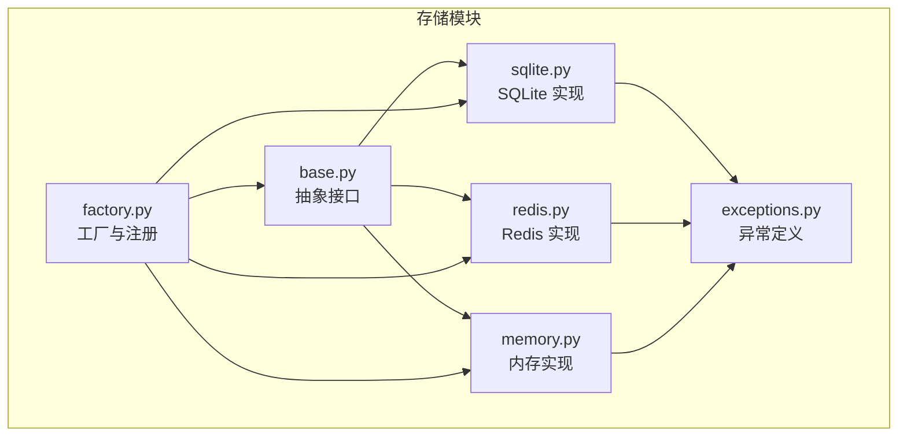
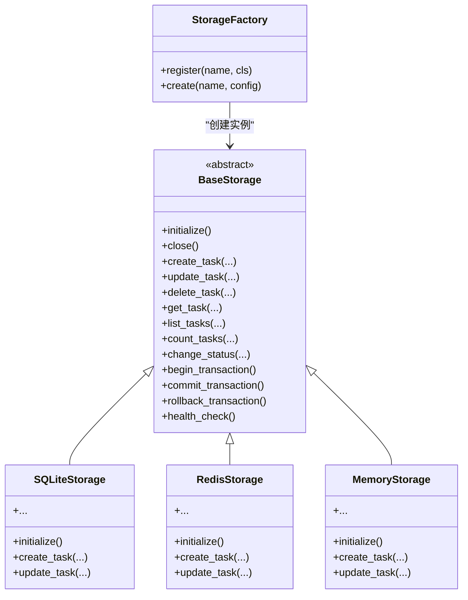
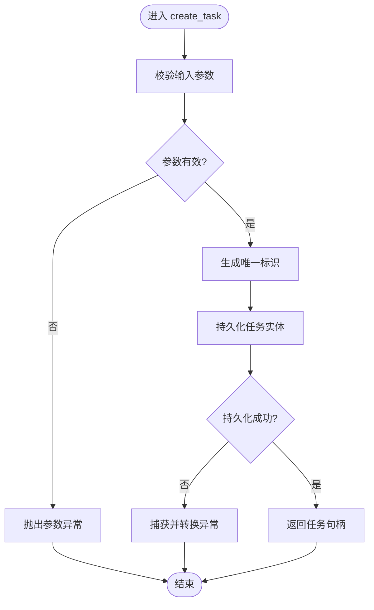
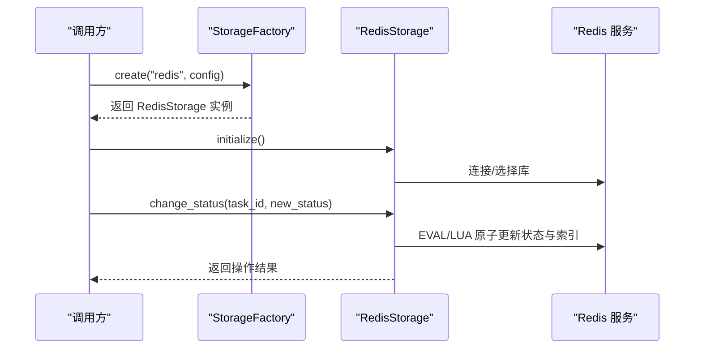
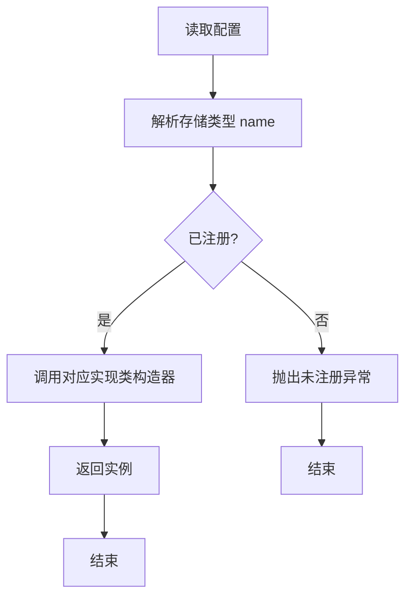
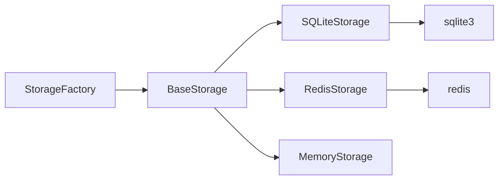

# 自定义存储实现

<cite>
**本文引用的文件**   
- [src/neotask/storage/base.py](file://src/neotask/storage/base.py)
- [src/neotask/storage/factory.py](file://src/neotask/storage/factory.py)
- [src/neotask/storage/sqlite.py](file://src/neotask/storage/sqlite.py)
- [src/neotask/storage/redis.py](file://src/neotask/storage/redis.py)
- [src/neotask/storage/memory.py](file://src/neotask/storage/memory.py)
- [src/neotask/storage/exceptions.py](file://src/neotask/storage/exceptions.py)
- [tests/unit/test_storage.py](file://tests/unit/test_storage.py)
- [tests/unit/test_redis_storage.py](file://tests/unit/test_redis_storage.py)
- [tests/fixtures/storage.py](file://tests/fixtures/storage.py)
</cite>

## 目录
1. [简介](#简介)
2. [项目结构](#项目结构)
3. [核心组件](#核心组件)
4. [架构总览](#架构总览)
5. [详细组件分析](#详细组件分析)
6. [依赖关系分析](#依赖关系分析)
7. [性能考虑](#性能考虑)
8. [故障排查指南](#故障排查指南)
9. [结论](#结论)
10. [附录](#附录)

## 简介
本指南面向需要为任务调度系统扩展自定义存储实现的开发者。文档围绕 BaseStorage 抽象类接口设计、数据访问模式、任务持久化与状态管理、查询操作规范，以及 SQLite、Redis 等具体实现进行深入解析；同时提供存储工厂模式的配置与使用方式，并给出并发安全、事务处理、备份恢复机制的设计建议，最后附上性能优化策略、扩展性考量与完整的自定义存储示例及测试用例路径。

## 项目结构
存储子系统位于 src/neotask/storage 目录下，采用“抽象基类 + 多实现 + 工厂”的分层组织方式：
- base.py：定义存储抽象接口与通用约定
- sqlite.py：基于 SQLite 的本地文件型存储实现
- redis.py：基于 Redis 的内存型分布式存储实现
- memory.py：基于内存的轻量实现（常用于测试）
- factory.py：存储实例创建与注册中心
- exceptions.py：存储相关异常类型



**图示来源**
- [src/neotask/storage/base.py](file://src/neotask/storage/base.py)
- [src/neotask/storage/sqlite.py](file://src/neotask/storage/sqlite.py)
- [src/neotask/storage/redis.py](file://src/neotask/storage/redis.py)
- [src/neotask/storage/memory.py](file://src/neotask/storage/memory.py)
- [src/neotask/storage/factory.py](file://src/neotask/storage/factory.py)
- [src/neotask/storage/exceptions.py](file://src/neotask/storage/exceptions.py)

**章节来源**
- [src/neotask/storage/base.py](file://src/neotask/storage/base.py)
- [src/neotask/storage/factory.py](file://src/neotask/storage/factory.py)
- [src/neotask/storage/sqlite.py](file://src/neotask/storage/sqlite.py)
- [src/neotask/storage/redis.py](file://src/neotask/storage/redis.py)
- [src/neotask/storage/memory.py](file://src/neotask/storage/memory.py)
- [src/neotask/storage/exceptions.py](file://src/neotask/storage/exceptions.py)

## 核心组件
本节聚焦 BaseStorage 抽象类的接口设计与数据访问模式，明确任务持久化、状态管理与查询操作的实现规范。

- 抽象接口职责
  - 任务生命周期写入：创建、更新、删除
  - 任务状态变更：入队、执行中、完成、失败、重试、取消等
  - 查询能力：按条件检索、分页、计数、聚合统计
  - 连接与资源管理：初始化、关闭、健康检查
  - 事务与一致性：批量操作的事务边界与回滚语义
  - 并发控制：读写锁或外部协调机制的适配点
  - 元数据与索引：键空间设计、索引字段约定、序列化格式

- 数据访问模式
  - 统一错误模型：通过 exceptions.py 中的异常类型对外暴露一致的错误语义
  - 幂等写入：支持幂等键或版本戳，避免重复提交导致的数据不一致
  - 查询过滤：以结构化参数表达过滤条件，便于上层组合与优化
  - 分页游标：基于时间戳或自增 ID 的游标分页，避免深分页性能问题

- 任务持久化与状态管理
  - 任务实体字段约定：唯一标识、名称、调度信息、优先级、状态、重试次数、结果摘要、时间戳等
  - 状态机约束：状态迁移需满足预定义转换规则，非法迁移应抛出异常
  - 审计日志：关键状态变更记录到独立表/集合，便于追踪与回放

- 查询操作规范
  - 条件表达式：支持等于、范围、包含、前缀匹配等
  - 排序与限制：支持多字段排序与 top-N 限制
  - 聚合统计：按状态、标签、队列等维度进行计数与汇总

**章节来源**
- [src/neotask/storage/base.py](file://src/neotask/storage/base.py)
- [src/neotask/storage/exceptions.py](file://src/neotask/storage/exceptions.py)

## 架构总览
存储子系统通过工厂模式解耦调用方与具体存储实现，支持运行时选择与动态扩展。



**图示来源**
- [src/neotask/storage/base.py](file://src/neotask/storage/base.py)
- [src/neotask/storage/sqlite.py](file://src/neotask/storage/sqlite.py)
- [src/neotask/storage/redis.py](file://src/neotask/storage/redis.py)
- [src/neotask/storage/memory.py](file://src/neotask/storage/memory.py)
- [src/neotask/storage/factory.py](file://src/neotask/storage/factory.py)

## 详细组件分析

### BaseStorage 抽象类与接口契约
- 设计要点
  - 方法签名与返回约定：所有写操作返回受控的结果对象或布尔值；读操作返回空集合或 None 表示不存在
  - 异常契约：未找到、冲突、超时、权限不足等错误映射到统一的异常类型
  - 事务边界：begin/commit/rollback 三件套保证原子性与一致性
  - 并发安全：子类可选择内部加锁或依赖外部协调器（如分布式锁）

- 典型流程
  - 任务创建：校验输入 -> 生成唯一ID -> 落盘/落库 -> 返回任务句柄
  - 状态变更：校验当前状态 -> 应用状态迁移 -> 持久化 -> 触发事件（可选）
  - 查询列表：解析过滤条件 -> 构建查询 -> 执行 -> 分页封装



**图示来源**
- [src/neotask/storage/base.py](file://src/neotask/storage/base.py)
- [src/neotask/storage/exceptions.py](file://src/neotask/storage/exceptions.py)

**章节来源**
- [src/neotask/storage/base.py](file://src/neotask/storage/base.py)
- [src/neotask/storage/exceptions.py](file://src/neotask/storage/exceptions.py)

### SQLite 存储实现
- 适用场景
  - 单机部署、轻量级任务存储、无需外部依赖
- 数据结构建议
  - tasks 表：主键、任务名、调度信息、优先级、状态、重试次数、结果摘要、创建/更新时间
  - task_audit 表：状态变更审计日志
- 并发与事务
  - 使用数据库级事务保证写操作原子性
  - 针对热点行可引入应用层读写锁
- 备份与恢复
  - 冷备：复制数据库文件
  - 热备：开启 WAL 模式并使用增量快照工具

```mermaid
sequenceDiagram
participant Caller as "调用方"
participant Factory as "StorageFactory"
participant Store as "SQLiteStorage"
participant DB as "SQLite 引擎"
Caller->>Factory : create("sqlite", config)
Factory-->>Caller : 返回 SQLiteStorage 实例
Caller->>Store : initialize()
Store->>DB : 建立连接/建表
Caller->>Store : create_task(task_data)
Store->>DB : BEGIN; INSERT INTO tasks; COMMIT
Store-->>Caller : 返回任务句柄
```

**图示来源**
- [src/neotask/storage/factory.py](file://src/neotask/storage/factory.py)
- [src/neotask/storage/sqlite.py](file://src/neotask/storage/sqlite.py)

**章节来源**
- [src/neotask/storage/sqlite.py](file://src/neotask/storage/sqlite.py)
- [src/neotask/storage/factory.py](file://src/neotask/storage/factory.py)

### Redis 存储实现
- 适用场景
  - 高吞吐、低延迟、分布式环境下的任务存储
- 数据结构建议
  - Hash/Set/ZSet 组合：任务实体、状态索引、优先级队列、延迟队列
  - TTL 与过期策略：结合任务生命周期设置过期时间
- 并发与事务
  - 使用 MULTI/EXEC 或 Lua 脚本保证复合操作的原子性
  - 利用分布式锁避免竞态条件
- 备份与恢复
  - RDB/AOF 持久化策略
  - 定期快照与增量同步



**图示来源**
- [src/neotask/storage/factory.py](file://src/neotask/storage/factory.py)
- [src/neotask/storage/redis.py](file://src/neotask/storage/redis.py)

**章节来源**
- [src/neotask/storage/redis.py](file://src/neotask/storage/redis.py)
- [src/neotask/storage/factory.py](file://src/neotask/storage/factory.py)

### 内存存储实现（Memory）
- 适用场景
  - 单元测试、快速原型验证、无外部依赖的轻量运行
- 特点
  - 进程内字典/列表存储，无持久化
  - 适合并发度不高的场景，必要时使用线程锁保护

**章节来源**
- [src/neotask/storage/memory.py](file://src/neotask/storage/memory.py)

### 存储工厂模式与配置
- 注册与创建
  - register(name, cls)：将实现类注册到工厂
  - create(name, config)：根据名称与配置创建实例
- 配置项建议
  - 连接参数：路径、主机、端口、密码、数据库名等
  - 行为开关：是否启用事务、是否启用审计、是否启用缓存
  - 性能参数：连接池大小、超时、重试次数



**图示来源**
- [src/neotask/storage/factory.py](file://src/neotask/storage/factory.py)

**章节来源**
- [src/neotask/storage/factory.py](file://src/neotask/storage/factory.py)

## 依赖关系分析
- 耦合与内聚
  - BaseStorage 作为稳定抽象，降低上层对具体实现的耦合
  - 各实现仅依赖基础库与自身驱动（sqlite3、redis-py），保持高内聚
- 外部依赖
  - SQLite：内置驱动，零外部依赖
  - Redis：需要 redis-py 客户端
- 潜在循环依赖
  - 工厂仅依赖抽象与实现类，无循环导入风险



**图示来源**
- [src/neotask/storage/base.py](file://src/neotask/storage/base.py)
- [src/neotask/storage/sqlite.py](file://src/neotask/storage/sqlite.py)
- [src/neotask/storage/redis.py](file://src/neotask/storage/redis.py)
- [src/neotask/storage/memory.py](file://src/neotask/storage/memory.py)
- [src/neotask/storage/factory.py](file://src/neotask/storage/factory.py)

**章节来源**
- [src/neotask/storage/base.py](file://src/neotask/storage/base.py)
- [src/neotask/storage/factory.py](file://src/neotask/storage/factory.py)

## 性能考虑
- 索引与查询优化
  - 为高频过滤字段建立索引（如状态、优先级、创建时间）
  - 使用覆盖索引减少回表
- 批处理与事务
  - 合并多次写入为单次事务，降低 IO 开销
  - 批量插入/更新时注意内存占用
- 连接池与复用
  - 合理设置连接池大小与超时，避免连接抖动
- 序列化与压缩
  - 大对象采用压缩或分片存储
  - 选择高效的序列化格式（如 JSON/MessagePack）
- 缓存与分层
  - 热点数据在应用层做只读缓存，配合失效策略
- 监控与调优
  - 采集慢查询、命中率、连接数、锁等待等指标

[本节为通用指导，不涉及具体文件分析]

## 故障排查指南
- 常见问题定位
  - 连接失败：检查网络、认证、端口与防火墙
  - 死锁与超时：分析事务粒度与锁竞争热点
  - 数据不一致：核对状态迁移逻辑与幂等键
- 诊断手段
  - 打开详细日志，记录关键步骤与异常堆栈
  - 使用健康检查接口确认存储可用性
  - 导出审计日志进行回溯
- 恢复策略
  - 从备份恢复数据库文件或快照
  - 重放审计日志修复状态

**章节来源**
- [src/neotask/storage/exceptions.py](file://src/neotask/storage/exceptions.py)

## 结论
通过 BaseStorage 抽象与工厂模式，系统实现了存储层的松耦合与可扩展性。SQLite 与 Redis 两种主流实现覆盖了单机与分布式场景。遵循本文的接口契约、并发与事务规范，并结合性能优化与故障排查实践，可高效地开发并集成新的存储后端。

[本节为总结性内容，不涉及具体文件分析]

## 附录

### 自定义存储实现示例（步骤与参考）
- 步骤概览
  - 继承 BaseStorage，实现必要方法
  - 定义数据模型与索引策略
  - 实现事务与并发控制
  - 注册到 StorageFactory
  - 编写单元测试与集成测试
- 参考实现与测试
  - 参考现有实现的结构与风格：
    - [src/neotask/storage/sqlite.py](file://src/neotask/storage/sqlite.py)
    - [src/neotask/storage/redis.py](file://src/neotask/storage/redis.py)
    - [src/neotask/storage/memory.py](file://src/neotask/storage/memory.py)
  - 参考测试结构与断言方式：
    - [tests/unit/test_storage.py](file://tests/unit/test_storage.py)
    - [tests/unit/test_redis_storage.py](file://tests/unit/test_redis_storage.py)
    - [tests/fixtures/storage.py](file://tests/fixtures/storage.py)

**章节来源**
- [src/neotask/storage/sqlite.py](file://src/neotask/storage/sqlite.py)
- [src/neotask/storage/redis.py](file://src/neotask/storage/redis.py)
- [src/neotask/storage/memory.py](file://src/neotask/storage/memory.py)
- [tests/unit/test_storage.py](file://tests/unit/test_storage.py)
- [tests/unit/test_redis_storage.py](file://tests/unit/test_redis_storage.py)
- [tests/fixtures/storage.py](file://tests/fixtures/storage.py)