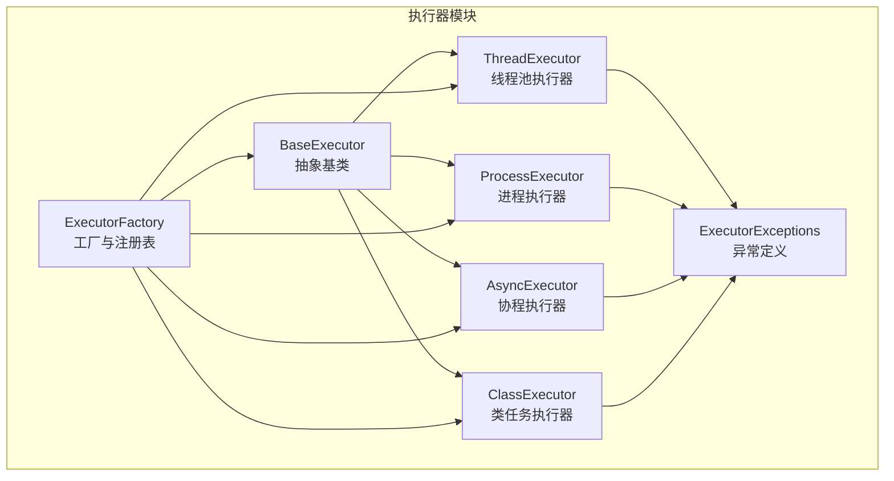
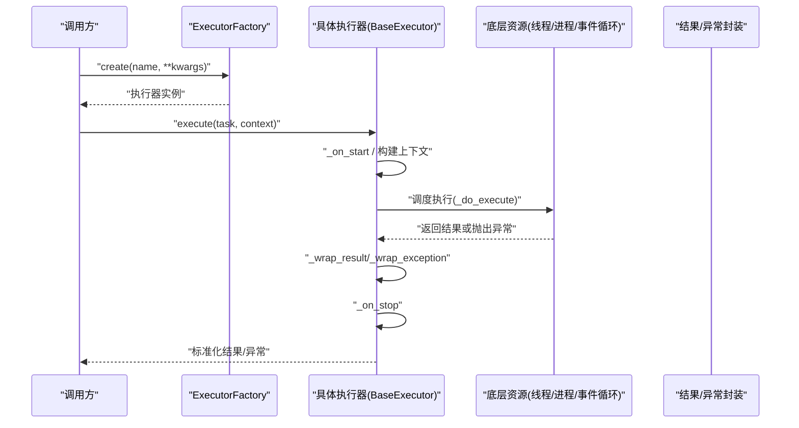
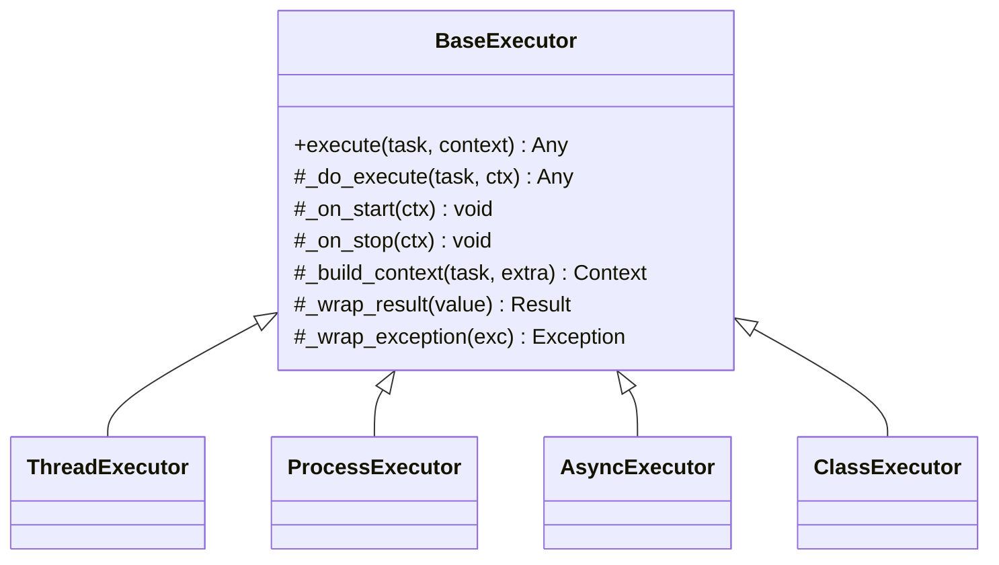
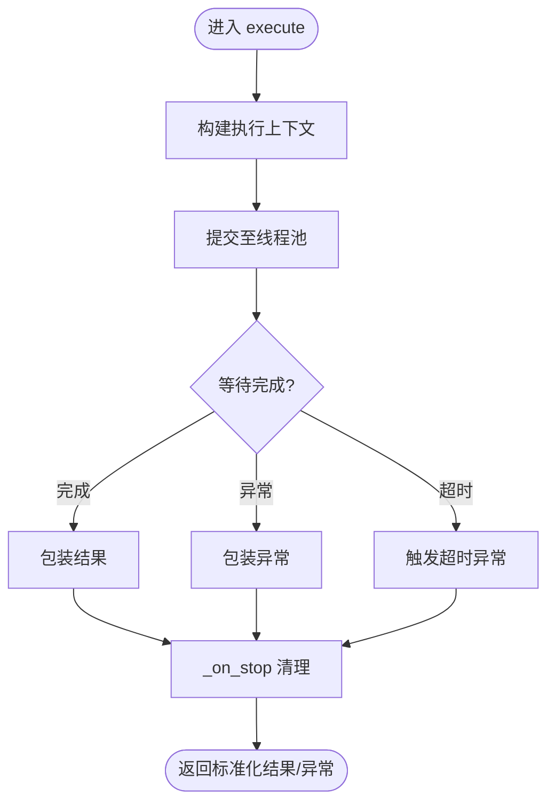
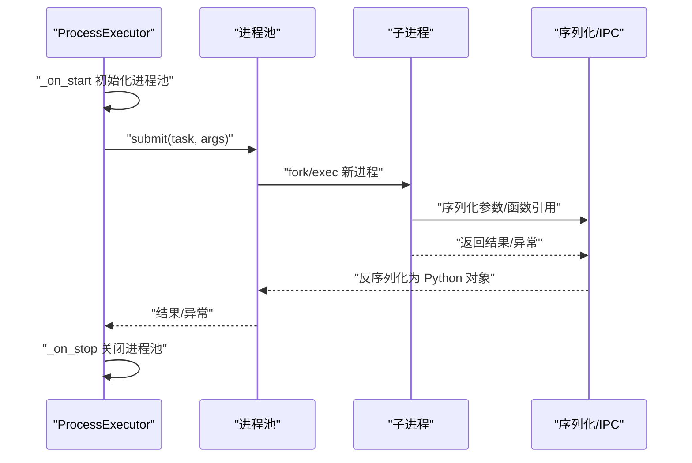
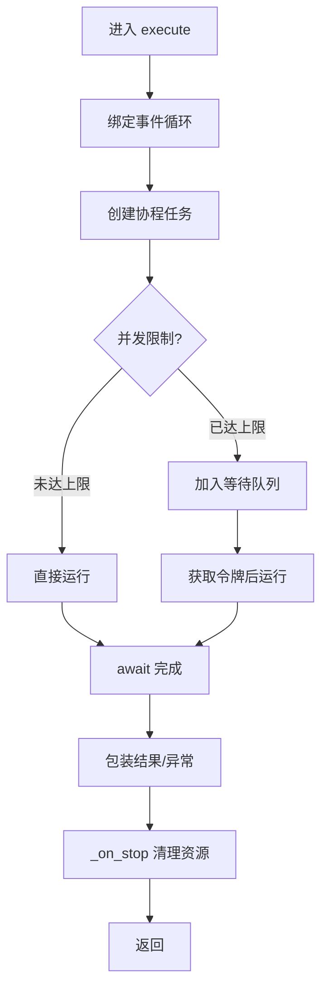
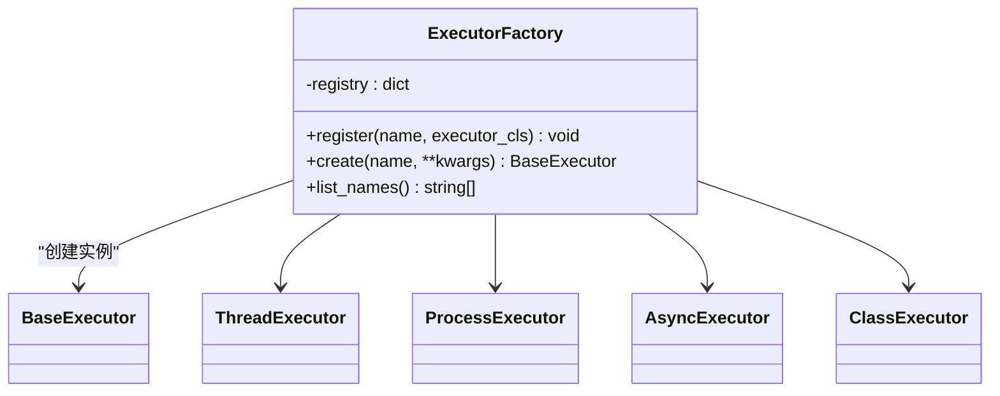
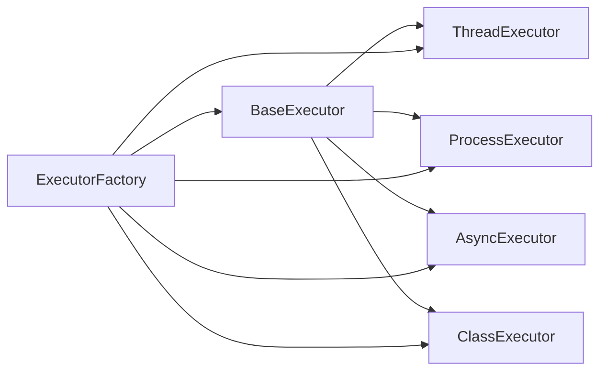

# 自定义执行器开发

<cite>
**本文引用的文件**   
- [src/neotask/executor/base.py](file://src/neotask/executor/base.py)
- [src/neotask/executor/thread_executor.py](file://src/neotask/executor/thread_executor.py)
- [src/neotask/executor/process_executor.py](file://src/neotask/executor/process_executor.py)
- [src/neotask/executor/async_executor.py](file://src/neotask/executor/async_executor.py)
- [src/neotask/executor/factory.py](file://src/neotask/executor/factory.py)
- [src/neotask/executor/class_executor.py](file://src/neotask/executor/class_executor.py)
- [src/neotask/executor/exceptions.py](file://src/neotask/executor/exceptions.py)
- [tests/unit/test_executors.py](file://tests/unit/test_executors.py)
</cite>

## 目录
1. [简介](#简介)
2. [项目结构](#项目结构)
3. [核心组件](#核心组件)
4. [架构总览](#架构总览)
5. [详细组件分析](#详细组件分析)
6. [依赖关系分析](#依赖关系分析)
7. [性能考虑](#性能考虑)
8. [故障排查指南](#故障排查指南)
9. [结论](#结论)
10. [附录](#附录)

## 简介
本文件面向希望扩展或替换任务执行器的开发者，系统阐述 BaseExecutor 抽象基类的设计模式与接口规范，详解 execute 方法、生命周期管理、错误处理机制；并提供线程池执行器、进程执行器、异步执行器的完整实现思路与示例路径。同时说明执行器工厂模式的注册与使用方式，给出配置选项、性能调优参数、资源管理策略以及测试方法与最佳实践。

## 项目结构
执行器子系统位于 src/neotask/executor 目录下，采用“抽象基类 + 多实现 + 工厂”的分层组织：
- base.py：定义 BaseExecutor 抽象基类与通用能力（生命周期、上下文、错误封装等）
- thread_executor.py：基于线程池的同步/异步混合执行器
- process_executor.py：基于子进程的隔离执行器
- async_executor.py：基于事件循环的协程执行器
- factory.py：执行器工厂，负责注册与创建具体执行器实例
- class_executor.py：面向类的任务执行器（支持类方法与静态方法）
- exceptions.py：执行器相关异常类型

**图表来源**
- [src/neotask/executor/base.py](file://src/neotask/executor/base.py)
- [src/neotask/executor/thread_executor.py](file://src/neotask/executor/thread_executor.py)
- [src/neotask/executor/process_executor.py](file://src/neotask/executor/process_executor.py)
- [src/neotask/executor/async_executor.py](file://src/neotask/executor/async_executor.py)
- [src/neotask/executor/class_executor.py](file://src/neotask/executor/class_executor.py)
- [src/neotask/executor/factory.py](file://src/neotask/executor/factory.py)
- [src/neotask/executor/exceptions.py](file://src/neotask/executor/exceptions.py)

**章节来源**
- [src/neotask/executor/base.py](file://src/neotask/executor/base.py)
- [src/neotask/executor/thread_executor.py](file://src/neotask/executor/thread_executor.py)
- [src/neotask/executor/process_executor.py](file://src/neotask/executor/process_executor.py)
- [src/neotask/executor/async_executor.py](file://src/neotask/executor/async_executor.py)
- [src/neotask/executor/class_executor.py](file://src/neotask/executor/class_executor.py)
- [src/neotask/executor/factory.py](file://src/neotask/executor/factory.py)
- [src/neotask/executor/exceptions.py](file://src/neotask/executor/exceptions.py)

## 核心组件
- BaseExecutor 抽象基类
  - 职责：统一执行器契约、生命周期钩子、上下文注入、结果与异常包装、可观测性埋点入口
  - 关键接口：execute、_do_execute、_on_start、_on_stop、_on_error、_build_context、_wrap_result、_wrap_exception
  - 设计要点：模板方法模式（execute 为外部稳定入口，内部由子类实现 _do_execute），组合优于继承（通过上下文对象传递运行时信息）
- 具体执行器
  - ThreadExecutor：基于线程池，适合 I/O 密集或轻量 CPU 任务
  - ProcessExecutor：基于子进程，适合需要强隔离的重 CPU 或不受信任代码
  - AsyncExecutor：基于 asyncio，适合高并发协程任务
  - ClassExecutor：对类方法进行适配，便于面向对象的任务建模
- ExecutorFactory
  - 职责：维护执行器名称到类型的映射，提供 create(name, **kwargs) 创建实例，支持动态注册
- 异常体系
  - 定义执行器专用异常，用于区分超时、取消、资源不足、序列化失败等场景

**章节来源**
- [src/neotask/executor/base.py](file://src/neotask/executor/base.py)
- [src/neotask/executor/thread_executor.py](file://src/neotask/executor/thread_executor.py)
- [src/neotask/executor/process_executor.py](file://src/neotask/executor/process_executor.py)
- [src/neotask/executor/async_executor.py](file://src/neotask/executor/async_executor.py)
- [src/neotask/executor/class_executor.py](file://src/neotask/executor/class_executor.py)
- [src/neotask/executor/factory.py](file://src/neotask/executor/factory.py)
- [src/neotask/executor/exceptions.py](file://src/neotask/executor/exceptions.py)

## 架构总览
下图展示执行器在系统中的位置与交互关系：上层调度/队列将任务提交给执行器，执行器根据策略选择线程/进程/协程执行，并通过工厂进行实例化与生命周期管理。

**图表来源**
- [src/neotask/executor/factory.py](file://src/neotask/executor/factory.py)
- [src/neotask/executor/base.py](file://src/neotask/executor/base.py)
- [src/neotask/executor/thread_executor.py](file://src/neotask/executor/thread_executor.py)
- [src/neotask/executor/process_executor.py](file://src/neotask/executor/process_executor.py)
- [src/neotask/executor/async_executor.py](file://src/neotask/executor/async_executor.py)

## 详细组件分析

### BaseExecutor 抽象基类
- 设计模式
  - 模板方法：execute 作为稳定入口，内部委托 _do_execute 由子类实现
  - 生命周期钩子：_on_start/_on_stop 用于资源准备与清理
  - 上下文注入：_build_context 将任务元数据与环境变量注入执行上下文
  - 结果/异常包装：_wrap_result/_wrap_exception 统一输出格式与错误语义
- 关键接口约定
  - execute(task, context=None) -> 标准化结果
  - _do_execute(task, ctx) -> 实际执行逻辑（子类必须实现）
  - _on_start(ctx) -> 可选初始化
  - _on_stop(ctx) -> 可选清理
  - _build_context(task, extra) -> 构造上下文对象
  - _wrap_result(value) -> 包装成功结果
  - _wrap_exception(exc) -> 包装异常并转换为标准异常类型
- 错误处理机制
  - 捕获底层异常，转换为执行器异常域
  - 支持超时、取消、资源不足等语义化错误
  - 保证 _on_stop 在异常路径也能执行（finally 语义）

**图表来源**
- [src/neotask/executor/base.py](file://src/neotask/executor/base.py)
- [src/neotask/executor/thread_executor.py](file://src/neotask/executor/thread_executor.py)
- [src/neotask/executor/process_executor.py](file://src/neotask/executor/process_executor.py)
- [src/neotask/executor/async_executor.py](file://src/neotask/executor/async_executor.py)
- [src/neotask/executor/class_executor.py](file://src/neotask/executor/class_executor.py)

**章节来源**
- [src/neotask/executor/base.py](file://src/neotask/executor/base.py)

### 线程池执行器（ThreadExecutor）
- 适用场景：I/O 密集型、轻量 CPU 任务；低延迟、高吞吐
- 关键特性
  - 基于线程池，支持最大并发数、队列长度、超时时间等配置
  - 支持取消与中断传播
  - 自动回收空闲线程，避免资源泄漏
- 典型配置项
  - max_workers：工作线程数
  - queue_size：任务队列上限
  - timeout：单次执行超时
  - shutdown_timeout：优雅关闭等待时间

**图表来源**
- [src/neotask/executor/thread_executor.py](file://src/neotask/executor/thread_executor.py)
- [src/neotask/executor/base.py](file://src/neotask/executor/base.py)

**章节来源**
- [src/neotask/executor/thread_executor.py](file://src/neotask/executor/thread_executor.py)

### 进程执行器（ProcessExecutor）
- 适用场景：强隔离、重 CPU、不可信代码执行
- 关键特性
  - 基于子进程，具备内存与 GIL 隔离
  - 支持进程池复用，降低启动开销
  - 进程间通信需序列化，注意大数据传输成本
- 典型配置项
  - max_processes：最大进程数
  - process_timeout：进程执行超时
  - serialization：序列化策略（pickle/json 等）
  - cleanup_interval：进程回收间隔

**图表来源**
- [src/neotask/executor/process_executor.py](file://src/neotask/executor/process_executor.py)
- [src/neotask/executor/base.py](file://src/neotask/executor/base.py)

**章节来源**
- [src/neotask/executor/process_executor.py](file://src/neotask/executor/process_executor.py)

### 异步执行器（AsyncExecutor）
- 适用场景：高并发协程任务、与 asyncio 生态集成
- 关键特性
  - 基于事件循环，零拷贝协程调度
  - 支持并发度控制、任务取消、超时
  - 可与现有异步框架无缝对接
- 典型配置项
  - concurrency：并发协程上限
  - loop：事件循环实例
  - cancel_on_timeout：是否按任务粒度取消
  - metrics：指标采集开关

**图表来源**
- [src/neotask/executor/async_executor.py](file://src/neotask/executor/async_executor.py)
- [src/neotask/executor/base.py](file://src/neotask/executor/base.py)

**章节来源**
- [src/neotask/executor/async_executor.py](file://src/neotask/executor/async_executor.py)

### 类任务执行器（ClassExecutor）
- 适用场景：面向对象建模的任务，支持类方法、静态方法、属性注入
- 关键特性
  - 自动解析类与方法签名，生成可调用的执行体
  - 支持依赖注入与上下文访问
  - 与 BaseExecutor 完全兼容
- 典型配置项
  - method：目标方法名
  - static：是否为静态方法
  - inject：依赖注入映射

**章节来源**
- [src/neotask/executor/class_executor.py](file://src/neotask/executor/class_executor.py)

### 执行器工厂与注册机制（ExecutorFactory）
- 职责
  - 维护“名称 -> 执行器类型”的注册表
  - 提供 create(name, **kwargs) 创建实例
  - 支持动态注册自定义执行器
- 使用方法
  - 内置注册：默认注册 thread/process/async/class 四类
  - 自定义注册：通过 register(name, executor_cls) 添加
  - 创建实例：factory.create("thread", max_workers=8)

**图表来源**
- [src/neotask/executor/factory.py](file://src/neotask/executor/factory.py)
- [src/neotask/executor/base.py](file://src/neotask/executor/base.py)
- [src/neotask/executor/thread_executor.py](file://src/neotask/executor/thread_executor.py)
- [src/neotask/executor/process_executor.py](file://src/neotask/executor/process_executor.py)
- [src/neotask/executor/async_executor.py](file://src/neotask/executor/async_executor.py)
- [src/neotask/executor/class_executor.py](file://src/neotask/executor/class_executor.py)

**章节来源**
- [src/neotask/executor/factory.py](file://src/neotask/executor/factory.py)

## 依赖关系分析
- 内聚性与耦合
  - BaseExecutor 仅暴露最小必要接口，具体执行器与其耦合度高但彼此解耦
  - 工厂与具体执行器之间通过名称注册松耦合
- 外部依赖
  - 线程池：concurrent.futures.ThreadPoolExecutor
  - 进程池：multiprocessing.Pool 或自定义进程池
  - 事件循环：asyncio.get_event_loop 或传入自定义 loop
- 潜在循环依赖
  - 当前结构无循环导入风险；新增执行器时建议仅依赖 BaseExecutor 与异常模块

**图表来源**
- [src/neotask/executor/base.py](file://src/neotask/executor/base.py)
- [src/neotask/executor/factory.py](file://src/neotask/executor/factory.py)
- [src/neotask/executor/thread_executor.py](file://src/neotask/executor/thread_executor.py)
- [src/neotask/executor/process_executor.py](file://src/neotask/executor/process_executor.py)
- [src/neotask/executor/async_executor.py](file://src/neotask/executor/async_executor.py)
- [src/neotask/executor/class_executor.py](file://src/neotask/executor/class_executor.py)

**章节来源**
- [src/neotask/executor/base.py](file://src/neotask/executor/base.py)
- [src/neotask/executor/factory.py](file://src/neotask/executor/factory.py)

## 性能考虑
- 线程池执行器
  - 合理设置 max_workers：I/O 密集可按 CPU 核数×倍数，CPU 密集建议接近核数
  - 队列长度与背压：过大队列会放大内存占用，应结合监控阈值限流
  - 超时与取消：避免长尾任务拖垮整体吞吐
- 进程执行器
  - 进程池大小：受限于内存与 CPU，通常不超过 CPU 核数
  - 序列化成本：大对象频繁跨进程传输会显著影响性能，建议分块或共享内存
  - 进程重启与自愈：异常退出后快速重建，避免雪崩
- 异步执行器
  - 并发度：根据 I/O 阻塞程度调整，避免过多协程导致上下文切换开销
  - 事件循环隔离：不同业务域可使用独立 loop，减少锁竞争
- 通用优化
  - 预热：启动阶段预创建资源，降低冷启动抖动
  - 指标埋点：记录 QPS、P99、错误率、资源使用率，指导容量规划
  - 优雅关闭：确保所有任务完成或安全取消后再释放资源

[本节为通用性能建议，不直接分析具体文件]

## 故障排查指南
- 常见问题定位
  - 执行超时：检查超时配置与任务耗时分布，必要时拆分任务或提升资源
  - 资源耗尽：监控线程/进程/协程数量与队列长度，调整并发上限
  - 序列化失败：确认进程执行器中对象可被正确序列化
  - 死锁与饥饿：避免在任务中持有全局锁过久，合理分配优先级
- 调试技巧
  - 开启详细日志：记录任务 ID、开始/结束时间、异常堆栈
  - 使用工厂创建带监控的执行器实例，观察指标变化
  - 单元测试覆盖异常路径，验证 _on_stop 清理逻辑
- 参考测试用例
  - 执行器基础行为与异常路径测试见 tests/unit/test_executors.py

**章节来源**
- [tests/unit/test_executors.py](file://tests/unit/test_executors.py)
- [src/neotask/executor/exceptions.py](file://src/neotask/executor/exceptions.py)

## 结论
通过 BaseExecutor 抽象基类与工厂模式，本项目提供了可扩展、可插拔的执行器体系。开发者可基于该体系快速实现自定义执行器，并在生产环境中通过配置与监控进行精细化调优。遵循本文的最佳实践，可在稳定性、性能与可维护性之间取得良好平衡。

[本节为总结性内容，不直接分析具体文件]

## 附录

### 自定义执行器实现步骤（示例路径）
- 新建执行器类
  - 路径建议：src/neotask/executor/my_executor.py
  - 继承 BaseExecutor，实现 _do_execute，按需重写生命周期钩子
- 注册执行器
  - 路径参考：src/neotask/executor/factory.py
  - 在合适时机调用 register("my", MyExecutor)
- 使用工厂创建实例
  - 路径参考：src/neotask/executor/factory.py
  - 通过 create("my", **config) 获取实例并执行任务
- 编写测试
  - 路径参考：tests/unit/test_executors.py
  - 覆盖正常流程、异常路径、超时与取消、资源清理

**章节来源**
- [src/neotask/executor/base.py](file://src/neotask/executor/base.py)
- [src/neotask/executor/factory.py](file://src/neotask/executor/factory.py)
- [tests/unit/test_executors.py](file://tests/unit/test_executors.py)

### 配置选项速查（常见字段）
- 线程池执行器
  - max_workers、queue_size、timeout、shutdown_timeout
- 进程执行器
  - max_processes、process_timeout、serialization、cleanup_interval
- 异步执行器
  - concurrency、loop、cancel_on_timeout、metrics
- 类任务执行器
  - method、static、inject

[本节为概念性说明，不直接分析具体文件]

### 最佳实践清单
- 始终在 _on_stop 中释放资源，确保异常路径也能清理
- 使用工厂统一管理执行器生命周期，避免手动管理带来的不一致
- 为每个执行器设置合理的超时与取消策略
- 对关键路径增加指标埋点与告警
- 在单元测试中模拟异常与超时，验证健壮性

[本节为通用建议，不直接分析具体文件]