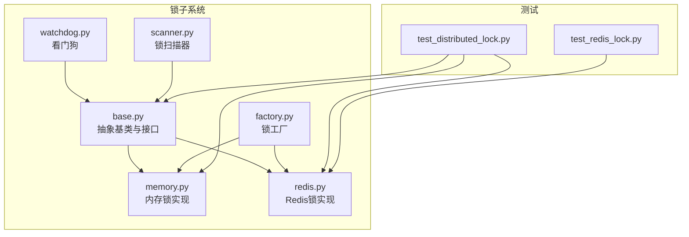
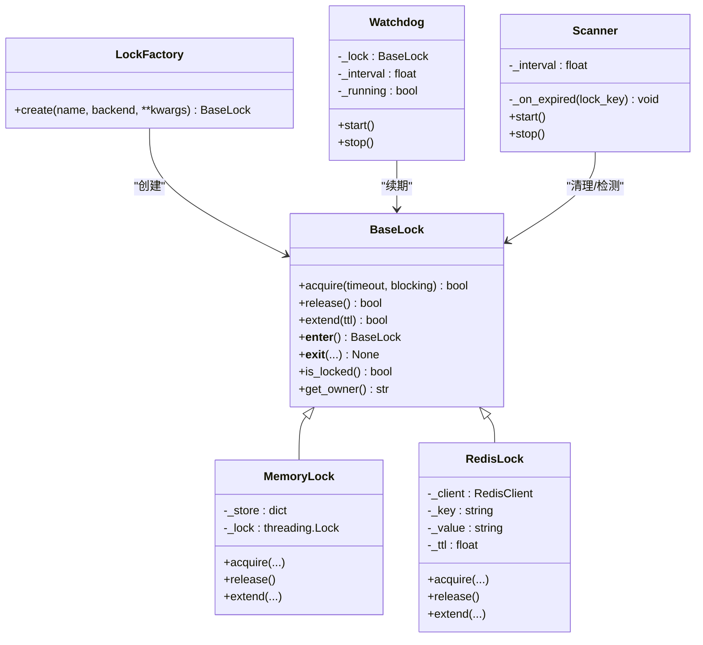
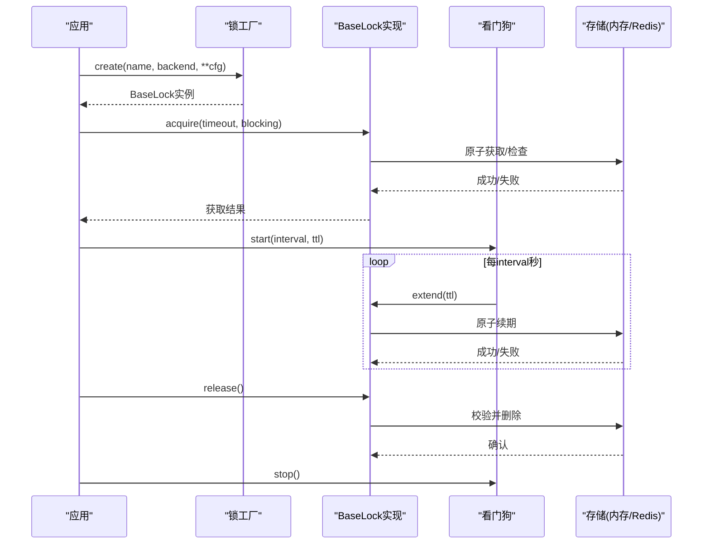
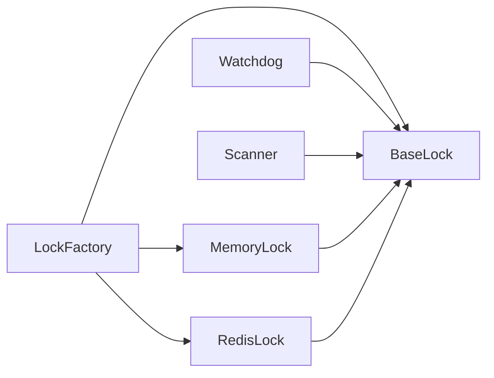

# 自定义锁机制

<cite>
**本文引用的文件**   
- [src/neotask/lock/base.py](file://src/neotask/lock/base.py)
- [src/neotask/lock/memory.py](file://src/neotask/lock/memory.py)
- [src/neotask/lock/redis.py](file://src/neotask/lock/redis.py)
- [src/neotask/lock/watchdog.py](file://src/neotask/lock/watchdog.py)
- [src/neotask/lock/scanner.py](file://src/neotask/lock/scanner.py)
- [src/neotask/lock/factory.py](file://src/neotask/lock/factory.py)
- [tests/distributed/test_distributed_lock.py](file://tests/distributed/test_distributed_lock.py)
- [tests/distributed/test_redis_lock.py](file://tests/distributed/test_redis_lock.py)
</cite>

## 目录
1. [引言](#引言)
2. [项目结构](#项目结构)
3. [核心组件](#核心组件)
4. [架构总览](#架构总览)
5. [详细组件分析](#详细组件分析)
6. [依赖分析](#依赖分析)
7. [性能考虑](#性能考虑)
8. [故障排查指南](#故障排查指南)
9. [结论](#结论)
10. [附录](#附录)

## 引言
本文件面向需要实现或扩展分布式锁的开发者，围绕仓库中的锁子系统给出完整的技术文档。内容覆盖：
- BaseLock 抽象类的接口规范与锁语义定义
- 锁获取、释放、续期的实现要求
- 内存锁与 Redis 锁的完整实现要点
- 看门狗机制与锁扫描器的作用原理
- 超时处理、死锁检测、公平性保证策略
- 一致性保证与性能优化方法
- 自定义锁实现的步骤与测试策略

## 项目结构
锁子系统位于 src/neotask/lock 目录下，包含抽象基类、具体实现（内存、Redis）、工厂、看门狗与扫描器等模块；测试用例位于 tests/distributed 下。

图表来源
- [src/neotask/lock/base.py](file://src/neotask/lock/base.py)
- [src/neotask/lock/memory.py](file://src/neotask/lock/memory.py)
- [src/neotask/lock/redis.py](file://src/neotask/lock/redis.py)
- [src/neotask/lock/factory.py](file://src/neotask/lock/factory.py)
- [src/neotask/lock/watchdog.py](file://src/neotask/lock/watchdog.py)
- [src/neotask/lock/scanner.py](file://src/neotask/lock/scanner.py)
- [tests/distributed/test_distributed_lock.py](file://tests/distributed/test_distributed_lock.py)
- [tests/distributed/test_redis_lock.py](file://tests/distributed/test_redis_lock.py)

章节来源
- [src/neotask/lock/base.py](file://src/neotask/lock/base.py)
- [src/neotask/lock/memory.py](file://src/neotask/lock/memory.py)
- [src/neotask/lock/redis.py](file://src/neotask/lock/redis.py)
- [src/neotask/lock/factory.py](file://src/neotask/lock/factory.py)
- [src/neotask/lock/watchdog.py](file://src/neotask/lock/watchdog.py)
- [src/neotask/lock/scanner.py](file://src/neotask/lock/scanner.py)
- [tests/distributed/test_distributed_lock.py](file://tests/distributed/test_distributed_lock.py)
- [tests/distributed/test_redis_lock.py](file://tests/distributed/test_redis_lock.py)

## 核心组件
- BaseLock 抽象类：定义统一的锁接口与语义，包括获取、释放、续期、上下文管理、状态查询等。
- MemoryLock：基于进程内数据结构的轻量锁，适用于单进程或多进程共享内存场景。
- RedisLock：基于 Redis 原子操作的分布式锁，支持过期、续期与跨进程/节点互斥。
- LockFactory：根据配置创建不同后端锁实例。
- Watchdog：自动续期守护线程，防止业务执行时间超过锁过期时间导致提前释放。
- Scanner：周期性扫描并清理“孤儿锁”或异常持有的锁，辅助死锁恢复。

章节来源
- [src/neotask/lock/base.py](file://src/neotask/lock/base.py)
- [src/neotask/lock/memory.py](file://src/neotask/lock/memory.py)
- [src/neotask/lock/redis.py](file://src/neotask/lock/redis.py)
- [src/neotask/lock/factory.py](file://src/neotask/lock/factory.py)
- [src/neotask/lock/watchdog.py](file://src/neotask/lock/watchdog.py)
- [src/neotask/lock/scanner.py](file://src/neotask/lock/scanner.py)

## 架构总览
下图展示了锁子系统的主要交互关系：应用通过工厂获取锁实例，使用上下文管理器或显式调用进行加锁/解锁；看门狗在持有锁期间定期续期；扫描器负责清理异常锁。

图表来源
- [src/neotask/lock/base.py](file://src/neotask/lock/base.py)
- [src/neotask/lock/memory.py](file://src/neotask/lock/memory.py)
- [src/neotask/lock/redis.py](file://src/neotask/lock/redis.py)
- [src/neotask/lock/factory.py](file://src/neotask/lock/factory.py)
- [src/neotask/lock/watchdog.py](file://src/neotask/lock/watchdog.py)
- [src/neotask/lock/scanner.py](file://src/neotask/lock/scanner.py)

## 详细组件分析

### BaseLock 抽象类与锁语义
- 接口规范
  - acquire(timeout=None, blocking=True) -> bool：尝试获取锁，支持阻塞与非阻塞模式，可设置最大等待时间。
  - release() -> bool：释放当前持有的锁，需校验所有权，避免误释放。
  - extend(ttl) -> bool：在已有锁基础上延长有效期，用于看门狗续期。
  - __enter__/__exit__：支持 with 语句的上下文管理。
  - is_locked() -> bool：查询锁是否被持有。
  - get_owner() -> str：返回当前锁持有者标识。
- 锁语义
  - 互斥性：同一时刻仅一个持有者。
  - 可重入性：可选，由具体实现决定。
  - 公平性：可选，按请求顺序分配。
  - 原子性：获取与更新状态必须原子操作。
  - 幂等性：重复释放应安全。
- 错误与边界
  - 超时未获取到锁时返回失败或抛出异常（由上层约定）。
  - 非持有者释放应拒绝并记录日志。
  - 续期失败需区分网络抖动与锁已过期。

章节来源
- [src/neotask/lock/base.py](file://src/neotask/lock/base.py)

### 内存锁 MemoryLock
- 设计要点
  - 使用进程内字典存储锁键与持有者信息，配合线程锁保证并发安全。
  - 支持 TTL 与自动过期清理（可结合定时器或惰性检查）。
  - 适合单进程多线程或共享内存的多进程场景。
- 关键流程
  - 获取：检查键是否存在且未过期；若存在则判断是否为自身重入；否则等待或立即失败。
  - 释放：校验持有者身份后删除键或减少重入计数。
  - 续期：更新 TTL。
- 复杂度
  - 获取/释放/续期均为 O(1)。
- 适用场景
  - 单机服务内部临界区保护、单元测试、快速原型验证。

章节来源
- [src/neotask/lock/memory.py](file://src/neotask/lock/memory.py)

### Redis 锁 RedisLock
- 设计要点
  - 使用 Redis 原子命令（如 SET NX EX/PX）实现互斥。
  - 值中包含唯一标识（如节点ID+线程ID），确保仅持有者可释放。
  - 支持 TTL 与续期，结合 Lua 脚本保证原子性与安全性。
- 关键流程
  - 获取：尝试以唯一值为键写入，带过期时间；失败则自旋或退避重试直至超时。
  - 释放：校验值一致后删除键，或使用原子脚本比较并删除。
  - 续期：使用原子脚本将 TTL 延长至新值。
- 一致性保障
  - 利用 Redis 单线程模型与原子命令保证强一致性。
  - 建议开启连接池与合理超时，避免网络抖动导致的误判。
- 复杂度
  - 获取/释放/续期均为 O(1)，受网络 RTT 影响。

章节来源
- [src/neotask/lock/redis.py](file://src/neotask/lock/redis.py)

### 锁工厂 LockFactory
- 职责
  - 根据后端类型（memory/redis）和配置参数创建对应锁实例。
  - 提供统一入口，便于替换与扩展新的锁后端。
- 使用方式
  - 通过名称与后端选择获取锁对象，后续统一使用 BaseLock 接口。

章节来源
- [src/neotask/lock/factory.py](file://src/neotask/lock/factory.py)

### 看门狗 Watchdog
- 目标
  - 在持有锁的业务执行期间，周期性续期以避免因业务耗时过长导致锁提前释放。
- 工作原理
  - 启动独立线程，每隔 interval 秒调用 lock.extend(ttl)。
  - 当锁释放或停止信号到达时退出循环。
- 注意事项
  - 续期间隔应小于 TTL，避免频繁续期造成额外开销。
  - 对续期失败进行指数退避重试与告警。

章节来源
- [src/neotask/lock/watchdog.py](file://src/neotask/lock/watchdog.py)

### 锁扫描器 Scanner
- 目标
  - 周期性扫描锁状态，识别并清理“孤儿锁”或长时间未续期的锁，辅助死锁恢复。
- 工作原理
  - 遍历锁集合或特定命名空间，检查 TTL 与最后活跃时间。
  - 对异常锁执行回收或标记，触发回调通知上层。
- 适用场景
  - 多节点环境下，节点崩溃后残留锁的清理。
  - 监控与审计：统计锁占用时长、热点键等。

章节来源
- [src/neotask/lock/scanner.py](file://src/neotask/lock/scanner.py)

### 获取-续期-释放时序

图表来源
- [src/neotask/lock/factory.py](file://src/neotask/lock/factory.py)
- [src/neotask/lock/base.py](file://src/neotask/lock/base.py)
- [src/neotask/lock/watchdog.py](file://src/neotask/lock/watchdog.py)
- [src/neotask/lock/memory.py](file://src/neotask/lock/memory.py)
- [src/neotask/lock/redis.py](file://src/neotask/lock/redis.py)

## 依赖分析
- 耦合关系
  - MemoryLock/RedisLock 均依赖 BaseLock 接口，降低上层耦合。
  - Watchdog/Scanner 依赖 BaseLock 提供的续期与状态查询能力。
  - LockFactory 集中管理后端选择，屏蔽差异。
- 外部依赖
  - RedisLock 依赖 Redis 客户端与原子脚本能力。
  - MemoryLock 依赖标准库线程同步原语。
- 潜在循环依赖
  - 当前模块划分清晰，未见循环导入风险。

图表来源
- [src/neotask/lock/factory.py](file://src/neotask/lock/factory.py)
- [src/neotask/lock/base.py](file://src/neotask/lock/base.py)
- [src/neotask/lock/memory.py](file://src/neotask/lock/memory.py)
- [src/neotask/lock/redis.py](file://src/neotask/lock/redis.py)
- [src/neotask/lock/watchdog.py](file://src/neotask/lock/watchdog.py)
- [src/neotask/lock/scanner.py](file://src/neotask/lock/scanner.py)

章节来源
- [src/neotask/lock/factory.py](file://src/neotask/lock/factory.py)
- [src/neotask/lock/base.py](file://src/neotask/lock/base.py)
- [src/neotask/lock/memory.py](file://src/neotask/lock/memory.py)
- [src/neotask/lock/redis.py](file://src/neotask/lock/redis.py)
- [src/neotask/lock/watchdog.py](file://src/neotask/lock/watchdog.py)
- [src/neotask/lock/scanner.py](file://src/neotask/lock/scanner.py)

## 性能考虑
- 获取路径优化
  - 短轮询+指数退避，避免忙等。
  - 批量预取与缓存最近失败键，减少热点竞争。
- 续期优化
  - 动态调整续期间隔，依据业务耗时分布自适应。
  - 合并续期请求，避免高频小粒度调用。
- 存储层优化
  - Redis：使用连接池、合理 socket 超时、Lua 脚本减少往返。
  - 内存：使用无锁数据结构或分片表降低锁粒度。
- 观测与限流
  - 暴露指标：获取耗时、成功率、续期次数、锁持有时长分布。
  - 对高竞争键做限流与降级策略。

[本节为通用指导，不直接分析具体文件]

## 故障排查指南
- 常见问题
  - 锁无法释放：检查所有权校验逻辑与异常分支是否正确释放。
  - 锁提前释放：确认 TTL 与续期间隔配置，查看看门狗是否运行。
  - 死锁/长持锁：启用扫描器并观察异常锁清理日志。
- 定位手段
  - 打印获取/释放/续期关键路径日志，附带持有者与 TTL。
  - 使用扫描器输出热点键与占用时长排行。
  - 针对 Redis 锁，检查键空间与过期时间是否符合预期。
- 恢复策略
  - 强制清理孤儿锁（谨慎使用，需具备唯一标识与审计）。
  - 重启看门狗与扫描器，确保后台任务健康。

章节来源
- [src/neotask/lock/watchdog.py](file://src/neotask/lock/watchdog.py)
- [src/neotask/lock/scanner.py](file://src/neotask/lock/scanner.py)
- [src/neotask/lock/redis.py](file://src/neotask/lock/redis.py)
- [src/neotask/lock/memory.py](file://src/neotask/lock/memory.py)

## 结论
该锁子系统通过清晰的抽象与模块化设计，提供了可扩展的分布式锁能力。BaseLock 定义了统一接口与语义，MemoryLock 与 RedisLock 分别满足单机与分布式场景；看门狗与扫描器共同保障锁的生命周期管理与异常恢复。通过合理的超时、续期与一致性策略，可在高并发与不稳定网络环境中获得稳定可靠的互斥能力。

[本节为总结，不直接分析具体文件]

## 附录

### 超时处理、死锁检测与公平性策略
- 超时处理
  - acquire 支持 timeout，失败路径应快速返回并允许上层重试或降级。
- 死锁检测
  - 扫描器定期检测长时间未续期的锁，结合业务心跳判定是否异常。
- 公平性保证
  - 可通过队列化请求顺序或基于时间戳排序实现 FIFO 公平锁（需在 BaseLock 中扩展接口并由具体实现提供）。

[本节为概念性说明，不直接分析具体文件]

### 一致性保证与性能优化方法
- 一致性
  - Redis 锁依赖原子命令与唯一值校验，确保“仅持有者可释放”。
  - 内存锁依赖进程内原子性与线程安全结构。
- 性能优化
  - 减少网络往返（Lua 脚本、批量操作）。
  - 控制锁粒度与 TTL，避免过度细粒度过期带来的抖动。
  - 预热与缓存热点键的元信息，降低竞争时的系统开销。

[本节为概念性说明，不直接分析具体文件]

### 自定义锁实现示例与测试策略
- 实现步骤
  - 继承 BaseLock，实现 acquire/release/extend 及必要状态查询。
  - 确保原子性与幂等性，正确处理所有权校验与异常分支。
  - 集成看门狗与扫描器，完成生命周期管理。
- 测试策略
  - 单元层面：模拟获取/释放/续期成功与失败路径，校验状态机转换。
  - 并发层面：多线程/多进程竞争同一键，验证互斥与公平性（如实现）。
  - 稳定性层面：注入网络抖动、节点宕机，验证看门狗续期与扫描器清理。
  - 基准层面：测量吞吐、延迟、CPU/内存占用，对比不同后端。

章节来源
- [tests/distributed/test_distributed_lock.py](file://tests/distributed/test_distributed_lock.py)
- [tests/distributed/test_redis_lock.py](file://tests/distributed/test_redis_lock.py)