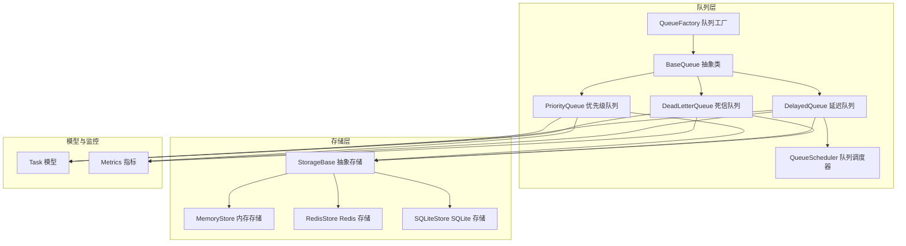
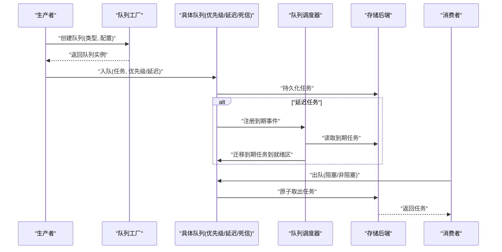
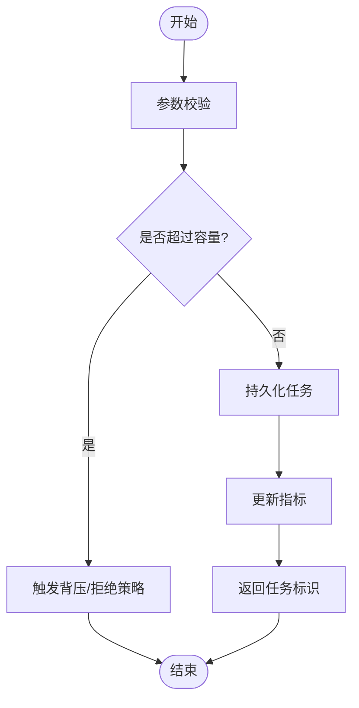
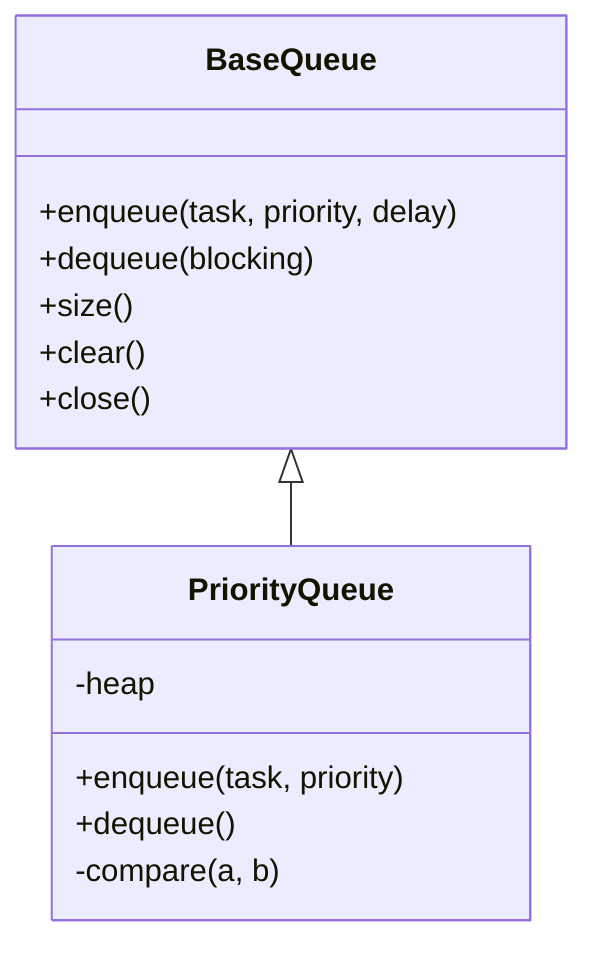
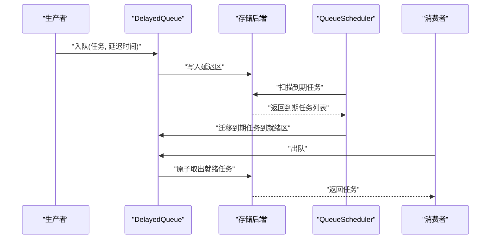
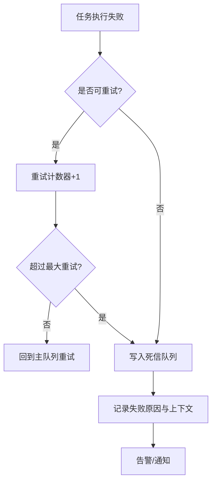
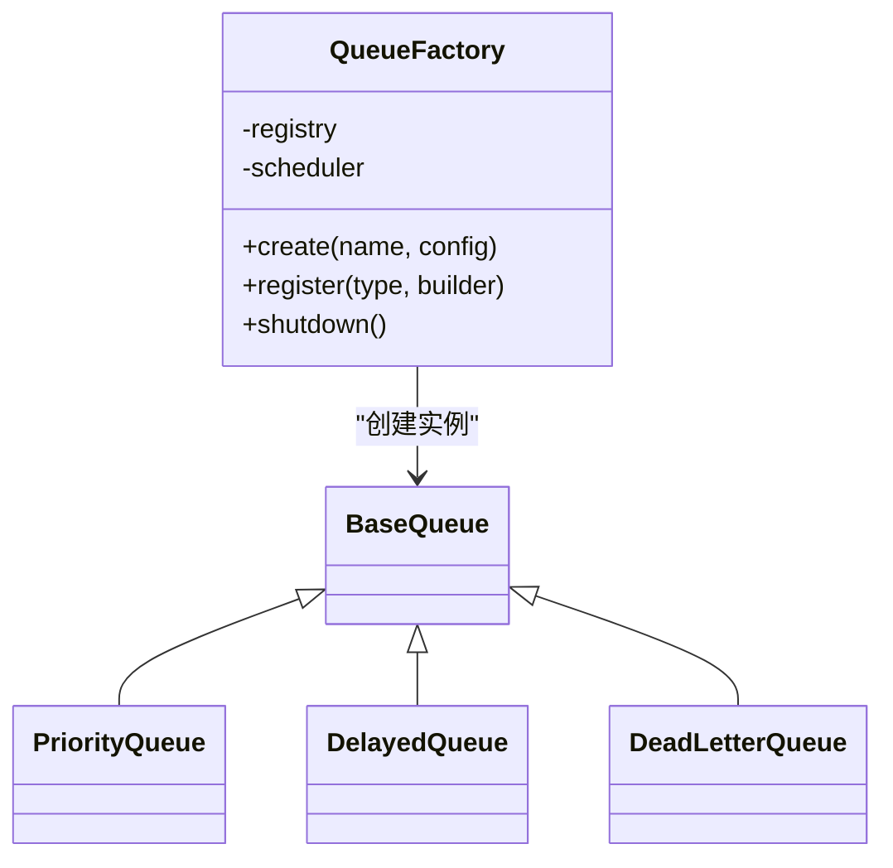
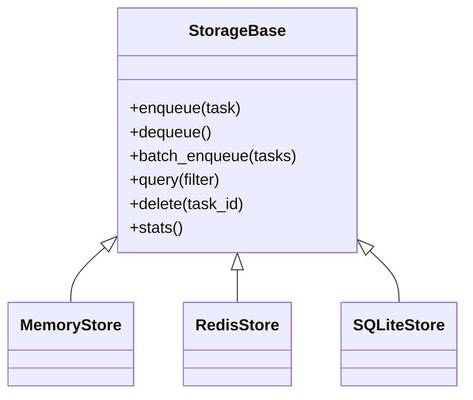
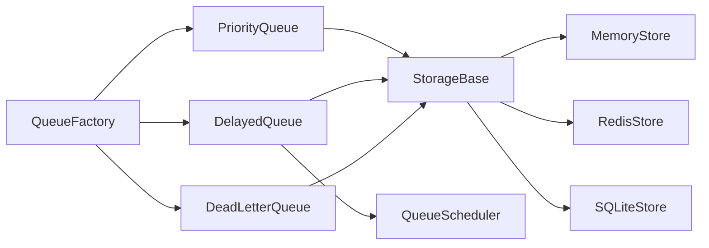

# 自定义队列类型

<cite>
**本文引用的文件**   
- [src/neotask/queue/base.py](file://src/neotask/queue/base.py)
- [src/neotask/queue/priority_queue.py](file://src/neotask/queue/priority_queue.py)
- [src/neotask/queue/delayed_queue.py](file://src/neotask/queue/delayed_queue.py)
- [src/neotask/queue/dead_letter.py](file://src/neotask/queue/dead_letter.py)
- [src/neotask/queue/factory.py](file://src/neotask/queue/factory.py)
- [src/neotask/queue/queue_scheduler.py](file://src/neotask/queue/queue_scheduler.py)
- [src/neotask/storage/base.py](file://src/neotask/storage/base.py)
- [src/neotask/storage/memory.py](file://src/neotask/storage/memory.py)
- [src/neotask/storage/redis.py](file://src/neotask/storage/redis.py)
- [src/neotask/storage/sqlite.py](file://src/neotask/storage/sqlite.py)
- [src/neotask/models/task.py](file://src/neotask/models/task.py)
- [src/neotask/monitor/metrics.py](file://src/neotask/monitor/metrics.py)
- [examples/03_priority.py](file://examples/03_priority.py)
- [examples/06_delayed_tasks.py](file://examples/06_delayed_tasks.py)
</cite>

## 目录
1. [简介](#简介)
2. [项目结构](#项目结构)
3. [核心组件](#核心组件)
4. [架构总览](#架构总览)
5. [详细组件分析](#详细组件分析)
6. [依赖关系分析](#依赖关系分析)
7. [性能考虑](#性能考虑)
8. [故障排查指南](#故障排查指南)
9. [结论](#结论)
10. [附录](#附录)

## 简介
本指南面向需要扩展或实现自定义队列类型的开发者，围绕 BaseQueue 抽象类与队列操作规范展开，系统讲解任务入队、出队、优先级排序、延迟处理等机制，并对优先级队列、延迟队列、死信队列的实现进行深入剖析。同时提供队列工厂的配置与扩展方法、持久化策略、监控指标、容量控制策略，以及性能调优与扩展性设计原则，并给出完整的自定义队列实现示例与生产环境部署建议。

## 项目结构
队列子系统位于 src/neotask/queue 下，采用“抽象基类 + 具体实现 + 调度器 + 工厂”的分层组织方式：
- 抽象基类：定义统一的队列接口与生命周期契约
- 具体实现：优先级队列、延迟队列、死信队列
- 调度器：驱动延迟任务的到期唤醒
- 工厂：按配置创建不同队列实例
- 存储后端：内存、Redis、SQLite 等可插拔存储
- 模型与监控：任务模型、指标采集

图表来源
- [src/neotask/queue/base.py](file://src/neotask/queue/base.py)
- [src/neotask/queue/priority_queue.py](file://src/neotask/queue/priority_queue.py)
- [src/neotask/queue/delayed_queue.py](file://src/neotask/queue/delayed_queue.py)
- [src/neotask/queue/dead_letter.py](file://src/neotask/queue/dead_letter.py)
- [src/neotask/queue/queue_scheduler.py](file://src/neotask/queue/queue_scheduler.py)
- [src/neotask/queue/factory.py](file://src/neotask/queue/factory.py)
- [src/neotask/storage/base.py](file://src/neotask/storage/base.py)
- [src/neotask/storage/memory.py](file://src/neotask/storage/memory.py)
- [src/neotask/storage/redis.py](file://src/neotask/storage/redis.py)
- [src/neotask/storage/sqlite.py](file://src/neotask/storage/sqlite.py)
- [src/neotask/models/task.py](file://src/neotask/models/task.py)
- [src/neotask/monitor/metrics.py](file://src/neotask/monitor/metrics.py)

章节来源
- [src/neotask/queue/base.py](file://src/neotask/queue/base.py)
- [src/neotask/queue/priority_queue.py](file://src/neotask/queue/priority_queue.py)
- [src/neotask/queue/delayed_queue.py](file://src/neotask/queue/delayed_queue.py)
- [src/neotask/queue/dead_letter.py](file://src/neotask/queue/dead_letter.py)
- [src/neotask/queue/queue_scheduler.py](file://src/neotask/queue/queue_scheduler.py)
- [src/neotask/queue/factory.py](file://src/neotask/queue/factory.py)
- [src/neotask/storage/base.py](file://src/neotask/storage/base.py)
- [src/neotask/storage/memory.py](file://src/neotask/storage/memory.py)
- [src/neotask/storage/redis.py](file://src/neotask/storage/redis.py)
- [src/neotask/storage/sqlite.py](file://src/neotask/storage/sqlite.py)
- [src/neotask/models/task.py](file://src/neotask/models/task.py)
- [src/neotask/monitor/metrics.py](file://src/neotask/monitor/metrics.py)

## 核心组件
- BaseQueue 抽象类
  - 职责：定义队列统一接口（入队、出队、查看长度、清空、关闭）、生命周期钩子、错误与异常约定、可选的容量限制与背压策略、监控埋点位置。
  - 关键能力：
    - 入队：支持普通入队与批量入队；可携带优先级、延迟时间、重试次数等元数据。
    - 出队：阻塞或非阻塞出队；支持条件出队（如仅返回满足条件的任务）。
    - 容量控制：当达到上限时触发拒绝或等待策略。
    - 监控：记录入队/出队耗时、队列长度、拒绝计数等指标。
- 具体队列实现
  - PriorityQueue：基于最小堆或外部索引结构维护优先级顺序，保证高优先级优先出队。
  - DelayedQueue：结合时间轮或延迟堆，将未到期任务暂存，到期后转入就绪队列供消费者拉取。
  - DeadLetterQueue：用于存放多次失败或不可恢复的任务，提供查询、重放、清理能力。
- QueueScheduler
  - 职责：周期性扫描延迟任务，将到期的任务从延迟区迁移至就绪区，确保延迟语义准确。
- QueueFactory
  - 职责：根据配置创建指定类型的队列实例，注入存储后端与调度器，支持扩展注册新队列类型。
- 存储后端 StorageBase
  - 职责：抽象持久化接口，提供任务序列化、原子增删改查、事务与幂等保障。
  - 实现：MemoryStore、RedisStore、SQLiteStore。
- 模型 Task 与监控 Metrics
  - Task：描述任务标识、负载、优先级、延迟时间、重试策略、状态等。
  - Metrics：暴露入队/出队速率、延迟分布、失败率、队列深度等指标。

章节来源
- [src/neotask/queue/base.py](file://src/neotask/queue/base.py)
- [src/neotask/queue/priority_queue.py](file://src/neotask/queue/priority_queue.py)
- [src/neotask/queue/delayed_queue.py](file://src/neotask/queue/delayed_queue.py)
- [src/neotask/queue/dead_letter.py](file://src/neotask/queue/dead_letter.py)
- [src/neotask/queue/queue_scheduler.py](file://src/neotask/queue/queue_scheduler.py)
- [src/neotask/queue/factory.py](file://src/neotask/queue/factory.py)
- [src/neotask/storage/base.py](file://src/neotask/storage/base.py)
- [src/neotask/storage/memory.py](file://src/neotask/storage/memory.py)
- [src/neotask/storage/redis.py](file://src/neotask/storage/redis.py)
- [src/neotask/storage/sqlite.py](file://src/neotask/storage/sqlite.py)
- [src/neotask/models/task.py](file://src/neotask/models/task.py)
- [src/neotask/monitor/metrics.py](file://src/neotask/monitor/metrics.py)

## 架构总览
队列子系统通过抽象基类统一对外接口，具体队列按需组合存储与调度能力。工厂负责装配，调度器驱动延迟语义，存储层提供多后端持久化，监控模块贯穿全链路采集指标。

图表来源
- [src/neotask/queue/factory.py](file://src/neotask/queue/factory.py)
- [src/neotask/queue/base.py](file://src/neotask/queue/base.py)
- [src/neotask/queue/queue_scheduler.py](file://src/neotask/queue/queue_scheduler.py)
- [src/neotask/storage/base.py](file://src/neotask/storage/base.py)

## 详细组件分析

### BaseQueue 抽象类与接口规范
- 设计要点
  - 统一入队/出队语义：入队返回任务标识，出队返回任务对象或空。
  - 生命周期管理：初始化、启动、停止、销毁钩子，便于资源释放与优雅关停。
  - 容量与背压：支持最大长度、拒绝策略（丢弃/等待/降级）与背压信号。
  - 监控埋点：入队/出队耗时、队列长度、拒绝计数、错误计数。
  - 线程/协程安全：内部并发控制，避免竞态与重复消费。
- 典型流程
  - 入队：参数校验 -> 容量检查 -> 持久化 -> 更新指标 -> 返回标识
  - 出队：容量检查 -> 尝试获取 -> 持久化确认 -> 更新指标 -> 返回任务
  - 延迟：入队时写入延迟区 -> 调度器扫描 -> 到期迁移 -> 就绪区出队

图表来源
- [src/neotask/queue/base.py](file://src/neotask/queue/base.py)
- [src/neotask/monitor/metrics.py](file://src/neotask/monitor/metrics.py)

章节来源
- [src/neotask/queue/base.py](file://src/neotask/queue/base.py)
- [src/neotask/monitor/metrics.py](file://src/neotask/monitor/metrics.py)

### 优先级队列（PriorityQueue）
- 数据结构与复杂度
  - 使用最小堆维护优先级，插入 O(log n)，弹出 O(log n)。
  - 同优先级任务可按入队时间戳稳定排序。
- 入队/出队行为
  - 入队：计算优先级键 -> 插入堆 -> 持久化
  - 出队：弹出最小优先级 -> 持久化删除 -> 返回任务
- 并发与一致性
  - 堆操作加锁或使用原子结构；跨进程场景由存储后端保证原子性。
- 适用场景
  - 高优先级任务快速响应、批处理中的分级执行。

图表来源
- [src/neotask/queue/base.py](file://src/neotask/queue/base.py)
- [src/neotask/queue/priority_queue.py](file://src/neotask/queue/priority_queue.py)

章节来源
- [src/neotask/queue/priority_queue.py](file://src/neotask/queue/priority_queue.py)
- [examples/03_priority.py](file://examples/03_priority.py)

### 延迟队列（DelayedQueue）
- 核心机制
  - 入队时将任务写入延迟区，附带到期时间。
  - 调度器周期扫描延迟区，将到期任务迁移至就绪区。
  - 消费者从就绪区出队，保证延迟语义。
- 数据结构
  - 延迟区：按到期时间排序的结构（最小堆或时间轮）。
  - 就绪区：普通队列或堆，供消费者拉取。
- 调度器
  - 定时任务或事件循环驱动，避免忙轮询。
  - 支持批量迁移与幂等迁移（去重）。
- 容错与一致性
  - 迁移失败重试、幂等键、过期清理。

图表来源
- [src/neotask/queue/delayed_queue.py](file://src/neotask/queue/delayed_queue.py)
- [src/neotask/queue/queue_scheduler.py](file://src/neotask/queue/queue_scheduler.py)
- [src/neotask/storage/base.py](file://src/neotask/storage/base.py)

章节来源
- [src/neotask/queue/delayed_queue.py](file://src/neotask/queue/delayed_queue.py)
- [src/neotask/queue/queue_scheduler.py](file://src/neotask/queue/queue_scheduler.py)
- [examples/06_delayed_tasks.py](file://examples/06_delayed_tasks.py)

### 死信队列（DeadLetterQueue）
- 用途
  - 收集多次重试失败或不可恢复的任务，便于人工干预与重放。
- 功能
  - 入队：捕获异常后写入死信区，附带失败原因与上下文。
  - 查询：按任务ID、失败时间、错误码筛选。
  - 重放：将死信任务重新入队到主队列或指定队列。
  - 清理：按保留策略定期归档或删除。
- 与主队列的关系
  - 独立存储命名空间，避免污染正常任务流。

图表来源
- [src/neotask/queue/dead_letter.py](file://src/neotask/queue/dead_letter.py)

章节来源
- [src/neotask/queue/dead_letter.py](file://src/neotask/queue/dead_letter.py)

### 队列工厂（QueueFactory）
- 配置与扩展
  - 支持按名称或类型创建队列实例，注入存储后端与调度器。
  - 提供注册表机制，允许扩展新的队列类型。
- 生命周期
  - 工厂持有共享资源（如调度器），在应用启动时初始化，关闭时统一释放。
- 最佳实践
  - 为不同业务域创建独立队列实例，隔离容量与监控。
  - 使用连接池与超时配置，避免资源泄漏。

图表来源
- [src/neotask/queue/factory.py](file://src/neotask/queue/factory.py)
- [src/neotask/queue/base.py](file://src/neotask/queue/base.py)
- [src/neotask/queue/priority_queue.py](file://src/neotask/queue/priority_queue.py)
- [src/neotask/queue/delayed_queue.py](file://src/neotask/queue/delayed_queue.py)
- [src/neotask/queue/dead_letter.py](file://src/neotask/queue/dead_letter.py)

章节来源
- [src/neotask/queue/factory.py](file://src/neotask/queue/factory.py)

### 存储后端（StorageBase 及实现）
- 抽象接口
  - 提供任务序列化、原子入队/出队、批量操作、条件查询、清理与统计。
- 实现差异
  - MemoryStore：进程内内存结构，适合单机测试与低延迟场景。
  - RedisStore：分布式一致性与高性能，适合集群与跨进程共享。
  - SQLiteStore：轻量级本地持久化，适合小规模或离线批处理。
- 一致性保障
  - 使用事务或原子命令，避免重复消费与丢失。
  - 幂等键与去重策略，防止重复入队。

图表来源
- [src/neotask/storage/base.py](file://src/neotask/storage/base.py)
- [src/neotask/storage/memory.py](file://src/neotask/storage/memory.py)
- [src/neotask/storage/redis.py](file://src/neotask/storage/redis.py)
- [src/neotask/storage/sqlite.py](file://src/neotask/storage/sqlite.py)

章节来源
- [src/neotask/storage/base.py](file://src/neotask/storage/base.py)
- [src/neotask/storage/memory.py](file://src/neotask/storage/memory.py)
- [src/neotask/storage/redis.py](file://src/neotask/storage/redis.py)
- [src/neotask/storage/sqlite.py](file://src/neotask/storage/sqlite.py)

### 模型与监控（Task 与 Metrics）
- Task 模型
  - 字段：任务ID、负载数据、优先级、延迟时间、重试策略、状态、时间戳等。
  - 作用：统一任务描述，支撑序列化与跨后端传输。
- Metrics 指标
  - 维度：入队速率、出队速率、队列深度、P95/P99 延迟、失败率、拒绝计数。
  - 输出：Prometheus 格式或回调上报，便于可视化与告警。

章节来源
- [src/neotask/models/task.py](file://src/neotask/models/task.py)
- [src/neotask/monitor/metrics.py](file://src/neotask/monitor/metrics.py)

## 依赖关系分析
- 耦合与内聚
  - 队列实现强内聚于自身数据结构与算法，弱耦合于存储后端与调度器。
  - 工厂集中管理依赖注入，降低调用方复杂度。
- 外部依赖
  - 存储后端可能依赖网络（Redis）或磁盘（SQLite），需关注超时与重试。
  - 调度器依赖时间源与事件循环，需保证时钟同步与稳定性。
- 潜在循环依赖
  - 通过接口解耦避免循环引用；调度器与队列之间以消息或回调通信。

图表来源
- [src/neotask/queue/priority_queue.py](file://src/neotask/queue/priority_queue.py)
- [src/neotask/queue/delayed_queue.py](file://src/neotask/queue/delayed_queue.py)
- [src/neotask/queue/dead_letter.py](file://src/neotask/queue/dead_letter.py)
- [src/neotask/queue/queue_scheduler.py](file://src/neotask/queue/queue_scheduler.py)
- [src/neotask/queue/factory.py](file://src/neotask/queue/factory.py)
- [src/neotask/storage/base.py](file://src/neotask/storage/base.py)
- [src/neotask/storage/memory.py](file://src/neotask/storage/memory.py)
- [src/neotask/storage/redis.py](file://src/neotask/storage/redis.py)
- [src/neotask/storage/sqlite.py](file://src/neotask/storage/sqlite.py)

章节来源
- [src/neotask/queue/priority_queue.py](file://src/neotask/queue/priority_queue.py)
- [src/neotask/queue/delayed_queue.py](file://src/neotask/queue/delayed_queue.py)
- [src/neotask/queue/dead_letter.py](file://src/neotask/queue/dead_letter.py)
- [src/neotask/queue/queue_scheduler.py](file://src/neotask/queue/queue_scheduler.py)
- [src/neotask/queue/factory.py](file://src/neotask/queue/factory.py)
- [src/neotask/storage/base.py](file://src/neotask/storage/base.py)
- [src/neotask/storage/memory.py](file://src/neotask/storage/memory.py)
- [src/neotask/storage/redis.py](file://src/neotask/storage/redis.py)
- [src/neotask/storage/sqlite.py](file://src/neotask/storage/sqlite.py)

## 性能考虑
- 数据结构选择
  - 优先级队列使用最小堆，避免频繁比较与移动；同优先级按时间戳稳定排序。
  - 延迟队列采用时间轮或延迟堆，减少扫描成本。
- 存储优化
  - Redis：使用有序集合与管道批量操作，减少网络往返。
  - SQLite：合理索引与事务合并，避免频繁提交。
  - Memory：使用原生容器与预分配，减少 GC 压力。
- 并发与背压
  - 出队侧限流与消费者数量匹配，避免堆积。
  - 入队侧容量上限与拒绝策略，保护系统稳定性。
- 监控与观测
  - 采集关键指标，设置阈值告警，定位瓶颈。
- 扩展性
  - 存储后端可插拔，横向扩展通过分片或多实例。
  - 调度器支持多节点协作，避免重复扫描。

[本节为通用性能指导，不直接分析具体文件]

## 故障排查指南
- 常见问题
  - 任务丢失：检查存储原子性与幂等键；确认迁移过程的重试与补偿。
  - 重复消费：核对出队操作的原子删除与去重逻辑。
  - 延迟不准：校准时钟源，检查调度器周期与批量大小。
  - 死信堆积：分析失败原因，评估重试策略与降级路径。
- 诊断步骤
  - 查看指标：入队/出队速率、队列深度、失败率、拒绝计数。
  - 日志追踪：入队/出队/迁移/失败的关键事件与上下文。
  - 存储检查：是否存在热点键、慢查询、连接池耗尽。
- 恢复策略
  - 死信重放：按批次重放，配合限流与熔断。
  - 数据修复：基于幂等键重建缺失任务。
  - 回滚与降级：切换存储后端或降级为非延迟模式。

章节来源
- [src/neotask/queue/dead_letter.py](file://src/neotask/queue/dead_letter.py)
- [src/neotask/queue/delayed_queue.py](file://src/neotask/queue/delayed_queue.py)
- [src/neotask/storage/base.py](file://src/neotask/storage/base.py)
- [src/neotask/monitor/metrics.py](file://src/neotask/monitor/metrics.py)

## 结论
通过 BaseQueue 抽象类与统一接口，队列子系统实现了可扩展、可观测、可持久化的队列能力。优先级队列、延迟队列与死信队列覆盖了常见业务场景，配合存储后端与调度器，形成稳定的任务处理流水线。在生产环境中，应重视容量控制、背压策略、监控告警与故障恢复，确保系统在高负载下的可靠性与可维护性。

[本节为总结性内容，不直接分析具体文件]

## 附录

### 自定义队列实现示例（步骤指引）
- 步骤
  - 继承 BaseQueue，实现入队/出队/容量控制/监控埋点。
  - 选择合适的存储后端，确保原子性与幂等。
  - 如需延迟语义，集成 QueueScheduler 或自行实现到期扫描。
  - 在 QueueFactory 中注册新队列类型，提供配置入口。
  - 编写单元测试与基准测试，验证正确性与性能。
- 参考示例
  - 优先级队列示例：[examples/03_priority.py](file://examples/03_priority.py)
  - 延迟任务示例：[examples/06_delayed_tasks.py](file://examples/06_delayed_tasks.py)

章节来源
- [src/neotask/queue/base.py](file://src/neotask/queue/base.py)
- [src/neotask/queue/factory.py](file://src/neotask/queue/factory.py)
- [examples/03_priority.py](file://examples/03_priority.py)
- [examples/06_delayed_tasks.py](file://examples/06_delayed_tasks.py)

### 生产环境部署建议
- 存储选型
  - 高吞吐与分布式：RedisStore
  - 单机与低成本：MemoryStore 或 SQLiteStore
- 容量与背压
  - 设置队列最大长度与拒绝策略，避免雪崩。
- 监控与告警
  - 接入 Prometheus/Grafana，设置关键指标阈值。
- 弹性与扩缩容
  - 水平扩展消费者与队列实例，结合分片与负载均衡。
- 容灾与备份
  - 定期备份存储数据，制定灾难恢复预案。

[本节为通用部署指导，不直接分析具体文件]