# 故障排查

<cite>
**本文引用的文件**   
- [README.md](file://README.md)
- [pyproject.toml](file://pyproject.toml)
- [src/neotask/common/exceptions.py](file://src/neotask/common/exceptions.py)
- [src/neotask/common/logger.py](file://src/neotask/common/logger.py)
- [src/neotask/config/logging.yaml](file://src/neotask/config/logging.yaml)
- [src/neotask/config/settings.py](file://src/neotask/config/settings.py)
- [src/neotask/core/engine.py](file://src/neotask/core/engine.py)
- [src/neotask/core/lifecycle.py](file://src/neotask/core/lifecycle.py)
- [src/neotask/core/heartbeat.py](file://src/neotask/core/heartbeat.py)
- [src/neotask/distributed/coordinator.py](file://src/neotask/distributed/coordinator.py)
- [src/neotask/distributed/node.py](file://src/neotask/distributed/node.py)
- [src/neotask/distributed/sharding.py](file://src/neotask/distributed/sharding.py)
- [src/neotask/executor/base.py](file://src/neotask/executor/base.py)
- [src/neotask/executor/thread_executor.py](file://src/neotask/executor/thread_executor.py)
- [src/neotask/executor/process_executor.py](file://src/neotask/executor/process_executor.py)
- [src/neotask/executor/async_executor.py](file://src/neotask/executor/async_executor.py)
- [src/neotask/lock/factory.py](file://src/neotask/lock/factory.py)
- [src/neotask/lock/memory.py](file://src/neotask/lock/memory.py)
- [src/neotask/lock/redis.py](file://src/neotask/lock/redis.py)
- [src/neotask/queue/dead_letter.py](file://src/neotask/queue/dead_letter.py)
- [src/neotask/storage/base.py](file://src/neotask/storage/base.py)
- [src/neotask/storage/redis.py](file://src/neotask/storage/redis.py)
- [src/neotask/storage/sqlite.py](file://src/neotask/storage/sqlite.py)
- [src/neotask/monitor/metrics.py](file://src/neotask/monitor/metrics.py)
- [src/neotask/monitor/health.py](file://src/neotask/monitor/health.py)
- [src/neotask/web/app.py](file://src/neotask/web/app.py)
- [src/neotask/web/server.py](file://src/neotask/web/server.py)
- [scripts/run_chaos_tests.sh](file://scripts/run_chaos_tests.sh)
- [tests/chaos/test_exception_scenarios.py](file://tests/chaos/test_exception_scenarios.py)
- [examples/readme.txt](file://examples/readme.txt)
</cite>

## 目录
1. [简介](#简介)
2. [项目结构](#项目结构)
3. [核心组件](#核心组件)
4. [架构总览](#架构总览)
5. [详细组件分析](#详细组件分析)
6. [依赖关系分析](#依赖关系分析)
7. [性能注意事项](#性能注意事项)
8. [故障排查指南](#故障排查指南)
9. [结论](#结论)
10. [附录](#附录)

## 简介
本指南面向在生产与测试环境中使用任务调度管理器的工程师，聚焦于“如何快速定位问题、如何分析日志、如何处理异常、如何在分布式环境下进行问题定位与性能排查”，并提供混沌测试方法与故障模拟实践，以及问题上报与社区支持渠道。文档内容基于仓库中的源码与脚本实现，确保可操作性和可追溯性。

## 项目结构
本项目采用分层与模块化组织方式：
- 核心调度与生命周期：core
- 执行器与线程/进程/异步模型：executor
- 分布式协调与节点管理：distributed
- 锁与并发控制：lock
- 队列与死信处理：queue
- 存储后端抽象与实现：storage
- 监控指标与健康检查：monitor
- Web 管理与可视化：web
- CLI 启动入口：cli
- 配置与日志：config, common
- 示例与测试：examples, tests
- 混沌测试脚本：scripts

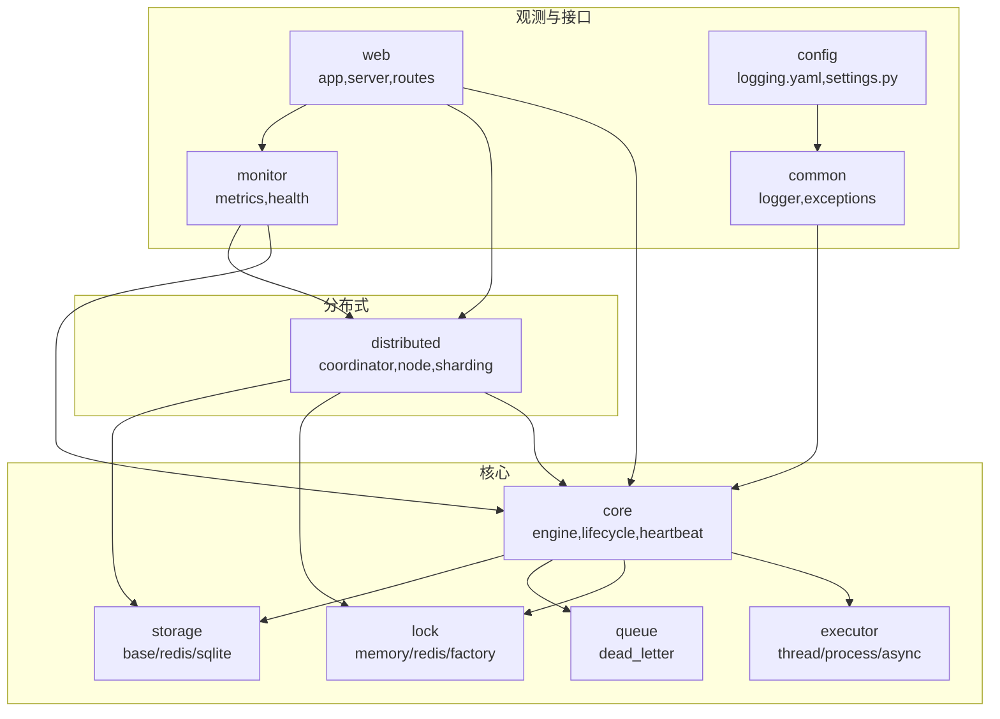

图表来源
- [src/neotask/core/engine.py](file://src/neotask/core/engine.py)
- [src/neotask/core/lifecycle.py](file://src/neotask/core/lifecycle.py)
- [src/neotask/core/heartbeat.py](file://src/neotask/core/heartbeat.py)
- [src/neotask/executor/thread_executor.py](file://src/neotask/executor/thread_executor.py)
- [src/neotask/executor/process_executor.py](file://src/neotask/executor/process_executor.py)
- [src/neotask/executor/async_executor.py](file://src/neotask/executor/async_executor.py)
- [src/neotask/lock/factory.py](file://src/neotask/lock/factory.py)
- [src/neotask/lock/memory.py](file://src/neotask/lock/memory.py)
- [src/neotask/lock/redis.py](file://src/neotask/lock/redis.py)
- [src/neotask/queue/dead_letter.py](file://src/neotask/queue/dead_letter.py)
- [src/neotask/storage/base.py](file://src/neotask/storage/base.py)
- [src/neotask/storage/redis.py](file://src/neotask/storage/redis.py)
- [src/neotask/storage/sqlite.py](file://src/neotask/storage/sqlite.py)
- [src/neotask/distributed/coordinator.py](file://src/neotask/distributed/coordinator.py)
- [src/neotask/distributed/node.py](file://src/neotask/distributed/node.py)
- [src/neotask/distributed/sharding.py](file://src/neotask/distributed/sharding.py)
- [src/neotask/monitor/metrics.py](file://src/neotask/monitor/metrics.py)
- [src/neotask/monitor/health.py](file://src/neotask/monitor/health.py)
- [src/neotask/web/app.py](file://src/neotask/web/app.py)
- [src/neotask/web/server.py](file://src/neotask/web/server.py)
- [src/neotask/config/logging.yaml](file://src/neotask/config/logging.yaml)
- [src/neotask/config/settings.py](file://src/neotask/config/settings.py)
- [src/neotask/common/logger.py](file://src/neotask/common/logger.py)
- [src/neotask/common/exceptions.py](file://src/neotask/common/exceptions.py)

章节来源
- [README.md](file://README.md)
- [pyproject.toml](file://pyproject.toml)

## 核心组件
- 异常体系：集中定义业务与系统级异常类型，便于统一捕获与上报。
- 日志系统：通过配置文件与通用日志工具，提供结构化输出与分级控制。
- 心跳与健康检查：用于节点存活探测与服务可用性评估。
- 执行器：线程、进程、异步三种执行模型，覆盖不同隔离与性能需求。
- 分布式协调：节点注册、选举、分片与拓扑变更。
- 锁机制：内存与 Redis 两种实现，保障跨进程/跨节点互斥。
- 存储后端：SQLite（单机）、Redis（分布式）等持久化与状态存储。
- 监控指标：暴露关键运行指标，支撑告警与容量规划。
- Web 服务：提供管理界面与 API，辅助在线诊断。

章节来源
- [src/neotask/common/exceptions.py](file://src/neotask/common/exceptions.py)
- [src/neotask/common/logger.py](file://src/neotask/common/logger.py)
- [src/neotask/config/logging.yaml](file://src/neotask/config/logging.yaml)
- [src/neotask/core/heartbeat.py](file://src/neotask/core/heartbeat.py)
- [src/neotask/monitor/health.py](file://src/neotask/monitor/health.py)
- [src/neotask/executor/thread_executor.py](file://src/neotask/executor/thread_executor.py)
- [src/neotask/executor/process_executor.py](file://src/neotask/executor/process_executor.py)
- [src/neotask/executor/async_executor.py](file://src/neotask/executor/async_executor.py)
- [src/neotask/distributed/coordinator.py](file://src/neotask/distributed/coordinator.py)
- [src/neotask/lock/factory.py](file://src/neotask/lock/factory.py)
- [src/neotask/storage/base.py](file://src/neotask/storage/base.py)
- [src/neotask/storage/redis.py](file://src/neotask/storage/redis.py)
- [src/neotask/storage/sqlite.py](file://src/neotask/storage/sqlite.py)
- [src/neotask/monitor/metrics.py](file://src/neotask/monitor/metrics.py)
- [src/neotask/web/app.py](file://src/neotask/web/app.py)

## 架构总览
下图展示了从任务提交到执行、再到结果落盘与监控上报的关键路径，以及分布式场景下的协调与锁交互。

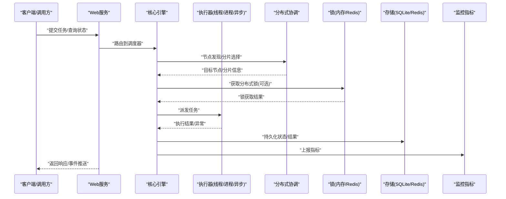

图表来源
- [src/neotask/web/app.py](file://src/neotask/web/app.py)
- [src/neotask/core/engine.py](file://src/neotask/core/engine.py)
- [src/neotask/distributed/coordinator.py](file://src/neotask/distributed/coordinator.py)
- [src/neotask/lock/factory.py](file://src/neotask/lock/factory.py)
- [src/neotask/executor/thread_executor.py](file://src/neotask/executor/thread_executor.py)
- [src/neotask/executor/process_executor.py](file://src/neotask/executor/process_executor.py)
- [src/neotask/executor/async_executor.py](file://src/neotask/executor/async_executor.py)
- [src/neotask/storage/base.py](file://src/neotask/storage/base.py)
- [src/neotask/storage/redis.py](file://src/neotask/storage/redis.py)
- [src/neotask/storage/sqlite.py](file://src/neotask/storage/sqlite.py)
- [src/neotask/monitor/metrics.py](file://src/neotask/monitor/metrics.py)

## 详细组件分析

### 异常与错误分类
- 建议将异常分为：
  - 业务异常：任务参数不合法、重试策略触发、幂等冲突等。
  - 系统异常：资源不可用、超时、序列化失败、存储连接失败等。
  - 分布式异常：节点失联、锁竞争失败、分片不一致等。
- 在关键路径上统一捕获并记录上下文（任务ID、节点ID、分片、锁键、存储后端等），以便快速定位。

章节来源
- [src/neotask/common/exceptions.py](file://src/neotask/common/exceptions.py)

### 日志系统与配置
- 日志级别：DEBUG/INFO/WARNING/ERROR/CRITICAL，生产环境默认 INFO 或 WARNING。
- 输出格式：包含时间戳、模块名、任务ID、节点ID、耗时等字段，便于聚合与分析。
- 配置项：通过 YAML 与设置模块加载，支持按模块调整级别与输出目标。

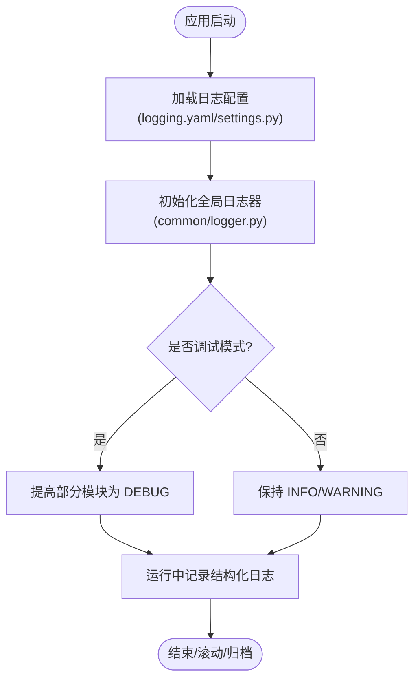

图表来源
- [src/neotask/config/logging.yaml](file://src/neotask/config/logging.yaml)
- [src/neotask/config/settings.py](file://src/neotask/config/settings.py)
- [src/neotask/common/logger.py](file://src/neotask/common/logger.py)

章节来源
- [src/neotask/config/logging.yaml](file://src/neotask/config/logging.yaml)
- [src/neotask/config/settings.py](file://src/neotask/config/settings.py)
- [src/neotask/common/logger.py](file://src/neotask/common/logger.py)

### 心跳与健康检查
- 心跳周期与阈值：心跳间隔、最大容忍延迟、超时判定。
- 健康检查：存储连通性、锁服务连通性、队列可用性、执行器池状态。
- 告警联动：当连续心跳失败或健康检查不通过时触发降级或告警。

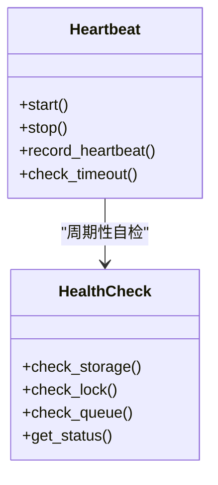

图表来源
- [src/neotask/core/heartbeat.py](file://src/neotask/core/heartbeat.py)
- [src/neotask/monitor/health.py](file://src/neotask/monitor/health.py)

章节来源
- [src/neotask/core/heartbeat.py](file://src/neotask/core/heartbeat.py)
- [src/neotask/monitor/health.py](file://src/neotask/monitor/health.py)

### 执行器与任务执行
- 线程执行器：适合 CPU 轻量、IO 密集任务；注意 GIL 影响与线程池大小。
- 进程执行器：适合 CPU 密集任务；注意进程间通信开销与资源隔离。
- 异步执行器：适合高并发 IO 任务；注意事件循环阻塞与协程异常传播。

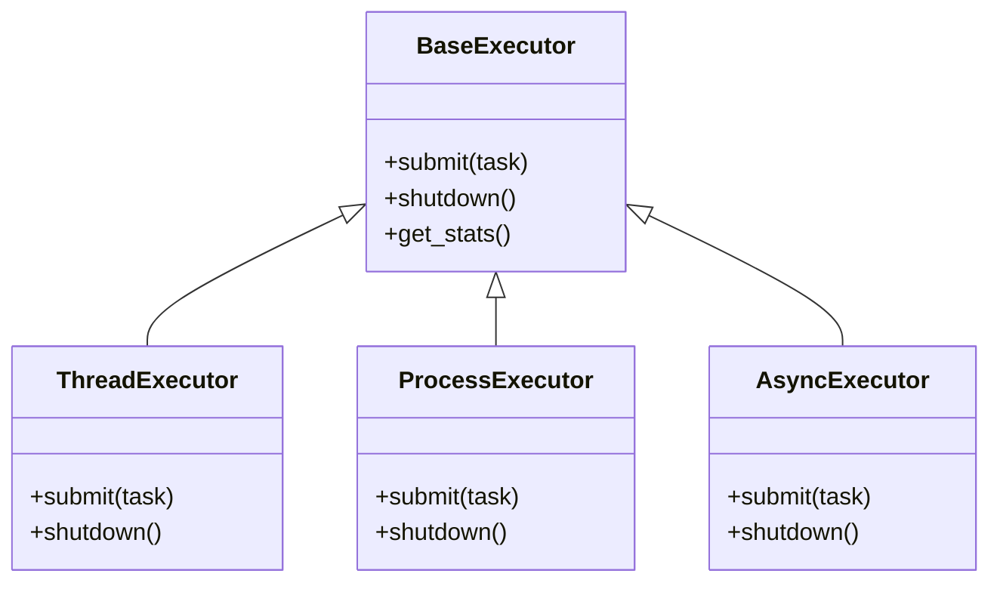

图表来源
- [src/neotask/executor/base.py](file://src/neotask/executor/base.py)
- [src/neotask/executor/thread_executor.py](file://src/neotask/executor/thread_executor.py)
- [src/neotask/executor/process_executor.py](file://src/neotask/executor/process_executor.py)
- [src/neotask/executor/async_executor.py](file://src/neotask/executor/async_executor.py)

章节来源
- [src/neotask/executor/base.py](file://src/neotask/executor/base.py)
- [src/neotask/executor/thread_executor.py](file://src/neotask/executor/thread_executor.py)
- [src/neotask/executor/process_executor.py](file://src/neotask/executor/process_executor.py)
- [src/neotask/executor/async_executor.py](file://src/neotask/executor/async_executor.py)

### 分布式协调与分片
- 节点注册与发现：节点加入/退出、拓扑变化通知。
- 分片策略：按任务键或哈希分片，保证负载均衡与一致性。
- 协调流程：主节点协调任务分配、故障转移与再平衡。

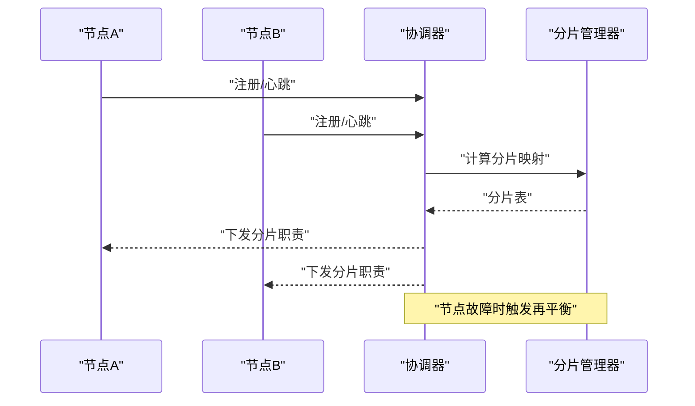

图表来源
- [src/neotask/distributed/coordinator.py](file://src/neotask/distributed/coordinator.py)
- [src/neotask/distributed/node.py](file://src/neotask/distributed/node.py)
- [src/neotask/distributed/sharding.py](file://src/neotask/distributed/sharding.py)

章节来源
- [src/neotask/distributed/coordinator.py](file://src/neotask/distributed/coordinator.py)
- [src/neotask/distributed/node.py](file://src/neotask/distributed/node.py)
- [src/neotask/distributed/sharding.py](file://src/neotask/distributed/sharding.py)

### 锁机制与竞态处理
- 内存锁：单进程内互斥，低延迟但无法跨进程。
- Redis 锁：跨进程/跨节点互斥，需考虑网络抖动与续期。
- 工厂模式：根据配置动态选择锁实现。

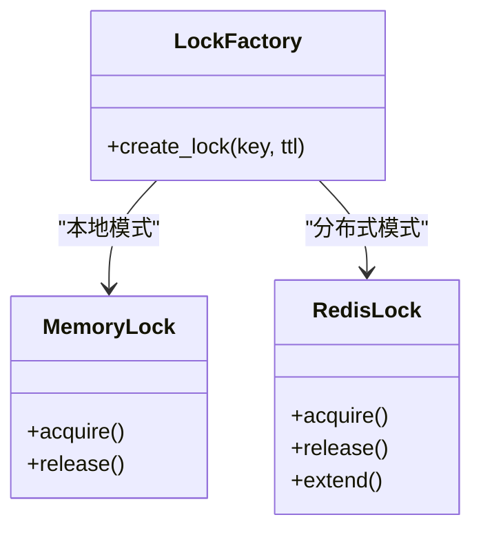

图表来源
- [src/neotask/lock/factory.py](file://src/neotask/lock/factory.py)
- [src/neotask/lock/memory.py](file://src/neotask/lock/memory.py)
- [src/neotask/lock/redis.py](file://src/neotask/lock/redis.py)

章节来源
- [src/neotask/lock/factory.py](file://src/neotask/lock/factory.py)
- [src/neotask/lock/memory.py](file://src/neotask/lock/memory.py)
- [src/neotask/lock/redis.py](file://src/neotask/lock/redis.py)

### 存储后端与数据一致性
- SQLite：单机部署简单，写入吞吐有限，适合小规模或开发测试。
- Redis：高性能与分布式能力，需注意连接池、超时与序列化。
- 基础抽象：统一接口封装读写、事务与异常转换。

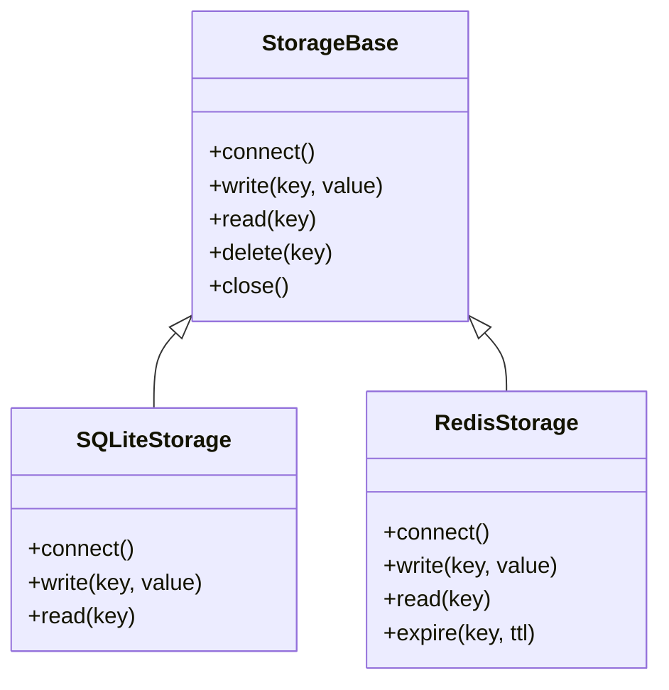

图表来源
- [src/neotask/storage/base.py](file://src/neotask/storage/base.py)
- [src/neotask/storage/sqlite.py](file://src/neotask/storage/sqlite.py)
- [src/neotask/storage/redis.py](file://src/neotask/storage/redis.py)

章节来源
- [src/neotask/storage/base.py](file://src/neotask/storage/base.py)
- [src/neotask/storage/sqlite.py](file://src/neotask/storage/sqlite.py)
- [src/neotask/storage/redis.py](file://src/neotask/storage/redis.py)

### 监控指标与 Web 管理
- 指标采集：任务数、成功率、失败率、延迟分布、锁等待时长、存储读写延迟。
- 健康端点：节点状态、存储/锁/队列连通性、执行器池利用率。
- Web 服务：提供任务查询、节点管理、指标查看与实时事件推送。

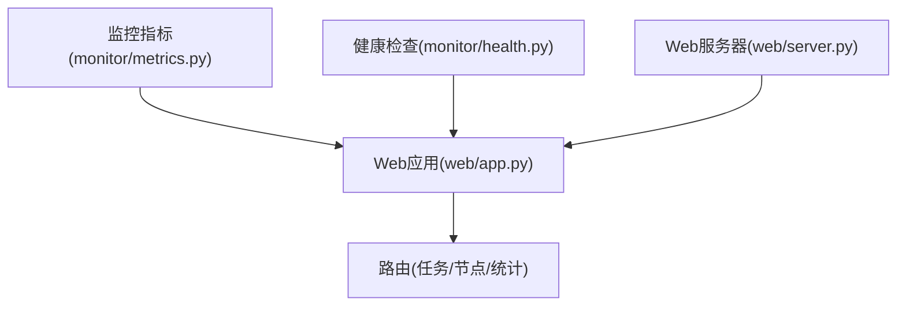

图表来源
- [src/neotask/monitor/metrics.py](file://src/neotask/monitor/metrics.py)
- [src/neotask/monitor/health.py](file://src/neotask/monitor/health.py)
- [src/neotask/web/app.py](file://src/neotask/web/app.py)
- [src/neotask/web/server.py](file://src/neotask/web/server.py)

章节来源
- [src/neotask/monitor/metrics.py](file://src/neotask/monitor/metrics.py)
- [src/neotask/monitor/health.py](file://src/neotask/monitor/health.py)
- [src/neotask/web/app.py](file://src/neotask/web/app.py)
- [src/neotask/web/server.py](file://src/neotask/web/server.py)

## 依赖关系分析
- 模块耦合：
  - core 依赖 executor、lock、queue、storage、monitor。
  - distributed 依赖 core、lock、storage。
  - web 依赖 core、distributed、monitor。
- 外部依赖：
  - Redis：分布式锁与存储后端。
  - 操作系统线程/进程：执行器模型。
- 潜在环依赖：应避免 monitor 反向依赖 core 的写路径，仅读取指标与健康状态。

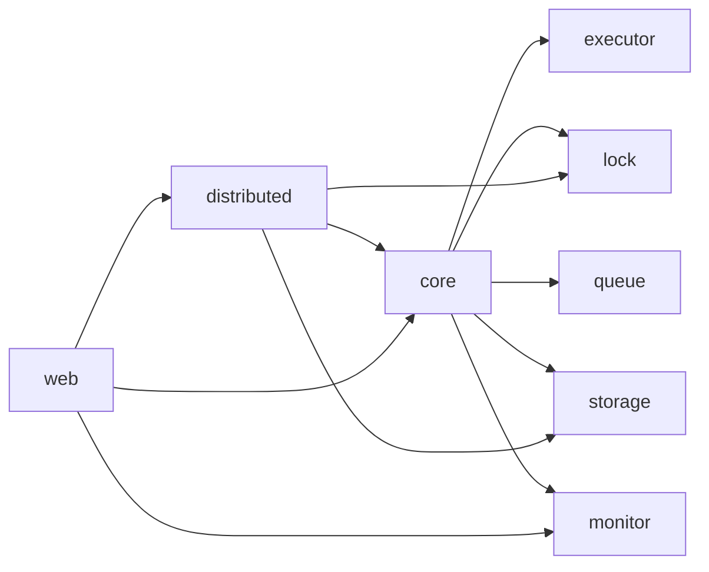

图表来源
- [src/neotask/core/engine.py](file://src/neotask/core/engine.py)
- [src/neotask/distributed/coordinator.py](file://src/neotask/distributed/coordinator.py)
- [src/neotask/web/app.py](file://src/neotask/web/app.py)

章节来源
- [src/neotask/core/engine.py](file://src/neotask/core/engine.py)
- [src/neotask/distributed/coordinator.py](file://src/neotask/distributed/coordinator.py)
- [src/neotask/web/app.py](file://src/neotask/web/app.py)

## 性能注意事项
- 执行器选型：CPU 密集型优先进程执行器；IO 密集型优先线程或异步执行器。
- 锁粒度与 TTL：合理设置锁键与过期时间，避免长持有导致拥塞。
- 存储后端：Redis 在高吞吐下关注连接池与序列化成本；SQLite 关注 WAL 与并发写入限制。
- 指标采样：避免高频采样造成额外开销，采用滑动窗口与降采样。
- 背压与限流：在队列与执行器层引入限流，防止雪崩。

[本节为通用指导，无需特定文件引用]

## 故障排查指南

### 常见问题与解决步骤
- 任务未执行或卡住
  - 检查执行器池状态与空闲线程/进程数量。
  - 查看锁获取日志，确认是否存在长时间持锁或死锁。
  - 验证存储写入是否成功，必要时回退到只读模式观察。
- 任务频繁失败
  - 检查任务参数与幂等性逻辑，确认重试策略与退避算法。
  - 查看死信队列，定位失败原因与堆栈。
- 节点频繁上下线
  - 核对心跳间隔与超时阈值，检查网络抖动与 GC 停顿。
  - 观察健康检查端点，确认存储/锁/队列连通性。
- 分布式分片不均
  - 检查分片键分布与哈希函数，确认热点任务导致的倾斜。
  - 在协调器日志中查看再平衡事件与分片迁移耗时。

章节来源
- [src/neotask/executor/thread_executor.py](file://src/neotask/executor/thread_executor.py)
- [src/neotask/executor/process_executor.py](file://src/neotask/executor/process_executor.py)
- [src/neotask/executor/async_executor.py](file://src/neotask/executor/async_executor.py)
- [src/neotask/lock/redis.py](file://src/neotask/lock/redis.py)
- [src/neotask/queue/dead_letter.py](file://src/neotask/queue/dead_letter.py)
- [src/neotask/core/heartbeat.py](file://src/neotask/core/heartbeat.py)
- [src/neotask/distributed/sharding.py](file://src/neotask/distributed/sharding.py)

### 日志分析方法
- 关键字检索：任务ID、节点ID、分片键、锁键、存储后端名称。
- 级别过滤：先聚焦 ERROR/CRITICAL，再逐步放大到 WARNING/DEBUG。
- 时序关联：以时间轴串联 Web 请求、调度派发、锁获取、执行结果与存储落盘。
- 聚合分析：按模块与任务类型汇总失败率与延迟分布，识别热点与瓶颈。

章节来源
- [src/neotask/config/logging.yaml](file://src/neotask/config/logging.yaml)
- [src/neotask/common/logger.py](file://src/neotask/common/logger.py)

### 异常处理策略
- 统一捕获：在调度与执行器边界捕获异常，转换为标准业务异常。
- 上下文注入：记录任务元数据、节点信息、锁键、存储键值等。
- 重试与退避：对可恢复错误实施指数退避与上限控制。
- 死信与告警：不可恢复错误进入死信队列，并触发告警与人工介入。

章节来源
- [src/neotask/common/exceptions.py](file://src/neotask/common/exceptions.py)
- [src/neotask/queue/dead_letter.py](file://src/neotask/queue/dead_letter.py)

### 调试技巧
- 局部开启 DEBUG：针对特定模块临时提升日志级别，缩小范围。
- 断点与堆栈：在执行器与锁获取处增加断点，观察调用链与上下文。
- 最小复现：构造最小任务集与最简配置，排除外部干扰。
- 指标对比：对比正常与异常场景的指标差异，定位异常点。

章节来源
- [src/neotask/config/logging.yaml](file://src/neotask/config/logging.yaml)
- [src/neotask/monitor/metrics.py](file://src/neotask/monitor/metrics.py)

### 分布式环境问题定位
- 节点健康：通过健康检查端点与心跳日志判断节点状态。
- 锁竞争：分析锁获取耗时与失败次数，确认是否存在热点键。
- 分片迁移：观察协调器日志中的再平衡事件，评估迁移耗时与影响面。
- 存储连通：分别测试 Redis/SQLite 的连接与读写延迟，排除网络与磁盘问题。

章节来源
- [src/neotask/core/heartbeat.py](file://src/neotask/core/heartbeat.py)
- [src/neotask/monitor/health.py](file://src/neotask/monitor/health.py)
- [src/neotask/distributed/coordinator.py](file://src/neotask/distributed/coordinator.py)
- [src/neotask/lock/redis.py](file://src/neotask/lock/redis.py)
- [src/neotask/storage/redis.py](file://src/neotask/storage/redis.py)
- [src/neotask/storage/sqlite.py](file://src/neotask/storage/sqlite.py)

### 性能问题排查
- 指标基线：建立任务吞吐、延迟、锁等待、存储 I/O 的基线。
- 热点识别：按任务类型与分片键聚合，识别热点与倾斜。
- 资源利用：观察 CPU、内存、磁盘 I/O、网络带宽的使用情况。
- 容量规划：根据峰值与增长趋势，评估执行器池大小与存储扩容。

章节来源
- [src/neotask/monitor/metrics.py](file://src/neotask/monitor/metrics.py)

### 混沌测试与故障模拟
- 目标：验证系统在节点故障、锁服务中断、存储不可用、网络分区等场景下的健壮性与恢复能力。
- 方法：
  - 随机杀死节点进程，观察再平衡与任务迁移。
  - 断开 Redis 连接，验证锁与存储的降级与恢复。
  - 注入高延迟与丢包，评估心跳与健康检查的容错。
- 自动化：使用提供的脚本与测试用例批量执行，收集指标与日志。

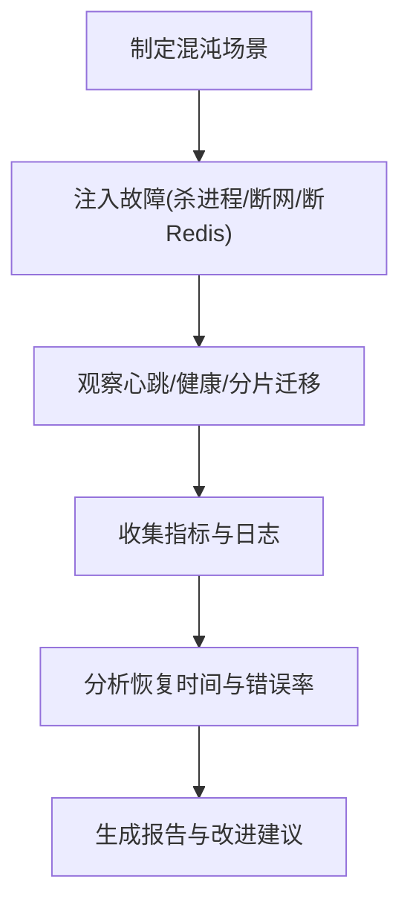

图表来源
- [scripts/run_chaos_tests.sh](file://scripts/run_chaos_tests.sh)
- [tests/chaos/test_exception_scenarios.py](file://tests/chaos/test_exception_scenarios.py)

章节来源
- [scripts/run_chaos_tests.sh](file://scripts/run_chaos_tests.sh)
- [tests/chaos/test_exception_scenarios.py](file://tests/chaos/test_exception_scenarios.py)

### 问题上报与社区支持
- 问题模板：提供环境信息、版本、复现步骤、日志片段、指标截图。
- 渠道：仓库 Issues、讨论区、邮件列表或即时通讯群组。
- 贡献：提交最小复现与修复补丁，遵循贡献指南与代码规范。

章节来源
- [README.md](file://README.md)
- [examples/readme.txt](file://examples/readme.txt)

## 结论
通过统一的异常体系、结构化日志、心跳与健康检查、分布式协调与锁机制、多存储后端与监控指标，本系统提供了完善的故障排查基础。结合混沌测试与系统化排障流程，可在复杂分布式环境中快速定位与解决问题，持续提升稳定性与可观测性。

## 附录
- 常用命令与入口：参考 CLI 与 Web 启动说明。
- 示例程序：通过 examples 快速验证功能与复现场景。
- 配置清单：logging.yaml 与 settings.py 中的关键选项对照表。

章节来源
- [src/neotask/cli/main.py](file://src/neotask/cli/main.py)
- [src/neotask/web/server.py](file://src/neotask/web/server.py)
- [examples/readme.txt](file://examples/readme.txt)
- [src/neotask/config/logging.yaml](file://src/neotask/config/logging.yaml)
- [src/neotask/config/settings.py](file://src/neotask/config/settings.py)