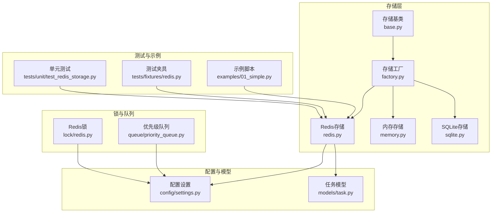
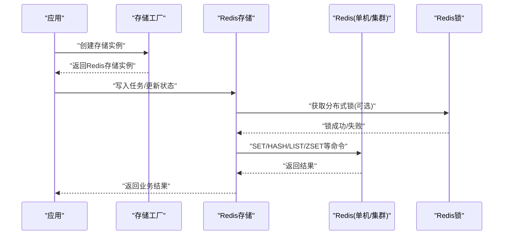
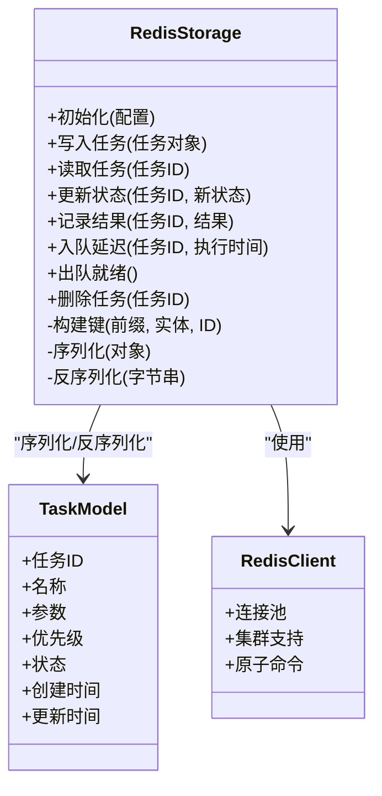
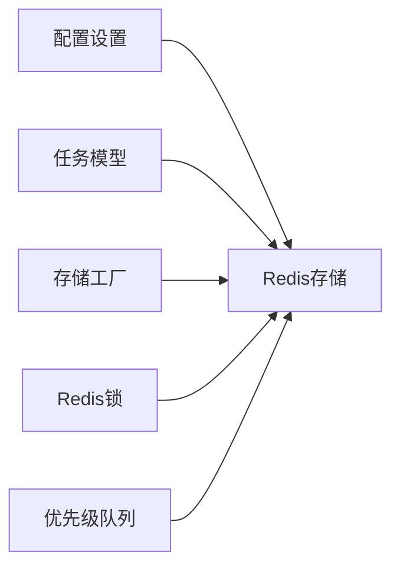

# Redis分布式存储

<cite>
**本文引用的文件**   
- [src/neotask/storage/redis.py](file://src/neotask/storage/redis.py)
- [src/neotask/storage/base.py](file://src/neotask/storage/base.py)
- [src/neotask/storage/factory.py](file://src/neotask/storage/factory.py)
- [src/neotask/config/settings.py](file://src/neotask/config/settings.py)
- [src/neotask/models/task.py](file://src/neotask/models/task.py)
- [src/neotask/queue/priority_queue.py](file://src/neotask/queue/priority_queue.py)
- [src/neotask/lock/redis.py](file://src/neotask/lock/redis.py)
- [tests/unit/test_redis_storage.py](file://tests/unit/test_redis_storage.py)
- [tests/fixtures/redis.py](file://tests/fixtures/redis.py)
- [examples/01_simple.py](file://examples/01_simple.py)
</cite>

## 目录
1. [简介](#简介)
2. [项目结构](#项目结构)
3. [核心组件](#核心组件)
4. [架构总览](#架构总览)
5. [详细组件分析](#详细组件分析)
6. [依赖关系分析](#依赖关系分析)
7. [性能考虑](#性能考虑)
8. [故障排查指南](#故障排查指南)
9. [结论](#结论)
10. [附录](#附录)

## 简介
本文件围绕任务调度管理器中的Redis分布式存储实现，系统性阐述RedisStorage的数据结构设计、键值映射策略与序列化机制；解释连接池配置、集群模式支持与故障转移处理；提供Redis集群部署指南与性能优化建议；涵盖高可用配置、数据持久化与备份策略；展示分布式环境下的使用示例与监控指标；并说明与本地存储的同步及数据一致性保证机制。

## 项目结构
与Redis分布式存储相关的核心代码位于storage与lock模块，同时涉及配置、模型、队列以及测试与示例：
- storage层：抽象接口、工厂、内存/SQLite/Redis三种后端实现
- lock层：基于Redis的分布式锁实现
- config层：全局设置（含Redis相关参数）
- models层：任务模型定义（用于序列化/反序列化）
- queue层：优先级队列等可能复用Redis能力
- tests/examples：单元测试、夹具与使用示例

图表来源
- [src/neotask/storage/base.py](file://src/neotask/storage/base.py)
- [src/neotask/storage/factory.py](file://src/neotask/storage/factory.py)
- [src/neotask/storage/redis.py](file://src/neotask/storage/redis.py)
- [src/neotask/lock/redis.py](file://src/neotask/lock/redis.py)
- [src/neotask/queue/priority_queue.py](file://src/neotask/queue/priority_queue.py)
- [src/neotask/config/settings.py](file://src/neotask/config/settings.py)
- [src/neotask/models/task.py](file://src/neotask/models/task.py)
- [tests/unit/test_redis_storage.py](file://tests/unit/test_redis_storage.py)
- [tests/fixtures/redis.py](file://tests/fixtures/redis.py)
- [examples/01_simple.py](file://examples/01_simple.py)

章节来源
- [src/neotask/storage/base.py](file://src/neotask/storage/base.py)
- [src/neotask/storage/factory.py](file://src/neotask/storage/factory.py)
- [src/neotask/storage/redis.py](file://src/neotask/storage/redis.py)
- [src/neotask/config/settings.py](file://src/neotask/config/settings.py)
- [src/neotask/models/task.py](file://src/neotask/models/task.py)
- [src/neotask/lock/redis.py](file://src/neotask/lock/redis.py)
- [src/neotask/queue/priority_queue.py](file://src/neotask/queue/priority_queue.py)
- [tests/unit/test_redis_storage.py](file://tests/unit/test_redis_storage.py)
- [tests/fixtures/redis.py](file://tests/fixtures/redis.py)
- [examples/01_simple.py](file://examples/01_simple.py)

## 核心组件
- RedisStorage：面向任务的分布式存储实现，负责任务元数据、状态、结果、重试计数、延迟执行时间等数据的存取；支持单机与集群模式；内部维护连接池与必要的键空间管理。
- 存储基类与工厂：统一接口定义与实例创建，屏蔽底层差异，便于在内存、SQLite与Redis之间切换。
- 配置中心：集中管理Redis连接参数（地址、端口、密码、数据库索引、连接池大小、超时、SSL、集群节点列表等）。
- 任务模型：定义任务数据结构，作为序列化的载体。
- Redis锁：利用Redis原子操作实现分布式互斥，保障并发安全。
- 优先级队列：可基于Redis数据结构实现，配合RedisStorage完成任务入队与出队。

章节来源
- [src/neotask/storage/redis.py](file://src/neotask/storage/redis.py)
- [src/neotask/storage/base.py](file://src/neotask/storage/base.py)
- [src/neotask/storage/factory.py](file://src/neotask/storage/factory.py)
- [src/neotask/config/settings.py](file://src/neotask/config/settings.py)
- [src/neotask/models/task.py](file://src/neotask/models/task.py)
- [src/neotask/lock/redis.py](file://src/neotask/lock/redis.py)
- [src/neotask/queue/priority_queue.py](file://src/neotask/queue/priority_queue.py)

## 架构总览
下图展示了应用通过存储工厂获取Redis存储实例，并在读写任务时与Redis交互的整体流程。

图表来源
- [src/neotask/storage/factory.py](file://src/neotask/storage/factory.py)
- [src/neotask/storage/redis.py](file://src/neotask/storage/redis.py)
- [src/neotask/lock/redis.py](file://src/neotask/lock/redis.py)

## 详细组件分析

### RedisStorage 类设计
- 职责边界
  - 任务生命周期数据存取：创建、查询、更新、删除、批量操作
  - 状态机推进：待执行、运行中、已完成、失败、取消等
  - 重试与延迟：记录重试次数、下次执行时间
  - 结果与日志：保存执行结果与关键日志
  - 事务与幂等：结合分布式锁与原子命令保证一致性
- 数据结构设计（概念性）
  - 任务元数据：以哈希或JSON形式存储，包含任务ID、名称、参数、优先级、状态、创建/更新时间等
  - 任务结果：独立键空间，按任务ID隔离
  - 延迟队列：有序集合，以“下次执行时间”为分数
  - 活跃任务集：集合或哈希，记录正在执行的任务ID
  - 统计信息：计数器或哈希，记录成功/失败/重试次数
- 键空间命名规范（概念性）
  - 前缀+实体类型+标识符，如“task:{id}”、“result:{id}”、“delayed:{ts}:{id}”、“active:{id}”
  - 分片/集群场景下，确保键分布均匀，避免热点
- 序列化机制（概念性）
  - 使用任务模型对象进行序列化/反序列化
  - 默认采用二进制安全格式（如JSON），必要时启用压缩
  - 版本兼容：在字段变更时保留向后兼容逻辑

图表来源
- [src/neotask/storage/redis.py](file://src/neotask/storage/redis.py)
- [src/neotask/models/task.py](file://src/neotask/models/task.py)

章节来源
- [src/neotask/storage/redis.py](file://src/neotask/storage/redis.py)
- [src/neotask/models/task.py](file://src/neotask/models/task.py)

### 键值映射策略
- 键空间分区
  - 按功能域划分：任务、结果、延迟、活跃、统计等
  - 按租户/环境划分：通过前缀区分不同环境或租户
- 键生成规则
  - 固定前缀 + 实体类型 + 唯一标识
  - 时间相关键包含时间戳，便于过期与扫描
- 集群友好性
  - 避免长尾热点键，尽量分散
  - 使用哈希槽友好的键名，减少跨槽操作

章节来源
- [src/neotask/storage/redis.py](file://src/neotask/storage/redis.py)

### 序列化机制
- 选择原则
  - 可读性与兼容性优先（JSON）
  - 体积敏感场景可引入压缩
- 版本控制
  - 在模型中增加版本号字段
  - 反序列化时根据版本做兼容转换
- 错误处理
  - 对损坏数据进行降级处理（跳过或告警）

章节来源
- [src/neotask/models/task.py](file://src/neotask/models/task.py)
- [src/neotask/storage/redis.py](file://src/neotask/storage/redis.py)

### 连接池配置
- 关键参数
  - 最大连接数、最小空闲连接、连接超时、读写超时
  - 重试与退避策略
  - SSL/TLS与安全认证
- 集群模式
  - 多节点列表、路由策略、主从切换
  - 连接池按节点或全局共享
- 健康检查
  - 定期PING检测
  - 异常自动重连与熔断

章节来源
- [src/neotask/config/settings.py](file://src/neotask/config/settings.py)
- [src/neotask/storage/redis.py](file://src/neotask/storage/redis.py)

### 集群模式支持与故障转移
- 集群发现与拓扑更新
  - 启动时加载节点列表
  - 监听集群事件，动态更新连接
- 故障转移
  - 主节点不可用时切换到副本
  - 写路径失败时的重试与回退策略
- 一致性
  - 强一致场景需结合分布式锁与事务
  - 最终一致场景允许短暂不一致，但需补偿

章节来源
- [src/neotask/storage/redis.py](file://src/neotask/storage/redis.py)
- [src/neotask/lock/redis.py](file://src/neotask/lock/redis.py)

### 与本地存储的同步与一致性
- 同步策略
  - 双写：先写Redis，再写本地；或先本地后Redis
  - 异步同步：消息驱动，保证至少一次投递
- 一致性保证
  - 分布式锁保护临界区
  - 幂等键与去重表
  - 冲突解决：时间戳或版本号比较
- 回滚与补偿
  - 失败重试与死信队列
  - 定时对账与修复

章节来源
- [src/neotask/storage/redis.py](file://src/neotask/storage/redis.py)
- [src/neotask/lock/redis.py](file://src/neotask/lock/redis.py)

### 分布式环境下的使用示例
- 基本用法
  - 通过工厂创建Redis存储实例
  - 写入任务、查询状态、更新结果
- 上下文管理
  - 使用上下文管理器自动释放资源
- 示例参考
  - 简单示例脚本演示创建与查询
  - 单元测试覆盖常见路径与异常分支

章节来源
- [examples/01_simple.py](file://examples/01_simple.py)
- [tests/unit/test_redis_storage.py](file://tests/unit/test_redis_storage.py)

### 监控指标
- 连接与性能
  - 连接池使用率、等待队列长度
  - 请求延迟分布、吞吐
- 业务指标
  - 任务成功率、失败率、重试次数
  - 延迟队列积压、活跃任务数
- 系统指标
  - Redis内存使用、命中率、慢查询
  - 网络I/O与CPU占用

章节来源
- [src/neotask/storage/redis.py](file://src/neotask/storage/redis.py)
- [src/neotask/monitor/metrics.py](file://src/neotask/monitor/metrics.py)

## 依赖关系分析
- 内聚与耦合
  - RedisStorage依赖配置与模型，低耦合于具体客户端实现
  - 通过工厂解耦创建过程，便于替换后端
- 外部依赖
  - Redis客户端库（支持单机与集群）
  - 序列化库（JSON或更高效的替代）
- 潜在循环依赖
  - 避免存储层反向依赖上层业务逻辑
  - 将锁与队列能力抽象为服务，降低直接耦合

图表来源
- [src/neotask/config/settings.py](file://src/neotask/config/settings.py)
- [src/neotask/models/task.py](file://src/neotask/models/task.py)
- [src/neotask/storage/factory.py](file://src/neotask/storage/factory.py)
- [src/neotask/storage/redis.py](file://src/neotask/storage/redis.py)
- [src/neotask/lock/redis.py](file://src/neotask/lock/redis.py)
- [src/neotask/queue/priority_queue.py](file://src/neotask/queue/priority_queue.py)

章节来源
- [src/neotask/storage/factory.py](file://src/neotask/storage/factory.py)
- [src/neotask/storage/redis.py](file://src/neotask/storage/redis.py)
- [src/neotask/config/settings.py](file://src/neotask/config/settings.py)
- [src/neotask/models/task.py](file://src/neotask/models/task.py)
- [src/neotask/lock/redis.py](file://src/neotask/lock/redis.py)
- [src/neotask/queue/priority_queue.py](file://src/neotask/queue/priority_queue.py)

## 性能考虑
- 键设计
  - 避免热点键，合理分片
  - 使用批量命令减少RTT
- 序列化
  - 大对象压缩，避免频繁GC
  - 字段裁剪，按需读取
- 连接池
  - 调整最大连接数与超时，匹配负载
  - 开启连接复用与健康检查
- 集群
  - 关注跨槽操作成本，尽量单槽访问
  - 使用管道与Lua脚本减少往返
- 监控与调优
  - 采集延迟与吞吐，识别瓶颈
  - 定期评估内存与淘汰策略

[本节为通用指导，不直接分析具体文件]

## 故障排查指南
- 常见问题
  - 连接失败：检查网络、认证、SSL配置
  - 超时：调整超时参数，检查慢查询
  - 数据不一致：核对分布式锁与幂等键
- 定位方法
  - 查看连接池状态与错误日志
  - 抓取Redis慢日志与监控指标
  - 复现用例与单元测试回归
- 恢复策略
  - 重启连接池与重连
  - 清理僵尸任务与死信队列
  - 触发对账与补偿任务

章节来源
- [tests/unit/test_redis_storage.py](file://tests/unit/test_redis_storage.py)
- [tests/fixtures/redis.py](file://tests/fixtures/redis.py)
- [src/neotask/storage/redis.py](file://src/neotask/storage/redis.py)

## 结论
RedisStorage通过清晰的键空间设计与序列化机制，结合连接池与集群支持，提供了高性能、可扩展的分布式存储能力。配合分布式锁与一致性策略，可在复杂分布式环境中保障任务调度的正确性与稳定性。通过合理的部署与监控，可实现高可用与持续优化的目标。

[本节为总结，不直接分析具体文件]

## 附录

### Redis集群部署指南
- 节点规划
  - 至少三主三从，跨机房部署
  - 明确哨兵或集群模式
- 网络与安全
  - 开放必要端口，限制访问IP
  - 启用TLS与密码认证
- 持久化
  - RDB快照与AOF混合持久化
  - 合理设置fsync策略
- 扩容与迁移
  - 在线扩容，数据自动重平衡
  - 灰度发布与回滚预案

[本节为通用指导，不直接分析具体文件]

### 高可用配置
- 主从复制与故障转移
  - 自动选举与切换
  - 客户端侧容错与重试
- 多活与就近接入
  - 按地域路由
  - 读写分离与一致性权衡

[本节为通用指导，不直接分析具体文件]

### 数据持久化与备份策略
- 快照频率与保留周期
- AOF重写与压缩
- 异地备份与恢复演练
- 增量备份与时间点恢复

[本节为通用指导，不直接分析具体文件]

### 分布式使用示例与监控指标
- 示例路径
  - 简单示例：创建、写入、查询
  - 上下文管理：自动资源释放
- 监控面板
  - 连接池、延迟、吞吐
  - 任务成功率、失败率、重试
  - Redis内存、命中率、慢查询

章节来源
- [examples/01_simple.py](file://examples/01_simple.py)
- [tests/unit/test_redis_storage.py](file://tests/unit/test_redis_storage.py)
- [src/neotask/monitor/metrics.py](file://src/neotask/monitor/metrics.py)