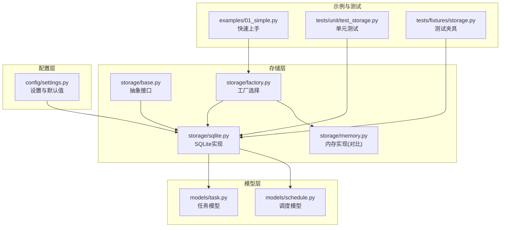
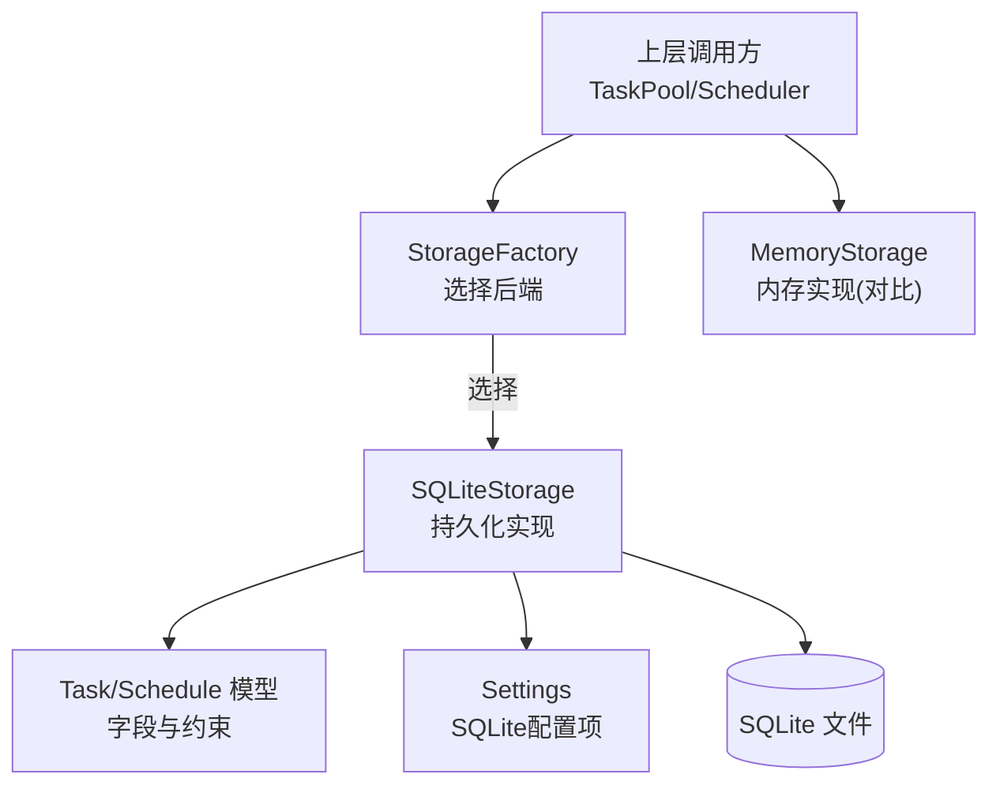
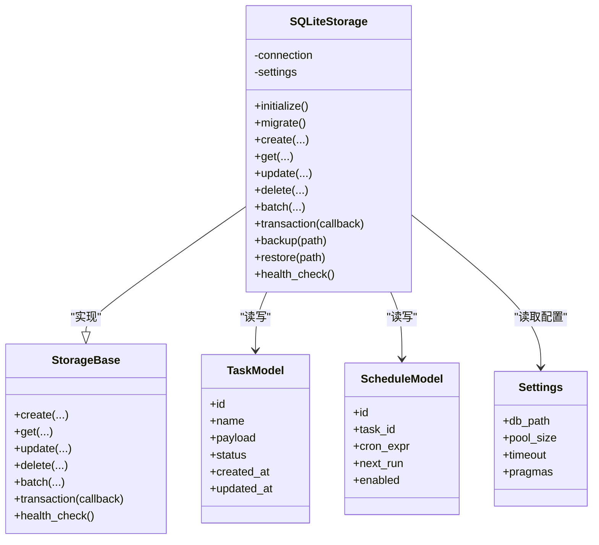
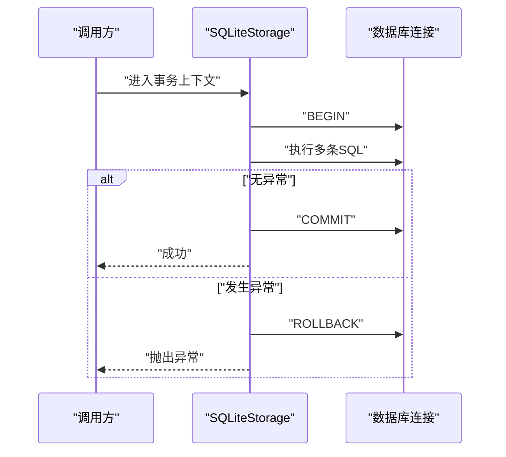
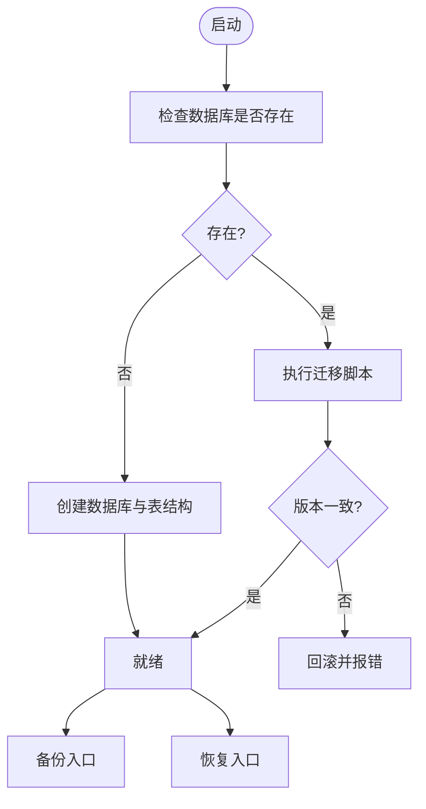
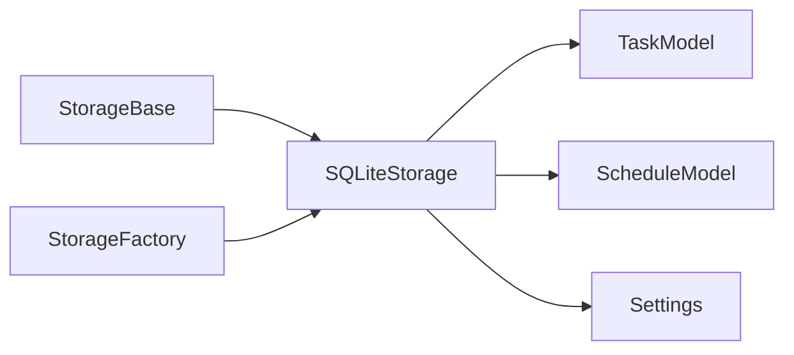

# SQLite持久化存储

<cite>
**本文引用的文件**   
- [src/neotask/storage/sqlite.py](file://src/neotask/storage/sqlite.py)
- [src/neotask/storage/base.py](file://src/neotask/storage/base.py)
- [src/neotask/storage/factory.py](file://src/neotask/storage/factory.py)
- [src/neotask/models/task.py](file://src/neotask/models/task.py)
- [src/neotask/models/schedule.py](file://src/neotask/models/schedule.py)
- [src/neotask/config/settings.py](file://src/neotask/config/settings.py)
- [examples/01_simple.py](file://examples/01_simple.py)
- [tests/unit/test_storage.py](file://tests/unit/test_storage.py)
- [tests/fixtures/storage.py](file://tests/fixtures/storage.py)
</cite>

## 目录
1. [简介](#简介)
2. [项目结构](#项目结构)
3. [核心组件](#核心组件)
4. [架构总览](#架构总览)
5. [详细组件分析](#详细组件分析)
6. [依赖关系分析](#依赖关系分析)
7. [性能考虑](#性能考虑)
8. [故障排查指南](#故障排查指南)
9. [结论](#结论)
10. [附录](#附录)

## 简介
本章节聚焦于SQLite持久化存储的实现与配置，围绕以下目标展开：
- 数据库表结构设计、索引优化与查询性能
- 连接池管理、事务处理与并发访问控制
- 数据库初始化、迁移与备份恢复操作指南
- 配置参数详解与性能调优建议
- 单机部署与生产环境使用示例
- 从内存存储迁移到SQLite的注意事项

## 项目结构
SQLite持久化相关代码位于 storage 子模块中，并通过 models 层定义数据模型，通过 config 提供配置项。示例与测试覆盖典型用法与边界场景。

图表来源
- [src/neotask/storage/base.py](file://src/neotask/storage/base.py)
- [src/neotask/storage/sqlite.py](file://src/neotask/storage/sqlite.py)
- [src/neotask/storage/factory.py](file://src/neotask/storage/factory.py)
- [src/neotask/storage/memory.py](file://src/neotask/storage/memory.py)
- [src/neotask/models/task.py](file://src/neotask/models/task.py)
- [src/neotask/models/schedule.py](file://src/neotask/models/schedule.py)
- [src/neotask/config/settings.py](file://src/neotask/config/settings.py)
- [examples/01_simple.py](file://examples/01_simple.py)
- [tests/unit/test_storage.py](file://tests/unit/test_storage.py)
- [tests/fixtures/storage.py](file://tests/fixtures/storage.py)

章节来源
- [src/neotask/storage/sqlite.py](file://src/neotask/storage/sqlite.py)
- [src/neotask/storage/base.py](file://src/neotask/storage/base.py)
- [src/neotask/storage/factory.py](file://src/neotask/storage/factory.py)
- [src/neotask/models/task.py](file://src/neotask/models/task.py)
- [src/neotask/models/schedule.py](file://src/neotask/models/schedule.py)
- [src/neotask/config/settings.py](file://src/neotask/config/settings.py)
- [examples/01_simple.py](file://examples/01_simple.py)
- [tests/unit/test_storage.py](file://tests/unit/test_storage.py)
- [tests/fixtures/storage.py](file://tests/fixtures/storage.py)

## 核心组件
- SQLiteStorage：基于SQLite的持久化实现，负责建表、索引、CRUD、事务与并发控制。
- StorageBase：存储抽象基类，定义统一接口契约（如创建、读取、更新、删除、批量操作、事务等）。
- StorageFactory：根据配置或运行时条件选择具体存储后端（SQLite/Redis/内存等）。
- Task/Schedule 模型：为SQLite表结构提供领域语义与字段约束。
- Settings：集中管理SQLite相关的配置项（路径、连接参数、PRAGMA等）。

章节来源
- [src/neotask/storage/sqlite.py](file://src/neotask/storage/sqlite.py)
- [src/neotask/storage/base.py](file://src/neotask/storage/base.py)
- [src/neotask/storage/factory.py](file://src/neotask/storage/factory.py)
- [src/neotask/models/task.py](file://src/neotask/models/task.py)
- [src/neotask/models/schedule.py](file://src/neotask/models/schedule.py)
- [src/neotask/config/settings.py](file://src/neotask/config/settings.py)

## 架构总览
下图展示了SQLite在整体系统中的位置与交互关系，包括工厂选择、模型映射、配置注入以及上层调用方。

图表来源
- [src/neotask/storage/factory.py](file://src/neotask/storage/factory.py)
- [src/neotask/storage/sqlite.py](file://src/neotask/storage/sqlite.py)
- [src/neotask/models/task.py](file://src/neotask/models/task.py)
- [src/neotask/models/schedule.py](file://src/neotask/models/schedule.py)
- [src/neotask/config/settings.py](file://src/neotask/config/settings.py)
- [src/neotask/storage/memory.py](file://src/neotask/storage/memory.py)

## 详细组件分析

### SQLiteStorage 类设计
- 职责
  - 数据库连接与生命周期管理（打开、关闭、健康检查）
  - 表结构与索引的初始化与版本迁移
  - 任务与调度记录的增删改查、分页与过滤
  - 事务封装与并发安全控制
  - 备份与恢复能力
- 关键方法（概念性说明）
  - 初始化：根据配置创建/打开数据库，执行DDL与索引构建
  - CRUD：按主键或复合条件检索、插入、更新、删除
  - 事务：支持显式事务上下文，保证一致性
  - 并发：利用SQLite的WAL模式与行级锁策略，避免写冲突
  - 备份：导出当前数据库快照；恢复：导入备份文件
- 错误处理
  - 对常见SQLite异常进行捕获与转换，返回统一的业务异常类型
  - 在事务失败时回滚并记录诊断信息

图表来源
- [src/neotask/storage/base.py](file://src/neotask/storage/base.py)
- [src/neotask/storage/sqlite.py](file://src/neotask/storage/sqlite.py)
- [src/neotask/models/task.py](file://src/neotask/models/task.py)
- [src/neotask/models/schedule.py](file://src/neotask/models/schedule.py)
- [src/neotask/config/settings.py](file://src/neotask/config/settings.py)

章节来源
- [src/neotask/storage/sqlite.py](file://src/neotask/storage/sqlite.py)
- [src/neotask/storage/base.py](file://src/neotask/storage/base.py)
- [src/neotask/models/task.py](file://src/neotask/models/task.py)
- [src/neotask/models/schedule.py](file://src/neotask/models/schedule.py)
- [src/neotask/config/settings.py](file://src/neotask/config/settings.py)

### 数据库表结构与索引优化
- 表设计要点
  - 任务表：包含唯一标识、名称、负载数据、状态、时间戳等字段，确保幂等与审计
  - 调度表：绑定任务ID、Cron表达式、下次运行时间、启用标志等
- 索引策略
  - 主键索引：加速按ID查找
  - 复合索引：针对高频查询条件（如状态+更新时间、任务名+状态）建立复合索引
  - 覆盖索引：对只读统计查询尽量覆盖所需列，减少回表
- 查询优化
  - 优先使用精确匹配与范围扫描，避免全表扫描
  - 分页查询采用“游标”方式（基于主键或更新时间）提升稳定性
  - 批量写入合并事务，降低提交开销

章节来源
- [src/neotask/models/task.py](file://src/neotask/models/task.py)
- [src/neotask/models/schedule.py](file://src/neotask/models/schedule.py)
- [src/neotask/storage/sqlite.py](file://src/neotask/storage/sqlite.py)

### 连接池管理与并发访问控制
- 连接池
  - 通过配置项控制最大连接数、超时时间与重试策略
  - 单进程内复用连接，避免频繁打开/关闭带来的开销
- WAL 模式
  - 开启WAL以提升并发读性能，减少写阻塞
- 并发控制
  - 利用SQLite的行级锁与事务隔离级别，避免脏读与丢失更新
  - 写操作串行化，读操作可并行，结合索引减少锁竞争

章节来源
- [src/neotask/config/settings.py](file://src/neotask/config/settings.py)
- [src/neotask/storage/sqlite.py](file://src/neotask/storage/sqlite.py)

### 事务处理流程
- 事务边界
  - 明确开始与结束点，确保原子性与一致性
- 异常处理
  - 捕获异常后自动回滚，并向上抛出标准化错误
- 嵌套事务
  - 若框架支持，需正确保存点与释放资源

图表来源
- [src/neotask/storage/sqlite.py](file://src/neotask/storage/sqlite.py)
- [src/neotask/storage/base.py](file://src/neotask/storage/base.py)

章节来源
- [src/neotask/storage/sqlite.py](file://src/neotask/storage/sqlite.py)
- [src/neotask/storage/base.py](file://src/neotask/storage/base.py)

### 数据库初始化、迁移与备份恢复
- 初始化
  - 首次启动时检测数据库是否存在，不存在则创建并执行DDL
  - 校验必要索引是否已存在，缺失则补建
- 迁移
  - 维护版本号与变更脚本，按序应用增量迁移
  - 迁移失败应回滚并保留旧结构，便于修复后重试
- 备份与恢复
  - 备份：在线拷贝或导出快照，建议在低峰期进行
  - 恢复：停止写入后替换数据库文件，再重启服务

图表来源
- [src/neotask/storage/sqlite.py](file://src/neotask/storage/sqlite.py)

章节来源
- [src/neotask/storage/sqlite.py](file://src/neotask/storage/sqlite.py)

### 配置参数详解
- 常用参数
  - db_path：SQLite文件路径（建议使用绝对路径）
  - pool_size：最大连接数（受限于SQLite并发特性，不宜过大）
  - timeout：连接超时时间
  - pragmas：PRAGMA集合（如journal_mode=WAL、synchronous=NORMAL等）
- 参数影响
  - WAL模式提升并发读性能，但会增加磁盘IO
  - synchronous=NORMAL在可靠性与性能间折衷
  - 合理设置busy_timeout以避免忙等待

章节来源
- [src/neotask/config/settings.py](file://src/neotask/config/settings.py)
- [src/neotask/storage/sqlite.py](file://src/neotask/storage/sqlite.py)

### 单机部署与生产环境使用示例
- 单机开发
  - 使用本地文件路径作为db_path，开启WAL，适度增大连接池
  - 参考示例脚本快速验证功能
- 生产环境
  - 将db_path置于高可靠磁盘，定期备份
  - 限制连接池大小，避免过多并发导致锁争用
  - 监控慢查询与锁等待，必要时调整索引与查询

章节来源
- [examples/01_simple.py](file://examples/01_simple.py)
- [src/neotask/config/settings.py](file://src/neotask/config/settings.py)
- [src/neotask/storage/sqlite.py](file://src/neotask/storage/sqlite.py)

### 从内存存储迁移到SQLite的注意事项
- 差异点
  - 内存存储无持久化，重启即丢失；SQLite具备持久化能力
  - 并发模型不同：SQLite需要关注锁与事务边界
- 迁移步骤
  - 先完成SQLite初始化与迁移
  - 双写阶段：同时写入内存与SQLite，验证一致性
  - 切换读路径至SQLite，逐步下线内存存储
- 风险与回滚
  - 保持内存存储可用以便快速回滚
  - 对关键数据进行一致性校验与比对

章节来源
- [src/neotask/storage/memory.py](file://src/neotask/storage/memory.py)
- [src/neotask/storage/sqlite.py](file://src/neotask/storage/sqlite.py)
- [tests/unit/test_storage.py](file://tests/unit/test_storage.py)

## 依赖关系分析
- 内部依赖
  - SQLiteStorage依赖StorageBase定义的接口契约
  - 依赖Task/Schedule模型以生成一致的表结构
  - 依赖Settings获取运行时配置
- 外部依赖
  - SQLite驱动与文件系统权限
  - 操作系统I/O与磁盘可靠性

图表来源
- [src/neotask/storage/base.py](file://src/neotask/storage/base.py)
- [src/neotask/storage/sqlite.py](file://src/neotask/storage/sqlite.py)
- [src/neotask/models/task.py](file://src/neotask/models/task.py)
- [src/neotask/models/schedule.py](file://src/neotask/models/schedule.py)
- [src/neotask/config/settings.py](file://src/neotask/config/settings.py)
- [src/neotask/storage/factory.py](file://src/neotask/storage/factory.py)

章节来源
- [src/neotask/storage/factory.py](file://src/neotask/storage/factory.py)
- [src/neotask/storage/base.py](file://src/neotask/storage/base.py)
- [src/neotask/storage/sqlite.py](file://src/neotask/storage/sqlite.py)
- [src/neotask/models/task.py](file://src/neotask/models/task.py)
- [src/neotask/models/schedule.py](file://src/neotask/models/schedule.py)
- [src/neotask/config/settings.py](file://src/neotask/config/settings.py)

## 性能考虑
- 索引与查询
  - 为高频过滤条件建立合适索引，避免选择性差的列单独建索引
  - 使用覆盖索引减少回表，提高只读查询吞吐
- 事务与批处理
  - 合并小事务为大事务，减少提交次数
  - 批量插入/更新时使用参数化语句
- 并发与锁
  - 控制写并发，读多写少场景下WAL收益明显
  - 避免长事务持有锁过久
- I/O与磁盘
  - 将数据库文件放置于SSD，降低延迟
  - 定期清理历史数据与归档，控制文件大小

## 故障排查指南
- 常见问题
  - 数据库被锁定：检查是否有长事务或未释放的连接
  - 写入失败：确认磁盘空间与权限，检查PRAGMA设置
  - 查询缓慢：查看执行计划，补充或调整索引
- 诊断手段
  - 开启日志记录关键SQL与耗时
  - 使用SQLite内置工具分析数据库文件
  - 在测试环境中复现问题并采集堆栈

章节来源
- [src/neotask/storage/sqlite.py](file://src/neotask/storage/sqlite.py)
- [tests/unit/test_storage.py](file://tests/unit/test_storage.py)
- [tests/fixtures/storage.py](file://tests/fixtures/storage.py)

## 结论
SQLite作为轻量级、零配置的持久化方案，适合单机与中小规模场景。通过合理的表结构设计与索引优化、正确的连接池与事务管理、以及完善的备份恢复机制，可以在保证一致性的前提下获得良好的性能表现。从内存存储迁移到SQLite时，应关注并发模型差异与一致性校验，确保平滑过渡。

## 附录
- 快速上手
  - 参考示例脚本完成基本配置与运行
- 测试与验证
  - 使用单元测试与集成测试验证行为与性能

章节来源
- [examples/01_simple.py](file://examples/01_simple.py)
- [tests/unit/test_storage.py](file://tests/unit/test_storage.py)
- [tests/fixtures/storage.py](file://tests/fixtures/storage.py)