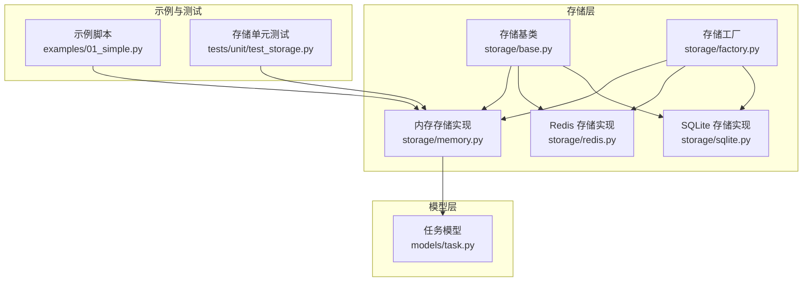
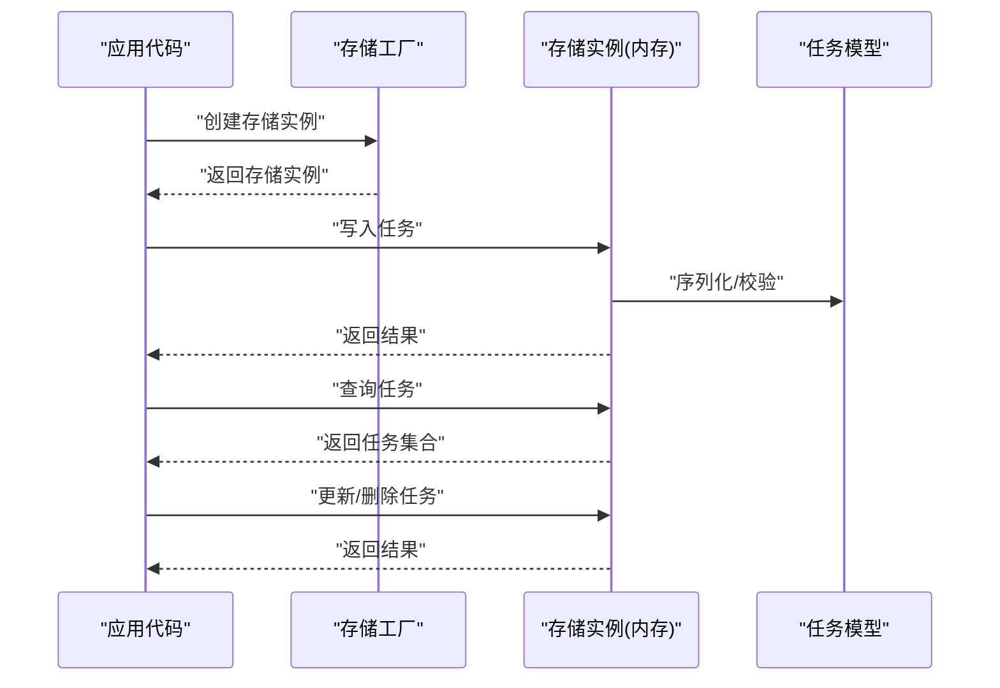
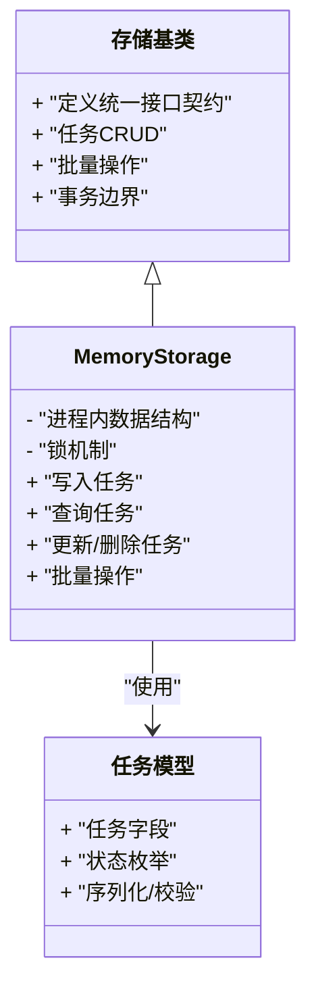
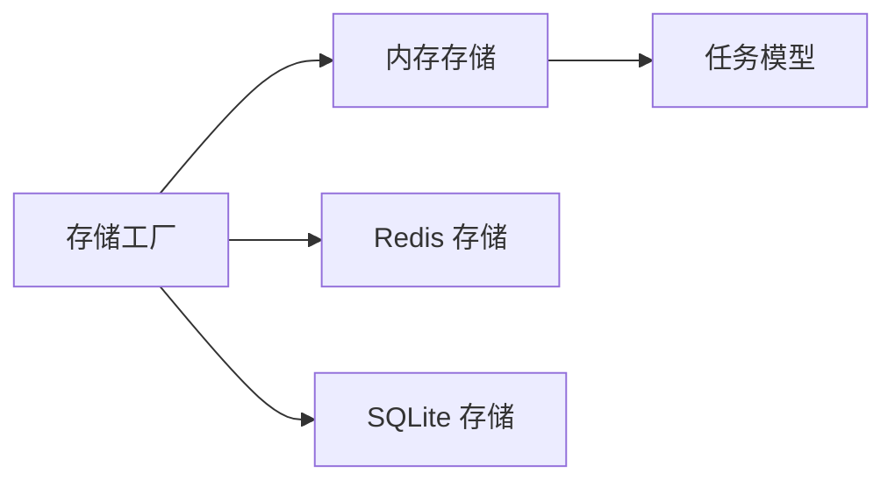

# 内存存储实现

<cite>
**本文引用的文件**   
- [src/neotask/storage/memory.py](file://src/neotask/storage/memory.py)
- [src/neotask/storage/base.py](file://src/neotask/storage/base.py)
- [src/neotask/storage/factory.py](file://src/neotask/storage/factory.py)
- [src/neotask/models/task.py](file://src/neotask/models/task.py)
- [examples/01_simple.py](file://examples/01_simple.py)
- [tests/unit/test_storage.py](file://tests/unit/test_storage.py)
</cite>

## 目录
1. [简介](#简介)
2. [项目结构](#项目结构)
3. [核心组件](#核心组件)
4. [架构总览](#架构总览)
5. [详细组件分析](#详细组件分析)
6. [依赖关系分析](#依赖关系分析)
7. [性能考虑](#性能考虑)
8. [故障排查指南](#故障排查指南)
9. [结论](#结论)
10. [附录](#附录)

## 简介
本文件围绕内存存储的实现与使用进行系统化说明，重点覆盖 MemoryStorage 的数据结构设计、线程安全机制、性能特征、配置选项与调优建议，并通过示例展示在单机应用与测试环境中的使用方法。同时给出与其他存储类型（如 Redis、SQLite）的对比与迁移方案，帮助读者在不同场景下做出合适的选择。

## 项目结构
本项目采用分层与模块化组织方式，存储层位于 storage 包中，提供统一接口与多种后端实现。MemoryStorage 作为默认或轻量级后端，适用于单机进程内运行、单元测试与快速原型验证等场景。

图表来源
- [src/neotask/storage/base.py](file://src/neotask/storage/base.py)
- [src/neotask/storage/memory.py](file://src/neotask/storage/memory.py)
- [src/neotask/storage/factory.py](file://src/neotask/storage/factory.py)
- [src/neotask/models/task.py](file://src/neotask/models/task.py)
- [examples/01_simple.py](file://examples/01_simple.py)
- [tests/unit/test_storage.py](file://tests/unit/test_storage.py)

章节来源
- [src/neotask/storage/memory.py](file://src/neotask/storage/memory.py)
- [src/neotask/storage/base.py](file://src/neotask/storage/base.py)
- [src/neotask/storage/factory.py](file://src/neotask/storage/factory.py)
- [src/neotask/models/task.py](file://src/neotask/models/task.py)
- [examples/01_simple.py](file://examples/01_simple.py)
- [tests/unit/test_storage.py](file://tests/unit/test_storage.py)

## 核心组件
- 存储基类：定义统一的存储接口契约，包括任务的增删改查、状态更新、批量操作、事务边界等抽象方法，供各具体存储实现遵循。
- 内存存储实现：基于进程内数据结构（如字典、列表、堆等）提供高性能读写能力，适合单进程并发访问；通过锁机制保证线程安全。
- 存储工厂：根据配置或运行时参数创建并返回具体的存储实例，屏蔽后端差异，便于切换与扩展。
- 任务模型：定义任务实体的字段与行为，是存储层持久化的数据载体。

章节来源
- [src/neotask/storage/base.py](file://src/neotask/storage/base.py)
- [src/neotask/storage/memory.py](file://src/neotask/storage/memory.py)
- [src/neotask/storage/factory.py](file://src/neotask/storage/factory.py)
- [src/neotask/models/task.py](file://src/neotask/models/task.py)

## 架构总览
下图展示了存储层的整体交互关系：上层模块通过工厂获取存储实例，调用统一接口完成数据操作；内存存储在进程内维护数据，具备低延迟特性，但数据易失。

图表来源
- [src/neotask/storage/factory.py](file://src/neotask/storage/factory.py)
- [src/neotask/storage/memory.py](file://src/neotask/storage/memory.py)
- [src/neotask/models/task.py](file://src/neotask/models/task.py)

## 详细组件分析

### MemoryStorage 类分析
- 数据结构设计
  - 使用进程内容器（如字典映射主键到任务对象、列表或堆维护有序队列）实现 O(1) 查找与高效排序/优先级处理。
  - 为支持时间轮或延迟队列等调度需求，可能引入按触发时间索引的结构，以优化定时任务的检索效率。
- 线程安全机制
  - 通过互斥锁保护关键路径（写操作、批量更新、跨结构一致性调整），避免并发竞争导致的数据不一致。
  - 读多写少场景可采用细粒度锁或分段锁策略，降低锁竞争开销。
- 性能特点
  - 优势：无网络 I/O、零序列化开销（相对外部存储）、极低延迟与高吞吐，适合热点数据与高频小事务。
  - 局限：数据易失（进程退出丢失）、受限于进程内存上限、跨进程不可共享。
- 错误处理与边界条件
  - 对非法输入、重复插入、越界访问等进行校验与异常抛出，确保上层可感知并恢复。
  - 对大规模数据的分页/限制查询提供保护，防止内存峰值过高。

图表来源
- [src/neotask/storage/base.py](file://src/neotask/storage/base.py)
- [src/neotask/storage/memory.py](file://src/neotask/storage/memory.py)
- [src/neotask/models/task.py](file://src/neotask/models/task.py)

章节来源
- [src/neotask/storage/memory.py](file://src/neotask/storage/memory.py)
- [src/neotask/storage/base.py](file://src/neotask/storage/base.py)
- [src/neotask/models/task.py](file://src/neotask/models/task.py)

### 存储工厂与配置
- 工厂职责
  - 根据配置项（如后端类型、连接参数、容量限制等）创建对应存储实例。
  - 提供默认实现（通常为内存存储），简化初始化流程。
- 配置选项（概念性说明）
  - 后端类型：memory、redis、sqlite 等。
  - 容量限制：最大任务数、内存阈值、过期策略等。
  - 并发控制：锁粒度、超时设置、重试次数等。
- 使用建议
  - 开发/测试优先使用 memory；生产环境根据持久化与分布式需求选择 redis 或 sqlite。
  - 通过工厂集中管理配置，避免硬编码。

章节来源
- [src/neotask/storage/factory.py](file://src/neotask/storage/factory.py)

### 使用示例与最佳实践
- 单机应用
  - 通过工厂创建内存存储实例，直接注入到业务模块，获得低延迟读写能力。
  - 注意进程重启后数据丢失，需结合外部系统做补偿或仅用于短期缓存。
- 测试环境
  - 使用内存存储隔离测试数据，提升测试执行速度与稳定性。
  - 配合夹具与断言，验证任务生命周期与状态流转。

章节来源
- [examples/01_simple.py](file://examples/01_simple.py)
- [tests/unit/test_storage.py](file://tests/unit/test_storage.py)

## 依赖关系分析
- 内部依赖
  - MemoryStorage 依赖任务模型进行数据建模与校验。
  - 存储工厂依赖各具体实现注册表，动态创建实例。
- 外部依赖
  - 内存存储不依赖外部服务，减少部署复杂度与故障面。
- 耦合与内聚
  - 存储层通过统一接口解耦上层业务，提高可替换性与可测试性。
  - 内存存储内部结构清晰，关注点单一，内聚度高。

图表来源
- [src/neotask/storage/factory.py](file://src/neotask/storage/factory.py)
- [src/neotask/storage/memory.py](file://src/neotask/storage/memory.py)
- [src/neotask/models/task.py](file://src/neotask/models/task.py)

章节来源
- [src/neotask/storage/factory.py](file://src/neotask/storage/factory.py)
- [src/neotask/storage/memory.py](file://src/neotask/storage/memory.py)
- [src/neotask/models/task.py](file://src/neotask/models/task.py)

## 性能考虑
- 优势
  - 低延迟：无网络往返与磁盘 I/O，适合热点数据与高频小事务。
  - 高吞吐：进程内数据结构操作效率高，锁粒度合理时可达到极高并发。
- 局限性
  - 数据易失：进程退出即丢失，不适合需要持久化的场景。
  - 内存限制：受限于进程可用内存，需监控与限流。
- 调优建议
  - 锁粒度：读多写少场景采用细粒度锁或分段锁，降低竞争。
  - 容量控制：设置最大任务数与内存阈值，超限拒绝或淘汰旧数据。
  - 批量操作：合并多次写入，减少锁持有时间与上下文切换。
  - 查询优化：按需分页与过滤，避免全量扫描。
  - 预热与缓存：启动时预加载热点数据，减少冷启动抖动。

[本节为通用性能指导，无需特定文件引用]

## 故障排查指南
- 常见问题
  - 数据丢失：确认是否使用内存存储且进程重启；必要时切换到持久化后端。
  - 内存溢出：检查任务规模与对象大小，启用容量限制与淘汰策略。
  - 并发冲突：观察锁等待与死锁迹象，调整锁粒度与超时。
- 诊断步骤
  - 查看日志与指标，定位慢查询与热点路径。
  - 使用压测工具模拟负载，评估锁竞争与内存峰值。
  - 逐步切换后端（redis/sqlite）验证问题是否与存储相关。

章节来源
- [tests/unit/test_storage.py](file://tests/unit/test_storage.py)

## 结论
内存存储以其高性能与低延迟成为单机与测试环境的优选方案。其易失性与内存限制决定了它不适合作为唯一持久化手段。通过合理的配置与调优，可在保障稳定性的前提下最大化性能收益。在生产环境中，建议结合持久化后端与缓存策略，兼顾可靠性与性能。

[本节为总结性内容，无需特定文件引用]

## 附录

### 与其他存储类型的对比
- 内存存储 vs Redis
  - 内存存储：更低延迟、更高吞吐，但易失、不可共享。
  - Redis：持久化、分布式共享、生态丰富，但有网络与序列化开销。
- 内存存储 vs SQLite
  - 内存存储：极致性能，无持久化。
  - SQLite：本地持久化、部署简单，但并发与扩展性受限。

[本节为概念性对比，无需特定文件引用]

### 迁移方案
- 从内存存储迁移到 Redis/SQLite
  - 保持存储接口不变，通过工厂切换后端。
  - 数据迁移：导出内存数据，导入目标后端；或使用双写过渡期逐步切流。
  - 回滚策略：保留旧后端与数据快照，快速回退。
- 注意事项
  - 校验数据一致性与幂等性。
  - 压测验证新后端性能与稳定性。
  - 完善监控与告警，及时发现异常。

[本节为概念性迁移指导，无需特定文件引用]