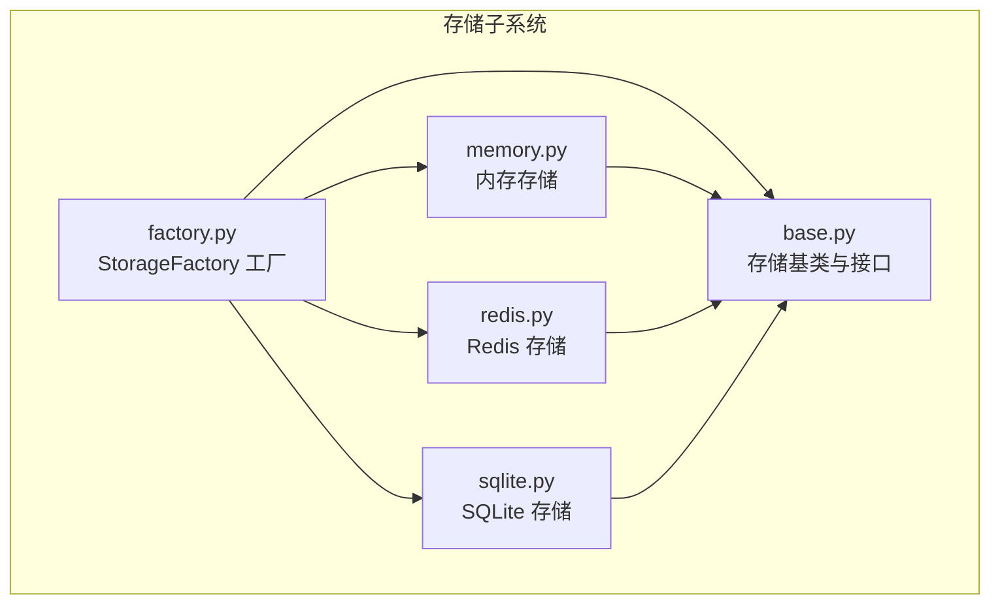
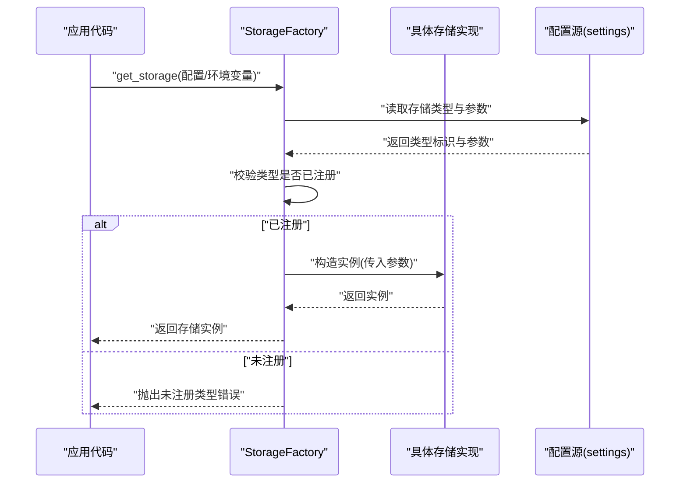
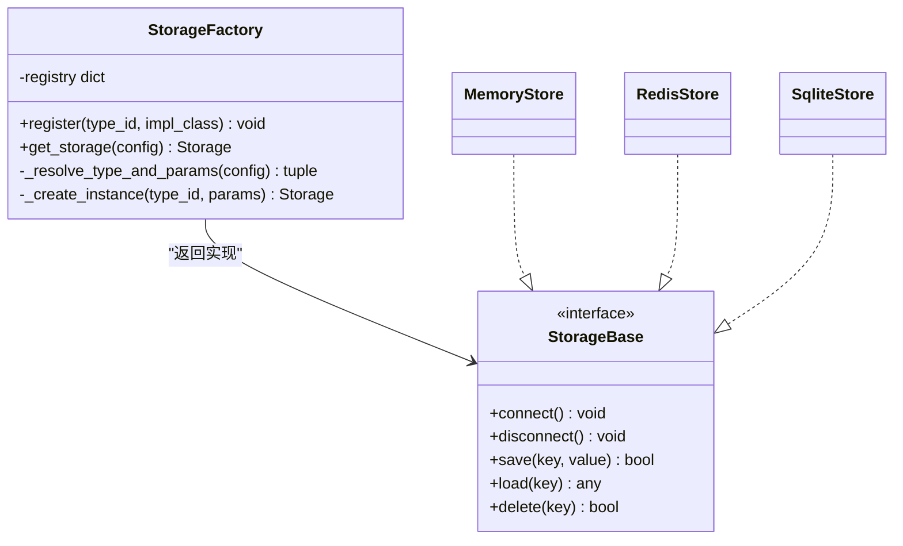
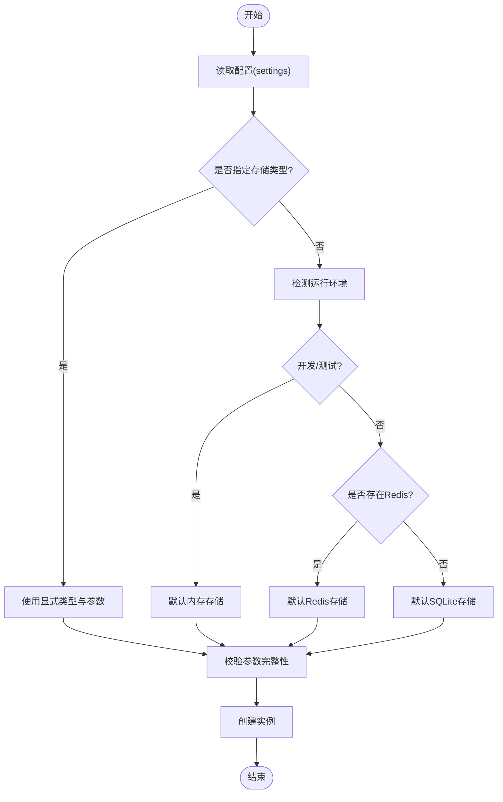
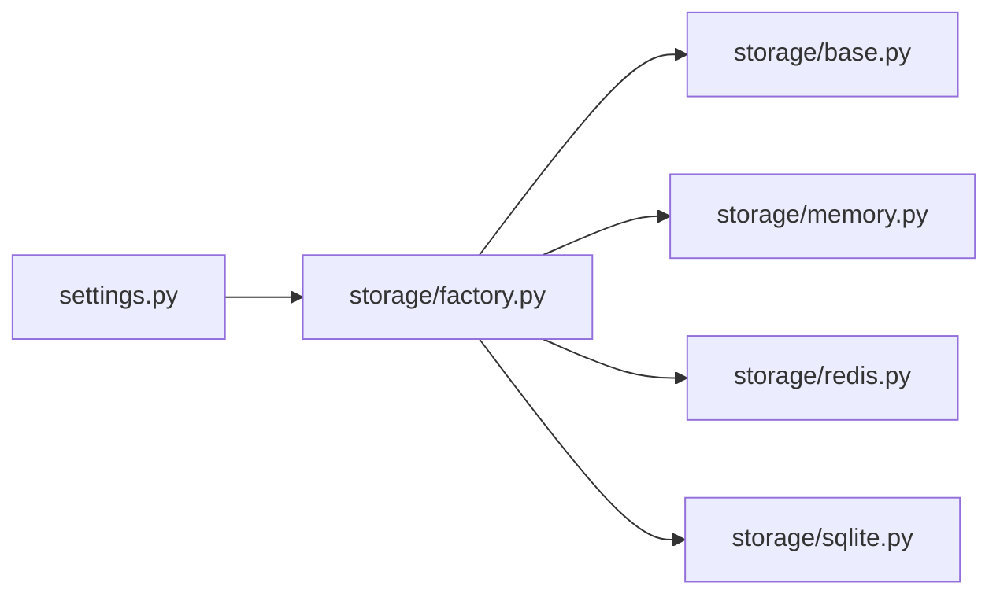

# 存储工厂模式

<cite>
**本文引用的文件**
- [src/neotask/storage/factory.py](file://src/neotask/storage/factory.py)
- [src/neotask/storage/base.py](file://src/neotask/storage/base.py)
- [src/neotask/storage/memory.py](file://src/neotask/storage/memory.py)
- [src/neotask/storage/redis.py](file://src/neotask/storage/redis.py)
- [src/neotask/storage/sqlite.py](file://src/neotask/storage/sqlite.py)
- [src/neotask/config/settings.py](file://src/neotask/config/settings.py)
- [tests/unit/test_storage.py](file://tests/unit/test_storage.py)
- [tests/unit/test_redis_storage.py](file://tests/unit/test_redis_storage.py)
</cite>

## 目录
1. [简介](#简介)
2. [项目结构](#项目结构)
3. [核心组件](#核心组件)
4. [架构总览](#架构总览)
5. [详细组件分析](#详细组件分析)
6. [依赖关系分析](#依赖关系分析)
7. [性能考虑](#性能考虑)
8. [故障排查指南](#故障排查指南)
9. [结论](#结论)
10. [附录](#附录)

## 简介
本文件围绕“存储工厂模式”的实现与扩展机制，系统性阐述 StorageFactory 的创建逻辑、类型注册与配置解析流程；解释如何动态选择与管理不同的存储后端（内存、Redis、SQLite）；提供自定义存储类型的注册方法与配置示例；并覆盖存储切换、热重载与版本兼容性处理策略。最后给出在不同环境下自动选择合适存储后端的配置方案，以及工厂模式的扩展点与最佳实践。

## 项目结构
存储子系统位于 src/neotask/storage 目录下，采用“接口抽象 + 多实现 + 工厂注册”的分层组织方式：
- base.py：定义存储基类与统一接口契约
- memory.py / redis.py / sqlite.py：具体存储后端实现
- factory.py：StorageFactory 工厂类，负责类型注册、配置解析与实例化
- exceptions.py：存储相关异常定义（若存在）

图表来源
- [src/neotask/storage/factory.py](file://src/neotask/storage/factory.py)
- [src/neotask/storage/base.py](file://src/neotask/storage/base.py)
- [src/neotask/storage/memory.py](file://src/neotask/storage/memory.py)
- [src/neotask/storage/redis.py](file://src/neotask/storage/redis.py)
- [src/neotask/storage/sqlite.py](file://src/neotask/storage/sqlite.py)

章节来源
- [src/neotask/storage/factory.py](file://src/neotask/storage/factory.py)
- [src/neotask/storage/base.py](file://src/neotask/storage/base.py)
- [src/neotask/storage/memory.py](file://src/neotask/storage/memory.py)
- [src/neotask/storage/redis.py](file://src/neotask/storage/redis.py)
- [src/neotask/storage/sqlite.py](file://src/neotask/storage/sqlite.py)

## 核心组件
- 存储基类（Base）：定义统一的读写、事务、连接生命周期等接口，确保各后端行为一致。
- 存储工厂（StorageFactory）：维护类型到实现的映射，解析配置项，按环境或显式配置动态选择并创建具体存储实例。
- 具体实现：
  - 内存存储：进程内字典/队列，适合测试与轻量场景。
  - Redis 存储：基于 Redis 的持久化与分布式能力，适合生产集群。
  - SQLite 存储：单文件或嵌入式数据库，适合单机部署与轻量持久化。

章节来源
- [src/neotask/storage/base.py](file://src/neotask/storage/base.py)
- [src/neotask/storage/factory.py](file://src/neotask/storage/factory.py)
- [src/neotask/storage/memory.py](file://src/neotask/storage/memory.py)
- [src/neotask/storage/redis.py](file://src/neotask/storage/redis.py)
- [src/neotask/storage/sqlite.py](file://src/neotask/storage/sqlite.py)

## 架构总览
下图展示 StorageFactory 在应用中的位置与交互关系：上层通过工厂获取存储实例，工厂根据配置与环境变量解析出目标类型，再调用对应实现完成初始化与返回。

图表来源
- [src/neotask/storage/factory.py](file://src/neotask/storage/factory.py)
- [src/neotask/config/settings.py](file://src/neotask/config/settings.py)

## 详细组件分析

### StorageFactory 工厂类
职责与关键点：
- 类型注册表：维护一个从“类型标识”到“实现类”的映射，支持运行时动态注册新存储类型。
- 配置解析：从 settings 中读取存储类型与连接参数，支持默认值与回退策略。
- 实例化与缓存：根据类型标识创建实例，可选择性缓存以避免重复构造。
- 错误处理：对缺失配置、未知类型、连接失败等情况进行明确报错。

典型方法（概念说明）：
- register(type_id, impl_class)：注册新的存储类型。
- get_storage(config=None)：解析配置并返回存储实例。
- _resolve_type_and_params(config)：将配置转换为类型标识与参数。
- _create_instance(type_id, params)：根据类型标识创建实例。

图表来源
- [src/neotask/storage/factory.py](file://src/neotask/storage/factory.py)
- [src/neotask/storage/base.py](file://src/neotask/storage/base.py)
- [src/neotask/storage/memory.py](file://src/neotask/storage/memory.py)
- [src/neotask/storage/redis.py](file://src/neotask/storage/redis.py)
- [src/neotask/storage/sqlite.py](file://src/neotask/storage/sqlite.py)

章节来源
- [src/neotask/storage/factory.py](file://src/neotask/storage/factory.py)

### 配置解析与环境适配
- 配置来源：settings.py 提供统一的配置入口，包含存储类型、连接参数、超时、重试等。
- 解析流程：
  - 优先使用显式传入的配置对象。
  - 其次读取全局配置（如配置文件或环境变量）。
  - 若未指定类型，则根据运行环境（开发/测试/生产）选择默认后端。
- 默认策略建议：
  - 开发/测试：内存存储（无需外部依赖）。
  - 生产：Redis 存储（高可用与分布式）。
  - 单机持久化：SQLite 存储（零依赖、易迁移）。

图表来源
- [src/neotask/config/settings.py](file://src/neotask/config/settings.py)
- [src/neotask/storage/factory.py](file://src/neotask/storage/factory.py)

章节来源
- [src/neotask/config/settings.py](file://src/neotask/config/settings.py)
- [src/neotask/storage/factory.py](file://src/neotask/storage/factory.py)

### 动态选择与管理不同存储后端
- 动态选择：通过类型标识（如 "memory"、"redis"、"sqlite"）在运行时决定具体实现。
- 管理要点：
  - 连接池与资源释放：确保 connect/disconnect 成对调用。
  - 健康检查：启动时探测后端可用性，失败快速失败。
  - 降级策略：当主存储不可用时，可回退至本地存储（需业务允许）。

章节来源
- [src/neotask/storage/factory.py](file://src/neotask/storage/factory.py)
- [src/neotask/storage/redis.py](file://src/neotask/storage/redis.py)
- [src/neotask/storage/sqlite.py](file://src/neotask/storage/sqlite.py)

### 自定义存储类型的注册方法与配置示例
- 注册步骤：
  - 实现符合 StorageBase 接口的自定义存储类。
  - 调用 StorageFactory.register("your_type", YourStoreClass)。
  - 在配置中将 type 设置为 "your_type"，并提供必要参数。
- 配置示例（概念说明）：
  - type: "your_type"
  - host/port/path 等参数由具体实现决定。
- 验证方式：
  - 单元测试中通过 fixtures 注入配置，断言 get_storage 返回正确实例。

章节来源
- [src/neotask/storage/factory.py](file://src/neotask/storage/factory.py)
- [tests/unit/test_storage.py](file://tests/unit/test_storage.py)

### 存储切换、热重载与版本兼容性
- 存储切换：
  - 通过修改配置或环境变量，重启服务即可切换到新后端。
  - 建议在切换前执行数据迁移脚本，保证键空间与数据结构兼容。
- 热重载：
  - 监听配置变更事件，触发重新创建存储实例。
  - 旧实例优雅关闭，新实例建立连接后替换引用。
- 版本兼容性：
  - 在存储实现中维护 schema_version 字段。
  - 启动时检测版本并进行增量升级或拒绝启动（取决于策略）。

章节来源
- [src/neotask/storage/factory.py](file://src/neotask/storage/factory.py)
- [src/neotask/storage/redis.py](file://src/neotask/storage/redis.py)
- [src/neotask/storage/sqlite.py](file://src/neotask/storage/sqlite.py)

### 不同环境下自动选择合适存储后端的配置方案
- 开发环境：type="memory"，无需额外依赖。
- 测试环境：type="memory" 或 type="sqlite"，便于断言与隔离。
- 生产环境：type="redis"，配合连接池与监控。
- 单机持久化：type="sqlite"，适用于轻量部署。

章节来源
- [src/neotask/config/settings.py](file://src/neotask/config/settings.py)

### 工厂模式的扩展点与最佳实践
- 扩展点：
  - 新增存储类型：实现接口 + 注册 + 配置。
  - 中间件/钩子：在 create_instance 前后插入日志、指标、限流等横切逻辑。
  - 健康检查与自愈：在实例化阶段探测后端可用性。
- 最佳实践：
  - 严格遵循接口契约，避免隐式行为差异。
  - 配置参数集中管理，提供默认值与校验。
  - 为每个后端编写独立单元测试与集成测试。
  - 记录关键操作日志与指标，便于排障与容量规划。

章节来源
- [src/neotask/storage/factory.py](file://src/neotask/storage/factory.py)
- [src/neotask/storage/base.py](file://src/neotask/storage/base.py)

## 依赖关系分析
- 模块耦合：
  - StorageFactory 仅依赖接口与配置，不直接耦合具体实现细节，保持松耦合。
  - 具体实现依赖各自的第三方库（如 redis-py、sqlite3），但对外暴露统一接口。
- 潜在循环依赖：
  - 工厂不应被具体实现反向依赖，避免循环。
- 外部依赖：
  - Redis 存储依赖 Redis 客户端库。
  - SQLite 存储依赖内置 sqlite3。
  - 内存存储无外部依赖。

图表来源
- [src/neotask/config/settings.py](file://src/neotask/config/settings.py)
- [src/neotask/storage/factory.py](file://src/neotask/storage/factory.py)
- [src/neotask/storage/base.py](file://src/neotask/storage/base.py)
- [src/neotask/storage/memory.py](file://src/neotask/storage/memory.py)
- [src/neotask/storage/redis.py](file://src/neotask/storage/redis.py)
- [src/neotask/storage/sqlite.py](file://src/neotask/storage/sqlite.py)

章节来源
- [src/neotask/storage/factory.py](file://src/neotask/storage/factory.py)
- [src/neotask/config/settings.py](file://src/neotask/config/settings.py)

## 性能考虑
- 内存存储：极低延迟，但受限于进程内存，不适合持久化与跨进程共享。
- Redis 存储：高吞吐与低延迟，注意网络开销与序列化成本；合理设置连接池大小与超时。
- SQLite 存储：写入并发受限，适合读多写少场景；可通过 WAL 模式提升并发读性能。
- 工厂开销：实例化与配置解析应在启动阶段完成，避免热点路径重复计算。

[本节为通用性能指导，不涉及具体文件分析]

## 故障排查指南
- 常见问题：
  - 未注册类型：确认已在启动时调用 register。
  - 配置缺失：检查 settings 中 type 与必需参数。
  - 连接失败：检查网络、认证信息与端口可达性。
- 定位手段：
  - 启用详细日志，观察工厂解析与实例化过程。
  - 使用单元测试复现问题，逐步缩小范围。
  - 针对 Redis/SQLite 分别编写连通性与基本读写用例。

章节来源
- [tests/unit/test_storage.py](file://tests/unit/test_storage.py)
- [tests/unit/test_redis_storage.py](file://tests/unit/test_redis_storage.py)

## 结论
通过 StorageFactory 的工厂模式，系统实现了存储后端的解耦与可扩展性。借助配置解析与环境自适应，可在不同场景下灵活选择最优存储；通过注册机制与中间件扩展点，能够低成本地接入新的存储类型与横切能力。结合完善的测试与监控，可保障在生产环境中稳定运行与平滑演进。

[本节为总结性内容，不涉及具体文件分析]

## 附录
- 术语：
  - 类型标识：用于区分不同存储实现的字符串键。
  - 配置对象：包含 type 与后端参数的结构化数据。
- 参考路径：
  - 工厂实现：[src/neotask/storage/factory.py](file://src/neotask/storage/factory.py)
  - 接口定义：[src/neotask/storage/base.py](file://src/neotask/storage/base.py)
  - 具体实现：[src/neotask/storage/memory.py](file://src/neotask/storage/memory.py)、[src/neotask/storage/redis.py](file://src/neotask/storage/redis.py)、[src/neotask/storage/sqlite.py](file://src/neotask/storage/sqlite.py)
  - 配置入口：[src/neotask/config/settings.py](file://src/neotask/config/settings.py)
  - 测试用例：[tests/unit/test_storage.py](file://tests/unit/test_storage.py)、[tests/unit/test_redis_storage.py](file://tests/unit/test_redis_storage.py)