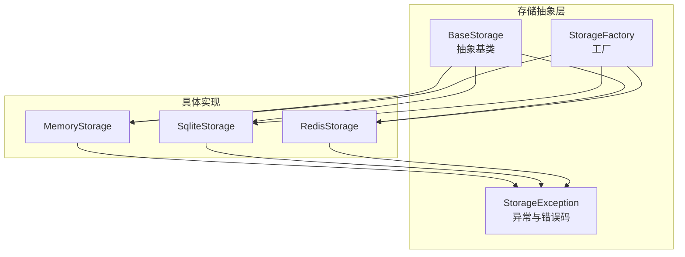
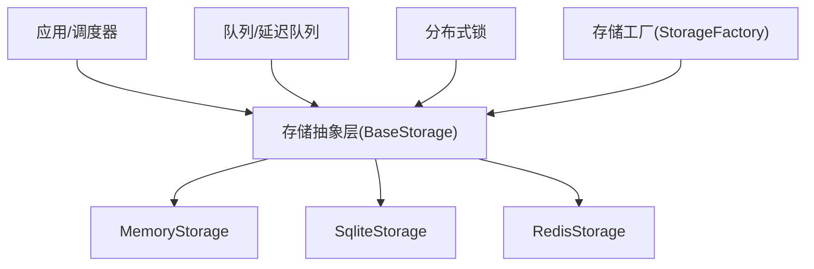
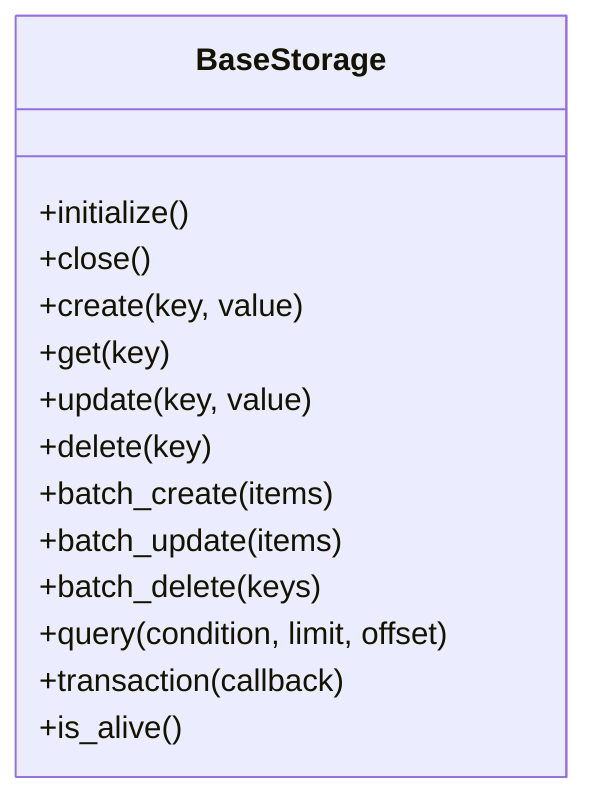
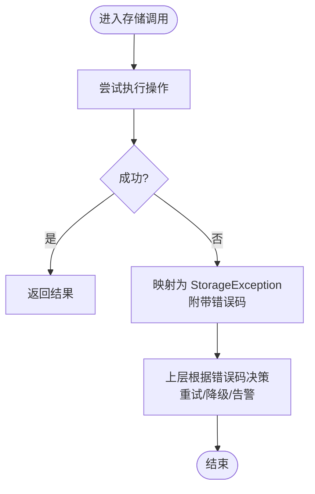
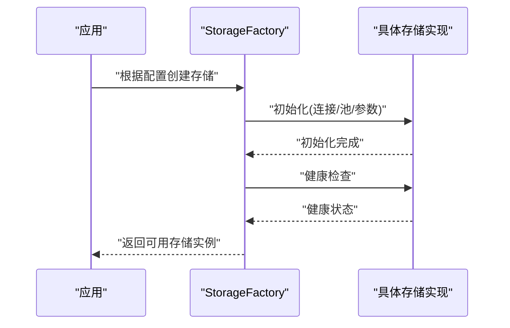
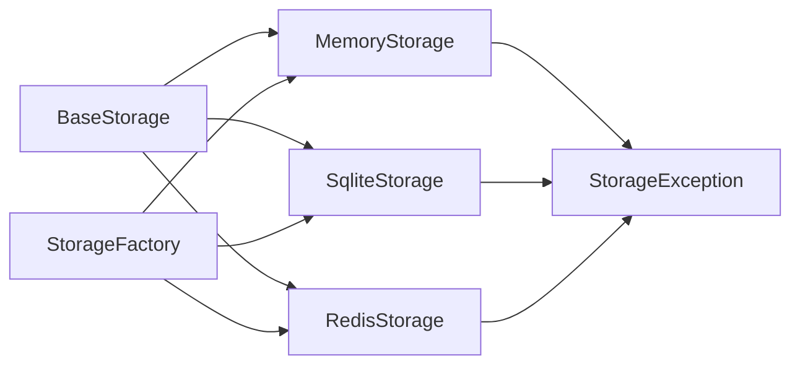
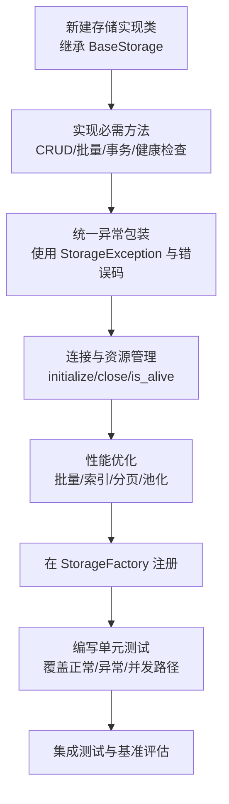

# 存储抽象接口

<cite>
**本文引用的文件**   
- [src/neotask/storage/base.py](file://src/neotask/storage/base.py)
- [src/neotask/storage/exceptions.py](file://src/neotask/storage/exceptions.py)
- [src/neotask/storage/factory.py](file://src/neotask/storage/factory.py)
- [src/neotask/storage/memory.py](file://src/neotask/storage/memory.py)
- [src/neotask/storage/sqlite.py](file://src/neotask/storage/sqlite.py)
- [src/neotask/storage/redis.py](file://src/neotask/storage/redis.py)
- [tests/unit/test_storage.py](file://tests/unit/test_storage.py)
</cite>

## 目录
1. [简介](#简介)
2. [项目结构](#项目结构)
3. [核心组件](#核心组件)
4. [架构总览](#架构总览)
5. [详细组件分析](#详细组件分析)
6. [依赖关系分析](#依赖关系分析)
7. [性能考虑](#性能考虑)
8. [故障排查指南](#故障排查指南)
9. [结论](#结论)
10. [附录：自定义存储实现指南](#附录自定义存储实现指南)

## 简介
本章节聚焦于存储抽象层的设计与实现，围绕 BaseStorage 基类、异常体系、工厂模式以及内存/SQLite/Redis 三种具体后端展开。文档旨在帮助读者理解：
- 存储抽象接口的职责边界与扩展点
- 数据 CRUD、事务、连接管理等关键能力
- 异常处理机制与错误码设计
- 如何基于现有抽象快速实现自定义存储后端

## 项目结构
存储子系统位于 src/neotask/storage 目录下，采用“接口+基类+多实现”的分层组织方式：
- base.py：定义存储抽象接口与通用基类
- exceptions.py：统一异常类型与错误码
- factory.py：按配置选择并创建具体存储实例
- memory.py / sqlite.py / redis.py：不同后端的实现
- tests/unit/test_storage.py：覆盖基础行为与一致性校验

图表来源
- [src/neotask/storage/base.py](file://src/neotask/storage/base.py)
- [src/neotask/storage/exceptions.py](file://src/neotask/storage/exceptions.py)
- [src/neotask/storage/factory.py](file://src/neotask/storage/factory.py)
- [src/neotask/storage/memory.py](file://src/neotask/storage/memory.py)
- [src/neotask/storage/sqlite.py](file://src/neotask/storage/sqlite.py)
- [src/neotask/storage/redis.py](file://src/neotask/storage/redis.py)

章节来源
- [src/neotask/storage/base.py](file://src/neotask/storage/base.py)
- [src/neotask/storage/exceptions.py](file://src/neotask/storage/exceptions.py)
- [src/neotask/storage/factory.py](file://src/neotask/storage/factory.py)
- [src/neotask/storage/memory.py](file://src/neotask/storage/memory.py)
- [src/neotask/storage/sqlite.py](file://src/neotask/storage/sqlite.py)
- [src/neotask/storage/redis.py](file://src/neotask/storage/redis.py)

## 核心组件
本节从接口契约、CRUD 语义、事务模型、连接生命周期与异常约定五个维度解析 BaseStorage 及其相关组件。

- 抽象接口与基类
  - BaseStorage 提供统一的存储访问入口，屏蔽底层差异，向上层暴露一致的 API。
  - 典型能力包括：资源初始化/关闭、键值读写、批量操作、条件查询、分页扫描、事务控制等。
  - 基类通常封装通用逻辑（如参数校验、日志埋点、指标上报），子类仅关注具体持久化细节。

- CRUD 操作
  - 创建：插入新记录或键值对，返回唯一标识或写入结果。
  - 读取：按主键或条件获取单条/多条记录。
  - 更新：按条件更新字段，支持幂等与版本控制。
  - 删除：按主键或条件删除，支持级联与软删除策略。

- 事务支持
  - 提供事务开启、提交、回滚的原子性保障。
  - 在分布式场景下，建议结合锁与重试机制保证最终一致性。

- 连接管理
  - 显式初始化与优雅关闭，避免连接泄漏。
  - 可选的连接池与超时控制，提升并发吞吐与稳定性。

- 异常与错误码
  - 通过 StorageException 统一抛出业务与系统异常。
  - 错误码用于区分“不存在”、“已存在”、“冲突”、“不可用”等场景，便于上层路由与告警。

章节来源
- [src/neotask/storage/base.py](file://src/neotask/storage/base.py)
- [src/neotask/storage/exceptions.py](file://src/neotask/storage/exceptions.py)

## 架构总览
下图展示存储抽象层与上层调度器、队列、锁等模块的交互关系，以及各具体存储后端的接入方式。

图表来源
- [src/neotask/storage/base.py](file://src/neotask/storage/base.py)
- [src/neotask/storage/factory.py](file://src/neotask/storage/factory.py)
- [src/neotask/storage/memory.py](file://src/neotask/storage/memory.py)
- [src/neotask/storage/sqlite.py](file://src/neotask/storage/sqlite.py)
- [src/neotask/storage/redis.py](file://src/neotask/storage/redis.py)

## 详细组件分析

### BaseStorage 抽象基类
- 职责
  - 定义存储访问的统一契约，确保上层调用无需关心底层差异。
  - 提供可复用的通用流程（如参数校验、日志、监控）。
- 关键方法（概念性说明）
  - 初始化/销毁：负责建立/释放资源。
  - 基本读写：按 key 或 id 进行增删改查。
  - 批量操作：提高吞吐，减少往返次数。
  - 条件查询/分页：面向复杂检索与列表展示。
  - 事务：begin/commit/rollback 原子性控制。
  - 健康检查：is_alive/health_check 用于心跳与自愈。
- 扩展点
  - 子类需实现的具体持久化方法。
  - 可选重写的事务/连接池策略。
  - 可选重写索引/排序/过滤等高级特性。

图表来源
- [src/neotask/storage/base.py](file://src/neotask/storage/base.py)

章节来源
- [src/neotask/storage/base.py](file://src/neotask/storage/base.py)

### 异常与错误码
- 统一异常
  - 所有存储相关异常均继承自 StorageException，便于上层捕获与分类处理。
- 常见错误码（示例）
  - 不存在：对应查询结果为空或键缺失。
  - 已存在：插入时主键冲突。
  - 冲突：并发更新导致版本不一致。
  - 不可用：后端服务不可达或连接失败。
- 使用建议
  - 在工厂创建阶段尽早探测可用性，失败即抛错。
  - 在业务层根据错误码决定重试、降级或告警。

图表来源
- [src/neotask/storage/exceptions.py](file://src/neotask/storage/exceptions.py)

章节来源
- [src/neotask/storage/exceptions.py](file://src/neotask/storage/exceptions.py)

### 存储工厂 StorageFactory
- 作用
  - 根据配置动态创建 Memory/SQLite/Redis 等具体存储实例。
  - 集中管理初始化参数、连接池、超时、重试等横切关注点。
- 典型流程
  - 读取配置 -> 选择后端 -> 构造实例 -> 健康检查 -> 返回可用对象。
- 扩展新后端
  - 新增实现类并在工厂注册，即可无缝接入。

图表来源
- [src/neotask/storage/factory.py](file://src/neotask/storage/factory.py)
- [src/neotask/storage/memory.py](file://src/neotask/storage/memory.py)
- [src/neotask/storage/sqlite.py](file://src/neotask/storage/sqlite.py)
- [src/neotask/storage/redis.py](file://src/neotask/storage/redis.py)

章节来源
- [src/neotask/storage/factory.py](file://src/neotask/storage/factory.py)

### 内存存储 MemoryStorage
- 特点
  - 进程内字典/集合实现，适合单元测试与轻量场景。
  - 无外部依赖，启动快，但数据不持久。
- 适用场景
  - 本地开发、集成测试、临时缓存。

章节来源
- [src/neotask/storage/memory.py](file://src/neotask/storage/memory.py)

### SQLite 存储 SqliteStorage
- 特点
  - 基于 SQLite 的文件型数据库，具备 ACID 事务与简单并发。
  - 适合单机部署、中小规模任务与低并发场景。
- 注意事项
  - 并发写需合理设置 WAL 模式与超时。
  - 大表建议增加必要索引以提升查询性能。

章节来源
- [src/neotask/storage/sqlite.py](file://src/neotask/storage/sqlite.py)

### Redis 存储 RedisStorage
- 特点
  - 高性能 KV 存储，支持原子操作、过期、发布订阅等。
  - 适合高并发、分布式与跨进程共享状态。
- 注意事项
  - 注意网络分区与超时重试。
  - 数据结构选型（Hash/List/Set/ZSet）影响性能与一致性。

章节来源
- [src/neotask/storage/redis.py](file://src/neotask/storage/redis.py)

## 依赖关系分析
- 耦合与内聚
  - BaseStorage 作为稳定抽象，降低上层与实现的耦合度。
  - 具体实现仅依赖自身驱动与第三方库，保持高内聚。
- 外部依赖
  - SQLite 依赖内置 sqlite3。
  - Redis 依赖 redis-py 或等效客户端。
  - 工厂依赖配置与注册表。
- 潜在循环依赖
  - 当前分层清晰，未见循环导入；新增实现时应遵循单向依赖原则。

图表来源
- [src/neotask/storage/base.py](file://src/neotask/storage/base.py)
- [src/neotask/storage/factory.py](file://src/neotask/storage/factory.py)
- [src/neotask/storage/memory.py](file://src/neotask/storage/memory.py)
- [src/neotask/storage/sqlite.py](file://src/neotask/storage/sqlite.py)
- [src/neotask/storage/redis.py](file://src/neotask/storage/redis.py)
- [src/neotask/storage/exceptions.py](file://src/neotask/storage/exceptions.py)

章节来源
- [src/neotask/storage/base.py](file://src/neotask/storage/base.py)
- [src/neotask/storage/factory.py](file://src/neotask/storage/factory.py)
- [src/neotask/storage/exceptions.py](file://src/neotask/storage/exceptions.py)

## 性能考虑
- 批量操作
  - 优先使用 batch_create/batch_update/batch_delete 减少往返开销。
- 事务粒度
  - 尽量缩小事务范围，避免长事务占用资源。
- 连接与池化
  - 合理设置连接池大小、最大空闲时间与超时，避免连接风暴。
- 索引与查询
  - 针对高频查询条件建立索引；避免全表扫描。
- 序列化与体积
  - 控制单条记录大小，必要时拆分或归档历史数据。
- 容错与重试
  - 对瞬时错误（网络抖动、锁竞争）实施指数退避重试。

[本节为通用指导，不直接分析具体文件]

## 故障排查指南
- 常见问题定位
  - 初始化失败：检查配置项、网络连通性与权限。
  - 查询为空：确认键空间与命名规范，核对条件参数。
  - 并发冲突：检查版本号/乐观锁策略与重试逻辑。
  - 性能退化：观察慢查询、锁等待与连接池饱和。
- 诊断手段
  - 启用详细日志与指标采集。
  - 使用健康检查接口验证后端可用性。
  - 借助工厂的创建流程断点，逐步定位问题。

章节来源
- [tests/unit/test_storage.py](file://tests/unit/test_storage.py)

## 结论
存储抽象层通过 BaseStorage 统一了 CRUD、事务与连接管理的契约，配合异常体系与工厂模式，实现了高内聚、低耦合的可插拔存储架构。开发者可基于该抽象快速扩展新的存储后端，同时复用通用的健壮性与可观测性能力。

[本节为总结性内容，不直接分析具体文件]

## 附录：自定义存储实现指南
本节提供从零实现一个自定义存储后端的步骤与最佳实践。

- 必须实现的接口方法（以 BaseStorage 为准）
  - 初始化与销毁：initialize/close
  - 基本读写：create/get/update/delete
  - 批量操作：batch_create/batch_update/batch_delete
  - 查询与分页：query(limit, offset)
  - 事务：transaction(callback)
  - 健康检查：is_alive/health_check
- 异常与错误码
  - 使用 StorageException 包装底层异常，附带明确错误码。
  - 对“不存在/已存在/冲突/不可用”等场景给出差异化错误码。
- 连接管理
  - 在 initialize 中建立连接/池，在 close 中释放资源。
  - 实现 is_alive 以便工厂与健康检查使用。
- 事务与一致性
  - 若后端不支持原生事务，可在内存中模拟快照与回滚。
  - 对于分布式场景，结合锁与重试保证最终一致。
- 性能优化
  - 批量写入、预编译语句、索引优化、分页游标。
  - 控制单次请求的数据量，避免大对象阻塞。
- 注册到工厂
  - 在 StorageFactory 中注册新实现，并提供配置开关。
- 测试与验收
  - 编写单元测试覆盖 CRUD、事务、异常路径与并发场景。
  - 参考现有用例结构与断言风格。

图表来源
- [src/neotask/storage/base.py](file://src/neotask/storage/base.py)
- [src/neotask/storage/exceptions.py](file://src/neotask/storage/exceptions.py)
- [src/neotask/storage/factory.py](file://src/neotask/storage/factory.py)

章节来源
- [src/neotask/storage/base.py](file://src/neotask/storage/base.py)
- [src/neotask/storage/exceptions.py](file://src/neotask/storage/exceptions.py)
- [src/neotask/storage/factory.py](file://src/neotask/storage/factory.py)
- [tests/unit/test_storage.py](file://tests/unit/test_storage.py)