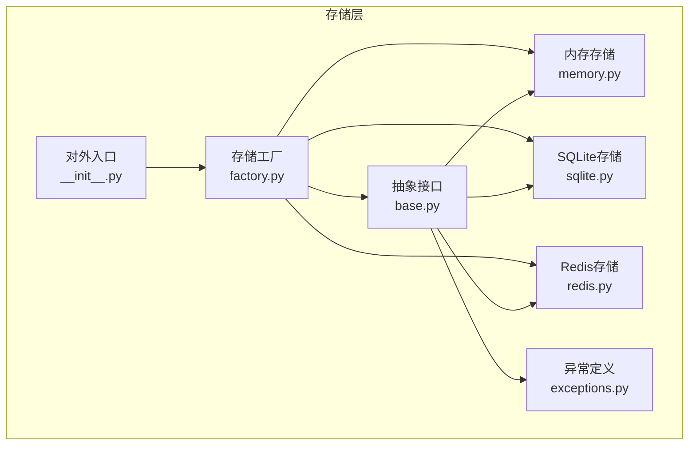
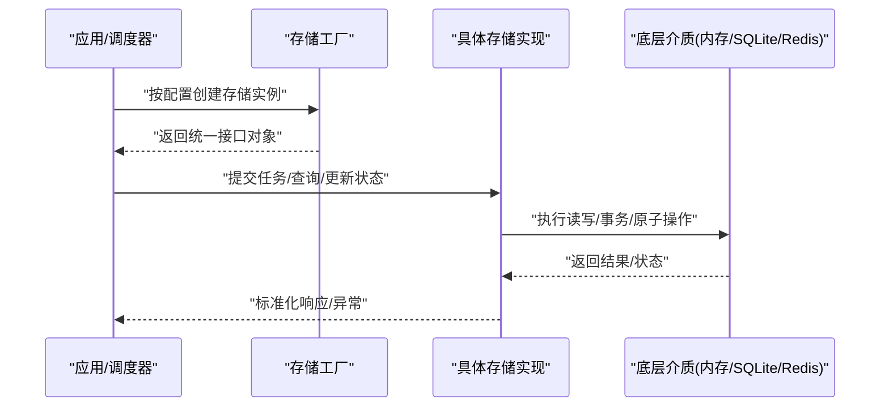
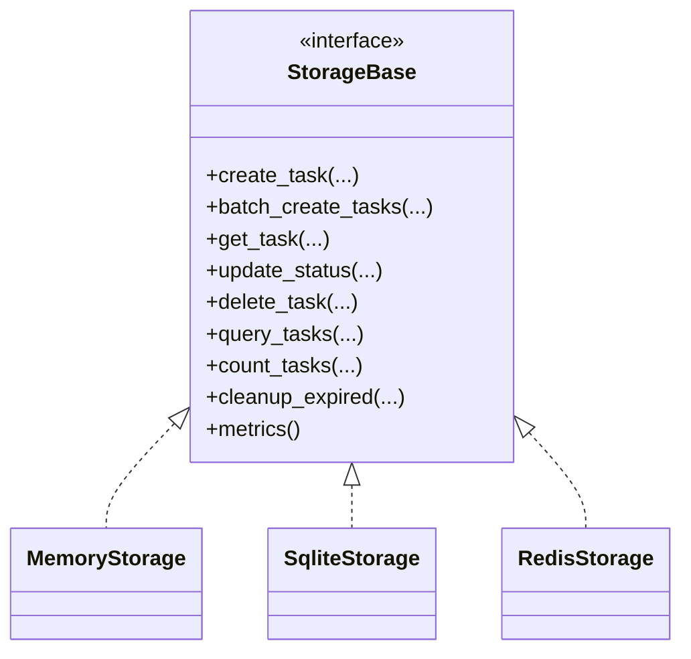
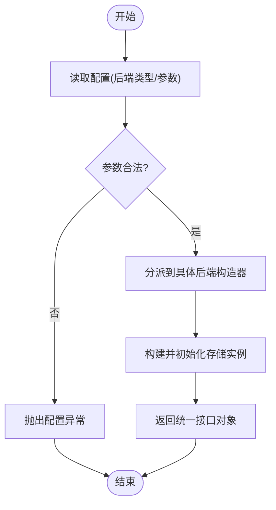
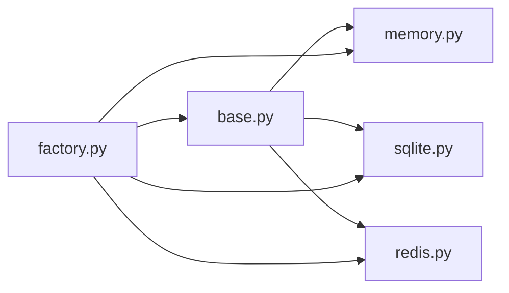

# 数据存储层

<cite>
**本文引用的文件**   
- [src/neotask/storage/base.py](file://src/neotask/storage/base.py)
- [src/neotask/storage/memory.py](file://src/neotask/storage/memory.py)
- [src/neotask/storage/sqlite.py](file://src/neotask/storage/sqlite.py)
- [src/neotask/storage/redis.py](file://src/neotask/storage/redis.py)
- [src/neotask/storage/factory.py](file://src/neotask/storage/factory.py)
- [src/neotask/storage/__init__.py](file://src/neotask/storage/__init__.py)
- [src/neotask/storage/exceptions.py](file://src/neotask/storage/exceptions.py)
- [tests/unit/test_storage.py](file://tests/unit/test_storage.py)
- [tests/unit/test_redis_storage.py](file://tests/unit/test_redis_storage.py)
- [tests/fixtures/storage.py](file://tests/fixtures/storage.py)
</cite>

## 目录
1. [简介](#简介)
2. [项目结构](#项目结构)
3. [核心组件](#核心组件)
4. [架构总览](#架构总览)
5. [详细组件分析](#详细组件分析)
6. [依赖关系分析](#依赖关系分析)
7. [性能考量](#性能考量)
8. [故障排查指南](#故障排查指南)
9. [结论](#结论)
10. [附录](#附录)

## 简介
本章节面向任务调度管理器的“数据存储层”，系统性阐述其抽象接口、实现方案与扩展方式，覆盖内存存储、SQLite持久化与Redis分布式存储的特点与适用场景；说明存储工厂模式的使用与自定义存储开发流程；并给出数据迁移、备份恢复、性能优化等运维相关能力与选型建议。

## 项目结构
存储子系统位于 src/neotask/storage 目录，采用“接口抽象 + 多后端实现 + 工厂创建”的分层设计：
- base.py：定义统一的存储抽象接口与通用异常类型
- memory.py：进程内内存存储实现（无外部依赖）
- sqlite.py：基于 SQLite 的单机持久化实现
- redis.py：基于 Redis 的分布式存储实现
- factory.py：根据配置动态创建具体存储实例
- __init__.py：对外暴露统一入口
- exceptions.py：存储层异常体系

图表来源
- [src/neotask/storage/base.py](file://src/neotask/storage/base.py)
- [src/neotask/storage/memory.py](file://src/neotask/storage/memory.py)
- [src/neotask/storage/sqlite.py](file://src/neotask/storage/sqlite.py)
- [src/neotask/storage/redis.py](file://src/neotask/storage/redis.py)
- [src/neotask/storage/factory.py](file://src/neotask/storage/factory.py)
- [src/neotask/storage/__init__.py](file://src/neotask/storage/__init__.py)
- [src/neotask/storage/exceptions.py](file://src/neotask/storage/exceptions.py)

章节来源
- [src/neotask/storage/base.py](file://src/neotask/storage/base.py)
- [src/neotask/storage/memory.py](file://src/neotask/storage/memory.py)
- [src/neotask/storage/sqlite.py](file://src/neotask/storage/sqlite.py)
- [src/neotask/storage/redis.py](file://src/neotask/storage/redis.py)
- [src/neotask/storage/factory.py](file://src/neotask/storage/factory.py)
- [src/neotask/storage/__init__.py](file://src/neotask/storage/__init__.py)
- [src/neotask/storage/exceptions.py](file://src/neotask/storage/exceptions.py)

## 核心组件
- 抽象接口（Base）
  - 职责：定义所有存储后端必须实现的统一方法契约，包括任务增删改查、状态变更、批量操作、事务/原子性语义、元数据与统计信息等。
  - 设计要点：
    - 明确输入输出模型与错误码约定
    - 提供可选钩子（如生命周期回调、审计日志）
    - 保证跨后端的幂等性与一致性边界
- 内存存储（Memory）
  - 特点：零依赖、极低延迟、进程级隔离、重启丢失
  - 适用：单元测试、本地调试、短生命周期任务
- SQLite存储（SQLite）
  - 特点：单文件数据库、ACID事务、并发写入受限
  - 适用：单机部署、中小规模任务、需要持久化的场景
- Redis存储（Redis）
  - 特点：高性能键值存储、支持原子操作与过期策略、天然分布式
  - 适用：高并发、分布式节点共享状态、需要强一致或最终一致的队列/状态
- 存储工厂（Factory）
  - 职责：依据配置选择并初始化具体存储实现，屏蔽后端差异
  - 扩展点：注册新后端、参数校验、连接池/重试策略注入

章节来源
- [src/neotask/storage/base.py](file://src/neotask/storage/base.py)
- [src/neotask/storage/memory.py](file://src/neotask/storage/memory.py)
- [src/neotask/storage/sqlite.py](file://src/neotask/storage/sqlite.py)
- [src/neotask/storage/redis.py](file://src/neotask/storage/redis.py)
- [src/neotask/storage/factory.py](file://src/neotask/storage/factory.py)
- [src/neotask/storage/exceptions.py](file://src/neotask/storage/exceptions.py)

## 架构总览
下图展示上层模块通过工厂获取存储实例，再调用统一接口完成数据访问的路径。

图表来源
- [src/neotask/storage/factory.py](file://src/neotask/storage/factory.py)
- [src/neotask/storage/base.py](file://src/neotask/storage/base.py)
- [src/neotask/storage/memory.py](file://src/neotask/storage/memory.py)
- [src/neotask/storage/sqlite.py](file://src/neotask/storage/sqlite.py)
- [src/neotask/storage/redis.py](file://src/neotask/storage/redis.py)

## 详细组件分析

### 抽象接口与异常体系
- 接口契约
  - 典型方法族：新增任务、批量插入、按条件查询、按ID获取、更新状态、删除、计数与分页、清理过期项、统计指标等
  - 事务与原子性：在支持的后端提供事务封装或原子命令组合
  - 幂等与重试：对重复提交进行去重或幂等处理
- 异常体系
  - 统一异常基类与细分异常（如连接失败、锁冲突、数据不存在、约束冲突等），便于上层捕获与降级

图表来源
- [src/neotask/storage/base.py](file://src/neotask/storage/base.py)
- [src/neotask/storage/memory.py](file://src/neotask/storage/memory.py)
- [src/neotask/storage/sqlite.py](file://src/neotask/storage/sqlite.py)
- [src/neotask/storage/redis.py](file://src/neotask/storage/redis.py)

章节来源
- [src/neotask/storage/base.py](file://src/neotask/storage/base.py)
- [src/neotask/storage/exceptions.py](file://src/neotask/storage/exceptions.py)

### 内存存储（Memory）
- 数据结构
  - 使用进程内容器维护任务集合，索引以任务ID为主键，辅以状态/优先级等辅助索引
- 复杂度
  - 查找/更新/删除：O(1)
  - 批量插入：O(n)
  - 条件查询：O(n)（可结合索引优化）
- 适用场景
  - 单元测试、快速原型、低延迟非持久化需求
- 注意事项
  - 进程退出即丢失数据
  - 多线程/多进程需自行加锁或使用进程间通信

章节来源
- [src/neotask/storage/memory.py](file://src/neotask/storage/memory.py)

### SQLite存储（SQLite）
- 数据模型
  - 表结构包含任务主信息、状态、优先级、调度时间、重试次数、错误信息等字段
  - 索引：主键、状态索引、调度时间索引、优先级索引等
- 事务与并发
  - 写路径使用事务保障一致性
  - 并发写入受限于SQLite的WAL模式与锁粒度，建议控制写并发
- 适用场景
  - 单机部署、中小规模任务、需要持久化与简单查询的场景
- 运维要点
  - 定期VACUUM与索引重建
  - 合理设置PRAGMA（如journal_mode=WAL、synchronous=NORMAL）

章节来源
- [src/neotask/storage/sqlite.py](file://src/neotask/storage/sqlite.py)

### Redis存储（Redis）
- 数据结构
  - 使用Hash/Sorted Set/List等结构表达任务、状态与优先级队列
  - 利用TTL实现过期清理与延迟任务
- 原子性与一致性
  - 通过Lua脚本或管道+WATCH实现原子更新与乐观锁
- 适用场景
  - 高并发、分布式节点共享状态、需要强实时性的任务队列
- 运维要点
  - 连接池与超时配置
  - 内存淘汰策略与持久化（RDB/AOF）权衡

章节来源
- [src/neotask/storage/redis.py](file://src/neotask/storage/redis.py)

### 存储工厂（Factory）
- 功能
  - 根据配置（如后端类型、连接参数）创建对应存储实例
  - 提供默认实现与扩展注册机制
- 扩展方式
  - 新增后端时，在工厂中注册类型映射与构造参数解析
  - 支持运行时切换与热插拔（需考虑连接复用与优雅关闭）

图表来源
- [src/neotask/storage/factory.py](file://src/neotask/storage/factory.py)

章节来源
- [src/neotask/storage/factory.py](file://src/neotask/storage/factory.py)

### 对外入口与集成
- __init__.py 暴露统一API，供上层模块导入使用
- 测试夹具与用例验证各后端行为一致性

章节来源
- [src/neotask/storage/__init__.py](file://src/neotask/storage/__init__.py)
- [tests/unit/test_storage.py](file://tests/unit/test_storage.py)
- [tests/unit/test_redis_storage.py](file://tests/unit/test_redis_storage.py)
- [tests/fixtures/storage.py](file://tests/fixtures/storage.py)

## 依赖关系分析
- 内部依赖
  - 各具体存储均依赖抽象接口与异常定义
  - 工厂依赖具体实现与配置解析
- 外部依赖
  - SQLite：内置dbm库
  - Redis：第三方客户端库
  - 内存：仅Python标准库

图表来源
- [src/neotask/storage/base.py](file://src/neotask/storage/base.py)
- [src/neotask/storage/memory.py](file://src/neotask/storage/memory.py)
- [src/neotask/storage/sqlite.py](file://src/neotask/storage/sqlite.py)
- [src/neotask/storage/redis.py](file://src/neotask/storage/redis.py)
- [src/neotask/storage/factory.py](file://src/neotask/storage/factory.py)

章节来源
- [src/neotask/storage/base.py](file://src/neotask/storage/base.py)
- [src/neotask/storage/factory.py](file://src/neotask/storage/factory.py)

## 性能考量
- 内存存储
  - 优势：极低延迟、零网络开销
  - 限制：容量受内存限制、不可持久化
- SQLite
  - 优势：轻量、无需额外服务、事务可靠
  - 限制：写并发有限、大表扫描慢
  - 优化：启用WAL、合理索引、批量化写入、定期VACUUM
- Redis
  - 优势：高吞吐、原子操作、过期策略
  - 限制：内存成本、网络延迟
  - 优化：连接池、批量命令、合理Key设计与TTL、持久化策略权衡
- 通用优化
  - 批量操作与分页查询
  - 缓存热点数据
  - 异步I/O与连接复用
  - 监控关键指标（QPS、延迟、错误率、连接数、内存占用）

[本节为通用指导，不直接分析具体文件]

## 故障排查指南
- 常见问题定位
  - 连接失败：检查后端地址、端口、认证信息与防火墙规则
  - 锁冲突/竞争：确认原子性实现与重试退避策略
  - 数据不一致：核查事务边界与幂等逻辑
  - 性能退化：观察慢查询、索引缺失、连接池耗尽
- 诊断手段
  - 开启详细日志与链路追踪
  - 采集存储层指标（连接、命中率、延迟分布）
  - 使用测试夹具复现问题

章节来源
- [src/neotask/storage/exceptions.py](file://src/neotask/storage/exceptions.py)
- [tests/unit/test_storage.py](file://tests/unit/test_storage.py)
- [tests/unit/test_redis_storage.py](file://tests/unit/test_redis_storage.py)

## 结论
存储层通过清晰的抽象接口与多后端实现，兼顾了易用性、可扩展性与运维友好性。对于单机与中小规模场景，SQLite是性价比最高的选择；对于高并发与分布式场景，Redis具备显著优势；内存存储则适用于测试与临时计算。借助工厂模式，系统可在不同环境灵活切换存储后端，并通过统一的异常与指标体系提升可观测性与可维护性。

[本节为总结性内容，不直接分析具体文件]

## 附录

### 存储选型建议
- 单机/小规模：优先SQLite
- 分布式/高并发：优先Redis
- 测试/原型：优先内存
- 混合架构：读多写少可用SQLite，写多读多用Redis

### 配置优化清单
- SQLite
  - journal_mode=WAL、synchronous=NORMAL、cache_size增大、适当索引
- Redis
  - 连接池大小、超时、maxmemory与淘汰策略、AOF/RDB取舍
- 通用
  - 批量大小、分页大小、重试与退避、超时与熔断

### 自定义存储开发指南
- 步骤
  - 继承抽象接口，实现全部必需方法
  - 遵循异常体系与返回值约定
  - 补充必要的索引/数据结构与事务/原子性保证
  - 编写单元测试，覆盖正常路径与异常路径
  - 在工厂中注册新后端类型
- 验收
  - 与现有测试套件对齐
  - 压测验证延迟与吞吐
  - 观察资源占用与稳定性

章节来源
- [src/neotask/storage/base.py](file://src/neotask/storage/base.py)
- [src/neotask/storage/factory.py](file://src/neotask/storage/factory.py)
- [tests/unit/test_storage.py](file://tests/unit/test_storage.py)
- [tests/unit/test_redis_storage.py](file://tests/unit/test_redis_storage.py)