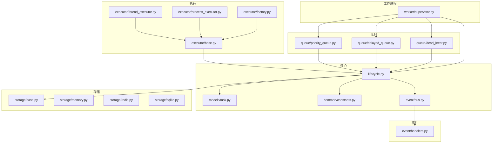
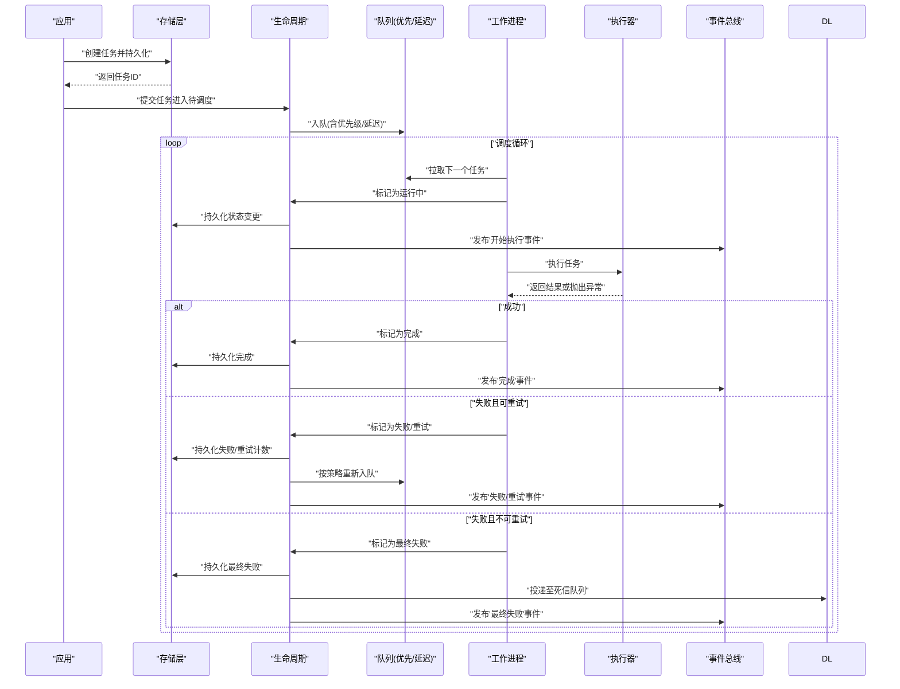
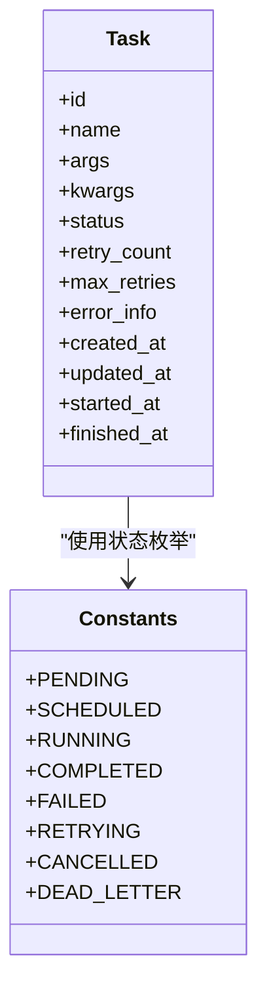
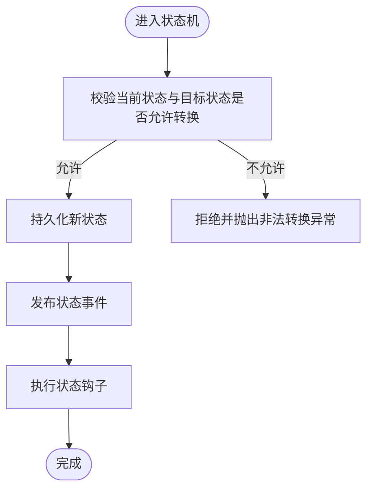
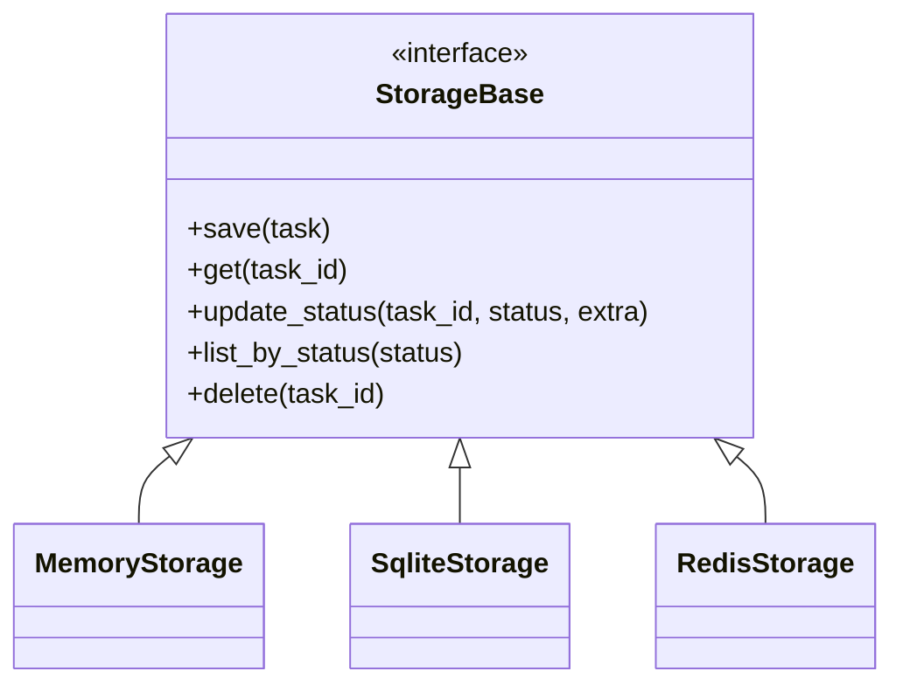
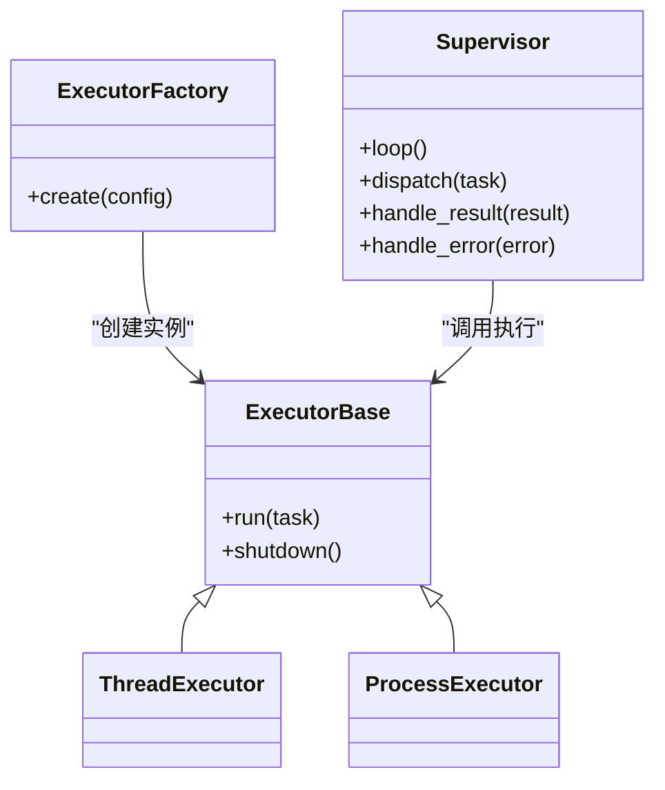
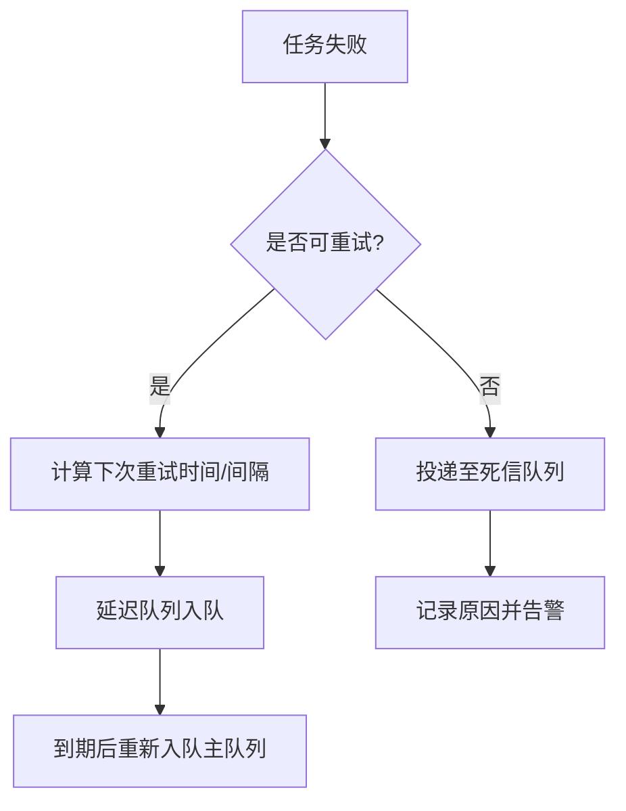
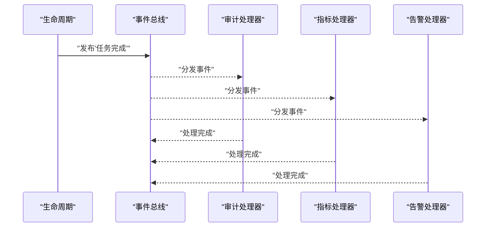
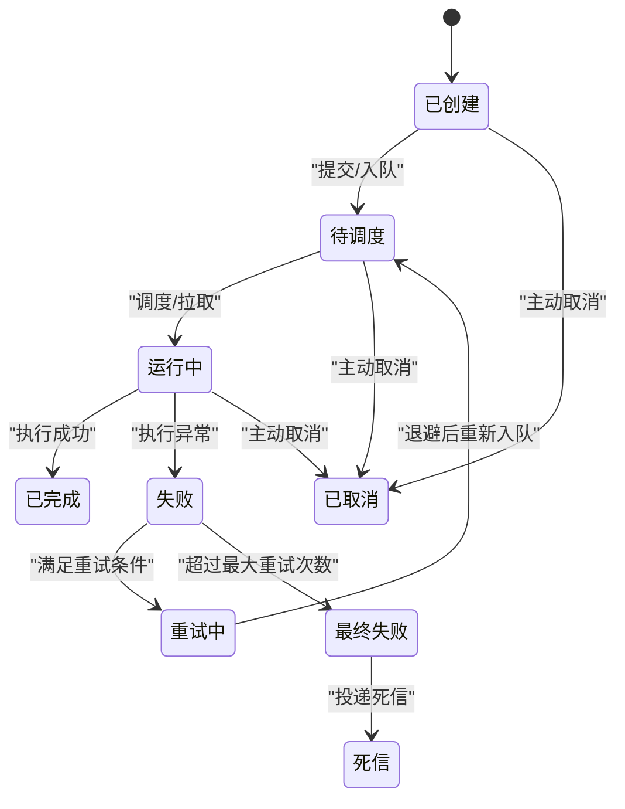
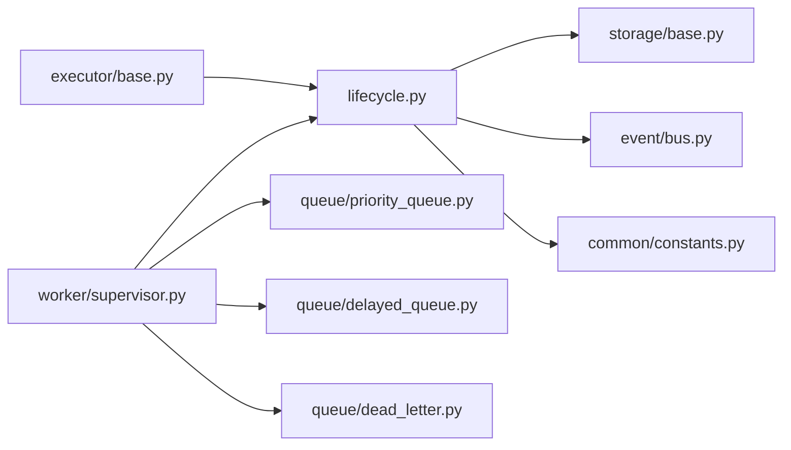

# 任务生命周期管理

<cite>
**本文引用的文件**   
- [src/neotask/core/lifecycle.py](file://src/neotask/core/lifecycle.py)
- [src/neotask/models/task.py](file://src/neotask/models/task.py)
- [src/neotask/storage/base.py](file://src/neotask/storage/base.py)
- [src/neotask/storage/memory.py](file://src/neotask/storage/memory.py)
- [src/neotask/storage/redis.py](file://src/neotask/storage/redis.py)
- [src/neotask/storage/sqlite.py](file://src/neotask/storage/sqlite.py)
- [src/neotask/executor/base.py](file://src/neotask/executor/base.py)
- [src/neotask/executor/thread_executor.py](file://src/neotask/executor/thread_executor.py)
- [src/neotask/executor/process_executor.py](file://src/neotask/executor/process_executor.py)
- [src/neotask/executor/factory.py](file://src/neotask/executor/factory.py)
- [src/neotask/queue/priority_queue.py](file://src/neotask/queue/priority_queue.py)
- [src/neotask/queue/delayed_queue.py](file://src/neotask/queue/delayed_queue.py)
- [src/neotask/queue/dead_letter.py](file://src/neotask/queue/dead_letter.py)
- [src/neotask/worker/supervisor.py](file://src/neotask/worker/supervisor.py)
- [src/neotask/event/bus.py](file://src/neotask/event/bus.py)
- [src/neotask/event/handlers.py](file://src/neotask/event/handlers.py)
- [src/neotask/common/constants.py](file://src/neotask/common/constants.py)
- [src/neotask/common/exceptions.py](file://src/neotask/common/exceptions.py)
- [examples/09_retry_and_cancel.py](file://examples/09_retry_and_cancel.py)
- [tests/unit/test_task_lifecycle.py](file://tests/unit/test_task_lifecycle.py)
</cite>

## 目录
1. [简介](#简介)
2. [项目结构](#项目结构)
3. [核心组件](#核心组件)
4. [架构总览](#架构总览)
5. [详细组件分析](#详细组件分析)
6. [依赖关系分析](#依赖关系分析)
7. [性能考量](#性能考量)
8. [故障排查指南](#故障排查指南)
9. [结论](#结论)
10. [附录](#附录)

## 简介
本文件围绕“任务生命周期管理”的核心概念与实现机制展开，系统阐述任务的完整生命周期状态转换（创建、调度、执行、完成、失败、重试等），明确每个状态的含义、触发条件与转换规则；通过状态图展示流转过程；解释状态持久化机制、状态恢复策略与异常处理流程；并提供监控与调试方法以及监听和处理任务状态变化的实践路径。

## 项目结构
本项目采用分层与模块化组织方式：
- 核心层：定义任务模型、生命周期状态机、事件总线等
- 存储层：提供内存、SQLite、Redis 等多种持久化后端
- 执行层：线程/进程执行器抽象与工厂
- 队列层：优先级队列、延迟队列、死信队列
- 工作进程：任务分发与回收、心跳与看门狗
- 事件与监控：事件总线、指标采集与健康检查
- Web 与 CLI：可视化与命令行工具

图表来源
- [src/neotask/core/lifecycle.py](file://src/neotask/core/lifecycle.py)
- [src/neotask/models/task.py](file://src/neotask/models/task.py)
- [src/neotask/common/constants.py](file://src/neotask/common/constants.py)
- [src/neotask/storage/base.py](file://src/neotask/storage/base.py)
- [src/neotask/storage/memory.py](file://src/neotask/storage/memory.py)
- [src/neotask/storage/redis.py](file://src/neotask/storage/redis.py)
- [src/neotask/storage/sqlite.py](file://src/neotask/storage/sqlite.py)
- [src/neotask/executor/base.py](file://src/neotask/executor/base.py)
- [src/neotask/executor/thread_executor.py](file://src/neotask/executor/thread_executor.py)
- [src/neotask/executor/process_executor.py](file://src/neotask/executor/process_executor.py)
- [src/neotask/executor/factory.py](file://src/neotask/executor/factory.py)
- [src/neotask/queue/priority_queue.py](file://src/neotask/queue/priority_queue.py)
- [src/neotask/queue/delayed_queue.py](file://src/neotask/queue/delayed_queue.py)
- [src/neotask/queue/dead_letter.py](file://src/neotask/queue/dead_letter.py)
- [src/neotask/worker/supervisor.py](file://src/neotask/worker/supervisor.py)
- [src/neotask/event/bus.py](file://src/neotask/event/bus.py)
- [src/neotask/event/handlers.py](file://src/neotask/event/handlers.py)

章节来源
- [src/neotask/core/lifecycle.py](file://src/neotask/core/lifecycle.py)
- [src/neotask/models/task.py](file://src/neotask/models/task.py)
- [src/neotask/common/constants.py](file://src/neotask/common/constants.py)
- [src/neotask/storage/base.py](file://src/neotask/storage/base.py)
- [src/neotask/executor/base.py](file://src/neotask/executor/base.py)
- [src/neotask/queue/priority_queue.py](file://src/neotask/queue/priority_queue.py)
- [src/neotask/queue/delayed_queue.py](file://src/neotask/queue/delayed_queue.py)
- [src/neotask/queue/dead_letter.py](file://src/neotask/queue/dead_letter.py)
- [src/neotask/worker/supervisor.py](file://src/neotask/worker/supervisor.py)
- [src/neotask/event/bus.py](file://src/neotask/event/bus.py)
- [src/neotask/event/handlers.py](file://src/neotask/event/handlers.py)

## 核心组件
- 任务模型与常量：定义任务实体结构与状态枚举，作为生命周期状态机的输入与输出载体
- 生命周期状态机：封装状态定义、转换规则、钩子与事件发布
- 存储接口与实现：统一状态持久化契约，提供内存、SQLite、Redis 三种后端
- 执行器抽象与工厂：统一任务执行入口，屏蔽线程/进程差异
- 队列组件：优先级队列、延迟队列、死信队列，支撑调度与重试
- 工作进程协调器：负责从队列拉取任务、驱动执行器、处理结果与异常
- 事件总线与处理器：贯穿全生命周期的事件通知与扩展点

章节来源
- [src/neotask/models/task.py](file://src/neotask/models/task.py)
- [src/neotask/common/constants.py](file://src/neotask/common/constants.py)
- [src/neotask/core/lifecycle.py](file://src/neotask/core/lifecycle.py)
- [src/neotask/storage/base.py](file://src/neotask/storage/base.py)
- [src/neotask/executor/base.py](file://src/neotask/executor/base.py)
- [src/neotask/queue/priority_queue.py](file://src/neotask/queue/priority_queue.py)
- [src/neotask/queue/delayed_queue.py](file://src/neotask/queue/delayed_queue.py)
- [src/neotask/queue/dead_letter.py](file://src/neotask/queue/dead_letter.py)
- [src/neotask/worker/supervisor.py](file://src/neotask/worker/supervisor.py)
- [src/neotask/event/bus.py](file://src/neotask/event/bus.py)

## 架构总览
下图展示了任务从创建到终态的端到端流转，包括调度、执行、重试与失败处理的关键节点。

图表来源
- [src/neotask/core/lifecycle.py](file://src/neotask/core/lifecycle.py)
- [src/neotask/storage/base.py](file://src/neotask/storage/base.py)
- [src/neotask/queue/priority_queue.py](file://src/neotask/queue/priority_queue.py)
- [src/neotask/queue/delayed_queue.py](file://src/neotask/queue/delayed_queue.py)
- [src/neotask/queue/dead_letter.py](file://src/neotask/queue/dead_letter.py)
- [src/neotask/worker/supervisor.py](file://src/neotask/worker/supervisor.py)
- [src/neotask/executor/base.py](file://src/neotask/executor/base.py)
- [src/neotask/event/bus.py](file://src/neotask/event/bus.py)

## 详细组件分析

### 任务模型与状态常量
- 任务模型承载任务元数据、执行上下文、重试次数、错误信息、时间戳等
- 状态常量集中定义所有合法状态值，供状态机校验与持久化使用

图表来源
- [src/neotask/models/task.py](file://src/neotask/models/task.py)
- [src/neotask/common/constants.py](file://src/neotask/common/constants.py)

章节来源
- [src/neotask/models/task.py](file://src/neotask/models/task.py)
- [src/neotask/common/constants.py](file://src/neotask/common/constants.py)

### 生命周期状态机
- 职责：维护任务状态转换表、校验转换合法性、触发持久化与事件
- 关键能力：
  - 状态定义与校验：仅允许在预定义的转换表中移动
  - 钩子与回调：在进入/离开某状态时调用用户自定义逻辑
  - 事件发布：将状态变化广播给订阅者（监控、审计、告警）
  - 幂等性：同一转换多次触发不产生副作用

图表来源
- [src/neotask/core/lifecycle.py](file://src/neotask/core/lifecycle.py)
- [src/neotask/common/exceptions.py](file://src/neotask/common/exceptions.py)

章节来源
- [src/neotask/core/lifecycle.py](file://src/neotask/core/lifecycle.py)
- [src/neotask/common/exceptions.py](file://src/neotask/common/exceptions.py)

### 状态持久化与恢复
- 存储接口：定义统一的读写、事务与查询契约
- 内存实现：适合测试与单进程场景
- SQLite 实现：轻量级单机持久化
- Redis 实现：分布式共享状态与高并发写入

图表来源
- [src/neotask/storage/base.py](file://src/neotask/storage/base.py)
- [src/neotask/storage/memory.py](file://src/neotask/storage/memory.py)
- [src/neotask/storage/sqlite.py](file://src/neotask/storage/sqlite.py)
- [src/neotask/storage/redis.py](file://src/neotask/storage/redis.py)

章节来源
- [src/neotask/storage/base.py](file://src/neotask/storage/base.py)
- [src/neotask/storage/memory.py](file://src/neotask/storage/memory.py)
- [src/neotask/storage/sqlite.py](file://src/neotask/storage/sqlite.py)
- [src/neotask/storage/redis.py](file://src/neotask/storage/redis.py)

### 执行器与工作进程协作
- 执行器抽象：统一 run 接口，屏蔽线程/进程差异
- 线程执行器：适用于 I/O 密集型任务
- 进程执行器：适用于 CPU 密集型任务
- 工厂：根据配置选择具体执行器
- 工作进程：从队列拉取任务，驱动执行器，处理结果与异常，驱动状态机

图表来源
- [src/neotask/executor/base.py](file://src/neotask/executor/base.py)
- [src/neotask/executor/thread_executor.py](file://src/neotask/executor/thread_executor.py)
- [src/neotask/executor/process_executor.py](file://src/neotask/executor/process_executor.py)
- [src/neotask/executor/factory.py](file://src/neotask/executor/factory.py)
- [src/neotask/worker/supervisor.py](file://src/neotask/worker/supervisor.py)

章节来源
- [src/neotask/executor/base.py](file://src/neotask/executor/base.py)
- [src/neotask/executor/thread_executor.py](file://src/neotask/executor/thread_executor.py)
- [src/neotask/executor/process_executor.py](file://src/neotask/executor/process_executor.py)
- [src/neotask/executor/factory.py](file://src/neotask/executor/factory.py)
- [src/neotask/worker/supervisor.py](file://src/neotask/worker/supervisor.py)

### 队列与重试/死信
- 优先级队列：按优先级出队，保障重要任务优先执行
- 延迟队列：支持延时入队，用于定时/退避重试
- 死信队列：不可重试的最终失败任务归档，便于人工干预

图表来源
- [src/neotask/queue/priority_queue.py](file://src/neotask/queue/priority_queue.py)
- [src/neotask/queue/delayed_queue.py](file://src/neotask/queue/delayed_queue.py)
- [src/neotask/queue/dead_letter.py](file://src/neotask/queue/dead_letter.py)

章节来源
- [src/neotask/queue/priority_queue.py](file://src/neotask/queue/priority_queue.py)
- [src/neotask/queue/delayed_queue.py](file://src/neotask/queue/delayed_queue.py)
- [src/neotask/queue/dead_letter.py](file://src/neotask/queue/dead_letter.py)

### 事件总线与状态监听
- 事件总线：提供发布/订阅机制，解耦状态变化与消费逻辑
- 处理器：对特定事件进行审计、指标上报、告警等
- 典型事件：任务开始、完成、失败、重试、进入死信等

图表来源
- [src/neotask/event/bus.py](file://src/neotask/event/bus.py)
- [src/neotask/event/handlers.py](file://src/neotask/event/handlers.py)

章节来源
- [src/neotask/event/bus.py](file://src/neotask/event/bus.py)
- [src/neotask/event/handlers.py](file://src/neotask/event/handlers.py)

### 状态图：任务生命周期

图表来源
- [src/neotask/core/lifecycle.py](file://src/neotask/core/lifecycle.py)
- [src/neotask/common/constants.py](file://src/neotask/common/constants.py)
- [src/neotask/queue/dead_letter.py](file://src/neotask/queue/dead_letter.py)

## 依赖关系分析
- 低耦合：生命周期只依赖存储接口与事件总线，不直接感知执行细节
- 高内聚：执行器内部封装线程/进程差异，对外暴露统一接口
- 可扩展：新增存储后端、执行器、队列类型只需实现对应接口
- 潜在环依赖：避免在生命周期中直接引用具体执行器，保持单向依赖

图表来源
- [src/neotask/core/lifecycle.py](file://src/neotask/core/lifecycle.py)
- [src/neotask/storage/base.py](file://src/neotask/storage/base.py)
- [src/neotask/event/bus.py](file://src/neotask/event/bus.py)
- [src/neotask/common/constants.py](file://src/neotask/common/constants.py)
- [src/neotask/executor/base.py](file://src/neotask/executor/base.py)
- [src/neotask/worker/supervisor.py](file://src/neotask/worker/supervisor.py)
- [src/neotask/queue/priority_queue.py](file://src/neotask/queue/priority_queue.py)
- [src/neotask/queue/delayed_queue.py](file://src/neotask/queue/delayed_queue.py)
- [src/neotask/queue/dead_letter.py](file://src/neotask/queue/dead_letter.py)

章节来源
- [src/neotask/core/lifecycle.py](file://src/neotask/core/lifecycle.py)
- [src/neotask/storage/base.py](file://src/neotask/storage/base.py)
- [src/neotask/event/bus.py](file://src/neotask/event/bus.py)
- [src/neotask/executor/base.py](file://src/neotask/executor/base.py)
- [src/neotask/worker/supervisor.py](file://src/neotask/worker/supervisor.py)
- [src/neotask/queue/priority_queue.py](file://src/neotask/queue/priority_queue.py)
- [src/neotask/queue/delayed_queue.py](file://src/neotask/queue/delayed_queue.py)
- [src/neotask/queue/dead_letter.py](file://src/neotask/queue/dead_letter.py)

## 性能考量
- 批量持久化：在高吞吐场景下合并状态更新，减少 IO 次数
- 无锁队列：优先使用无锁数据结构提升并发性能
- 延迟队列优化：基于时间轮或堆结构降低到期扫描成本
- 执行器选择：CPU 密集用进程执行器，I/O 密集用线程执行器
- 背压与限流：结合队列容量与消费者数量控制整体吞吐
- 监控采样：对关键路径打点统计，避免过度日志影响性能

[本节为通用指导，无需代码来源]

## 故障排查指南
- 常见异常
  - 非法状态转换：检查状态机转换表与前置条件
  - 持久化失败：确认存储后端连接与权限
  - 执行超时/中断：检查执行器资源与任务耗时
  - 重试风暴：调整退避策略与最大重试次数
- 定位手段
  - 事件追踪：订阅任务事件，串联请求链路
  - 指标观测：关注失败率、重试率、平均耗时、队列积压
  - 死信查看：定位不可重试任务的原因与上下文
  - 日志关联：以任务 ID 为维度聚合日志
- 恢复策略
  - 断点续跑：从最近一次成功状态继续
  - 补偿任务：对部分成功的批任务生成补偿
  - 人工介入：对死信任务进行修复与重放

章节来源
- [src/neotask/common/exceptions.py](file://src/neotask/common/exceptions.py)
- [src/neotask/queue/dead_letter.py](file://src/neotask/queue/dead_letter.py)
- [src/neotask/event/handlers.py](file://src/neotask/event/handlers.py)

## 结论
通过清晰的状态机、统一的存储接口、可扩展的执行器与队列组件，以及完善的事件与监控体系，本系统实现了健壮的任务生命周期管理。借助事件总线与指标采集，可在复杂生产环境中高效定位问题并快速恢复。

[本节为总结，无需代码来源]

## 附录

### 状态转换规则与触发条件
- 已创建 → 待调度：任务提交并成功入队
- 待调度 → 运行中：工作进程拉取并锁定任务
- 运行中 → 已完成：执行器返回成功
- 运行中 → 失败：执行器抛出异常
- 失败 → 重试中：未超过最大重试次数且满足重试条件
- 重试中 → 待调度：退避完成后重新入队
- 失败 → 最终失败：超过最大重试次数或不可重试
- 最终失败 → 死信：投递至死信队列
- 任意阶段 → 已取消：被外部主动取消

章节来源
- [src/neotask/core/lifecycle.py](file://src/neotask/core/lifecycle.py)
- [src/neotask/common/constants.py](file://src/neotask/common/constants.py)

### 示例：监听与处理任务状态变化
- 参考示例脚本：演示如何注册事件处理器，捕获任务开始、完成、失败、重试与死信事件，并进行日志记录与告警
- 单元测试：覆盖状态机转换、持久化一致性、事件分发与异常路径

章节来源
- [examples/09_retry_and_cancel.py](file://examples/09_retry_and_cancel.py)
- [tests/unit/test_task_lifecycle.py](file://tests/unit/test_task_lifecycle.py)