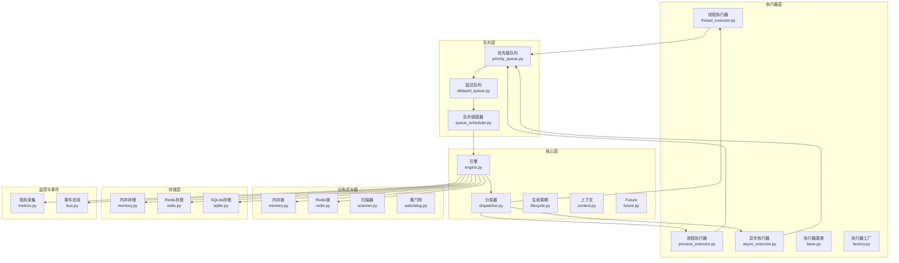
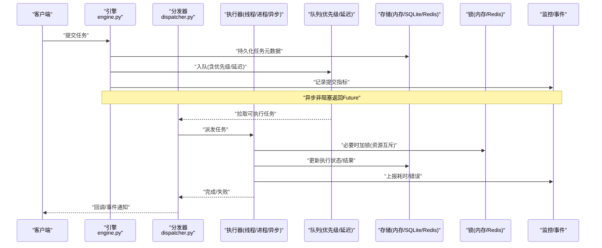
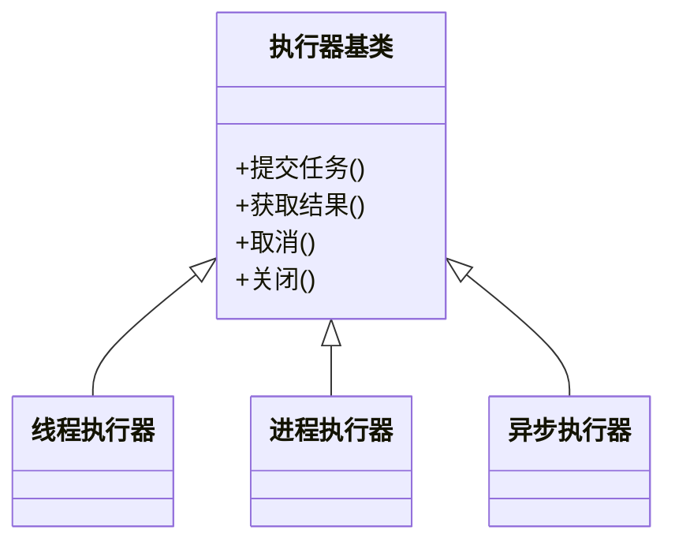
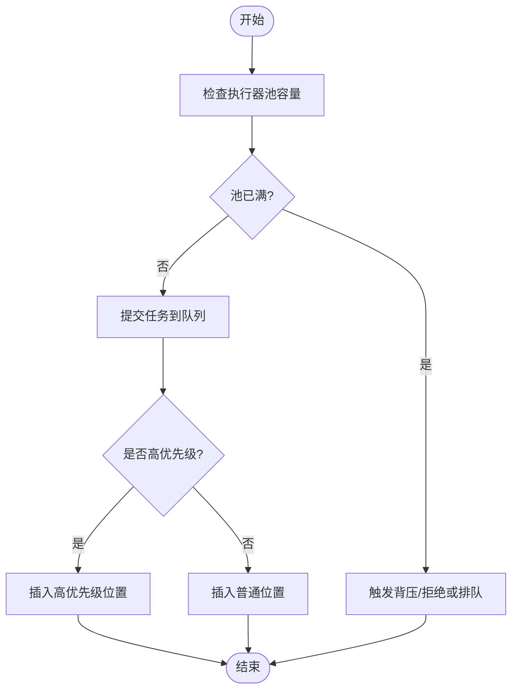
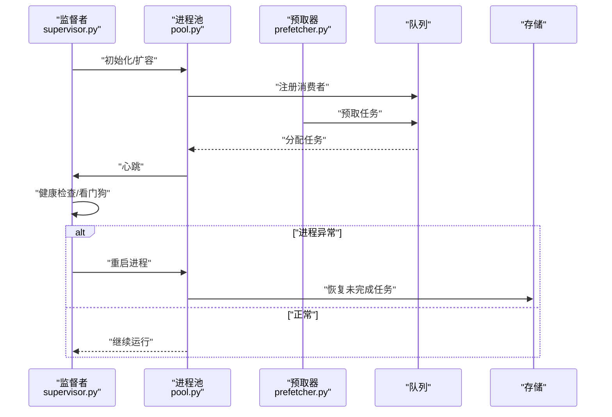
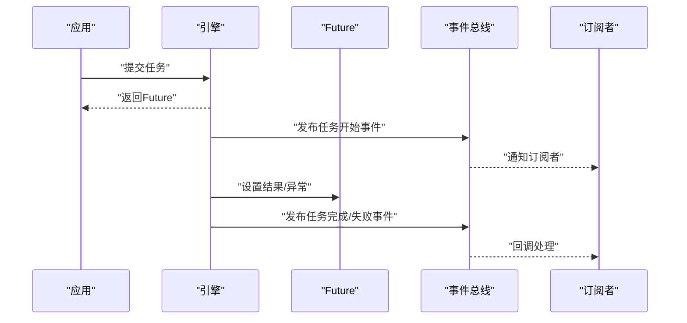
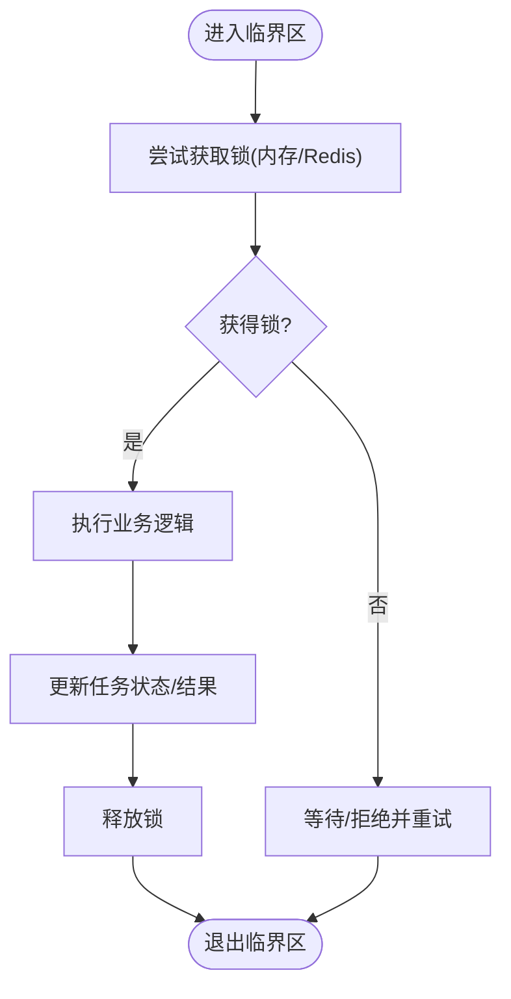
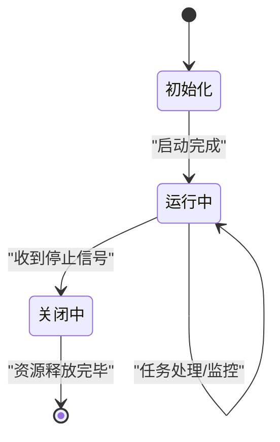
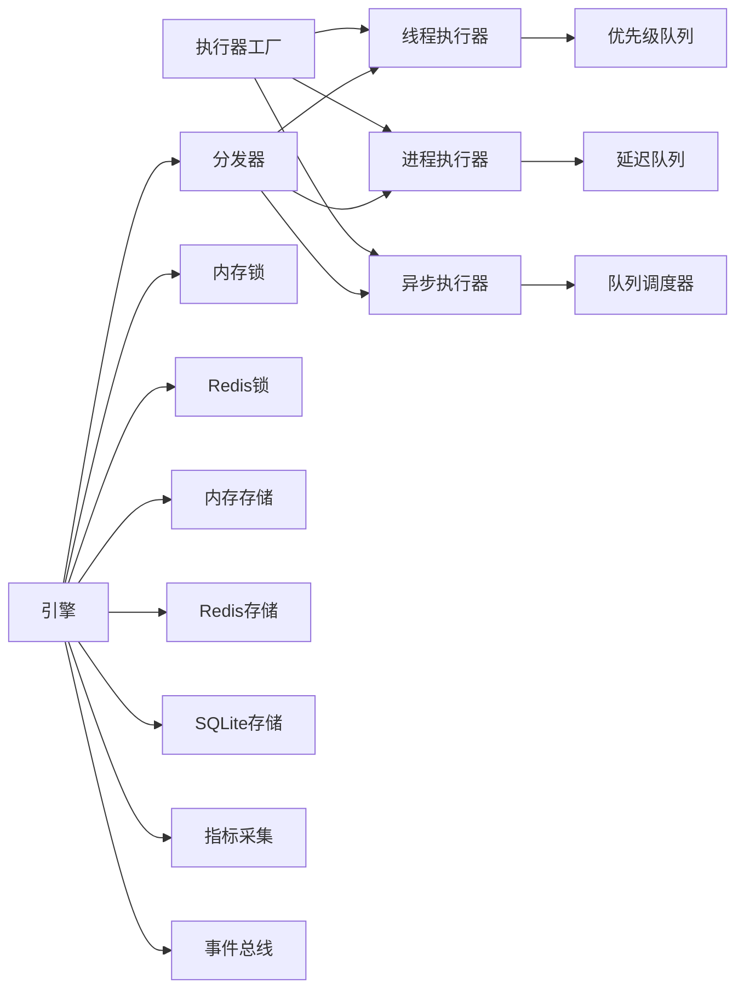

# 并发模型设计

<cite>
**本文引用的文件**   
- [src/neotask/executor/thread_executor.py](file://src/neotask/executor/thread_executor.py)
- [src/neotask/executor/process_executor.py](file://src/neotask/executor/process_executor.py)
- [src/neotask/executor/async_executor.py](file://src/neotask/executor/async_executor.py)
- [src/neotask/executor/base.py](file://src/neotask/executor/base.py)
- [src/neotask/executor/factory.py](file://src/neotask/executor/factory.py)
- [src/neotask/core/engine.py](file://src/neotask/core/engine.py)
- [src/neotask/core/dispatcher.py](file://src/neotask/core/dispatcher.py)
- [src/neotask/core/lifecycle.py](file://src/neotask/core/lifecycle.py)
- [src/neotask/core/context.py](file://src/neotask/core/context.py)
- [src/neotask/core/future.py](file://src/neotask/core/future.py)
- [src/neotask/worker/pool.py](file://src/neotask/worker/pool.py)
- [src/neotask/worker/supervisor.py](file://src/neotask/worker/supervisor.py)
- [src/neotask/worker/prefetcher.py](file://src/neotask/worker/prefetcher.py)
- [src/neotask/queue/priority_queue.py](file://src/neotask/queue/priority_queue.py)
- [src/neotask/queue/delayed_queue.py](file://src/neotask/queue/delayed_queue.py)
- [src/neotask/queue/queue_scheduler.py](file://src/neotask/queue/queue_scheduler.py)
- [src/neotask/lock/memory.py](file://src/neotask/lock/memory.py)
- [src/neotask/lock/redis.py](file://src/neotask/lock/redis.py)
- [src/neotask/lock/scanner.py](file://src/neotask/lock/scanner.py)
- [src/neotask/lock/watchdog.py](file://src/neotask/lock/watchdog.py)
- [src/neotask/storage/memory.py](file://src/neotask/storage/memory.py)
- [src/neotask/storage/redis.py](file://src/neotask/storage/redis.py)
- [src/neotask/storage/sqlite.py](file://src/neotask/storage/sqlite.py)
- [src/neotask/models/task.py](file://src/neotask/models/task.py)
- [src/neotask/models/config.py](file://src/neotask/models/config.py)
- [src/neotask/common/constants.py](file://src/neotask/common/constants.py)
- [src/neotask/common/logger.py](file://src/neotask/common/logger.py)
- [src/neotask/event/bus.py](file://src/neotask/event/bus.py)
- [src/neotask/monitor/metrics.py](file://src/neotask/monitor/metrics.py)
</cite>

## 目录
1. [引言](#引言)
2. [项目结构](#项目结构)
3. [核心组件](#核心组件)
4. [架构总览](#架构总览)
5. [详细组件分析](#详细组件分析)
6. [依赖关系分析](#依赖关系分析)
7. [性能考量](#性能考量)
8. [故障排查指南](#故障排查指南)
9. [结论](#结论)
10. [附录](#附录)

## 引言
本文件围绕任务调度管理系统的并发模型设计与实现策略进行深入分析，覆盖多线程、多进程与异步IO的适用场景与性能特征；阐述任务并行度控制、资源隔离、负载均衡等关键机制；解释工作进程池的管理策略（创建、销毁、健康检查与故障恢复）；说明异步任务处理流程与回调机制；总结并发安全保证措施（锁、原子操作、数据一致性）；并提供调优实践与常见问题解决方案。

## 项目结构
系统采用分层与模块化组织：执行器层提供线程、进程与异步三种执行模型；队列层负责任务入队、优先级与延迟调度；锁与存储层提供并发安全与持久化；核心引擎协调生命周期、分发与上下文；监控与事件总线贯穿全链路。

图表来源
- [src/neotask/core/engine.py](file://src/neotask/core/engine.py)
- [src/neotask/core/dispatcher.py](file://src/neotask/core/dispatcher.py)
- [src/neotask/executor/thread_executor.py](file://src/neotask/executor/thread_executor.py)
- [src/neotask/executor/process_executor.py](file://src/neotask/executor/process_executor.py)
- [src/neotask/executor/async_executor.py](file://src/neotask/executor/async_executor.py)
- [src/neotask/queue/priority_queue.py](file://src/neotask/queue/priority_queue.py)
- [src/neotask/queue/delayed_queue.py](file://src/neotask/queue/delayed_queue.py)
- [src/neotask/queue/queue_scheduler.py](file://src/neotask/queue/queue_scheduler.py)
- [src/neotask/lock/memory.py](file://src/neotask/lock/memory.py)
- [src/neotask/lock/redis.py](file://src/neotask/lock/redis.py)
- [src/neotask/storage/memory.py](file://src/neotask/storage/memory.py)
- [src/neotask/storage/redis.py](file://src/neotask/storage/redis.py)
- [src/neotask/storage/sqlite.py](file://src/neotask/storage/sqlite.py)
- [src/neotask/monitor/metrics.py](file://src/neotask/monitor/metrics.py)
- [src/neotask/event/bus.py](file://src/neotask/event/bus.py)

章节来源
- [src/neotask/core/engine.py](file://src/neotask/core/engine.py)
- [src/neotask/core/dispatcher.py](file://src/neotask/core/dispatcher.py)
- [src/neotask/executor/base.py](file://src/neotask/executor/base.py)
- [src/neotask/executor/factory.py](file://src/neotask/executor/factory.py)
- [src/neotask/queue/priority_queue.py](file://src/neotask/queue/priority_queue.py)
- [src/neotask/queue/delayed_queue.py](file://src/neotask/queue/delayed_queue.py)
- [src/neotask/queue/queue_scheduler.py](file://src/neotask/queue/queue_scheduler.py)
- [src/neotask/lock/memory.py](file://src/neotask/lock/memory.py)
- [src/neotask/lock/redis.py](file://src/neotask/lock/redis.py)
- [src/neotask/storage/memory.py](file://src/neotask/storage/memory.py)
- [src/neotask/storage/redis.py](file://src/neotask/storage/redis.py)
- [src/neotask/storage/sqlite.py](file://src/neotask/storage/sqlite.py)
- [src/neotask/monitor/metrics.py](file://src/neotask/monitor/metrics.py)
- [src/neotask/event/bus.py](file://src/neotask/event/bus.py)

## 核心组件
- 执行器抽象与工厂
  - 统一接口：提交任务、获取结果、取消、状态查询、优雅关闭。
  - 工厂根据配置选择线程、进程或异步执行器，便于横向扩展。
- 线程执行器
  - 基于线程池，适合I/O密集型与轻量CPU任务；受GIL限制，纯CPU密集场景收益有限。
- 进程执行器
  - 基于进程池，天然跨GIL，适合CPU密集与需要强资源隔离的任务；进程间通信开销较高。
- 异步执行器
  - 基于事件循环与协程，适合高并发I/O任务；单进程内吞吐高，但需避免阻塞调用。
- 队列与调度
  - 优先级队列保障重要任务优先执行；延迟队列支持定时与重试；队列调度器驱动消费。
- 锁与看门狗
  - 内存锁用于单机内互斥；Redis锁用于分布式互斥；扫描器与看门狗保障锁释放与僵尸检测。
- 存储后端
  - 内存、SQLite、Redis三种存储，分别适用于单机快速验证、本地持久化与分布式共享。
- 监控与事件
  - 指标采集覆盖吞吐、延迟、错误率；事件总线解耦各子系统通知。

章节来源
- [src/neotask/executor/base.py](file://src/neotask/executor/base.py)
- [src/neotask/executor/factory.py](file://src/neotask/executor/factory.py)
- [src/neotask/executor/thread_executor.py](file://src/neotask/executor/thread_executor.py)
- [src/neotask/executor/process_executor.py](file://src/neotask/executor/process_executor.py)
- [src/neotask/executor/async_executor.py](file://src/neotask/executor/async_executor.py)
- [src/neotask/queue/priority_queue.py](file://src/neotask/queue/priority_queue.py)
- [src/neotask/queue/delayed_queue.py](file://src/neotask/queue/delayed_queue.py)
- [src/neotask/queue/queue_scheduler.py](file://src/neotask/queue/queue_scheduler.py)
- [src/neotask/lock/memory.py](file://src/neotask/lock/memory.py)
- [src/neotask/lock/redis.py](file://src/neotask/lock/redis.py)
- [src/neotask/lock/scanner.py](file://src/neotask/lock/scanner.py)
- [src/neotask/lock/watchdog.py](file://src/neotask/lock/watchdog.py)
- [src/neotask/storage/memory.py](file://src/neotask/storage/memory.py)
- [src/neotask/storage/redis.py](file://src/neotask/storage/redis.py)
- [src/neotask/storage/sqlite.py](file://src/neotask/storage/sqlite.py)
- [src/neotask/monitor/metrics.py](file://src/neotask/monitor/metrics.py)
- [src/neotask/event/bus.py](file://src/neotask/event/bus.py)

## 架构总览
下图展示从任务提交到执行、落盘与监控的全链路并发路径。

图表来源
- [src/neotask/core/engine.py](file://src/neotask/core/engine.py)
- [src/neotask/core/dispatcher.py](file://src/neotask/core/dispatcher.py)
- [src/neotask/executor/thread_executor.py](file://src/neotask/executor/thread_executor.py)
- [src/neotask/executor/process_executor.py](file://src/neotask/executor/process_executor.py)
- [src/neotask/executor/async_executor.py](file://src/neotask/executor/async_executor.py)
- [src/neotask/queue/priority_queue.py](file://src/neotask/queue/priority_queue.py)
- [src/neotask/queue/delayed_queue.py](file://src/neotask/queue/delayed_queue.py)
- [src/neotask/storage/memory.py](file://src/neotask/storage/memory.py)
- [src/neotask/storage/redis.py](file://src/neotask/storage/redis.py)
- [src/neotask/storage/sqlite.py](file://src/neotask/storage/sqlite.py)
- [src/neotask/lock/memory.py](file://src/neotask/lock/memory.py)
- [src/neotask/lock/redis.py](file://src/neotask/lock/redis.py)
- [src/neotask/monitor/metrics.py](file://src/neotask/monitor/metrics.py)
- [src/neotask/event/bus.py](file://src/neotask/event/bus.py)

## 详细组件分析

### 执行器模型与并发策略
- 线程执行器
  - 适用：I/O密集、轻量CPU任务；低启动开销，上下文切换成本低。
  - 并发控制：通过线程池大小限制最大并行度；结合队列背压避免过载。
  - 风险：GIL导致CPU密集无法线性加速；需避免阻塞式I/O。
- 进程执行器
  - 适用：CPU密集、强隔离需求；跨GIL利用多核。
  - 并发控制：进程池规模按CPU核数与任务特性调节；IPC开销需评估。
  - 风险：进程崩溃需自愈；序列化/反序列化成本。
- 异步执行器
  - 适用：高并发I/O；事件循环内大量协程协作。
  - 并发控制：协程数量与事件循环容量；避免阻塞调用破坏公平性。
  - 风险：长阻塞会饿死其他协程；需使用非阻塞库。

图表来源
- [src/neotask/executor/base.py](file://src/neotask/executor/base.py)
- [src/neotask/executor/thread_executor.py](file://src/neotask/executor/thread_executor.py)
- [src/neotask/executor/process_executor.py](file://src/neotask/executor/process_executor.py)
- [src/neotask/executor/async_executor.py](file://src/neotask/executor/async_executor.py)

章节来源
- [src/neotask/executor/base.py](file://src/neotask/executor/base.py)
- [src/neotask/executor/thread_executor.py](file://src/neotask/executor/thread_executor.py)
- [src/neotask/executor/process_executor.py](file://src/neotask/executor/process_executor.py)
- [src/neotask/executor/async_executor.py](file://src/neotask/executor/async_executor.py)

### 任务并行度控制与负载均衡
- 并行度控制
  - 线程/进程池上限由配置决定；队列长度作为背压缓冲。
  - 动态扩缩容：依据队列积压、执行时延与错误率调整池大小。
- 负载均衡
  - 优先级队列确保高优任务先执行；延迟队列平滑突发流量。
  - 多节点下结合分片与协调器进行水平扩展（见分布式模块）。

图表来源
- [src/neotask/queue/priority_queue.py](file://src/neotask/queue/priority_queue.py)
- [src/neotask/queue/delayed_queue.py](file://src/neotask/queue/delayed_queue.py)
- [src/neotask/queue/queue_scheduler.py](file://src/neotask/queue/queue_scheduler.py)
- [src/neotask/executor/factory.py](file://src/neotask/executor/factory.py)

章节来源
- [src/neotask/queue/priority_queue.py](file://src/neotask/queue/priority_queue.py)
- [src/neotask/queue/delayed_queue.py](file://src/neotask/queue/delayed_queue.py)
- [src/neotask/queue/queue_scheduler.py](file://src/neotask/queue/queue_scheduler.py)
- [src/neotask/executor/factory.py](file://src/neotask/executor/factory.py)

### 工作进程池管理与健康检查
- 进程池管理
  - 创建：按需或预创建固定数量；回收空闲进程以节省资源。
  - 销毁：优雅关闭等待任务完成，超时强制终止。
- 健康检查与故障恢复
  - 心跳与看门狗检测僵尸进程；异常退出自动重启并迁移未完成任务。
  - 预取器在空闲时提前拉取任务，降低冷启动延迟。

图表来源
- [src/neotask/worker/pool.py](file://src/neotask/worker/pool.py)
- [src/neotask/worker/supervisor.py](file://src/neotask/worker/supervisor.py)
- [src/neotask/worker/prefetcher.py](file://src/neotask/worker/prefetcher.py)
- [src/neotask/queue/queue_scheduler.py](file://src/neotask/queue/queue_scheduler.py)
- [src/neotask/storage/memory.py](file://src/neotask/storage/memory.py)
- [src/neotask/storage/redis.py](file://src/neotask/storage/redis.py)

章节来源
- [src/neotask/worker/pool.py](file://src/neotask/worker/pool.py)
- [src/neotask/worker/supervisor.py](file://src/neotask/worker/supervisor.py)
- [src/neotask/worker/prefetcher.py](file://src/neotask/worker/prefetcher.py)

### 异步任务处理与回调机制
- Future与上下文
  - 任务提交后返回Future对象，支持结果获取、取消与超时。
  - 上下文传递执行环境信息（如追踪ID、租户标识），便于观测与路由。
- 回调与事件
  - 任务完成/失败触发事件总线，订阅者可执行日志、告警或后续编排。

图表来源
- [src/neotask/core/future.py](file://src/neotask/core/future.py)
- [src/neotask/core/context.py](file://src/neotask/core/context.py)
- [src/neotask/event/bus.py](file://src/neotask/event/bus.py)

章节来源
- [src/neotask/core/future.py](file://src/neotask/core/future.py)
- [src/neotask/core/context.py](file://src/neotask/core/context.py)
- [src/neotask/event/bus.py](file://src/neotask/event/bus.py)

### 并发安全与一致性保障
- 锁机制
  - 内存锁：单机内互斥，低延迟，进程边界外无效。
  - Redis锁：分布式互斥，需考虑网络抖动与过期策略。
- 扫描器与看门狗
  - 定期扫描长时间持有的锁，辅助清理僵尸持有者。
  - 看门狗监控关键组件存活，异常时触发恢复。
- 数据一致性
  - 任务状态变更与存储写入采用事务或幂等更新。
  - 重试与去重：基于唯一键与幂等语义避免重复执行。

图表来源
- [src/neotask/lock/memory.py](file://src/neotask/lock/memory.py)
- [src/neotask/lock/redis.py](file://src/neotask/lock/redis.py)
- [src/neotask/lock/scanner.py](file://src/neotask/lock/scanner.py)
- [src/neotask/lock/watchdog.py](file://src/neotask/lock/watchdog.py)
- [src/neotask/storage/memory.py](file://src/neotask/storage/memory.py)
- [src/neotask/storage/redis.py](file://src/neotask/storage/redis.py)
- [src/neotask/storage/sqlite.py](file://src/neotask/storage/sqlite.py)

章节来源
- [src/neotask/lock/memory.py](file://src/neotask/lock/memory.py)
- [src/neotask/lock/redis.py](file://src/neotask/lock/redis.py)
- [src/neotask/lock/scanner.py](file://src/neotask/lock/scanner.py)
- [src/neotask/lock/watchdog.py](file://src/neotask/lock/watchdog.py)
- [src/neotask/storage/memory.py](file://src/neotask/storage/memory.py)
- [src/neotask/storage/redis.py](file://src/neotask/storage/redis.py)
- [src/neotask/storage/sqlite.py](file://src/neotask/storage/sqlite.py)

### 生命周期与引擎协调
- 生命周期管理
  - 启动阶段：加载配置、初始化存储与锁、预热队列与执行器。
  - 运行阶段：分发任务、监控指标、处理事件。
  - 关闭阶段：优雅停止，等待任务完成，释放资源。
- 引擎职责
  - 协调分发器、执行器、队列与存储；暴露统一API供上层调用。

图表来源
- [src/neotask/core/lifecycle.py](file://src/neotask/core/lifecycle.py)
- [src/neotask/core/engine.py](file://src/neotask/core/engine.py)

章节来源
- [src/neotask/core/lifecycle.py](file://src/neotask/core/lifecycle.py)
- [src/neotask/core/engine.py](file://src/neotask/core/engine.py)

## 依赖关系分析
- 执行器依赖队列与存储，通过工厂选择具体实现。
- 分发器将任务派发到不同执行器，并回写状态至存储。
- 锁与看门狗为执行器与存储提供并发安全与健壮性。
- 监控与事件总线贯穿引擎与各组件，形成可观测闭环。

图表来源
- [src/neotask/executor/factory.py](file://src/neotask/executor/factory.py)
- [src/neotask/core/engine.py](file://src/neotask/core/engine.py)
- [src/neotask/core/dispatcher.py](file://src/neotask/core/dispatcher.py)
- [src/neotask/executor/thread_executor.py](file://src/neotask/executor/thread_executor.py)
- [src/neotask/executor/process_executor.py](file://src/neotask/executor/process_executor.py)
- [src/neotask/executor/async_executor.py](file://src/neotask/executor/async_executor.py)
- [src/neotask/queue/priority_queue.py](file://src/neotask/queue/priority_queue.py)
- [src/neotask/queue/delayed_queue.py](file://src/neotask/queue/delayed_queue.py)
- [src/neotask/queue/queue_scheduler.py](file://src/neotask/queue/queue_scheduler.py)
- [src/neotask/lock/memory.py](file://src/neotask/lock/memory.py)
- [src/neotask/lock/redis.py](file://src/neotask/lock/redis.py)
- [src/neotask/storage/memory.py](file://src/neotask/storage/memory.py)
- [src/neotask/storage/redis.py](file://src/neotask/storage/redis.py)
- [src/neotask/storage/sqlite.py](file://src/neotask/storage/sqlite.py)
- [src/neotask/monitor/metrics.py](file://src/neotask/monitor/metrics.py)
- [src/neotask/event/bus.py](file://src/neotask/event/bus.py)

章节来源
- [src/neotask/executor/factory.py](file://src/neotask/executor/factory.py)
- [src/neotask/core/engine.py](file://src/neotask/core/engine.py)
- [src/neotask/core/dispatcher.py](file://src/neotask/core/dispatcher.py)
- [src/neotask/executor/thread_executor.py](file://src/neotask/executor/thread_executor.py)
- [src/neotask/executor/process_executor.py](file://src/neotask/executor/process_executor.py)
- [src/neotask/executor/async_executor.py](file://src/neotask/executor/async_executor.py)
- [src/neotask/queue/priority_queue.py](file://src/neotask/queue/priority_queue.py)
- [src/neotask/queue/delayed_queue.py](file://src/neotask/queue/delayed_queue.py)
- [src/neotask/queue/queue_scheduler.py](file://src/neotask/queue/queue_scheduler.py)
- [src/neotask/lock/memory.py](file://src/neotask/lock/memory.py)
- [src/neotask/lock/redis.py](file://src/neotask/lock/redis.py)
- [src/neotask/storage/memory.py](file://src/neotask/storage/memory.py)
- [src/neotask/storage/redis.py](file://src/neotask/storage/redis.py)
- [src/neotask/storage/sqlite.py](file://src/neotask/storage/sqlite.py)
- [src/neotask/monitor/metrics.py](file://src/neotask/monitor/metrics.py)
- [src/neotask/event/bus.py](file://src/neotask/event/bus.py)

## 性能考量
- 模型选择
  - I/O密集：优先异步执行器或线程执行器；减少阻塞调用，提升事件循环利用率。
  - CPU密集：优先进程执行器，合理设置进程数接近物理核数；避免过多进程导致上下文切换。
- 并行度调优
  - 观察队列深度、P99延迟与错误率，动态调整池大小；对热点任务设置独立队列或分区。
- 背压与限流
  - 队列满时拒绝或降级；对上游限速，防止雪崩。
- 存储与锁
  - 高频写入选Redis或SQLite（单机）；分布式锁需设置合理TTL与续期策略。
- 监控与观测
  - 采集吞吐、延迟、错误率、锁竞争、GC与上下文切换指标，定位瓶颈。

[本节为通用指导，不直接分析具体文件]

## 故障排查指南
- 常见症状
  - 任务堆积：检查队列长度、执行器池容量、下游依赖延迟。
  - 任务重复执行：确认幂等性与去重键；检查锁是否被正确释放。
  - 进程频繁重启：查看心跳与健康检查日志，定位OOM或外部依赖异常。
- 定位步骤
  - 查看指标与事件：关注提交/完成/失败事件与对应耗时分布。
  - 检查锁竞争：统计锁等待时长与超时次数，识别热点资源。
  - 存储健康：确认连接池、慢查询与磁盘空间。
- 恢复策略
  - 自动重试与退避；失败任务转入死信队列以便人工干预。
  - 弹性扩缩容：根据负载曲线自动调整执行器规模。

章节来源
- [src/neotask/monitor/metrics.py](file://src/neotask/monitor/metrics.py)
- [src/neotask/event/bus.py](file://src/neotask/event/bus.py)
- [src/neotask/lock/scanner.py](file://src/neotask/lock/scanner.py)
- [src/neotask/lock/watchdog.py](file://src/neotask/lock/watchdog.py)
- [src/neotask/storage/redis.py](file://src/neotask/storage/redis.py)
- [src/neotask/storage/sqlite.py](file://src/neotask/storage/sqlite.py)

## 结论
系统通过统一的执行器抽象与工厂模式，灵活适配线程、进程与异步三种并发模型；以优先级与延迟队列实现精细化调度；借助锁、看门狗与存储层保障并发安全与一致性；配合监控与事件总线形成可观测闭环。生产环境中应依据任务特性选择合适的执行器与并行度，并结合背压、限流与弹性扩缩容策略，达到稳定高效的目标。

[本节为总结性内容，不直接分析具体文件]

## 附录
- 配置要点
  - 执行器池大小、队列容量、锁TTL、重试策略与超时参数需按业务负载与环境能力综合设定。
- 最佳实践
  - 任务幂等设计；短任务优先；避免在事件循环中执行阻塞操作；对热点资源加细粒度锁。

[本节为补充信息，不直接分析具体文件]