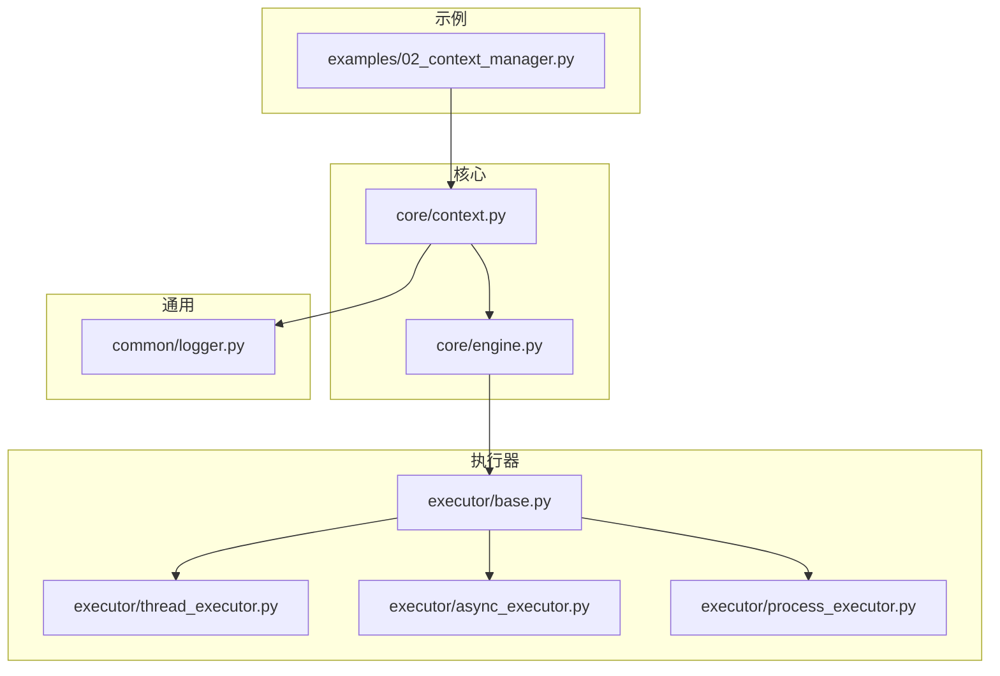
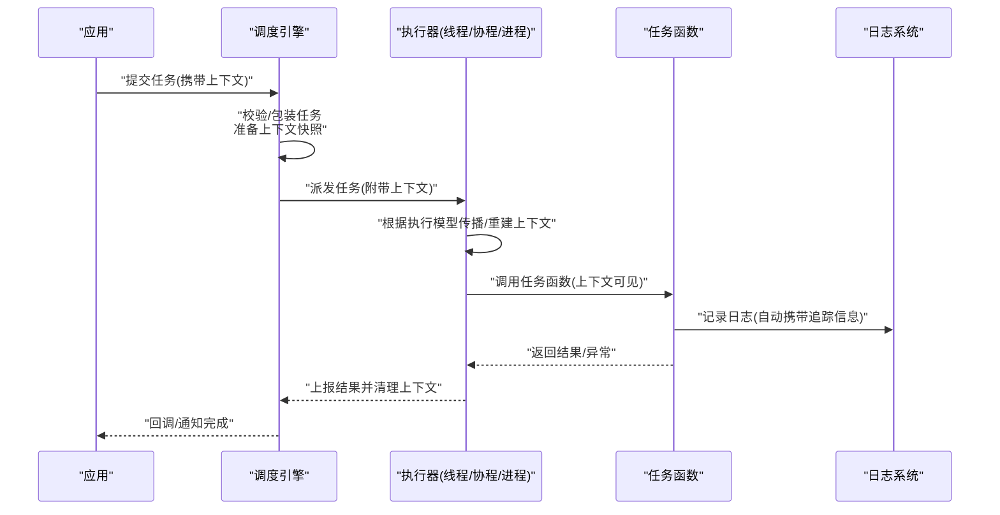
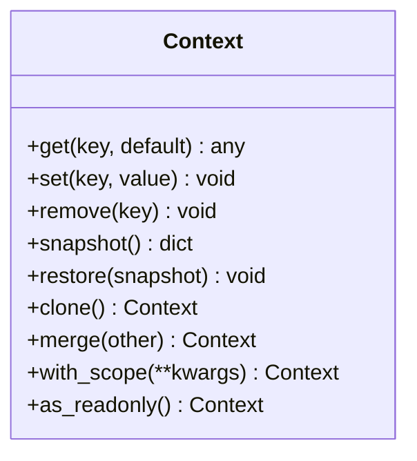
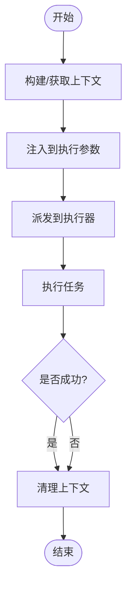
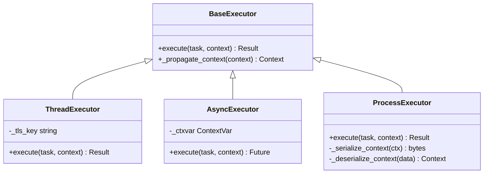
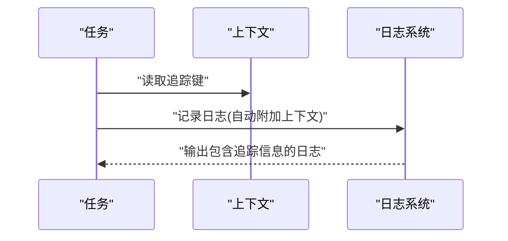
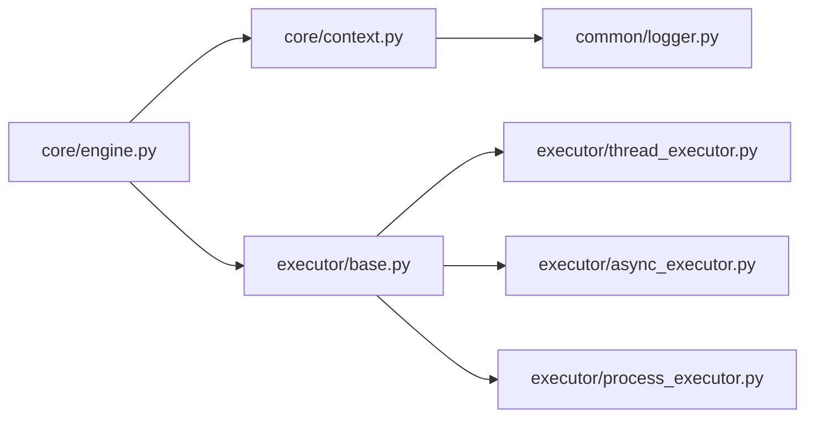

# 执行上下文机制

<cite>
**本文引用的文件**   
- [src/neotask/core/context.py](file://src/neotask/core/context.py)
- [src/neotask/core/engine.py](file://src/neotask/core/engine.py)
- [src/neotask/executor/base.py](file://src/neotask/executor/base.py)
- [src/neotask/executor/thread_executor.py](file://src/neotask/executor/thread_executor.py)
- [src/neotask/executor/async_executor.py](file://src/neotask/executor/async_executor.py)
- [src/neotask/executor/process_executor.py](file://src/neotask/executor/process_executor.py)
- [src/neotask/common/logger.py](file://src/neotask/common/logger.py)
- [examples/02_context_manager.py](file://examples/02_context_manager.py)
</cite>

## 目录
1. [简介](#简介)
2. [项目结构](#项目结构)
3. [核心组件](#核心组件)
4. [架构总览](#架构总览)
5. [详细组件分析](#详细组件分析)
6. [依赖关系分析](#依赖关系分析)
7. [性能考虑](#性能考虑)
8. [故障排查指南](#故障排查指南)
9. [结论](#结论)
10. [附录](#附录)

## 简介
本文件围绕“执行上下文”的设计与实现进行深入解析，覆盖以下关键主题：
- 上下文在任务执行中的作用：参数传递、环境变量、日志上下文、追踪信息等。
- 上下文的创建、传播、继承与销毁机制。
- 异步环境下的上下文管理策略：线程隔离与协程隔离。
- 与分布式环境的集成方式（跨进程/跨节点）。
- 自定义上下文扩展的开发指南。
- 实际使用场景与最佳实践建议。

## 项目结构
与执行上下文相关的核心代码位于 core 与 executor 模块中，并通过 common.logger 提供日志上下文支持；示例位于 examples 目录。

图表来源
- [src/neotask/core/context.py](file://src/neotask/core/context.py)
- [src/neotask/core/engine.py](file://src/neotask/core/engine.py)
- [src/neotask/executor/base.py](file://src/neotask/executor/base.py)
- [src/neotask/executor/thread_executor.py](file://src/neotask/executor/thread_executor.py)
- [src/neotask/executor/async_executor.py](file://src/neotask/executor/async_executor.py)
- [src/neotask/executor/process_executor.py](file://src/neotask/executor/process_executor.py)
- [src/neotask/common/logger.py](file://src/neotask/common/logger.py)
- [examples/02_context_manager.py](file://examples/02_context_manager.py)

章节来源
- [src/neotask/core/context.py](file://src/neotask/core/context.py)
- [src/neotask/core/engine.py](file://src/neotask/core/engine.py)
- [src/neotask/executor/base.py](file://src/neotask/executor/base.py)
- [src/neotask/executor/thread_executor.py](file://src/neotask/executor/thread_executor.py)
- [src/neotask/executor/async_executor.py](file://src/neotask/executor/async_executor.py)
- [src/neotask/executor/process_executor.py](file://src/neotask/executor/process_executor.py)
- [src/neotask/common/logger.py](file://src/neotask/common/logger.py)
- [examples/02_context_manager.py](file://examples/02_context_manager.py)

## 核心组件
- 上下文容器：提供键值存储、作用域管理、克隆与合并能力，用于承载任务运行期数据（如请求ID、租户标识、业务标签等）。
- 引擎集成：调度引擎在派发任务前注入上下文，并在任务完成后清理上下文，确保生命周期可控。
- 执行器适配：不同执行器（线程、协程、进程）负责将上下文传播到目标执行环境，或在新环境中重建上下文。
- 日志上下文：通过日志中间件或适配器，将上下文中的追踪信息自动附加到每条日志输出。

章节来源
- [src/neotask/core/context.py](file://src/neotask/core/context.py)
- [src/neotask/core/engine.py](file://src/neotask/core/engine.py)
- [src/neotask/executor/base.py](file://src/neotask/executor/base.py)
- [src/neotask/common/logger.py](file://src/neotask/common/logger.py)

## 架构总览
下图展示了从任务提交到执行的端到端上下文流转路径，包括创建、传播、继承与销毁的关键阶段。

图表来源
- [src/neotask/core/engine.py](file://src/neotask/core/engine.py)
- [src/neotask/executor/base.py](file://src/neotask/executor/base.py)
- [src/neotask/executor/thread_executor.py](file://src/neotask/executor/thread_executor.py)
- [src/neotask/executor/async_executor.py](file://src/neotask/executor/async_executor.py)
- [src/neotask/executor/process_executor.py](file://src/neotask/executor/process_executor.py)
- [src/neotask/common/logger.py](file://src/neotask/common/logger.py)

## 详细组件分析

### 上下文容器设计
- 职责
  - 提供统一的键值访问接口，支持嵌套作用域。
  - 支持克隆与合并，便于在不同执行边界复制上下文。
  - 提供只读视图，避免意外修改。
- 关键特性
  - 作用域创建与退出：进入新作用域时压栈，退出时弹栈恢复。
  - 快照与差异：在执行边界生成快照，用于比较和回滚。
  - 安全默认值：对缺失键提供默认行为，避免空引用。
- 复杂度
  - 读写操作为 O(1)。
  - 作用域切换为 O(1) 的栈操作。
  - 克隆/合并为 O(n)，n 为上下文条目数。

图表来源
- [src/neotask/core/context.py](file://src/neotask/core/context.py)

章节来源
- [src/neotask/core/context.py](file://src/neotask/core/context.py)

### 引擎中的上下文注入与清理
- 职责
  - 在任务派发前，将当前上下文注入到任务执行环境。
  - 在任务完成后，确保上下文被正确清理，避免泄漏。
- 流程要点
  - 接收上层传入的上下文或基于请求构建新上下文。
  - 将上下文作为执行参数传递给具体执行器。
  - 在 finally 分支中执行清理逻辑，保证异常路径也能释放资源。

图表来源
- [src/neotask/core/engine.py](file://src/neotask/core/engine.py)

章节来源
- [src/neotask/core/engine.py](file://src/neotask/core/engine.py)

### 执行器中的上下文传播与隔离
- 基类约定
  - 定义统一的上下文传播接口，供子类实现。
  - 提供默认实现以兼容简单场景。
- 线程执行器
  - 使用线程局部存储（TLS）进行隔离。
  - 在子线程启动时复制父线程上下文，并在结束时恢复。
- 协程执行器
  - 使用事件循环的上下文变量（contextvars）进行隔离。
  - 在创建协程时捕获并传播上下文，确保 await 链内一致。
- 进程执行器
  - 进程间无共享内存，需序列化上下文并在子进程重建。
  - 仅保留必要字段，避免大对象跨进程传输。

图表来源
- [src/neotask/executor/base.py](file://src/neotask/executor/base.py)
- [src/neotask/executor/thread_executor.py](file://src/neotask/executor/thread_executor.py)
- [src/neotask/executor/async_executor.py](file://src/neotask/executor/async_executor.py)
- [src/neotask/executor/process_executor.py](file://src/neotask/executor/process_executor.py)

章节来源
- [src/neotask/executor/base.py](file://src/neotask/executor/base.py)
- [src/neotask/executor/thread_executor.py](file://src/neotask/executor/thread_executor.py)
- [src/neotask/executor/async_executor.py](file://src/neotask/executor/async_executor.py)
- [src/neotask/executor/process_executor.py](file://src/neotask/executor/process_executor.py)

### 日志上下文与追踪信息
- 职责
  - 将上下文中的追踪键（如请求ID、链路ID、租户ID）自动附加到日志输出。
  - 在异步与多线程环境下保持日志一致性。
- 实现要点
  - 通过日志适配器或过滤器读取当前上下文。
  - 在上下文作用域切换时更新日志上下文。
  - 提供开关控制是否启用上下文注入。

图表来源
- [src/neotask/common/logger.py](file://src/neotask/common/logger.py)
- [src/neotask/core/context.py](file://src/neotask/core/context.py)

章节来源
- [src/neotask/common/logger.py](file://src/neotask/common/logger.py)
- [src/neotask/core/context.py](file://src/neotask/core/context.py)

### 上下文在分布式环境中的集成
- 跨进程
  - 进程执行器负责序列化和反序列化上下文，仅传递必要字段。
  - 建议在进程边界明确上下文契约，避免版本不兼容。
- 跨节点
  - 在远程调用前将上下文编码进消息头或元数据。
  - 在远端节点解码并重建上下文，确保链路追踪连续。
- 注意事项
  - 避免在上下文中存放敏感信息。
  - 限制上下文大小，减少网络开销。
  - 处理跨节点时钟与顺序问题，必要时引入时间戳或版本号。

章节来源
- [src/neotask/executor/process_executor.py](file://src/neotask/executor/process_executor.py)

### 自定义上下文扩展开发指南
- 步骤
  - 扩展上下文容器：新增键类型与验证规则。
  - 在引擎中注册上下文钩子：在任务前后注入/清理扩展字段。
  - 在执行器中适配传播：确保线程/协程/进程边界正确复制。
  - 在日志系统中注册适配器：使扩展字段出现在日志中。
- 最佳实践
  - 为扩展字段设置默认值与过期策略。
  - 提供只读视图，防止越权修改。
  - 编写单元测试覆盖传播与清理路径。

章节来源
- [src/neotask/core/context.py](file://src/neotask/core/context.py)
- [src/neotask/core/engine.py](file://src/neotask/core/engine.py)
- [src/neotask/executor/base.py](file://src/neotask/executor/base.py)
- [src/neotask/common/logger.py](file://src/neotask/common/logger.py)

### 实际使用场景与示例
- 示例：使用上下文管理器封装任务执行
  - 参考示例文件，展示如何在任务执行前后创建与清理上下文。
  - 演示如何向上下文注入业务标识与追踪信息。
- 建议
  - 在入口点统一创建上下文，向下传递。
  - 在异常路径确保上下文清理，避免泄漏。
  - 在异步与多线程场景中分别测试上下文隔离。

章节来源
- [examples/02_context_manager.py](file://examples/02_context_manager.py)

## 依赖关系分析
- 耦合关系
  - 引擎依赖上下文容器与执行器。
  - 执行器依赖上下文容器与日志系统。
  - 日志系统依赖上下文容器以读取追踪信息。
- 潜在风险
  - 执行器与上下文容器的接口变更可能影响多个执行器。
  - 日志适配器的变更可能影响所有任务的日志输出。
- 外部依赖
  - 标准库的线程局部存储与上下文变量。
  - 可选的分布式通信框架（用于跨节点传播）。

图表来源
- [src/neotask/core/engine.py](file://src/neotask/core/engine.py)
- [src/neotask/core/context.py](file://src/neotask/core/context.py)
- [src/neotask/executor/base.py](file://src/neotask/executor/base.py)
- [src/neotask/executor/thread_executor.py](file://src/neotask/executor/thread_executor.py)
- [src/neotask/executor/async_executor.py](file://src/neotask/executor/async_executor.py)
- [src/neotask/executor/process_executor.py](file://src/neotask/executor/process_executor.py)
- [src/neotask/common/logger.py](file://src/neotask/common/logger.py)

章节来源
- [src/neotask/core/engine.py](file://src/neotask/core/engine.py)
- [src/neotask/core/context.py](file://src/neotask/core/context.py)
- [src/neotask/executor/base.py](file://src/neotask/executor/base.py)
- [src/neotask/executor/thread_executor.py](file://src/neotask/executor/thread_executor.py)
- [src/neotask/executor/async_executor.py](file://src/neotask/executor/async_executor.py)
- [src/neotask/executor/process_executor.py](file://src/neotask/executor/process_executor.py)
- [src/neotask/common/logger.py](file://src/neotask/common/logger.py)

## 性能考虑
- 上下文大小控制：避免在上下文中存放大对象，减少序列化与拷贝成本。
- 作用域粒度：尽量缩小上下文作用域，降低栈操作频率。
- 日志注入开关：在高吞吐场景下可关闭非必要的上下文注入以提升性能。
- 执行器选择：优先使用协程执行器以减少线程切换开销；跨进程仅在必要时使用。

[本节为通用指导，无需特定文件来源]

## 故障排查指南
- 常见问题
  - 上下文未传播：检查执行器是否正确复制上下文。
  - 上下文泄漏：确认引擎是否在 finally 分支清理上下文。
  - 日志缺少追踪信息：确认日志适配器是否启用并读取上下文。
  - 跨进程丢失字段：检查序列化/反序列化逻辑是否包含必要字段。
- 定位方法
  - 在引擎派发前后打印上下文快照。
  - 在执行器入口处打印当前执行环境与上下文键集合。
  - 在日志中输出上下文关键字段，辅助链路追踪。

章节来源
- [src/neotask/core/engine.py](file://src/neotask/core/engine.py)
- [src/neotask/executor/base.py](file://src/neotask/executor/base.py)
- [src/neotask/common/logger.py](file://src/neotask/common/logger.py)

## 结论
执行上下文是贯穿任务全生命周期的关键基础设施。通过清晰的容器设计、严格的传播与清理策略、以及针对不同执行模型的适配，系统在单进程与分布式环境下均能保持一致的观测性与可控性。遵循本文的最佳实践与扩展指南，可在保障性能的同时提升系统的可维护性与可观测性。

[本节为总结，无需特定文件来源]

## 附录
- 术语
  - 上下文：任务执行期的键值环境，包含参数、环境变量、追踪信息等。
  - 作用域：上下文的生命周期范围，支持嵌套与恢复。
  - 传播：将上下文从一个执行边界复制到另一个执行边界的操作。
- 参考示例
  - 上下文管理器示例：[examples/02_context_manager.py](file://examples/02_context_manager.py)

[本节为补充说明，无需特定文件来源]