# 核心概念

<cite>
**本文引用的文件**   
- [src/neotask/core/engine.py](file://src/neotask/core/engine.py)
- [src/neotask/core/dispatcher.py](file://src/neotask/core/dispatcher.py)
- [src/neotask/core/context.py](file://src/neotask/core/context.py)
- [src/neotask/core/lifecycle.py](file://src/neotask/core/lifecycle.py)
- [src/neotask/core/future.py](file://src/neotask/core/future.py)
- [src/neotask/executor/base.py](file://src/neotask/executor/base.py)
- [src/neotask/executor/thread_executor.py](file://src/neotask/executor/thread_executor.py)
- [src/neotask/executor/process_executor.py](file://src/neotask/executor/process_executor.py)
- [src/neotask/executor/async_executor.py](file://src/neotask/executor/async_executor.py)
- [src/neotask/executor/factory.py](file://src/neotask/executor/factory.py)
- [src/neotask/models/task.py](file://src/neotask/models/task.py)
- [src/neotask/models/schedule.py](file://src/neotask/models/schedule.py)
- [src/neotask/queue/priority_queue.py](file://src/neotask/queue/priority_queue.py)
- [src/neotask/queue/delayed_queue.py](file://src/neotask/queue/delayed_queue.py)
- [src/neotask/queue/queue_scheduler.py](file://src/neotask/queue/queue_scheduler.py)
- [src/neotask/scheduler/cron_parser.py](file://src/neotask/scheduler/cron_parser.py)
- [src/neotask/scheduler/periodic.py](file://src/neotask/scheduler/periodic.py)
- [src/neotask/scheduler/time_wheel.py](file://src/neotask/scheduler/time_wheel.py)
- [src/neotask/storage/base.py](file://src/neotask/storage/base.py)
- [src/neotask/storage/memory.py](file://src/neotask/storage/memory.py)
- [src/neotask/storage/redis.py](file://src/neotask/storage/redis.py)
- [src/neotask/storage/sqlite.py](file://src/neotask/storage/sqlite.py)
- [src/neotask/event/bus.py](file://src/neotask/event/bus.py)
- [src/neotask/event/handlers.py](file://src/neotask/event/handlers.py)
- [src/neotask/worker/pool.py](file://src/neotask/worker/pool.py)
- [src/neotask/worker/supervisor.py](file://src/neotask/worker/supervisor.py)
- [src/neotask/api/task_scheduler.py](file://src/neotask/api/task_scheduler.py)
- [src/neotask/common/constants.py](file://src/neotask/common/constants.py)
- [src/neotask/common/exceptions.py](file://src/neotask/common/exceptions.py)
</cite>

## 目录
1. [引言](#引言)
2. [项目结构](#项目结构)
3. [核心组件](#核心组件)
4. [架构总览](#架构总览)
5. [详细组件分析](#详细组件分析)
6. [依赖关系分析](#依赖关系分析)
7. [性能考量](#性能考量)
8. [故障排查指南](#故障排查指南)
9. [结论](#结论)
10. [附录](#附录)

## 引言
本文件聚焦任务调度管理器的核心概念与架构设计，围绕以下关键主题展开：
- 任务生命周期管理与状态机
- 执行上下文机制与传播
- 调度引擎工作原理（时间轮、延迟队列、周期任务）
- 任务状态转换与调度策略选择
- 并发模型与执行器抽象
- 事件总线与观察者模式
- 存储与持久化抽象
- 工厂模式在组件装配中的应用

目标是帮助开发者建立对系统内部工作机制的系统性理解，并指导后续扩展与优化。

## 项目结构
仓库采用分层与按功能域组织相结合的结构：
- core：调度内核（引擎、分发器、上下文、生命周期、Future）
- executor：执行器抽象与多种实现（线程、进程、异步）
- queue：队列与调度（优先级队列、延迟队列、队列调度器）
- scheduler：调度算法（Cron解析、周期任务、时间轮）
- storage：存储抽象与多后端实现（内存、SQLite、Redis）
- event：事件总线与中间件
- worker：工作池与监督者
- api：对外API封装
- models：领域模型（任务、调度配置）
- common：常量与异常等通用定义

```mermaid
graph TB
subgraph "核心层"
engine["调度引擎<br/>engine.py"]
dispatcher["分发器<br/>dispatcher.py"]
ctx["执行上下文<br/>context.py"]
lifecycle["生命周期<br/>lifecycle.py"]
future["Future<br/>future.py"]
end
subgraph "调度与队列"
cron["Cron解析<br/>cron_parser.py"]
periodic["周期任务<br/>periodic.py"]
tw["时间轮<br/>time_wheel.py"]
pq["优先级队列<br/>priority_queue.py"]
dq["延迟队列<br/>delayed_queue.py"]
qs["队列调度器<br/>queue_scheduler.py"]
end
subgraph "执行器"
base_exec["执行器基类<br/>base.py"]
thread_exec["线程执行器<br/>thread_executor.py"]
proc_exec["进程执行器<br/>process_executor.py"]
async_exec["异步执行器<br/>async_executor.py"]
exec_factory["执行器工厂<br/>factory.py"]
end
subgraph "存储"
store_base["存储基类<br/>base.py"]
mem_store["内存存储<br/>memory.py"]
sqlite_store["SQLite存储<br/>sqlite.py"]
redis_store["Redis存储<br/>redis.py"]
end
subgraph "事件与监控"
bus["事件总线<br/>bus.py"]
handlers["事件处理器<br/>handlers.py"]
end
subgraph "工作节点"
pool["工作池<br/>pool.py"]
supervisor["监督者<br/>supervisor.py"]
end
engine --> dispatcher
engine --> lifecycle
engine --> ctx
engine --> future
engine --> qs
qs --> pq
qs --> dq
qs --> tw
engine --> exec_factory
exec_factory --> base_exec
exec_factory --> thread_exec
exec_factory --> proc_exec
exec_factory --> async_exec
engine --> store_base
store_base --> mem_store
store_base --> sqlite_store
store_base --> redis_store
engine --> bus
bus --> handlers
engine --> pool
pool --> supervisor
```

图表来源
- [src/neotask/core/engine.py](file://src/neotask/core/engine.py)
- [src/neotask/core/dispatcher.py](file://src/neotask/core/dispatcher.py)
- [src/neotask/core/context.py](file://src/neotask/core/context.py)
- [src/neotask/core/lifecycle.py](file://src/neotask/core/lifecycle.py)
- [src/neotask/core/future.py](file://src/neotask/core/future.py)
- [src/neotask/queue/priority_queue.py](file://src/neotask/queue/priority_queue.py)
- [src/neotask/queue/delayed_queue.py](file://src/neotask/queue/delayed_queue.py)
- [src/neotask/queue/queue_scheduler.py](file://src/neotask/queue/queue_scheduler.py)
- [src/neotask/scheduler/cron_parser.py](file://src/neotask/scheduler/cron_parser.py)
- [src/neotask/scheduler/periodic.py](file://src/neotask/scheduler/periodic.py)
- [src/neotask/scheduler/time_wheel.py](file://src/neotask/scheduler/time_wheel.py)
- [src/neotask/executor/base.py](file://src/neotask/executor/base.py)
- [src/neotask/executor/thread_executor.py](file://src/neotask/executor/thread_executor.py)
- [src/neotask/executor/process_executor.py](file://src/neotask/executor/process_executor.py)
- [src/neotask/executor/async_executor.py](file://src/neotask/executor/async_executor.py)
- [src/neotask/executor/factory.py](file://src/neotask/executor/factory.py)
- [src/neotask/storage/base.py](file://src/neotask/storage/base.py)
- [src/neotask/storage/memory.py](file://src/neotask/storage/memory.py)
- [src/neotask/storage/sqlite.py](file://src/neotask/storage/sqlite.py)
- [src/neotask/storage/redis.py](file://src/neotask/storage/redis.py)
- [src/neotask/event/bus.py](file://src/neotask/event/bus.py)
- [src/neotask/event/handlers.py](file://src/neotask/event/handlers.py)
- [src/neotask/worker/pool.py](file://src/neotask/worker/pool.py)
- [src/neotask/worker/supervisor.py](file://src/neotask/worker/supervisor.py)

章节来源
- [src/neotask/core/engine.py](file://src/neotask/core/engine.py)
- [src/neotask/queue/queue_scheduler.py](file://src/neotask/queue/queue_scheduler.py)
- [src/neotask/executor/factory.py](file://src/neotask/executor/factory.py)
- [src/neotask/storage/base.py](file://src/neotask/storage/base.py)
- [src/neotask/event/bus.py](file://src/neotask/event/bus.py)

## 核心组件
本节从职责边界与交互角度梳理核心组件：
- 调度引擎：协调生命周期、上下文、分发器、队列与执行器，驱动任务从入队到完成的全流程。
- 分发器：根据策略将任务路由至合适的执行器或队列。
- 执行上下文：携带任务元数据、追踪ID、重试次数、超时、优先级等信息，贯穿执行链路。
- 生命周期：定义任务状态与转换规则，提供钩子用于事件发布与持久化。
- Future：统一异步结果与回调接口，支撑链式处理与取消。
- 队列与调度：优先级队列、延迟队列、时间轮与周期任务共同决定“何时”和“以何种顺序”执行。
- 执行器：线程、进程、异步三种实现，屏蔽底层并发差异。
- 存储：内存、SQLite、Redis等多后端，负责任务与状态的持久化。
- 事件总线：解耦状态变更与副作用（如指标上报、审计日志）。
- 工作池与监督者：维护Worker资源、健康检查与自愈。

章节来源
- [src/neotask/core/engine.py](file://src/neotask/core/engine.py)
- [src/neotask/core/dispatcher.py](file://src/neotask/core/dispatcher.py)
- [src/neotask/core/context.py](file://src/neotask/core/context.py)
- [src/neotask/core/lifecycle.py](file://src/neotask/core/lifecycle.py)
- [src/neotask/core/future.py](file://src/neotask/core/future.py)
- [src/neotask/queue/priority_queue.py](file://src/neotask/queue/priority_queue.py)
- [src/neotask/queue/delayed_queue.py](file://src/neotask/queue/delayed_queue.py)
- [src/neotask/queue/queue_scheduler.py](file://src/neotask/queue/queue_scheduler.py)
- [src/neotask/scheduler/time_wheel.py](file://src/neotask/scheduler/time_wheel.py)
- [src/neotask/scheduler/periodic.py](file://src/neotask/scheduler/periodic.py)
- [src/neotask/executor/base.py](file://src/neotask/executor/base.py)
- [src/neotask/executor/thread_executor.py](file://src/neotask/executor/thread_executor.py)
- [src/neotask/executor/process_executor.py](file://src/neotask/executor/process_executor.py)
- [src/neotask/executor/async_executor.py](file://src/neotask/executor/async_executor.py)
- [src/neotask/storage/base.py](file://src/neotask/storage/base.py)
- [src/neotask/storage/memory.py](file://src/neotask/storage/memory.py)
- [src/neotask/storage/sqlite.py](file://src/neotask/storage/sqlite.py)
- [src/neotask/storage/redis.py](file://src/neotask/storage/redis.py)
- [src/neotask/event/bus.py](file://src/neotask/event/bus.py)
- [src/neotask/worker/pool.py](file://src/neotask/worker/pool.py)
- [src/neotask/worker/supervisor.py](file://src/neotask/worker/supervisor.py)

## 架构总览
下图展示调度引擎与各子系统的关键交互路径，包括入队、调度、执行、结果回写与事件通知。

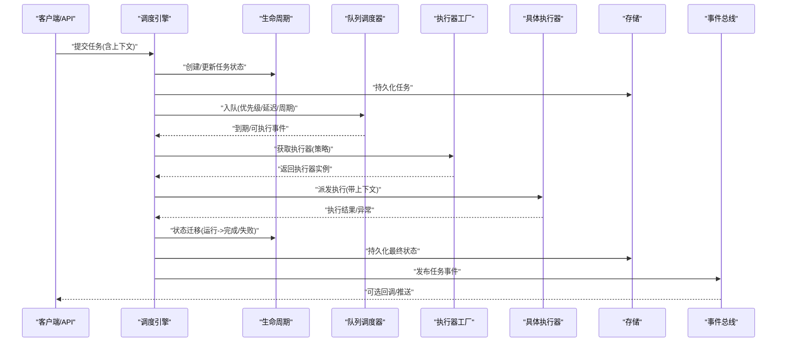

图表来源
- [src/neotask/core/engine.py](file://src/neotask/core/engine.py)
- [src/neotask/core/lifecycle.py](file://src/neotask/core/lifecycle.py)
- [src/neotask/queue/queue_scheduler.py](file://src/neotask/queue/queue_scheduler.py)
- [src/neotask/executor/factory.py](file://src/neotask/executor/factory.py)
- [src/neotask/storage/base.py](file://src/neotask/storage/base.py)
- [src/neotask/event/bus.py](file://src/neotask/event/bus.py)

## 详细组件分析

### 任务生命周期与状态机
- 状态集合：通常包含新建、待调度、排队中、运行中、已完成、失败、已取消等。
- 转换规则：由生命周期模块统一管理，确保原子性与幂等；每次转换触发事件与持久化。
- 钩子与副作用：在进入/离开某状态时，可触发重试、补偿、告警等逻辑。

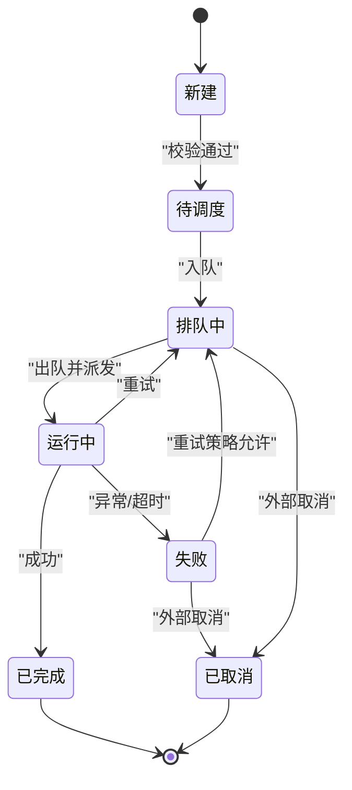

图表来源
- [src/neotask/core/lifecycle.py](file://src/neotask/core/lifecycle.py)
- [src/neotask/common/constants.py](file://src/neotask/common/constants.py)
- [src/neotask/common/exceptions.py](file://src/neotask/common/exceptions.py)

章节来源
- [src/neotask/core/lifecycle.py](file://src/neotask/core/lifecycle.py)
- [src/neotask/common/constants.py](file://src/neotask/common/constants.py)
- [src/neotask/common/exceptions.py](file://src/neotask/common/exceptions.py)

### 执行上下文机制
- 上下文内容：任务标识、追踪ID、优先级、重试次数、超时、标签、路由键等。
- 传播方式：随任务对象传递，进入执行器后注入到执行环境，支持跨阶段读取与修改。
- 隔离与继承：不同执行器对上下文可见范围不同（例如进程级需序列化/反序列化）。

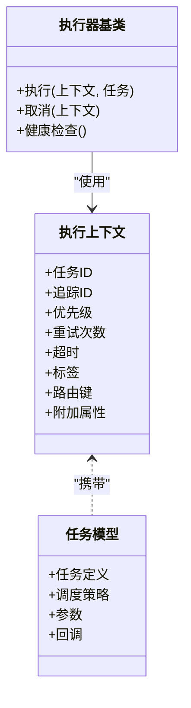

图表来源
- [src/neotask/core/context.py](file://src/neotask/core/context.py)
- [src/neotask/models/task.py](file://src/neotask/models/task.py)
- [src/neotask/executor/base.py](file://src/neotask/executor/base.py)

章节来源
- [src/neotask/core/context.py](file://src/neotask/core/context.py)
- [src/neotask/models/task.py](file://src/neotask/models/task.py)
- [src/neotask/executor/base.py](file://src/neotask/executor/base.py)

### 调度引擎与分发器
- 调度引擎：聚合生命周期、上下文、队列、执行器与存储，编排任务从提交到完成的完整流程。
- 分发器：依据任务标签、目标集群、资源需求等策略选择执行器或队列。
- 控制流：入队→到期检测→出队→选择执行器→执行→结果回写→事件发布。

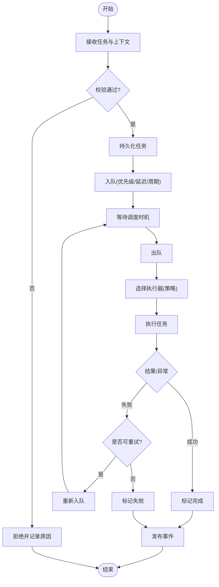

图表来源
- [src/neotask/core/engine.py](file://src/neotask/core/engine.py)
- [src/neotask/core/dispatcher.py](file://src/neotask/core/dispatcher.py)
- [src/neotask/queue/queue_scheduler.py](file://src/neotask/queue/queue_scheduler.py)
- [src/neotask/executor/factory.py](file://src/neotask/executor/factory.py)
- [src/neotask/storage/base.py](file://src/neotask/storage/base.py)
- [src/neotask/event/bus.py](file://src/neotask/event/bus.py)

章节来源
- [src/neotask/core/engine.py](file://src/neotask/core/engine.py)
- [src/neotask/core/dispatcher.py](file://src/neotask/core/dispatcher.py)
- [src/neotask/queue/queue_scheduler.py](file://src/neotask/queue/queue_scheduler.py)
- [src/neotask/executor/factory.py](file://src/neotask/executor/factory.py)
- [src/neotask/storage/base.py](file://src/neotask/storage/base.py)
- [src/neotask/event/bus.py](file://src/neotask/event/bus.py)

### 调度策略与时间轮
- Cron解析：将表达式转换为下一次触发时间点。
- 周期任务：基于解析结果周期性生成任务或触发执行。
- 时间轮：高效管理定时任务，减少扫描开销，提升大规模定时场景吞吐。

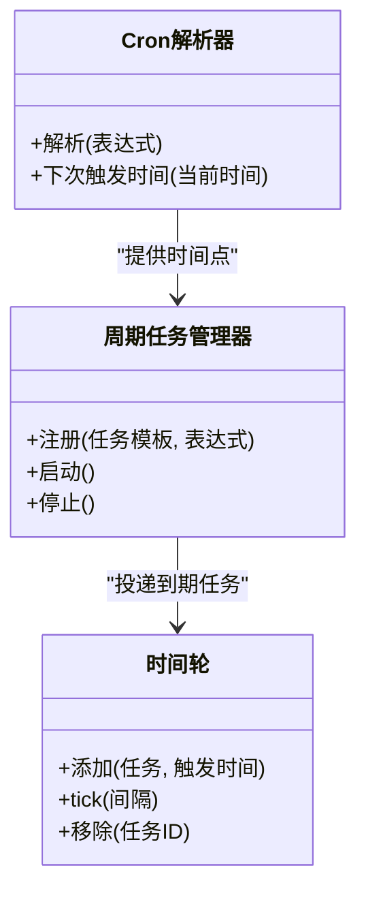

图表来源
- [src/neotask/scheduler/cron_parser.py](file://src/neotask/scheduler/cron_parser.py)
- [src/neotask/scheduler/periodic.py](file://src/neotask/scheduler/periodic.py)
- [src/neotask/scheduler/time_wheel.py](file://src/neotask/scheduler/time_wheel.py)

章节来源
- [src/neotask/scheduler/cron_parser.py](file://src/neotask/scheduler/cron_parser.py)
- [src/neotask/scheduler/periodic.py](file://src/neotask/scheduler/periodic.py)
- [src/neotask/scheduler/time_wheel.py](file://src/neotask/scheduler/time_wheel.py)

### 队列与优先级/延迟调度
- 优先级队列：按优先级出队，保障高优任务优先执行。
- 延迟队列：支持未来时刻执行，常用于延时任务与退避重试。
- 队列调度器：统一接入时间轮与延迟队列，协调出队与重入队。

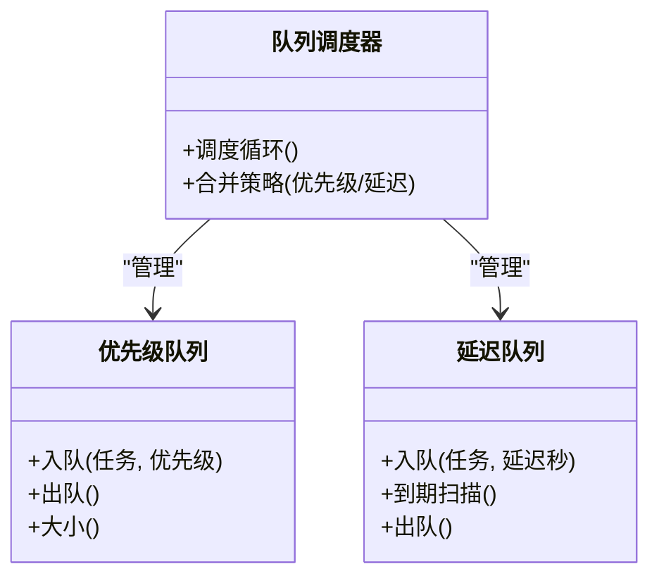

图表来源
- [src/neotask/queue/priority_queue.py](file://src/neotask/queue/priority_queue.py)
- [src/neotask/queue/delayed_queue.py](file://src/neotask/queue/delayed_queue.py)
- [src/neotask/queue/queue_scheduler.py](file://src/neotask/queue/queue_scheduler.py)

章节来源
- [src/neotask/queue/priority_queue.py](file://src/neotask/queue/priority_queue.py)
- [src/neotask/queue/delayed_queue.py](file://src/neotask/queue/delayed_queue.py)
- [src/neotask/queue/queue_scheduler.py](file://src/neotask/queue/queue_scheduler.py)

### 执行器与并发模型
- 执行器抽象：统一执行与取消接口，屏蔽线程/进程/异步差异。
- 线程执行器：适合CPU/IO混合且轻量任务，共享进程内存。
- 进程执行器：适合CPU密集型或需要隔离的任务，存在序列化成本。
- 异步执行器：适合高并发IO任务，利用事件循环。

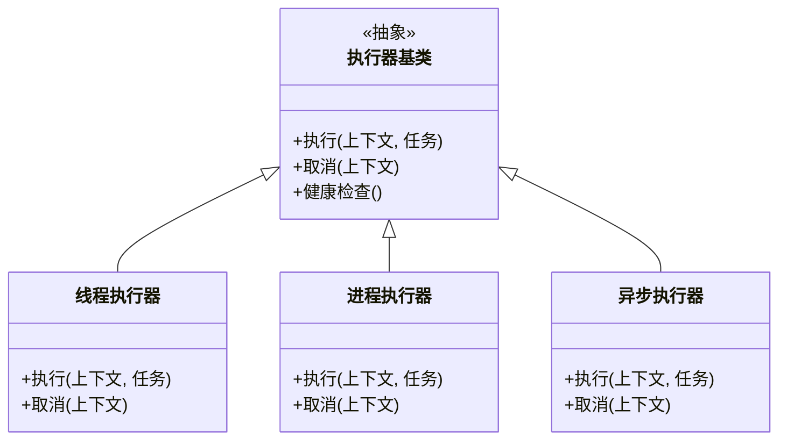

图表来源
- [src/neotask/executor/base.py](file://src/neotask/executor/base.py)
- [src/neotask/executor/thread_executor.py](file://src/neotask/executor/thread_executor.py)
- [src/neotask/executor/process_executor.py](file://src/neotask/executor/process_executor.py)
- [src/neotask/executor/async_executor.py](file://src/neotask/executor/async_executor.py)

章节来源
- [src/neotask/executor/base.py](file://src/neotask/executor/base.py)
- [src/neotask/executor/thread_executor.py](file://src/neotask/executor/thread_executor.py)
- [src/neotask/executor/process_executor.py](file://src/neotask/executor/process_executor.py)
- [src/neotask/executor/async_executor.py](file://src/neotask/executor/async_executor.py)

### 存储抽象与多后端
- 存储基类：定义任务与状态增删改查接口。
- 内存存储：快速开发测试，无持久化。
- SQLite存储：单机轻量持久化。
- Redis存储：分布式共享状态与高性能。

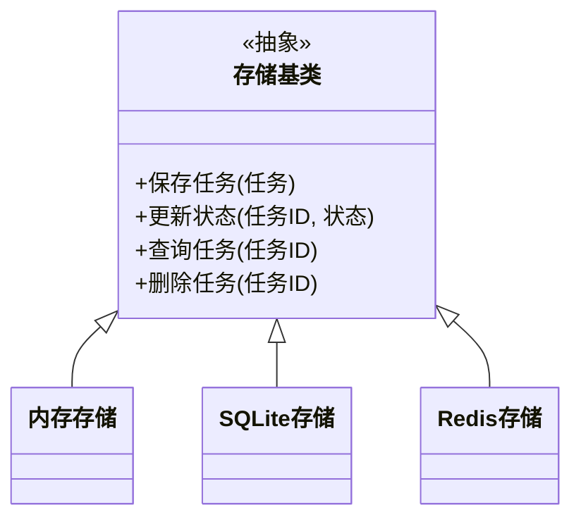

图表来源
- [src/neotask/storage/base.py](file://src/neotask/storage/base.py)
- [src/neotask/storage/memory.py](file://src/neotask/storage/memory.py)
- [src/neotask/storage/sqlite.py](file://src/neotask/storage/sqlite.py)
- [src/neotask/storage/redis.py](file://src/neotask/storage/redis.py)

章节来源
- [src/neotask/storage/base.py](file://src/neotask/storage/base.py)
- [src/neotask/storage/memory.py](file://src/neotask/storage/memory.py)
- [src/neotask/storage/sqlite.py](file://src/neotask/storage/sqlite.py)
- [src/neotask/storage/redis.py](file://src/neotask/storage/redis.py)

### 事件总线与观察者模式
- 事件总线：解耦状态变更与监听者，支持订阅/发布。
- 典型事件：任务创建、状态迁移、执行开始/结束、失败、取消等。
- 监听者：指标采集、审计日志、告警、WebUI刷新等。

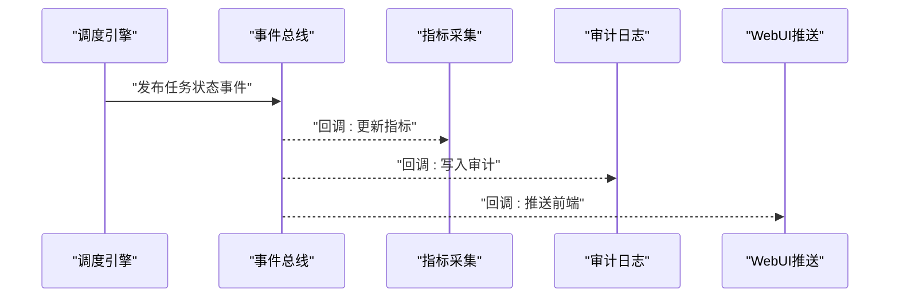

图表来源
- [src/neotask/event/bus.py](file://src/neotask/event/bus.py)
- [src/neotask/event/handlers.py](file://src/neotask/event/handlers.py)
- [src/neotask/core/lifecycle.py](file://src/neotask/core/lifecycle.py)

章节来源
- [src/neotask/event/bus.py](file://src/neotask/event/bus.py)
- [src/neotask/event/handlers.py](file://src/neotask/event/handlers.py)
- [src/neotask/core/lifecycle.py](file://src/neotask/core/lifecycle.py)

### 工厂模式与策略模式的应用
- 执行器工厂：根据配置或任务属性动态创建线程/进程/异步执行器实例。
- 存储工厂：根据运行时环境选择内存/SQLite/Redis存储实现。
- 调度策略：结合优先级、延迟、Cron等策略组合，形成灵活调度方案。

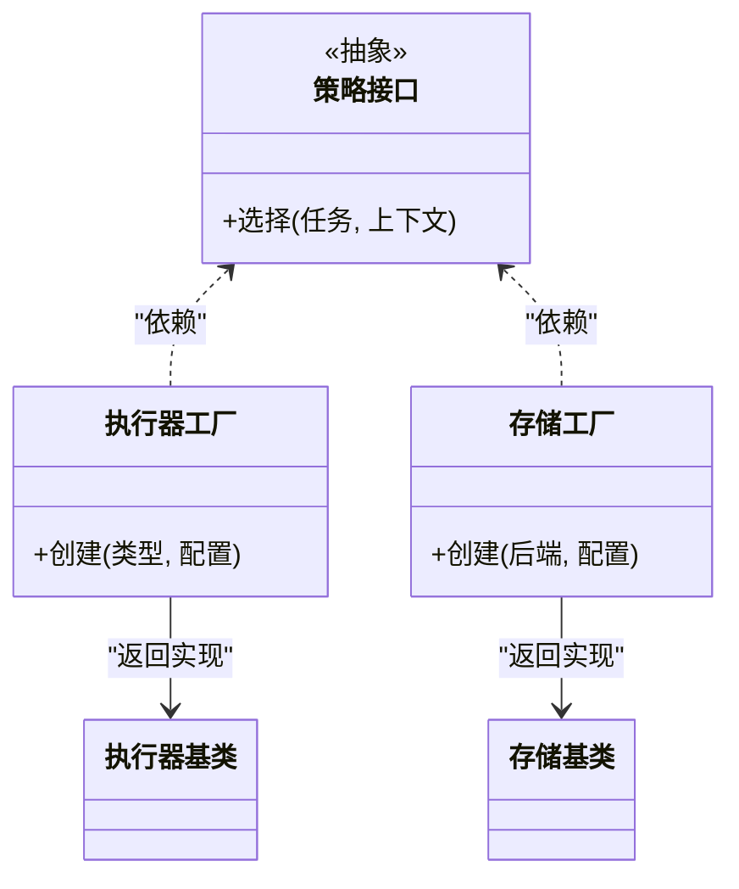

图表来源
- [src/neotask/executor/factory.py](file://src/neotask/executor/factory.py)
- [src/neotask/storage/base.py](file://src/neotask/storage/base.py)
- [src/neotask/executor/base.py](file://src/neotask/executor/base.py)

章节来源
- [src/neotask/executor/factory.py](file://src/neotask/executor/factory.py)
- [src/neotask/storage/base.py](file://src/neotask/storage/base.py)
- [src/neotask/executor/base.py](file://src/neotask/executor/base.py)

### API与集成点
- 任务调度API：封装提交、查询、取消、批量操作等能力，供上层服务调用。
- 集成点：与存储、事件总线、执行器工厂协作，保持对外接口稳定。

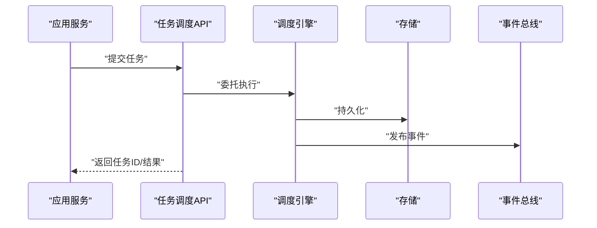

图表来源
- [src/neotask/api/task_scheduler.py](file://src/neotask/api/task_scheduler.py)
- [src/neotask/core/engine.py](file://src/neotask/core/engine.py)
- [src/neotask/storage/base.py](file://src/neotask/storage/base.py)
- [src/neotask/event/bus.py](file://src/neotask/event/bus.py)

章节来源
- [src/neotask/api/task_scheduler.py](file://src/neotask/api/task_scheduler.py)
- [src/neotask/core/engine.py](file://src/neotask/core/engine.py)
- [src/neotask/storage/base.py](file://src/neotask/storage/base.py)
- [src/neotask/event/bus.py](file://src/neotask/event/bus.py)

## 依赖关系分析
- 低耦合：通过抽象接口（执行器、存储、事件）降低模块间耦合度。
- 内聚性：每个模块职责清晰，便于独立演进与替换。
- 潜在环依赖：应避免在生命周期与事件总线之间形成直接双向依赖，建议通过接口或消息解耦。

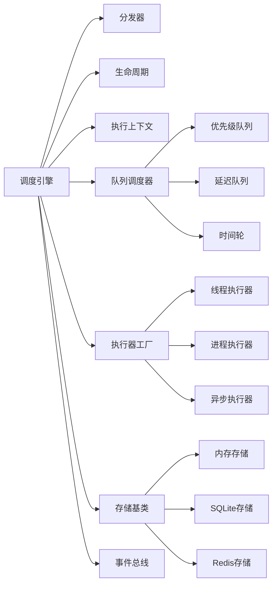

图表来源
- [src/neotask/core/engine.py](file://src/neotask/core/engine.py)
- [src/neotask/core/dispatcher.py](file://src/neotask/core/dispatcher.py)
- [src/neotask/core/context.py](file://src/neotask/core/context.py)
- [src/neotask/core/lifecycle.py](file://src/neotask/core/lifecycle.py)
- [src/neotask/queue/queue_scheduler.py](file://src/neotask/queue/queue_scheduler.py)
- [src/neotask/queue/priority_queue.py](file://src/neotask/queue/priority_queue.py)
- [src/neotask/queue/delayed_queue.py](file://src/neotask/queue/delayed_queue.py)
- [src/neotask/scheduler/time_wheel.py](file://src/neotask/scheduler/time_wheel.py)
- [src/neotask/executor/factory.py](file://src/neotask/executor/factory.py)
- [src/neotask/executor/thread_executor.py](file://src/neotask/executor/thread_executor.py)
- [src/neotask/executor/process_executor.py](file://src/neotask/executor/process_executor.py)
- [src/neotask/executor/async_executor.py](file://src/neotask/executor/async_executor.py)
- [src/neotask/storage/base.py](file://src/neotask/storage/base.py)
- [src/neotask/storage/memory.py](file://src/neotask/storage/memory.py)
- [src/neotask/storage/sqlite.py](file://src/neotask/storage/sqlite.py)
- [src/neotask/storage/redis.py](file://src/neotask/storage/redis.py)
- [src/neotask/event/bus.py](file://src/neotask/event/bus.py)

## 性能考量
- 时间轮替代全量扫描：在大量定时任务场景下显著降低CPU占用。
- 优先级队列与批处理：合理设置批次大小与优先级权重，平衡公平性与吞吐。
- 执行器选择：CPU密集用进程，IO密集用线程或异步，避免阻塞事件循环。
- 存储选型：高频读写与分布式部署优先Redis；单机轻量可用SQLite；开发测试用内存。
- 事件处理异步化：避免在关键路径同步执行耗时监听逻辑。

[本节为通用指导，不直接分析具体文件]

## 故障排查指南
- 常见错误分类：
  - 任务校验失败：检查上下文必填字段与约束。
  - 执行超时：调整超时阈值与执行器并发度。
  - 重试风暴：检查退避策略与最大重试次数。
  - 死信堆积：关注失败任务与死信队列容量。
- 定位方法：
  - 查看任务状态与事件日志，确认状态迁移是否符合预期。
  - 核对存储后端一致性，避免重复消费或丢失。
  - 评估执行器健康状态与工作池水位。

章节来源
- [src/neotask/common/exceptions.py](file://src/neotask/common/exceptions.py)
- [src/neotask/core/lifecycle.py](file://src/neotask/core/lifecycle.py)
- [src/neotask/event/bus.py](file://src/neotask/event/bus.py)
- [src/neotask/worker/pool.py](file://src/neotask/worker/pool.py)
- [src/neotask/worker/supervisor.py](file://src/neotask/worker/supervisor.py)

## 结论
本系统通过清晰的层次划分与抽象接口，实现了可扩展、可观测、可运维的任务调度与管理。生命周期与事件总线提供了强一致的状态与松耦合的副作用处理；时间轮与延迟队列保障了高效调度；执行器与存储的多实现满足多样化部署需求。建议在业务侧遵循上下文规范、合理选择执行器与存储后端，并结合事件进行指标与审计采集，以获得最佳稳定性与性能。

[本节为总结性内容，不直接分析具体文件]

## 附录
- 术语表：
  - 任务：可被调度执行的单元，包含定义、参数与策略。
  - 上下文：贯穿执行链路的元数据载体。
  - 生命周期：任务状态与转换规则的管理者。
  - 时间轮：基于环形缓冲的高效定时数据结构。
  - 延迟队列：支持未来时刻触发的队列。
  - 执行器：承载实际执行逻辑的并发抽象。
  - 存储：持久化任务与状态的抽象接口及实现。
  - 事件总线：发布-订阅的消息通道。

[本节为概念说明，不直接分析具体文件]