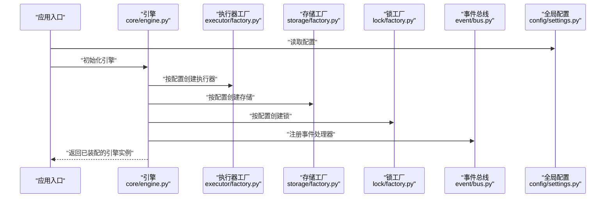
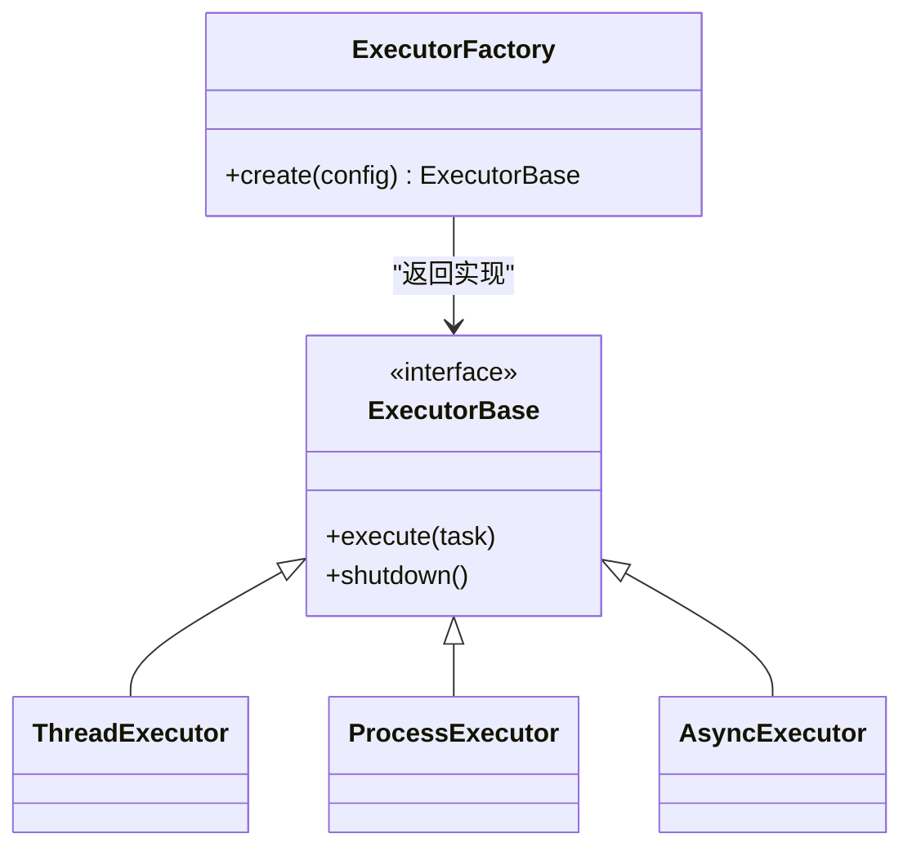
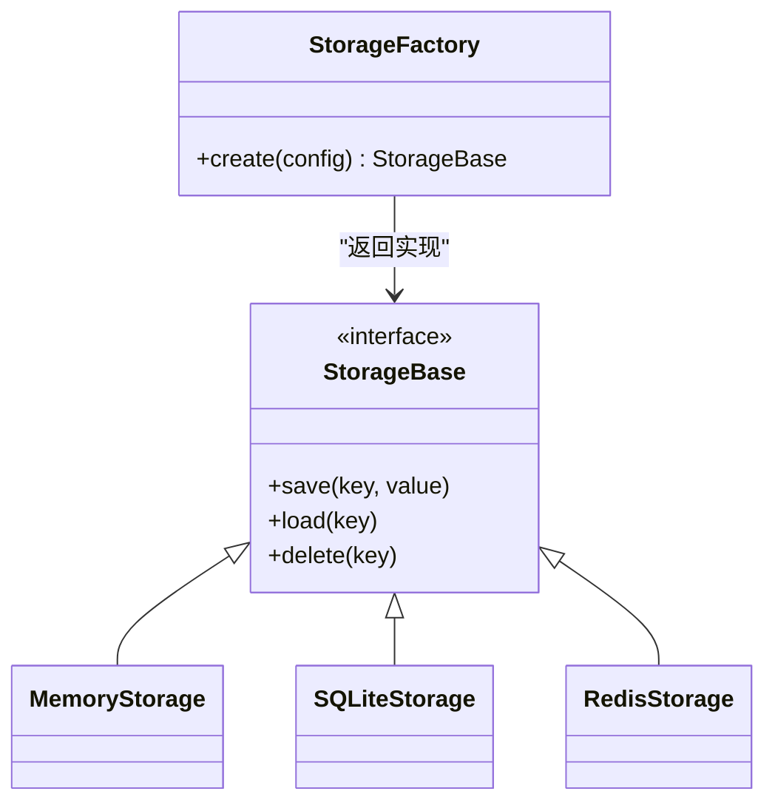
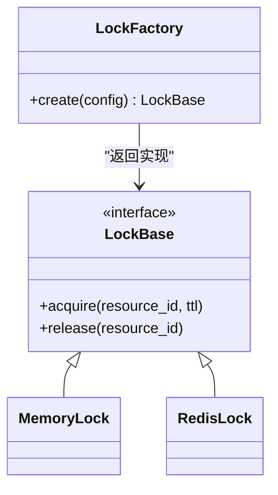
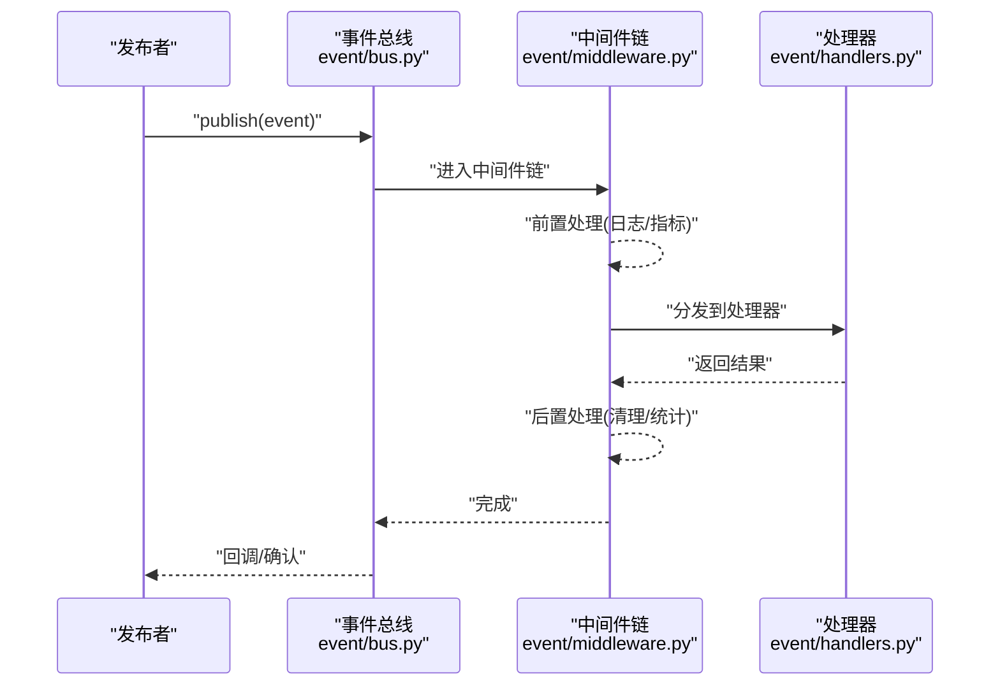
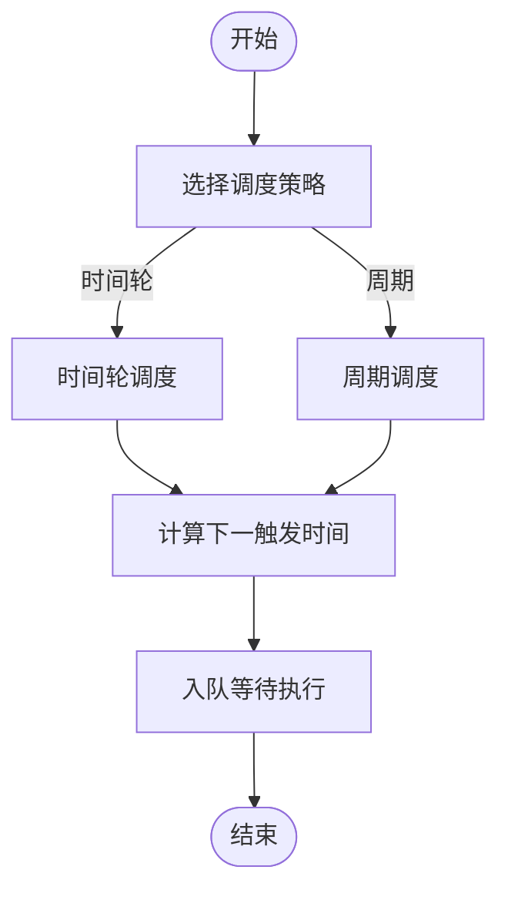
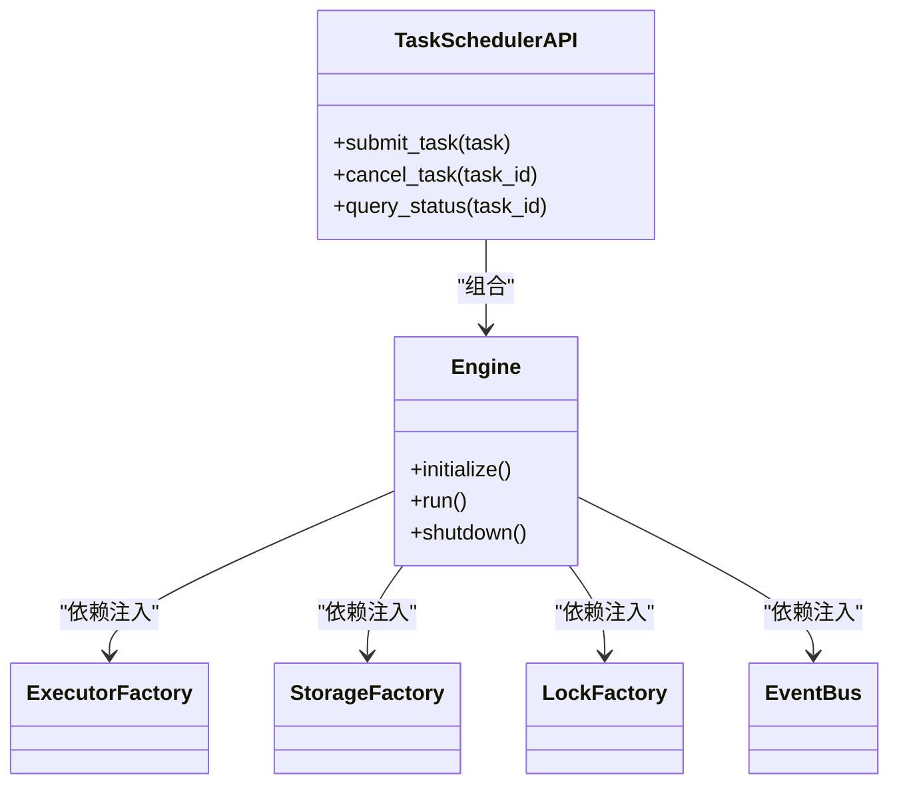
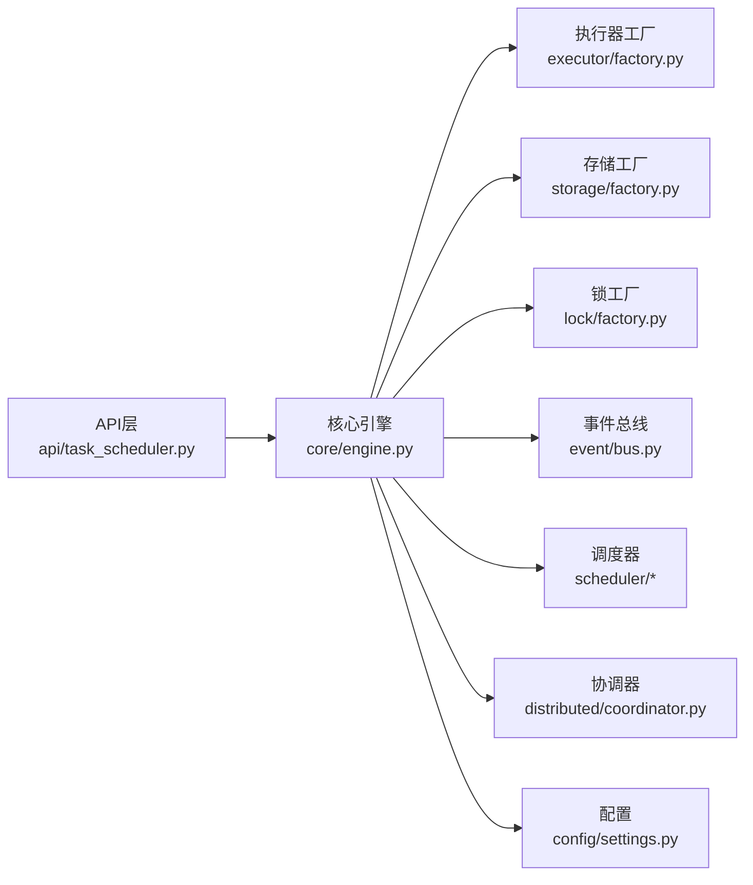

# 设计模式应用

<cite>
**本文引用的文件**   
- [src/neotask/executor/factory.py](file://src/neotask/executor/factory.py)
- [src/neotask/executor/base.py](file://src/neotask/executor/base.py)
- [src/neotask/executor/thread_executor.py](file://src/neotask/executor/thread_executor.py)
- [src/neotask/executor/process_executor.py](file://src/neotask/executor/process_executor.py)
- [src/neotask/executor/async_executor.py](file://src/neotask/executor/async_executor.py)
- [src/neotask/storage/factory.py](file://src/neotask/storage/factory.py)
- [src/neotask/storage/base.py](file://src/neotask/storage/base.py)
- [src/neotask/storage/memory.py](file://src/neotask/storage/memory.py)
- [src/neotask/storage/redis.py](file://src/neotask/storage/redis.py)
- [src/neotask/storage/sqlite.py](file://src/neotask/storage/sqlite.py)
- [src/neotask/lock/factory.py](file://src/neotask/lock/factory.py)
- [src/neotask/lock/base.py](file://src/neotask/lock/base.py)
- [src/neotask/lock/memory.py](file://src/neotask/lock/memory.py)
- [src/neotask/lock/redis.py](file://src/neotask/lock/redis.py)
- [src/neotask/event/bus.py](file://src/neotask/event/bus.py)
- [src/neotask/event/handlers.py](file://src/neotask/event/handlers.py)
- [src/neotask/event/middleware.py](file://src/neotask/event/middleware.py)
- [src/neotask/scheduler/time_wheel.py](file://src/neotask/scheduler/time_wheel.py)
- [src/neotask/scheduler/periodic.py](file://src/neotask/scheduler/periodic.py)
- [src/neotask/config/settings.py](file://src/neotask/config/settings.py)
- [src/neotask/distributed/coordinator.py](file://src/neotask/distributed/coordinator.py)
- [src/neotask/core/engine.py](file://src/neotask/core/engine.py)
- [src/neotask/worker/strategy.py](file://src/neotask/worker/strategy.py)
- [src/neotask/api/task_scheduler.py](file://src/neotask/api/task_scheduler.py)
</cite>

## 目录
1. [引言](#引言)
2. [项目结构](#项目结构)
3. [核心组件](#核心组件)
4. [架构总览](#架构总览)
5. [详细组件分析](#详细组件分析)
6. [依赖关系分析](#依赖关系分析)
7. [性能考量](#性能考量)
8. [故障排查指南](#故障排查指南)
9. [结论](#结论)
10. [附录](#附录)

## 引言
本文件系统性梳理任务调度管理器在设计模式与架构原则上的实践，重点覆盖：
- 工厂模式在执行器、存储、锁等可插拔组件中的统一创建策略
- 抽象接口驱动的插件化架构
- 观察者模式在事件系统中的发布订阅与中间件机制
- 策略模式在调度算法与执行策略中的应用
- 单例模式在全局配置与协调器中的使用
- 依赖注入与组合模式在组件装配中的作用
- 设计模式选择的决策依据与扩展开发最佳实践

## 项目结构
本项目采用分层与领域模块结合的目录组织方式：
- core：运行时引擎、上下文、生命周期等核心能力
- executor：执行器族（线程、进程、异步）
- storage：存储后端（内存、SQLite、Redis）
- lock：分布式锁实现（内存、Redis）
- event：事件总线、处理器与中间件
- scheduler：时间轮、周期任务调度
- distributed：节点、分片、协调器
- config：全局配置
- worker：工作池、预取、回收、策略
- api/web/cli：对外暴露的API、Web界面与命令行入口

```mermaid
graph TB
subgraph "核心"
engine["引擎<br/>core/engine.py"]
ctx["上下文<br/>core/context.py"]
lifecycle["生命周期<br/>core/lifecycle.py"]
end
subgraph "执行层"
exec_base["执行器基类<br/>executor/base.py"]
exec_thread["线程执行器<br/>executor/thread_executor.py"]
exec_process["进程执行器<br/>executor/process_executor.py"]
exec_async["异步执行器<br/>executor/async_executor.py"]
exec_factory["执行器工厂<br/>executor/factory.py"]
end
subgraph "存储层"
store_base["存储基类<br/>storage/base.py"]
store_memory["内存存储<br/>storage/memory.py"]
store_sqlite["SQLite存储<br/>storage/sqlite.py"]
store_redis["Redis存储<br/>storage/redis.py"]
store_factory["存储工厂<br/>storage/factory.py"]
end
subgraph "锁服务"
lock_base["锁基类<br/>lock/base.py"]
lock_memory["内存锁<br/>lock/memory.py"]
lock_redis["Redis锁<br/>lock/redis.py"]
lock_factory["锁工厂<br/>lock/factory.py"]
end
subgraph "事件系统"
bus["事件总线<br/>event/bus.py"]
handlers["处理器<br/>event/handlers.py"]
middleware["中间件<br/>event/middleware.py"]
end
subgraph "调度器"
time_wheel["时间轮<br/>scheduler/time_wheel.py"]
periodic["周期调度<br/>scheduler/periodic.py"]
end
subgraph "分布式"
coordinator["协调器<br/>distributed/coordinator.py"]
end
subgraph "配置"
settings["全局配置<br/>config/settings.py"]
end
engine --> exec_factory
engine --> store_factory
engine --> lock_factory
engine --> bus
engine --> time_wheel
engine --> periodic
engine --> coordinator
exec_factory --> exec_base
exec_thread --> exec_base
exec_process --> exec_base
exec_async --> exec_base
store_factory --> store_base
store_memory --> store_base
store_sqlite --> store_base
store_redis --> store_base
lock_factory --> lock_base
lock_memory --> lock_base
lock_redis --> lock_base
bus --> handlers
bus --> middleware
settings --> engine
```

图表来源
- [src/neotask/core/engine.py](file://src/neotask/core/engine.py)
- [src/neotask/executor/factory.py](file://src/neotask/executor/factory.py)
- [src/neotask/storage/factory.py](file://src/neotask/storage/factory.py)
- [src/neotask/lock/factory.py](file://src/neotask/lock/factory.py)
- [src/neotask/event/bus.py](file://src/neotask/event/bus.py)
- [src/neotask/scheduler/time_wheel.py](file://src/neotask/scheduler/time_wheel.py)
- [src/neotask/scheduler/periodic.py](file://src/neotask/scheduler/periodic.py)
- [src/neotask/distributed/coordinator.py](file://src/neotask/distributed/coordinator.py)
- [src/neotask/config/settings.py](file://src/neotask/config/settings.py)

章节来源
- [src/neotask/core/engine.py](file://src/neotask/core/engine.py)
- [src/neotask/config/settings.py](file://src/neotask/config/settings.py)

## 核心组件
- 执行器族：通过统一抽象接口定义任务执行契约，提供线程、进程、异步三种实现，并由工厂按配置选择。
- 存储层：以统一接口封装持久化能力，支持内存、SQLite、Redis，由工厂根据后端类型创建实例。
- 锁服务：提供跨进程/跨节点的互斥语义，内存与Redis两种实现，工厂负责按需装配。
- 事件系统：基于发布-订阅模型，支持中间件链式处理与处理器注册。
- 调度器：时间轮与周期任务调度，结合策略模式选择不同调度算法。
- 协调器：分布式场景下的节点管理与主从选举，常以单例形式提供全局访问点。
- 全局配置：集中管理运行参数，通常以单例或容器对象形式被各模块读取。

章节来源
- [src/neotask/executor/base.py](file://src/neotask/executor/base.py)
- [src/neotask/storage/base.py](file://src/neotask/storage/base.py)
- [src/neotask/lock/base.py](file://src/neotask/lock/base.py)
- [src/neotask/event/bus.py](file://src/neotask/event/bus.py)
- [src/neotask/scheduler/time_wheel.py](file://src/neotask/scheduler/time_wheel.py)
- [src/neotask/distributed/coordinator.py](file://src/neotask/distributed/coordinator.py)
- [src/neotask/config/settings.py](file://src/neotask/config/settings.py)

## 架构总览
整体架构遵循“接口抽象 + 工厂装配 + 事件驱动 + 策略可选”的原则：
- 所有可替换组件均定义清晰接口，并通过工厂方法按配置动态创建
- 事件总线贯穿系统，用于解耦子系统间的通信
- 调度与执行分离，策略模式允许在不同场景下切换算法
- 协调器与配置作为全局基础设施，为上层提供稳定支撑

图表来源
- [src/neotask/core/engine.py](file://src/neotask/core/engine.py)
- [src/neotask/executor/factory.py](file://src/neotask/executor/factory.py)
- [src/neotask/storage/factory.py](file://src/neotask/storage/factory.py)
- [src/neotask/lock/factory.py](file://src/neotask/lock/factory.py)
- [src/neotask/event/bus.py](file://src/neotask/event/bus.py)
- [src/neotask/config/settings.py](file://src/neotask/config/settings.py)

## 详细组件分析

### 工厂模式：执行器、存储、锁的统一创建
- 目标：屏蔽具体实现差异，按配置动态创建组件，降低耦合度，提升可扩展性
- 关键要点：
  - 每个子域定义统一的抽象接口（如执行器基类、存储基类、锁基类）
  - 工厂方法接收配置项，解析并返回对应实现实例
  - 新增实现只需注册到工厂，无需修改调用方

图表来源
- [src/neotask/executor/base.py](file://src/neotask/executor/base.py)
- [src/neotask/executor/thread_executor.py](file://src/neotask/executor/thread_executor.py)
- [src/neotask/executor/process_executor.py](file://src/neotask/executor/process_executor.py)
- [src/neotask/executor/async_executor.py](file://src/neotask/executor/async_executor.py)
- [src/neotask/executor/factory.py](file://src/neotask/executor/factory.py)

图表来源
- [src/neotask/storage/base.py](file://src/neotask/storage/base.py)
- [src/neotask/storage/memory.py](file://src/neotask/storage/memory.py)
- [src/neotask/storage/sqlite.py](file://src/neotask/storage/sqlite.py)
- [src/neotask/storage/redis.py](file://src/neotask/storage/redis.py)
- [src/neotask/storage/factory.py](file://src/neotask/storage/factory.py)

图表来源
- [src/neotask/lock/base.py](file://src/neotask/lock/base.py)
- [src/neotask/lock/memory.py](file://src/neotask/lock/memory.py)
- [src/neotask/lock/redis.py](file://src/neotask/lock/redis.py)
- [src/neotask/lock/factory.py](file://src/neotask/lock/factory.py)

章节来源
- [src/neotask/executor/factory.py](file://src/neotask/executor/factory.py)
- [src/neotask/storage/factory.py](file://src/neotask/storage/factory.py)
- [src/neotask/lock/factory.py](file://src/neotask/lock/factory.py)

### 抽象接口与插件化架构
- 通过基类或协议定义稳定的接口契约，确保不同实现可互换
- 插件化体现在：
  - 新增执行器/存储/锁实现时，仅需注册到对应工厂
  - 上层仅依赖接口，不感知具体实现
  - 配置驱动的选择机制使部署环境灵活切换

章节来源
- [src/neotask/executor/base.py](file://src/neotask/executor/base.py)
- [src/neotask/storage/base.py](file://src/neotask/storage/base.py)
- [src/neotask/lock/base.py](file://src/neotask/lock/base.py)

### 观察者模式：事件系统与中间件
- 事件总线提供发布/订阅能力，支持多处理器并行或串行处理
- 中间件模式对事件进行横切处理（如日志、指标、重试、限流）
- 典型流程：
  - 发布者向总线发送事件
  - 总线按注册顺序依次调用中间件链
  - 最终到达业务处理器

图表来源
- [src/neotask/event/bus.py](file://src/neotask/event/bus.py)
- [src/neotask/event/middleware.py](file://src/neotask/event/middleware.py)
- [src/neotask/event/handlers.py](file://src/neotask/event/handlers.py)

章节来源
- [src/neotask/event/bus.py](file://src/neotask/event/bus.py)
- [src/neotask/event/middleware.py](file://src/neotask/event/middleware.py)
- [src/neotask/event/handlers.py](file://src/neotask/event/handlers.py)

### 策略模式：调度算法与执行策略
- 时间轮调度：将任务按到期时间桶化，适合高吞吐定时任务
- 周期调度：按固定频率或Cron表达式生成下一次触发时间
- 执行策略：不同工作池策略（如最少负载、轮询、亲和分配）

图表来源
- [src/neotask/scheduler/time_wheel.py](file://src/neotask/scheduler/time_wheel.py)
- [src/neotask/scheduler/periodic.py](file://src/neotask/scheduler/periodic.py)

章节来源
- [src/neotask/scheduler/time_wheel.py](file://src/neotask/scheduler/time_wheel.py)
- [src/neotask/scheduler/periodic.py](file://src/neotask/scheduler/periodic.py)
- [src/neotask/worker/strategy.py](file://src/neotask/worker/strategy.py)

### 单例模式：全局配置与协调器
- 全局配置：提供单一配置源，避免重复加载与不一致
- 协调器：在分布式场景中维护节点状态与主从关系，通常以单例形式提供全局访问点

章节来源
- [src/neotask/config/settings.py](file://src/neotask/config/settings.py)
- [src/neotask/distributed/coordinator.py](file://src/neotask/distributed/coordinator.py)

### 依赖注入与组合模式：组件装配
- 依赖注入：通过工厂或容器将执行器、存储、锁等依赖注入到引擎或控制器
- 组合模式：将复杂子系统（如调度+队列+执行器）组合为更高阶的服务，对外暴露简洁接口

图表来源
- [src/neotask/api/task_scheduler.py](file://src/neotask/api/task_scheduler.py)
- [src/neotask/core/engine.py](file://src/neotask/core/engine.py)
- [src/neotask/executor/factory.py](file://src/neotask/executor/factory.py)
- [src/neotask/storage/factory.py](file://src/neotask/storage/factory.py)
- [src/neotask/lock/factory.py](file://src/neotask/lock/factory.py)
- [src/neotask/event/bus.py](file://src/neotask/event/bus.py)

章节来源
- [src/neotask/api/task_scheduler.py](file://src/neotask/api/task_scheduler.py)
- [src/neotask/core/engine.py](file://src/neotask/core/engine.py)

## 依赖关系分析
- 低耦合：各子域通过接口与工厂解耦，新增实现不影响既有代码
- 内聚性：每个模块职责单一，便于测试与维护
- 外部依赖：Redis、SQLite等通过工厂隔离，便于替换与模拟

图表来源
- [src/neotask/api/task_scheduler.py](file://src/neotask/api/task_scheduler.py)
- [src/neotask/core/engine.py](file://src/neotask/core/engine.py)
- [src/neotask/executor/factory.py](file://src/neotask/executor/factory.py)
- [src/neotask/storage/factory.py](file://src/neotask/storage/factory.py)
- [src/neotask/lock/factory.py](file://src/neotask/lock/factory.py)
- [src/neotask/event/bus.py](file://src/neotask/event/bus.py)
- [src/neotask/scheduler/time_wheel.py](file://src/neotask/scheduler/time_wheel.py)
- [src/neotask/distributed/coordinator.py](file://src/neotask/distributed/coordinator.py)
- [src/neotask/config/settings.py](file://src/neotask/config/settings.py)

章节来源
- [src/neotask/core/engine.py](file://src/neotask/core/engine.py)
- [src/neotask/config/settings.py](file://src/neotask/config/settings.py)

## 性能考量
- 执行器选择：CPU密集型优先进程执行器，IO密集型优先线程或异步执行器
- 存储后端：高频读写场景建议Redis；轻量单机可用SQLite或内存
- 锁粒度：尽量缩小锁范围与TTL，避免热点资源竞争
- 事件中间件：避免在中间件中进行阻塞I/O，必要时异步化处理
- 调度算法：时间轮在高并发定时任务中具备更优的时间复杂度

[本节为通用指导，不涉及具体文件分析]

## 故障排查指南
- 事件未触发：检查事件总线注册是否成功、中间件链是否提前中断
- 执行失败：查看执行器日志与异常类型，确认任务参数与资源权限
- 锁冲突：核对资源ID命名规范与TTL设置，避免死锁
- 存储异常：验证后端连接与权限，关注超时与重试策略
- 调度延迟：评估时间轮桶大小与周期任务的生成频率

章节来源
- [src/neotask/event/bus.py](file://src/neotask/event/bus.py)
- [src/neotask/executor/base.py](file://src/neotask/executor/base.py)
- [src/neotask/lock/base.py](file://src/neotask/lock/base.py)
- [src/neotask/storage/base.py](file://src/neotask/storage/base.py)
- [src/neotask/scheduler/time_wheel.py](file://src/neotask/scheduler/time_wheel.py)

## 结论
本项目通过工厂模式、抽象接口、观察者模式、策略模式、单例模式以及依赖注入与组合模式的综合应用，构建了高内聚、低耦合、易扩展的任务调度系统。面向未来扩展，建议：
- 持续完善工厂注册表与配置校验
- 强化事件中间件的错误恢复与幂等性
- 引入更多调度与执行策略，并提供基准测试对比
- 保持接口稳定，遵循开闭原则进行增量演进

[本节为总结性内容，不涉及具体文件分析]

## 附录
- 扩展新执行器：继承执行器基类，实现必要方法，并在工厂中注册
- 扩展新存储：实现存储基类接口，更新工厂映射，补充单元测试
- 扩展新锁：实现锁基类接口，考虑并发与超时边界条件
- 扩展事件中间件：实现中间件协议，注册到总线中间件链
- 扩展调度策略：实现策略接口，接入调度器选择逻辑

[本节为概念性指导，不涉及具体文件分析]