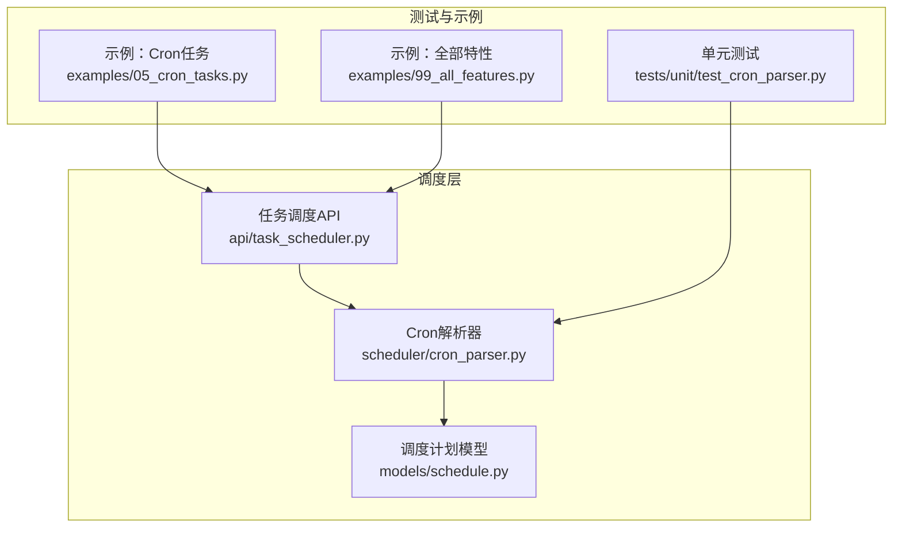
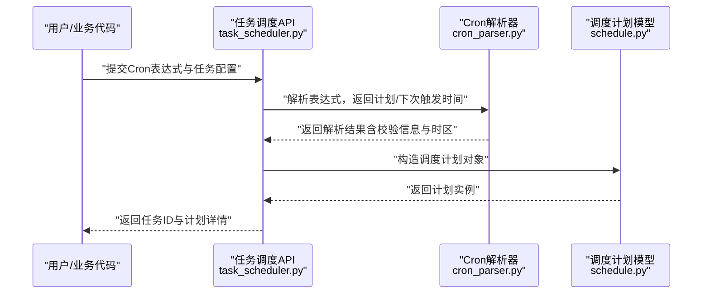
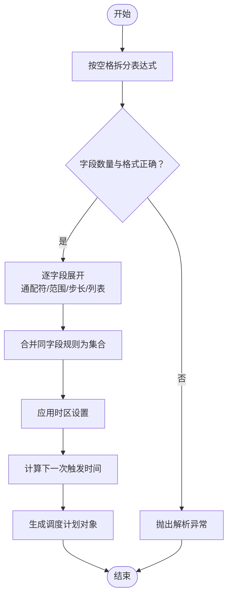
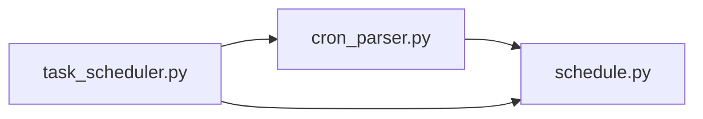

# Cron表达式解析器

<cite>
**本文引用的文件**   
- [cron_parser.py](file://src/neotask/scheduler/cron_parser.py)
- [schedule.py](file://src/neotask/models/schedule.py)
- [task_scheduler.py](file://src/neotask/api/task_scheduler.py)
- [test_cron_parser.py](file://tests/unit/test_cron_parser.py)
- [05_cron_tasks.py](file://examples/05_cron_tasks.py)
- [99_all_features.py](file://examples/99_all_features.py)
</cite>

## 目录
1. [简介](#简介)
2. [项目结构](#项目结构)
3. [核心组件](#核心组件)
4. [架构总览](#架构总览)
5. [详细组件分析](#详细组件分析)
6. [依赖分析](#依赖分析)
7. [性能考虑](#性能考虑)
8. [故障排查指南](#故障排查指南)
9. [结论](#结论)
10. [附录](#附录)

## 简介
本文件围绕任务调度管理器中的Cron表达式解析器，系统性阐述其语法规则、字段格式、特殊字符与范围步长处理、时区与夏令时支持、验证与错误处理策略、从表达式到可执行调度计划的转换流程，以及性能优化与缓存机制。文档同时提供丰富的示例与常见用法模式，帮助读者快速掌握并高效使用该解析器。

## 项目结构
与Cron解析相关的代码主要位于调度模块与模型层：
- 解析器实现：scheduler/cron_parser.py
- 调度计划模型：models/schedule.py
- 上层调度API集成：api/task_scheduler.py
- 单元测试：tests/unit/test_cron_parser.py
- 使用示例：examples/05_cron_tasks.py、examples/99_all_features.py

图表来源
- [cron_parser.py](file://src/neotask/scheduler/cron_parser.py)
- [schedule.py](file://src/neotask/models/schedule.py)
- [task_scheduler.py](file://src/neotask/api/task_scheduler.py)
- [test_cron_parser.py](file://tests/unit/test_cron_parser.py)
- [05_cron_tasks.py](file://examples/05_cron_tasks.py)
- [99_all_features.py](file://examples/99_all_features.py)

章节来源
- [cron_parser.py](file://src/neotask/scheduler/cron_parser.py)
- [schedule.py](file://src/neotask/models/schedule.py)
- [task_scheduler.py](file://src/neotask/api/task_scheduler.py)
- [test_cron_parser.py](file://tests/unit/test_cron_parser.py)
- [05_cron_tasks.py](file://examples/05_cron_tasks.py)
- [99_all_features.py](file://examples/99_all_features.py)

## 核心组件
- Cron解析器（scheduler/cron_parser.py）
  - 负责将字符串形式的Cron表达式解析为内部表示，包括字段校验、特殊字符与范围/步长/列表的展开、下一触发时间计算等。
  - 输出供上层调度使用的“调度计划”对象或下一次触发时间点。
- 调度计划模型（models/schedule.py）
  - 定义调度计划的数据结构与元数据，如表达式、时区、下次触发时间、状态等。
- 任务调度API（api/task_scheduler.py）
  - 对外暴露创建、查询、更新、删除定时任务的接口；在创建/更新时调用解析器生成调度计划，并在运行时根据计划触发任务。

章节来源
- [cron_parser.py](file://src/neotask/scheduler/cron_parser.py)
- [schedule.py](file://src/neotask/models/schedule.py)
- [task_scheduler.py](file://src/neotask/api/task_scheduler.py)

## 架构总览
下图展示了从用户输入Cron表达式到生成可执行调度计划的端到端流程。

图表来源
- [task_scheduler.py](file://src/neotask/api/task_scheduler.py)
- [cron_parser.py](file://src/neotask/scheduler/cron_parser.py)
- [schedule.py](file://src/neotask/models/schedule.py)

## 详细组件分析

### Cron解析器（scheduler/cron_parser.py）
- 语法与字段
  - 标准Cron通常包含分钟、小时、日、月、周几五个字段，部分实现支持秒或年扩展字段。
  - 每个字段支持通配符、数字、范围、步长、列表的组合表达。
- 特殊字符与组合
  - 通配符：用于匹配所有合法值。
  - 范围：形如“起始-结束”，用于连续区间匹配。
  - 步长：形如“*/n”或“a-b/n”，用于间隔匹配。
  - 列表：多个元素以逗号分隔，支持混合范围与步长。
- 解析流程
  - 分词与拆分：按空格分割表达式，提取各字段片段。
  - 字段校验：检查取值范围、格式合法性。
  - 集合展开：将范围、步长、列表转换为具体值的集合或规则描述。
  - 语义合并：对同一字段内的多种表达进行并集合并。
  - 时间计算：基于当前时间与目标时区，计算下一次触发时刻。
- 时区与夏令时
  - 支持显式指定时区；若未指定，采用默认时区。
  - 在跨越夏令时切换边界时，需正确处理缺失或重复的小时，避免漏触发或重复触发。
- 验证与错误处理
  - 对非法字符、越界值、不合法范围/步长组合进行严格校验。
  - 抛出明确的异常类型与消息，便于上层捕获与提示。
- 性能与缓存
  - 对复杂表达式进行预计算与缓存，减少重复解析开销。
  - 对常用模式（如整点、每小时、每日）采用快速路径。
  - 增量更新：当表达式不变时复用已有计划。

图表来源
- [cron_parser.py](file://src/neotask/scheduler/cron_parser.py)

章节来源
- [cron_parser.py](file://src/neotask/scheduler/cron_parser.py)

### 调度计划模型（models/schedule.py）
- 数据结构
  - 包含表达式文本、解析后的字段集合、时区、下次触发时间、状态、创建/更新时间等。
- 用途
  - 作为持久化与传输载体，被调度API与存储层共同使用。
  - 为监控、日志与WebUI展示提供统一视图。

章节来源
- [schedule.py](file://src/neotask/models/schedule.py)

### 任务调度API（api/task_scheduler.py）
- 职责
  - 接收外部请求，调用解析器生成调度计划，并将计划写入存储。
  - 在运行期根据计划驱动任务执行，处理重试、取消、事件通知等。
- 与解析器的交互
  - 创建/更新任务时，传入Cron表达式与可选时区，解析后得到计划。
  - 查询任务时，返回计划详情与最近/下次触发时间。

章节来源
- [task_scheduler.py](file://src/neotask/api/task_scheduler.py)

### 单元测试（tests/unit/test_cron_parser.py）
- 覆盖范围
  - 基本字段校验、特殊字符、范围、步长、列表组合。
  - 边界条件与非法输入的错误分支。
  - 时区与夏令时场景的触发时间计算。
- 价值
  - 保障解析器在不同平台与时区下的稳定性与一致性。

章节来源
- [test_cron_parser.py](file://tests/unit/test_cron_parser.py)

### 使用示例
- 基础Cron任务示例（examples/05_cron_tasks.py）
  - 演示如何以Cron表达式创建周期性任务。
- 全特性示例（examples/99_all_features.py）
  - 综合展示Cron与其他特性的组合用法。

章节来源
- [05_cron_tasks.py](file://examples/05_cron_tasks.py)
- [99_all_features.py](file://examples/99_all_features.py)

## 依赖分析
- 模块耦合
  - 解析器仅依赖模型层提供的数据结构，保持低耦合。
  - 调度API聚合解析器与模型，承担编排职责。
- 外部依赖
  - 时区库与日期时间处理库用于跨平台一致性与夏令时处理。
- 潜在循环依赖
  - 通过分层设计避免循环引用：解析器不反向依赖调度API。

图表来源
- [cron_parser.py](file://src/neotask/scheduler/cron_parser.py)
- [schedule.py](file://src/neotask/models/schedule.py)
- [task_scheduler.py](file://src/neotask/api/task_scheduler.py)

章节来源
- [cron_parser.py](file://src/neotask/scheduler/cron_parser.py)
- [schedule.py](file://src/neotask/models/schedule.py)
- [task_scheduler.py](file://src/neotask/api/task_scheduler.py)

## 性能考虑
- 解析阶段优化
  - 对表达式进行规范化与去重，减少后续计算量。
  - 针对高频模式（如每分钟、每小时、每天）走快速路径。
- 计算阶段优化
  - 缓存“下一次触发时间”，在表达式未变更时复用。
  - 批量计算多任务计划时，利用公共时区与基准时间减少重复操作。
- 内存与并发
  - 控制中间集合大小，避免大列表占用过多内存。
  - 解析过程无共享可变状态，天然线程安全；计划对象不可变以提升并发安全性。

[本节为通用性能建议，无需特定文件来源]

## 故障排查指南
- 常见错误
  - 字段越界：例如分钟超过59、小时超过23、月份不在1-12、周几不在0-6（或1-7，取决于实现）。
  - 非法字符：表达式中包含不支持的符号或拼写错误。
  - 范围/步长不合法：起始大于结束、步长为0或负数、范围与步长组合无效。
  - 时区无效：传入的时区标识不存在或与系统不一致。
- 定位方法
  - 查看解析器抛出的异常类型与消息，确认具体字段与位置。
  - 使用单元测试中覆盖的边界用例进行对照验证。
  - 在调度API层打印计划对象的字段集合与下次触发时间，辅助定位问题。
- 修复建议
  - 修正字段取值或表达式语法。
  - 明确指定有效时区，避免依赖默认时区导致的不一致。
  - 对复杂表达式逐步简化，分段验证后再组合。

章节来源
- [test_cron_parser.py](file://tests/unit/test_cron_parser.py)
- [cron_parser.py](file://src/neotask/scheduler/cron_parser.py)

## 结论
该Cron表达式解析器通过严格的语法校验、灵活的集合展开与高效的计算路径，实现了从表达式到可执行调度计划的稳定转换。结合清晰的模型定义与上层调度API，整体架构具备良好的可扩展性与可维护性。在生产环境中，建议配合完善的单元测试与监控指标，持续保障解析准确性与性能表现。

[本节为总结性内容，无需特定文件来源]

## 附录

### 语法规则与字段说明
- 字段顺序与含义
  - 分钟（0-59）、小时（0-23）、日（1-31）、月（1-12）、周几（0-6或1-7，依实现而定）。
- 支持元素
  - 通配符：匹配所有合法值。
  - 数字：精确匹配。
  - 范围：起始-结束，闭区间。
  - 步长：*/n 或 a-b/n，表示每隔n个单位。
  - 列表：多个元素以逗号分隔，可与范围/步长混用。
- 典型模式
  - 每分钟：* * * * *
  - 每小时：0 * * * *
  - 每天零点：0 0 * * *
  - 工作日每8小时：0 0,8,16 * * 1-5
  - 每月最后一天：0 0 L * *（若支持L）
  - 每年1月1日零点：0 0 1 1 *

[本节为概念性说明，无需特定文件来源]

### 时区与夏令时处理
- 时区选择
  - 优先使用显式指定的时区；未指定时使用默认时区。
- 夏令时边界
  - 向前跳转（时钟拨快）：跳过不存在的时间段，避免误触发。
  - 向后跳转（时钟拨慢）：对重复时间段进行去重或按策略处理，防止重复触发。
- 建议
  - 在跨时区部署时，统一使用UTC存储与展示，仅在必要时转换为用户本地时区。

[本节为概念性说明，无需特定文件来源]

### 验证规则与错误处理策略
- 验证规则
  - 字段数量必须匹配表达式定义的字段数。
  - 每个字段的取值必须在合法范围内。
  - 范围起始不得大于结束；步长必须为正整数。
  - 列表元素必须为数字、范围或步长的合法组合。
- 错误处理
  - 解析失败时抛出明确异常，包含字段索引与原因。
  - 上层捕获异常后记录日志并返回友好提示。
  - 对于可恢复的错误（如时区无效），提供回退策略或拒绝创建任务。

章节来源
- [cron_parser.py](file://src/neotask/scheduler/cron_parser.py)
- [test_cron_parser.py](file://tests/unit/test_cron_parser.py)

### 示例与常见用法模式
- 基础示例
  - 参考：[05_cron_tasks.py](file://examples/05_cron_tasks.py)
- 高级示例
  - 参考：[99_all_features.py](file://examples/99_all_features.py)

章节来源
- [05_cron_tasks.py](file://examples/05_cron_tasks.py)
- [99_all_features.py](file://examples/99_all_features.py)