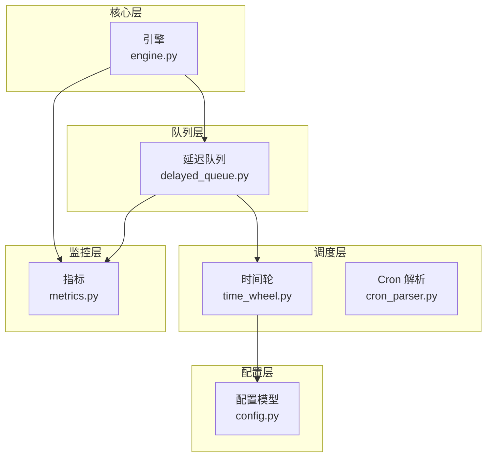
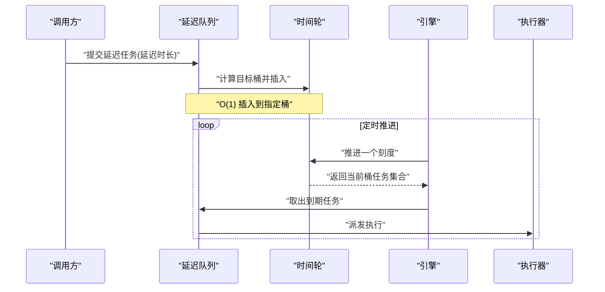
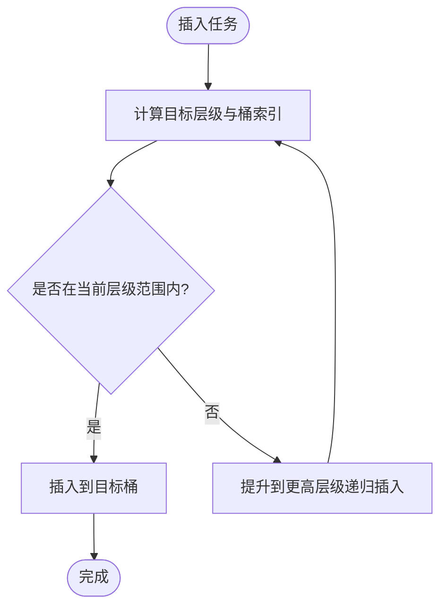
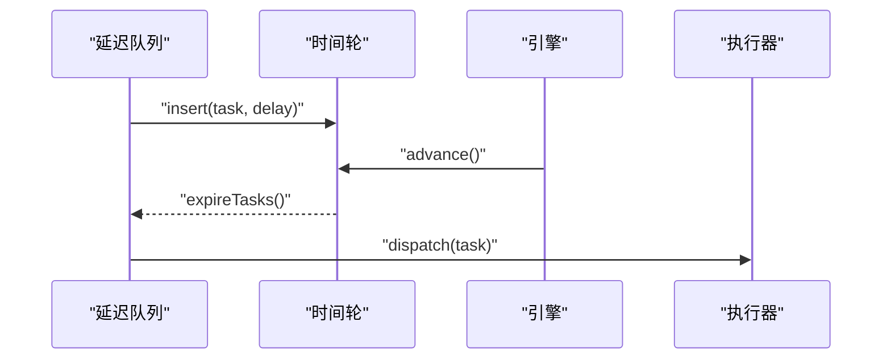
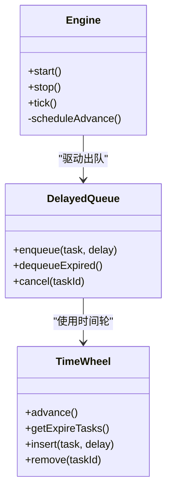

# 时间轮算法实现

<cite>
**本文引用的文件**   
- [src/neotask/scheduler/time_wheel.py](file://src/neotask/scheduler/time_wheel.py)
- [tests/unit/test_time_wheel.py](file://tests/unit/test_time_wheel.py)
- [src/neotask/queue/delayed_queue.py](file://src/neotask/queue/delayed_queue.py)
- [src/neotask/core/engine.py](file://src/neotask/core/engine.py)
- [src/neotask/models/config.py](file://src/neotask/models/config.py)
- [src/neotask/monitor/metrics.py](file://src/neotask/monitor/metrics.py)
- [examples/06_delayed_tasks.py](file://examples/06_delayed_tasks.py)
</cite>

## 目录
1. [简介](#简介)
2. [项目结构](#项目结构)
3. [核心组件](#核心组件)
4. [架构总览](#架构总览)
5. [详细组件分析](#详细组件分析)
6. [依赖分析](#依赖分析)
7. [性能考虑](#性能考虑)
8. [故障排查指南](#故障排查指南)
9. [结论](#结论)
10. [附录](#附录)

## 简介
本文件围绕时间轮（Time Wheel）调度算法的实现与优化展开，结合仓库中的具体代码，系统阐述：
- 时间轮的数据结构设计：多层时间轮、桶分配机制、指针移动算法
- 在任务调度中的应用场景与优势
- 插入、删除、查询操作的时间复杂度分析
- 与堆/优先级队列的对比
- 配置参数调优指南与最佳实践
- 运行时内存占用分析与性能监控指标

## 项目结构
本项目采用分层模块化组织，时间轮位于调度层，向上被引擎和延迟队列使用，向下通过模型配置驱动。关键路径如下：
- 调度器层：时间轮实现与周期任务解析
- 队列层：延迟队列基于时间轮进行到期任务出队
- 核心层：引擎驱动时间轮推进与任务分发
- 配置层：时间轮容量、层级、刻度等参数
- 监控层：指标采集与上报

图表来源
- [src/neotask/scheduler/time_wheel.py](file://src/neotask/scheduler/time_wheel.py)
- [src/neotask/queue/delayed_queue.py](file://src/neotask/queue/delayed_queue.py)
- [src/neotask/core/engine.py](file://src/neotask/core/engine.py)
- [src/neotask/models/config.py](file://src/neotask/models/config.py)
- [src/neotask/monitor/metrics.py](file://src/neotask/monitor/metrics.py)

章节来源
- [src/neotask/scheduler/time_wheel.py](file://src/neotask/scheduler/time_wheel.py)
- [src/neotask/queue/delayed_queue.py](file://src/neotask/queue/delayed_queue.py)
- [src/neotask/core/engine.py](file://src/neotask/core/engine.py)
- [src/neotask/models/config.py](file://src/neotask/models/config.py)
- [src/neotask/monitor/metrics.py](file://src/neotask/monitor/metrics.py)

## 核心组件
- 时间轮（TimeWheel）
  - 维护多级环形数组（桶），每级桶容量与步长不同，形成“秒级/分钟级/小时级”等多层结构
  - 当前指针指向即将到期的桶；推进时按步长移动指针，并将溢出桶的任务下沉到下一级
- 延迟队列（DelayedQueue）
  - 对外提供延迟入队接口，内部将任务映射到时间轮的对应桶中
  - 周期性从当前桶取任务并交给上层执行器
- 引擎（Engine）
  - 驱动时间轮推进，协调延迟队列出队与任务派发
- 配置（Config）
  - 控制时间轮层级数量、每级桶容量、刻度大小、最大延迟范围等
- 指标（Metrics）
  - 记录插入/删除/推进耗时、桶命中率、任务积压等

章节来源
- [src/neotask/scheduler/time_wheel.py](file://src/neotask/scheduler/time_wheel.py)
- [src/neotask/queue/delayed_queue.py](file://src/neotask/queue/delayed_queue.py)
- [src/neotask/core/engine.py](file://src/neotask/core/engine.py)
- [src/neotask/models/config.py](file://src/neotask/models/config.py)
- [src/neotask/monitor/metrics.py](file://src/neotask/monitor/metrics.py)

## 架构总览
时间轮作为延迟任务的核心数据结构，配合延迟队列与引擎形成稳定的调度流水线。

图表来源
- [src/neotask/queue/delayed_queue.py](file://src/neotask/queue/delayed_queue.py)
- [src/neotask/scheduler/time_wheel.py](file://src/neotask/scheduler/time_wheel.py)
- [src/neotask/core/engine.py](file://src/neotask/core/engine.py)

## 详细组件分析

### 时间轮数据结构与算法
- 多层环形数组设计
  - 第 i 级桶容量为 capacity_i，步长为 step_i = capacity_{i-1} * step_{i-1}
  - 典型配置：一级桶容量=60（秒级）、二级桶容量=60（分钟级）、三级桶容量=24（小时级）
  - 最大可表示延迟 ≈ step_{last} * capacity_{last}
- 桶分配机制
  - 给定延迟 t，逐级确定目标层级与桶索引：index = (base + floor(t / step)) % capacity
  - 若 t 超出当前层级范围，则下沉至更高层级
- 指针移动算法
  - 每次推进 advance() 将当前指针前进一步
  - 若当前桶为空，直接继续推进
  - 若当前桶非空，遍历桶内任务，对仍超时的任务下沉到下一层；已到期的任务返回给上层
- 插入/删除/查询复杂度
  - 插入：O(1)，定位桶后追加
  - 删除：O(1)，桶内通常以链表或双向链式容器管理，支持常数时间移除
  - 查询/到期获取：摊销 O(1)，仅处理当前桶任务
- 下沉与溢出
  - 当任务延迟超过当前层级覆盖范围时，自动提升到更高层级，保证时间轮能表达更大范围的延迟

图表来源
- [src/neotask/scheduler/time_wheel.py](file://src/neotask/scheduler/time_wheel.py)

章节来源
- [src/neotask/scheduler/time_wheel.py](file://src/neotask/scheduler/time_wheel.py)

### 延迟队列与时间轮集成
- 入队流程
  - 接收延迟时长，委托时间轮计算目标桶并插入
  - 记录任务元数据（如 ID、回调、重试策略等）
- 出队流程
  - 引擎推进时间轮后，延迟队列从当前桶拉取到期任务
  - 将任务交由执行器异步执行
- 取消与重排
  - 支持根据任务标识从桶中删除
  - 支持修改延迟后重新插入（先删后插）

图表来源
- [src/neotask/queue/delayed_queue.py](file://src/neotask/queue/delayed_queue.py)
- [src/neotask/core/engine.py](file://src/neotask/core/engine.py)
- [src/neotask/scheduler/time_wheel.py](file://src/neotask/scheduler/time_wheel.py)

章节来源
- [src/neotask/queue/delayed_queue.py](file://src/neotask/queue/delayed_queue.py)
- [src/neotask/core/engine.py](file://src/neotask/core/engine.py)
- [src/neotask/scheduler/time_wheel.py](file://src/neotask/scheduler/time_wheel.py)

### 引擎驱动与生命周期
- 引擎负责：
  - 启动后台推进循环，按固定节拍调用时间轮 advance()
  - 收集到期任务并分发给执行器
  - 监控运行状态与异常恢复
- 与延迟队列协作：
  - 引擎推进后通知延迟队列拉取任务
  - 支持优雅关闭与任务持久化（可选）

图表来源
- [src/neotask/core/engine.py](file://src/neotask/core/engine.py)
- [src/neotask/queue/delayed_queue.py](file://src/neotask/queue/delayed_queue.py)
- [src/neotask/scheduler/time_wheel.py](file://src/neotask/scheduler/time_wheel.py)

章节来源
- [src/neotask/core/engine.py](file://src/neotask/core/engine.py)
- [src/neotask/queue/delayed_queue.py](file://src/neotask/queue/delayed_queue.py)
- [src/neotask/scheduler/time_wheel.py](file://src/neotask/scheduler/time_wheel.py)

### 配置参数与调优
- 关键参数
  - 层级数：决定最大可表示延迟与内存开销
  - 每级桶容量：影响桶遍历成本与空间占用
  - 刻度大小：推进粒度，越小越精确但 CPU 开销越大
  - 最大延迟上限：由最高层级步长与容量共同决定
- 调优建议
  - 高吞吐短延迟场景：增大低层桶容量，减小刻度，降低推进频率
  - 长尾延迟场景：增加层级或提高高层桶容量，避免频繁下沉
  - 内存敏感场景：减少层级与桶容量，权衡最大延迟范围
- 参考示例
  - 示例脚本展示了如何设置延迟任务与时间轮相关参数

章节来源
- [src/neotask/models/config.py](file://src/neotask/models/config.py)
- [examples/06_delayed_tasks.py](file://examples/06_delayed_tasks.py)

### 与其他调度算法的性能对比
- 时间轮 vs 最小堆/优先级队列
  - 插入：时间轮 O(1)，堆 O(log N)
  - 删除：时间轮 O(1)（桶内结构），堆 O(log N)
  - 到期获取：时间轮摊销 O(1)，堆 O(1) 弹出最小值但需维护堆不变式
  - 批量推进：时间轮按桶顺序扫描，局部性好；堆需多次弹出
- 适用场景
  - 时间轮适合大规模、均匀分布的延迟任务
  - 堆更适合动态优先级变化频繁的通用优先队列

[本节为概念性对比，不直接分析具体文件]

## 依赖分析
- 模块耦合
  - 延迟队列强依赖时间轮用于到期判定
  - 引擎弱依赖延迟队列与时间轮，通过接口交互
  - 配置模型为时间轮提供运行时参数
  - 指标模块采集各组件关键指标
- 外部依赖
  - 执行器（线程/进程/异步）
  - 存储（可选持久化）
  - 网络（可选分布式扩展）

图表来源
- [src/neotask/models/config.py](file://src/neotask/models/config.py)
- [src/neotask/scheduler/time_wheel.py](file://src/neotask/scheduler/time_wheel.py)
- [src/neotask/queue/delayed_queue.py](file://src/neotask/queue/delayed_queue.py)
- [src/neotask/core/engine.py](file://src/neotask/core/engine.py)
- [src/neotask/monitor/metrics.py](file://src/neotask/monitor/metrics.py)

章节来源
- [src/neotask/models/config.py](file://src/neotask/models/config.py)
- [src/neotask/scheduler/time_wheel.py](file://src/neotask/scheduler/time_wheel.py)
- [src/neotask/queue/delayed_queue.py](file://src/neotask/queue/delayed_queue.py)
- [src/neotask/core/engine.py](file://src/neotask/core/engine.py)
- [src/neotask/monitor/metrics.py](file://src/neotask/monitor/metrics.py)

## 性能考虑
- 时间复杂度
  - 插入/删除：O(1)
  - 推进与到期获取：摊销 O(1)
- 空间复杂度
  - 与层级数、桶容量成正比；合理配置可在内存与延迟范围间取得平衡
- 热点与抖动
  - 大量任务同时到期会导致单桶遍历放大，应分散插入时间或调整桶容量
  - 推进频率过高会增加 CPU 消耗，过低会降低实时性
- 缓存友好性
  - 桶顺序访问提升缓存命中，有利于吞吐

[本节为通用性能讨论，不直接分析具体文件]

## 故障排查指南
- 常见问题
  - 任务未到期：检查刻度大小与推进间隔是否匹配业务延迟精度
  - 内存增长：检查层级与桶容量配置，确认是否存在泄漏或未清理任务
  - 延迟抖动：评估任务峰值与桶容量，必要时扩容或分层细化
- 诊断手段
  - 查看指标：插入/删除/推进耗时、桶命中率、任务积压量
  - 日志定位：记录任务插入与下沉路径，核对目标桶与层级
  - 单元测试：使用测试用例验证边界条件与极端延迟

章节来源
- [src/neotask/monitor/metrics.py](file://src/neotask/monitor/metrics.py)
- [tests/unit/test_time_wheel.py](file://tests/unit/test_time_wheel.py)

## 结论
时间轮以 O(1) 的插入/删除与摊销 O(1) 的到期获取，成为大规模延迟任务调度的高效选择。通过合理的层级与桶容量配置，可以在内存占用与延迟范围之间取得良好平衡。结合引擎与延迟队列的协同，可实现稳定、可扩展的调度体系。

[本节为总结性内容，不直接分析具体文件]

## 附录
- 示例用法
  - 延迟任务示例展示了如何创建、提交与取消延迟任务
- 基准与测试
  - 单元测试覆盖时间轮核心逻辑与边界情况
  - 基准脚本可用于复现实验结果与回归检测

章节来源
- [examples/06_delayed_tasks.py](file://examples/06_delayed_tasks.py)
- [tests/unit/test_time_wheel.py](file://tests/unit/test_time_wheel.py)