# 核心引擎组件

<cite>
**本文引用的文件**   
- [engine.py](file://src/neotask/core/engine.py)
- [context.py](file://src/neotask/core/context.py)
- [dispatcher.py](file://src/neotask/core/dispatcher.py)
- [lifecycle.py](file://src/neotask/core/lifecycle.py)
- [future.py](file://src/neotask/core/future.py)
- [heartbeat.py](file://src/neotask/core/heartbeat.py)
- [task.py](file://src/neotask/models/task.py)
- [schedule.py](file://src/neotask/models/schedule.py)
- [config.py](file://src/neotask/models/config.py)
- [base.py](file://src/neotask/executor/base.py)
- [async_executor.py](file://src/neotask/executor/async_executor.py)
- [thread_executor.py](file://src/neotask/executor/thread_executor.py)
- [process_executor.py](file://src/neotask/executor/process_executor.py)
- [factory.py](file://src/neotask/executor/factory.py)
- [base.py](file://src/neotask/queue/base.py)
- [priority_queue.py](file://src/neotask/queue/priority_queue.py)
- [delayed_queue.py](file://src/neotask/queue/delayed_queue.py)
- [queue_scheduler.py](file://src/neotask/queue/queue_scheduler.py)
- [memory.py](file://src/neotask/storage/memory.py)
- [redis.py](file://src/neotask/storage/redis.py)
- [sqlite.py](file://src/neotask/storage/sqlite.py)
- [factory.py](file://src/neotask/storage/factory.py)
- [bus.py](file://src/neotask/event/bus.py)
- [handlers.py](file://src/neotask/event/handlers.py)
- [middleware.py](file://src/neotask/event/middleware.py)
- [collector.py](file://src/neotask/monitor/collector.py)
- [health.py](file://src/neotask/monitor/health.py)
- [metrics.py](file://src/neotask/monitor/metrics.py)
- [reporter.py](file://src/neotask/monitor/reporter.py)
- [coordinator.py](file://src/neotask/distributed/coordinator.py)
- [node.py](file://src/neotask/distributed/node.py)
- [sharding.py](file://src/neotask/distributed/sharding.py)
- [settings.py](file://src/neotask/config/settings.py)
- [constants.py](file://src/neotask/common/constants.py)
- [exceptions.py](file://src/neotask/common/exceptions.py)
- [logger.py](file://src/neotask/common/logger.py)
</cite>

## 目录
1. [简介](#简介)
2. [项目结构](#项目结构)
3. [核心组件](#核心组件)
4. [架构总览](#架构总览)
5. [详细组件分析](#详细组件分析)
6. [依赖关系分析](#依赖关系分析)
7. [性能考虑](#性能考虑)
8. [故障排查指南](#故障排查指南)
9. [结论](#结论)
10. [附录](#附录)

## 简介
本文件聚焦于调度引擎的核心组件实现，围绕 Engine 类的设计模式与核心方法展开，系统阐述任务生命周期管理、上下文管理机制、状态转换流程、初始化/启动/关闭流程、调度算法与决策逻辑、与子系统的交互接口和数据传递机制，并提供配置选项与性能调优建议。文档同时包含核心类的 UML 图与方法调用时序图，帮助读者从代码级理解引擎的运行机理。

## 项目结构
本项目采用分层与模块化组织方式：
- core：引擎核心（Engine、上下文、分发器、生命周期、心跳等）
- models：领域模型（任务、调度、配置）
- executor：执行器抽象与多实现（异步、线程、进程）
- queue：队列与优先级/延迟队列及调度
- storage：存储后端（内存、Redis、SQLite）
- event：事件总线与中间件
- monitor：监控指标与健康检查
- distributed：分布式协调、节点与分片
- config：全局设置与日志配置
- common：常量、异常、日志工具

```mermaid
graph TB
subgraph "核心"
E["Engine(引擎)"]
Ctx["Context(上下文)"]
Disp["Dispatcher(分发器)"]
Life["Lifecycle(生命周期)"]
HB["Heartbeat(心跳)"]
end
subgraph "模型"
T["Task(任务)"]
S["Schedule(调度)"]
CFG["Config(配置)"]
end
subgraph "执行层"
EB["ExecutorBase(执行器基类)"]
AE["AsyncExecutor(异步执行器)"]
TE["ThreadExecutor(线程执行器)"]
PE["ProcessExecutor(进程执行器)"]
EF["ExecutorFactory(工厂)"]
end
subgraph "队列层"
QB["QueueBase(队列基类)"]
PQ["PriorityQueue(优先级队列)"]
DQ["DelayedQueue(延迟队列)"]
QS["QueueScheduler(队列调度)"]
end
subgraph "存储层"
SB["StorageBase(存储基类)"]
MS["MemoryStore(内存)"]
RS["RedisStore(Redis)"]
SS["SQLiteStore(SQLite)"]
SF["StorageFactory(工厂)"]
end
subgraph "事件与监控"
Bus["EventBus(事件总线)"]
MonC["Collector(采集器)"]
Health["Health(健康检查)"]
Met["Metrics(指标)"]
Rep["Reporter(上报)"]
end
subgraph "分布式"
Coord["Coordinator(协调器)"]
Node["Node(节点)"]
Shard["Sharding(分片)"]
end
E --> Ctx
E --> Disp
E --> Life
E --> HB
E --> T
E --> S
E --> CFG
E --> EB
E --> QB
E --> SB
E --> Bus
E --> MonC
E --> Health
E --> Met
E --> Coord
E --> Node
E --> Shard
EB --> AE
EB --> TE
EB --> PE
EF --> EB
QB --> PQ
QB --> DQ
QS --> QB
SB --> MS
SB --> RS
SB --> SS
SF --> SB
```

图表来源
- [engine.py:1-200](file://src/neotask/core/engine.py#L1-L200)
- [context.py:1-120](file://src/neotask/core/context.py#L1-L120)
- [dispatcher.py:1-150](file://src/neotask/core/dispatcher.py#L1-L150)
- [lifecycle.py:1-120](file://src/neotask/core/lifecycle.py#L1-L120)
- [heartbeat.py:1-120](file://src/neotask/core/heartbeat.py#L1-L120)
- [task.py:1-200](file://src/neotask/models/task.py#L1-L200)
- [schedule.py:1-150](file://src/neotask/models/schedule.py#L1-L150)
- [config.py:1-150](file://src/neotask/models/config.py#L1-L150)
- [base.py:1-120](file://src/neotask/executor/base.py#L1-L120)
- [async_executor.py:1-120](file://src/neotask/executor/async_executor.py#L1-L120)
- [thread_executor.py:1-120](file://src/neotask/executor/thread_executor.py#L1-L120)
- [process_executor.py:1-120](file://src/neotask/executor/process_executor.py#L1-L120)
- [factory.py:1-120](file://src/neotask/executor/factory.py#L1-L120)
- [base.py:1-120](file://src/neotask/queue/base.py#L1-L120)
- [priority_queue.py:1-150](file://src/neotask/queue/priority_queue.py#L1-L150)
- [delayed_queue.py:1-150](file://src/neotask/queue/delayed_queue.py#L1-L150)
- [queue_scheduler.py:1-150](file://src/neotask/queue/queue_scheduler.py#L1-L150)
- [memory.py:1-120](file://src/neotask/storage/memory.py#L1-L120)
- [redis.py:1-120](file://src/neotask/storage/redis.py#L1-L120)
- [sqlite.py:1-120](file://src/neotask/storage/sqlite.py#L1-L120)
- [factory.py:1-120](file://src/neotask/storage/factory.py#L1-L120)
- [bus.py:1-120](file://src/neotask/event/bus.py#L1-L120)
- [collector.py:1-120](file://src/neotask/monitor/collector.py#L1-L120)
- [health.py:1-120](file://src/neotask/monitor/health.py#L1-L120)
- [metrics.py:1-120](file://src/neotask/monitor/metrics.py#L1-L120)
- [reporter.py:1-120](file://src/neotask/monitor/reporter.py#L1-L120)
- [coordinator.py:1-150](file://src/neotask/distributed/coordinator.py#L1-L150)
- [node.py:1-150](file://src/neotask/distributed/node.py#L1-L150)
- [sharding.py:1-150](file://src/neotask/distributed/sharding.py#L1-L150)
- [settings.py:1-150](file://src/neotask/config/settings.py#L1-L150)
- [constants.py:1-120](file://src/neotask/common/constants.py#L1-L120)
- [exceptions.py:1-120](file://src/neotask/common/exceptions.py#L1-L120)
- [logger.py:1-120](file://src/neotask/common/logger.py#L1-L120)

章节来源
- [engine.py:1-200](file://src/neotask/core/engine.py#L1-L200)
- [settings.py:1-150](file://src/neotask/config/settings.py#L1-L150)

## 核心组件
本节深入解析 Engine 类及其协作组件，涵盖设计模式、核心方法、任务生命周期、上下文管理、状态转换、初始化/启动/关闭流程、调度算法与子系统交互。

- 设计模式
  - 组合与依赖注入：Engine 通过构造参数注入执行器、队列、存储、事件总线、监控与分布式组件，避免紧耦合。
  - 策略模式：执行器与存储均提供统一接口，支持运行时选择不同实现（如线程/进程/异步执行器；内存/Redis/SQLite 存储）。
  - 观察者模式：事件总线用于解耦引擎内部各阶段通知（创建、入队、派发、完成、失败等）。
  - 工厂模式：执行器与存储通过工厂根据配置动态创建实例。
  - 模板方法：执行器基类定义执行骨架，子类填充具体执行细节。

- 核心方法概览
  - 初始化：加载配置、构建上下文、注册事件处理器、初始化存储与队列、预热缓存。
  - 启动：启动队列调度循环、心跳、监控采集、健康检查、分布式协调。
  - 提交任务：校验任务、持久化、入队、触发调度。
  - 调度决策：基于优先级、延迟时间、资源可用性、分片规则选择目标执行器。
  - 执行与回调：委派执行器执行任务，处理结果并更新状态，发布事件。
  - 关闭：优雅停止队列调度、等待任务收尾、释放资源、持久化状态。

- 任务生命周期
  - 典型状态：待提交、已持久化、已入队、待派发、运行中、已完成、失败、重试、取消、死信。
  - 关键转换：提交→持久化→入队→派发→运行→完成/失败→重试/死信→清理。
  - 幂等与一致性：状态变更需配合存储事务或原子操作，确保跨组件一致。

- 上下文管理
  - 每个任务拥有独立上下文，携带元数据、追踪ID、超时、重试策略、路由标签等。
  - 上下文在任务生命周期内传播，供执行器、中间件、监控使用。

- 状态转换流程
  - 由生命周期管理器驱动，结合事件总线广播状态变更，下游组件订阅响应。

章节来源
- [engine.py:1-200](file://src/neotask/core/engine.py#L1-L200)
- [context.py:1-120](file://src/neotask/core/context.py#L1-L120)
- [lifecycle.py:1-120](file://src/neotask/core/lifecycle.py#L1-L120)
- [task.py:1-200](file://src/neotask/models/task.py#L1-L200)
- [schedule.py:1-150](file://src/neotask/models/schedule.py#L1-L150)
- [config.py:1-150](file://src/neotask/models/config.py#L1-L150)

## 架构总览
下图展示 Engine 与各子系统的交互关系与数据流向。

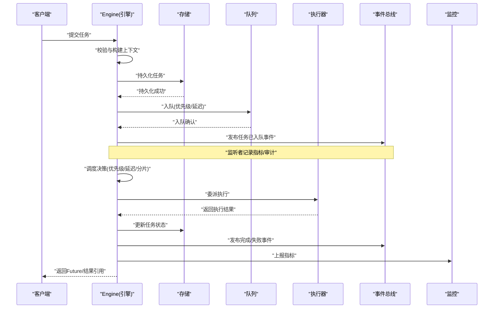

图表来源
- [engine.py:1-200](file://src/neotask/core/engine.py#L1-L200)
- [queue_scheduler.py:1-150](file://src/neotask/queue/queue_scheduler.py#L1-L150)
- [base.py:1-120](file://src/neotask/executor/base.py#L1-L120)
- [bus.py:1-120](file://src/neotask/event/bus.py#L1-L120)
- [collector.py:1-120](file://src/neotask/monitor/collector.py#L1-L120)

## 详细组件分析

### Engine 类设计与核心方法
- 职责
  - 编排任务从提交到完成的完整流程。
  - 维护任务上下文与生命周期状态。
  - 协调队列、执行器、存储、事件与监控。
- 关键方法
  - 初始化：加载配置、构建上下文、注册事件处理器、初始化存储与队列、预热缓存。
  - 启动：启动队列调度循环、心跳、监控采集、健康检查、分布式协调。
  - 提交任务：校验任务、持久化、入队、触发调度。
  - 调度决策：基于优先级、延迟时间、资源可用性、分片规则选择目标执行器。
  - 执行与回调：委派执行器执行任务，处理结果并更新状态，发布事件。
  - 关闭：优雅停止队列调度、等待任务收尾、释放资源、持久化状态。
- 设计要点
  - 通过工厂创建执行器与存储，支持热插拔。
  - 使用事件总线解耦副作用（审计、告警、指标）。
  - 使用上下文隔离任务元数据与追踪信息。

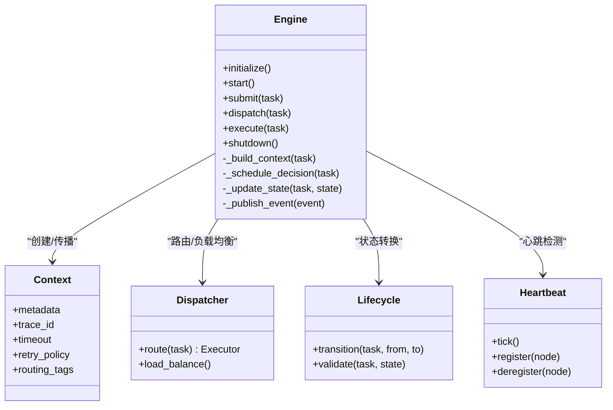

图表来源
- [engine.py:1-200](file://src/neotask/core/engine.py#L1-L200)
- [context.py:1-120](file://src/neotask/core/context.py#L1-L120)
- [dispatcher.py:1-150](file://src/neotask/core/dispatcher.py#L1-L150)
- [lifecycle.py:1-120](file://src/neotask/core/lifecycle.py#L1-L120)
- [heartbeat.py:1-120](file://src/neotask/core/heartbeat.py#L1-L120)

章节来源
- [engine.py:1-200](file://src/neotask/core/engine.py#L1-L200)
- [context.py:1-120](file://src/neotask/core/context.py#L1-L120)
- [dispatcher.py:1-150](file://src/neotask/core/dispatcher.py#L1-L150)
- [lifecycle.py:1-120](file://src/neotask/core/lifecycle.py#L1-L120)
- [heartbeat.py:1-120](file://src/neotask/core/heartbeat.py#L1-L120)

### 任务生命周期与状态机
- 状态集合
  - 待提交、已持久化、已入队、待派发、运行中、已完成、失败、重试、取消、死信。
- 转换规则
  - 提交后进入“已持久化”，随后“已入队”。
  - “已入队”经调度转为“待派发”，再转为“运行中”。
  - “运行中”可转为“已完成”或“失败”。
  - “失败”依据重试策略进入“重试”或“死信”。
  - “取消”可在任意可取消状态终止。
- 一致性保障
  - 状态变更伴随事件发布与指标上报，存储层保证原子性。

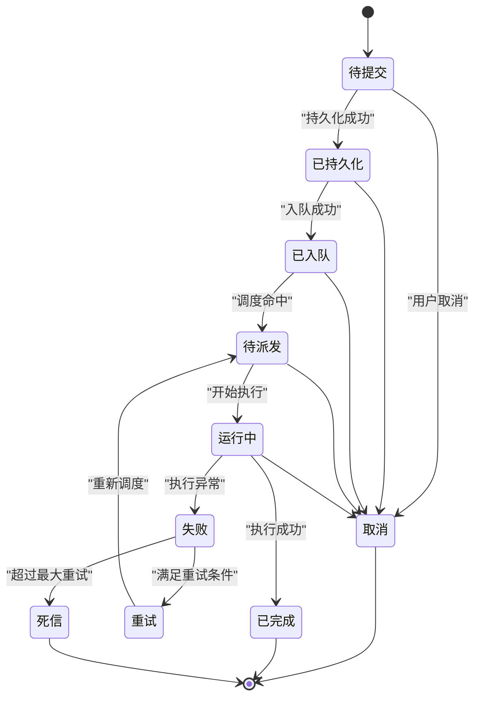

图表来源
- [lifecycle.py:1-120](file://src/neotask/core/lifecycle.py#L1-L120)
- [task.py:1-200](file://src/neotask/models/task.py#L1-L200)

章节来源
- [lifecycle.py:1-120](file://src/neotask/core/lifecycle.py#L1-L120)
- [task.py:1-200](file://src/neotask/models/task.py#L1-L200)

### 上下文管理机制
- 上下文内容
  - 元数据、追踪ID、超时、重试策略、路由标签、执行环境标识。
- 传播路径
  - 任务创建时生成上下文，随任务流转在各组件间传递。
- 作用
  - 为执行器提供执行约束，为监控提供追踪链路，为事件提供上下文信息。

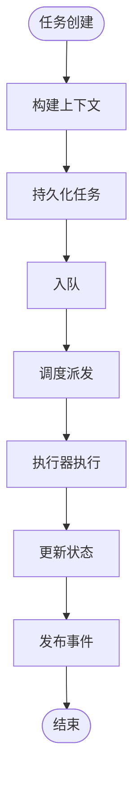

图表来源
- [context.py:1-120](file://src/neotask/core/context.py#L1-L120)
- [engine.py:1-200](file://src/neotask/core/engine.py#L1-L200)

章节来源
- [context.py:1-120](file://src/neotask/core/context.py#L1-L120)
- [engine.py:1-200](file://src/neotask/core/engine.py#L1-L200)

### 调度算法与决策逻辑
- 输入
  - 任务队列（优先级/延迟）、可用执行器集合、分片规则、资源负载。
- 决策维度
  - 优先级排序、延迟到期、执行器容量、亲和性与分片哈希。
- 输出
  - 选定执行器与任务批次。
- 复杂度
  - 优先级队列取顶 O(1)，批量选择 O(k log n) 或近似线性取决于实现。

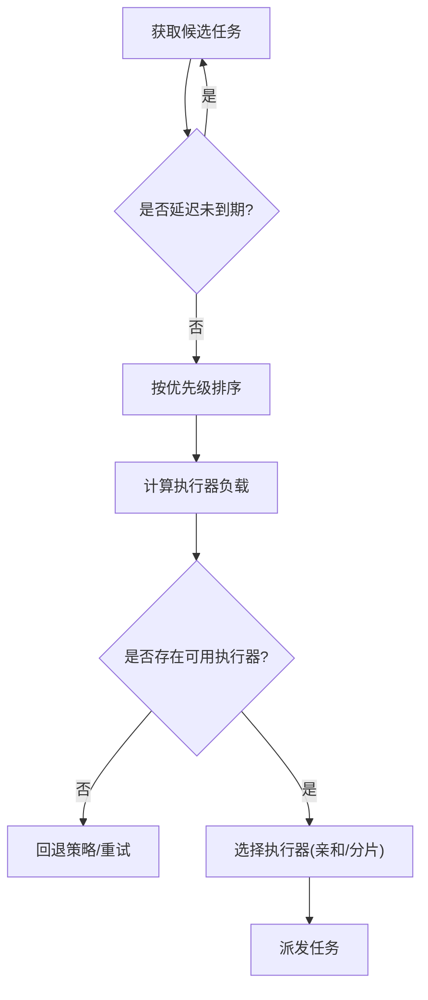

图表来源
- [queue_scheduler.py:1-150](file://src/neotask/queue/queue_scheduler.py#L1-L150)
- [priority_queue.py:1-150](file://src/neotask/queue/priority_queue.py#L1-L150)
- [delayed_queue.py:1-150](file://src/neotask/queue/delayed_queue.py#L1-L150)
- [dispatcher.py:1-150](file://src/neotask/core/dispatcher.py#L1-L150)

章节来源
- [queue_scheduler.py:1-150](file://src/neotask/queue/queue_scheduler.py#L1-L150)
- [priority_queue.py:1-150](file://src/neotask/queue/priority_queue.py#L1-L150)
- [delayed_queue.py:1-150](file://src/neotask/queue/delayed_queue.py#L1-L150)
- [dispatcher.py:1-150](file://src/neotask/core/dispatcher.py#L1-L150)

### 初始化、启动与关闭流程
- 初始化
  - 读取配置、构建上下文、注册事件处理器、初始化存储与队列、预热缓存。
- 启动
  - 启动队列调度循环、心跳、监控采集、健康检查、分布式协调。
- 关闭
  - 优雅停止队列调度、等待任务收尾、释放资源、持久化状态。

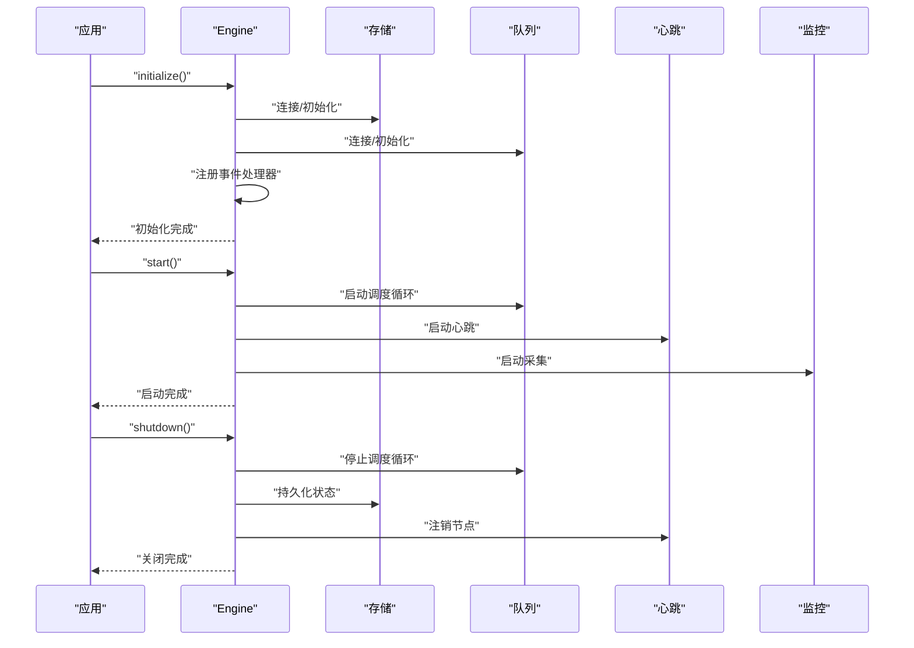

图表来源
- [engine.py:1-200](file://src/neotask/core/engine.py#L1-L200)
- [heartbeat.py:1-120](file://src/neotask/core/heartbeat.py#L1-L120)
- [collector.py:1-120](file://src/neotask/monitor/collector.py#L1-L120)

章节来源
- [engine.py:1-200](file://src/neotask/core/engine.py#L1-L200)
- [heartbeat.py:1-120](file://src/neotask/core/heartbeat.py#L1-L120)
- [collector.py:1-120](file://src/neotask/monitor/collector.py#L1-L120)

### 执行器与存储的工厂与策略
- 执行器
  - 基类定义执行骨架，子类实现具体执行（异步、线程、进程）。
  - 工厂根据配置创建对应执行器实例。
- 存储
  - 基类定义读写接口，子类实现内存、Redis、SQLite。
  - 工厂根据配置创建对应存储实例。

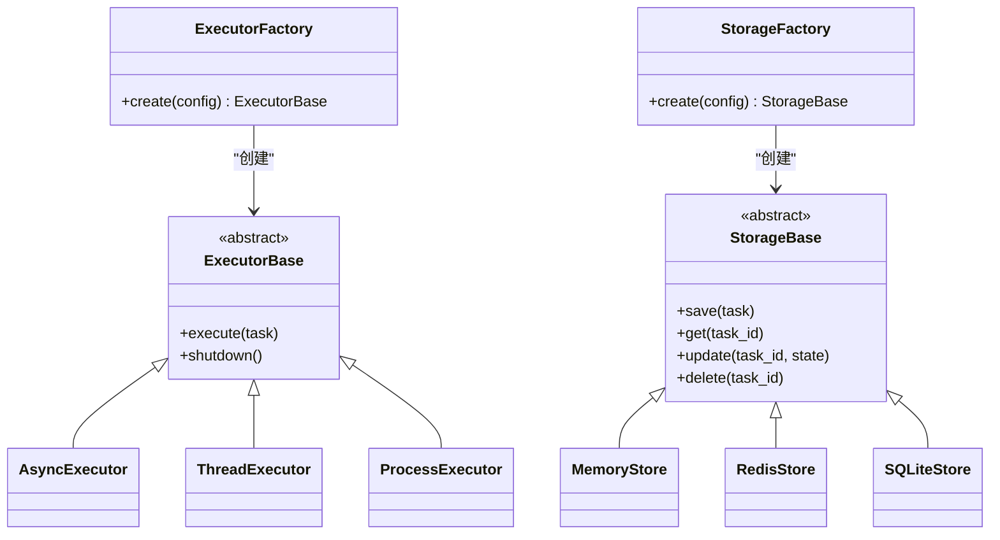

图表来源
- [base.py:1-120](file://src/neotask/executor/base.py#L1-L120)
- [async_executor.py:1-120](file://src/neotask/executor/async_executor.py#L1-L120)
- [thread_executor.py:1-120](file://src/neotask/executor/thread_executor.py#L1-L120)
- [process_executor.py:1-120](file://src/neotask/executor/process_executor.py#L1-L120)
- [factory.py:1-120](file://src/neotask/executor/factory.py#L1-L120)
- [base.py:1-120](file://src/neotask/storage/base.py#L1-L120)
- [memory.py:1-120](file://src/neotask/storage/memory.py#L1-L120)
- [redis.py:1-120](file://src/neotask/storage/redis.py#L1-L120)
- [sqlite.py:1-120](file://src/neotask/storage/sqlite.py#L1-L120)
- [factory.py:1-120](file://src/neotask/storage/factory.py#L1-L120)

章节来源
- [base.py:1-120](file://src/neotask/executor/base.py#L1-L120)
- [factory.py:1-120](file://src/neotask/executor/factory.py#L1-L120)
- [base.py:1-120](file://src/neotask/storage/base.py#L1-L120)
- [factory.py:1-120](file://src/neotask/storage/factory.py#L1-L120)

### 事件总线与中间件
- 事件类型
  - 任务创建、入队、派发、执行开始/结束、失败、重试、取消、死信。
- 中间件
  - 审计、限流、熔断、指标采集、告警。
- 解耦优势
  - 引擎无需关心副作用实现，扩展性强。

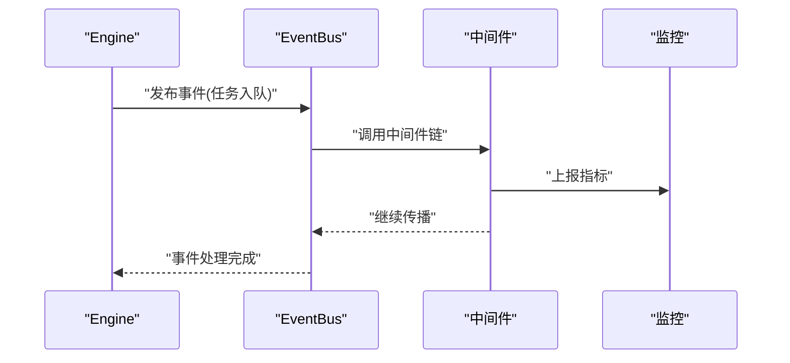

图表来源
- [bus.py:1-120](file://src/neotask/event/bus.py#L1-L120)
- [middleware.py:1-120](file://src/neotask/event/middleware.py#L1-L120)
- [handlers.py:1-120](file://src/neotask/event/handlers.py#L1-L120)
- [metrics.py:1-120](file://src/neotask/monitor/metrics.py#L1-L120)

章节来源
- [bus.py:1-120](file://src/neotask/event/bus.py#L1-L120)
- [middleware.py:1-120](file://src/neotask/event/middleware.py#L1-L120)
- [handlers.py:1-120](file://src/neotask/event/handlers.py#L1-L120)
- [metrics.py:1-120](file://src/neotask/monitor/metrics.py#L1-L120)

### 监控与健康检查
- 采集器
  - 定时采集队列长度、执行耗时、错误率、资源占用。
- 健康检查
  - 心跳、依赖服务连通性、磁盘/内存阈值。
- 上报
  - 将指标导出至监控系统或日志。

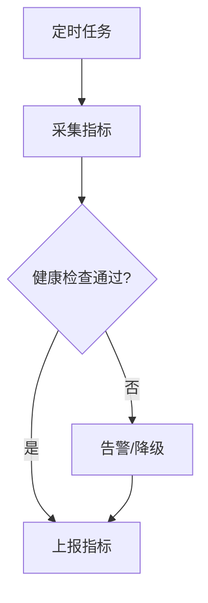

图表来源
- [collector.py:1-120](file://src/neotask/monitor/collector.py#L1-L120)
- [health.py:1-120](file://src/neotask/monitor/health.py#L1-L120)
- [reporter.py:1-120](file://src/neotask/monitor/reporter.py#L1-L120)

章节来源
- [collector.py:1-120](file://src/neotask/monitor/collector.py#L1-L120)
- [health.py:1-120](file://src/neotask/monitor/health.py#L1-L120)
- [reporter.py:1-120](file://src/neotask/monitor/reporter.py#L1-L120)

### 分布式协调与分片
- 协调器
  - 节点发现、选举、任务分配。
- 节点
  - 心跳上报、能力声明、任务接收。
- 分片
  - 基于任务键的分片哈希，确保同键任务路由到同一节点。

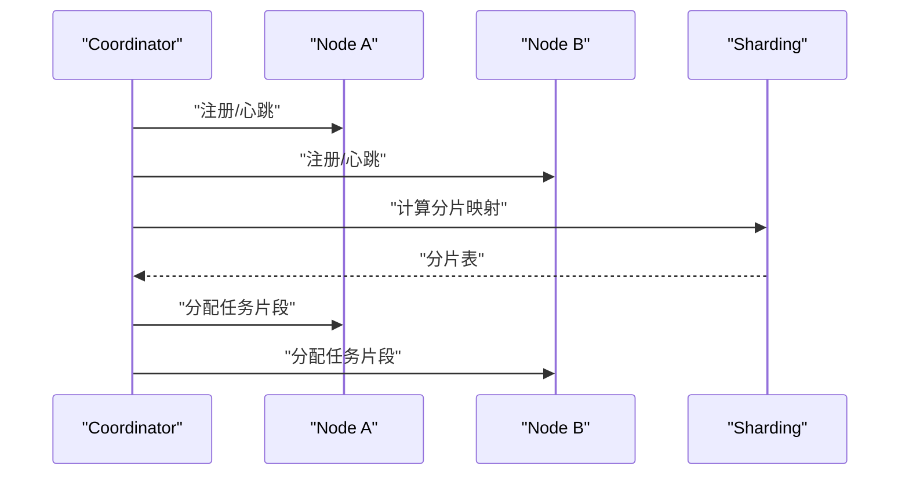

图表来源
- [coordinator.py:1-150](file://src/neotask/distributed/coordinator.py#L1-L150)
- [node.py:1-150](file://src/neotask/distributed/node.py#L1-L150)
- [sharding.py:1-150](file://src/neotask/distributed/sharding.py#L1-L150)

章节来源
- [coordinator.py:1-150](file://src/neotask/distributed/coordinator.py#L1-L150)
- [node.py:1-150](file://src/neotask/distributed/node.py#L1-L150)
- [sharding.py:1-150](file://src/neotask/distributed/sharding.py#L1-L150)

## 依赖关系分析
- 组件耦合
  - Engine 对执行器、队列、存储、事件、监控、分布式组件存在强依赖，但通过接口与工厂降低耦合度。
- 外部依赖
  - 存储后端（Redis/SQLite）、事件总线实现、监控导出器。
- 潜在循环依赖
  - 事件中间件不应反向依赖 Engine，避免循环。
- 接口契约
  - 执行器与存储的抽象接口明确，便于替换实现。

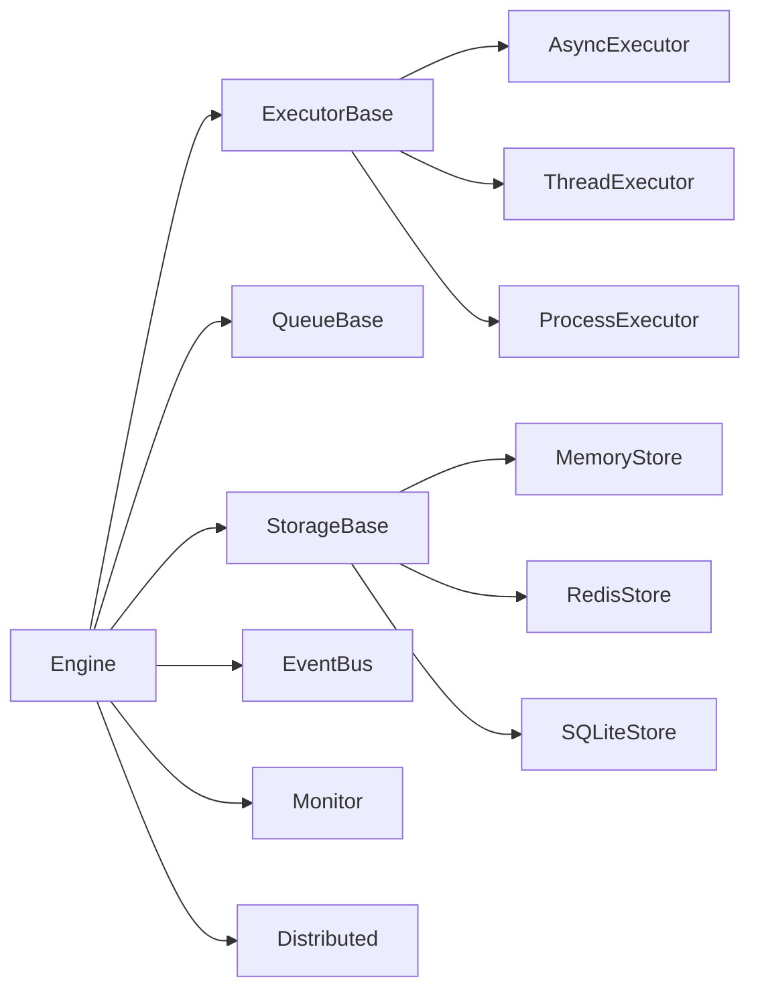

图表来源
- [engine.py:1-200](file://src/neotask/core/engine.py#L1-L200)
- [base.py:1-120](file://src/neotask/executor/base.py#L1-L120)
- [base.py:1-120](file://src/neotask/queue/base.py#L1-L120)
- [base.py:1-120](file://src/neotask/storage/base.py#L1-L120)
- [bus.py:1-120](file://src/neotask/event/bus.py#L1-L120)
- [collector.py:1-120](file://src/neotask/monitor/collector.py#L1-L120)
- [coordinator.py:1-150](file://src/neotask/distributed/coordinator.py#L1-L150)

章节来源
- [engine.py:1-200](file://src/neotask/core/engine.py#L1-L200)
- [base.py:1-120](file://src/neotask/executor/base.py#L1-L120)
- [base.py:1-120](file://src/neotask/queue/base.py#L1-L120)
- [base.py:1-120](file://src/neotask/storage/base.py#L1-L120)
- [bus.py:1-120](file://src/neotask/event/bus.py#L1-L120)
- [collector.py:1-120](file://src/neotask/monitor/collector.py#L1-L120)
- [coordinator.py:1-150](file://src/neotask/distributed/coordinator.py#L1-L150)

## 性能考虑
- 队列与调度
  - 使用优先级队列减少高优任务等待时间；延迟队列避免无效轮询。
  - 批量派发降低锁竞争与网络开销。
- 执行器选择
  - CPU 密集型优先进程执行器，I/O 密集型优先异步执行器。
- 存储优化
  - 热点任务使用内存缓存；批量写入与事务合并提升吞吐。
- 监控与告警
  - 合理采样频率，避免监控自身成为瓶颈。
- 资源控制
  - 限制并发度、超时与重试次数，防止雪崩。

[本节为通用指导，不直接分析具体文件]

## 故障排查指南
- 常见问题
  - 任务长时间处于“待派发”：检查队列调度循环与执行器可用性。
  - 频繁失败进入“死信”：查看重试策略与任务异常堆栈。
  - 心跳丢失导致节点下线：检查网络与依赖服务连通性。
- 定位手段
  - 启用详细日志与追踪ID，关联事件与指标。
  - 使用健康检查接口诊断依赖服务状态。
  - 回放事件日志还原任务流转路径。

章节来源
- [exceptions.py:1-120](file://src/neotask/common/exceptions.py#L1-L120)
- [logger.py:1-120](file://src/neotask/common/logger.py#L1-L120)
- [health.py:1-120](file://src/neotask/monitor/health.py#L1-L120)

## 结论
Engine 作为调度中枢，通过组合与策略模式整合执行器、队列、存储、事件与监控，形成高内聚低耦合的系统。其生命周期管理与上下文传播确保了任务流转的一致性与可观测性。合理的调度算法与分布式协调提升了整体吞吐与可靠性。通过配置与性能调优，可适配不同业务场景与资源约束。

[本节为总结，不直接分析具体文件]

## 附录
- 配置选项与调优参数
  - 执行器并发度、超时、重试策略、分片哈希函数、队列容量、存储连接池大小、监控采样间隔等。
- 最佳实践
  - 为任务设计幂等处理；合理设置超时与重试；使用事件进行审计与告警；定期评估分片均衡与执行器负载。

[本节为补充说明，不直接分析具体文件]