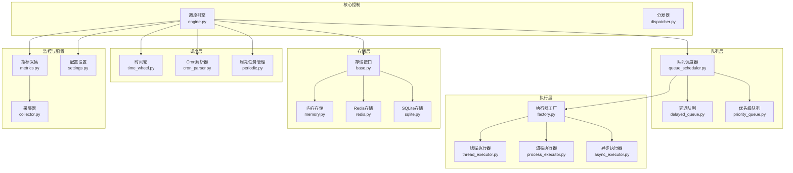
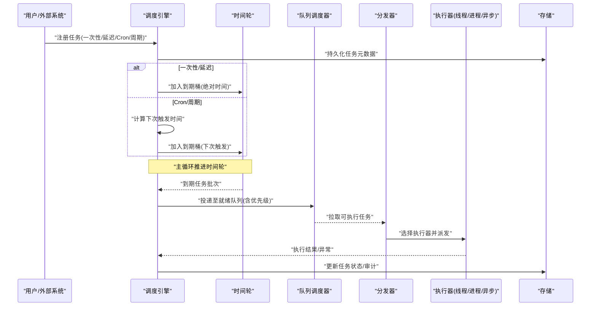
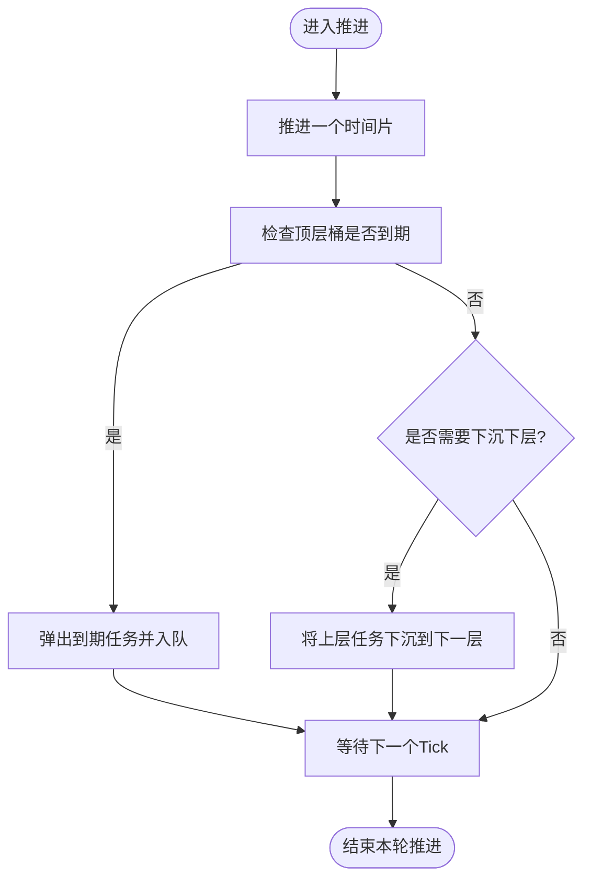
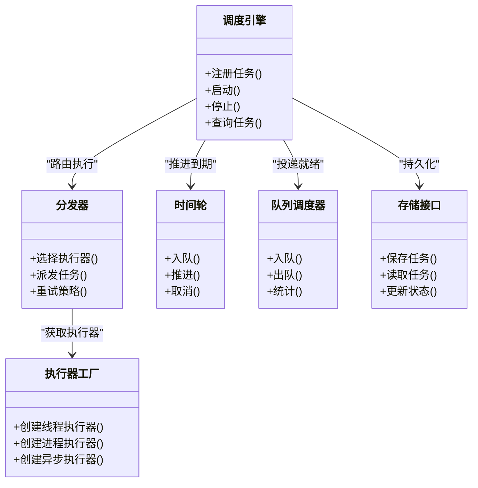
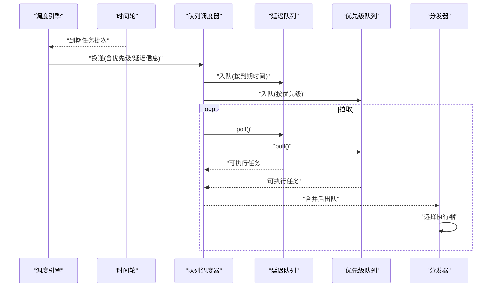
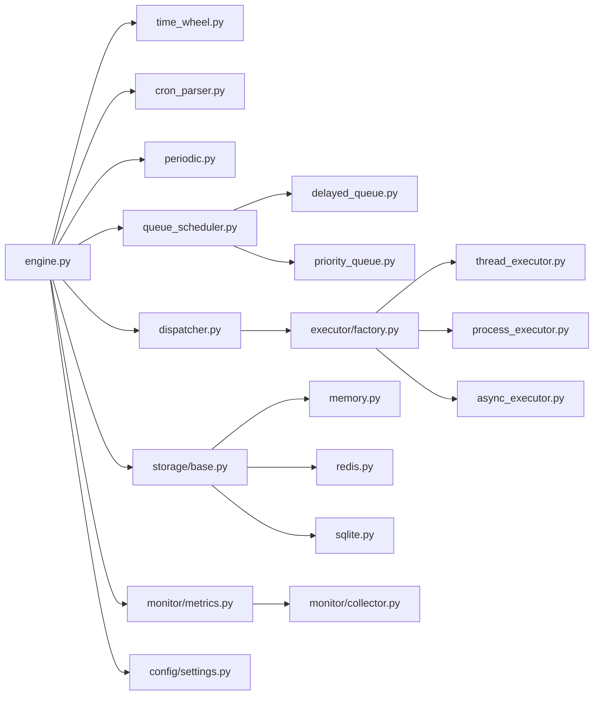

# 调度引擎架构

<cite>
**本文引用的文件**   
- [src/neotask/scheduler/time_wheel.py](file://src/neotask/scheduler/time_wheel.py)
- [src/neotask/scheduler/cron_parser.py](file://src/neotask/scheduler/cron_parser.py)
- [src/neotask/scheduler/periodic.py](file://src/neotask/scheduler/periodic.py)
- [src/neotask/core/engine.py](file://src/neotask/core/engine.py)
- [src/neotask/core/dispatcher.py](file://src/neotask/core/dispatcher.py)
- [src/neotask/models/task.py](file://src/neotask/models/task.py)
- [src/neotask/models/schedule.py](file://src/neotask/models/schedule.py)
- [src/neotask/queue/delayed_queue.py](file://src/neotask/queue/delayed_queue.py)
- [src/neotask/queue/priority_queue.py](file://src/neotask/queue/priority_queue.py)
- [src/neotask/queue/queue_scheduler.py](file://src/neotask/queue/queue_scheduler.py)
- [src/neotask/executor/factory.py](file://src/neotask/executor/factory.py)
- [src/neotask/executor/thread_executor.py](file://src/neotask/executor/thread_executor.py)
- [src/neotask/executor/process_executor.py](file://src/neotask/executor/process_executor.py)
- [src/neotask/executor/async_executor.py](file://src/neotask/executor/async_executor.py)
- [src/neotask/storage/base.py](file://src/neotask/storage/base.py)
- [src/neotask/storage/memory.py](file://src/neotask/storage/memory.py)
- [src/neotask/storage/redis.py](file://src/neotask/storage/redis.py)
- [src/neotask/storage/sqlite.py](file://src/neotask/storage/sqlite.py)
- [src/neotask/monitor/metrics.py](file://src/neotask/monitor/metrics.py)
- [src/neotask/monitor/collector.py](file://src/neotask/monitor/collector.py)
- [src/neotask/config/settings.py](file://src/neotask/config/settings.py)
- [examples/05_cron_tasks.py](file://examples/05_cron_tasks.py)
- [examples/06_delayed_tasks.py](file://examples/06_delayed_tasks.py)
- [examples/08_periodic.py](file://examples/08_periodic.py)
</cite>

## 目录
1. [简介](#简介)
2. [项目结构](#项目结构)
3. [核心组件](#核心组件)
4. [架构总览](#架构总览)
5. [详细组件分析](#详细组件分析)
6. [依赖关系分析](#依赖关系分析)
7. [性能考量](#性能考量)
8. [故障排查指南](#故障排查指南)
9. [结论](#结论)
10. [附录](#附录)

## 简介
本文件面向调度引擎的整体架构与工作原理，聚焦以下目标：
- 时间轮算法、Cron表达式解析器、调度策略选择器的设计与实现要点
- 任务从注册到执行的完整链路
- 不同调度策略的适用场景与性能特征
- 并发模型与资源管理机制
- 时间轮的实现原理与优化策略
- 配置调优方法与监控指标
- 架构图与数据流图辅助理解

## 项目结构
本项目采用分层与按功能域组织相结合的结构。调度相关代码主要分布在 scheduler、core、queue、executor、storage、monitor 等模块中。示例位于 examples，便于快速上手与验证。

图表来源
- [src/neotask/scheduler/time_wheel.py](file://src/neotask/scheduler/time_wheel.py)
- [src/neotask/scheduler/cron_parser.py](file://src/neotask/scheduler/cron_parser.py)
- [src/neotask/scheduler/periodic.py](file://src/neotask/scheduler/periodic.py)
- [src/neotask/core/engine.py](file://src/neotask/core/engine.py)
- [src/neotask/core/dispatcher.py](file://src/neotask/core/dispatcher.py)
- [src/neotask/queue/delayed_queue.py](file://src/neotask/queue/delayed_queue.py)
- [src/neotask/queue/priority_queue.py](file://src/neotask/queue/priority_queue.py)
- [src/neotask/queue/queue_scheduler.py](file://src/neotask/queue/queue_scheduler.py)
- [src/neotask/executor/factory.py](file://src/neotask/executor/factory.py)
- [src/neotask/executor/thread_executor.py](file://src/neotask/executor/thread_executor.py)
- [src/neotask/executor/process_executor.py](file://src/neotask/executor/process_executor.py)
- [src/neotask/executor/async_executor.py](file://src/neotask/executor/async_executor.py)
- [src/neotask/storage/base.py](file://src/neotask/storage/base.py)
- [src/neotask/storage/memory.py](file://src/neotask/storage/memory.py)
- [src/neotask/storage/redis.py](file://src/neotask/storage/redis.py)
- [src/neotask/storage/sqlite.py](file://src/neotask/storage/sqlite.py)
- [src/neotask/monitor/metrics.py](file://src/neotask/monitor/metrics.py)
- [src/neotask/monitor/collector.py](file://src/neotask/monitor/collector.py)
- [src/neotask/config/settings.py](file://src/neotask/config/settings.py)

章节来源
- [src/neotask/core/engine.py](file://src/neotask/core/engine.py)
- [src/neotask/config/settings.py](file://src/neotask/config/settings.py)

## 核心组件
- 时间轮（Time Wheel）：基于环形桶的时间轮用于高效推进“到期”任务，支持多粒度层级以覆盖大范围时间窗口。
- Cron表达式解析器：将标准Cron表达式解析为下一次触发时间点集合或迭代器，供周期任务使用。
- 周期任务管理器：负责周期性任务的注册、重排与生命周期管理。
- 调度引擎：统一入口，协调时间轮、Cron解析、队列与执行器，驱动调度主循环。
- 分发器：根据任务属性与策略选择执行器并派发任务。
- 队列层：延迟队列与优先级队列提供不同的入队与出队语义；队列调度器负责拉取与投递。
- 执行器族：线程、进程、异步三种执行器，由工厂按需创建与复用。
- 存储层：抽象存储接口及内存、Redis、SQLite实现，支撑任务持久化与状态同步。
- 监控与配置：指标采集、健康检查与全局配置项。

章节来源
- [src/neotask/scheduler/time_wheel.py](file://src/neotask/scheduler/time_wheel.py)
- [src/neotask/scheduler/cron_parser.py](file://src/neotask/scheduler/cron_parser.py)
- [src/neotask/scheduler/periodic.py](file://src/neotask/scheduler/periodic.py)
- [src/neotask/core/engine.py](file://src/neotask/core/engine.py)
- [src/neotask/core/dispatcher.py](file://src/neotask/core/dispatcher.py)
- [src/neotask/queue/delayed_queue.py](file://src/neotask/queue/delayed_queue.py)
- [src/neotask/queue/priority_queue.py](file://src/neotask/queue/priority_queue.py)
- [src/neotask/queue/queue_scheduler.py](file://src/neotask/queue/queue_scheduler.py)
- [src/neotask/executor/factory.py](file://src/neotask/executor/factory.py)
- [src/neotask/executor/thread_executor.py](file://src/neotask/executor/thread_executor.py)
- [src/neotask/executor/process_executor.py](file://src/neotask/executor/process_executor.py)
- [src/neotask/executor/async_executor.py](file://src/neotask/executor/async_executor.py)
- [src/neotask/storage/base.py](file://src/neotask/storage/base.py)
- [src/neotask/storage/memory.py](file://src/neotask/storage/memory.py)
- [src/neotask/storage/redis.py](file://src/neotask/storage/redis.py)
- [src/neotask/storage/sqlite.py](file://src/neotask/storage/sqlite.py)
- [src/neotask/monitor/metrics.py](file://src/neotask/monitor/metrics.py)
- [src/neotask/monitor/collector.py](file://src/neotask/monitor/collector.py)
- [src/neotask/config/settings.py](file://src/neotask/config/settings.py)

## 架构总览
调度引擎围绕“时间驱动 + 事件驱动”的双模推进：时间轮负责“到期”唤醒，队列负责“就绪”拉取，分发器负责“路由”，执行器负责“运行”。

图表来源
- [src/neotask/core/engine.py](file://src/neotask/core/engine.py)
- [src/neotask/scheduler/time_wheel.py](file://src/neotask/scheduler/time_wheel.py)
- [src/neotask/queue/queue_scheduler.py](file://src/neotask/queue/queue_scheduler.py)
- [src/neotask/core/dispatcher.py](file://src/neotask/core/dispatcher.py)
- [src/neotask/executor/factory.py](file://src/neotask/executor/factory.py)
- [src/neotask/storage/base.py](file://src/neotask/storage/base.py)

## 详细组件分析

### 时间轮（Time Wheel）
- 设计要点
  - 环形桶数组，每格代表一个时间片；多层级桶实现大跨度时间窗口的O(1)插入与滚动摊销。
  - 支持高精度推进与批量过期扫描，减少锁竞争与上下文切换。
- 关键操作
  - 入队：根据绝对时间映射到对应桶，必要时跨层下沉。
  - 推进：按时间片步进，逐层回收到期任务至就绪队列。
  - 取消/重排：支持动态调整到期时间。
- 复杂度与特性
  - 插入近似O(1)，推进摊还O(1)/tick，批量出队与队列容量线性相关。
  - 通过桶粒度与层数权衡内存与精度。
- 优化策略
  - 自适应时间片大小与层数，依据负载与时间分布动态调整。
  - 批量处理与零拷贝传递，降低GC压力。
  - 分片与并行推进，避免单点瓶颈。

图表来源
- [src/neotask/scheduler/time_wheel.py](file://src/neotask/scheduler/time_wheel.py)

章节来源
- [src/neotask/scheduler/time_wheel.py](file://src/neotask/scheduler/time_wheel.py)

### Cron表达式解析器
- 功能
  - 解析标准Cron字段（秒/分/时/日/月/周），生成下一次触发时间或迭代序列。
  - 支持通配符、步长、范围与特殊字符。
- 行为
  - 输入合法则返回有序时间序列；非法表达式抛出明确错误。
  - 与周期任务管理器协作，定期重算下次触发时间。
- 复杂度
  - 单次解析与下推计算通常为常数级或线性于字段数量。
- 典型用法
  - 参考示例：[examples/05_cron_tasks.py](file://examples/05_cron_tasks.py)

章节来源
- [src/neotask/scheduler/cron_parser.py](file://src/neotask/scheduler/cron_parser.py)
- [examples/05_cron_tasks.py](file://examples/05_cron_tasks.py)

### 周期任务管理器
- 职责
  - 维护周期任务集合，计算并维护下次触发时间，向时间轮注册到期事件。
  - 处理任务启停、暂停与恢复。
- 交互
  - 与Cron解析器配合，与时间轮协作推进。
- 典型用法
  - 参考示例：[examples/08_periodic.py](file://examples/08_periodic.py)

章节来源
- [src/neotask/scheduler/periodic.py](file://src/neotask/scheduler/periodic.py)
- [examples/08_periodic.py](file://examples/08_periodic.py)

### 调度引擎与分发器
- 调度引擎
  - 统一入口，初始化各子系统，启动主循环，协调时间轮推进、队列拉取与执行器派发。
  - 负责任务注册、状态管理与持久化。
- 分发器
  - 根据任务标签、资源需求与策略选择具体执行器（线程/进程/异步）。
  - 支持限流、隔离与重试策略。

图表来源
- [src/neotask/core/engine.py](file://src/neotask/core/engine.py)
- [src/neotask/core/dispatcher.py](file://src/neotask/core/dispatcher.py)
- [src/neotask/scheduler/time_wheel.py](file://src/neotask/scheduler/time_wheel.py)
- [src/neotask/queue/queue_scheduler.py](file://src/neotask/queue/queue_scheduler.py)
- [src/neotask/executor/factory.py](file://src/neotask/executor/factory.py)
- [src/neotask/storage/base.py](file://src/neotask/storage/base.py)

章节来源
- [src/neotask/core/engine.py](file://src/neotask/core/engine.py)
- [src/neotask/core/dispatcher.py](file://src/neotask/core/dispatcher.py)

### 队列层（延迟队列与优先级队列）
- 延迟队列
  - 基于最小堆或时间轮下沉，保证最早到期优先出队。
  - 适合一次性延时任务。
- 优先级队列
  - 按任务优先级出队，适合高优任务抢占。
- 队列调度器
  - 统一拉取接口，聚合多种队列源，提供背压与统计。

图表来源
- [src/neotask/queue/delayed_queue.py](file://src/neotask/queue/delayed_queue.py)
- [src/neotask/queue/priority_queue.py](file://src/neotask/queue/priority_queue.py)
- [src/neotask/queue/queue_scheduler.py](file://src/neotask/queue/queue_scheduler.py)
- [src/neotask/core/dispatcher.py](file://src/neotask/core/dispatcher.py)

章节来源
- [src/neotask/queue/delayed_queue.py](file://src/neotask/queue/delayed_queue.py)
- [src/neotask/queue/priority_queue.py](file://src/neotask/queue/priority_queue.py)
- [src/neotask/queue/queue_scheduler.py](file://src/neotask/queue/queue_scheduler.py)

### 执行器族与工厂
- 线程执行器
  - 轻量、低开销，适合CPU短任务与IO密集任务。
- 进程执行器
  - 强隔离，适合CPU密集型与需要独立地址空间的任务。
- 异步执行器
  - 基于事件循环，适合高并发IO任务。
- 工厂
  - 根据任务属性与策略选择合适执行器，并提供生命周期管理。

章节来源
- [src/neotask/executor/thread_executor.py](file://src/neotask/executor/thread_executor.py)
- [src/neotask/executor/process_executor.py](file://src/neotask/executor/process_executor.py)
- [src/neotask/executor/async_executor.py](file://src/neotask/executor/async_executor.py)
- [src/neotask/executor/factory.py](file://src/neotask/executor/factory.py)

### 存储层
- 抽象接口
  - 定义任务CRUD、状态更新与事务边界。
- 实现
  - 内存：快速开发测试。
  - Redis：分布式共享与高吞吐。
  - SQLite：单机轻量持久化。

章节来源
- [src/neotask/storage/base.py](file://src/neotask/storage/base.py)
- [src/neotask/storage/memory.py](file://src/neotask/storage/memory.py)
- [src/neotask/storage/redis.py](file://src/neotask/storage/redis.py)
- [src/neotask/storage/sqlite.py](file://src/neotask/storage/sqlite.py)

### 监控与配置
- 指标采集
  - 暴露调度吞吐、延迟、失败率、队列长度、执行器利用率等。
- 采集器
  - 定时汇总与上报，支持Prometheus导出。
- 配置
  - 集中管理时间轮参数、队列容量、执行器池大小、存储后端等。

章节来源
- [src/neotask/monitor/metrics.py](file://src/neotask/monitor/metrics.py)
- [src/neotask/monitor/collector.py](file://src/neotask/monitor/collector.py)
- [src/neotask/config/settings.py](file://src/neotask/config/settings.py)

## 依赖关系分析
- 耦合与内聚
  - 调度引擎作为编排中心，依赖清晰；时间轮与队列解耦，通过统一接口交换任务。
  - 执行器与分发器松耦合，策略可扩展。
- 外部依赖
  - 存储后端可插拔；监控可对接外部系统。
- 潜在环依赖
  - 通过接口与工厂模式避免直接循环引用。

图表来源
- [src/neotask/core/engine.py](file://src/neotask/core/engine.py)
- [src/neotask/scheduler/time_wheel.py](file://src/neotask/scheduler/time_wheel.py)
- [src/neotask/scheduler/cron_parser.py](file://src/neotask/scheduler/cron_parser.py)
- [src/neotask/scheduler/periodic.py](file://src/neotask/scheduler/periodic.py)
- [src/neotask/queue/queue_scheduler.py](file://src/neotask/queue/queue_scheduler.py)
- [src/neotask/queue/delayed_queue.py](file://src/neotask/queue/delayed_queue.py)
- [src/neotask/queue/priority_queue.py](file://src/neotask/queue/priority_queue.py)
- [src/neotask/core/dispatcher.py](file://src/neotask/core/dispatcher.py)
- [src/neotask/executor/factory.py](file://src/neotask/executor/factory.py)
- [src/neotask/executor/thread_executor.py](file://src/neotask/executor/thread_executor.py)
- [src/neotask/executor/process_executor.py](file://src/neotask/executor/process_executor.py)
- [src/neotask/executor/async_executor.py](file://src/neotask/executor/async_executor.py)
- [src/neotask/storage/base.py](file://src/neotask/storage/base.py)
- [src/neotask/storage/memory.py](file://src/neotask/storage/memory.py)
- [src/neotask/storage/redis.py](file://src/neotask/storage/redis.py)
- [src/neotask/storage/sqlite.py](file://src/neotask/storage/sqlite.py)
- [src/neotask/monitor/metrics.py](file://src/neotask/monitor/metrics.py)
- [src/neotask/monitor/collector.py](file://src/neotask/monitor/collector.py)
- [src/neotask/config/settings.py](file://src/neotask/config/settings.py)

章节来源
- [src/neotask/core/engine.py](file://src/neotask/core/engine.py)
- [src/neotask/config/settings.py](file://src/neotask/config/settings.py)

## 性能考量
- 时间轮
  - 合理设置时间片与层数，平衡内存与精度；批量推进减少锁争用。
- 队列
  - 延迟队列与优先级队列容量上限与背压策略，防止雪崩。
- 执行器
  - 线程池大小与进程隔离级别按任务类型调优；异步执行器结合事件循环深度。
- 存储
  - 读写分离与批提交；热点键分区与索引优化。
- 监控
  - 关注P99延迟、吞吐、失败率、队列堆积、执行器饱和等指标。

## 故障排查指南
- 常见问题
  - 任务未触发：检查Cron表达式合法性与下次触发时间计算。
  - 延迟不准：确认时间轮推进频率与系统时钟漂移。
  - 执行失败：查看执行器日志与重试策略。
  - 存储异常：检查连接池与事务回滚。
- 定位手段
  - 启用详细日志与指标上报；观察队列长度与时间轮推进曲线。
  - 使用示例脚本复现问题路径。

章节来源
- [examples/05_cron_tasks.py](file://examples/05_cron_tasks.py)
- [examples/06_delayed_tasks.py](file://examples/06_delayed_tasks.py)
- [examples/08_periodic.py](file://examples/08_periodic.py)

## 结论
该调度引擎以时间轮为核心驱动，结合Cron解析与周期任务管理，形成稳定高效的调度内核。通过可插拔的队列与执行器，兼顾灵活性与性能；存储与监控保障可靠性与可观测性。生产部署建议结合业务特征对时间轮、队列与执行器进行精细化调优，并建立完善的监控告警体系。

## 附录
- 示例参考
  - Cron任务：[examples/05_cron_tasks.py](file://examples/05_cron_tasks.py)
  - 延迟任务：[examples/06_delayed_tasks.py](file://examples/06_delayed_tasks.py)
  - 周期任务：[examples/08_periodic.py](file://examples/08_periodic.py)
- 数据模型
  - 任务模型与调度模型定义见：
    - [src/neotask/models/task.py](file://src/neotask/models/task.py)
    - [src/neotask/models/schedule.py](file://src/neotask/models/schedule.py)