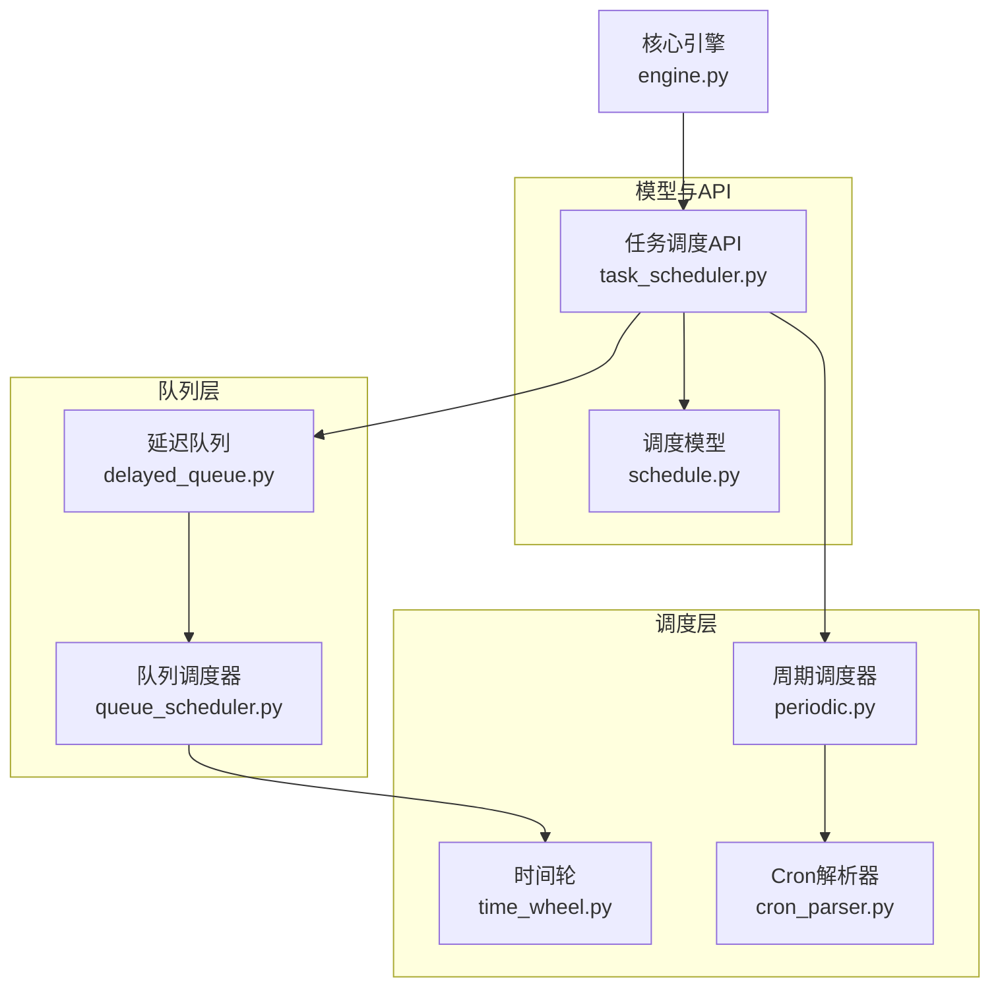
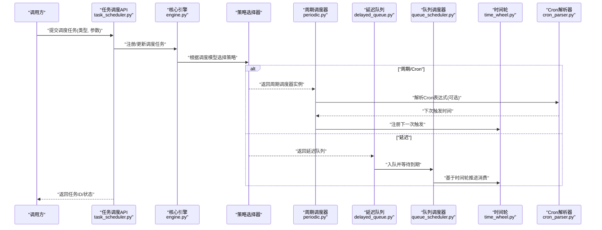
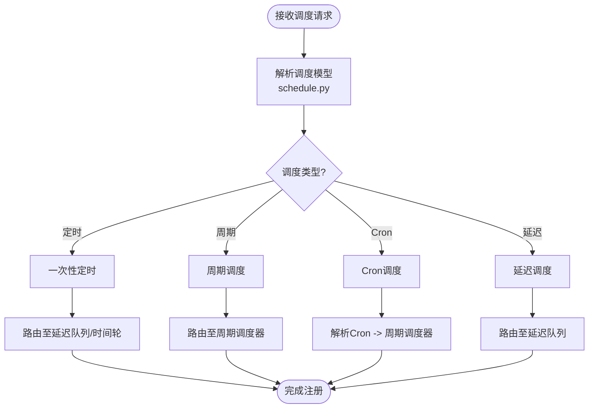
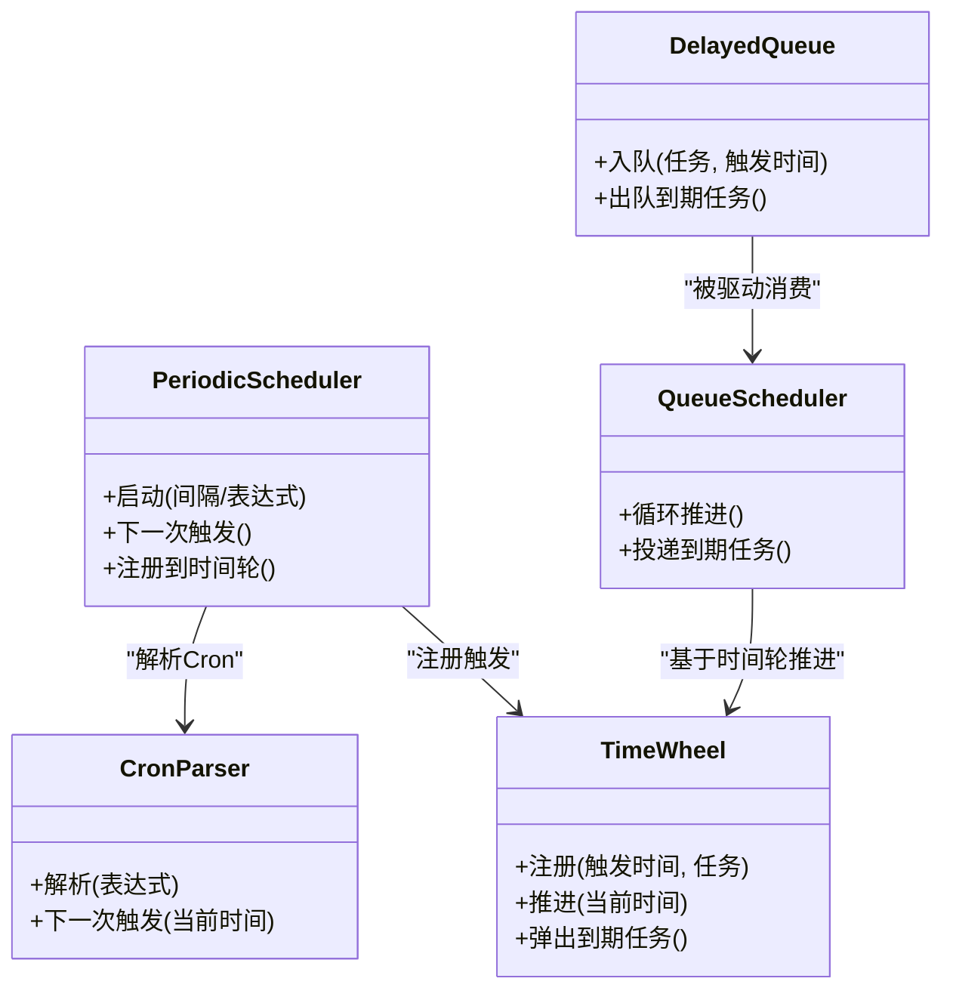
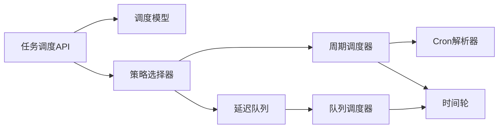

# 调度策略与选择器

<cite>
**本文引用的文件**   
- [src/neotask/scheduler/time_wheel.py](file://src/neotask/scheduler/time_wheel.py)
- [src/neotask/scheduler/periodic.py](file://src/neotask/scheduler/periodic.py)
- [src/neotask/scheduler/cron_parser.py](file://src/neotask/scheduler/cron_parser.py)
- [src/neotask/queue/delayed_queue.py](file://src/neotask/queue/delayed_queue.py)
- [src/neotask/queue/queue_scheduler.py](file://src/neotask/queue/queue_scheduler.py)
- [src/neotask/models/schedule.py](file://src/neotask/models/schedule.py)
- [src/neotask/core/engine.py](file://src/neotask/core/engine.py)
- [src/neotask/api/task_scheduler.py](file://src/neotask/api/task_scheduler.py)
- [examples/05_cron_tasks.py](file://examples/05_cron_tasks.py)
- [examples/06_delayed_tasks.py](file://examples/06_delayed_tasks.py)
- [examples/08_periodic.py](file://examples/08_periodic.py)
- [tests/unit/test_time_wheel.py](file://tests/unit/test_time_wheel.py)
- [tests/unit/test_periodic_manager.py](file://tests/unit/test_periodic_manager.py)
- [tests/unit/test_cron_parser.py](file://tests/unit/test_cron_parser.py)
- [tests/unit/test_delayed_queue.py](file://tests/unit/test_delayed_queue.py)
- [tests/benchmark/run_benchmark.py](file://tests/benchmark/run_benchmark.py)
- [tests/benchmark/test_performance.py](file://tests/benchmark/test_performance.py)
</cite>

## 目录
1. [简介](#简介)
2. [项目结构](#项目结构)
3. [核心组件](#核心组件)
4. [架构总览](#架构总览)
5. [详细组件分析](#详细组件分析)
6. [依赖关系分析](#依赖关系分析)
7. [性能考量](#性能考量)
8. [故障排查指南](#故障排查指南)
9. [结论](#结论)
10. [附录](#附录)

## 简介
本文件围绕任务调度系统中的“调度策略与选择机制”展开，系统性阐述定时调度、周期调度、延迟调度的设计目标、适用场景与性能特征；解释策略选择算法与决策逻辑；说明配置方法与动态切换机制；并给出与时间轮、Cron解析器的集成方式。同时提供基准测试路径与调优建议，以及扩展开发接口规范与最佳实践，帮助读者快速理解并高效使用调度子系统。

## 项目结构
调度相关代码主要分布在以下模块：
- 调度策略与基础设施：scheduler（时间轮、周期调度、Cron解析）
- 队列与延迟执行：queue（延迟队列、队列调度器）
- 模型与API：models（调度模型）、api（任务调度API）
- 核心引擎：core（引擎编排）
- 示例与测试：examples、tests（含基准测试）

图表来源
- [src/neotask/scheduler/time_wheel.py](file://src/neotask/scheduler/time_wheel.py)
- [src/neotask/scheduler/periodic.py](file://src/neotask/scheduler/periodic.py)
- [src/neotask/scheduler/cron_parser.py](file://src/neotask/scheduler/cron_parser.py)
- [src/neotask/queue/delayed_queue.py](file://src/neotask/queue/delayed_queue.py)
- [src/neotask/queue/queue_scheduler.py](file://src/neotask/queue/queue_scheduler.py)
- [src/neotask/models/schedule.py](file://src/neotask/models/schedule.py)
- [src/neotask/api/task_scheduler.py](file://src/neotask/api/task_scheduler.py)
- [src/neotask/core/engine.py](file://src/neotask/core/engine.py)

章节来源
- [src/neotask/scheduler/time_wheel.py](file://src/neotask/scheduler/time_wheel.py)
- [src/neotask/scheduler/periodic.py](file://src/neotask/scheduler/periodic.py)
- [src/neotask/scheduler/cron_parser.py](file://src/neotask/scheduler/cron_parser.py)
- [src/neotask/queue/delayed_queue.py](file://src/neotask/queue/delayed_queue.py)
- [src/neotask/queue/queue_scheduler.py](file://src/neotask/queue/queue_scheduler.py)
- [src/neotask/models/schedule.py](file://src/neotask/models/schedule.py)
- [src/neotask/api/task_scheduler.py](file://src/neotask/api/task_scheduler.py)
- [src/neotask/core/engine.py](file://src/neotask/core/engine.py)

## 核心组件
- 时间轮（Time Wheel）：以桶为单位的环形时间槽结构，支持O(1)级别的时间推进与到期任务弹出，适合短中期精确定时与周期性触发。
- 周期调度器（Periodic Scheduler）：基于固定间隔或相对时间的重复触发，内部可复用时间轮或系统定时器进行下一次触发安排。
- Cron解析器（Cron Parser）：将Cron表达式解析为下一次触发时间点序列，供周期调度器按点触发。
- 延迟队列（Delayed Queue）：按触发时间排序的优先级队列，配合队列调度器实现延迟任务的精确唤醒。
- 队列调度器（Queue Scheduler）：驱动延迟队列消费，将到期的任务投递至执行通道。
- 调度模型（Schedule Model）：统一描述调度类型、参数、状态等元数据，作为策略选择的输入。
- 任务调度API（Task Scheduler API）：对外暴露创建、更新、删除、查询调度任务的能力，内部根据策略路由到对应调度器。

章节来源
- [src/neotask/scheduler/time_wheel.py](file://src/neotask/scheduler/time_wheel.py)
- [src/neotask/scheduler/periodic.py](file://src/neotask/scheduler/periodic.py)
- [src/neotask/scheduler/cron_parser.py](file://src/neotask/scheduler/cron_parser.py)
- [src/neotask/queue/delayed_queue.py](file://src/neotask/queue/delayed_queue.py)
- [src/neotask/queue/queue_scheduler.py](file://src/neotask/queue/queue_scheduler.py)
- [src/neotask/models/schedule.py](file://src/neotask/models/schedule.py)
- [src/neotask/api/task_scheduler.py](file://src/neotask/api/task_scheduler.py)

## 架构总览
下图展示了从API到具体调度策略的选择与执行流程，体现“策略选择—调度器—底层时间/队列设施”的分层协作。

图表来源
- [src/neotask/api/task_scheduler.py](file://src/neotask/api/task_scheduler.py)
- [src/neotask/core/engine.py](file://src/neotask/core/engine.py)
- [src/neotask/scheduler/periodic.py](file://src/neotask/scheduler/periodic.py)
- [src/neotask/scheduler/cron_parser.py](file://src/neotask/scheduler/cron_parser.py)
- [src/neotask/queue/delayed_queue.py](file://src/neotask/queue/delayed_queue.py)
- [src/neotask/queue/queue_scheduler.py](file://src/neotask/queue/queue_scheduler.py)
- [src/neotask/scheduler/time_wheel.py](file://src/neotask/scheduler/time_wheel.py)

## 详细组件分析

### 调度策略类型与适用场景
- 定时调度（一次性）
  - 适用场景：在指定时刻仅执行一次的任务，如“30秒后发送通知”。
  - 性能特点：低开销，通常通过延迟队列或时间轮短期桶管理。
- 周期调度（固定间隔）
  - 适用场景：定期采集、心跳上报、周期性清理等。
  - 性能特点：稳定节拍，时间轮或系统定时器均可满足；高频场景需关注唤醒抖动与批量处理。
- Cron调度（复杂周期）
  - 适用场景：工作日早高峰、月末结算等复杂规则。
  - 性能特点：解析成本较低，但需保证解析结果正确性与边界条件覆盖。
- 延迟调度（相对时间）
  - 适用场景：重试退避、延时确认、异步补偿。
  - 性能特点：大量并发延迟任务下，优先采用延迟队列+时间轮推进，避免过多线程阻塞。

章节来源
- [src/neotask/models/schedule.py](file://src/neotask/models/schedule.py)
- [examples/05_cron_tasks.py](file://examples/05_cron_tasks.py)
- [examples/06_delayed_tasks.py](file://examples/06_delayed_tasks.py)
- [examples/08_periodic.py](file://examples/08_periodic.py)

### 策略选择算法与决策逻辑
策略选择的核心依据是调度模型的“类型字段”与“参数约束”，典型决策流程如下：

图表来源
- [src/neotask/models/schedule.py](file://src/neotask/models/schedule.py)
- [src/neotask/api/task_scheduler.py](file://src/neotask/api/task_scheduler.py)
- [src/neotask/scheduler/periodic.py](file://src/neotask/scheduler/periodic.py)
- [src/neotask/scheduler/cron_parser.py](file://src/neotask/scheduler/cron_parser.py)
- [src/neotask/queue/delayed_queue.py](file://src/neotask/queue/delayed_queue.py)

章节来源
- [src/neotask/api/task_scheduler.py](file://src/neotask/api/task_scheduler.py)
- [src/neotask/models/schedule.py](file://src/neotask/models/schedule.py)

### 与时间轮的集成
- 时间轮负责将“到期事件”组织为桶，按时间推进逐桶扫描并弹出任务。
- 周期调度器在每次触发后计算下一次触发时间，并将事件注册到时间轮。
- 延迟队列在入队时计算绝对触发时间，由队列调度器基于时间轮推进消费。

图表来源
- [src/neotask/scheduler/time_wheel.py](file://src/neotask/scheduler/time_wheel.py)
- [src/neotask/scheduler/periodic.py](file://src/neotask/scheduler/periodic.py)
- [src/neotask/scheduler/cron_parser.py](file://src/neotask/scheduler/cron_parser.py)
- [src/neotask/queue/delayed_queue.py](file://src/neotask/queue/delayed_queue.py)
- [src/neotask/queue/queue_scheduler.py](file://src/neotask/queue/queue_scheduler.py)

章节来源
- [src/neotask/scheduler/time_wheel.py](file://src/neotask/scheduler/time_wheel.py)
- [src/neotask/scheduler/periodic.py](file://src/neotask/scheduler/periodic.py)
- [src/neotask/scheduler/cron_parser.py](file://src/neotask/scheduler/cron_parser.py)
- [src/neotask/queue/delayed_queue.py](file://src/neotask/queue/delayed_queue.py)
- [src/neotask/queue/queue_scheduler.py](file://src/neotask/queue/queue_scheduler.py)

### 配置方法与动态切换
- 配置项
  - 调度类型：一次性、周期、Cron、延迟。
  - 触发参数：固定间隔、Cron表达式、绝对触发时间。
  - 运行参数：最大并发、重试次数、超时、优先级等。
- 动态切换
  - 通过调度模型更新触发参数（如将周期改为Cron），由策略选择器重新路由到对应调度器。
  - 生命周期管理：停止旧调度器、注册新调度器，确保无中断或最小抖动。

章节来源
- [src/neotask/models/schedule.py](file://src/neotask/models/schedule.py)
- [src/neotask/api/task_scheduler.py](file://src/neotask/api/task_scheduler.py)

### 示例用法
- Cron任务：展示如何声明Cron表达式并注册周期任务。
- 延迟任务：展示如何设置相对延迟时间并注册一次性任务。
- 周期任务：展示固定间隔的周期任务注册与生命周期管理。

章节来源
- [examples/05_cron_tasks.py](file://examples/05_cron_tasks.py)
- [examples/06_delayed_tasks.py](file://examples/06_delayed_tasks.py)
- [examples/08_periodic.py](file://examples/08_periodic.py)

## 依赖关系分析
- 耦合关系
  - 任务调度API依赖调度模型与策略选择器，再路由到具体调度器。
  - 周期调度器依赖Cron解析器与时间轮。
  - 延迟队列与队列调度器共同工作，后者依赖时间轮推进。
- 外部依赖
  - 时间轮依赖系统时钟推进。
  - Cron解析器依赖表达式语法定义。

图表来源
- [src/neotask/api/task_scheduler.py](file://src/neotask/api/task_scheduler.py)
- [src/neotask/models/schedule.py](file://src/neotask/models/schedule.py)
- [src/neotask/scheduler/periodic.py](file://src/neotask/scheduler/periodic.py)
- [src/neotask/scheduler/cron_parser.py](file://src/neotask/scheduler/cron_parser.py)
- [src/neotask/queue/delayed_queue.py](file://src/neotask/queue/delayed_queue.py)
- [src/neotask/queue/queue_scheduler.py](file://src/neotask/queue/queue_scheduler.py)
- [src/neotask/scheduler/time_wheel.py](file://src/neotask/scheduler/time_wheel.py)

章节来源
- [src/neotask/api/task_scheduler.py](file://src/neotask/api/task_scheduler.py)
- [src/neotask/models/schedule.py](file://src/neotask/models/schedule.py)
- [src/neotask/scheduler/periodic.py](file://src/neotask/scheduler/periodic.py)
- [src/neotask/scheduler/cron_parser.py](file://src/neotask/scheduler/cron_parser.py)
- [src/neotask/queue/delayed_queue.py](file://src/neotask/queue/delayed_queue.py)
- [src/neotask/queue/queue_scheduler.py](file://src/neotask/queue/queue_scheduler.py)
- [src/neotask/scheduler/time_wheel.py](file://src/neotask/scheduler/time_wheel.py)

## 性能考量
- 时间轮
  - 优势：桶级推进，平均O(1)插入与弹出，适合高吞吐短中期定时。
  - 注意：桶粒度与轮大小影响内存占用与扫描开销，需权衡。
- 周期调度
  - 高频周期任务建议批处理与合并输出，减少上下文切换。
  - 对抖动敏感的场景，应校准系统时钟与调度器推进步长。
- Cron解析
  - 解析成本较低，但应避免频繁重复解析，缓存最近N次触发时间。
- 延迟队列
  - 大量延迟任务时，优先使用延迟队列+时间轮推进，避免线程阻塞。
  - 合理设置队列容量与消费者并发度，防止背压。

章节来源
- [src/neotask/scheduler/time_wheel.py](file://src/neotask/scheduler/time_wheel.py)
- [src/neotask/scheduler/periodic.py](file://src/neotask/scheduler/periodic.py)
- [src/neotask/scheduler/cron_parser.py](file://src/neotask/scheduler/cron_parser.py)
- [src/neotask/queue/delayed_queue.py](file://src/neotask/queue/delayed_queue.py)
- [src/neotask/queue/queue_scheduler.py](file://src/neotask/queue/queue_scheduler.py)

## 故障排查指南
- Cron表达式无效
  - 现象：周期任务无法注册或立即失败。
  - 排查：检查表达式语法与边界值，参考单元测试用例。
- 时间轮未推进
  - 现象：任务不触发或严重延迟。
  - 排查：确认时间轮推进循环是否运行，系统时钟是否正常。
- 延迟队列积压
  - 现象：任务堆积、消费延迟。
  - 排查：调整消费者并发、队列容量与时间轮推进频率。
- 周期任务抖动
  - 现象：触发时间波动较大。
  - 排查：降低单次任务耗时，启用批处理，优化调度器步进。

章节来源
- [tests/unit/test_cron_parser.py](file://tests/unit/test_cron_parser.py)
- [tests/unit/test_time_wheel.py](file://tests/unit/test_time_wheel.py)
- [tests/unit/test_delayed_queue.py](file://tests/unit/test_delayed_queue.py)
- [tests/unit/test_periodic_manager.py](file://tests/unit/test_periodic_manager.py)

## 结论
本调度子系统通过“策略选择器+多调度器+时间轮/延迟队列”的分层设计，实现了定时、周期、Cron与延迟等多种调度策略的统一接入与高效执行。策略选择基于调度模型与参数约束，具备清晰的扩展点与良好的性能表现。结合基准测试与调优建议，可在不同业务场景下取得稳定的调度效果。

## 附录

### 基准测试与调优建议
- 基准测试入口
  - 完整基准：[tests/benchmark/run_benchmark.py](file://tests/benchmark/run_benchmark.py)
  - 性能测试套件：[tests/benchmark/test_performance.py](file://tests/benchmark/test_performance.py)
- 关键指标
  - 触发延迟（P50/P95/P99）
  - 吞吐量（任务/秒）
  - 资源占用（CPU/内存）
- 调优建议
  - 时间轮桶粒度与轮大小按峰值负载与延迟容忍度调节。
  - 周期任务批量聚合，减少锁竞争与IO抖动。
  - Cron解析结果缓存，避免重复计算。
  - 延迟队列消费者并发与队列容量联动调参，避免背压。

章节来源
- [tests/benchmark/run_benchmark.py](file://tests/benchmark/run_benchmark.py)
- [tests/benchmark/test_performance.py](file://tests/benchmark/test_performance.py)

### 扩展开发接口规范与最佳实践
- 新增调度策略
  - 在调度模型中扩展策略类型与参数。
  - 实现策略选择分支，路由至新调度器。
  - 若涉及时间推进，复用时间轮或延迟队列能力。
- 最佳实践
  - 保持策略无状态，将状态持久化于调度模型。
  - 对长时间运行的任务引入心跳与超时检测。
  - 提供可观测性指标（触发次数、延迟分布、错误率）。
  - 编写单测与集成测试，覆盖边界条件与异常路径。

章节来源
- [src/neotask/models/schedule.py](file://src/neotask/models/schedule.py)
- [src/neotask/api/task_scheduler.py](file://src/neotask/api/task_scheduler.py)
- [src/neotask/scheduler/time_wheel.py](file://src/neotask/scheduler/time_wheel.py)
- [src/neotask/queue/delayed_queue.py](file://src/neotask/queue/delayed_queue.py)