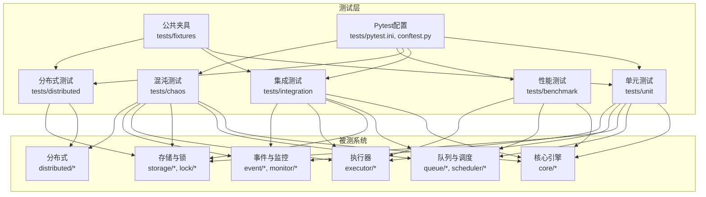
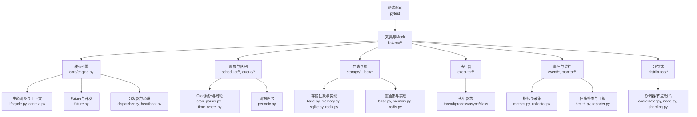
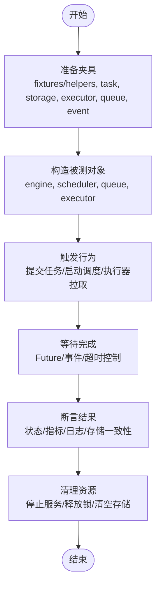
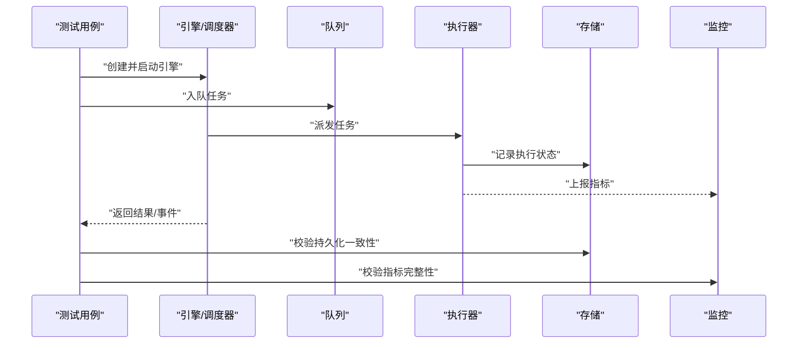
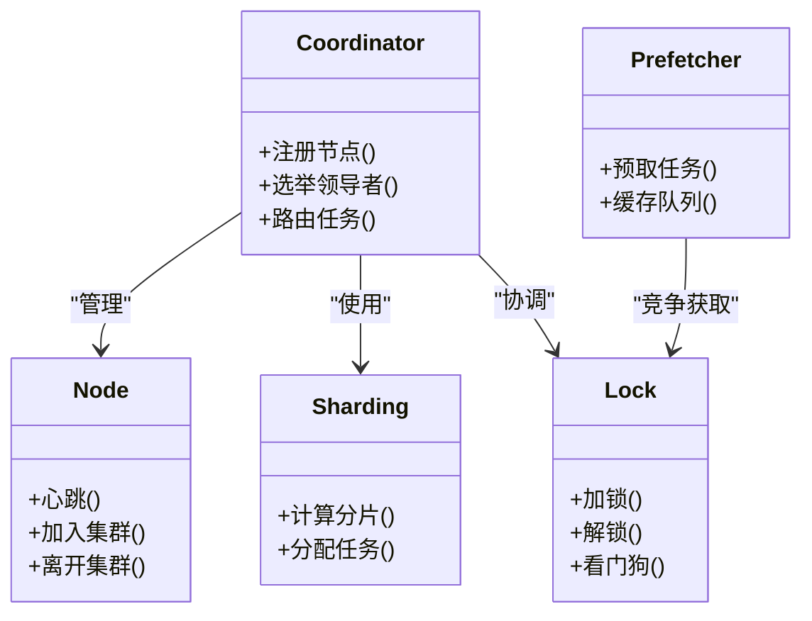
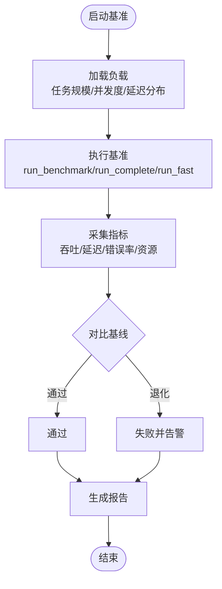
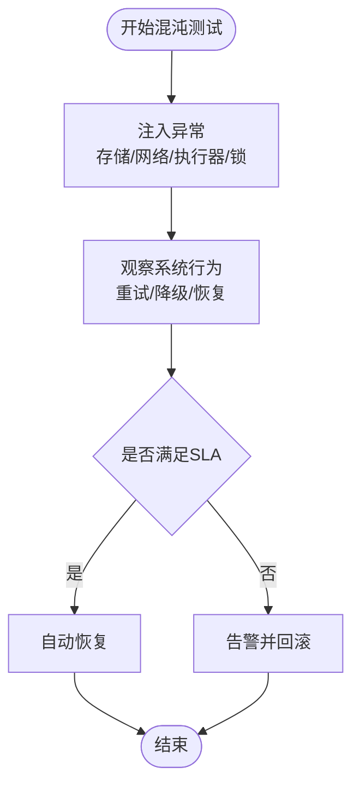
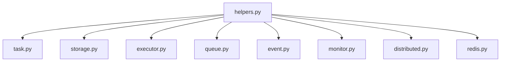
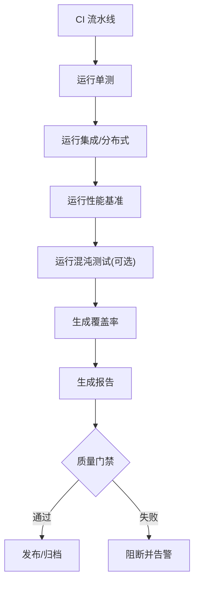
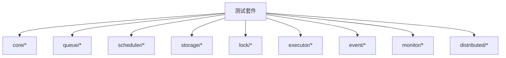

# 测试指南

<cite>
**本文引用的文件**   
- [tests/conftest.py](file://tests/conftest.py)
- [tests/pytest.ini](file://tests/pytest.ini)
- [tests/unit/test_simple.py](file://tests/unit/test_simple.py)
- [tests/unit/test_task.py](file://tests/unit/test_task.py)
- [tests/unit/test_executors.py](file://tests/unit/test_executors.py)
- [tests/unit/test_storage.py](file://tests/unit/test_storage.py)
- [tests/unit/test_redis_storage.py](file://tests/unit/test_redis_storage.py)
- [tests/unit/test_cron_parser.py](file://tests/unit/test_cron_parser.py)
- [tests/unit/test_time_wheel.py](file://tests/unit/test_time_wheel.py)
- [tests/unit/test_delayed_queue.py](file://tests/unit/test_delayed_queue.py)
- [tests/unit/test_priority_queue.py](file://tests/unit/test_priority_queue.py)
- [tests/unit/test_event_bus.py](file://tests/unit/test_event_bus.py)
- [tests/unit/test_future.py](file://tests/unit/test_future.py)
- [tests/unit/test_lifecycle.py](file://tests/unit/test_lifecycle.py)
- [tests/unit/test_periodic_manager.py](file://tests/unit/test_periodic_manager.py)
- [tests/unit/test_metrics.py](file://tests/unit/test_metrics.py)
- [tests/unit/worker/test_worker.py](file://tests/unit/worker/test_worker.py)
- [tests/unit/worker/test_pool.py](file://tests/unit/worker/test_pool.py)
- [tests/integration/test_end_to_end.py](file://tests/integration/test_end_to_end.py)
- [tests/integration/test_e2e.py](file://tests/integration/test_e2e.py)
- [tests/integration/test_task_scheduler.py](file://tests/integration/test_task_scheduler.py)
- [tests/integration/test_task_pool.py](file://tests/integration/test_task_pool.py)
- [tests/integration/test_failure_recovery.py](file://tests/integration/test_failure_recovery.py)
- [tests/integration/test_worker_integration.py](file://tests/integration/test_worker_integration.py)
- [tests/distributed/test_integration.py](file://tests/distributed/test_integration.py)
- [tests/distributed/test_distributed_lock.py](file://tests/distributed/test_distributed_lock.py)
- [tests/distributed/test_node_manager.py](file://tests/distributed/test_node_manager.py)
- [tests/distributed/test_heartbeat.py](file://tests/distributed/test_heartbeat.py)
- [tests/distributed/test_sharding.py](file://tests/distributed/test_sharding.py)
- [tests/distributed/test_coordinator.py](file://tests/distributed/test_coordinator.py)
- [tests/distributed/test_prefetcher.py](file://tests/distributed/test_prefetcher.py)
- [tests/distributed/test_redis_lock.py](file://tests/distributed/test_redis_lock.py)
- [tests/distributed/test_dis_e2e.py](file://tests/distributed/test_dis_e2e.py)
- [tests/distributed/test_elector.py](file://tests/distributed/test_elector.py)
- [tests/benchmark/run_benchmark.py](file://tests/benchmark/run_benchmark.py)
- [tests/benchmark/run_complete.py](file://tests/benchmark/run_complete.py)
- [tests/benchmark/run_fast.py](file://tests/benchmark/run_fast.py)
- [tests/benchmark/test_performance.py](file://tests/benchmark/test_performance.py)
- [tests/benchmark/test_performance_simple.py](file://tests/benchmark/test_performance_simple.py)
- [tests/chaos/test_exception_scenarios.py](file://tests/chaos/test_exception_scenarios.py)
- [tests/fixtures/__init__.py](file://tests/fixtures/__init__.py)
- [tests/fixtures/helpers.py](file://tests/fixtures/helpers.py)
- [tests/fixtures/task.py](file://tests/fixtures/task.py)
- [tests/fixtures/storage.py](file://tests/fixtures/storage.py)
- [tests/fixtures/event.py](file://tests/fixtures/event.py)
- [tests/fixtures/executor.py](file://tests/fixtures/executor.py)
- [tests/fixtures/queue.py](file://tests/fixtures/queue.py)
- [tests/fixtures/monitor.py](file://tests/fixtures/monitor.py)
- [tests/fixtures/distributed.py](file://tests/fixtures/distributed.py)
- [tests/fixtures/redis.py](file://tests/fixtures/redis.py)
- [scripts/run_benchmarks.sh](file://scripts/run_benchmarks.sh)
- [scripts/run_chaos_tests.sh](file://scripts/run_chaos_tests.sh)
- [scripts/run_v04_validation.sh](file://scripts/run_v04_validation.sh)
- [src/neotask/core/engine.py](file://src/neotask/core/engine.py)
- [src/neotask/core/lifecycle.py](file://src/neotask/core/lifecycle.py)
- [src/neotask/core/context.py](file://src/neotask/core/context.py)
- [src/neotask/core/future.py](file://src/neotask/core/future.py)
- [src/neotask/core/dispatcher.py](file://src/neotask/core/dispatcher.py)
- [src/neotask/core/heartbeat.py](file://src/neotask/core/heartbeat.py)
- [src/neotask/models/task.py](file://src/neotask/models/task.py)
- [src/neotask/models/schedule.py](file://src/neotask/models/schedule.py)
- [src/neotask/models/config.py](file://src/neotask/models/config.py)
- [src/neotask/queue/base.py](file://src/neotask/queue/base.py)
- [src/neotask/queue/priority_queue.py](file://src/neotask/queue/priority_queue.py)
- [src/neotask/queue/delayed_queue.py](file://src/neotask/queue/delayed_queue.py)
- [src/neotask/queue/dead_letter.py](file://src/neotask/queue/dead_letter.py)
- [src/neotask/queue/factory.py](file://src/neotask/queue/factory.py)
- [src/neotask/queue/queue_scheduler.py](file://src/neotask/queue/queue_scheduler.py)
- [src/neotask/storage/base.py](file://src/neotask/storage/base.py)
- [src/neotask/storage/memory.py](file://src/neotask/storage/memory.py)
- [src/neotask/storage/sqlite.py](file://src/neotask/storage/sqlite.py)
- [src/neotask/storage/redis.py](file://src/neotask/storage/redis.py)
- [src/neotask/storage/factory.py](file://src/neotask/storage/factory.py)
- [src/neotask/executor/base.py](file://src/neotask/executor/base.py)
- [src/neotask/executor/thread_executor.py](file://src/neotask/executor/thread_executor.py)
- [src/neotask/executor/process_executor.py](file://src/neotask/executor/process_executor.py)
- [src/neotask/executor/async_executor.py](file://src/neotask/executor/async_executor.py)
- [src/neotask/executor/class_executor.py](file://src/neotask/executor/class_executor.py)
- [src/neotask/executor/factory.py](file://src/neotask/executor/factory.py)
- [src/neotask/scheduler/cron_parser.py](file://src/neotask/scheduler/cron_parser.py)
- [src/neotask/scheduler/periodic.py](file://src/neotask/scheduler/periodic.py)
- [src/neotask/scheduler/time_wheel.py](file://src/neotask/scheduler/time_wheel.py)
- [src/neotask/lock/base.py](file://src/neotask/lock/base.py)
- [src/neotask/lock/memory.py](file://src/neotask/lock/memory.py)
- [src/neotask/lock/redis.py](file://src/neotask/lock/redis.py)
- [src/neotask/lock/scanner.py](file://src/neotask/lock/scanner.py)
- [src/neotask/lock/watchdog.py](file://src/neotask/lock/watchdog.py)
- [src/neotask/lock/factory.py](file://src/neotask/lock/factory.py)
- [src/neotask/event/bus.py](file://src/neotask/event/bus.py)
- [src/neotask/event/handlers.py](file://src/neotask/event/handlers.py)
- [src/neotask/event/middleware.py](file://src/neotask/event/middleware.py)
- [src/neotask/monitor/metrics.py](file://src/neotask/monitor/metrics.py)
- [src/neotask/monitor/collector.py](file://src/neotask/monitor/collector.py)
- [src/neotask/monitor/reporter.py](file://src/neotask/monitor/reporter.py)
- [src/neotask/monitor/health.py](file://src/neotask/monitor/health.py)
- [src/neotask/distributed/coordinator.py](file://src/neotask/distributed/coordinator.py)
- [src/neotask/distributed/node.py](file://src/neotask/distributed/node.py)
- [src/neotask/distributed/sharding.py](file://src/neotask/distributed/sharding.py)
</cite>

## 目录
1. [简介](#简介)
2. [项目结构](#项目结构)
3. [核心组件](#核心组件)
4. [架构总览](#架构总览)
5. [详细组件分析](#详细组件分析)
6. [依赖关系分析](#依赖关系分析)
7. [性能考虑](#性能考虑)
8. [故障排查指南](#故障排查指南)
9. [结论](#结论)
10. [附录](#附录)

## 简介
本指南面向任务调度管理器的测试实践，覆盖单元测试、集成测试、性能测试与混沌测试的编写方法、最佳实践、用例组织与Mock数据准备，并给出持续集成中的自动化执行策略、质量门禁建议、覆盖率分析与报告生成方法。文档以仓库现有测试结构与脚本为依据，提供可操作的落地方案。

## 项目结构
测试代码集中于 tests 目录，按类型分层：
- unit：针对核心模块的细粒度单元验证
- integration：端到端与子系统集成的场景验证
- distributed：分布式相关能力（协调器、节点、锁、分片等）的专项测试
- benchmark：性能基准与回归
- chaos：异常注入与容错演练
- fixtures：共享夹具与构造工具，统一Mock数据与外部依赖替换
- conftest.py：全局配置与插件行为
- pytest.ini：测试运行参数

**图表来源**
- [tests/conftest.py](file://tests/conftest.py)
- [tests/pytest.ini](file://tests/pytest.ini)
- [tests/unit/test_simple.py](file://tests/unit/test_simple.py)
- [tests/integration/test_end_to_end.py](file://tests/integration/test_end_to_end.py)
- [tests/distributed/test_integration.py](file://tests/distributed/test_integration.py)
- [tests/benchmark/test_performance.py](file://tests/benchmark/test_performance.py)
- [tests/chaos/test_exception_scenarios.py](file://tests/chaos/test_exception_scenarios.py)
- [tests/fixtures/__init__.py](file://tests/fixtures/__init__.py)

**章节来源**
- [tests/conftest.py](file://tests/conftest.py)
- [tests/pytest.ini](file://tests/pytest.ini)

## 核心组件
- 测试入口与配置
  - pytest.ini：定义测试根目录、标记、并行选项、输出格式等
  - conftest.py：全局夹具、插件钩子、环境初始化与清理
- 公共夹具与Mock
  - fixtures/helpers.py：通用辅助函数（时间控制、断言封装、异步等待等）
  - fixtures/task.py：任务对象构造器与状态工厂
  - fixtures/storage.py：内存/SQLite/Redis存储替换
  - fixtures/executor.py：线程/进程/异步执行器替换
  - fixtures/queue.py：优先级/延迟/死信队列替换
  - fixtures/event.py：事件总线与处理器替换
  - fixtures/monitor.py：指标采集与上报替换
  - fixtures/distributed.py：分布式协调器/节点/选举/心跳替换
  - fixtures/redis.py：Redis客户端与连接池替换
- 单测样例
  - test_simple.py：最小可用示例，展示基础断言与异步流程
  - test_task.py / test_executors.py / test_storage.py / test_redis_storage.py：领域模型与关键路径验证
  - test_cron_parser.py / test_time_wheel.py / test_delayed_queue.py / test_priority_queue.py：调度与队列算法验证
  - test_event_bus.py / test_future.py / test_lifecycle.py / test_periodic_manager.py / test_metrics.py：事件、生命周期、周期任务与监控
  - worker/*：工作池与工作器行为验证
- 集成测试
  - test_end_to_end.py / test_e2e.py：端到端任务提交、调度、执行、结果收集
  - test_task_scheduler.py / test_task_pool.py：调度器与任务池协作
  - test_failure_recovery.py：失败恢复与重试
  - test_worker_integration.py：工作器与执行器协同
- 分布式测试
  - test_integration.py / test_distributed_lock.py / test_node_manager.py / test_heartbeat.py / test_sharding.py / test_coordinator.py / test_prefetcher.py / test_redis_lock.py / test_dis_e2e.py / test_elector.py：分布式能力验证
- 性能测试
  - run_benchmark.py / run_complete.py / run_fast.py：基准入口
  - test_performance.py / test_performance_simple.py：指标采集与阈值断言
- 混沌测试
  - test_exception_scenarios.py：异常注入与降级验证
- 脚本
  - scripts/run_benchmarks.sh：批量性能测试
  - scripts/run_chaos_tests.sh：混沌演练
  - scripts/run_v04_validation.sh：版本兼容校验

**章节来源**
- [tests/pytest.ini](file://tests/pytest.ini)
- [tests/conftest.py](file://tests/conftest.py)
- [tests/fixtures/helpers.py](file://tests/fixtures/helpers.py)
- [tests/fixtures/task.py](file://tests/fixtures/task.py)
- [tests/fixtures/storage.py](file://tests/fixtures/storage.py)
- [tests/fixtures/executor.py](file://tests/fixtures/executor.py)
- [tests/fixtures/queue.py](file://tests/fixtures/queue.py)
- [tests/fixtures/event.py](file://tests/fixtures/event.py)
- [tests/fixtures/monitor.py](file://tests/fixtures/monitor.py)
- [tests/fixtures/distributed.py](file://tests/fixtures/distributed.py)
- [tests/fixtures/redis.py](file://tests/fixtures/redis.py)
- [tests/unit/test_simple.py](file://tests/unit/test_simple.py)
- [tests/unit/test_task.py](file://tests/unit/test_task.py)
- [tests/unit/test_executors.py](file://tests/unit/test_executors.py)
- [tests/unit/test_storage.py](file://tests/unit/test_storage.py)
- [tests/unit/test_redis_storage.py](file://tests/unit/test_redis_storage.py)
- [tests/unit/test_cron_parser.py](file://tests/unit/test_cron_parser.py)
- [tests/unit/test_time_wheel.py](file://tests/unit/test_time_wheel.py)
- [tests/unit/test_delayed_queue.py](file://tests/unit/test_delayed_queue.py)
- [tests/unit/test_priority_queue.py](file://tests/unit/test_priority_queue.py)
- [tests/unit/test_event_bus.py](file://tests/unit/test_event_bus.py)
- [tests/unit/test_future.py](file://tests/unit/test_future.py)
- [tests/unit/test_lifecycle.py](file://tests/unit/test_lifecycle.py)
- [tests/unit/test_periodic_manager.py](file://tests/unit/test_periodic_manager.py)
- [tests/unit/test_metrics.py](file://tests/unit/test_metrics.py)
- [tests/unit/worker/test_worker.py](file://tests/unit/worker/test_worker.py)
- [tests/unit/worker/test_pool.py](file://tests/unit/worker/test_pool.py)
- [tests/integration/test_end_to_end.py](file://tests/integration/test_end_to_end.py)
- [tests/integration/test_e2e.py](file://tests/integration/test_e2e.py)
- [tests/integration/test_task_scheduler.py](file://tests/integration/test_task_scheduler.py)
- [tests/integration/test_task_pool.py](file://tests/integration/test_task_pool.py)
- [tests/integration/test_failure_recovery.py](file://tests/integration/test_failure_recovery.py)
- [tests/integration/test_worker_integration.py](file://tests/integration/test_worker_integration.py)
- [tests/distributed/test_integration.py](file://tests/distributed/test_integration.py)
- [tests/distributed/test_distributed_lock.py](file://tests/distributed/test_distributed_lock.py)
- [tests/distributed/test_node_manager.py](file://tests/distributed/test_node_manager.py)
- [tests/distributed/test_heartbeat.py](file://tests/distributed/test_heartbeat.py)
- [tests/distributed/test_sharding.py](file://tests/distributed/test_sharding.py)
- [tests/distributed/test_coordinator.py](file://tests/distributed/test_coordinator.py)
- [tests/distributed/test_prefetcher.py](file://tests/distributed/test_prefetcher.py)
- [tests/distributed/test_redis_lock.py](file://tests/distributed/test_redis_lock.py)
- [tests/distributed/test_dis_e2e.py](file://tests/distributed/test_dis_e2e.py)
- [tests/distributed/test_elector.py](file://tests/distributed/test_elector.py)
- [tests/benchmark/run_benchmark.py](file://tests/benchmark/run_benchmark.py)
- [tests/benchmark/run_complete.py](file://tests/benchmark/run_complete.py)
- [tests/benchmark/run_fast.py](file://tests/benchmark/run_fast.py)
- [tests/benchmark/test_performance.py](file://tests/benchmark/test_performance.py)
- [tests/benchmark/test_performance_simple.py](file://tests/benchmark/test_performance_simple.py)
- [tests/chaos/test_exception_scenarios.py](file://tests/chaos/test_exception_scenarios.py)
- [scripts/run_benchmarks.sh](file://scripts/run_benchmarks.sh)
- [scripts/run_chaos_tests.sh](file://scripts/run_chaos_tests.sh)
- [scripts/run_v04_validation.sh](file://scripts/run_v04_validation.sh)

## 架构总览
下图展示了测试体系如何围绕被测系统的核心模块进行分层验证，并通过fixtures隔离外部依赖，确保测试稳定与可重复。

**图表来源**
- [src/neotask/core/engine.py](file://src/neotask/core/engine.py)
- [src/neotask/core/lifecycle.py](file://src/neotask/core/lifecycle.py)
- [src/neotask/core/context.py](file://src/neotask/core/context.py)
- [src/neotask/core/future.py](file://src/neotask/core/future.py)
- [src/neotask/core/dispatcher.py](file://src/neotask/core/dispatcher.py)
- [src/neotask/core/heartbeat.py](file://src/neotask/core/heartbeat.py)
- [src/neotask/scheduler/cron_parser.py](file://src/neotask/scheduler/cron_parser.py)
- [src/neotask/scheduler/time_wheel.py](file://src/neotask/scheduler/time_wheel.py)
- [src/neotask/scheduler/periodic.py](file://src/neotask/scheduler/periodic.py)
- [src/neotask/queue/base.py](file://src/neotask/queue/base.py)
- [src/neotask/queue/priority_queue.py](file://src/neotask/queue/priority_queue.py)
- [src/neotask/queue/delayed_queue.py](file://src/neotask/queue/delayed_queue.py)
- [src/neotask/queue/dead_letter.py](file://src/neotask/queue/dead_letter.py)
- [src/neotask/queue/factory.py](file://src/neotask/queue/factory.py)
- [src/neotask/queue/queue_scheduler.py](file://src/neotask/queue/queue_scheduler.py)
- [src/neotask/storage/base.py](file://src/neotask/storage/base.py)
- [src/neotask/storage/memory.py](file://src/neotask/storage/memory.py)
- [src/neotask/storage/sqlite.py](file://src/neotask/storage/sqlite.py)
- [src/neotask/storage/redis.py](file://src/neotask/storage/redis.py)
- [src/neotask/storage/factory.py](file://src/neotask/storage/factory.py)
- [src/neotask/lock/base.py](file://src/neotask/lock/base.py)
- [src/neotask/lock/memory.py](file://src/neotask/lock/memory.py)
- [src/neotask/lock/redis.py](file://src/neotask/lock/redis.py)
- [src/neotask/lock/scanner.py](file://src/neotask/lock/scanner.py)
- [src/neotask/lock/watchdog.py](file://src/neotask/lock/watchdog.py)
- [src/neotask/lock/factory.py](file://src/neotask/lock/factory.py)
- [src/neotask/executor/base.py](file://src/neotask/executor/base.py)
- [src/neotask/executor/thread_executor.py](file://src/neotask/executor/thread_executor.py)
- [src/neotask/executor/process_executor.py](file://src/neotask/executor/process_executor.py)
- [src/neotask/executor/async_executor.py](file://src/neotask/executor/async_executor.py)
- [src/neotask/executor/class_executor.py](file://src/neotask/executor/class_executor.py)
- [src/neotask/executor/factory.py](file://src/neotask/executor/factory.py)
- [src/neotask/event/bus.py](file://src/neotask/event/bus.py)
- [src/neotask/event/handlers.py](file://src/neotask/event/handlers.py)
- [src/neotask/event/middleware.py](file://src/neotask/event/middleware.py)
- [src/neotask/monitor/metrics.py](file://src/neotask/monitor/metrics.py)
- [src/neotask/monitor/collector.py](file://src/neotask/monitor/collector.py)
- [src/neotask/monitor/reporter.py](file://src/neotask/monitor/reporter.py)
- [src/neotask/monitor/health.py](file://src/neotask/monitor/health.py)
- [src/neotask/distributed/coordinator.py](file://src/neotask/distributed/coordinator.py)
- [src/neotask/distributed/node.py](file://src/neotask/distributed/node.py)
- [src/neotask/distributed/sharding.py](file://src/neotask/distributed/sharding.py)

## 详细组件分析

### 单元测试：编写方法与最佳实践
- 目标与范围
  - 聚焦单一职责：模型、解析器、队列、执行器、存储、事件、监控等
  - 快速、稳定、可重复；避免真实外部依赖
- 常用模式
  - 使用 fixtures 构造任务、存储、执行器、队列、事件总线等
  - 使用 helpers 提供的断言与等待工具
  - 对异步流程使用事件或Future完成信号进行同步化断言
- 典型用例参考
  - 简单流程与断言：[tests/unit/test_simple.py](file://tests/unit/test_simple.py)
  - 任务模型与生命周期：[tests/unit/test_task.py](file://tests/unit/test_task.py), [tests/unit/test_lifecycle.py](file://tests/unit/test_lifecycle.py)
  - 执行器族：[tests/unit/test_executors.py](file://tests/unit/test_executors.py), [tests/unit/worker/test_worker.py](file://tests/unit/worker/test_worker.py), [tests/unit/worker/test_pool.py](file://tests/unit/worker/test_pool.py)
  - 存储与持久化：[tests/unit/test_storage.py](file://tests/unit/test_storage.py), [tests/unit/test_redis_storage.py](file://tests/unit/test_redis_storage.py)
  - 调度与时间：[tests/unit/test_cron_parser.py](file://tests/unit/test_cron_parser.py), [tests/unit/test_time_wheel.py](file://tests/unit/test_time_wheel.py), [tests/unit/test_periodic_manager.py](file://tests/unit/test_periodic_manager.py)
  - 队列与优先级：[tests/unit/test_delayed_queue.py](file://tests/unit/test_delayed_queue.py), [tests/unit/test_priority_queue.py](file://tests/unit/test_priority_queue.py)
  - 事件与并发：[tests/unit/test_event_bus.py](file://tests/unit/test_event_bus.py), [tests/unit/test_future.py](file://tests/unit/test_future.py)
  - 监控指标：[tests/unit/test_metrics.py](file://tests/unit/test_metrics.py)

**图表来源**
- [tests/fixtures/helpers.py](file://tests/fixtures/helpers.py)
- [tests/fixtures/task.py](file://tests/fixtures/task.py)
- [tests/fixtures/storage.py](file://tests/fixtures/storage.py)
- [tests/fixtures/executor.py](file://tests/fixtures/executor.py)
- [tests/fixtures/queue.py](file://tests/fixtures/queue.py)
- [tests/fixtures/event.py](file://tests/fixtures/event.py)
- [tests/unit/test_simple.py](file://tests/unit/test_simple.py)

**章节来源**
- [tests/unit/test_simple.py](file://tests/unit/test_simple.py)
- [tests/unit/test_task.py](file://tests/unit/test_task.py)
- [tests/unit/test_executors.py](file://tests/unit/test_executors.py)
- [tests/unit/test_storage.py](file://tests/unit/test_storage.py)
- [tests/unit/test_redis_storage.py](file://tests/unit/test_redis_storage.py)
- [tests/unit/test_cron_parser.py](file://tests/unit/test_cron_parser.py)
- [tests/unit/test_time_wheel.py](file://tests/unit/test_time_wheel.py)
- [tests/unit/test_delayed_queue.py](file://tests/unit/test_delayed_queue.py)
- [tests/unit/test_priority_queue.py](file://tests/unit/test_priority_queue.py)
- [tests/unit/test_event_bus.py](file://tests/unit/test_event_bus.py)
- [tests/unit/test_future.py](file://tests/unit/test_future.py)
- [tests/unit/test_lifecycle.py](file://tests/unit/test_lifecycle.py)
- [tests/unit/test_periodic_manager.py](file://tests/unit/test_periodic_manager.py)
- [tests/unit/test_metrics.py](file://tests/unit/test_metrics.py)
- [tests/unit/worker/test_worker.py](file://tests/unit/worker/test_worker.py)
- [tests/unit/worker/test_pool.py](file://tests/unit/worker/test_pool.py)
- [tests/fixtures/helpers.py](file://tests/fixtures/helpers.py)
- [tests/fixtures/task.py](file://tests/fixtures/task.py)
- [tests/fixtures/storage.py](file://tests/fixtures/storage.py)
- [tests/fixtures/executor.py](file://tests/fixtures/executor.py)
- [tests/fixtures/queue.py](file://tests/fixtures/queue.py)
- [tests/fixtures/event.py](file://tests/fixtures/event.py)

### 集成测试：端到端与子系统协作
- 目标与范围
  - 验证多组件协作：调度器、任务池、执行器、存储、事件、监控
  - 模拟真实运行环境，但尽量通过夹具替换外部依赖
- 典型用例参考
  - 端到端流程：[tests/integration/test_end_to_end.py](file://tests/integration/test_end_to_end.py), [tests/integration/test_e2e.py](file://tests/integration/test_e2e.py)
  - 调度器与任务池：[tests/integration/test_task_scheduler.py](file://tests/integration/test_task_scheduler.py), [tests/integration/test_task_pool.py](file://tests/integration/test_task_pool.py)
  - 失败恢复：[tests/integration/test_failure_recovery.py](file://tests/integration/test_failure_recovery.py)
  - 工作器集成：[tests/integration/test_worker_integration.py](file://tests/integration/test_worker_integration.py)

**图表来源**
- [tests/integration/test_end_to_end.py](file://tests/integration/test_end_to_end.py)
- [tests/integration/test_e2e.py](file://tests/integration/test_e2e.py)
- [tests/integration/test_task_scheduler.py](file://tests/integration/test_task_scheduler.py)
- [tests/integration/test_task_pool.py](file://tests/integration/test_task_pool.py)
- [tests/integration/test_failure_recovery.py](file://tests/integration/test_failure_recovery.py)
- [tests/integration/test_worker_integration.py](file://tests/integration/test_worker_integration.py)

**章节来源**
- [tests/integration/test_end_to_end.py](file://tests/integration/test_end_to_end.py)
- [tests/integration/test_e2e.py](file://tests/integration/test_e2e.py)
- [tests/integration/test_task_scheduler.py](file://tests/integration/test_task_scheduler.py)
- [tests/integration/test_task_pool.py](file://tests/integration/test_task_pool.py)
- [tests/integration/test_failure_recovery.py](file://tests/integration/test_failure_recovery.py)
- [tests/integration/test_worker_integration.py](file://tests/integration/test_worker_integration.py)

### 分布式测试：协调、锁、节点与分片
- 目标与范围
  - 验证分布式协调、节点发现、选举、心跳、锁、预取与分片
- 典型用例参考
  - 集成与锁：[tests/distributed/test_integration.py](file://tests/distributed/test_integration.py), [tests/distributed/test_distributed_lock.py](file://tests/distributed/test_distributed_lock.py), [tests/distributed/test_redis_lock.py](file://tests/distributed/test_redis_lock.py)
  - 节点管理与心跳：[tests/distributed/test_node_manager.py](file://tests/distributed/test_node_manager.py), [tests/distributed/test_heartbeat.py](file://tests/distributed/test_heartbeat.py)
  - 分片与协调：[tests/distributed/test_sharding.py](file://tests/distributed/test_sharding.py), [tests/distributed/test_coordinator.py](file://tests/distributed/test_coordinator.py)
  - 预取与选举：[tests/distributed/test_prefetcher.py](file://tests/distributed/test_prefetcher.py), [tests/distributed/test_elector.py](file://tests/distributed/test_elector.py)
  - 分布式端到端：[tests/distributed/test_dis_e2e.py](file://tests/distributed/test_dis_e2e.py)

**图表来源**
- [src/neotask/distributed/coordinator.py](file://src/neotask/distributed/coordinator.py)
- [src/neotask/distributed/node.py](file://src/neotask/distributed/node.py)
- [src/neotask/distributed/sharding.py](file://src/neotask/distributed/sharding.py)
- [src/neotask/lock/base.py](file://src/neotask/lock/base.py)
- [src/neotask/lock/redis.py](file://src/neotask/lock/redis.py)
- [src/neotask/lock/watchdog.py](file://src/neotask/lock/watchdog.py)
- [tests/distributed/test_coordinator.py](file://tests/distributed/test_coordinator.py)
- [tests/distributed/test_node_manager.py](file://tests/distributed/test_node_manager.py)
- [tests/distributed/test_sharding.py](file://tests/distributed/test_sharding.py)
- [tests/distributed/test_distributed_lock.py](file://tests/distributed/test_distributed_lock.py)
- [tests/distributed/test_redis_lock.py](file://tests/distributed/test_redis_lock.py)
- [tests/distributed/test_prefetcher.py](file://tests/distributed/test_prefetcher.py)
- [tests/distributed/test_heartbeat.py](file://tests/distributed/test_heartbeat.py)
- [tests/distributed/test_elector.py](file://tests/distributed/test_elector.py)
- [tests/distributed/test_dis_e2e.py](file://tests/distributed/test_dis_e2e.py)

**章节来源**
- [tests/distributed/test_integration.py](file://tests/distributed/test_integration.py)
- [tests/distributed/test_distributed_lock.py](file://tests/distributed/test_distributed_lock.py)
- [tests/distributed/test_node_manager.py](file://tests/distributed/test_node_manager.py)
- [tests/distributed/test_heartbeat.py](file://tests/distributed/test_heartbeat.py)
- [tests/distributed/test_sharding.py](file://tests/distributed/test_sharding.py)
- [tests/distributed/test_coordinator.py](file://tests/distributed/test_coordinator.py)
- [tests/distributed/test_prefetcher.py](file://tests/distributed/test_prefetcher.py)
- [tests/distributed/test_redis_lock.py](file://tests/distributed/test_redis_lock.py)
- [tests/distributed/test_dis_e2e.py](file://tests/distributed/test_dis_e2e.py)
- [tests/distributed/test_elector.py](file://tests/distributed/test_elector.py)

### 性能测试：基准与回归
- 目标与范围
  - 评估吞吐、延迟、资源占用；建立基线并回归检测
- 入口与用例
  - 批量入口：[scripts/run_benchmarks.sh](file://scripts/run_benchmarks.sh)
  - 基准脚本：[tests/benchmark/run_benchmark.py](file://tests/benchmark/run_benchmark.py), [tests/benchmark/run_complete.py](file://tests/benchmark/run_complete.py), [tests/benchmark/run_fast.py](file://tests/benchmark/run_fast.py)
  - 指标断言：[tests/benchmark/test_performance.py](file://tests/benchmark/test_performance.py), [tests/benchmark/test_performance_simple.py](file://tests/benchmark/test_performance_simple.py)

**图表来源**
- [scripts/run_benchmarks.sh](file://scripts/run_benchmarks.sh)
- [tests/benchmark/run_benchmark.py](file://tests/benchmark/run_benchmark.py)
- [tests/benchmark/run_complete.py](file://tests/benchmark/run_complete.py)
- [tests/benchmark/run_fast.py](file://tests/benchmark/run_fast.py)
- [tests/benchmark/test_performance.py](file://tests/benchmark/test_performance.py)
- [tests/benchmark/test_performance_simple.py](file://tests/benchmark/test_performance_simple.py)

**章节来源**
- [scripts/run_benchmarks.sh](file://scripts/run_benchmarks.sh)
- [tests/benchmark/run_benchmark.py](file://tests/benchmark/run_benchmark.py)
- [tests/benchmark/run_complete.py](file://tests/benchmark/run_complete.py)
- [tests/benchmark/run_fast.py](file://tests/benchmark/run_fast.py)
- [tests/benchmark/test_performance.py](file://tests/benchmark/test_performance.py)
- [tests/benchmark/test_performance_simple.py](file://tests/benchmark/test_performance_simple.py)

### 混沌测试：异常注入与容错
- 目标与范围
  - 在关键路径注入异常、网络抖动、存储不可用等，验证系统健壮性与自愈能力
- 用例参考
  - 异常场景：[tests/chaos/test_exception_scenarios.py](file://tests/chaos/test_exception_scenarios.py)
  - 执行脚本：[scripts/run_chaos_tests.sh](file://scripts/run_chaos_tests.sh)

**图表来源**
- [tests/chaos/test_exception_scenarios.py](file://tests/chaos/test_exception_scenarios.py)
- [scripts/run_chaos_tests.sh](file://scripts/run_chaos_tests.sh)

**章节来源**
- [tests/chaos/test_exception_scenarios.py](file://tests/chaos/test_exception_scenarios.py)
- [scripts/run_chaos_tests.sh](file://scripts/run_chaos_tests.sh)

### Mock数据与夹具组织
- 设计原则
  - 将外部依赖替换为轻量实现（内存/SQLite/内存锁/内存队列）
  - 提供统一的构造器与工厂，减少样板代码
  - 使用 helpers 封装常见操作与断言
- 关键夹具
  - 任务与状态：[tests/fixtures/task.py](file://tests/fixtures/task.py)
  - 存储与锁：[tests/fixtures/storage.py](file://tests/fixtures/storage.py), [tests/fixtures/redis.py](file://tests/fixtures/redis.py)
  - 执行器与队列：[tests/fixtures/executor.py](file://tests/fixtures/executor.py), [tests/fixtures/queue.py](file://tests/fixtures/queue.py)
  - 事件与监控：[tests/fixtures/event.py](file://tests/fixtures/event.py), [tests/fixtures/monitor.py](file://tests/fixtures/monitor.py)
  - 分布式：[tests/fixtures/distributed.py](file://tests/fixtures/distributed.py)
  - 通用工具：[tests/fixtures/helpers.py](file://tests/fixtures/helpers.py)

**图表来源**
- [tests/fixtures/helpers.py](file://tests/fixtures/helpers.py)
- [tests/fixtures/task.py](file://tests/fixtures/task.py)
- [tests/fixtures/storage.py](file://tests/fixtures/storage.py)
- [tests/fixtures/executor.py](file://tests/fixtures/executor.py)
- [tests/fixtures/queue.py](file://tests/fixtures/queue.py)
- [tests/fixtures/event.py](file://tests/fixtures/event.py)
- [tests/fixtures/monitor.py](file://tests/fixtures/monitor.py)
- [tests/fixtures/distributed.py](file://tests/fixtures/distributed.py)
- [tests/fixtures/redis.py](file://tests/fixtures/redis.py)

**章节来源**
- [tests/fixtures/helpers.py](file://tests/fixtures/helpers.py)
- [tests/fixtures/task.py](file://tests/fixtures/task.py)
- [tests/fixtures/storage.py](file://tests/fixtures/storage.py)
- [tests/fixtures/executor.py](file://tests/fixtures/executor.py)
- [tests/fixtures/queue.py](file://tests/fixtures/queue.py)
- [tests/fixtures/event.py](file://tests/fixtures/event.py)
- [tests/fixtures/monitor.py](file://tests/fixtures/monitor.py)
- [tests/fixtures/distributed.py](file://tests/fixtures/distributed.py)
- [tests/fixtures/redis.py](file://tests/fixtures/redis.py)

### 持续集成与质量门禁
- 建议流水线阶段
  - 安装依赖与构建
  - 运行单测（快速反馈）
  - 运行集成与分布式测试（中等耗时）
  - 运行性能基准（可选，带阈值断言）
  - 运行混沌测试（可选，低频次）
  - 生成覆盖率与报告
  - 质量门禁：通过率、覆盖率阈值、性能回归阻断
- 参考脚本与配置
  - 性能基准脚本：[scripts/run_benchmarks.sh](file://scripts/run_benchmarks.sh)
  - 混沌测试脚本：[scripts/run_chaos_tests.sh](file://scripts/run_chaos_tests.sh)
  - 版本校验脚本：[scripts/run_v04_validation.sh](file://scripts/run_v04_validation.sh)
  - Pytest配置：[tests/pytest.ini](file://tests/pytest.ini)

**图表来源**
- [scripts/run_benchmarks.sh](file://scripts/run_benchmarks.sh)
- [scripts/run_chaos_tests.sh](file://scripts/run_chaos_tests.sh)
- [scripts/run_v04_validation.sh](file://scripts/run_v04_validation.sh)
- [tests/pytest.ini](file://tests/pytest.ini)

**章节来源**
- [scripts/run_benchmarks.sh](file://scripts/run_benchmarks.sh)
- [scripts/run_chaos_tests.sh](file://scripts/run_chaos_tests.sh)
- [scripts/run_v04_validation.sh](file://scripts/run_v04_validation.sh)
- [tests/pytest.ini](file://tests/pytest.ini)

### 覆盖率分析与测试报告
- 覆盖率
  - 使用覆盖率工具对 src 与 tests 分别统计，关注核心模块（core、queue、scheduler、storage、executor、distributed）
  - 设置阈值作为门禁条件
- 报告
  - 生成HTML与XML报告，便于归档与可视化
  - 结合CI平台进行历史趋势对比
- 参考位置
  - 测试入口与配置：[tests/pytest.ini](file://tests/pytest.ini), [tests/conftest.py](file://tests/conftest.py)
  - 性能与基准：[tests/benchmark/test_performance.py](file://tests/benchmark/test_performance.py)

**章节来源**
- [tests/pytest.ini](file://tests/pytest.ini)
- [tests/conftest.py](file://tests/conftest.py)
- [tests/benchmark/test_performance.py](file://tests/benchmark/test_performance.py)

## 依赖关系分析
测试对源码的依赖主要集中在核心引擎、调度与队列、存储与锁、执行器、事件与监控、分布式模块。下图展示测试与源码的关键依赖关系。

**图表来源**
- [src/neotask/core/engine.py](file://src/neotask/core/engine.py)
- [src/neotask/queue/base.py](file://src/neotask/queue/base.py)
- [src/neotask/scheduler/cron_parser.py](file://src/neotask/scheduler/cron_parser.py)
- [src/neotask/storage/base.py](file://src/neotask/storage/base.py)
- [src/neotask/lock/base.py](file://src/neotask/lock/base.py)
- [src/neotask/executor/base.py](file://src/neotask/executor/base.py)
- [src/neotask/event/bus.py](file://src/neotask/event/bus.py)
- [src/neotask/monitor/metrics.py](file://src/neotask/monitor/metrics.py)
- [src/neotask/distributed/coordinator.py](file://src/neotask/distributed/coordinator.py)

**章节来源**
- [src/neotask/core/engine.py](file://src/neotask/core/engine.py)
- [src/neotask/queue/base.py](file://src/neotask/queue/base.py)
- [src/neotask/scheduler/cron_parser.py](file://src/neotask/scheduler/cron_parser.py)
- [src/neotask/storage/base.py](file://src/neotask/storage/base.py)
- [src/neotask/lock/base.py](file://src/neotask/lock/base.py)
- [src/neotask/executor/base.py](file://src/neotask/executor/base.py)
- [src/neotask/event/bus.py](file://src/neotask/event/bus.py)
- [src/neotask/monitor/metrics.py](file://src/neotask/monitor/metrics.py)
- [src/neotask/distributed/coordinator.py](file://src/neotask/distributed/coordinator.py)

## 性能考虑
- 基准设计
  - 明确负载模型（任务规模、并发度、延迟分布）
  - 选择合适的环境（CPU/内存/IO），避免噪声干扰
  - 多次运行取中位数，降低波动影响
- 指标与阈值
  - 吞吐、P95/P99延迟、错误率、资源占用
  - 设定合理阈值，避免过度敏感导致误报
- 回归策略
  - 定期更新基线，记录变更原因
  - 在CI中仅对关键路径执行，缩短反馈时间

## 故障排查指南
- 常见问题定位
  - 异步未完成：检查Future/事件完成信号与超时配置
  - 资源未释放：确认存储/锁/执行器/队列的清理逻辑
  - 外部依赖不稳定：使用fixtures替换为内存实现，隔离外部因素
- 调试建议
  - 启用详细日志与指标上报
  - 使用fixtures/helpers中的等待与断言工具
  - 逐步缩小范围：从端到端到单组件定位

**章节来源**
- [tests/fixtures/helpers.py](file://tests/fixtures/helpers.py)
- [tests/integration/test_failure_recovery.py](file://tests/integration/test_failure_recovery.py)
- [tests/chaos/test_exception_scenarios.py](file://tests/chaos/test_exception_scenarios.py)

## 结论
本指南基于仓库现有测试结构与脚本，提供了从单测到集成、分布式、性能与混沌的全链路测试策略与实践建议。通过统一的fixtures与清晰的用例组织，配合CI自动化与质量门禁，可有效提升任务调度管理器的稳定性与可维护性。

## 附录
- 版本兼容性校验脚本：[scripts/run_v04_validation.sh](file://scripts/run_v04_validation.sh)
- 功能完整性与性能基准文档（仓库内已有）：见 docs 目录