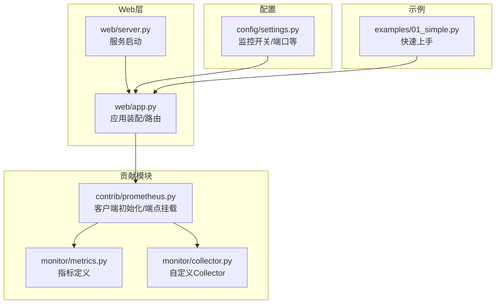
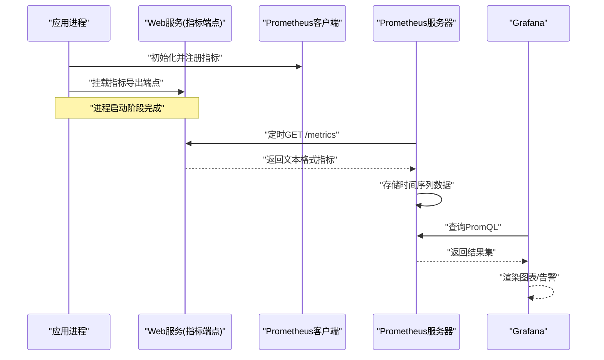
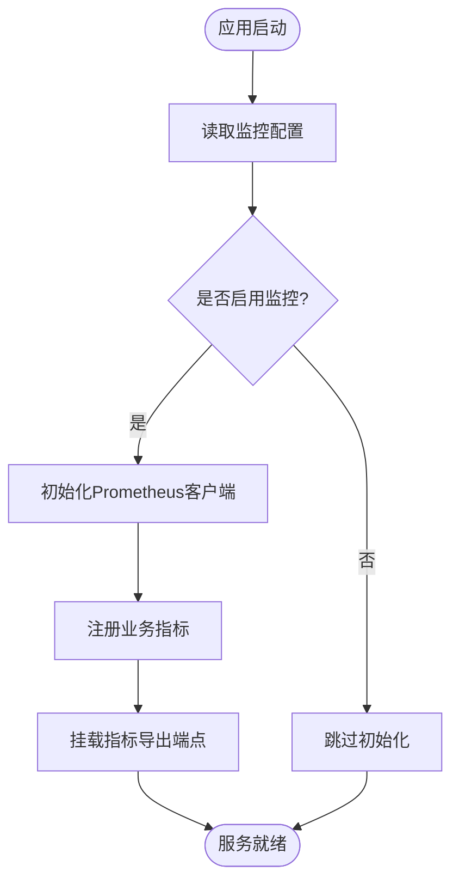
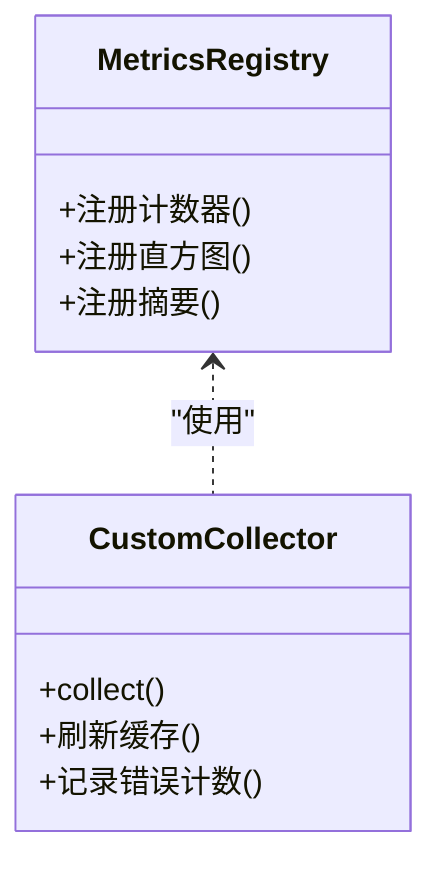
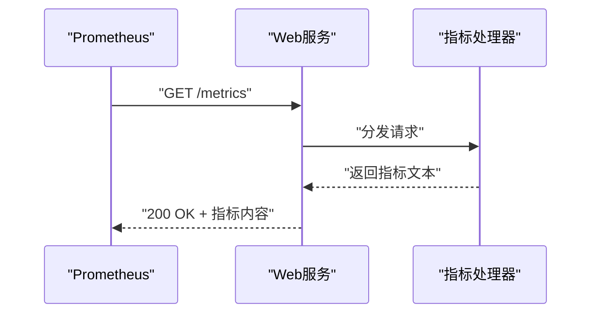
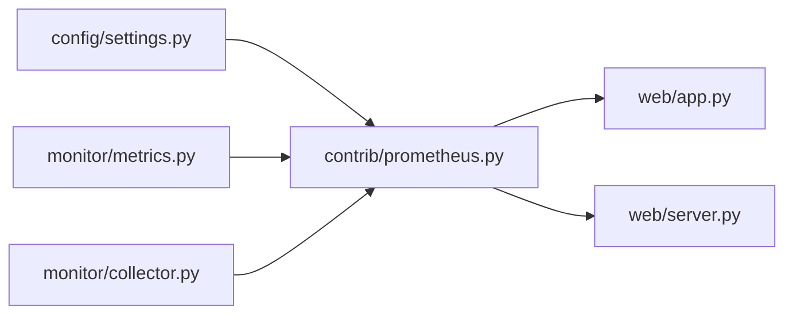

# Prometheus集成

<cite>
**本文引用的文件**   
- [src/neotask/contrib/prometheus.py](file://src/neotask/contrib/prometheus.py)
- [src/neotask/monitor/metrics.py](file://src/neotask/monitor/metrics.py)
- [src/neotask/monitor/collector.py](file://src/neotask/monitor/collector.py)
- [src/neotask/web/app.py](file://src/neotask/web/app.py)
- [src/neotask/web/server.py](file://src/neotask/web/server.py)
- [src/neotask/config/settings.py](file://src/neotask/config/settings.py)
- [examples/01_simple.py](file://examples/01_simple.py)
</cite>

## 目录
1. [简介](#简介)
2. [项目结构](#项目结构)
3. [核心组件](#核心组件)
4. [架构总览](#架构总览)
5. [详细组件分析](#详细组件分析)
6. [依赖关系分析](#依赖关系分析)
7. [性能考虑](#性能考虑)
8. [故障排查指南](#故障排查指南)
9. [结论](#结论)
10. [附录](#附录)

## 简介
本章节面向需要在任务调度系统中接入Prometheus监控的读者，系统性地介绍：
- Prometheus客户端初始化与指标导出端点配置
- Prometheus抓取配置与服务发现集成方式
- Grafana仪表板模板与常用监控图表的配置方法
- PromQL查询示例与告警规则定义思路

本项目在contrib层提供Prometheus集成能力，并在web层暴露指标导出端点；同时通过monitor模块组织指标采集与上报逻辑。

## 项目结构
与Prometheus集成相关的代码主要分布在以下位置：
- contrib/prometheus.py：Prometheus客户端初始化、指标注册与导出端点挂载
- monitor/metrics.py：业务指标定义（计数器、直方图、摘要等）
- monitor/collector.py：自定义Collector实现，用于周期性或事件驱动的数据收集
- web/app.py / web/server.py：Web服务启动与路由挂载，包含指标导出端点
- config/settings.py：应用配置项（如是否启用监控、端口等）
- examples/01_simple.py：最小可运行示例，展示如何启用监控

图示来源
- [src/neotask/contrib/prometheus.py](file://src/neotask/contrib/prometheus.py)
- [src/neotask/monitor/metrics.py](file://src/neotask/monitor/metrics.py)
- [src/neotask/monitor/collector.py](file://src/neotask/monitor/collector.py)
- [src/neotask/web/app.py](file://src/neotask/web/app.py)
- [src/neotask/web/server.py](file://src/neotask/web/server.py)
- [src/neotask/config/settings.py](file://src/neotask/config/settings.py)
- [examples/01_simple.py](file://examples/01_simple.py)

章节来源
- [src/neotask/contrib/prometheus.py](file://src/neotask/contrib/prometheus.py)
- [src/neotask/monitor/metrics.py](file://src/neotask/monitor/metrics.py)
- [src/neotask/monitor/collector.py](file://src/neotask/monitor/collector.py)
- [src/neotask/web/app.py](file://src/neotask/web/app.py)
- [src/neotask/web/server.py](file://src/neotask/web/server.py)
- [src/neotask/config/settings.py](file://src/neotask/config/settings.py)
- [examples/01_simple.py](file://examples/01_simple.py)

## 核心组件
- Prometheus客户端初始化与端点挂载
  - 负责创建Prometheus客户端实例、注册业务指标、暴露标准导出端点（通常为HTTP GET），供Prometheus抓取。
  - 通常由应用启动流程调用，确保在进程生命周期内只初始化一次。
- 指标定义（monitor/metrics.py）
  - 集中定义计数器、直方图、摘要等指标类型，命名遵循领域语义，便于后续Grafana可视化与告警。
- 自定义Collector（monitor/collector.py）
  - 通过自定义Collector拉取运行时状态或第三方系统指标，统一纳入Prometheus生态。
- Web服务与路由（web/app.py / web/server.py）
  - 将指标导出端点挂载到Web服务，支持在同一进程中对外暴露metrics接口。
- 配置（config/settings.py）
  - 提供监控开关、导出端口、标签等配置项，控制是否启用以及行为细节。
- 示例（examples/01_simple.py）
  - 演示最小可用集成路径，帮助快速验证端到端链路。

章节来源
- [src/neotask/contrib/prometheus.py](file://src/neotask/contrib/prometheus.py)
- [src/neotask/monitor/metrics.py](file://src/neotask/monitor/metrics.py)
- [src/neotask/monitor/collector.py](file://src/neotask/monitor/collector.py)
- [src/neotask/web/app.py](file://src/neotask/web/app.py)
- [src/neotask/web/server.py](file://src/neotask/web/server.py)
- [src/neotask/config/settings.py](file://src/neotask/config/settings.py)
- [examples/01_simple.py](file://examples/01_simple.py)

## 架构总览
下图展示了从应用启动到Prometheus抓取再到Grafana可视化的整体流程。

图示来源
- [src/neotask/contrib/prometheus.py](file://src/neotask/contrib/prometheus.py)
- [src/neotask/web/app.py](file://src/neotask/web/app.py)
- [src/neotask/web/server.py](file://src/neotask/web/server.py)

## 详细组件分析

### Prometheus客户端与导出端点
- 职责
  - 初始化Prometheus客户端，注册业务指标，暴露标准导出端点。
  - 保证指标注册幂等，避免重复注册导致异常。
- 关键流程
  - 应用启动时调用初始化函数
  - 根据配置决定是否启用指标导出
  - 将导出端点挂载到Web服务
- 典型错误处理
  - 端口占用：捕获绑定失败并给出明确提示
  - 重复注册：检测已存在指标并跳过或抛出友好错误

图示来源
- [src/neotask/contrib/prometheus.py](file://src/neotask/contrib/prometheus.py)
- [src/neotask/web/app.py](file://src/neotask/web/app.py)
- [src/neotask/web/server.py](file://src/neotask/web/server.py)
- [src/neotask/config/settings.py](file://src/neotask/config/settings.py)

章节来源
- [src/neotask/contrib/prometheus.py](file://src/neotask/contrib/prometheus.py)
- [src/neotask/web/app.py](file://src/neotask/web/app.py)
- [src/neotask/web/server.py](file://src/neotask/web/server.py)
- [src/neotask/config/settings.py](file://src/neotask/config/settings.py)

### 指标定义与采集
- 指标定义（monitor/metrics.py）
  - 按功能域划分指标命名空间，使用统一的标签策略（如任务类型、队列名、节点ID等）。
  - 为关键路径添加直方图/摘要以观测延迟分布。
- 自定义Collector（monitor/collector.py）
  - 封装外部系统指标拉取逻辑，定期刷新缓存，降低对下游系统的压力。
  - 提供健康检查相关指标（如最近成功采集时间、错误计数）。

图示来源
- [src/neotask/monitor/metrics.py](file://src/neotask/monitor/metrics.py)
- [src/neotask/monitor/collector.py](file://src/neotask/monitor/collector.py)

章节来源
- [src/neotask/monitor/metrics.py](file://src/neotask/monitor/metrics.py)
- [src/neotask/monitor/collector.py](file://src/neotask/monitor/collector.py)

### Web服务与指标导出端点
- 职责
  - 将指标导出端点挂载到Web服务，确保与业务API共享同一监听端口或独立端口。
- 注意事项
  - 避免在高QPS场景下对指标端点进行鉴权之外的额外开销
  - 合理设置超时与并发限制，防止指标抓取影响主业务

图示来源
- [src/neotask/web/app.py](file://src/neotask/web/app.py)
- [src/neotask/web/server.py](file://src/neotask/web/server.py)

章节来源
- [src/neotask/web/app.py](file://src/neotask/web/app.py)
- [src/neotask/web/server.py](file://src/neotask/web/server.py)

### 配置项与示例
- 配置项（config/settings.py）
  - 监控开关、导出端口、标签默认值等
- 示例（examples/01_simple.py）
  - 展示最小化启用监控的步骤，包括初始化与启动服务

章节来源
- [src/neotask/config/settings.py](file://src/neotask/config/settings.py)
- [examples/01_simple.py](file://examples/01_simple.py)

## 依赖关系分析
- 组件耦合
  - contrib/prometheus.py 依赖 monitor/metrics.py 与 monitor/collector.py
  - web/app.py 与 web/server.py 负责挂载导出端点
  - config/settings.py 贯穿各模块，提供统一配置入口
- 外部依赖
  - Prometheus Python客户端库
  - Web框架（用于挂载HTTP端点）

图示来源
- [src/neotask/contrib/prometheus.py](file://src/neotask/contrib/prometheus.py)
- [src/neotask/monitor/metrics.py](file://src/neotask/monitor/metrics.py)
- [src/neotask/monitor/collector.py](file://src/neotask/monitor/collector.py)
- [src/neotask/web/app.py](file://src/neotask/web/app.py)
- [src/neotask/web/server.py](file://src/neotask/web/server.py)
- [src/neotask/config/settings.py](file://src/neotask/config/settings.py)

章节来源
- [src/neotask/contrib/prometheus.py](file://src/neotask/contrib/prometheus.py)
- [src/neotask/monitor/metrics.py](file://src/neotask/monitor/metrics.py)
- [src/neotask/monitor/collector.py](file://src/neotask/monitor/collector.py)
- [src/neotask/web/app.py](file://src/neotask/web/app.py)
- [src/neotask/web/server.py](file://src/neotask/web/server.py)
- [src/neotask/config/settings.py](file://src/neotask/config/settings.py)

## 性能考虑
- 指标粒度与基数
  - 避免高基数字段作为标签，防止时间序列爆炸
- 采样与聚合
  - 对高频事件采用增量更新与批量上报策略
- 端点优化
  - 指标导出端点尽量无锁、无IO阻塞，必要时增加限流
- 资源隔离
  - 若指标端点与业务API共用端口，建议开启独立的线程池或进程隔离

[本节为通用指导，不直接分析具体文件]

## 故障排查指南
- 常见问题
  - 指标未出现：确认监控开关已启用、端点已挂载、Prometheus抓取目标可达
  - 端口冲突：检查导出端口是否被占用，调整配置后重启
  - 指标重复注册：确保初始化仅执行一次，或在注册前进行去重判断
- 定位步骤
  - 访问本地指标端点，确认返回格式正确
  - 查看Prometheus目标页面，确认状态为UP
  - 在Grafana中尝试基础PromQL查询，验证数据可用性

章节来源
- [src/neotask/contrib/prometheus.py](file://src/neotask/contrib/prometheus.py)
- [src/neotask/web/app.py](file://src/neotask/web/app.py)
- [src/neotask/web/server.py](file://src/neotask/web/server.py)
- [src/neotask/config/settings.py](file://src/neotask/config/settings.py)

## 结论
通过在contrib层集中管理Prometheus客户端与指标导出端点，配合monitor层的指标定义与自定义Collector，以及web层的端点挂载，本项目提供了开箱即用的监控能力。结合合理的配置与最佳实践，可在不影响主业务的前提下获得高质量的运行时可观测性。

[本节为总结性内容，不直接分析具体文件]

## 附录

### Prometheus抓取配置与服务发现集成
- 静态抓取
  - 在Prometheus配置中添加job，指向应用的指标导出端点地址
- 服务发现
  - 基于Kubernetes Service/Endpoints、Consul、Etcd等机制自动发现目标
  - 通过labels与relabeling对指标进行过滤与标准化

[本节为概念性说明，不直接分析具体文件]

### Grafana仪表板模板与常用监控图表
- 推荐图表
  - 任务提交速率（计数器每秒增长率）
  - 任务执行耗时分布（直方图分位数）
  - 队列积压深度（当前待处理数量）
  - 错误率与重试次数（按任务类型/队列维度）
- 模板导入
  - 在Grafana中导入JSON模板，选择对应数据源（Prometheus）
  - 校验变量与标签映射，确保与指标命名一致

[本节为概念性说明，不直接分析具体文件]

### PromQL查询示例
- 任务提交速率
  - 示例：rate(任务提交总数[5m])
- 任务执行耗时P95
  - 示例：histogram_quantile(0.95, sum by (le)(任务执行耗时桶[5m]))
- 队列积压
  - 示例：sum(队列积压数) by (队列名)
- 错误率
  - 示例：sum(rate(任务失败总数[5m])) / sum(rate(任务提交总数[5m]))

[本节为概念性说明，不直接分析具体文件]

### 告警规则定义
- 建议告警
  - 任务失败率超过阈值持续N分钟
  - 队列积压超过阈值持续N分钟
  - 任务执行耗时P99超过阈值
- 规则文件
  - 在Prometheus规则文件中定义告警表达式、持续时间、标签与通知渠道

[本节为概念性说明，不直接分析具体文件]