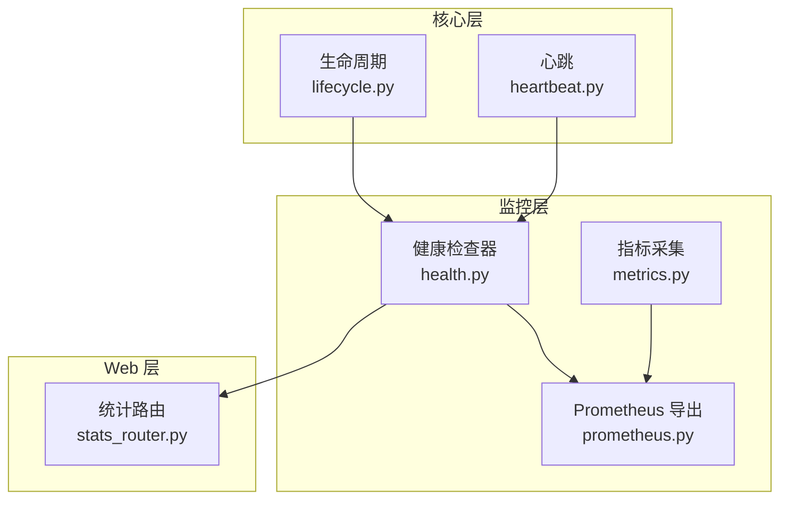
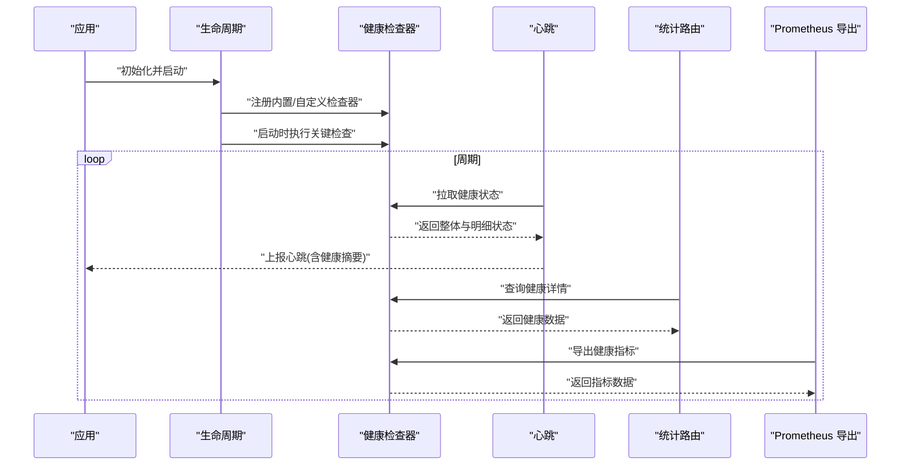
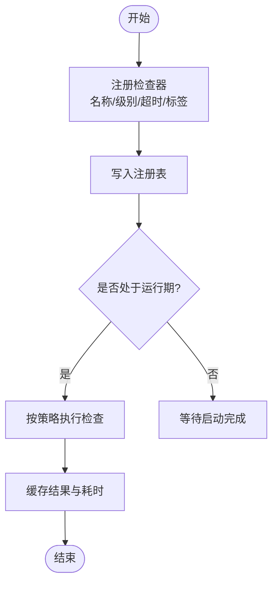
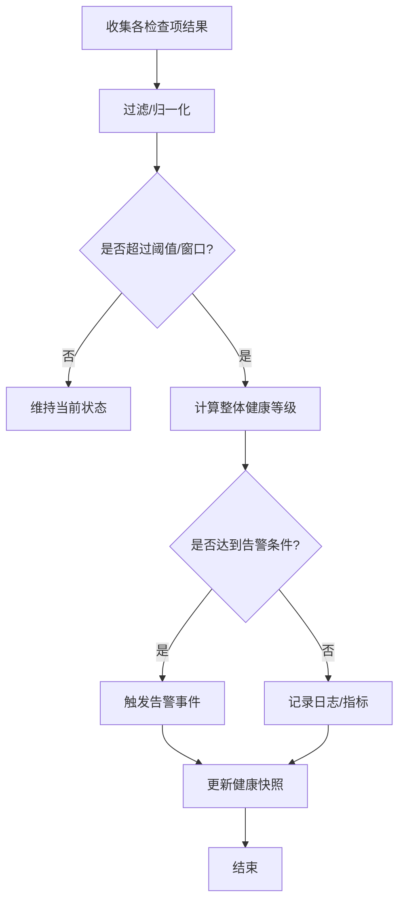
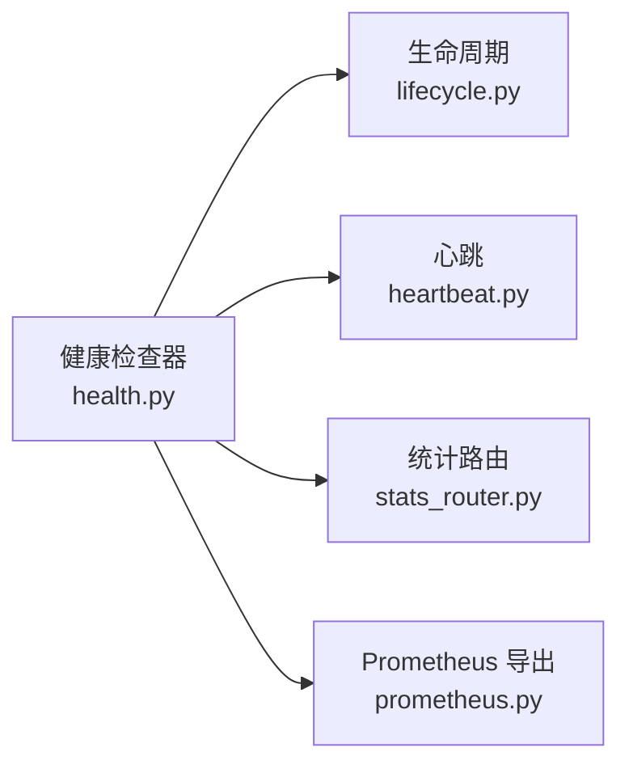

# 健康检查机制

<cite>
**本文引用的文件**   
- [src/neotask/monitor/health.py](file://src/neotask/monitor/health.py)
- [src/neotask/core/lifecycle.py](file://src/neotask/core/lifecycle.py)
- [src/neotask/core/heartbeat.py](file://src/neotask/core/heartbeat.py)
- [src/neotask/web/routes/stats_router.py](file://src/neotask/web/routes/stats_router.py)
- [src/neotask/contrib/prometheus.py](file://src/neotask/contrib/prometheus.py)
- [tests/unit/test_metrics.py](file://tests/unit/test_metrics.py)
</cite>

## 目录
1. [简介](#简介)
2. [项目结构](#项目结构)
3. [核心组件](#核心组件)
4. [架构总览](#架构总览)
5. [详细组件分析](#详细组件分析)
6. [依赖关系分析](#依赖关系分析)
7. [性能考虑](#性能考虑)
8. [故障排查指南](#故障排查指南)
9. [结论](#结论)
10. [附录](#附录)

## 简介
本文件系统性阐述健康检查系统的设计与实现，覆盖以下目标：
- 健康检查点的注册与管理机制
- 不同级别的检查（服务可用性、依赖组件状态、资源使用情况）
- 健康状态的判断逻辑与告警触发条件
- 自定义健康检查器的开发指南与集成示例

该机制贯穿生命周期管理、心跳上报、Web 统计接口与指标导出等子系统，为任务调度系统的可观测性与稳定性提供基础保障。

## 项目结构
健康检查相关代码主要位于 monitor 模块，并与 core、web、contrib 等模块协作：
- monitor/health.py：健康检查器注册表、聚合器、状态计算与告警触发
- core/lifecycle.py：生命周期钩子中集成健康检查
- core/heartbeat.py：心跳周期与健康状态上报
- web/routes/stats_router.py：对外暴露健康与统计信息
- contrib/prometheus.py：将健康指标暴露给 Prometheus
- tests/unit/test_metrics.py：对监控指标的单元测试参考

图表来源
- [src/neotask/monitor/health.py](file://src/neotask/monitor/health.py)
- [src/neotask/core/lifecycle.py](file://src/neotask/core/lifecycle.py)
- [src/neotask/core/heartbeat.py](file://src/neotask/core/heartbeat.py)
- [src/neotask/web/routes/stats_router.py](file://src/neotask/web/routes/stats_router.py)
- [src/neotask/contrib/prometheus.py](file://src/neotask/contrib/prometheus.py)

章节来源
- [src/neotask/monitor/health.py](file://src/neotask/monitor/health.py)
- [src/neotask/core/lifecycle.py](file://src/neotask/core/lifecycle.py)
- [src/neotask/core/heartbeat.py](file://src/neotask/core/heartbeat.py)
- [src/neotask/web/routes/stats_router.py](file://src/neotask/web/routes/stats_router.py)
- [src/neotask/contrib/prometheus.py](file://src/neotask/contrib/prometheus.py)

## 核心组件
- 健康检查器注册表：集中管理所有已注册的健康检查点，支持按名称或标签查询、批量执行、结果聚合。
- 健康状态聚合器：根据各检查点返回的状态与权重，计算整体健康度，并维护历史快照用于趋势分析。
- 告警触发器：基于阈值、连续失败次数、持续时间等规则触发告警事件，供外部系统消费。
- 生命周期集成：在启动、就绪、停止等阶段自动执行关键健康检查，确保系统进入稳定态。
- 心跳集成：周期性拉取健康状态并上报，支撑集群协调与负载均衡。
- Web 统计接口：提供 HTTP 端点输出当前健康概览与明细。
- 指标导出：将健康相关指标以 Prometheus 格式暴露，便于监控平台抓取。

章节来源
- [src/neotask/monitor/health.py](file://src/neotask/monitor/health.py)
- [src/neotask/core/lifecycle.py](file://src/neotask/core/lifecycle.py)
- [src/neotask/core/heartbeat.py](file://src/neotask/core/heartbeat.py)
- [src/neotask/web/routes/stats_router.py](file://src/neotask/web/routes/stats_router.py)
- [src/neotask/contrib/prometheus.py](file://src/neotask/contrib/prometheus.py)

## 架构总览
健康检查系统采用“插件式”设计：业务侧通过统一接口注册检查器，框架负责调度、聚合、上报与展示。

图表来源
- [src/neotask/core/lifecycle.py](file://src/neotask/core/lifecycle.py)
- [src/neotask/monitor/health.py](file://src/neotask/monitor/health.py)
- [src/neotask/core/heartbeat.py](file://src/neotask/core/heartbeat.py)
- [src/neotask/web/routes/stats_router.py](file://src/neotask/web/routes/stats_router.py)
- [src/neotask/contrib/prometheus.py](file://src/neotask/contrib/prometheus.py)

## 详细组件分析

### 健康检查器注册与管理
- 注册入口：提供统一的注册函数/装饰器，支持指定检查器名称、级别、超时、重试策略与标签。
- 存储结构：使用线程安全的容器保存检查器元信息与可调参数，支持动态增删改。
- 执行模型：支持串行与并行两种模式；对于 I/O 密集型检查建议并行执行，配合超时控制避免拖慢整体健康评估。
- 结果缓存：最近一次检查结果会被缓存，减少重复计算开销，并提供时间戳与耗时统计。

图表来源
- [src/neotask/monitor/health.py](file://src/neotask/monitor/health.py)

章节来源
- [src/neotask/monitor/health.py](file://src/neotask/monitor/health.py)

### 健康级别与检查类型
- 服务可用性：进程存活、端口监听、关键协程/线程池状态。
- 依赖组件状态：数据库连接、消息队列、分布式锁、外部 API 可达性。
- 资源使用情况：CPU、内存、磁盘、网络 IO、句柄数、队列积压等。
- 业务级健康：任务堆积、失败率、延迟分位、副本一致性等。

每种检查返回标准化结果对象，包含状态码、消息、耗时、附加指标键值对，便于聚合与可视化。

章节来源
- [src/neotask/monitor/health.py](file://src/neotask/monitor/health.py)

### 健康状态判断与告警触发
- 状态计算：对各检查项进行加权投票或优先级判定，得到整体健康等级（如正常、降级、异常）。
- 阈值与窗口：支持配置连续失败次数、持续时间窗口、抖动抑制等，避免瞬时抖动导致误报。
- 告警规则：当整体健康低于阈值或关键检查失败时触发告警事件，附带上下文与诊断信息。
- 幂等与去抖：同一告警在短时间内不会重复触发，恢复后发送恢复通知。

图表来源
- [src/neotask/monitor/health.py](file://src/neotask/monitor/health.py)

章节来源
- [src/neotask/monitor/health.py](file://src/neotask/monitor/health.py)

### 生命周期集成
- 启动阶段：加载默认检查器，执行快速自检，确保关键依赖可用后再对外提供服务。
- 就绪阶段：确认所有关键检查通过后标记服务为“就绪”，允许流量接入。
- 停止阶段：优雅关闭后台任务，再次执行清理类检查，确保无泄漏与残留任务。

章节来源
- [src/neotask/core/lifecycle.py](file://src/neotask/core/lifecycle.py)

### 心跳集成
- 周期拉取：心跳循环定期调用健康检查器获取整体状态与关键指标摘要。
- 上报内容：心跳载荷包含节点标识、时间戳、整体健康等级、关键检查项摘要。
- 容错策略：心跳失败不阻塞主流程，仅记录错误并降低上报频率。

章节来源
- [src/neotask/core/heartbeat.py](file://src/neotask/core/heartbeat.py)

### Web 统计接口
- 提供只读接口，返回当前健康概览与明细，便于运维面板展示与自动化巡检。
- 支持分页与过滤，可按级别或标签筛选检查项。

章节来源
- [src/neotask/web/routes/stats_router.py](file://src/neotask/web/routes/stats_router.py)

### 指标导出（Prometheus）
- 将健康等级、检查项状态、耗时分布、告警计数等指标以标准格式暴露。
- 与现有监控系统对接，支持远程抓取与告警联动。

章节来源
- [src/neotask/contrib/prometheus.py](file://src/neotask/contrib/prometheus.py)

### 自定义健康检查器开发指南
- 定义检查器：实现统一接口，返回标准化结果对象（状态、消息、耗时、指标键值）。
- 注册检查器：通过注册函数或装饰器加入健康检查器集合，指定名称、级别、超时与标签。
- 编写测试：参考现有单元测试范式，构造模拟依赖，验证边界条件与超时处理。
- 集成示例：在应用启动时注册业务检查器，并在 Web 路由与 Prometheus 导出中可见。

章节来源
- [src/neotask/monitor/health.py](file://src/neotask/monitor/health.py)
- [tests/unit/test_metrics.py](file://tests/unit/test_metrics.py)

## 依赖关系分析
健康检查系统与多模块存在耦合关系，需关注内聚与解耦：
- 低耦合：检查器接口抽象清晰，业务检查器无需感知底层实现细节。
- 高内聚：健康状态计算、告警规则集中在 health 模块，便于维护与扩展。
- 外部依赖：Prometheus 导出与 Web 路由作为消费者，不应反向影响健康检查核心逻辑。

图表来源
- [src/neotask/monitor/health.py](file://src/neotask/monitor/health.py)
- [src/neotask/core/lifecycle.py](file://src/neotask/core/lifecycle.py)
- [src/neotask/core/heartbeat.py](file://src/neotask/core/heartbeat.py)
- [src/neotask/web/routes/stats_router.py](file://src/neotask/web/routes/stats_router.py)
- [src/neotask/contrib/prometheus.py](file://src/neotask/contrib/prometheus.py)

章节来源
- [src/neotask/monitor/health.py](file://src/neotask/monitor/health.py)
- [src/neotask/core/lifecycle.py](file://src/neotask/core/lifecycle.py)
- [src/neotask/core/heartbeat.py](file://src/neotask/core/heartbeat.py)
- [src/neotask/web/routes/stats_router.py](file://src/neotask/web/routes/stats_router.py)
- [src/neotask/contrib/prometheus.py](file://src/neotask/contrib/prometheus.py)

## 性能考虑
- 并行执行：对 I/O 密集的检查项启用并行执行，结合超时控制避免长尾影响整体健康评估。
- 结果缓存：缓存最近一次检查结果，减少重复计算，提高 Web 与心跳拉取性能。
- 轻量检查：优先实现快速路径检查（如进程存活、端口监听），复杂检查异步执行或降频。
- 指标采样：对高频指标进行采样与聚合，降低导出与存储压力。

## 故障排查指南
- 检查器未生效：确认是否正确注册且未被过滤器排除；查看注册表与日志输出。
- 健康状态异常：定位具体检查项失败原因，检查依赖连通性与资源占用；查看告警事件与指标趋势。
- 心跳上报失败：核对心跳周期配置与网络连通性；观察错误日志与重试策略。
- Web 接口无响应：确认路由已挂载与权限设置；检查健康检查器是否阻塞。
- Prometheus 抓取失败：验证导出端点可达性与指标命名规范；检查监控平台配置。

章节来源
- [src/neotask/monitor/health.py](file://src/neotask/monitor/health.py)
- [src/neotask/core/heartbeat.py](file://src/neotask/core/heartbeat.py)
- [src/neotask/web/routes/stats_router.py](file://src/neotask/web/routes/stats_router.py)
- [src/neotask/contrib/prometheus.py](file://src/neotask/contrib/prometheus.py)

## 结论
健康检查系统通过统一的注册与管理机制，将服务可用性、依赖组件状态与资源使用情况纳入统一视图，并结合生命周期与心跳上报形成闭环。其可扩展的插件式设计与清晰的告警规则，为系统的可观测性与稳定性提供了坚实基础。

## 附录
- 最佳实践
  - 为每个检查器设置合理的超时与重试策略，避免相互阻塞。
  - 使用标签对检查器进行分类，便于在 Web 与指标中筛选与聚合。
  - 在灰度发布期间逐步引入新检查器，观察健康趋势后再全量上线。
- 参考测试
  - 参考单元测试中对指标与行为的断言方式，构建健壮的检查器用例。

章节来源
- [tests/unit/test_metrics.py](file://tests/unit/test_metrics.py)