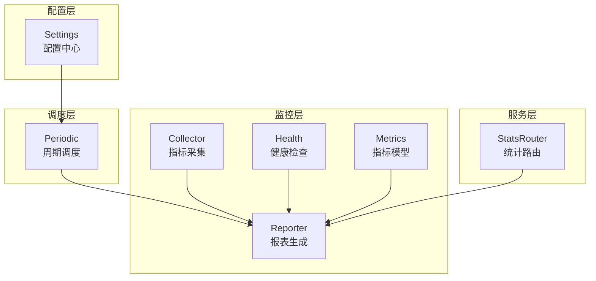
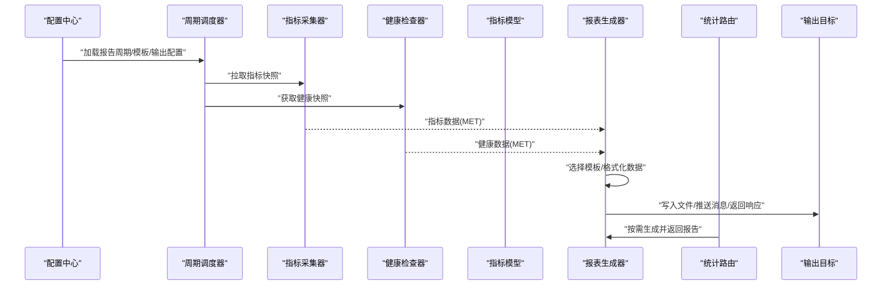
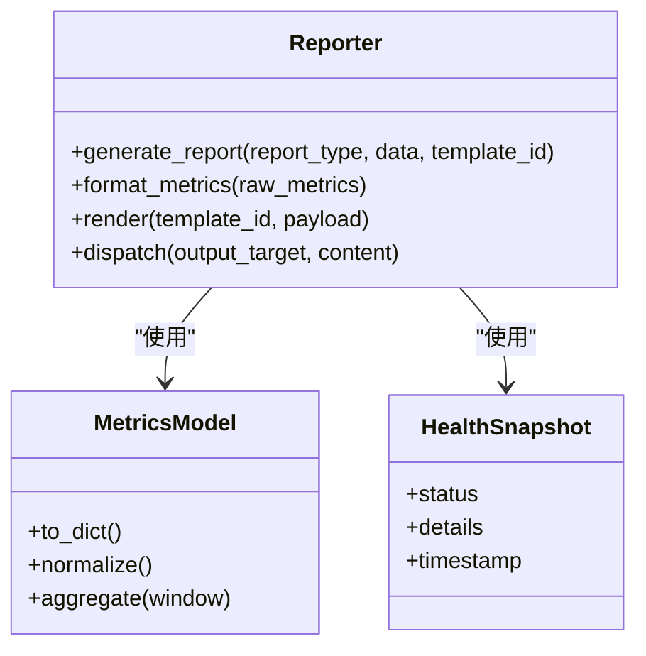
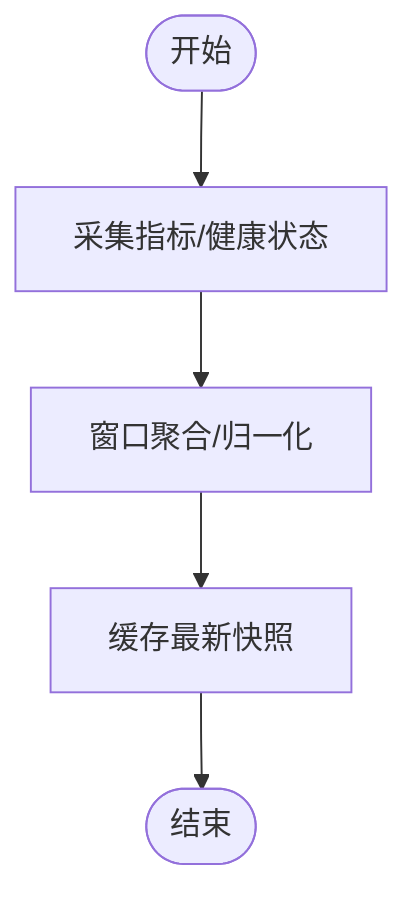
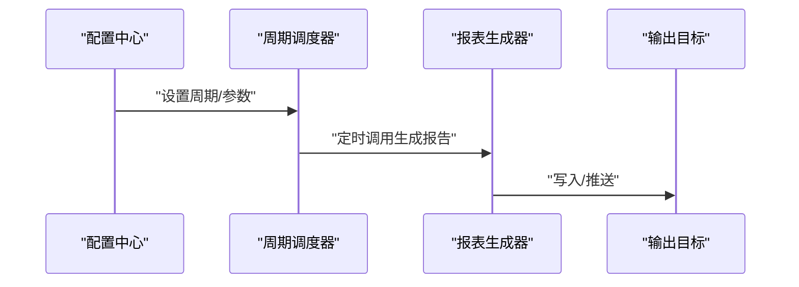
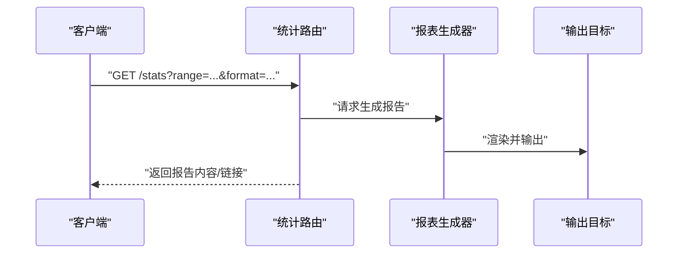
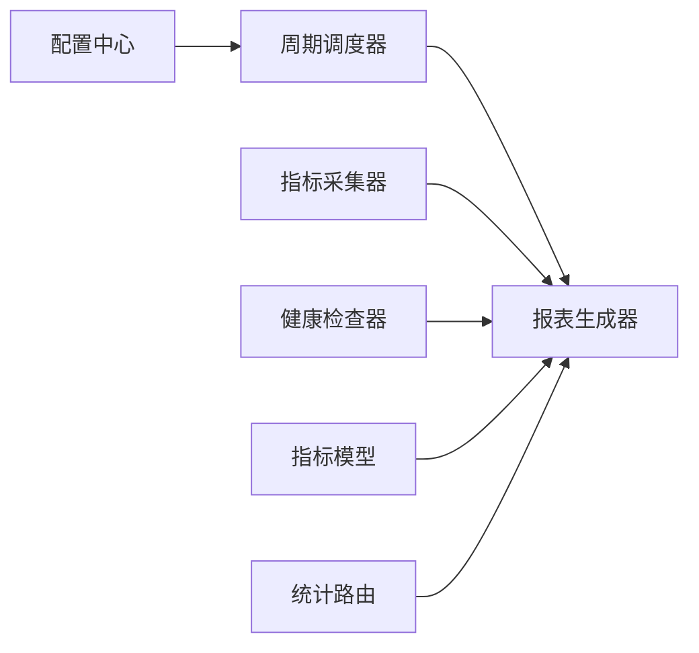

# 报告生成系统

<cite>
**本文引用的文件**   
- [src/neotask/monitor/reporter.py](file://src/neotask/monitor/reporter.py)
- [src/neotask/monitor/metrics.py](file://src/neotask/monitor/metrics.py)
- [src/neotask/monitor/collector.py](file://src/neotask/monitor/collector.py)
- [src/neotask/monitor/health.py](file://src/neotask/monitor/health.py)
- [src/neotask/web/routes/stats_router.py](file://src/neotask/web/routes/stats_router.py)
- [src/neotask/scheduler/periodic.py](file://src/neotask/scheduler/periodic.py)
- [src/neotask/config/settings.py](file://src/neotask/config/settings.py)
- [examples/08_periodic.py](file://examples/08_periodic.py)
</cite>

## 目录
1. [简介](#简介)
2. [项目结构](#项目结构)
3. [核心组件](#核心组件)
4. [架构总览](#架构总览)
5. [详细组件分析](#详细组件分析)
6. [依赖关系分析](#依赖关系分析)
7. [性能考虑](#性能考虑)
8. [故障排查指南](#故障排查指南)
9. [结论](#结论)
10. [附录](#附录)

## 简介
本报告生成系统围绕监控与指标采集、定时调度与分发、以及面向多类型报告的模板化输出展开。系统支持三类典型报告：
- 性能报告：基于运行时指标（吞吐、延迟、资源占用等）聚合生成的趋势与对比结果。
- 错误报告：从任务执行异常、健康检查失败、队列死信等来源汇总的错误统计与根因线索。
- 统计报告：对任务生命周期、队列状态、节点健康度等进行多维度的统计摘要。

系统通过统一的指标收集器与报表生成器，结合周期性调度与Web接口，实现“采集—处理—渲染—分发”的闭环流程，并提供扩展点以支持自定义报告类型与数据格式化策略。

## 项目结构
与报告生成相关的核心代码位于 monitor、scheduler、web 与 config 模块中：
- monitor：负责指标采集、健康检查、报表生成与导出。
- scheduler：提供周期性任务调度能力，驱动定时报告生成。
- web：提供查询与导出接口，便于外部系统集成或人工下载。
- config：集中管理配置项，包括报告开关、周期、输出路径等。

图表来源
- [src/neotask/monitor/collector.py](file://src/neotask/monitor/collector.py)
- [src/neotask/monitor/health.py](file://src/neotask/monitor/health.py)
- [src/neotask/monitor/metrics.py](file://src/neotask/monitor/metrics.py)
- [src/neotask/monitor/reporter.py](file://src/neotask/monitor/reporter.py)
- [src/neotask/scheduler/periodic.py](file://src/neotask/scheduler/periodic.py)
- [src/neotask/web/routes/stats_router.py](file://src/neotask/web/routes/stats_router.py)
- [src/neotask/config/settings.py](file://src/neotask/config/settings.py)

章节来源
- [src/neotask/monitor/reporter.py](file://src/neotask/monitor/reporter.py)
- [src/neotask/monitor/metrics.py](file://src/neotask/monitor/metrics.py)
- [src/neotask/monitor/collector.py](file://src/neotask/monitor/collector.py)
- [src/neotask/monitor/health.py](file://src/neotask/monitor/health.py)
- [src/neotask/web/routes/stats_router.py](file://src/neotask/web/routes/stats_router.py)
- [src/neotask/scheduler/periodic.py](file://src/neotask/scheduler/periodic.py)
- [src/neotask/config/settings.py](file://src/neotask/config/settings.py)

## 核心组件
- 指标采集器（Collector）：统一接入各子系统指标源，按时间窗口聚合并缓存。
- 健康检查器（Health）：周期性探测关键依赖与节点状态，产出健康快照。
- 指标模型（Metrics）：定义指标数据结构与序列化格式，支撑多格式输出。
- 报表生成器（Reporter）：根据模板与数据源生成性能、错误、统计三类报告，支持多种输出目标。
- 周期调度器（Periodic）：基于配置触发报表生成任务，支持固定间隔与Cron表达式。
- 统计路由（StatsRouter）：对外暴露查询与导出接口，供WebUI或外部系统消费。
- 配置中心（Settings）：集中管理报告开关、周期、模板、输出路径、分发策略等。

章节来源
- [src/neotask/monitor/collector.py](file://src/neotask/monitor/collector.py)
- [src/neotask/monitor/health.py](file://src/neotask/monitor/health.py)
- [src/neotask/monitor/metrics.py](file://src/neotask/monitor/metrics.py)
- [src/neotask/monitor/reporter.py](file://src/neotask/monitor/reporter.py)
- [src/neotask/scheduler/periodic.py](file://src/neotask/scheduler/periodic.py)
- [src/neotask/web/routes/stats_router.py](file://src/neotask/web/routes/stats_router.py)
- [src/neotask/config/settings.py](file://src/neotask/config/settings.py)

## 架构总览
下图展示了从数据采集到报告分发的端到端流程，涵盖定时触发、数据聚合、模板渲染与多渠道分发。

图表来源
- [src/neotask/config/settings.py](file://src/neotask/config/settings.py)
- [src/neotask/scheduler/periodic.py](file://src/neotask/scheduler/periodic.py)
- [src/neotask/monitor/collector.py](file://src/neotask/monitor/collector.py)
- [src/neotask/monitor/health.py](file://src/neotask/monitor/health.py)
- [src/neotask/monitor/metrics.py](file://src/neotask/monitor/metrics.py)
- [src/neotask/monitor/reporter.py](file://src/neotask/monitor/reporter.py)
- [src/neotask/web/routes/stats_router.py](file://src/neotask/web/routes/stats_router.py)

## 详细组件分析

### 报表生成器（Reporter）
- 职责：接收指标与健康数据，依据模板与格式化策略生成性能、错误、统计三类报告；支持多输出目标（文件、消息总线、HTTP响应）。
- 关键点：
  - 模板系统：通过模板标识选择渲染引擎与布局，支持变量替换与片段组合。
  - 数据格式化：将原始指标转换为结构化对象，统一时区、单位与精度。
  - 错误报告：聚合异常堆栈、重试次数、失败率、最近失败时间等。
  - 性能报告：计算P95/P99延迟、吞吐、CPU/内存使用率、队列积压等。
  - 统计报告：汇总任务状态分布、节点健康度、资源利用率等。
  - 分发：支持本地落盘、远程推送、事件通知等。

图表来源
- [src/neotask/monitor/reporter.py](file://src/neotask/monitor/reporter.py)
- [src/neotask/monitor/metrics.py](file://src/neotask/monitor/metrics.py)
- [src/neotask/monitor/health.py](file://src/neotask/monitor/health.py)

章节来源
- [src/neotask/monitor/reporter.py](file://src/neotask/monitor/reporter.py)
- [src/neotask/monitor/metrics.py](file://src/neotask/monitor/metrics.py)
- [src/neotask/monitor/health.py](file://src/neotask/monitor/health.py)

### 指标采集器（Collector）与健康检查器（Health）
- 指标采集器：
  - 对接执行器、队列、存储、分布式协调器等子系统，定期采样指标。
  - 提供窗口聚合与去重逻辑，降低下游压力。
- 健康检查器：
  - 周期性探测关键依赖（数据库、消息中间件、磁盘空间等）。
  - 输出健康快照，作为错误报告与健康报告的重要输入。

图表来源
- [src/neotask/monitor/collector.py](file://src/neotask/monitor/collector.py)
- [src/neotask/monitor/health.py](file://src/neotask/monitor/health.py)

章节来源
- [src/neotask/monitor/collector.py](file://src/neotask/monitor/collector.py)
- [src/neotask/monitor/health.py](file://src/neotask/monitor/health.py)

### 周期调度器（Periodic）与示例集成
- 周期调度器：
  - 读取配置中的报告周期（固定间隔或Cron），触发报表生成任务。
  - 支持并发控制与失败重试，避免重复生成与资源争用。
- 示例集成：
  - 参考示例脚本展示如何注册周期性任务与自定义回调。

图表来源
- [src/neotask/scheduler/periodic.py](file://src/neotask/scheduler/periodic.py)
- [examples/08_periodic.py](file://examples/08_periodic.py)

章节来源
- [src/neotask/scheduler/periodic.py](file://src/neotask/scheduler/periodic.py)
- [examples/08_periodic.py](file://examples/08_periodic.py)

### Web统计路由（StatsRouter）
- 职责：提供查询与导出接口，支持按时间范围、维度过滤与格式选择。
- 场景：
  - 实时查看当前报告摘要。
  - 按需生成历史报告并返回下载链接或流式内容。
  - 与外部系统集成（如告警平台、BI工具）。

图表来源
- [src/neotask/web/routes/stats_router.py](file://src/neotask/web/routes/stats_router.py)
- [src/neotask/monitor/reporter.py](file://src/neotask/monitor/reporter.py)

章节来源
- [src/neotask/web/routes/stats_router.py](file://src/neotask/web/routes/stats_router.py)
- [src/neotask/monitor/reporter.py](file://src/neotask/monitor/reporter.py)

### 配置中心（Settings）
- 职责：集中管理报告相关配置，包括：
  - 报告开关与类型选择
  - 生成周期（间隔/Cron）
  - 模板ID与渲染参数
  - 输出目标（文件路径、消息队列、HTTP回调）
  - 格式化选项（时区、单位、精度）
- 影响范围：调度器、报表生成器、Web路由均从配置中心读取参数。

章节来源
- [src/neotask/config/settings.py](file://src/neotask/config/settings.py)

## 依赖关系分析
- 低耦合高内聚：
  - Reporter 仅依赖 MetricsModel 与 HealthSnapshot 的数据契约，不感知具体采集细节。
  - Periodic 仅依赖配置与 Reporter 的生成接口，屏蔽内部实现。
  - StatsRouter 通过 Reporter 完成按需生成，避免直接访问底层数据。
- 外部依赖：
  - 文件系统、消息总线、HTTP客户端等由输出目标抽象，便于替换与扩展。

图表来源
- [src/neotask/config/settings.py](file://src/neotask/config/settings.py)
- [src/neotask/scheduler/periodic.py](file://src/neotask/scheduler/periodic.py)
- [src/neotask/monitor/collector.py](file://src/neotask/monitor/collector.py)
- [src/neotask/monitor/health.py](file://src/neotask/monitor/health.py)
- [src/neotask/monitor/metrics.py](file://src/neotask/monitor/metrics.py)
- [src/neotask/monitor/reporter.py](file://src/neotask/monitor/reporter.py)
- [src/neotask/web/routes/stats_router.py](file://src/neotask/web/routes/stats_router.py)

章节来源
- [src/neotask/config/settings.py](file://src/neotask/config/settings.py)
- [src/neotask/scheduler/periodic.py](file://src/neotask/scheduler/periodic.py)
- [src/neotask/monitor/collector.py](file://src/neotask/monitor/collector.py)
- [src/neotask/monitor/health.py](file://src/neotask/monitor/health.py)
- [src/neotask/monitor/metrics.py](file://src/neotask/monitor/metrics.py)
- [src/neotask/monitor/reporter.py](file://src/neotask/monitor/reporter.py)
- [src/neotask/web/routes/stats_router.py](file://src/neotask/web/routes/stats_router.py)

## 性能考虑
- 指标采样频率与窗口大小需平衡准确性与开销，建议按业务峰值动态调整。
- 报表生成应避免阻塞主流程，采用异步任务与批处理策略。
- 输出目标具备幂等与重试机制，防止网络抖动导致数据丢失或重复。
- 模板渲染尽量使用轻量引擎，减少字符串拼接与I/O操作。

## 故障排查指南
- 常见问题定位：
  - 未生成报告：检查配置中心的周期设置与开关，确认调度器是否启动。
  - 报告内容为空：验证指标采集器与健康检查器的数据源连通性。
  - 模板渲染失败：核对模板ID与变量映射，确保数据格式符合预期。
  - 分发失败：检查输出目标权限、网络可达性与认证信息。
- 日志与诊断：
  - 在采集、生成、分发各环节记录关键步骤与耗时，便于定位瓶颈。
  - 提供最小复现用例与上下文快照，辅助快速恢复。

章节来源
- [src/neotask/config/settings.py](file://src/neotask/config/settings.py)
- [src/neotask/scheduler/periodic.py](file://src/neotask/scheduler/periodic.py)
- [src/neotask/monitor/reporter.py](file://src/neotask/monitor/reporter.py)

## 结论
报告生成系统通过模块化设计与清晰的职责划分，实现了性能、错误、统计三类报告的自动化生产与分发。借助模板系统与数据格式化方法，系统具备良好的可扩展性与可维护性。配合周期调度与Web接口，既满足定时批量生成需求，也支持按需即时查询与导出。

## 附录

### 自定义报告类型开发指南
- 步骤概览：
  - 定义新的报告类型标识与数据模型字段。
  - 在报表生成器中注册新类型的模板与渲染逻辑。
  - 在指标采集器或健康检查器中补充必要的数据源。
  - 更新配置中心以启用新报告类型与输出目标。
  - 编写单元测试与集成测试，覆盖正常与异常路径。
- 集成示例：
  - 参考周期任务示例，注册自定义回调以触发新报告生成。
  - 在统计路由中添加对应查询与导出接口，便于外部系统消费。

章节来源
- [src/neotask/monitor/reporter.py](file://src/neotask/monitor/reporter.py)
- [src/neotask/monitor/collector.py](file://src/neotask/monitor/collector.py)
- [src/neotask/monitor/health.py](file://src/neotask/monitor/health.py)
- [src/neotask/config/settings.py](file://src/neotask/config/settings.py)
- [examples/08_periodic.py](file://examples/08_periodic.py)
- [src/neotask/web/routes/stats_router.py](file://src/neotask/web/routes/stats_router.py)