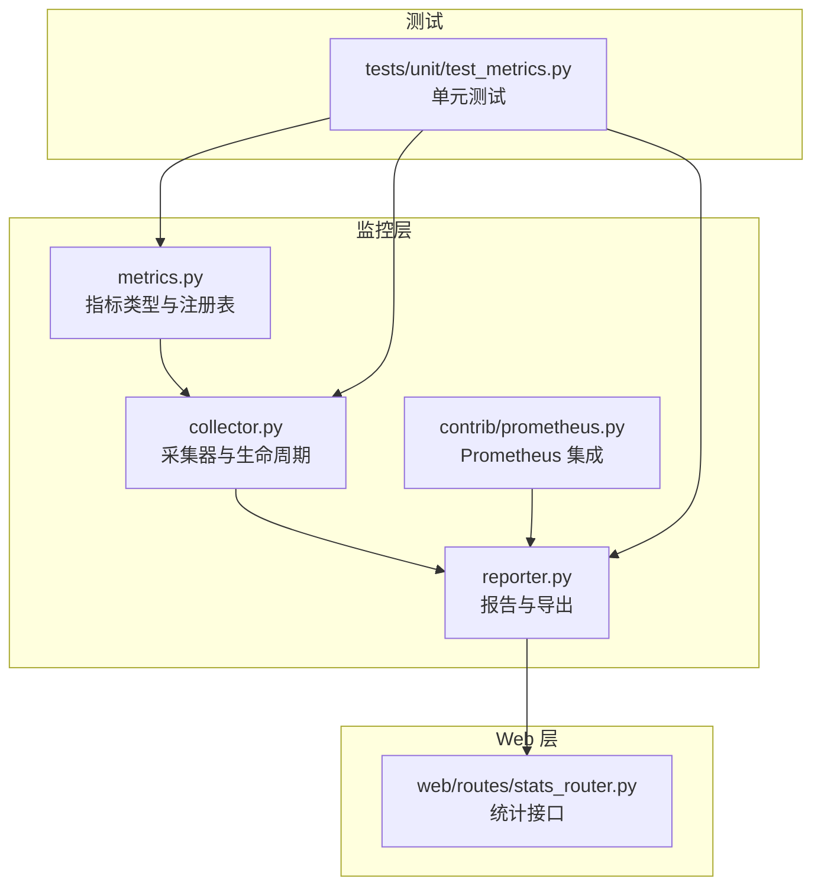
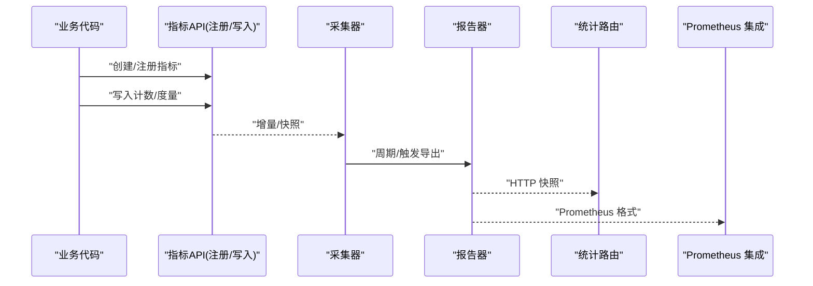
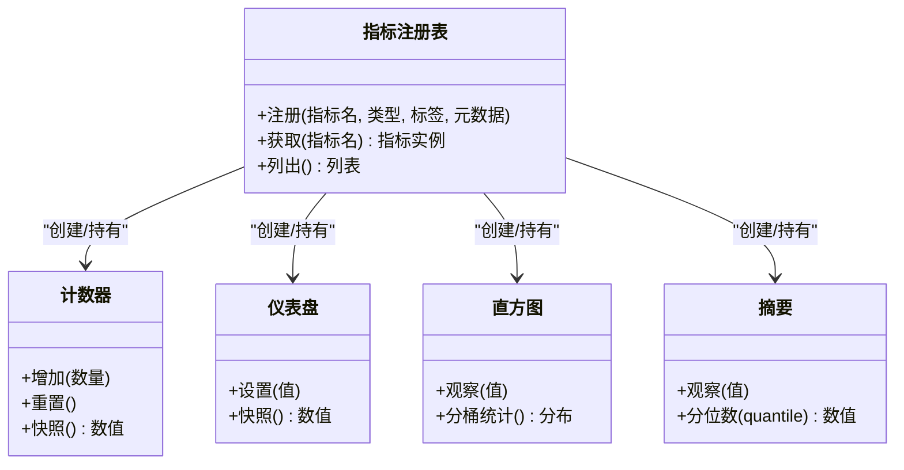
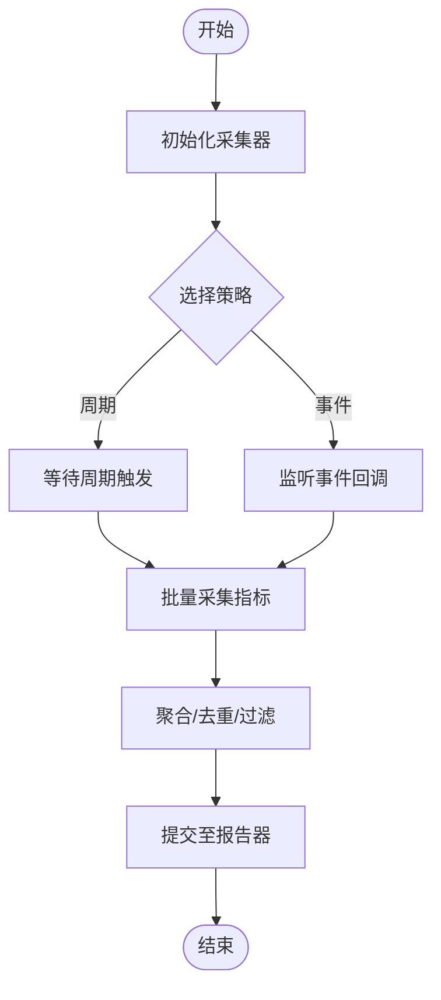
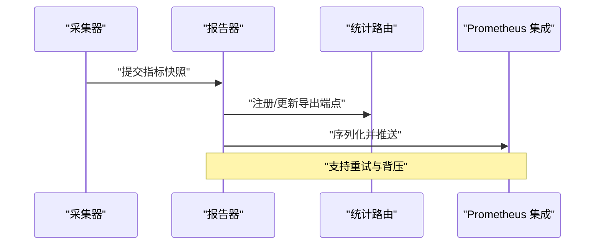
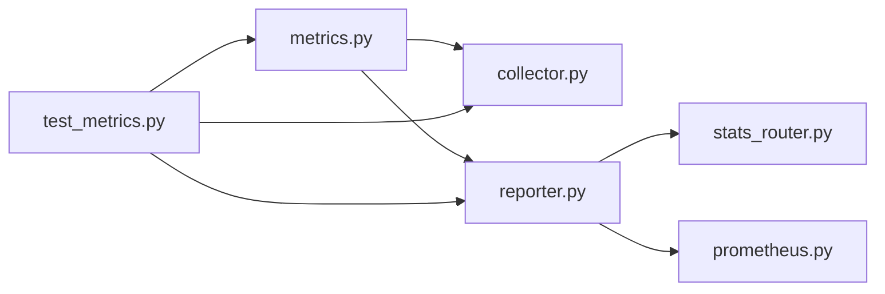

# 指标收集系统

<cite>
**本文引用的文件**   
- [src/neotask/monitor/metrics.py](file://src/neotask/monitor/metrics.py)
- [src/neotask/monitor/collector.py](file://src/neotask/monitor/collector.py)
- [src/neotask/monitor/reporter.py](file://src/neotask/monitor/reporter.py)
- [src/neotask/contrib/prometheus.py](file://src/neotask/contrib/prometheus.py)
- [src/neotask/web/routes/stats_router.py](file://src/neotask/web/routes/stats_router.py)
- [tests/unit/test_metrics.py](file://tests/unit/test_metrics.py)
</cite>

## 目录
1. [简介](#简介)
2. [项目结构](#项目结构)
3. [核心组件](#核心组件)
4. [架构总览](#架构总览)
5. [详细组件分析](#详细组件分析)
6. [依赖关系分析](#依赖关系分析)
7. [性能考虑](#性能考虑)
8. [故障排查指南](#故障排查指南)
9. [结论](#结论)
10. [附录](#附录)

## 简介
本文件围绕任务调度管理器的“指标收集系统”进行系统化说明，涵盖以下方面：
- 指标类型定义与使用方式（计数器、仪表盘、直方图、摘要）
- 指标注册机制、采集策略与导出流程
- 性能优化要点与最佳实践
- 自定义指标的创建方法与示例路径
- 业务指标与系统指标的接入建议

该系统以模块化的方式组织在 monitor 子包中，并通过 Web 路由对外暴露统计信息，同时提供 Prometheus 集成能力。

## 项目结构
指标相关代码主要位于 src/neotask/monitor 目录，并辅以 contrib/prometheus 集成与 web/routes/stats_router 的导出接口。测试用例位于 tests/unit/test_metrics.py。

图表来源
- [src/neotask/monitor/metrics.py](file://src/neotask/monitor/metrics.py)
- [src/neotask/monitor/collector.py](file://src/neotask/monitor/collector.py)
- [src/neotask/monitor/reporter.py](file://src/neotask/monitor/reporter.py)
- [src/neotask/contrib/prometheus.py](file://src/neotask/contrib/prometheus.py)
- [src/neotask/web/routes/stats_router.py](file://src/neotask/web/routes/stats_router.py)
- [tests/unit/test_metrics.py](file://tests/unit/test_metrics.py)

章节来源
- [src/neotask/monitor/metrics.py](file://src/neotask/monitor/metrics.py)
- [src/neotask/monitor/collector.py](file://src/neotask/monitor/collector.py)
- [src/neotask/monitor/reporter.py](file://src/neotask/monitor/reporter.py)
- [src/neotask/contrib/prometheus.py](file://src/neotask/contrib/prometheus.py)
- [src/neotask/web/routes/stats_router.py](file://src/neotask/web/routes/stats_router.py)
- [tests/unit/test_metrics.py](file://tests/unit/test_metrics.py)

## 核心组件
- 指标类型与注册表
  - 负责定义计数器、仪表盘、直方图、摘要等指标类型，并提供统一的注册、查询与导出接口。
  - 典型职责包括：指标命名规范、标签键值管理、采样窗口控制、聚合计算等。
- 采集器
  - 负责按策略周期性或事件驱动地采集指标数据，维护采集上下文与生命周期。
  - 支持批量采集、去重、合并与异常隔离，确保对主流程影响最小。
- 报告器
  - 将采集到的指标转换为外部可消费格式（如 JSON、文本、Prometheus 格式）。
  - 提供按需导出与定时导出两种模式，并支持多后端扩展。
- Prometheus 集成
  - 将内部指标映射为 Prometheus 兼容的时序数据，便于接入现有监控系统。
- Web 统计路由
  - 提供 HTTP 接口用于拉取当前指标快照，便于调试与可视化。

章节来源
- [src/neotask/monitor/metrics.py](file://src/neotask/monitor/metrics.py)
- [src/neotask/monitor/collector.py](file://src/neotask/monitor/collector.py)
- [src/neotask/monitor/reporter.py](file://src/neotask/monitor/reporter.py)
- [src/neotask/contrib/prometheus.py](file://src/neotask/contrib/prometheus.py)
- [src/neotask/web/routes/stats_router.py](file://src/neotask/web/routes/stats_router.py)

## 架构总览
整体架构遵循“采集-聚合-导出”的分层设计：应用侧通过指标 API 写入数据；采集器统一汇聚；报告器输出到不同后端；Web 路由提供即时查看能力。

图表来源
- [src/neotask/monitor/metrics.py](file://src/neotask/monitor/metrics.py)
- [src/neotask/monitor/collector.py](file://src/neotask/monitor/collector.py)
- [src/neotask/monitor/reporter.py](file://src/neotask/monitor/reporter.py)
- [src/neotask/contrib/prometheus.py](file://src/neotask/contrib/prometheus.py)
- [src/neotask/web/routes/stats_router.py](file://src/neotask/web/routes/stats_router.py)

## 详细组件分析

### 指标类型与注册机制
- 指标类型
  - 计数器：单调递增的累计量，适合请求数、错误数等。
  - 仪表盘：反映某一时刻的状态值，适合在线用户数、队列长度等。
  - 直方图：对观测值的分布进行分桶统计，适合延迟、大小等。
  - 摘要：对观测值进行分位数汇总，适合需要稳定分位数的场景。
- 注册机制
  - 通过统一的注册入口完成指标声明，包含名称、描述、标签键集合、默认值等元数据。
  - 支持重复注册保护与版本兼容检查，避免运行时冲突。
- 写入与读取
  - 写入端提供原子更新与批量更新接口，减少锁竞争。
  - 读取端提供快照与流式遍历，适配不同导出需求。

图表来源
- [src/neotask/monitor/metrics.py](file://src/neotask/monitor/metrics.py)

章节来源
- [src/neotask/monitor/metrics.py](file://src/neotask/monitor/metrics.py)

### 采集器与采集策略
- 采集策略
  - 周期采集：基于时间轮或定时器触发，批量拉取各指标快照。
  - 事件采集：在关键路径埋点，事件发生时立即记录。
  - 懒加载：仅在首次导出时初始化底层存储，降低冷启动开销。
- 生命周期
  - 启动阶段：注册采集任务、预热缓存。
  - 运行阶段：执行采集、聚合、去重、异常隔离。
  - 关闭阶段：刷新缓冲、释放资源、上报最终状态。
- 容错与降级
  - 单个指标采集失败不影响其他指标。
  - 采集超时与限流保护，避免拖慢主流程。

图表来源
- [src/neotask/monitor/collector.py](file://src/neotask/monitor/collector.py)

章节来源
- [src/neotask/monitor/collector.py](file://src/neotask/monitor/collector.py)

### 报告器与导出
- 导出目标
  - 本地日志/内存快照：便于调试与快速验证。
  - HTTP 接口：供 Web UI 或外部工具拉取。
  - Prometheus：标准时序格式，便于大规模监控。
- 导出模式
  - 按需导出：响应请求时生成快照。
  - 定时导出：后台线程定期推送。
- 格式转换
  - 内部指标模型到目标格式的映射规则清晰可扩展。
  - 支持标签规范化与单位换算。

图表来源
- [src/neotask/monitor/reporter.py](file://src/neotask/monitor/reporter.py)
- [src/neotask/contrib/prometheus.py](file://src/neotask/contrib/prometheus.py)
- [src/neotask/web/routes/stats_router.py](file://src/neotask/web/routes/stats_router.py)

章节来源
- [src/neotask/monitor/reporter.py](file://src/neotask/monitor/reporter.py)
- [src/neotask/contrib/prometheus.py](file://src/neotask/contrib/prometheus.py)
- [src/neotask/web/routes/stats_router.py](file://src/neotask/web/routes/stats_router.py)

### Prometheus 集成
- 指标映射
  - 将内部指标名称与标签映射为 Prometheus 兼容的 metric 与 label。
  - 自动处理数据类型转换与单位。
- 采集与拉取
  - 暴露 /metrics 端点供 Prometheus 抓取。
  - 支持增量导出与全量快照两种模式。
- 兼容性
  - 遵循 Prometheus 客户端约定，便于与 Grafana 等生态对接。

章节来源
- [src/neotask/contrib/prometheus.py](file://src/neotask/contrib/prometheus.py)

### Web 统计路由
- 功能
  - 提供 HTTP 接口返回当前指标快照，便于调试与可视化。
  - 支持过滤与分页，避免一次性返回过大负载。
- 安全与限流
  - 可选鉴权与访问控制。
  - 针对大响应体进行速率限制与压缩。

章节来源
- [src/neotask/web/routes/stats_router.py](file://src/neotask/web/routes/stats_router.py)

### 单元测试与行为验证
- 覆盖范围
  - 指标注册与写入的正确性。
  - 采集器周期与事件触发逻辑。
  - 报告器导出格式与边界条件。
- 断言要点
  - 并发写入下的数据一致性。
  - 异常隔离与恢复。
  - 导出延迟与吞吐达标。

章节来源
- [tests/unit/test_metrics.py](file://tests/unit/test_metrics.py)

## 依赖关系分析
- 组件耦合
  - metrics 作为基础库被 collector 与 reporter 共同依赖。
  - reporter 依赖 prometheus 集成与 web 路由作为导出目标。
- 外部依赖
  - Prometheus 客户端库（由集成模块引入）。
  - Web 框架路由（由 stats_router 引入）。
- 潜在循环依赖
  - 通过分层与接口抽象避免直接循环引用。

图表来源
- [src/neotask/monitor/metrics.py](file://src/neotask/monitor/metrics.py)
- [src/neotask/monitor/collector.py](file://src/neotask/monitor/collector.py)
- [src/neotask/monitor/reporter.py](file://src/neotask/monitor/reporter.py)
- [src/neotask/contrib/prometheus.py](file://src/neotask/contrib/prometheus.py)
- [src/neotask/web/routes/stats_router.py](file://src/neotask/web/routes/stats_router.py)
- [tests/unit/test_metrics.py](file://tests/unit/test_metrics.py)

章节来源
- [src/neotask/monitor/metrics.py](file://src/neotask/monitor/metrics.py)
- [src/neotask/monitor/collector.py](file://src/neotask/monitor/collector.py)
- [src/neotask/monitor/reporter.py](file://src/neotask/monitor/reporter.py)
- [src/neotask/contrib/prometheus.py](file://src/neotask/contrib/prometheus.py)
- [src/neotask/web/routes/stats_router.py](file://src/neotask/web/routes/stats_router.py)
- [tests/unit/test_metrics.py](file://tests/unit/test_metrics.py)

## 性能考虑
- 低开销写入
  - 使用无锁或细粒度锁结构，避免热点竞争。
  - 批量写入与合并更新，减少系统调用次数。
- 采样与降采样
  - 直方图与摘要采用自适应分桶与近似算法，平衡精度与性能。
  - 高 QPS 场景下启用采样率控制。
- 导出优化
  - 增量导出优先，必要时回退到全量快照。
  - 压缩与分页传输，降低网络与解析成本。
- 资源隔离
  - 采集与导出在独立线程/协程中运行，避免阻塞主流程。
  - 设置超时与熔断，防止雪崩。

[本节为通用性能指导，不直接分析具体文件]

## 故障排查指南
- 常见问题
  - 指标未生效：检查是否完成注册与正确写入。
  - 导出为空：确认采集器已启动且导出目标可用。
  - 数据不一致：核对并发写入路径与聚合逻辑。
- 定位手段
  - 通过 Web 统计接口查看实时快照。
  - 开启调试日志，关注采集与导出阶段的异常堆栈。
  - 使用单元测试复现问题，逐步缩小范围。
- 恢复策略
  - 重启采集器并清理临时状态。
  - 切换导出目标为本地快照，先保障可观测性再修复后端。

章节来源
- [src/neotask/web/routes/stats_router.py](file://src/neotask/web/routes/stats_router.py)
- [tests/unit/test_metrics.py](file://tests/unit/test_metrics.py)

## 结论
该指标收集系统以清晰的层次划分与可扩展的设计，实现了从指标定义、采集、聚合到导出的完整链路。通过统一的注册机制与灵活的采集策略，既能满足业务指标的灵活接入，也能保证系统指标的高性能采集。结合 Prometheus 集成与 Web 统计接口，形成了完善的可观测性闭环。

[本节为总结性内容，不直接分析具体文件]

## 附录

### 如何添加业务指标（步骤与参考路径）
- 步骤概览
  - 在指标注册表中声明指标（名称、类型、标签、元数据）。
  - 在业务关键路径写入指标（如请求成功/失败、处理时长等）。
  - 配置采集器周期或事件触发，确保数据被采集。
  - 通过 Web 统计接口或 Prometheus 查看结果。
- 参考实现路径
  - 指标定义与注册：[src/neotask/monitor/metrics.py](file://src/neotask/monitor/metrics.py)
  - 采集器配置与触发：[src/neotask/monitor/collector.py](file://src/neotask/monitor/collector.py)
  - 导出与查看：[src/neotask/monitor/reporter.py](file://src/neotask/monitor/reporter.py)、[src/neotask/web/routes/stats_router.py](file://src/neotask/web/routes/stats_router.py)
  - Prometheus 集成：[src/neotask/contrib/prometheus.py](file://src/neotask/contrib/prometheus.py)
  - 单元测试参考：[tests/unit/test_metrics.py](file://tests/unit/test_metrics.py)

### 如何添加系统指标（步骤与参考路径）
- 步骤概览
  - 定义系统级指标（CPU、内存、队列深度、GC 次数等）。
  - 在系统探针或监控钩子中写入指标。
  - 调整采样频率与分桶策略，确保精度与性能的平衡。
  - 通过统一导出通道对外暴露。
- 参考实现路径
  - 指标定义与注册：[src/neotask/monitor/metrics.py](file://src/neotask/monitor/metrics.py)
  - 采集器策略与生命周期：[src/neotask/monitor/collector.py](file://src/neotask/monitor/collector.py)
  - 导出与查看：[src/neotask/monitor/reporter.py](file://src/neotask/monitor/reporter.py)、[src/neotask/web/routes/stats_router.py](file://src/neotask/web/routes/stats_router.py)
  - Prometheus 集成：[src/neotask/contrib/prometheus.py](file://src/neotask/contrib/prometheus.py)
  - 单元测试参考：[tests/unit/test_metrics.py](file://tests/unit/test_metrics.py)

### 最佳实践清单
- 命名规范
  - 使用语义化名称与一致的标签键，避免过长与歧义。
- 标签治理
  - 控制基数，避免高基数字导致存储爆炸。
- 采样与阈值
  - 合理设置采样率与分桶边界，兼顾精度与性能。
- 异常隔离
  - 单指标异常不应影响整体采集与导出。
- 可观测性闭环
  - 结合告警与可视化，形成从采集到处置的闭环。

[本节为通用最佳实践，不直接分析具体文件]