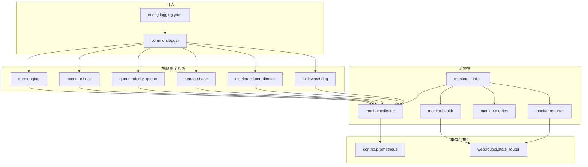
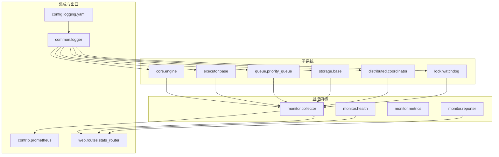
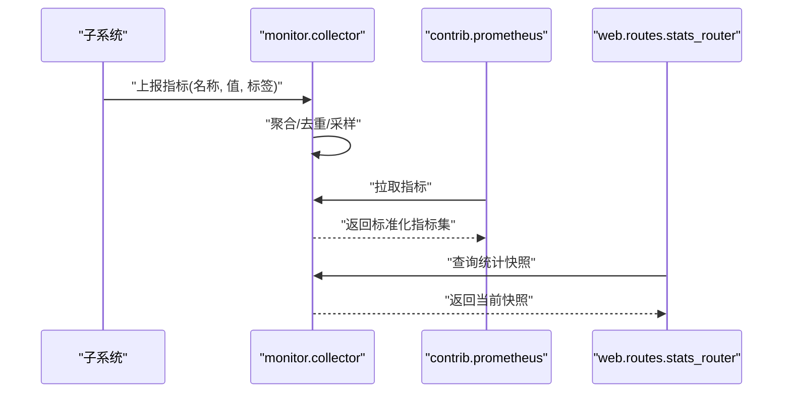
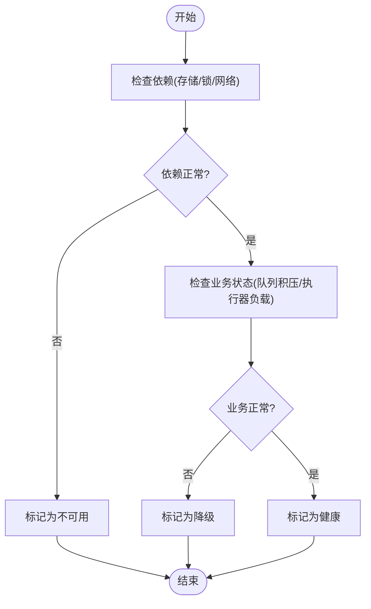
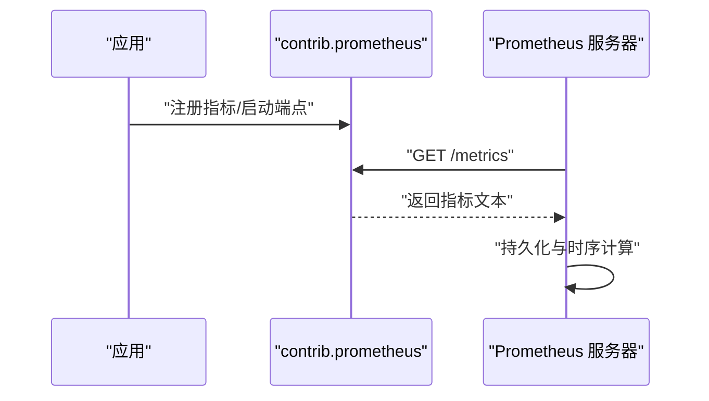
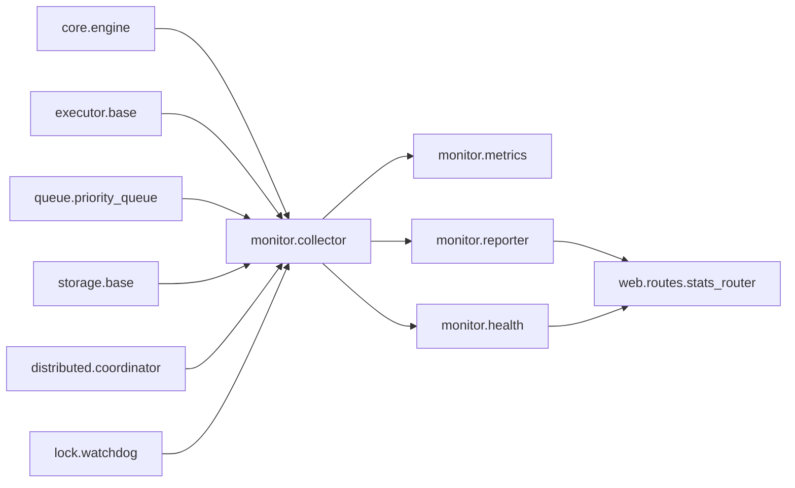

# 监控与可观测性

<cite>
**本文引用的文件**   
- [src/neotask/monitor/__init__.py](file://src/neotask/monitor/__init__.py)
- [src/neotask/monitor/collector.py](file://src/neotask/monitor/collector.py)
- [src/neotask/monitor/health.py](file://src/neotask/monitor/health.py)
- [src/neotask/monitor/metrics.py](file://src/neotask/monitor/metrics.py)
- [src/neotask/monitor/reporter.py](file://src/neotask/monitor/reporter.py)
- [src/neotask/contrib/prometheus.py](file://src/neotask/contrib/prometheus.py)
- [src/neotask/web/routes/stats_router.py](file://src/neotask/web/routes/stats_router.py)
- [src/neotask/config/logging.yaml](file://src/neotask/config/logging.yaml)
- [src/neotask/common/logger.py](file://src/neotask/common/logger.py)
- [src/neotask/core/engine.py](file://src/neotask/core/engine.py)
- [src/neotask/executor/base.py](file://src/neotask/executor/base.py)
- [src/neotask/queue/priority_queue.py](file://src/neotask/queue/priority_queue.py)
- [src/neotask/storage/base.py](file://src/neotask/storage/base.py)
- [src/neotask/distributed/coordinator.py](file://src/neotask/distributed/coordinator.py)
- [src/neotask/lock/watchdog.py](file://src/neotask/lock/watchdog.py)
- [tests/unit/test_metrics.py](file://tests/unit/test_metrics.py)
</cite>

## 目录
1. [简介](#简介)
2. [项目结构](#项目结构)
3. [核心组件](#核心组件)
4. [架构总览](#架构总览)
5. [详细组件分析](#详细组件分析)
6. [依赖关系分析](#依赖关系分析)
7. [性能考量](#性能考量)
8. [故障排查指南](#故障排查指南)
9. [结论](#结论)
10. [附录](#附录)

## 简介
本文件系统性阐述任务调度管理器的监控与可观测性设计与实现，覆盖指标收集、健康检查、报告生成、Prometheus 集成、自定义指标扩展、日志记录、性能分析与告警规则配置，以及部署运维最佳实践。目标是帮助读者快速理解系统如何暴露可观测数据、如何接入主流生态（如 Prometheus/Grafana），以及如何基于现有能力构建面向生产环境的稳定监控体系。

## 项目结构
监控与可观测性相关代码主要分布在以下模块：
- monitor：封装指标采集、健康检查与报告输出等通用能力
- contrib.prometheus：提供与 Prometheus 的集成适配
- web.routes.stats_router：对外暴露统计接口，便于外部系统抓取或展示
- config.logging.yaml 与 common.logger：统一日志配置与使用入口
- core、executor、queue、storage、distributed、lock 等子系统：在关键路径埋点并上报指标与健康状态

图表来源
- [src/neotask/monitor/__init__.py](file://src/neotask/monitor/__init__.py)
- [src/neotask/monitor/collector.py](file://src/neotask/monitor/collector.py)
- [src/neotask/monitor/health.py](file://src/neotask/monitor/health.py)
- [src/neotask/monitor/metrics.py](file://src/neotask/monitor/metrics.py)
- [src/neotask/monitor/reporter.py](file://src/neotask/monitor/reporter.py)
- [src/neotask/contrib/prometheus.py](file://src/neotask/contrib/prometheus.py)
- [src/neotask/web/routes/stats_router.py](file://src/neotask/web/routes/stats_router.py)
- [src/neotask/config/logging.yaml](file://src/neotask/config/logging.yaml)
- [src/neotask/common/logger.py](file://src/neotask/common/logger.py)
- [src/neotask/core/engine.py](file://src/neotask/core/engine.py)
- [src/neotask/executor/base.py](file://src/neotask/executor/base.py)
- [src/neotask/queue/priority_queue.py](file://src/neotask/queue/priority_queue.py)
- [src/neotask/storage/base.py](file://src/neotask/storage/base.py)
- [src/neotask/distributed/coordinator.py](file://src/neotask/distributed/coordinator.py)
- [src/neotask/lock/watchdog.py](file://src/neotask/lock/watchdog.py)

章节来源
- [src/neotask/monitor/__init__.py](file://src/neotask/monitor/__init__.py)
- [src/neotask/monitor/collector.py](file://src/neotask/monitor/collector.py)
- [src/neotask/monitor/health.py](file://src/neotask/monitor/health.py)
- [src/neotask/monitor/metrics.py](file://src/neotask/monitor/metrics.py)
- [src/neotask/monitor/reporter.py](file://src/neotask/monitor/reporter.py)
- [src/neotask/contrib/prometheus.py](file://src/neotask/contrib/prometheus.py)
- [src/neotask/web/routes/stats_router.py](file://src/neotask/web/routes/stats_router.py)
- [src/neotask/config/logging.yaml](file://src/neotask/config/logging.yaml)
- [src/neotask/common/logger.py](file://src/neotask/common/logger.py)

## 核心组件
- 指标采集器（collector）：负责从各子系统拉取或接收指标，聚合后提供给导出器与报表。
- 健康检查（health）：维护节点/服务健康状态，支持探针式查询。
- 指标定义（metrics）：集中定义指标类型、标签与命名规范，确保一致性。
- 报告生成（reporter）：将指标汇总为可读的报告，供调试、审计或离线分析。
- Prometheus 集成（contrib.prometheus）：将内部指标转换为 Prometheus 格式并暴露端点。
- 统计路由（web.routes.stats_router）：提供 HTTP 接口用于获取运行期统计信息。
- 日志（config.logging.yaml + common.logger）：统一日志配置与使用入口，贯穿各子系统。

章节来源
- [src/neotask/monitor/collector.py](file://src/neotask/monitor/collector.py)
- [src/neotask/monitor/health.py](file://src/neotask/monitor/health.py)
- [src/neotask/monitor/metrics.py](file://src/neotask/monitor/metrics.py)
- [src/neotask/monitor/reporter.py](file://src/neotask/monitor/reporter.py)
- [src/neotask/contrib/prometheus.py](file://src/neotask/contrib/prometheus.py)
- [src/neotask/web/routes/stats_router.py](file://src/neotask/web/routes/stats_router.py)
- [src/neotask/config/logging.yaml](file://src/neotask/config/logging.yaml)
- [src/neotask/common/logger.py](file://src/neotask/common/logger.py)

## 架构总览
下图展示了监控与可观测性的整体架构：子系统通过采集器上报指标；健康检查模块维护健康状态；报告模块生成结构化报告；Prometheus 适配器将指标暴露为标准格式；Web 统计路由提供运行时查询能力；日志系统贯穿全链路。

图表来源
- [src/neotask/core/engine.py](file://src/neotask/core/engine.py)
- [src/neotask/executor/base.py](file://src/neotask/executor/base.py)
- [src/neotask/queue/priority_queue.py](file://src/neotask/queue/priority_queue.py)
- [src/neotask/storage/base.py](file://src/neotask/storage/base.py)
- [src/neotask/distributed/coordinator.py](file://src/neotask/distributed/coordinator.py)
- [src/neotask/lock/watchdog.py](file://src/neotask/lock/watchdog.py)
- [src/neotask/monitor/collector.py](file://src/neotask/monitor/collector.py)
- [src/neotask/monitor/health.py](file://src/neotask/monitor/health.py)
- [src/neotask/monitor/metrics.py](file://src/neotask/monitor/metrics.py)
- [src/neotask/monitor/reporter.py](file://src/neotask/monitor/reporter.py)
- [src/neotask/contrib/prometheus.py](file://src/neotask/contrib/prometheus.py)
- [src/neotask/web/routes/stats_router.py](file://src/neotask/web/routes/stats_router.py)
- [src/neotask/config/logging.yaml](file://src/neotask/config/logging.yaml)
- [src/neotask/common/logger.py](file://src/neotask/common/logger.py)

## 详细组件分析

### 指标采集器（monitor.collector）
职责
- 注册与聚合来自子系统的指标
- 提供统一的拉取接口，供导出器与报表消费
- 维护指标生命周期与清理策略

设计要点
- 采用中心式聚合，降低子系统耦合度
- 支持按维度（如任务类型、队列名、存储后端）进行分组
- 对高频指标提供采样或限流机制，避免采集开销过大

典型流程

图表来源
- [src/neotask/monitor/collector.py](file://src/neotask/monitor/collector.py)
- [src/neotask/contrib/prometheus.py](file://src/neotask/contrib/prometheus.py)
- [src/neotask/web/routes/stats_router.py](file://src/neotask/web/routes/stats_router.py)

章节来源
- [src/neotask/monitor/collector.py](file://src/neotask/monitor/collector.py)

### 健康检查（monitor.health）
职责
- 维护节点/服务健康状态
- 提供探针接口，供编排平台或负载均衡探测
- 结合锁看门狗、分布式协调器等组件状态综合判定

关键能力
- 多源健康信号合并（进程、依赖、业务）
- 分级健康状态（就绪、可用、降级、不可用）
- 历史健康轨迹与最近失败原因记录

图表来源
- [src/neotask/monitor/health.py](file://src/neotask/monitor/health.py)
- [src/neotask/lock/watchdog.py](file://src/neotask/lock/watchdog.py)
- [src/neotask/distributed/coordinator.py](file://src/neotask/distributed/coordinator.py)

章节来源
- [src/neotask/monitor/health.py](file://src/neotask/monitor/health.py)
- [src/neotask/lock/watchdog.py](file://src/neotask/lock/watchdog.py)
- [src/neotask/distributed/coordinator.py](file://src/neotask/distributed/coordinator.py)

### 指标定义（monitor.metrics）
职责
- 集中定义指标名称、类型、标签与单位
- 提供校验与文档化能力，保证命名一致性与可发现性

建议规范
- 指标命名遵循“子系统_对象_度量”三段式
- 标签维度最小化，避免高基数
- 数值型指标明确单位（秒、字节、计数等）

章节来源
- [src/neotask/monitor/metrics.py](file://src/neotask/monitor/metrics.py)

### 报告生成（monitor.reporter）
职责
- 将指标与状态汇总为结构化报告
- 支持定时或按需触发，输出到控制台、文件或外部系统

输出形态
- 文本摘要（便于日志留存）
- JSON 快照（便于自动化处理）
- 时序快照（便于回溯分析）

章节来源
- [src/neotask/monitor/reporter.py](file://src/neotask/monitor/reporter.py)

### Prometheus 集成（contrib.prometheus）
职责
- 将内部指标转换为 Prometheus 兼容格式
- 暴露标准 /metrics 端点，供 Prometheus 抓取

集成步骤
- 初始化 Prometheus 适配器
- 注册需要暴露的指标集合
- 启动内置 HTTP 服务或嵌入到现有 Web 应用
- 配置 Prometheus 抓取目标与间隔

图表来源
- [src/neotask/contrib/prometheus.py](file://src/neotask/contrib/prometheus.py)

章节来源
- [src/neotask/contrib/prometheus.py](file://src/neotask/contrib/prometheus.py)

### 统计路由（web.routes.stats_router）
职责
- 提供 HTTP 接口查询运行期统计
- 支撑前端面板或第三方工具读取

常见能力
- 返回当前指标快照
- 返回健康状态与最近事件
- 支持分页与过滤参数

章节来源
- [src/neotask/web/routes/stats_router.py](file://src/neotask/web/routes/stats_router.py)

### 日志系统（config.logging.yaml + common.logger）
职责
- 统一日志级别、输出目标与格式化
- 在各子系统注入 logger 实例，保障可追踪性

最佳实践
- 区分 info/warn/error/debug 级别
- 结构化字段（trace_id、task_id、node_id）
- 控制敏感信息脱敏

章节来源
- [src/neotask/config/logging.yaml](file://src/neotask/config/logging.yaml)
- [src/neotask/common/logger.py](file://src/neotask/common/logger.py)

### 子系统埋点示例（核心路径）
- 任务引擎（core.engine）：任务提交、调度、完成耗时
- 执行器（executor.base）：并发度、队列长度、错误率
- 优先级队列（queue.priority_queue）：入队/出队延迟、堆积量
- 存储（storage.base）：读写延迟、命中率、重试次数
- 分布式协调（distributed.coordinator）：节点上下线、分区再平衡
- 锁看门狗（lock.watchdog）：锁持有时长、超时释放

章节来源
- [src/neotask/core/engine.py](file://src/neotask/core/engine.py)
- [src/neotask/executor/base.py](file://src/neotask/executor/base.py)
- [src/neotask/queue/priority_queue.py](file://src/neotask/queue/priority_queue.py)
- [src/neotask/storage/base.py](file://src/neotask/storage/base.py)
- [src/neotask/distributed/coordinator.py](file://src/neotask/distributed/coordinator.py)
- [src/neotask/lock/watchdog.py](file://src/neotask/lock/watchdog.py)

## 依赖关系分析
监控层与各子系统的依赖关系如下：

图表来源
- [src/neotask/core/engine.py](file://src/neotask/core/engine.py)
- [src/neotask/executor/base.py](file://src/neotask/executor/base.py)
- [src/neotask/queue/priority_queue.py](file://src/neotask/queue/priority_queue.py)
- [src/neotask/storage/base.py](file://src/neotask/storage/base.py)
- [src/neotask/distributed/coordinator.py](file://src/neotask/distributed/coordinator.py)
- [src/neotask/lock/watchdog.py](file://src/neotask/lock/watchdog.py)
- [src/neotask/monitor/collector.py](file://src/neotask/monitor/collector.py)
- [src/neotask/monitor/metrics.py](file://src/neotask/monitor/metrics.py)
- [src/neotask/monitor/health.py](file://src/neotask/monitor/health.py)
- [src/neotask/monitor/reporter.py](file://src/neotask/monitor/reporter.py)
- [src/neotask/web/routes/stats_router.py](file://src/neotask/web/routes/stats_router.py)

章节来源
- [src/neotask/monitor/collector.py](file://src/neotask/monitor/collector.py)
- [src/neotask/monitor/metrics.py](file://src/neotask/monitor/metrics.py)
- [src/neotask/monitor/health.py](file://src/neotask/monitor/health.py)
- [src/neotask/monitor/reporter.py](file://src/neotask/monitor/reporter.py)
- [src/neotask/web/routes/stats_router.py](file://src/neotask/web/routes/stats_router.py)

## 性能考量
- 指标采样与限流：对高频指标采用时间窗口采样或速率限制，避免采集侧成为瓶颈。
- 低开销上报：批量上报、异步写入，减少阻塞主流程。
- 标签基数控制：避免高基数标签导致内存与存储压力。
- 健康检查节流：合理设置探测频率，避免频繁检查造成抖动。
- 报告生成批量化：合并多次快照，降低 IO 压力。
- 日志级别动态调整：生产环境默认 warn/error，必要时临时提升以定位问题。

[本节为通用指导，不直接分析具体文件]

## 故障排查指南
常见问题与定位思路
- 指标缺失或不更新
  - 确认采集器是否注册对应指标
  - 检查子系统埋点是否生效
  - 验证 Prometheus 抓取配置与网络连通
- 健康状态异常
  - 查看依赖检查结果（存储、锁、网络）
  - 关注最近失败原因与堆栈
  - 核对锁看门狗与协调器状态
- 报告未生成
  - 检查报告触发条件与权限
  - 确认输出路径与磁盘空间
- 日志无法定位问题
  - 开启 debug 级别并增加结构化字段
  - 使用 trace_id 串联调用链

章节来源
- [src/neotask/monitor/health.py](file://src/neotask/monitor/health.py)
- [src/neotask/monitor/reporter.py](file://src/neotask/monitor/reporter.py)
- [src/neotask/config/logging.yaml](file://src/neotask/config/logging.yaml)
- [src/neotask/common/logger.py](file://src/neotask/common/logger.py)

## 结论
该监控与可观测性体系以采集器为核心，围绕健康检查、指标定义、报告生成与 Prometheus 集成形成闭环。通过在关键子系统埋点与统一日志配置，实现了端到端的可观测能力。配合合理的性能优化与运维实践，可在生产环境中稳定运行并提供高质量的可观测数据。

[本节为总结性内容，不直接分析具体文件]

## 附录

### Prometheus 集成配置与使用
- 启用方式
  - 初始化 Prometheus 适配器并注册指标
  - 启动内置 HTTP 服务或嵌入到现有 Web 应用
- 抓取配置
  - 在 Prometheus 中配置目标地址与抓取间隔
  - 设置合理的 scrape_timeout 与 scrape_interval
- 指标命名与标签
  - 遵循 metrics 模块定义的规范
  - 控制标签基数，避免高基数导致的性能问题
- 验证方法
  - 访问 /metrics 端点确认指标可见
  - 在 Prometheus UI 中查询关键指标

章节来源
- [src/neotask/contrib/prometheus.py](file://src/neotask/contrib/prometheus.py)
- [src/neotask/monitor/metrics.py](file://src/neotask/monitor/metrics.py)

### 自定义指标添加与监控面板定制
- 添加自定义指标
  - 在 metrics 中定义指标元数据（名称、类型、标签）
  - 在相应子系统埋点处上报指标
  - 通过 collector 聚合并在 stats_router 暴露
- 监控面板定制
  - 基于 Prometheus 指标编写 Grafana 查询
  - 组合健康状态与关键业务指标，构建仪表盘
  - 设置阈值与可视化样式，提升可读性

章节来源
- [src/neotask/monitor/metrics.py](file://src/neotask/monitor/metrics.py)
- [src/neotask/monitor/collector.py](file://src/neotask/monitor/collector.py)
- [src/neotask/web/routes/stats_router.py](file://src/neotask/web/routes/stats_router.py)

### 日志记录、性能分析与告警规则
- 日志记录
  - 使用 common.logger 注入 logger 实例
  - 配置 logging.yaml 中的级别、输出与格式化
  - 增加结构化字段（trace_id、task_id、node_id）
- 性能分析
  - 在关键路径记录耗时指标
  - 结合 Prometheus 与 Grafana 观察热点
  - 针对慢路径进行采样与抽样分析
- 告警规则
  - 基于 Prometheus 表达式定义阈值
  - 关注错误率、延迟、堆积量、资源使用
  - 设置静默与抑制规则，避免告警风暴

章节来源
- [src/neotask/config/logging.yaml](file://src/neotask/config/logging.yaml)
- [src/neotask/common/logger.py](file://src/neotask/common/logger.py)
- [src/neotask/contrib/prometheus.py](file://src/neotask/contrib/prometheus.py)

### 部署与运维最佳实践
- 容器化与编排
  - 将监控组件作为 Sidecar 或独立 Pod 部署
  - 使用健康探针（liveness/readiness）保障可用性
- 容量规划
  - 根据指标数量与标签基数评估存储与 CPU 占用
  - 合理设置保留周期与压缩策略
- 安全与合规
  - 限制 /metrics 访问范围
  - 脱敏敏感字段，避免泄露
- 变更与回滚
  - 灰度发布新指标与埋点
  - 保留旧版本指标以便对比分析

[本节为通用指导，不直接分析具体文件]

### 测试与验证
- 单元测试
  - 验证指标定义与上报逻辑
  - 模拟健康检查场景，断言状态转换
- 基准测试
  - 评估在高吞吐下的指标上报开销
  - 验证报告生成的稳定性与性能

章节来源
- [tests/unit/test_metrics.py](file://tests/unit/test_metrics.py)