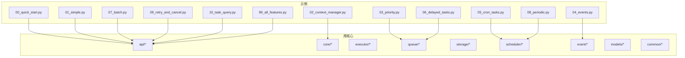
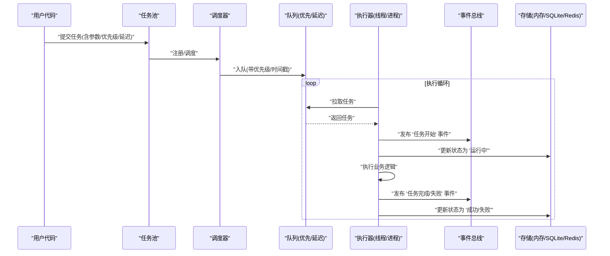
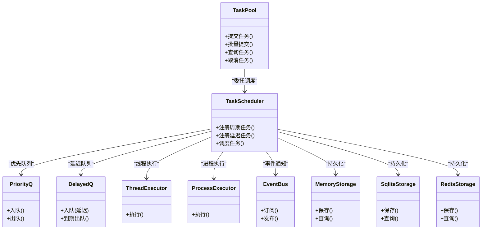

# 基础示例

<cite>
**本文引用的文件**   
- [examples/00_quick_start.py](file://examples/00_quick_start.py)
- [examples/01_simple.py](file://examples/01_simple.py)
- [examples/02_context_manager.py](file://examples/02_context_manager.py)
- [examples/03_priority.py](file://examples/03_priority.py)
- [examples/04_events.py](file://examples/04_events.py)
- [examples/05_cron_tasks.py](file://examples/05_cron_tasks.py)
- [examples/06_delayed_tasks.py](file://examples/06_delayed_tasks.py)
- [examples/07_batch.py](file://examples/07_batch.py)
- [examples/08_periodic.py](file://examples/08_periodic.py)
- [examples/09_retry_and_cancel.py](file://examples/09_retry_and_cancel.py)
- [examples/10_task_query.py](file://examples/10_task查询.py)
- [examples/99_all_features.py](file://examples/99_all_features.py)
- [src/neotask/__init__.py](file://src/neotask/__init__.py)
- [src/neotask/api/task_pool.py](file://src/neotask/api/task_pool.py)
- [src/neotask/api/task_scheduler.py](file://src/neotask/api/task_scheduler.py)
- [src/neotask/core/context.py](file://src/neotask/core/context.py)
- [src/neotask/models/schedule.py](file://src/neotask/models/schedule.py)
- [src/neotask/models/task.py](file://src/neotask/models/task.py)
- [src/neotask/queue/priority_queue.py](file://src/neotask/queue/priority_queue.py)
- [src/neotask/queue/delayed_queue.py](file://src/neotask/queue/delayed_queue.py)
- [src/neotask/scheduler/cron_parser.py](file://src/neotask/scheduler/cron_parser.py)
- [src/neotask/scheduler/periodic.py](file://src/neotask/scheduler/periodic.py)
- [src/neotask/storage/memory.py](file://src/neotask/storage/memory.py)
- [src/neotask/storage/sqlite.py](file://src/neotask/storage/sqlite.py)
- [src/neotask/storage/redis.py](file://src/neotask/storage/redis.py)
- [src/neotask/executor/thread_executor.py](file://src/neotask/executor/thread_executor.py)
- [src/neotask/executor/process_executor.py](file://src/neotask/executor/process_executor.py)
- [src/neotask/event/bus.py](file://src/neotask/event/bus.py)
- [src/neotask/common/constants.py](file://src/neotask/common/constants.py)
- [src/neotask/common/exceptions.py](file://src/neotask/common/exceptions.py)
</cite>

## 目录
1. [简介](#简介)
2. [项目结构](#项目结构)
3. [核心组件](#核心组件)
4. [架构总览](#架构总览)
5. [详细组件分析](#详细组件分析)
6. [依赖关系分析](#依赖关系分析)
7. [性能考虑](#性能考虑)
8. [故障排查指南](#故障排查指南)
9. [结论](#结论)
10. [附录：快速上手与最佳实践](#附录快速上手与最佳实践)

## 简介
本章节面向初学者，提供任务调度系统的基础使用示例与最佳实践。内容涵盖简单任务创建、上下文管理器使用、优先级队列、事件总线、定时与延迟任务、批处理、周期任务、重试与取消、任务查询等核心概念。每个示例均给出可运行代码路径、参数说明和使用场景，帮助读者快速上手并理解任务调度的基本用法。

## 项目结构
仓库采用“示例驱动”的组织方式，examples 目录下包含从入门到进阶的完整示例；src 为库源码，按功能域划分模块（API、核心、执行器、队列、存储、调度、事件、监控、分布式、Web UI 等）。

图表来源
- [examples/00_quick_start.py](file://examples/00_quick_start.py)
- [examples/01_simple.py](file://examples/01_simple.py)
- [examples/02_context_manager.py](file://examples/02_context_manager.py)
- [examples/03_priority.py](file://examples/03_priority.py)
- [examples/04_events.py](file://examples/04_events.py)
- [examples/05_cron_tasks.py](file://examples/05_cron_tasks.py)
- [examples/06_delayed_tasks.py](file://examples/06_delayed_tasks.py)
- [examples/07_batch.py](file://examples/07_batch.py)
- [examples/08_periodic.py](file://examples/08_periodic.py)
- [examples/09_retry_and_cancel.py](file://examples/09_retry_and_cancel.py)
- [examples/10_task_query.py](file://examples/10_task查询.py)
- [examples/99_all_features.py](file://examples/99_all_features.py)
- [src/neotask/api/task_pool.py](file://src/neotask/api/task_pool.py)
- [src/neotask/api/task_scheduler.py](file://src/neotask/api/task_scheduler.py)
- [src/neotask/core/context.py](file://src/neotask/core/context.py)
- [src/neotask/queue/priority_queue.py](file://src/neotask/queue/priority_queue.py)
- [src/neotask/queue/delayed_queue.py](file://src/neotask/queue/delayed_queue.py)
- [src/neotask/scheduler/cron_parser.py](file://src/neotask/scheduler/cron_parser.py)
- [src/neotask/scheduler/periodic.py](file://src/neotask/scheduler/periodic.py)
- [src/neotask/event/bus.py](file://src/neotask/event/bus.py)
- [src/neotask/storage/memory.py](file://src/neotask/storage/memory.py)
- [src/neotask/storage/sqlite.py](file://src/neotask/storage/sqlite.py)
- [src/neotask/storage/redis.py](file://src/neotask/storage/redis.py)
- [src/neotask/executor/thread_executor.py](file://src/neotask/executor/thread_executor.py)
- [src/neotask/executor/process_executor.py](file://src/neotask/executor/process_executor.py)

章节来源
- [examples/00_quick_start.py](file://examples/00_quick_start.py)
- [examples/01_simple.py](file://examples/01_simple.py)
- [examples/02_context_manager.py](file://examples/02_context_manager.py)
- [examples/03_priority.py](file://examples/03_priority.py)
- [examples/04_events.py](file://examples/04_events.py)
- [examples/05_cron_tasks.py](file://examples/05_cron_tasks.py)
- [examples/06_delayed_tasks.py](file://examples/06_delayed_tasks.py)
- [examples/07_batch.py](file://examples/07_batch.py)
- [examples/08_periodic.py](file://examples/08_periodic.py)
- [examples/09_retry_and_cancel.py](file://examples/09_retry_and_cancel.py)
- [examples/10_task_query.py](file://examples/10_task查询.py)
- [examples/99_all_features.py](file://examples/99_all_features.py)

## 核心组件
- 任务池与调度器 API
  - 任务池：负责任务的注册、提交、生命周期管理与结果收集。
  - 调度器：负责将任务放入队列、触发执行、管理周期与延迟策略。
- 上下文管理器：用于在任务执行期间维护上下文信息（如追踪 ID、配置快照），确保资源正确释放。
- 执行器：线程执行器与进程执行器，分别适用于 I/O 密集与 CPU 密集场景。
- 队列：优先级队列与延迟队列，支持不同调度需求。
- 存储：内存、SQLite、Redis 三种后端，适配单机与分布式部署。
- 事件总线：解耦任务生命周期事件（开始、完成、失败、重试）与业务监听器。
- 模型：任务与调度模型，定义任务元数据、状态机与调度规则。

章节来源
- [src/neotask/api/task_pool.py](file://src/neotask/api/task_pool.py)
- [src/neotask/api/task_scheduler.py](file://src/neotask/api/task_scheduler.py)
- [src/neotask/core/context.py](file://src/neotask/core/context.py)
- [src/neotask/executor/thread_executor.py](file://src/neotask/executor/thread_executor.py)
- [src/neotask/executor/process_executor.py](file://src/neotask/executor/process_executor.py)
- [src/neotask/queue/priority_queue.py](file://src/neotask/queue/priority_queue.py)
- [src/neotask/queue/delayed_queue.py](file://src/neotask/queue/delayed_queue.py)
- [src/neotask/storage/memory.py](file://src/neotask/storage/memory.py)
- [src/neotask/storage/sqlite.py](file://src/neotask/storage/sqlite.py)
- [src/neotask/storage/redis.py](file://src/neotask/storage/redis.py)
- [src/neotask/event/bus.py](file://src/neotask/event/bus.py)
- [src/neotask/models/task.py](file://src/neotask/models/task.py)
- [src/neotask/models/schedule.py](file://src/neotask/models/schedule.py)

## 架构总览
下图展示了从用户代码到任务执行的端到端流程：用户通过 API 提交任务，调度器将其入队（优先级或延迟），执行器从队列取任务并执行，事件总线广播关键事件，存储持久化任务状态。

图表来源
- [src/neotask/api/task_pool.py](file://src/neotask/api/task_pool.py)
- [src/neotask/api/task_scheduler.py](file://src/neotask/api/task_scheduler.py)
- [src/neotask/queue/priority_queue.py](file://src/neotask/queue/priority_queue.py)
- [src/neotask/queue/delayed_queue.py](file://src/neotask/queue/delayed_queue.py)
- [src/neotask/executor/thread_executor.py](file://src/neotask/executor/thread_executor.py)
- [src/neotask/executor/process_executor.py](file://src/neotask/executor/process_executor.py)
- [src/neotask/event/bus.py](file://src/neotask/event/bus.py)
- [src/neotask/storage/memory.py](file://src/neotask/storage/memory.py)
- [src/neotask/storage/sqlite.py](file://src/neotask/storage/sqlite.py)
- [src/neotask/storage/redis.py](file://src/neotask/storage/redis.py)

## 详细组件分析

### 简单任务创建与执行
- 目标：演示如何创建一个最简单的同步/异步任务并提交执行，等待结果。
- 关键点：
  - 使用任务池提交任务，指定函数与参数。
  - 选择合适执行器（线程/进程）。
  - 获取 Future 或直接阻塞等待结果。
- 适用场景：快速验证逻辑、本地调试、轻量级脚本。
- 参考示例路径：[examples/01_simple.py](file://examples/01_simple.py)

章节来源
- [examples/01_simple.py](file://examples/01_simple.py)
- [src/neotask/api/task_pool.py](file://src/neotask/api/task_pool.py)
- [src/neotask/executor/thread_executor.py](file://src/neotask/executor/thread_executor.py)
- [src/neotask/executor/process_executor.py](file://src/neotask/executor/process_executor.py)

### 上下文管理器使用
- 目标：展示如何在任务执行期间维护上下文（如追踪 ID、配置快照），并在退出时自动清理资源。
- 关键点：
  - 使用上下文管理器包装任务执行体。
  - 在进入时初始化上下文，在退出时统一释放。
  - 结合事件总线记录上下文变更。
- 适用场景：需要跨阶段共享状态、统一日志/追踪、资源管理的任务。
- 参考示例路径：[examples/02_context_manager.py](file://examples/02_context_manager.py)

章节来源
- [examples/02_context_manager.py](file://examples/02_context_manager.py)
- [src/neotask/core/context.py](file://src/neotask/core/context.py)
- [src/neotask/event/bus.py](file://src/neotask/event/bus.py)

### 优先级任务
- 目标：演示如何通过优先级控制任务执行顺序。
- 关键点：
  - 提交任务时设置优先级数值。
  - 底层使用优先级队列进行排序与出队。
  - 高优先级任务先于低优先级执行。
- 适用场景：紧急工单、告警处理、限流降级中的关键路径。
- 参考示例路径：[examples/03_priority.py](file://examples/03_priority.py)

章节来源
- [examples/03_priority.py](file://examples/03_priority.py)
- [src/neotask/queue/priority_queue.py](file://src/neotask/queue/priority_queue.py)

### 事件总线与回调
- 目标：演示订阅任务生命周期事件（开始、完成、失败、重试），实现解耦的业务逻辑。
- 关键点：
  - 注册事件处理器。
  - 在任务关键节点触发事件。
  - 支持多消费者并行处理同一事件。
- 适用场景：审计日志、指标上报、通知告警、链路追踪。
- 参考示例路径：[examples/04_events.py](file://examples/04_events.py)

章节来源
- [examples/04_events.py](file://examples/04_events.py)
- [src/neotask/event/bus.py](file://src/neotask/event/bus.py)

### Cron 定时任务
- 目标：基于 cron 表达式周期性触发任务。
- 关键点：
  - 使用 cron 解析器生成下一次触发时间。
  - 调度器根据表达式安排任务。
  - 支持时区与异常恢复。
- 适用场景：报表生成、数据清洗、定期巡检。
- 参考示例路径：[examples/05_cron_tasks.py](file://examples/05_cron_tasks.py)

章节来源
- [examples/05_cron_tasks.py](file://examples/05_cron_tasks.py)
- [src/neotask/scheduler/cron_parser.py](file://src/neotask/scheduler/cron_parser.py)
- [src/neotask/models/schedule.py](file://src/neotask/models/schedule.py)

### 延迟任务
- 目标：在未来某个时间点执行任务。
- 关键点：
  - 提交任务时指定延迟秒数或绝对时间。
  - 延迟队列按到期时间出队。
  - 适合削峰填谷与退避重试。
- 适用场景：冷却期、延时确认、异步补偿。
- 参考示例路径：[examples/06_delayed_tasks.py](file://examples/06_delayed_tasks.py)

章节来源
- [examples/06_delayed_tasks.py](file://examples/06_delayed_tasks.py)
- [src/neotask/queue/delayed_queue.py](file://src/neotask/queue/delayed_queue.py)

### 批处理任务
- 目标：批量提交与执行任务，提升吞吐与资源利用率。
- 关键点：
  - 批量提交接口减少往返开销。
  - 内部合并执行或并发拉取。
  - 聚合结果与错误汇总。
- 适用场景：导入导出、批量计算、批量消息消费。
- 参考示例路径：[examples/07_batch.py](file://examples/07_batch.py)

章节来源
- [examples/07_batch.py](file://examples/07_batch.py)
- [src/neotask/api/task_pool.py](file://src/neotask/api/task_pool.py)

### 周期任务
- 目标：以固定间隔重复执行任务（非 cron 场景）。
- 关键点：
  - 使用周期调度器管理间隔与下次触发时间。
  - 支持启动/停止与优雅关闭。
- 适用场景：心跳检测、指标采集、缓存预热。
- 参考示例路径：[examples/08_periodic.py](file://examples/08_periodic.py)

章节来源
- [examples/08_periodic.py](file://examples/08_periodic.py)
- [src/neotask/scheduler/periodic.py](file://src/neotask/scheduler/periodic.py)

### 重试与取消
- 目标：演示任务失败时的自动重试与手动取消。
- 关键点：
  - 配置最大重试次数与退避策略。
  - 支持在运行时取消正在执行的任务。
  - 重试事件与最终失败事件区分处理。
- 适用场景：网络抖动、外部服务不稳定、幂等性保障。
- 参考示例路径：[examples/09_retry_and_cancel.py](file://examples/09_retry_and_cancel.py)

章节来源
- [examples/09_retry_and_cancel.py](file://examples/09_retry_and_cancel.py)
- [src/neotask/api/task_pool.py](file://src/neotask/api/task_pool.py)
- [src/neotask/common/exceptions.py](file://src/neotask/common/exceptions.py)

### 任务查询
- 目标：查询任务列表、状态与详情，便于运维与排障。
- 关键点：
  - 按状态、标签、时间范围过滤。
  - 分页与排序。
  - 与存储后端联动读取持久化数据。
- 适用场景：监控面板、审计报表、问题定位。
- 参考示例路径：[examples/10_task_query.py](file://examples/10_task查询.py)

章节来源
- [examples/10_task_query.py](file://examples/10_task查询.py)
- [src/neotask/api/task_pool.py](file://src/neotask/api/task_pool.py)
- [src/neotask/storage/memory.py](file://src/neotask/storage/memory.py)
- [src/neotask/storage/sqlite.py](file://src/neotask/storage/sqlite.py)
- [src/neotask/storage/redis.py](file://src/neotask/storage/redis.py)

### 全功能示例
- 目标：在一个示例中串联所有特性，便于整体理解。
- 关键点：
  - 组合优先级、延迟、周期、事件、存储与执行器。
  - 演示优雅启动与关闭流程。
- 适用场景：集成测试、演示环境、学习路线。
- 参考示例路径：[examples/99_all_features.py](file://examples/99_all_features.py)

章节来源
- [examples/99_all_features.py](file://examples/99_all_features.py)

## 依赖关系分析
以下类图展示了核心 API 与关键子系统的依赖关系，便于理解调用链与扩展点。

图表来源
- [src/neotask/api/task_pool.py](file://src/neotask/api/task_pool.py)
- [src/neotask/api/task_scheduler.py](file://src/neotask/api/task_scheduler.py)
- [src/neotask/queue/priority_queue.py](file://src/neotask/queue/priority_queue.py)
- [src/neotask/queue/delayed_queue.py](file://src/neotask/queue/delayed_queue.py)
- [src/neotask/executor/thread_executor.py](file://src/neotask/executor/thread_executor.py)
- [src/neotask/executor/process_executor.py](file://src/neotask/executor/process_executor.py)
- [src/neotask/event/bus.py](file://src/neotask/event/bus.py)
- [src/neotask/storage/memory.py](file://src/neotask/storage/memory.py)
- [src/neotask/storage/sqlite.py](file://src/neotask/storage/sqlite.py)
- [src/neotask/storage/redis.py](file://src/neotask/storage/redis.py)

## 性能考虑
- 执行器选择
  - 线程执行器：适合 I/O 密集型任务，上下文切换成本低。
  - 进程执行器：适合 CPU 密集型任务，避免 GIL 限制。
- 队列与存储
  - 内存队列/存储：零拷贝、极低延迟，适合单机与测试。
  - SQLite：轻量持久化，适合中小规模与本地开发。
  - Redis：高吞吐与分布式能力，适合生产集群。
- 优先级与延迟
  - 合理设置优先级，避免饥饿与倒序。
  - 延迟任务需关注时钟漂移与过期清理。
- 事件总线
  - 避免在事件处理器中执行重逻辑，必要时异步落盘或转发。
- 批处理
  - 批量大小需权衡吞吐与内存占用，建议压测确定最优值。

## 故障排查指南
- 常见问题
  - 任务未执行：检查队列是否积压、执行器是否启动、存储是否可用。
  - 任务超时：调整超时阈值与重试策略，确认下游依赖健康度。
  - 事件丢失：确认事件总线消费者数量与持久化开关。
- 定位手段
  - 启用详细日志与链路追踪 ID。
  - 使用任务查询接口过滤失败与重试任务。
  - 观察事件总线统计指标与存储写入延迟。
- 恢复策略
  - 失败任务进入死信队列后人工介入。
  - 对幂等任务进行安全重试。
  - 对非幂等任务增加去重键与幂等校验。

章节来源
- [src/neotask/common/exceptions.py](file://src/neotask/common/exceptions.py)
- [src/neotask/common/constants.py](file://src/neotask/common/constants.py)
- [src/neotask/event/bus.py](file://src/neotask/event/bus.py)
- [src/neotask/storage/memory.py](file://src/neotask/storage/memory.py)
- [src/neotask/storage/sqlite.py](file://src/neotask/storage/sqlite.py)
- [src/neotask/storage/redis.py](file://src/neotask/storage/redis.py)

## 结论
通过本指南提供的示例与最佳实践，读者可以快速掌握任务调度的核心用法：从简单任务创建到上下文管理、优先级与延迟、周期与 Cron、批处理、事件与重试取消、以及任务查询。在生产环境中，建议结合存储与执行器的选型、事件与监控的配合，形成稳定可靠的调度体系。

## 附录：快速上手与最佳实践
- 快速上手
  - 运行入门示例：[examples/00_quick_start.py](file://examples/00_quick_start.py)
  - 运行简单任务示例：[examples/01_simple.py](file://examples/01_simple.py)
- 最佳实践
  - 使用上下文管理器统一注入追踪与配置。
  - 为关键任务设置优先级与超时。
  - 使用事件总线记录审计与指标。
  - 选择合适的存储后端（开发用内存/SQLite，生产用 Redis）。
  - 对易失败任务配置重试与退避策略。
  - 通过任务查询接口建立可视化监控。

章节来源
- [examples/00_quick_start.py](file://examples/00_quick_start.py)
- [examples/01_simple.py](file://examples/01_simple.py)
- [src/neotask/core/context.py](file://src/neotask/core/context.py)
- [src/neotask/event/bus.py](file://src/neotask/event/bus.py)
- [src/neotask/storage/memory.py](file://src/neotask/storage/memory.py)
- [src/neotask/storage/sqlite.py](file://src/neotask/storage/sqlite.py)
- [src/neotask/storage/redis.py](file://src/neotask/storage/redis.py)