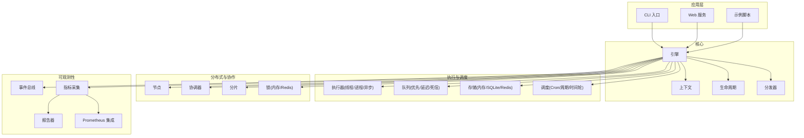
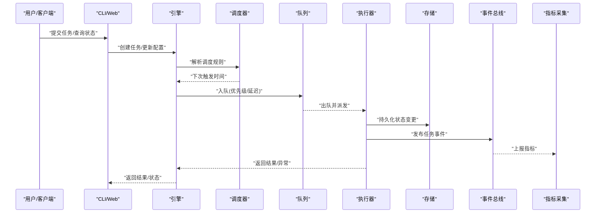
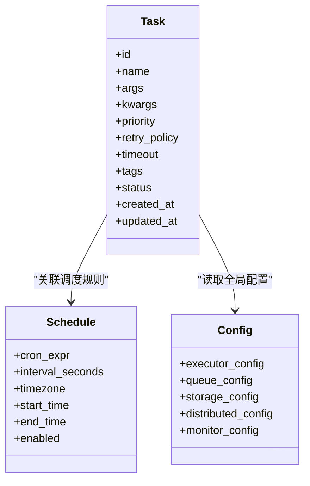
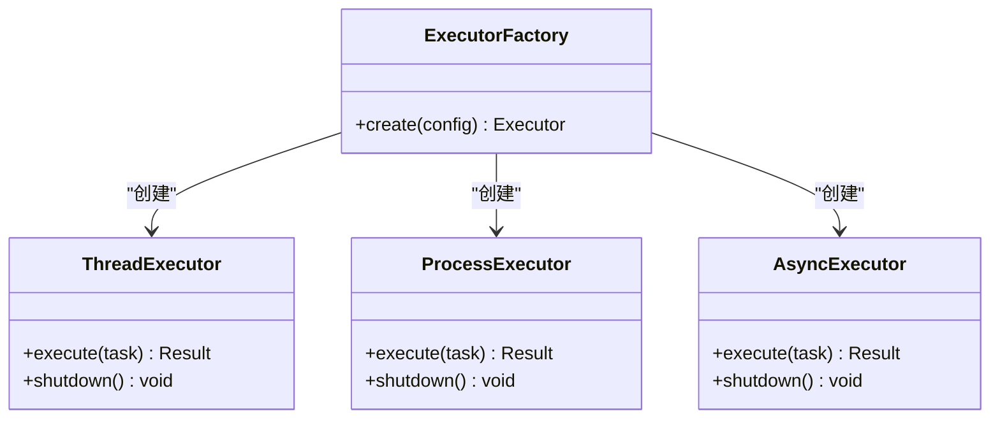
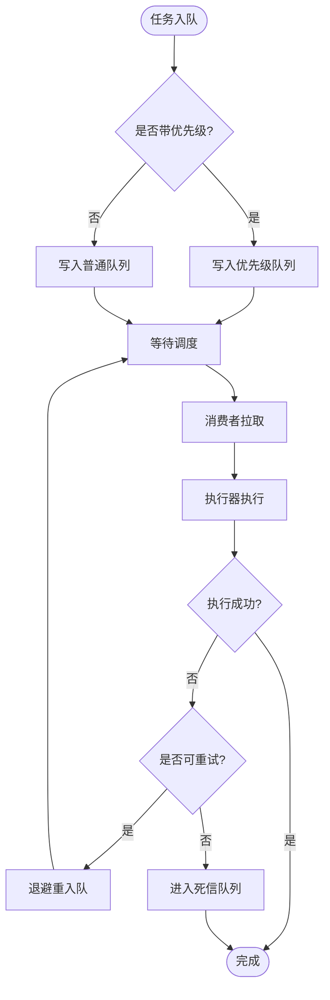
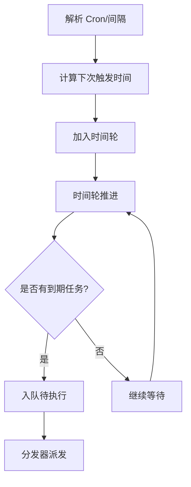
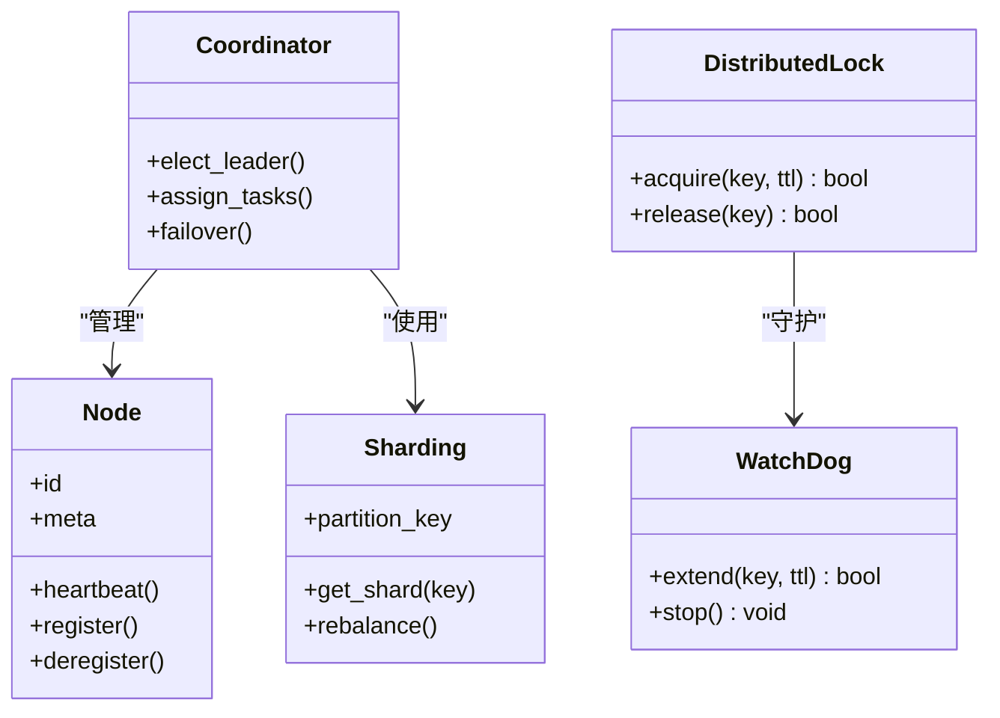
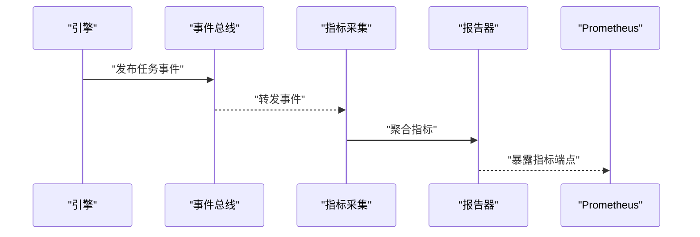
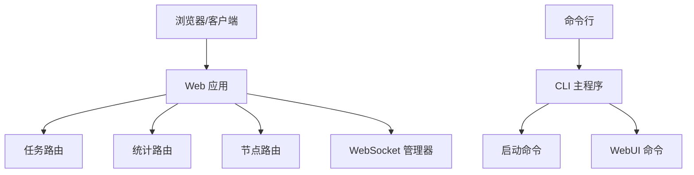
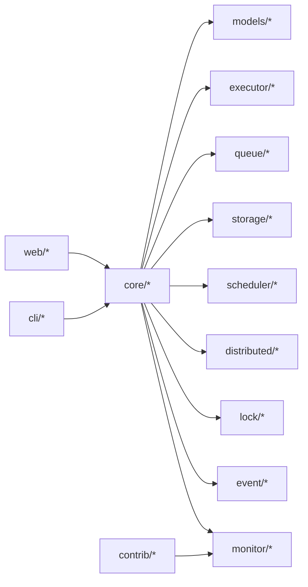

# 完整功能演示

<cite>
**本文引用的文件**   
- [README.md](file://README.md)
- [pyproject.toml](file://pyproject.toml)
- [examples/99_all_features.py](file://examples/99_all_features.py)
- [src/neotask/__init__.py](file://src/neotask/__init__.py)
- [src/neotask/core/engine.py](file://src/neotask/core/engine.py)
- [src/neotask/core/context.py](file://src/neotask/core/context.py)
- [src/neotask/core/lifecycle.py](file://src/neotask/core/lifecycle.py)
- [src/neotask/core/dispatcher.py](file://src/neotask/core/dispatcher.py)
- [src/neotask/models/task.py](file://src/neotask/models/task.py)
- [src/neotask/models/schedule.py](file://src/neotask/models/schedule.py)
- [src/neotask/models/config.py](file://src/neotask/models/config.py)
- [src/neotask/executor/factory.py](file://src/neotask/executor/factory.py)
- [src/neotask/executor/thread_executor.py](file://src/neotask/executor/thread_executor.py)
- [src/neotask/executor/process_executor.py](file://src/neotask/executor/process_executor.py)
- [src/neotask/executor/async_executor.py](file://src/neotask/executor/async_executor.py)
- [src/neotask/queue/factory.py](file://src/neotask/queue/factory.py)
- [src/neotask/queue/priority_queue.py](file://src/neotask/queue/priority_queue.py)
- [src/neotask/queue/delayed_queue.py](file://src/neotask/queue/delayed_queue.py)
- [src/neotask/queue/dead_letter.py](file://src/neotask/queue/dead_letter.py)
- [src/neotask/storage/factory.py](file://src/neotask/storage/factory.py)
- [src/neotask/storage/memory.py](file://src/neotask/storage/memory.py)
- [src/neotask/storage/sqlite.py](file://src/neotask/storage/sqlite.py)
- [src/neotask/storage/redis.py](file://src/neotask/storage/redis.py)
- [src/neotask/scheduler/cron_parser.py](file://src/neotask/scheduler/cron_parser.py)
- [src/neotask/scheduler/periodic.py](file://src/neotask/scheduler/periodic.py)
- [src/neotask/scheduler/time_wheel.py](file://src/neotask/scheduler/time_wheel.py)
- [src/neotask/distributed/coordinator.py](file://src/neotask/distributed/coordinator.py)
- [src/neotask/distributed/node.py](file://src/neotask/distributed/node.py)
- [src/neotask/distributed/sharding.py](file://src/neotask/distributed/sharding.py)
- [src/neotask/lock/base.py](file://src/neotask/lock/base.py)
- [src/neotask/lock/memory.py](file://src/neotask/lock/memory.py)
- [src/neotask/lock/redis.py](file://src/neotask/lock/redis.py)
- [src/neotask/lock/watchdog.py](file://src/neotask/lock/watchdog.py)
- [src/neotask/event/bus.py](file://src/neotask/event/bus.py)
- [src/neotask/event/handlers.py](file://src/neotask/event/handlers.py)
- [src/neotask/event/middleware.py](file://src/neotask/event/middleware.py)
- [src/neotask/monitor/metrics.py](file://src/neotask/monitor/metrics.py)
- [src/neotask/monitor/collector.py](file://src/neotask/monitor/collector.py)
- [src/neotask/monitor/reporter.py](file://src/neotask/monitor/reporter.py)
- [src/neotask/contrib/prometheus.py](file://src/neotask/contrib/prometheus.py)
- [src/neotask/web/app.py](file://src/neotask/web/app.py)
- [src/neotask/web/server.py](file://src/neotask/web/server.py)
- [src/neotask/web/routes/tasks_router.py](file://src/neotask/web/routes/tasks_router.py)
- [src/neotask/web/routes/stats_router.py](file://src/neotask/web/routes/stats_router.py)
- [src/neotask/web/routes/nodes_router.py](file://src/neotask/web/routes/nodes_router.py)
- [src/neotask/cli/main.py](file://src/neotask/cli/main.py)
- [src/neotask/cli/commands/start.py](file://src/neotask/cli/commands/start.py)
- [src/neotask/cli/commands/webui.py](file://src/neotask/cli/commands/webui.py)
</cite>

## 目录
1. [简介](#简介)
2. [项目结构](#项目结构)
3. [核心组件](#核心组件)
4. [架构总览](#架构总览)
5. [详细组件分析](#详细组件分析)
6. [依赖关系分析](#依赖关系分析)
7. [性能考虑](#性能考虑)
8. [故障排查指南](#故障排查指南)
9. [结论](#结论)
10. [附录](#附录)

## 简介
本文件提供“任务调度管理器”的完整功能演示与集成参考，覆盖任务调度、分布式协调、锁与分片、队列与存储、事件总线、监控指标、Web UI 与 CLI 等关键能力。文档以“端到端集成模板”为主线，展示如何在实际项目中组合使用各组件，形成高可用、可观测、可扩展的任务处理系统。

## 项目结构
仓库采用分层与按领域划分的组织方式：
- core：引擎、上下文、生命周期、分发器
- models：任务、调度、配置数据模型
- executor：线程/进程/异步执行器及工厂
- queue：优先级队列、延迟队列、死信队列及工厂
- storage：内存/SQLite/Redis 存储及工厂
- scheduler：Cron 解析、周期任务、时间轮
- distributed：节点、协调器、分片
- lock：锁抽象、内存/Redis 实现、看门狗
- event：事件总线、处理器、中间件
- monitor：指标采集、报告器
- contrib：Prometheus 集成
- web：应用、服务器、路由、WebSocket
- cli：命令行入口与子命令
- examples：示例脚本（含全功能演示）
- tests：单元测试、集成测试、基准与混沌测试

图表来源
- [src/neotask/core/engine.py](file://src/neotask/core/engine.py)
- [src/neotask/core/context.py](file://src/neotask/core/context.py)
- [src/neotask/core/lifecycle.py](file://src/neotask/core/lifecycle.py)
- [src/neotask/core/dispatcher.py](file://src/neotask/core/dispatcher.py)
- [src/neotask/executor/factory.py](file://src/neotask/executor/factory.py)
- [src/neotask/queue/factory.py](file://src/neotask/queue/factory.py)
- [src/neotask/storage/factory.py](file://src/neotask/storage/factory.py)
- [src/neotask/scheduler/periodic.py](file://src/neotask/scheduler/periodic.py)
- [src/neotask/distributed/coordinator.py](file://src/neotask/distributed/coordinator.py)
- [src/neotask/lock/base.py](file://src/neotask/lock/base.py)
- [src/neotask/event/bus.py](file://src/neotask/event/bus.py)
- [src/neotask/monitor/metrics.py](file://src/neotask/monitor/metrics.py)
- [src/neotask/contrib/prometheus.py](file://src/neotask/contrib/prometheus.py)
- [src/neotask/web/app.py](file://src/neotask/web/app.py)
- [src/neotask/cli/main.py](file://src/neotask/cli/main.py)

章节来源
- [README.md](file://README.md)
- [pyproject.toml](file://pyproject.toml)

## 核心组件
- 引擎与上下文：负责任务编排、生命周期管理、上下文传播与分发策略。
- 执行器：支持线程、进程、异步三种执行环境，统一通过工厂创建。
- 队列与存储：提供优先级、延迟、死信队列；内存、SQLite、Redis 存储后端。
- 调度器：Cron 表达式解析、周期任务管理与时间轮优化。
- 分布式：节点注册、心跳、选举与协调；分片策略与分布式锁。
- 事件与监控：事件总线贯穿系统，指标采集与外部系统对接（如 Prometheus）。
- Web 与 CLI：提供 REST API、WebSocket 实时推送与命令行工具。

章节来源
- [src/neotask/core/engine.py](file://src/neotask/core/engine.py)
- [src/neotask/core/context.py](file://src/neotask/core/context.py)
- [src/neotask/core/lifecycle.py](file://src/neotask/core/lifecycle.py)
- [src/neotask/core/dispatcher.py](file://src/neotask/core/dispatcher.py)
- [src/neotask/executor/factory.py](file://src/neotask/executor/factory.py)
- [src/neotask/queue/factory.py](file://src/neotask/queue/factory.py)
- [src/neotask/storage/factory.py](file://src/neotask/storage/factory.py)
- [src/neotask/scheduler/periodic.py](file://src/neotask/scheduler/periodic.py)
- [src/neotask/distributed/coordinator.py](file://src/neotask/distributed/coordinator.py)
- [src/neotask/lock/base.py](file://src/neotask/lock/base.py)
- [src/neotask/event/bus.py](file://src/neotask/event/bus.py)
- [src/neotask/monitor/metrics.py](file://src/neotask/monitor/metrics.py)
- [src/neotask/contrib/prometheus.py](file://src/neotask/contrib/prometheus.py)
- [src/neotask/web/app.py](file://src/neotask/web/app.py)
- [src/neotask/cli/main.py](file://src/neotask/cli/main.py)

## 架构总览
下图展示了从用户提交任务到执行完成的全链路流程，包括调度、执行、持久化、事件与监控。

图表来源
- [src/neotask/core/engine.py](file://src/neotask/core/engine.py)
- [src/neotask/scheduler/periodic.py](file://src/neotask/scheduler/periodic.py)
- [src/neotask/queue/priority_queue.py](file://src/neotask/queue/priority_queue.py)
- [src/neotask/executor/thread_executor.py](file://src/neotask/executor/thread_executor.py)
- [src/neotask/storage/memory.py](file://src/neotask/storage/memory.py)
- [src/neotask/event/bus.py](file://src/neotask/event/bus.py)
- [src/neotask/monitor/metrics.py](file://src/neotask/monitor/metrics.py)

## 详细组件分析

### 任务与调度模型
- 任务模型：定义任务标识、参数、重试策略、超时、优先级、标签等元信息。
- 调度模型：封装 Cron 表达式、周期间隔、时区、生效窗口等调度约束。
- 配置模型：集中管理执行器、队列、存储、分布式、监控等全局设置。

图表来源
- [src/neotask/models/task.py](file://src/neotask/models/task.py)
- [src/neotask/models/schedule.py](file://src/neotask/models/schedule.py)
- [src/neotask/models/config.py](file://src/neotask/models/config.py)

章节来源
- [src/neotask/models/task.py](file://src/neotask/models/task.py)
- [src/neotask/models/schedule.py](file://src/neotask/models/schedule.py)
- [src/neotask/models/config.py](file://src/neotask/models/config.py)

### 执行器与工厂
- 执行器抽象：统一任务执行接口，屏蔽线程/进程/异步差异。
- 工厂模式：根据配置动态选择执行器类型，便于扩展新执行器。
- 典型执行器：线程执行器用于 CPU/IO 混合场景；进程执行器用于隔离型任务；异步执行器用于协程密集型任务。

图表来源
- [src/neotask/executor/factory.py](file://src/neotask/executor/factory.py)
- [src/neotask/executor/thread_executor.py](file://src/neotask/executor/thread_executor.py)
- [src/neotask/executor/process_executor.py](file://src/neotask/executor/process_executor.py)
- [src/neotask/executor/async_executor.py](file://src/neotask/executor/async_executor.py)

章节来源
- [src/neotask/executor/factory.py](file://src/neotask/executor/factory.py)
- [src/neotask/executor/thread_executor.py](file://src/neotask/executor/thread_executor.py)
- [src/neotask/executor/process_executor.py](file://src/neotask/executor/process_executor.py)
- [src/neotask/executor/async_executor.py](file://src/neotask/executor/async_executor.py)

### 队列与存储
- 队列：优先级队列保障重要任务先执行；延迟队列支持延时触发；死信队列捕获失败不可恢复任务。
- 存储：内存存储适合单机快速验证；SQLite 适合轻量持久化；Redis 适合分布式共享状态。

图表来源
- [src/neotask/queue/priority_queue.py](file://src/neotask/queue/priority_queue.py)
- [src/neotask/queue/delayed_queue.py](file://src/neotask/queue/delayed_queue.py)
- [src/neotask/queue/dead_letter.py](file://src/neotask/queue/dead_letter.py)
- [src/neotask/storage/memory.py](file://src/neotask/storage/memory.py)
- [src/neotask/storage/sqlite.py](file://src/neotask/storage/sqlite.py)
- [src/neotask/storage/redis.py](file://src/neotask/storage/redis.py)

章节来源
- [src/neotask/queue/factory.py](file://src/neotask/queue/factory.py)
- [src/neotask/queue/priority_queue.py](file://src/neotask/queue/priority_queue.py)
- [src/neotask/queue/delayed_queue.py](file://src/neotask/queue/delayed_queue.py)
- [src/neotask/queue/dead_letter.py](file://src/neotask/queue/dead_letter.py)
- [src/neotask/storage/factory.py](file://src/neotask/storage/factory.py)
- [src/neotask/storage/memory.py](file://src/neotask/storage/memory.py)
- [src/neotask/storage/sqlite.py](file://src/neotask/storage/sqlite.py)
- [src/neotask/storage/redis.py](file://src/neotask/storage/redis.py)

### 调度器与时间轮
- Cron 解析：将标准 Cron 表达式转换为下一次触发时间。
- 周期任务：基于固定间隔或 Cron 的周期性任务管理。
- 时间轮：高效管理大量定时任务的到期触发。

图表来源
- [src/neotask/scheduler/cron_parser.py](file://src/neotask/scheduler/cron_parser.py)
- [src/neotask/scheduler/periodic.py](file://src/neotask/scheduler/periodic.py)
- [src/neotask/scheduler/time_wheel.py](file://src/neotask/scheduler/time_wheel.py)

章节来源
- [src/neotask/scheduler/cron_parser.py](file://src/neotask/scheduler/cron_parser.py)
- [src/neotask/scheduler/periodic.py](file://src/neotask/scheduler/periodic.py)
- [src/neotask/scheduler/time_wheel.py](file://src/neotask/scheduler/time_wheel.py)

### 分布式协调与锁
- 节点管理：节点注册、心跳检测、存活判定。
- 协调器：领导选举、任务分配、故障转移。
- 分片：按任务键进行一致性哈希分片，保证任务定位稳定。
- 分布式锁：基于内存或 Redis 的互斥锁，配合看门狗避免死锁。

图表来源
- [src/neotask/distributed/node.py](file://src/neotask/distributed/node.py)
- [src/neotask/distributed/coordinator.py](file://src/neotask/distributed/coordinator.py)
- [src/neotask/distributed/sharding.py](file://src/neotask/distributed/sharding.py)
- [src/neotask/lock/base.py](file://src/neotask/lock/base.py)
- [src/neotask/lock/memory.py](file://src/neotask/lock/memory.py)
- [src/neotask/lock/redis.py](file://src/neotask/lock/redis.py)
- [src/neotask/lock/watchdog.py](file://src/neotask/lock/watchdog.py)

章节来源
- [src/neotask/distributed/coordinator.py](file://src/neotask/distributed/coordinator.py)
- [src/neotask/distributed/node.py](file://src/neotask/distributed/node.py)
- [src/neotask/distributed/sharding.py](file://src/neotask/distributed/sharding.py)
- [src/neotask/lock/base.py](file://src/neotask/lock/base.py)
- [src/neotask/lock/memory.py](file://src/neotask/lock/memory.py)
- [src/neotask/lock/redis.py](file://src/neotask/lock/redis.py)
- [src/neotask/lock/watchdog.py](file://src/neotask/lock/watchdog.py)

### 事件总线与监控
- 事件总线：解耦模块间通信，支持订阅/发布与中间件链。
- 指标采集：收集任务吞吐、延迟、错误率等关键指标。
- 报告器：聚合指标并输出至日志/外部系统。
- Prometheus 集成：暴露标准指标端点供抓取。

图表来源
- [src/neotask/event/bus.py](file://src/neotask/event/bus.py)
- [src/neotask/event/handlers.py](file://src/neotask/event/handlers.py)
- [src/neotask/event/middleware.py](file://src/neotask/event/middleware.py)
- [src/neotask/monitor/metrics.py](file://src/neotask/monitor/metrics.py)
- [src/neotask/monitor/reporter.py](file://src/neotask/monitor/reporter.py)
- [src/neotask/contrib/prometheus.py](file://src/neotask/contrib/prometheus.py)

章节来源
- [src/neotask/event/bus.py](file://src/neotask/event/bus.py)
- [src/neotask/event/handlers.py](file://src/neotask/event/handlers.py)
- [src/neotask/event/middleware.py](file://src/neotask/event/middleware.py)
- [src/neotask/monitor/metrics.py](file://src/neotask/monitor/metrics.py)
- [src/neotask/monitor/reporter.py](file://src/neotask/monitor/reporter.py)
- [src/neotask/contrib/prometheus.py](file://src/neotask/contrib/prometheus.py)

### Web 与 CLI
- Web 服务：REST API 与 WebSocket 实时推送，提供任务、统计、节点等路由。
- CLI：启动引擎、启动 Web UI 等常用操作。

图表来源
- [src/neotask/web/app.py](file://src/neotask/web/app.py)
- [src/neotask/web/server.py](file://src/neotask/web/server.py)
- [src/neotask/web/routes/tasks_router.py](file://src/neotask/web/routes/tasks_router.py)
- [src/neotask/web/routes/stats_router.py](file://src/neotask/web/routes/stats_router.py)
- [src/neotask/web/routes/nodes_router.py](file://src/neotask/web/routes/nodes_router.py)
- [src/neotask/cli/main.py](file://src/neotask/cli/main.py)
- [src/neotask/cli/commands/start.py](file://src/neotask/cli/commands/start.py)
- [src/neotask/cli/commands/webui.py](file://src/neotask/cli/commands/webui.py)

章节来源
- [src/neotask/web/app.py](file://src/neotask/web/app.py)
- [src/neotask/web/server.py](file://src/neotask/web/server.py)
- [src/neotask/web/routes/tasks_router.py](file://src/neotask/web/routes/tasks_router.py)
- [src/neotask/web/routes/stats_router.py](file://src/neotask/web/routes/stats_router.py)
- [src/neotask/web/routes/nodes_router.py](file://src/neotask/web/routes/nodes_router.py)
- [src/neotask/cli/main.py](file://src/neotask/cli/main.py)
- [src/neotask/cli/commands/start.py](file://src/neotask/cli/commands/start.py)
- [src/neotask/cli/commands/webui.py](file://src/neotask/cli/commands/webui.py)

## 依赖关系分析
- 低耦合：通过工厂与接口抽象降低模块间直接依赖。
- 内聚性：每个领域模块职责清晰，便于独立演进。
- 外部依赖：Redis、SQLite、Prometheus 等通过可选集成接入。

图表来源
- [src/neotask/core/engine.py](file://src/neotask/core/engine.py)
- [src/neotask/models/config.py](file://src/neotask/models/config.py)
- [src/neotask/executor/factory.py](file://src/neotask/executor/factory.py)
- [src/neotask/queue/factory.py](file://src/neotask/queue/factory.py)
- [src/neotask/storage/factory.py](file://src/neotask/storage/factory.py)
- [src/neotask/scheduler/periodic.py](file://src/neotask/scheduler/periodic.py)
- [src/neotask/distributed/coordinator.py](file://src/neotask/distributed/coordinator.py)
- [src/neotask/lock/base.py](file://src/neotask/lock/base.py)
- [src/neotask/event/bus.py](file://src/neotask/event/bus.py)
- [src/neotask/monitor/metrics.py](file://src/neotask/monitor/metrics.py)
- [src/neotask/contrib/prometheus.py](file://src/neotask/contrib/prometheus.py)
- [src/neotask/web/app.py](file://src/neotask/web/app.py)
- [src/neotask/cli/main.py](file://src/neotask/cli/main.py)

章节来源
- [src/neotask/core/engine.py](file://src/neotask/core/engine.py)
- [src/neotask/models/config.py](file://src/neotask/models/config.py)
- [src/neotask/executor/factory.py](file://src/neotask/executor/factory.py)
- [src/neotask/queue/factory.py](file://src/neotask/queue/factory.py)
- [src/neotask/storage/factory.py](file://src/neotask/storage/factory.py)
- [src/neotask/scheduler/periodic.py](file://src/neotask/scheduler/periodic.py)
- [src/neotask/distributed/coordinator.py](file://src/neotask/distributed/coordinator.py)
- [src/neotask/lock/base.py](file://src/neotask/lock/base.py)
- [src/neotask/event/bus.py](file://src/neotask/event/bus.py)
- [src/neotask/monitor/metrics.py](file://src/neotask/monitor/metrics.py)
- [src/neotask/contrib/prometheus.py](file://src/neotask/contrib/prometheus.py)
- [src/neotask/web/app.py](file://src/neotask/web/app.py)
- [src/neotask/cli/main.py](file://src/neotask/cli/main.py)

## 性能考虑
- 执行器选择：CPU 密集建议进程执行器；IO 密集建议线程或异步执行器。
- 队列与存储：高并发下优先 Redis 作为队列与存储后端；SQLite 仅用于小规模场景。
- 调度优化：时间轮减少扫描开销；合理设置 Cron 与间隔避免风暴。
- 锁与分片：使用 Redis 锁提升跨进程/节点互斥效率；分片键均匀分布避免热点。
- 监控与告警：开启指标采集，结合 Prometheus 与告警规则提前发现瓶颈。

## 故障排查指南
- 任务未执行：检查调度规则与时间轮；确认队列容量与消费者健康；查看死信队列。
- 执行失败：查看重试策略与退避；核对执行器资源与超时配置；关注异常堆栈。
- 分布式问题：检查节点心跳与领导选举；确认分片一致性与锁持有者；观察协调器日志。
- 监控缺失：确认指标采集器与报告器已启用；检查 Prometheus 抓取端点可达性。

章节来源
- [src/neotask/queue/dead_letter.py](file://src/neotask/queue/dead_letter.py)
- [src/neotask/executor/thread_executor.py](file://src/neotask/executor/thread_executor.py)
- [src/neotask/executor/process_executor.py](file://src/neotask/executor/process_executor.py)
- [src/neotask/executor/async_executor.py](file://src/neotask/executor/async_executor.py)
- [src/neotask/distributed/coordinator.py](file://src/neotask/distributed/coordinator.py)
- [src/neotask/distributed/node.py](file://src/neotask/distributed/node.py)
- [src/neotask/distributed/sharding.py](file://src/neotask/distributed/sharding.py)
- [src/neotask/lock/redis.py](file://src/neotask/lock/redis.py)
- [src/neotask/monitor/metrics.py](file://src/neotask/monitor/metrics.py)
- [src/neotask/contrib/prometheus.py](file://src/neotask/contrib/prometheus.py)

## 结论
通过将引擎、执行器、队列、存储、调度、分布式、锁、事件与监控有机整合，本系统提供了生产可用的任务调度与管理能力。示例脚本可作为集成模板，结合 Web 与 CLI 快速落地。建议在真实环境中优先选择 Redis 与 Prometheus，强化可观测性与稳定性。

## 附录

### 端到端集成模板（参考路径）
- 全功能演示脚本：[examples/99_all_features.py](file://examples/99_all_features.py)
- 包入口与导出：[src/neotask/__init__.py](file://src/neotask/__init__.py)
- 引擎与上下文：[src/neotask/core/engine.py](file://src/neotask/core/engine.py)、[src/neotask/core/context.py](file://src/neotask/core/context.py)
- 生命周期与分发：[src/neotask/core/lifecycle.py](file://src/neotask/core/lifecycle.py)、[src/neotask/core/dispatcher.py](file://src/neotask/core/dispatcher.py)
- 执行器与工厂：[src/neotask/executor/factory.py](file://src/neotask/executor/factory.py)
- 队列与存储：[src/neotask/queue/factory.py](file://src/neotask/queue/factory.py)、[src/neotask/storage/factory.py](file://src/neotask/storage/factory.py)
- 调度器：[src/neotask/scheduler/periodic.py](file://src/neotask/scheduler/periodic.py)
- 分布式与锁：[src/neotask/distributed/coordinator.py](file://src/neotask/distributed/coordinator.py)、[src/neotask/lock/base.py](file://src/neotask/lock/base.py)
- 事件与监控：[src/neotask/event/bus.py](file://src/neotask/event/bus.py)、[src/neotask/monitor/metrics.py](file://src/neotask/monitor/metrics.py)
- Web 与 CLI：[src/neotask/web/app.py](file://src/neotask/web/app.py)、[src/neotask/cli/main.py](file://src/neotask/cli/main.py)

章节来源
- [examples/99_all_features.py](file://examples/99_all_features.py)
- [src/neotask/__init__.py](file://src/neotask/__init__.py)
- [src/neotask/core/engine.py](file://src/neotask/core/engine.py)
- [src/neotask/core/context.py](file://src/neotask/core/context.py)
- [src/neotask/core/lifecycle.py](file://src/neotask/core/lifecycle.py)
- [src/neotask/core/dispatcher.py](file://src/neotask/core/dispatcher.py)
- [src/neotask/executor/factory.py](file://src/neotask/executor/factory.py)
- [src/neotask/queue/factory.py](file://src/neotask/queue/factory.py)
- [src/neotask/storage/factory.py](file://src/neotask/storage/factory.py)
- [src/neotask/scheduler/periodic.py](file://src/neotask/scheduler/periodic.py)
- [src/neotask/distributed/coordinator.py](file://src/neotask/distributed/coordinator.py)
- [src/neotask/lock/base.py](file://src/neotask/lock/base.py)
- [src/neotask/event/bus.py](file://src/neotask/event/bus.py)
- [src/neotask/monitor/metrics.py](file://src/neotask/monitor/metrics.py)
- [src/neotask/web/app.py](file://src/neotask/web/app.py)
- [src/neotask/cli/main.py](file://src/neotask/cli/main.py)