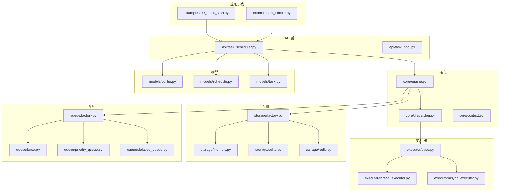
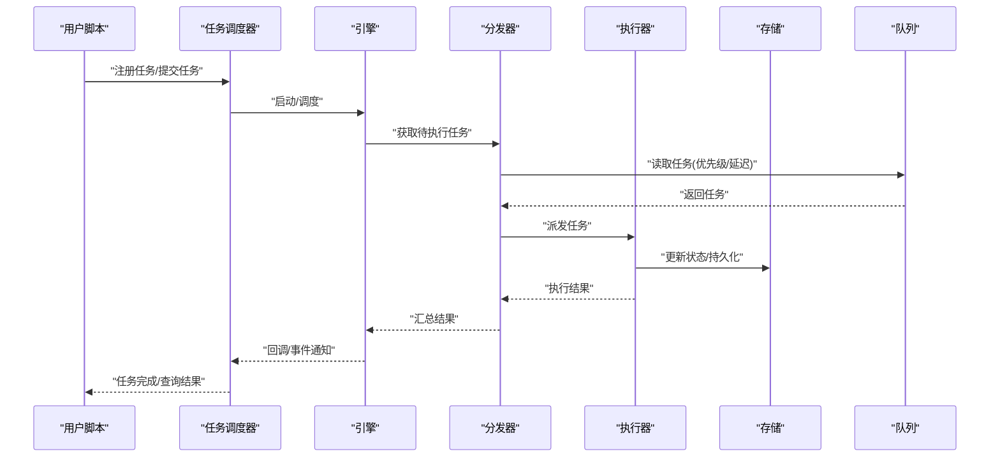
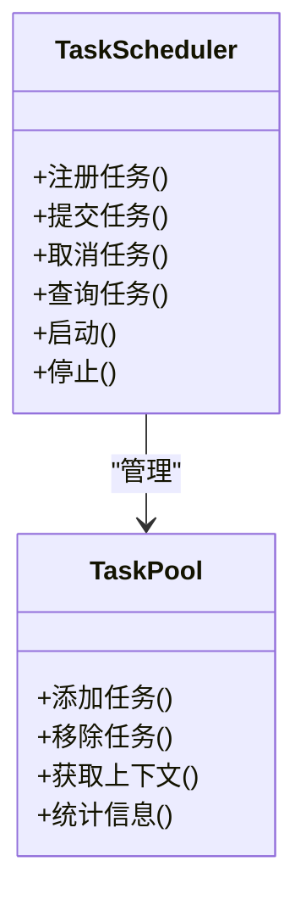
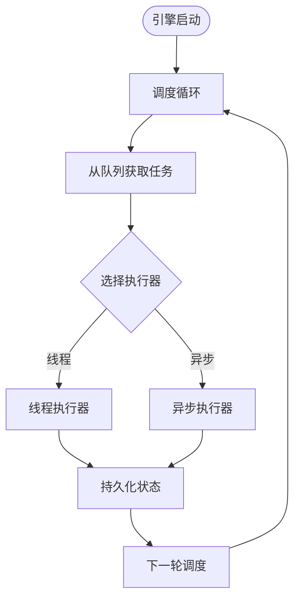
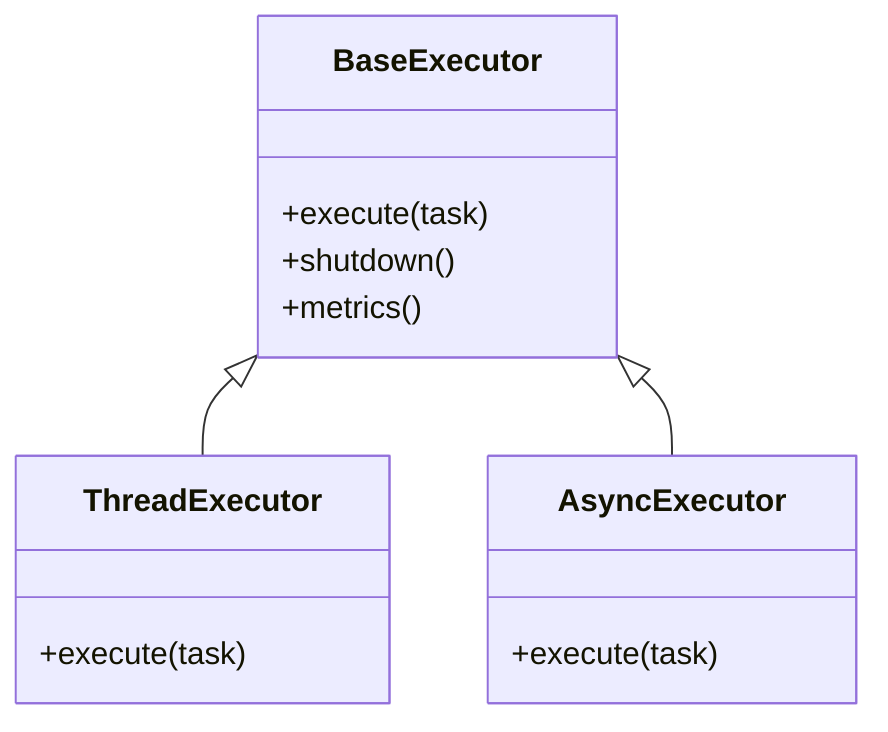
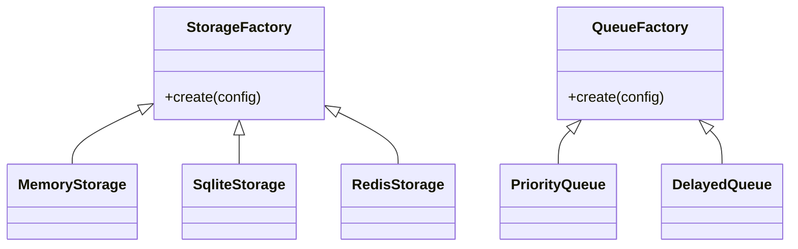
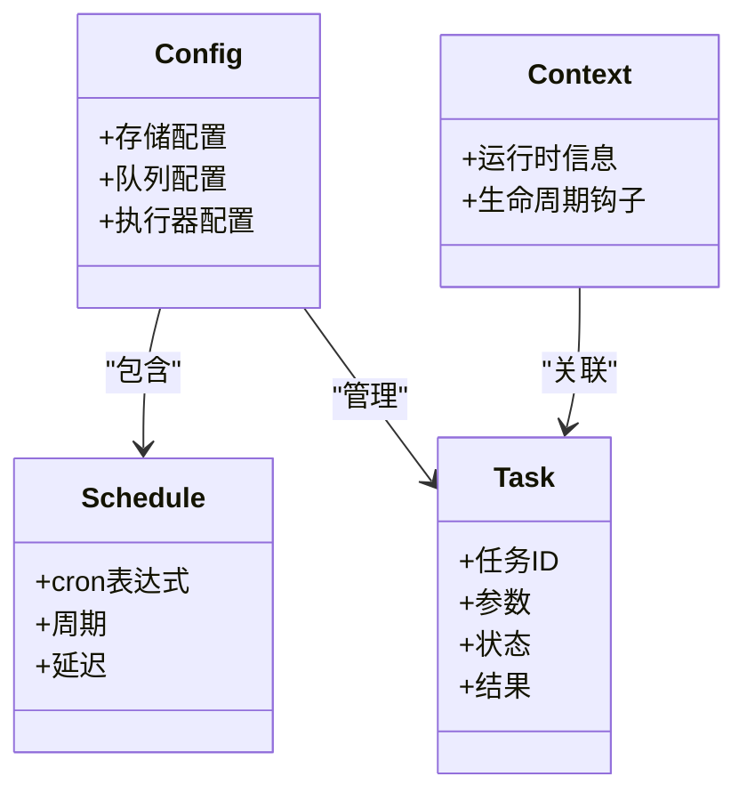
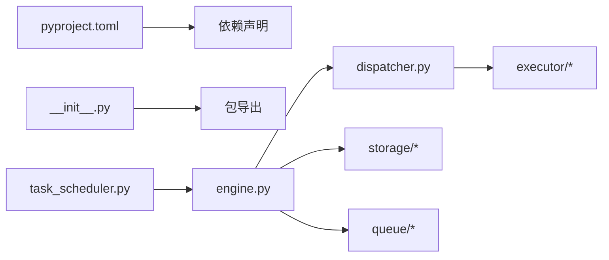

# 快速开始

<cite>
**本文引用的文件**   
- [README_zh.md](file://README_zh.md)
- [pyproject.toml](file://pyproject.toml)
- [00_quick_start.py](file://examples/00_quick_start.py)
- [01_simple.py](file://examples/01_simple.py)
- [__init__.py](file://src/neotask/__init__.py)
- [task_scheduler.py](file://src/neotask/api/task_scheduler.py)
- [task_pool.py](file://src/neotask/api/task_pool.py)
- [engine.py](file://src/neotask/core/engine.py)
- [dispatcher.py](file://src/neotask/core/dispatcher.py)
- [context.py](file://src/neotask/core/context.py)
- [base.py](file://src/neotask/executor/base.py)
- [thread_executor.py](file://src/neotask/executor/thread_executor.py)
- [async_executor.py](file://src/neotask/executor/async_executor.py)
- [memory.py](file://src/neotask/storage/memory.py)
- [sqlite.py](file://src/neotask/storage/sqlite.py)
- [redis.py](file://src/neotask/storage/redis.py)
- [factory.py](file://src/neotask/storage/factory.py)
- [base.py](file://src/neotask/queue/base.py)
- [priority_queue.py](file://src/neotask/queue/priority_queue.py)
- [delayed_queue.py](file://src/neotask/queue/delayed_queue.py)
- [factory.py](file://src/neotask/queue/factory.py)
- [config.py](file://src/neotask/models/config.py)
- [schedule.py](file://src/neotask/models/schedule.py)
- [task.py](file://src/neotask/models/task.py)
</cite>

## 目录
1. [简介](#简介)
2. [项目结构](#项目结构)
3. [核心组件](#核心组件)
4. [架构总览](#架构总览)
5. [详细组件分析](#详细组件分析)
6. [依赖分析](#依赖分析)
7. [性能考虑](#性能考虑)
8. [故障排查指南](#故障排查指南)
9. [结论](#结论)
10. [附录](#附录)

## 简介
本快速开始指南旨在帮助你在5分钟内运行第一个任务调度程序。你将完成环境准备、安装、创建并运行一个最简单的任务，理解基本概念与关键入口。

## 项目结构
本项目采用分层组织方式：API层提供对外接口，核心引擎负责调度与分发，执行器负责实际任务执行，存储与队列提供持久化与任务排队能力，模型定义统一的数据结构。示例位于 examples 目录，可直接运行以学习用法。

图表来源
- [00_quick_start.py](file://examples/00_quick_start.py)
- [01_simple.py](file://examples/01_simple.py)
- [task_scheduler.py](file://src/neotask/api/task_scheduler.py)
- [engine.py](file://src/neotask/core/engine.py)
- [dispatcher.py](file://src/neotask/core/dispatcher.py)
- [base.py](file://src/neotask/executor/base.py)
- [thread_executor.py](file://src/neotask/executor/thread_executor.py)
- [async_executor.py](file://src/neotask/executor/async_executor.py)
- [memory.py](file://src/neotask/storage/memory.py)
- [sqlite.py](file://src/neotask/storage/sqlite.py)
- [redis.py](file://src/neotask/storage/redis.py)
- [factory.py](file://src/neotask/storage/factory.py)
- [base.py](file://src/neotask/queue/base.py)
- [priority_queue.py](file://src/neotask/queue/priority_queue.py)
- [delayed_queue.py](file://src/neotask/queue/delayed_queue.py)
- [factory.py](file://src/neotask/queue/factory.py)
- [config.py](file://src/neotask/models/config.py)
- [schedule.py](file://src/neotask/models/schedule.py)
- [task.py](file://src/neotask/models/task.py)

章节来源
- [README_zh.md](file://README_zh.md)
- [pyproject.toml](file://pyproject.toml)

## 核心组件
- 任务调度器（TaskScheduler）：对外暴露注册任务、提交任务、查询状态等API，是用户最常接触的入口。
- 任务池（TaskPool）：管理任务生命周期、上下文与元数据。
- 引擎（Engine）：驱动调度循环，协调分发器、执行器、存储与队列。
- 分发器（Dispatcher）：根据策略将任务分派到合适的执行器。
- 执行器（Executor）：线程或异步执行器，承载具体任务执行。
- 存储（Storage）：内存、SQLite、Redis等多种后端，用于任务持久化与状态同步。
- 队列（Queue）：优先级队列、延迟队列等，支撑定时与延时任务。
- 模型（Models）：配置、调度规则、任务实体的统一数据结构。

章节来源
- [task_scheduler.py](file://src/neotask/api/task_scheduler.py)
- [task_pool.py](file://src/neotask/api/task_pool.py)
- [engine.py](file://src/neotask/core/engine.py)
- [dispatcher.py](file://src/neotask/core/dispatcher.py)
- [base.py](file://src/neotask/executor/base.py)
- [thread_executor.py](file://src/neotask/executor/thread_executor.py)
- [async_executor.py](file://src/neotask/executor/async_executor.py)
- [memory.py](file://src/neotask/storage/memory.py)
- [sqlite.py](file://src/neotask/storage/sqlite.py)
- [redis.py](file://src/neotask/storage/redis.py)
- [factory.py](file://src/neotask/storage/factory.py)
- [base.py](file://src/neotask/queue/base.py)
- [priority_queue.py](file://src/neotask/queue/priority_queue.py)
- [delayed_queue.py](file://src/neotask/queue/delayed_queue.py)
- [factory.py](file://src/neotask/queue/factory.py)
- [config.py](file://src/neotask/models/config.py)
- [schedule.py](file://src/neotask/models/schedule.py)
- [task.py](file://src/neotask/models/task.py)

## 架构总览
下图展示了从示例脚本到调度器、引擎、分发器、执行器以及存储与队列的调用关系。

图表来源
- [task_scheduler.py](file://src/neotask/api/task_scheduler.py)
- [engine.py](file://src/neotask/core/engine.py)
- [dispatcher.py](file://src/neotask/core/dispatcher.py)
- [thread_executor.py](file://src/neotask/executor/thread_executor.py)
- [async_executor.py](file://src/neotask/executor/async_executor.py)
- [memory.py](file://src/neotask/storage/memory.py)
- [sqlite.py](file://src/neotask/storage/sqlite.py)
- [redis.py](file://src/neotask/storage/redis.py)
- [priority_queue.py](file://src/neotask/queue/priority_queue.py)
- [delayed_queue.py](file://src/neotask/queue/delayed_queue.py)

## 详细组件分析

### 快速上手步骤（5分钟）
- 环境准备
  - Python 版本要求见项目配置。
  - 可选：若使用 Redis 作为存储或队列，请确保本地已安装并可连接。
- 安装
  - 通过包管理器安装项目依赖。
- 运行第一个任务
  - 参考示例脚本，创建一个简单任务并提交执行。
  - 查看任务状态与结果。

章节来源
- [pyproject.toml](file://pyproject.toml)
- [00_quick_start.py](file://examples/00_quick_start.py)
- [01_simple.py](file://examples/01_simple.py)

### 最小可运行示例解析
- 入口与初始化
  - 示例脚本导入调度器并创建实例。
  - 通过上下文或显式启动/关闭控制生命周期。
- 任务定义与注册
  - 定义任务函数或类方法。
  - 使用调度器进行注册或提交。
- 执行与查询
  - 提交任务后，可通过任务ID查询状态与结果。
  - 支持阻塞等待或异步回调。

章节来源
- [00_quick_start.py](file://examples/00_quick_start.py)
- [01_simple.py](file://examples/01_simple.py)
- [task_scheduler.py](file://src/neotask/api/task_scheduler.py)
- [task_pool.py](file://src/neotask/api/task_pool.py)

### 调度器与任务池
- 任务调度器
  - 提供注册、提交、取消、查询等API。
  - 内部维护任务上下文与生命周期钩子。
- 任务池
  - 管理任务集合、并发度与资源隔离。
  - 与存储和队列协作，保证任务可靠投递与持久化。

图表来源
- [task_scheduler.py](file://src/neotask/api/task_scheduler.py)
- [task_pool.py](file://src/neotask/api/task_pool.py)

章节来源
- [task_scheduler.py](file://src/neotask/api/task_scheduler.py)
- [task_pool.py](file://src/neotask/api/task_pool.py)

### 引擎与分发器
- 引擎
  - 驱动调度主循环，协调各子系统。
  - 处理心跳、健康检查与生命周期事件。
- 分发器
  - 从队列拉取任务，选择合适执行器。
  - 处理重试、超时与错误恢复。

图表来源
- [engine.py](file://src/neotask/core/engine.py)
- [dispatcher.py](file://src/neotask/core/dispatcher.py)
- [thread_executor.py](file://src/neotask/executor/thread_executor.py)
- [async_executor.py](file://src/neotask/executor/async_executor.py)

章节来源
- [engine.py](file://src/neotask/core/engine.py)
- [dispatcher.py](file://src/neotask/core/dispatcher.py)

### 执行器体系
- 基类
  - 定义统一的执行接口与生命周期钩子。
- 线程执行器
  - 适合CPU密集型或IO密集型的同步任务。
- 异步执行器
  - 适合基于事件循环的异步任务。

图表来源
- [base.py](file://src/neotask/executor/base.py)
- [thread_executor.py](file://src/neotask/executor/thread_executor.py)
- [async_executor.py](file://src/neotask/executor/async_executor.py)

章节来源
- [base.py](file://src/neotask/executor/base.py)
- [thread_executor.py](file://src/neotask/executor/thread_executor.py)
- [async_executor.py](file://src/neotask/executor/async_executor.py)

### 存储与队列
- 存储后端
  - 内存：轻量级，适合开发与测试。
  - SQLite：单机持久化，零外部依赖。
  - Redis：分布式场景，高吞吐与共享状态。
- 队列实现
  - 优先级队列：按优先级调度。
  - 延迟队列：支持延时执行。
  - 工厂：根据配置选择具体实现。

图表来源
- [factory.py](file://src/neotask/storage/factory.py)
- [memory.py](file://src/neotask/storage/memory.py)
- [sqlite.py](file://src/neotask/storage/sqlite.py)
- [redis.py](file://src/neotask/storage/redis.py)
- [factory.py](file://src/neotask/queue/factory.py)
- [priority_queue.py](file://src/neotask/queue/priority_queue.py)
- [delayed_queue.py](file://src/neotask/queue/delayed_queue.py)

章节来源
- [factory.py](file://src/neotask/storage/factory.py)
- [memory.py](file://src/neotask/storage/memory.py)
- [sqlite.py](file://src/neotask/storage/sqlite.py)
- [redis.py](file://src/neotask/storage/redis.py)
- [factory.py](file://src/neotask/queue/factory.py)
- [priority_queue.py](file://src/neotask/queue/priority_queue.py)
- [delayed_queue.py](file://src/neotask/queue/delayed_queue.py)

### 模型与上下文
- 配置模型
  - 存储、队列、执行器等系统参数。
- 调度模型
  - Cron表达式、周期、延迟等调度规则。
- 任务模型
  - 任务标识、参数、状态、结果等元数据。
- 上下文
  - 运行时上下文，贯穿任务生命周期。

图表来源
- [config.py](file://src/neotask/models/config.py)
- [schedule.py](file://src/neotask/models/schedule.py)
- [task.py](file://src/neotask/models/task.py)
- [context.py](file://src/neotask/core/context.py)

章节来源
- [config.py](file://src/neotask/models/config.py)
- [schedule.py](file://src/neotask/models/schedule.py)
- [task.py](file://src/neotask/models/task.py)
- [context.py](file://src/neotask/core/context.py)

## 依赖分析
- 包管理与依赖声明
  - 通过项目配置文件声明第三方依赖与可执行命令。
- 模块耦合
  - API层依赖核心引擎与模型；核心引擎依赖执行器、存储与队列；执行器与存储/队列解耦通过抽象接口与工厂模式。

图表来源
- [pyproject.toml](file://pyproject.toml)
- [__init__.py](file://src/neotask/__init__.py)
- [task_scheduler.py](file://src/neotask/api/task_scheduler.py)
- [engine.py](file://src/neotask/core/engine.py)
- [dispatcher.py](file://src/neotask/core/dispatcher.py)

章节来源
- [pyproject.toml](file://pyproject.toml)
- [__init__.py](file://src/neotask/__init__.py)
- [task_scheduler.py](file://src/neotask/api/task_scheduler.py)
- [engine.py](file://src/neotask/core/engine.py)
- [dispatcher.py](file://src/neotask/core/dispatcher.py)

## 性能考虑
- 选择合适的执行器
  - CPU密集型优先线程执行器；异步IO优先异步执行器。
- 存储与队列选型
  - 开发阶段使用内存存储；生产建议使用Redis以获得更高吞吐与可扩展性。
- 并发度与批处理
  - 合理设置并发度，避免资源争用；批量提交可降低调度开销。
- 监控与指标
  - 关注任务积压、执行耗时与失败率，结合监控指标调优。

## 故障排查指南
- 常见问题
  - 无法连接Redis：检查网络与认证配置。
  - 任务未执行：确认队列是否可用、任务是否成功入队。
  - 执行超时：调整超时阈值或优化任务逻辑。
- 定位思路
  - 查看任务状态与日志输出。
  - 验证存储与队列连通性。
  - 逐步缩小范围至执行器与任务代码。

## 结论
通过以上步骤，你可以在5分钟内完成环境准备、安装与运行第一个任务调度程序。建议后续阅读示例与文档，逐步掌握优先级、延迟、Cron、重试与取消等高级特性。

## 附录
- 示例清单
  - 快速开始示例：[00_quick_start.py](file://examples/00_quick_start.py)
  - 简单任务示例：[01_simple.py](file://examples/01_simple.py)
- 相关入口
  - 包导出入口：[__init__.py](file://src/neotask/__init__.py)
  - 调度器API：[task_scheduler.py](file://src/neotask/api/task_scheduler.py)
  - 任务池API：[task_pool.py](file://src/neotask/api/task_pool.py)