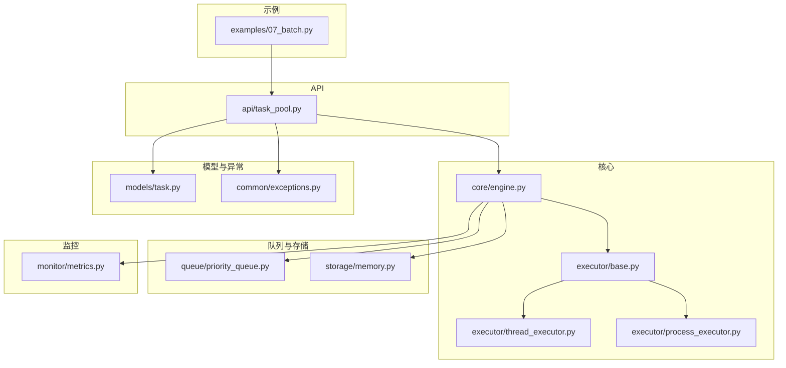
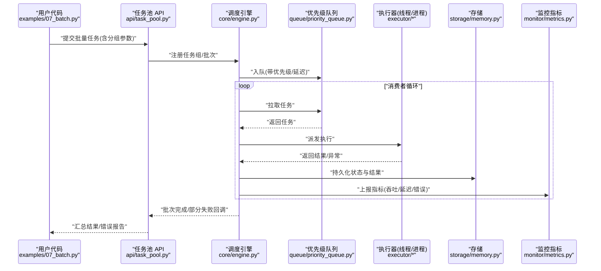
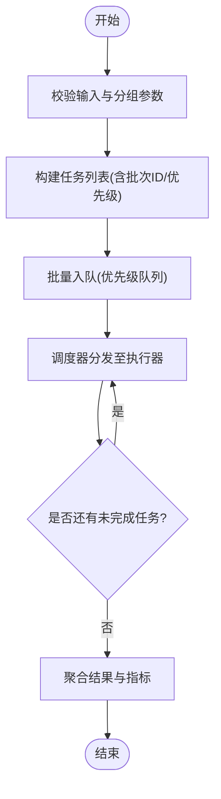
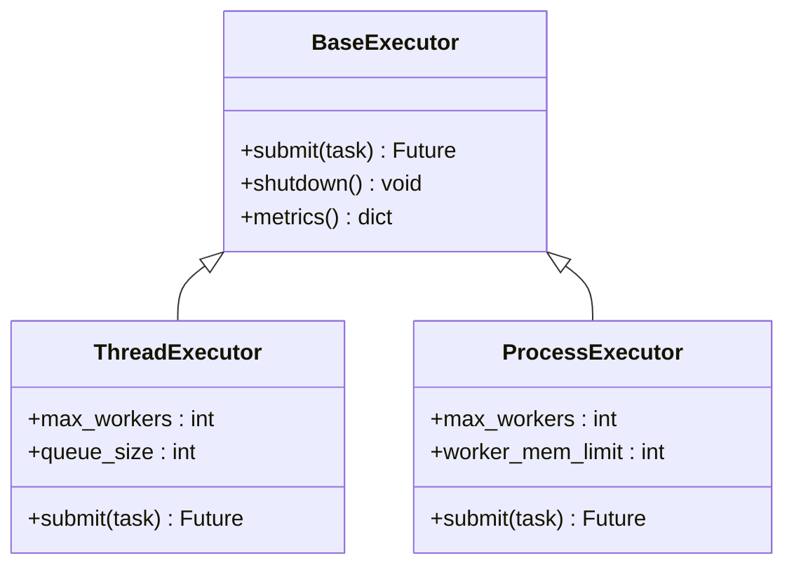
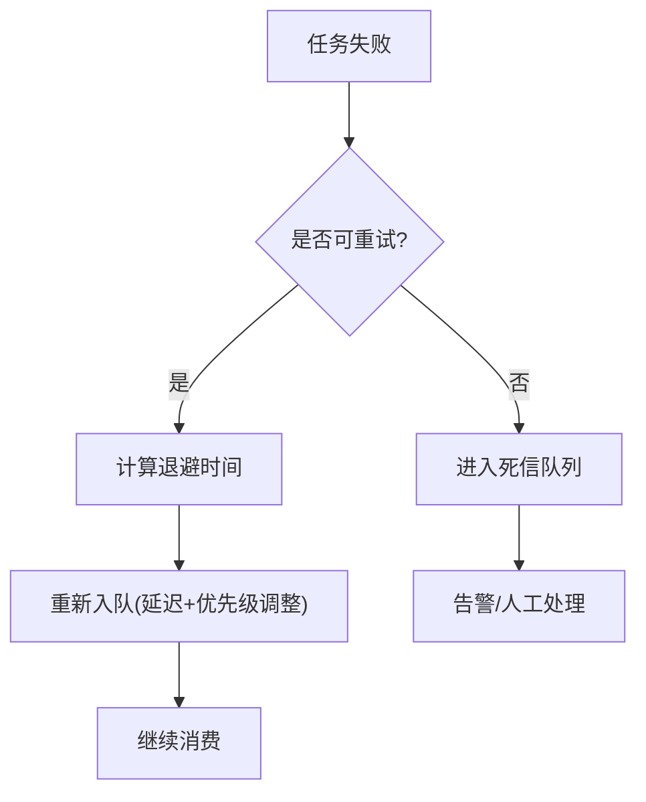
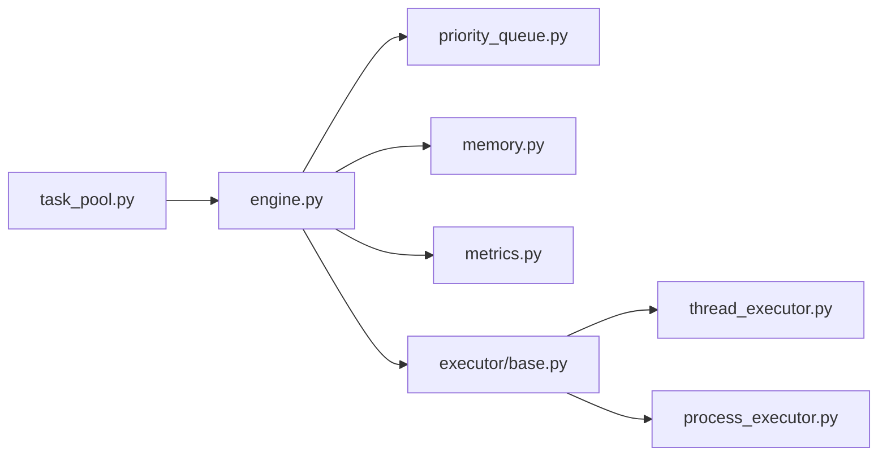

# 批处理示例

<cite>
**本文引用的文件**   
- [examples/07_batch.py](file://examples/07_batch.py)
- [src/neotask/api/task_pool.py](file://src/neotask/api/task_pool.py)
- [src/neotask/core/engine.py](file://src/neotask/core/engine.py)
- [src/neotask/executor/base.py](file://src/neotask/executor/base.py)
- [src/neotask/executor/thread_executor.py](file://src/neotask/executor/thread_executor.py)
- [src/neotask/executor/process_executor.py](file://src/neotask/executor/process_executor.py)
- [src/neotask/queue/priority_queue.py](file://src/neotask/queue/priority_queue.py)
- [src/neotask/storage/memory.py](file://src/neotask/storage/memory.py)
- [src/neotask/models/task.py](file://src/neotask/models/task.py)
- [src/neotask/common/exceptions.py](file://src/neotask/common/exceptions.py)
- [src/neotask/monitor/metrics.py](file://src/neotask/monitor/metrics.py)
</cite>

## 目录
1. [简介](#简介)
2. [项目结构](#项目结构)
3. [核心组件](#核心组件)
4. [架构总览](#架构总览)
5. [详细组件分析](#详细组件分析)
6. [依赖分析](#依赖分析)
7. [性能考虑](#性能考虑)
8. [故障排查指南](#故障排查指南)
9. [结论](#结论)
10. [附录](#附录)

## 简介
本文件围绕“批处理任务”的实现方法展开，结合仓库中的示例与核心实现，系统讲解以下能力：
- 任务分组：将大量任务按维度（如批次大小、优先级、标签）进行组织。
- 批量执行：通过线程或进程池并发执行，提升吞吐。
- 进度监控：提供指标采集与状态查询，便于可视化与告警。
- 错误处理：统一异常类型、失败重试与死信队列策略。
- 大数据量优化：内存控制、背压、分片与资源管理方案。

目标读者包括需要高效处理海量任务的工程师与运维人员。

## 项目结构
本项目采用分层与模块化设计，批处理相关的关键路径如下：
- 示例入口：examples/07_batch.py 演示如何创建任务、分组、提交并监控。
- API 层：task_pool.py 暴露任务池接口，封装提交、取消、查询等能力。
- 调度与执行：engine.py 负责生命周期与调度；executor/* 提供线程/进程执行器。
- 队列与存储：priority_queue.py 提供优先级队列；storage/* 提供持久化与内存实现。
- 模型与异常：models/task.py 定义任务模型；common/exceptions.py 定义统一异常。
- 监控：monitor/metrics.py 提供指标采集。

图表来源
- [examples/07_batch.py](file://examples/07_batch.py)
- [src/neotask/api/task_pool.py](file://src/neotask/api/task_pool.py)
- [src/neotask/core/engine.py](file://src/neotask/core/engine.py)
- [src/neotask/executor/base.py](file://src/neotask/executor/base.py)
- [src/neotask/executor/thread_executor.py](file://src/neotask/executor/thread_executor.py)
- [src/neotask/executor/process_executor.py](file://src/neotask/executor/process_executor.py)
- [src/neotask/queue/priority_queue.py](file://src/neotask/queue/priority_queue.py)
- [src/neotask/storage/memory.py](file://src/neotask/storage/memory.py)
- [src/neotask/models/task.py](file://src/neotask/models/task.py)
- [src/neotask/common/exceptions.py](file://src/neotask/common/exceptions.py)
- [src/neotask/monitor/metrics.py](file://src/neotask/monitor/metrics.py)

章节来源
- [examples/07_batch.py](file://examples/07_batch.py)
- [src/neotask/api/task_pool.py](file://src/neotask/api/task_pool.py)
- [src/neotask/core/engine.py](file://src/neotask/core/engine.py)

## 核心组件
- 任务池 API（task_pool.py）
  - 职责：对外暴露任务提交、批量提交、取消、查询与统计接口；内部协调引擎与执行器。
  - 关键点：支持按批次大小与并发度提交；对任务对象进行校验与元数据注入。
- 调度引擎（engine.py）
  - 职责：维护任务生命周期、调度策略、执行器选择、结果聚合与监控上报。
  - 关键点：根据配置选择线程或进程执行器；对接优先级队列与存储后端。
- 执行器基类与具体实现（executor/base.py, thread_executor.py, process_executor.py）
  - 职责：抽象执行接口，提供线程/进程两种并发模型。
  - 关键点：线程执行器适合 I/O 密集；进程执行器适合 CPU 密集且需隔离的场景。
- 优先级队列（queue/priority_queue.py）
  - 职责：按优先级出队，保障高优任务优先消费。
  - 关键点：支持动态调整优先级；与延迟队列配合可实现退避与重排。
- 存储后端（storage/memory.py）
  - 职责：任务状态、结果与中间态的持久化/缓存。
  - 关键点：内存实现用于快速验证；可替换为 Redis/SQLite 等。
- 任务模型与异常（models/task.py, common/exceptions.py）
  - 职责：定义任务字段、状态机与统一异常类型。
  - 关键点：异常分类有助于错误路由与重试策略。
- 监控指标（monitor/metrics.py）
  - 职责：采集吞吐、延迟、错误率、队列长度等指标。
  - 关键点：可与 Prometheus/Grafana 集成，支撑可视化与告警。

章节来源
- [src/neotask/api/task_pool.py](file://src/neotask/api/task_pool.py)
- [src/neotask/core/engine.py](file://src/neotask/core/engine.py)
- [src/neotask/executor/base.py](file://src/neotask/executor/base.py)
- [src/neotask/executor/thread_executor.py](file://src/neotask/executor/thread_executor.py)
- [src/neotask/executor/process_executor.py](file://src/neotask/executor/process_executor.py)
- [src/neotask/queue/priority_queue.py](file://src/neotask/queue/priority_queue.py)
- [src/neotask/storage/memory.py](file://src/neotask/storage/memory.py)
- [src/neotask/models/task.py](file://src/neotask/models/task.py)
- [src/neotask/common/exceptions.py](file://src/neotask/common/exceptions.py)
- [src/neotask/monitor/metrics.py](file://src/neotask/monitor/metrics.py)

## 架构总览
下图展示从示例到执行器的端到端调用链，以及关键的数据流与监控点。

图表来源
- [examples/07_batch.py](file://examples/07_batch.py)
- [src/neotask/api/task_pool.py](file://src/neotask/api/task_pool.py)
- [src/neotask/core/engine.py](file://src/neotask/core/engine.py)
- [src/neotask/queue/priority_queue.py](file://src/neotask/queue/priority_queue.py)
- [src/neotask/executor/thread_executor.py](file://src/neotask/executor/thread_executor.py)
- [src/neotask/executor/process_executor.py](file://src/neotask/executor/process_executor.py)
- [src/neotask/storage/memory.py](file://src/neotask/storage/memory.py)
- [src/neotask/monitor/metrics.py](file://src/neotask/monitor/metrics.py)

## 详细组件分析

### 任务池 API（任务分组与批量提交）
- 分组策略
  - 按批次大小切分：将 N 个任务划分为多个批次，每批提交时限制并发度，避免瞬时峰值。
  - 按优先级分组：不同业务域设置不同优先级，确保关键任务优先执行。
  - 按标签/租户分组：便于后续路由、限流与审计。
- 批量提交流程
  - 输入校验与元数据注入（如批次 ID、分组键）。
  - 构建任务对象并写入队列。
  - 启动/复用执行器，按需扩容。
- 进度与结果聚合
  - 基于批次 ID 聚合结果，计算成功/失败计数与耗时。
  - 触发回调或事件，供上层 UI 或告警使用。

图表来源
- [src/neotask/api/task_pool.py](file://src/neotask/api/task_pool.py)
- [src/neotask/queue/priority_queue.py](file://src/neotask/queue/priority_queue.py)
- [src/neotask/core/engine.py](file://src/neotask/core/engine.py)

章节来源
- [src/neotask/api/task_pool.py](file://src/neotask/api/task_pool.py)
- [src/neotask/queue/priority_queue.py](file://src/neotask/queue/priority_queue.py)
- [src/neotask/core/engine.py](file://src/neotask/core/engine.py)

### 执行器（线程/进程）与资源管理
- 线程执行器
  - 适用场景：I/O 密集型任务（网络请求、数据库读写）。
  - 资源管理：控制最大线程数、队列容量与超时；避免线程风暴。
- 进程执行器
  - 适用场景：CPU 密集型任务、需要强隔离的任务。
  - 资源管理：控制进程池大小、进程间通信开销与内存占用。
- 执行器选择
  - 根据任务属性（CPU/IO 标记）、系统负载与历史指标自动选择。
  - 支持热切换与弹性扩缩容。

图表来源
- [src/neotask/executor/base.py](file://src/neotask/executor/base.py)
- [src/neotask/executor/thread_executor.py](file://src/neotask/executor/thread_executor.py)
- [src/neotask/executor/process_executor.py](file://src/neotask/executor/process_executor.py)

章节来源
- [src/neotask/executor/base.py](file://src/neotask/executor/base.py)
- [src/neotask/executor/thread_executor.py](file://src/neotask/executor/thread_executor.py)
- [src/neotask/executor/process_executor.py](file://src/neotask/executor/process_executor.py)

### 优先级队列与延迟/重试
- 优先级队列
  - 支持按优先级出队，保证高优任务优先消费。
  - 与延迟队列组合可实现指数退避与任务重排。
- 重试与死信
  - 失败任务按策略重试，超过阈值进入死信队列以便人工干预。
  - 记录失败原因与上下文，便于定位问题。

图表来源
- [src/neotask/queue/priority_queue.py](file://src/neotask/queue/priority_queue.py)
- [src/neotask/common/exceptions.py](file://src/neotask/common/exceptions.py)

章节来源
- [src/neotask/queue/priority_queue.py](file://src/neotask/queue/priority_queue.py)
- [src/neotask/common/exceptions.py](file://src/neotask/common/exceptions.py)

### 存储与状态一致性
- 内存存储
  - 适用于单机与测试环境，具备低延迟特性。
  - 注意内存上限与清理策略，防止 OOM。
- 状态一致性
  - 任务状态变更采用幂等写入，避免重复更新导致不一致。
  - 结果与中间态分离，便于恢复与回放。

章节来源
- [src/neotask/storage/memory.py](file://src/neotask/storage/memory.py)
- [src/neotask/models/task.py](file://src/neotask/models/task.py)

### 监控与指标
- 指标项
  - 吞吐（任务/秒）、平均/分位延迟、错误率、队列长度、执行器利用率。
- 采集与上报
  - 在关键路径埋点，周期性汇总上报。
  - 支持与外部监控系统集成，形成可视化面板与告警规则。

章节来源
- [src/neotask/monitor/metrics.py](file://src/neotask/monitor/metrics.py)

## 依赖分析
- 模块耦合
  - 任务池 API 依赖调度引擎与执行器；调度引擎依赖队列、存储与监控。
  - 执行器与队列/存储解耦，通过接口交互，便于替换与扩展。
- 外部依赖
  - 存储后端可替换为 Redis/SQLite 等；监控可对接 Prometheus。
- 潜在风险
  - 队列积压导致内存增长；需设置容量上限与背压策略。
  - 执行器资源耗尽；需限制并发与超时。

图表来源
- [src/neotask/api/task_pool.py](file://src/neotask/api/task_pool.py)
- [src/neotask/core/engine.py](file://src/neotask/core/engine.py)
- [src/neotask/queue/priority_queue.py](file://src/neotask/queue/priority_queue.py)
- [src/neotask/storage/memory.py](file://src/neotask/storage/memory.py)
- [src/neotask/monitor/metrics.py](file://src/neotask/monitor/metrics.py)
- [src/neotask/executor/base.py](file://src/neotask/executor/base.py)
- [src/neotask/executor/thread_executor.py](file://src/neotask/executor/thread_executor.py)
- [src/neotask/executor/process_executor.py](file://src/neotask/executor/process_executor.py)

章节来源
- [src/neotask/api/task_pool.py](file://src/neotask/api/task_pool.py)
- [src/neotask/core/engine.py](file://src/neotask/core/engine.py)
- [src/neotask/executor/base.py](file://src/neotask/executor/base.py)

## 性能考虑
- 并发与吞吐
  - 合理设置线程/进程池大小，匹配 CPU 核数与 I/O 特性。
  - 使用优先级队列减少热点任务阻塞。
- 内存与背压
  - 限制队列容量，超限时拒绝或降级，避免 OOM。
  - 采用分页/分片方式分批拉取与处理。
- 延迟与抖动
  - 预热执行器与连接池，降低冷启动抖动。
  - 对长尾任务设置超时与熔断，保护整体稳定性。
- 资源隔离
  - 多租户/多业务域使用独立队列与执行器，避免相互影响。
- 观测与调优
  - 基于指标定位瓶颈（CPU、I/O、锁竞争），持续调优参数。

[本节为通用指导，不直接分析具体文件]

## 故障排查指南
- 常见问题
  - 任务堆积：检查队列长度与消费者速率，必要时扩容执行器或优化任务逻辑。
  - 频繁失败：查看异常类型与堆栈，确认重试策略与死信队列。
  - 资源耗尽：监控执行器利用率与内存占用，调整并发与超时。
- 定位步骤
  - 查看批次级统计与错误分布，缩小范围。
  - 检查优先级与延迟设置，确认是否存在饥饿。
  - 核对存储一致性与幂等性，避免重复处理。
- 恢复策略
  - 启用死信队列与补偿任务，人工介入后重放。
  - 临时降级：关闭非关键任务，保障核心链路。

章节来源
- [src/neotask/common/exceptions.py](file://src/neotask/common/exceptions.py)
- [src/neotask/monitor/metrics.py](file://src/neotask/monitor/metrics.py)

## 结论
通过任务分组、批量执行、进度监控与完善的错误处理机制，本仓库提供了面向大数据量场景的高效批处理能力。结合优先级队列、执行器选型与资源管理策略，可在保证稳定性的同时最大化吞吐。建议在生产环境中结合外部存储与监控系统，持续观测与调优，以获得最佳效果。

[本节为总结性内容，不直接分析具体文件]

## 附录
- 快速上手
  - 参考示例文件，了解如何创建任务、设置分组与并发度、提交并监控进度。
- 扩展建议
  - 自定义执行器：实现统一接口以适配特定运行时。
  - 自定义存储：替换为分布式存储以实现水平扩展。
  - 增强监控：接入更丰富的指标与日志追踪。

章节来源
- [examples/07_batch.py](file://examples/07_batch.py)