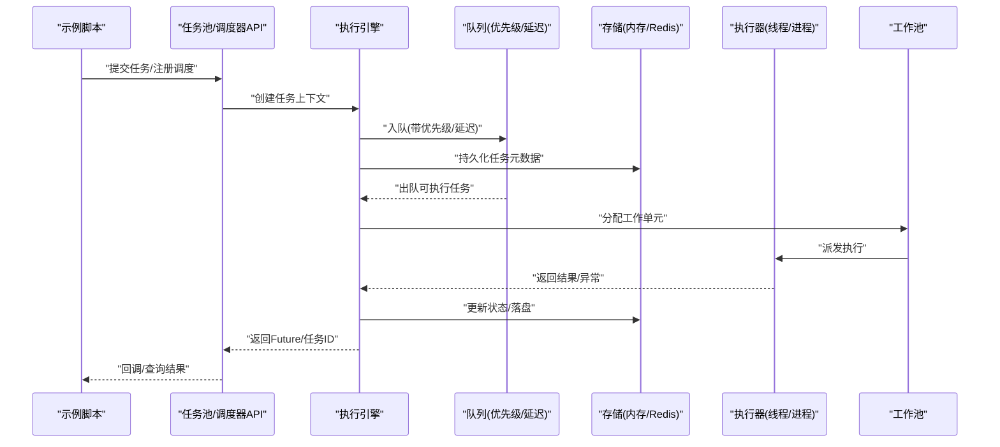
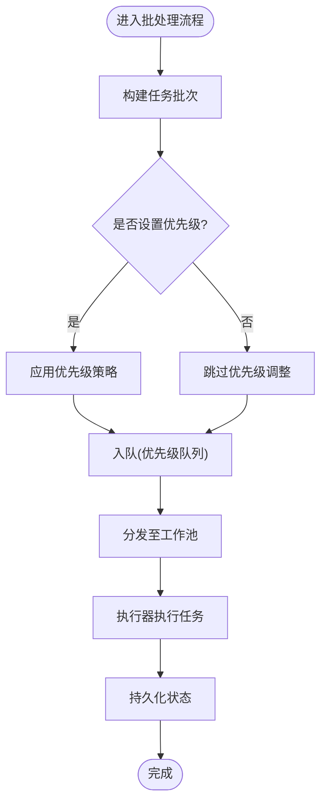
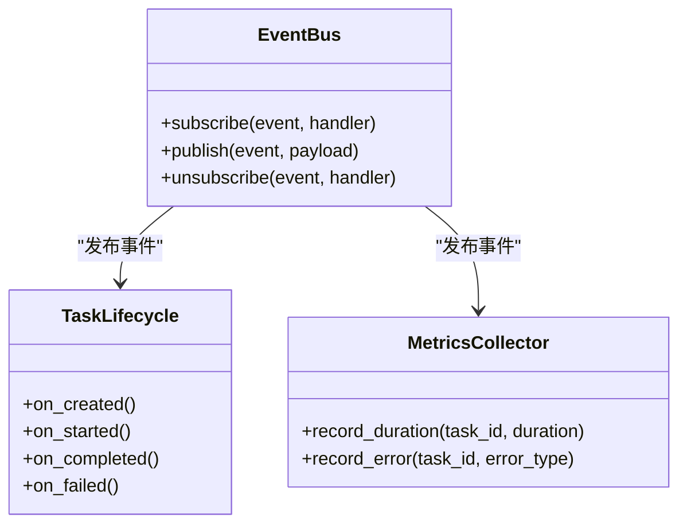
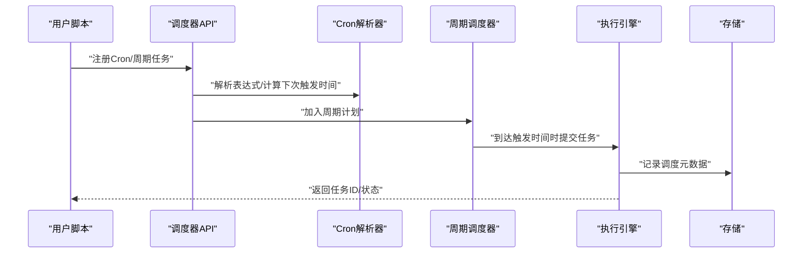
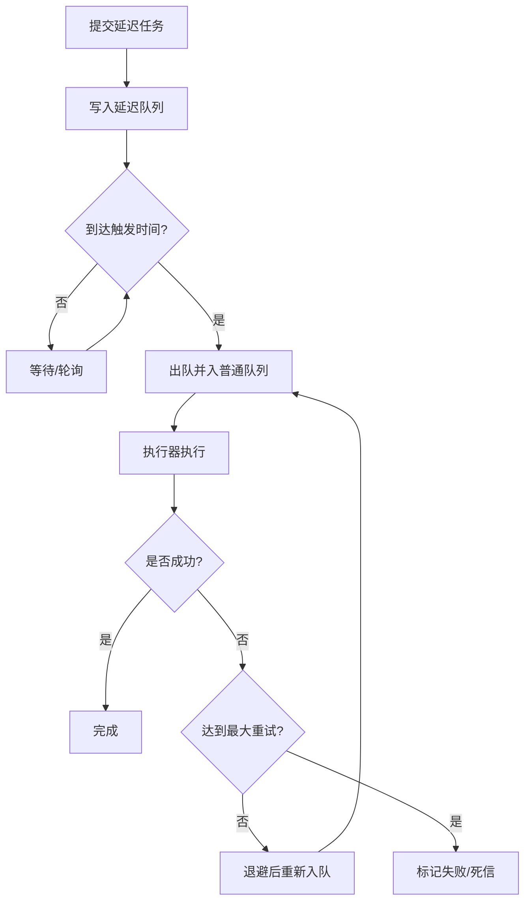
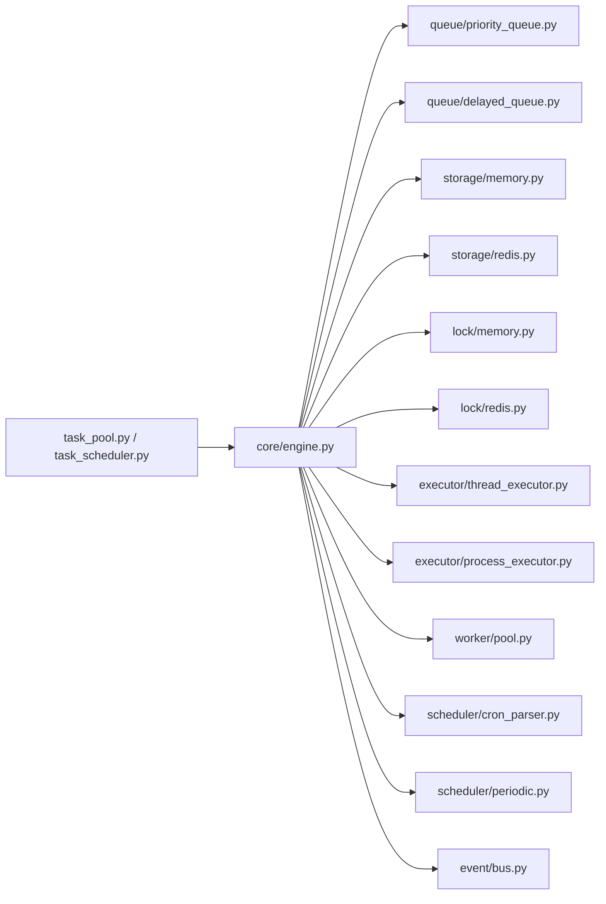

# 示例与教程

<cite>
**本文引用的文件**   
- [examples/00_quick_start.py](file://examples/00_quick_start.py)
- [examples/01_simple.py](file://examples/01_simple.py)
- [examples/02_context_manager.py](file://examples/02_context_manager.py)
- [examples/03_priority.py](file://examples/03_priority.py)
- [examples/04_events.py](file://examples/04_events.py)
- [examples/05_cron_tasks.py](file://examples/05_cron_tasks.py)
- [examples/06_delayed_tasks.py](file://examples/06_delayed_tasks.py)
- [examples/07_batch.py](file://examples/07_batch.py)
- [examples/08_periodic.py](file://examples/08_periodic.py)
- [examples/09_retry_and_cancel.py](file://examples/09_retry_and_cancel.py)
- [examples/10_task_query.py](file://examples/10_task查询.py)
- [examples/99_all_features.py](file://examples/99_all_features.py)
- [src/neotask/api/task_pool.py](file://src/neotask/api/task_pool.py)
- [src/neotask/api/task_scheduler.py](file://src/neotask/api/task_scheduler.py)
- [src/neotask/core/engine.py](file://src/neotask/core/engine.py)
- [src/neotask/models/schedule.py](file://src/neotask/models/schedule.py)
- [src/neotask/models/task.py](file://src/neotask/models/task.py)
- [src/neotask/queue/priority_queue.py](file://src/neotask/queue/priority_queue.py)
- [src/neotask/queue/delayed_queue.py](file://src/neotask/queue/delayed_queue.py)
- [src/neotask/scheduler/cron_parser.py](file://src/neotask/scheduler/cron_parser.py)
- [src/neotask/scheduler/periodic.py](file://src/neotask/scheduler/periodic.py)
- [src/neotask/storage/memory.py](file://src/neotask/storage/memory.py)
- [src/neotask/storage/redis.py](file://src/neotask/storage/redis.py)
- [src/neotask/event/bus.py](file://src/neotask/event/bus.py)
- [src/neotask/executor/thread_executor.py](file://src/neotask/executor/thread_executor.py)
- [src/neotask/executor/process_executor.py](file://src/neotask/executor/process_executor.py)
- [src/neotask/lock/memory.py](file://src/neotask/lock/memory.py)
- [src/neotask/lock/redis.py](file://src/neotask/lock/redis.py)
- [src/neotask/worker/pool.py](file://src/neotask/worker/pool.py)
- [src/neotask/config/settings.py](file://src/neotask/config/settings.py)
- [README_zh.md](file://README_zh.md)
</cite>

## 目录
1. [简介](#简介)
2. [项目结构](#项目结构)
3. [核心组件](#核心组件)
4. [架构总览](#架构总览)
5. [详细组件分析](#详细组件分析)
6. [依赖关系分析](#依赖关系分析)
7. [性能考虑](#性能考虑)
8. [故障排查指南](#故障排查指南)
9. [结论](#结论)
10. [附录：示例索引与运行方式](#附录示例索引与运行方式)

## 简介
本教程面向希望快速上手并深入掌握任务调度管理器的开发者，提供从入门到进阶的完整示例与学习路径。内容覆盖基本用法、高级特性、最佳实践以及实际业务场景的解决方案与迁移指南。所有示例均强调可运行性与可维护性，并通过“代码片段路径”的方式引导读者定位源码实现，避免在文档中粘贴冗长代码。

## 项目结构
仓库采用按功能域划分的模块化组织方式，示例位于 examples 目录，核心能力位于 src/neotask 下，测试位于 tests 目录。示例从简单到复杂逐步引入优先级、事件、定时任务、延迟任务、批处理、周期任务、重试与取消、任务查询等能力。

```mermaid
graph TB
subgraph "示例"
ex00["00_quick_start.py"]
ex01["01_simple.py"]
ex02["02_context_manager.py"]
ex03["03_priority.py"]
ex04["04_events.py"]
ex05["05_cron_tasks.py"]
ex06["06_delayed_tasks.py"]
ex07["07_batch.py"]
ex08["08_periodic.py"]
ex09["09_retry_and_cancel.py"]
ex10["10_task_query.py"]
ex99["99_all_features.py"]
end
subgraph "核心API"
api_pool["api/task_pool.py"]
api_sched["api/task_scheduler.py"]
end
subgraph "运行时"
engine["core/engine.py"]
exec_thread["executor/thread_executor.py"]
exec_proc["executor/process_executor.py"]
worker_pool["worker/pool.py"]
end
subgraph "调度与队列"
cron["scheduler/cron_parser.py"]
periodic["scheduler/periodic.py"]
pq["queue/priority_queue.py"]
dq["queue/delayed_queue.py"]
end
subgraph "存储与锁"
store_mem["storage/memory.py"]
store_redis["storage/redis.py"]
lock_mem["lock/memory.py"]
lock_redis["lock/redis.py"]
end
ex00 --> api_pool
ex01 --> api_pool
ex02 --> api_pool
ex03 --> api_pool
ex04 --> api_pool
ex05 --> api_sched
ex06 --> api_sched
ex07 --> api_pool
ex08 --> api_sched
ex09 --> api_pool
ex10 --> api_pool
ex99 --> api_pool
ex99 --> api_sched
api_pool --> engine
api_sched --> engine
engine --> exec_thread
engine --> exec_proc
engine --> worker_pool
engine --> pq
engine --> dq
engine --> cron
engine --> periodic
engine --> store_mem
engine --> store_redis
engine --> lock_mem
engine --> lock_redis
```

图表来源
- [examples/00_quick_start.py](file://examples/00_quick_start.py)
- [examples/01_simple.py](file://examples/01_simple.py)
- [examples/02_context_manager.py](file://examples/02_context_manager.py)
- [examples/03_priority.py](file://examples/03_priority.py)
- [examples/04_events.py](file://examples/04_events.py)
- [examples/05_cron_tasks.py](file://examples/05_cron_tasks.py)
- [examples/06_delayed_tasks.py](file://examples/06_delayed_tasks.py)
- [examples/07_batch.py](file://examples/07_batch.py)
- [examples/08_periodic.py](file://examples/08_periodic.py)
- [examples/09_retry_and_cancel.py](file://examples/09_retry_and_cancel.py)
- [examples/10_task_query.py](file://examples/10_task查询.py)
- [examples/99_all_features.py](file://examples/99_all_features.py)
- [src/neotask/api/task_pool.py](file://src/neotask/api/task_pool.py)
- [src/neotask/api/task_scheduler.py](file://src/neotask/api/task_scheduler.py)
- [src/neotask/core/engine.py](file://src/neotask/core/engine.py)
- [src/neotask/queue/priority_queue.py](file://src/neotask/queue/priority_queue.py)
- [src/neotask/queue/delayed_queue.py](file://src/neotask/queue/delayed_queue.py)
- [src/neotask/scheduler/cron_parser.py](file://src/neotask/scheduler/cron_parser.py)
- [src/neotask/scheduler/periodic.py](file://src/neotask/scheduler/periodic.py)
- [src/neotask/storage/memory.py](file://src/neotask/storage/memory.py)
- [src/neotask/storage/redis.py](file://src/neotask/storage/redis.py)
- [src/neotask/executor/thread_executor.py](file://src/neotask/executor/thread_executor.py)
- [src/neotask/executor/process_executor.py](file://src/neotask/executor/process_executor.py)
- [src/neotask/worker/pool.py](file://src/neotask/worker/pool.py)

章节来源
- [README_zh.md](file://README_zh.md)

## 核心组件
- 任务池 API：提供任务的提交、批量提交、状态查询、取消、重试等常用操作入口。
- 调度器 API：提供基于 Cron 表达式和周期策略的任务注册与生命周期管理。
- 执行引擎：协调执行器（线程/进程）、工作池、队列与存储，负责任务的生命周期流转。
- 队列系统：支持优先级队列与延迟队列，满足高优优先与延时触发需求。
- 存储层：内存与 Redis 两种后端，用于持久化任务与调度元数据。
- 锁服务：内存与 Redis 分布式锁，保障多实例安全。
- 事件总线：解耦任务生命周期事件，便于监控与扩展。

章节来源
- [src/neotask/api/task_pool.py](file://src/neotask/api/task_pool.py)
- [src/neotask/api/task_scheduler.py](file://src/neotask/api/task_scheduler.py)
- [src/neotask/core/engine.py](file://src/neotask/core/engine.py)
- [src/neotask/queue/priority_queue.py](file://src/neotask/queue/priority_queue.py)
- [src/neotask/queue/delayed_queue.py](file://src/neotask/queue/delayed_queue.py)
- [src/neotask/storage/memory.py](file://src/neotask/storage/memory.py)
- [src/neotask/storage/redis.py](file://src/neotask/storage/redis.py)
- [src/neotask/lock/memory.py](file://src/neotask/lock/memory.py)
- [src/neotask/lock/redis.py](file://src/neotask/lock/redis.py)
- [src/neotask/event/bus.py](file://src/neotask/event/bus.py)

## 架构总览
下图展示了示例与核心模块之间的调用关系与数据流向。示例通过 API 层发起任务或调度请求，引擎协调执行器与工作池，结合队列与存储完成调度与执行。

图表来源
- [src/neotask/api/task_pool.py](file://src/neotask/api/task_pool.py)
- [src/neotask/api/task_scheduler.py](file://src/neotask/api/task_scheduler.py)
- [src/neotask/core/engine.py](file://src/neotask/core/engine.py)
- [src/neotask/queue/priority_queue.py](file://src/neotask/queue/priority_queue.py)
- [src/neotask/queue/delayed_queue.py](file://src/neotask/queue/delayed_queue.py)
- [src/neotask/storage/memory.py](file://src/neotask/storage/memory.py)
- [src/neotask/storage/redis.py](file://src/neotask/storage/redis.py)
- [src/neotask/executor/thread_executor.py](file://src/neotask/executor/thread_executor.py)
- [src/neotask/executor/process_executor.py](file://src/neotask/executor/process_executor.py)
- [src/neotask/worker/pool.py](file://src/neotask/worker/pool.py)

## 详细组件分析

### 基础用法示例
- 快速开始：展示最小可用配置与任务提交流程，适合首次体验。
- 简单任务：演示同步/异步函数作为任务的处理方式。
- 上下文管理器：使用 with 语句自动管理资源与生命周期。

建议阅读顺序：00 → 01 → 02。每个示例都包含完整的注释说明与运行指导，确保可直接运行。

章节来源
- [examples/00_quick_start.py](file://examples/00_quick_start.py)
- [examples/01_simple.py](file://examples/01_simple.py)
- [examples/02_context_manager.py](file://examples/02_context_manager.py)

### 优先级与并发控制
- 优先级任务：通过优先级队列对任务进行排序，保证关键任务优先执行。
- 批处理：将多个任务打包提交，减少调度开销，提升吞吐。
- 工作池与执行器：线程/进程执行器配合工作池，合理设置并发度与资源上限。

图表来源
- [src/neotask/queue/priority_queue.py](file://src/neotask/queue/priority_queue.py)
- [src/neotask/worker/pool.py](file://src/neotask/worker/pool.py)
- [src/neotask/executor/thread_executor.py](file://src/neotask/executor/thread_executor.py)
- [src/neotask/executor/process_executor.py](file://src/neotask/executor/process_executor.py)
- [examples/03_priority.py](file://examples/03_priority.py)
- [examples/07_batch.py](file://examples/07_batch.py)

章节来源
- [examples/03_priority.py](file://examples/03_priority.py)
- [examples/07_batch.py](file://examples/07_batch.py)
- [src/neotask/queue/priority_queue.py](file://src/neotask/queue/priority_queue.py)
- [src/neotask/worker/pool.py](file://src/neotask/worker/pool.py)
- [src/neotask/executor/thread_executor.py](file://src/neotask/executor/thread_executor.py)
- [src/neotask/executor/process_executor.py](file://src/neotask/executor/process_executor.py)

### 事件与监控
- 事件总线：订阅任务生命周期事件（如创建、执行、完成、失败），便于接入日志、告警与指标采集。
- 中间件与处理器：通过事件中间件统一处理横切关注点（如幂等校验、审计）。

图表来源
- [src/neotask/event/bus.py](file://src/neotask/event/bus.py)
- [examples/04_events.py](file://examples/04_events.py)

章节来源
- [examples/04_events.py](file://examples/04_events.py)
- [src/neotask/event/bus.py](file://src/neotask/event/bus.py)

### 定时与周期任务
- Cron 任务：基于 Cron 表达式定义复杂时间规则，适用于报表生成、数据清洗等周期性作业。
- 周期任务：固定间隔或相对时间的周期执行，适合心跳检测、缓存预热等场景。

图表来源
- [src/neotask/scheduler/cron_parser.py](file://src/neotask/scheduler/cron_parser.py)
- [src/neotask/scheduler/periodic.py](file://src/neotask/scheduler/periodic.py)
- [src/neotask/api/task_scheduler.py](file://src/neotask/api/task_scheduler.py)
- [examples/05_cron_tasks.py](file://examples/05_cron_tasks.py)
- [examples/08_periodic.py](file://examples/08_periodic.py)

章节来源
- [examples/05_cron_tasks.py](file://examples/05_cron_tasks.py)
- [examples/08_periodic.py](file://examples/08_periodic.py)
- [src/neotask/scheduler/cron_parser.py](file://src/neotask/scheduler/cron_parser.py)
- [src/neotask/scheduler/periodic.py](file://src/neotask/scheduler/periodic.py)
- [src/neotask/api/task_scheduler.py](file://src/neotask/api/task_scheduler.py)

### 延迟任务与重试取消
- 延迟任务：将任务放入延迟队列，在指定时间点之后才出队执行，适合超时补偿、退避重试等。
- 重试与取消：为任务配置最大重试次数与退避策略；支持在运行期取消任务。

图表来源
- [src/neotask/queue/delayed_queue.py](file://src/neotask/queue/delayed_queue.py)
- [examples/06_delayed_tasks.py](file://examples/06_delayed_tasks.py)
- [examples/09_retry_and_cancel.py](file://examples/09_retry_and_cancel.py)

章节来源
- [examples/06_delayed_tasks.py](file://examples/06_delayed_tasks.py)
- [examples/09_retry_and_cancel.py](file://examples/09_retry_and_cancel.py)
- [src/neotask/queue/delayed_queue.py](file://src/neotask/queue/delayed_queue.py)

### 任务查询与可视化
- 任务查询：根据任务 ID、状态、标签等条件检索任务信息，便于运维与排障。
- Web UI：内置轻量级界面，查看任务列表、状态与执行历史。

章节来源
- [examples/10_task_query.py](file://examples/10_task查询.py)
- [src/neotask/web/server.py](file://src/neotask/web/server.py)

### 全功能示例
- 综合演示：在一个脚本中串联上述所有能力，帮助理解整体协作关系与配置要点。

章节来源
- [examples/99_all_features.py](file://examples/99_all_features.py)

## 依赖关系分析
- 模块内聚与耦合：API 层仅暴露高层接口，内部通过引擎协调执行器、队列与存储，降低外部耦合。
- 外部依赖：Redis 作为可选后端，用于分布式锁与持久化；事件总线与监控组件可插拔。
- 循环依赖检查：各模块职责清晰，未见直接循环导入迹象。

图表来源
- [src/neotask/api/task_pool.py](file://src/neotask/api/task_pool.py)
- [src/neotask/api/task_scheduler.py](file://src/neotask/api/task_scheduler.py)
- [src/neotask/core/engine.py](file://src/neotask/core/engine.py)
- [src/neotask/queue/priority_queue.py](file://src/neotask/queue/priority_queue.py)
- [src/neotask/queue/delayed_queue.py](file://src/neotask/queue/delayed_queue.py)
- [src/neotask/storage/memory.py](file://src/neotask/storage/memory.py)
- [src/neotask/storage/redis.py](file://src/neotask/storage/redis.py)
- [src/neotask/lock/memory.py](file://src/neotask/lock/memory.py)
- [src/neotask/lock/redis.py](file://src/neotask/lock/redis.py)
- [src/neotask/executor/thread_executor.py](file://src/neotask/executor/thread_executor.py)
- [src/neotask/executor/process_executor.py](file://src/neotask/executor/process_executor.py)
- [src/neotask/worker/pool.py](file://src/neotask/worker/pool.py)
- [src/neotask/scheduler/cron_parser.py](file://src/neotask/scheduler/cron_parser.py)
- [src/neotask/scheduler/periodic.py](file://src/neotask/scheduler/periodic.py)
- [src/neotask/event/bus.py](file://src/neotask/event/bus.py)

章节来源
- [src/neotask/api/task_pool.py](file://src/neotask/api/task_pool.py)
- [src/neotask/api/task_scheduler.py](file://src/neotask/api/task_scheduler.py)
- [src/neotask/core/engine.py](file://src/neotask/core/engine.py)

## 性能考虑
- 并发度调优：根据 CPU/IO 类型选择线程或进程执行器，并结合工作池大小限制并发。
- 队列选择：高吞吐场景优先使用内存队列；跨实例共享需启用 Redis 队列与锁。
- 存储优化：批量写入与分页查询可降低存储压力；热点任务可结合缓存策略。
- 事件与监控：事件处理应轻量，避免阻塞主流程；指标采集建议异步上报。

[本节为通用指导，不直接分析具体文件]

## 故障排查指南
- 常见问题
  - 任务未执行：检查队列是否堆积、执行器是否就绪、存储是否可达。
  - 重复执行：确认分布式锁是否正确配置且生效。
  - 超时与失败：查看重试策略与退避配置，核对任务幂等性。
- 定位手段
  - 使用任务查询示例检索任务状态与错误信息。
  - 开启事件订阅，捕获失败事件并输出堆栈。
  - 切换存储后端（内存/Redis）验证是否为持久化问题。

章节来源
- [examples/10_task_query.py](file://examples/10_task查询.py)
- [src/neotask/event/bus.py](file://src/neotask/event/bus.py)
- [src/neotask/storage/memory.py](file://src/neotask/storage/memory.py)
- [src/neotask/storage/redis.py](file://src/neotask/storage/redis.py)
- [src/neotask/lock/memory.py](file://src/neotask/lock/memory.py)
- [src/neotask/lock/redis.py](file://src/neotask/lock/redis.py)

## 结论
通过由浅入深的示例与教程，读者可以快速掌握任务调度管理器的基本用法与高级特性，并在生产环境中选择合适的执行器、队列与存储组合。结合事件与监控能力，可实现可观测、可扩展、可运维的任务调度体系。

[本节为总结性内容，不直接分析具体文件]

## 附录：示例索引与运行方式
- 示例清单
  - 快速开始：[examples/00_quick_start.py](file://examples/00_quick_start.py)
  - 简单任务：[examples/01_simple.py](file://examples/01_simple.py)
  - 上下文管理器：[examples/02_context_manager.py](file://examples/02_context_manager.py)
  - 优先级任务：[examples/03_priority.py](file://examples/03_priority.py)
  - 事件订阅：[examples/04_events.py](file://examples/04_events.py)
  - Cron 任务：[examples/05_cron_tasks.py](file://examples/05_cron_tasks.py)
  - 延迟任务：[examples/06_delayed_tasks.py](file://examples/06_delayed_tasks.py)
  - 批处理：[examples/07_batch.py](file://examples/07_batch.py)
  - 周期任务：[examples/08_periodic.py](file://examples/08_periodic.py)
  - 重试与取消：[examples/09_retry_and_cancel.py](file://examples/09_retry_and_cancel.py)
  - 任务查询：[examples/10_task_query.py](file://examples/10_task查询.py)
  - 全功能演示：[examples/99_all_features.py](file://examples/99_all_features.py)
- 运行方式
  - 确保 Python 环境已安装依赖。
  - 在仓库根目录执行对应示例脚本即可运行。
  - 如需使用 Redis 后端，请先启动 Redis 并正确配置连接参数。

章节来源
- [examples/00_quick_start.py](file://examples/00_quick_start.py)
- [examples/01_simple.py](file://examples/01_simple.py)
- [examples/02_context_manager.py](file://examples/02_context_manager.py)
- [examples/03_priority.py](file://examples/03_priority.py)
- [examples/04_events.py](file://examples/04_events.py)
- [examples/05_cron_tasks.py](file://examples/05_cron_tasks.py)
- [examples/06_delayed_tasks.py](file://examples/06_delayed_tasks.py)
- [examples/07_batch.py](file://examples/07_batch.py)
- [examples/08_periodic.py](file://examples/08_periodic.py)
- [examples/09_retry_and_cancel.py](file://examples/09_retry_and_cancel.py)
- [examples/10_task_query.py](file://examples/10_task查询.py)
- [examples/99_all_features.py](file://examples/99_all_features.py)