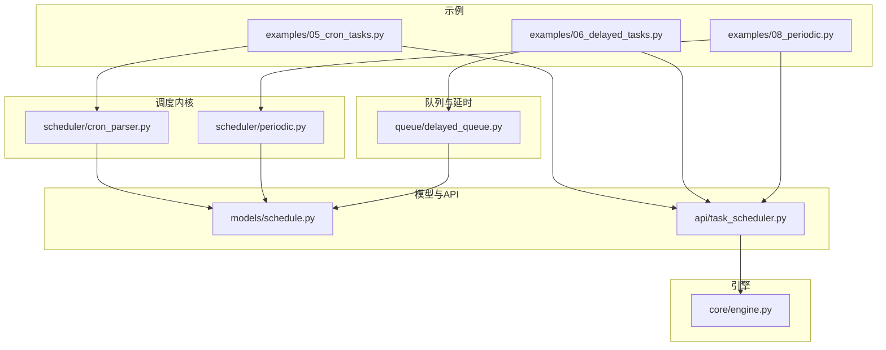
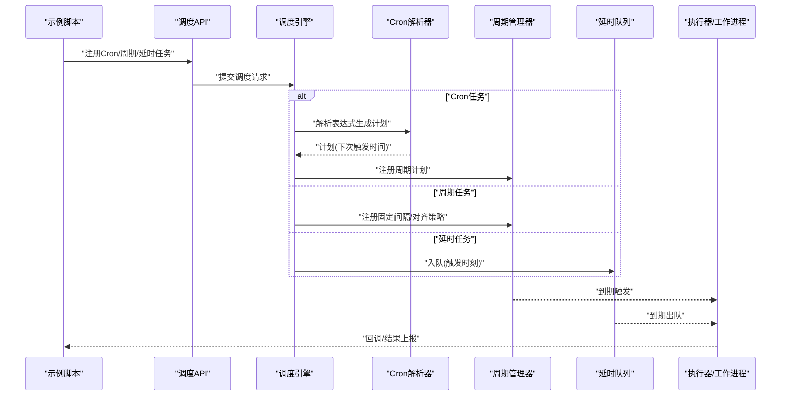
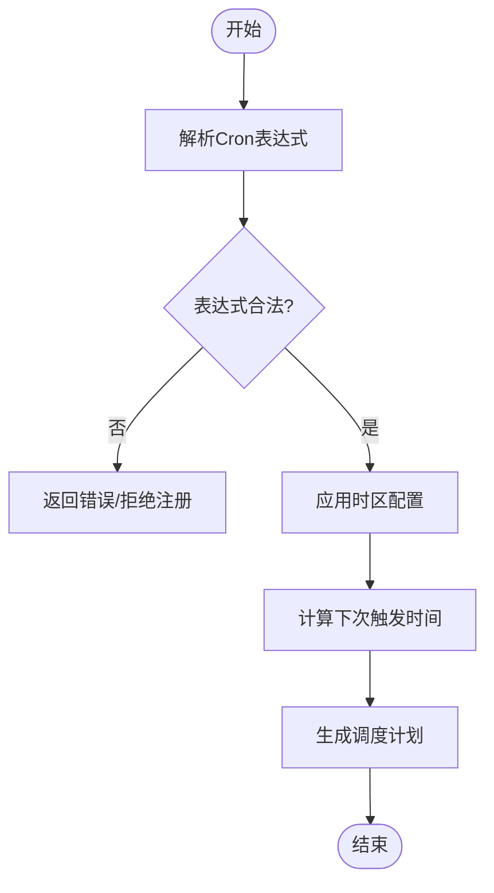
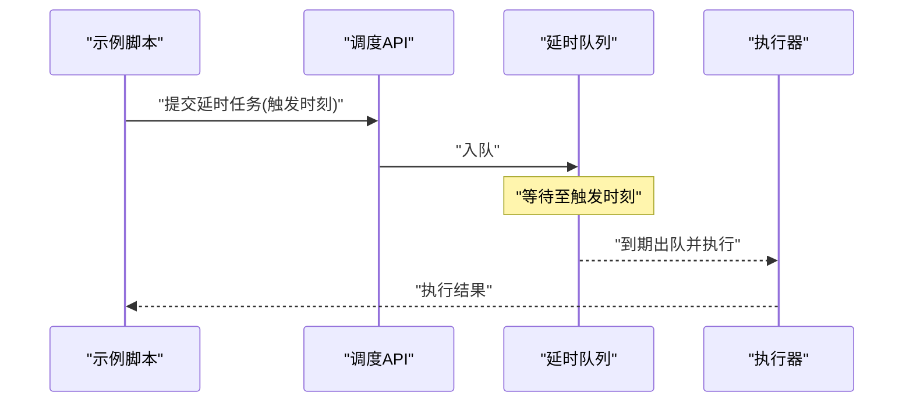
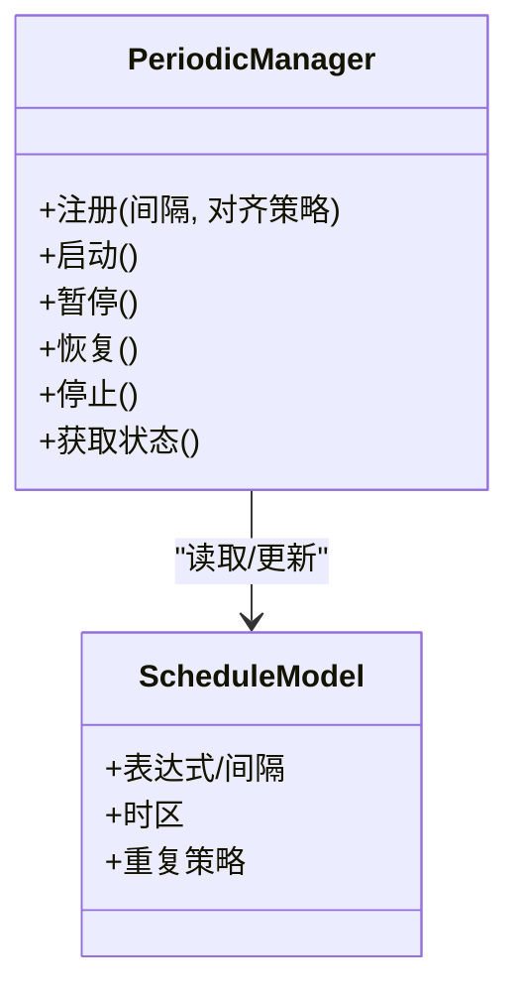
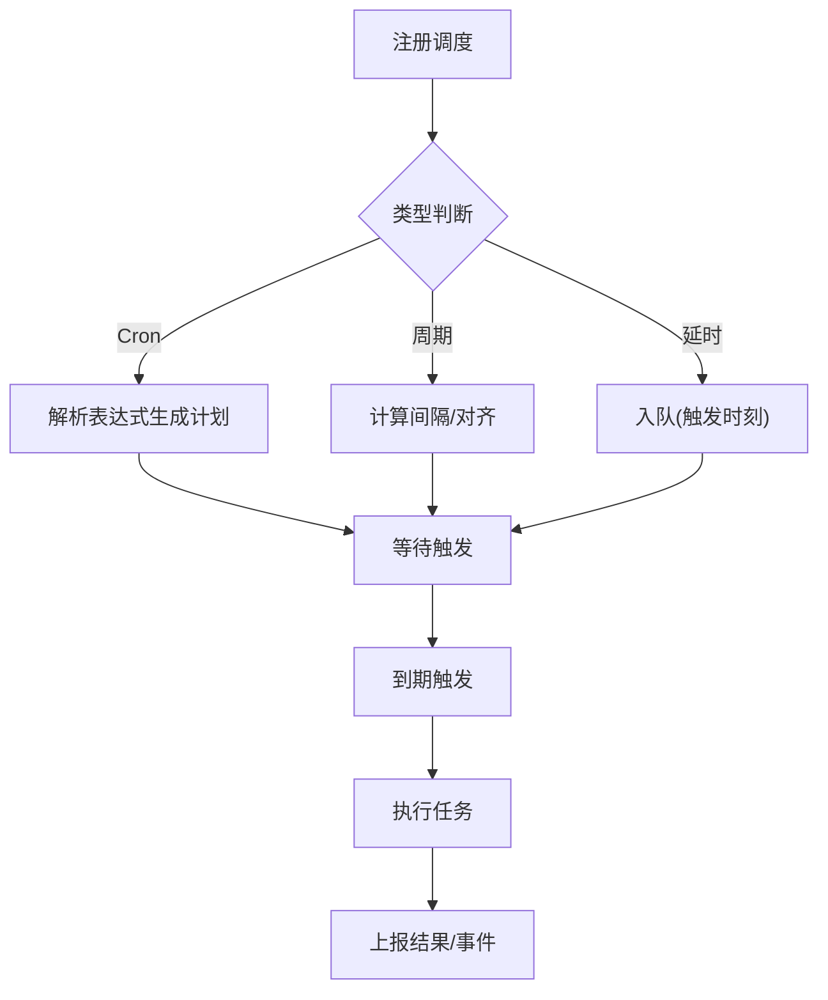
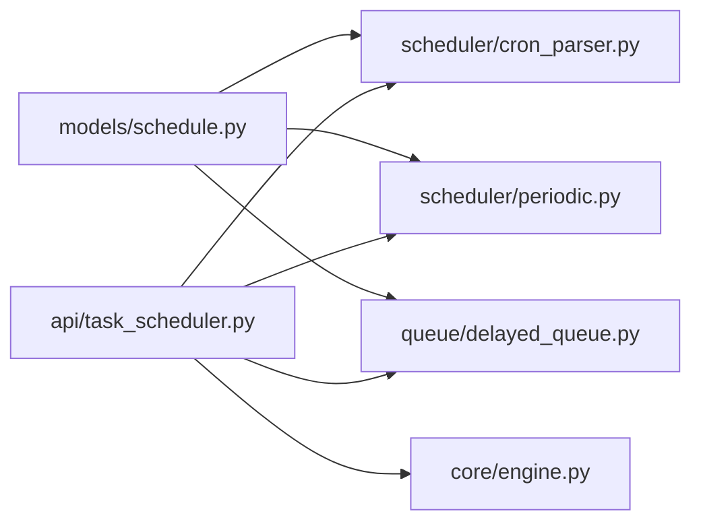

# 调度示例

<cite>
**本文引用的文件**   
- [examples/05_cron_tasks.py](file://examples/05_cron_tasks.py)
- [examples/06_delayed_tasks.py](file://examples/06_delayed_tasks.py)
- [examples/08_periodic.py](file://examples/08_periodic.py)
- [src/neotask/scheduler/cron_parser.py](file://src/neotask/scheduler/cron_parser.py)
- [src/neotask/scheduler/periodic.py](file://src/neotask/scheduler/periodic.py)
- [src/neotask/queue/delayed_queue.py](file://src/neotask/queue/delayed_queue.py)
- [src/neotask/models/schedule.py](file://src/neotask/models/schedule.py)
- [src/neotask/core/engine.py](file://src/neotask/core/engine.py)
- [src/neotask/api/task_scheduler.py](file://src/neotask/api/task_scheduler.py)
- [tests/unit/test_cron_parser.py](file://tests/unit/test_cron_parser.py)
- [tests/unit/test_periodic_manager.py](file://tests/unit/test_periodic_manager.py)
- [tests/unit/test_delayed_queue.py](file://tests/unit/test_delayed_queue.py)
</cite>

## 目录
1. [简介](#简介)
2. [项目结构](#项目结构)
3. [核心组件](#核心组件)
4. [架构总览](#架构总览)
5. [详细组件分析](#详细组件分析)
6. [依赖关系分析](#依赖关系分析)
7. [性能考虑](#性能考虑)
8. [故障排查指南](#故障排查指南)
9. [结论](#结论)
10. [附录](#附录)

## 简介
本文件聚焦于任务调度系统的三种典型模式：Cron 定时任务、延迟任务与周期性任务。内容涵盖表达式语法、时间配置与时区处理、调度策略选择，并结合实际业务场景给出解决方案与性能优化建议。文档以仓库中的示例与核心实现为依据，帮助读者快速上手并深入理解调度机制。

## 项目结构
围绕调度相关能力，代码主要分布在以下位置：
- 示例入口：examples 下的 cron、delayed、periodic 示例脚本
- 调度内核：scheduler 模块（cron 解析、周期管理）
- 队列与延时：queue 模块（延时队列）
- 模型与 API：models.schedule、api.task_scheduler
- 引擎与生命周期：core.engine
- 单元测试：tests/unit 下对应模块的测试

图表来源
- [examples/05_cron_tasks.py](file://examples/05_cron_tasks.py)
- [examples/06_delayed_tasks.py](file://examples/06_delayed_tasks.py)
- [examples/08_periodic.py](file://examples/08_periodic.py)
- [src/neotask/scheduler/cron_parser.py](file://src/neotask/scheduler/cron_parser.py)
- [src/neotask/scheduler/periodic.py](file://src/neotask/scheduler/periodic.py)
- [src/neotask/queue/delayed_queue.py](file://src/neotask/queue/delayed_queue.py)
- [src/neotask/models/schedule.py](file://src/neotask/models/schedule.py)
- [src/neotask/api/task_scheduler.py](file://src/neotask/api/task_scheduler.py)
- [src/neotask/core/engine.py](file://src/neotask/core/engine.py)

章节来源
- [examples/05_cron_tasks.py](file://examples/05_cron_tasks.py)
- [examples/06_delayed_tasks.py](file://examples/06_delayed_tasks.py)
- [examples/08_periodic.py](file://examples/08_periodic.py)
- [src/neotask/scheduler/cron_parser.py](file://src/neotask/scheduler/cron_parser.py)
- [src/neotask/scheduler/periodic.py](file://src/neotask/scheduler/periodic.py)
- [src/neotask/queue/delayed_queue.py](file://src/neotask/queue/delayed_queue.py)
- [src/neotask/models/schedule.py](file://src/neotask/models/schedule.py)
- [src/neotask/api/task_scheduler.py](file://src/neotask/api/task_scheduler.py)
- [src/neotask/core/engine.py](file://src/neotask/core/engine.py)

## 核心组件
- Cron 解析器：负责将 Cron 表达式解析为可执行的调度计划，支持常见字段与范围、步长、通配符等语法。
- 周期管理器：维护固定间隔或基于时间的周期任务，提供启动、停止与状态查询能力。
- 延时队列：基于时间轮或堆结构实现“在指定未来时刻触发”的任务投递与出队。
- 调度模型：统一描述任务的调度元数据（如表达式、时区、重复策略等）。
- 调度 API：对外暴露注册、更新、删除与查询调度的接口。
- 调度引擎：协调解析器、周期管理器与延时队列，驱动任务进入执行管线。

章节来源
- [src/neotask/scheduler/cron_parser.py](file://src/neotask/scheduler/cron_parser.py)
- [src/neotask/scheduler/periodic.py](file://src/neotask/scheduler/periodic.py)
- [src/neotask/queue/delayed_queue.py](file://src/neotask/queue/delayed_queue.py)
- [src/neotask/models/schedule.py](file://src/neotask/models/schedule.py)
- [src/neotask/api/task_scheduler.py](file://src/neotask/api/task_scheduler.py)
- [src/neotask/core/engine.py](file://src/neotask/core/engine.py)

## 架构总览
下图展示了从示例到调度内核再到执行引擎的整体调用链。

图表来源
- [examples/05_cron_tasks.py](file://examples/05_cron_tasks.py)
- [examples/06_delayed_tasks.py](file://examples/06_delayed_tasks.py)
- [examples/08_periodic.py](file://examples/08_periodic.py)
- [src/neotask/api/task_scheduler.py](file://src/neotask/api/task_scheduler.py)
- [src/neotask/core/engine.py](file://src/neotask/core/engine.py)
- [src/neotask/scheduler/cron_parser.py](file://src/neotask/scheduler/cron_parser.py)
- [src/neotask/scheduler/periodic.py](file://src/neotask/scheduler/periodic.py)
- [src/neotask/queue/delayed_queue.py](file://src/neotask/queue/delayed_queue.py)

## 详细组件分析

### Cron 定时任务
- 表达式语法
  - 标准五字段：分、时、日、月、周；支持数字、范围、列表、步长与通配符。
  - 语义校验与边界检查由解析器完成，非法表达式在注册阶段即失败。
- 时间配置与时区
  - 支持显式时区设置；默认使用系统时区或全局配置。
  - 跨日/跨月边界与夏令时切换需结合解析器的日期计算逻辑进行验证。
- 调度策略
  - 首次触发时间计算、重复频率与“错过补偿”策略（是否允许补跑）可在模型中配置。
- 示例参考
  - 通过示例脚本注册 Cron 任务，观察其解析与计划生成过程。

图表来源
- [src/neotask/scheduler/cron_parser.py](file://src/neotask/scheduler/cron_parser.py)
- [src/neotask/models/schedule.py](file://src/neotask/models/schedule.py)

章节来源
- [examples/05_cron_tasks.py](file://examples/05_cron_tasks.py)
- [src/neotask/scheduler/cron_parser.py](file://src/neotask/scheduler/cron_parser.py)
- [src/neotask/models/schedule.py](file://src/neotask/models/schedule.py)
- [tests/unit/test_cron_parser.py](file://tests/unit/test_cron_parser.py)

### 延迟任务
- 触发时机
  - 在指定绝对时间或相对延迟后触发；适合一次性延后执行的业务动作。
- 存储与出队
  - 延时队列按触发时间排序，到期任务被取出并投递给执行器。
- 示例参考
  - 通过示例脚本创建延时任务，验证其在目标时刻被执行。

图表来源
- [examples/06_delayed_tasks.py](file://examples/06_delayed_tasks.py)
- [src/neotask/queue/delayed_queue.py](file://src/neotask/queue/delayed_queue.py)
- [src/neotask/api/task_scheduler.py](file://src/neotask/api/task_scheduler.py)

章节来源
- [examples/06_delayed_tasks.py](file://examples/06_delayed_tasks.py)
- [src/neotask/queue/delayed_queue.py](file://src/neotask/queue/delayed_queue.py)
- [tests/unit/test_delayed_queue.py](file://tests/unit/test_delayed_queue.py)

### 周期性任务
- 类型
  - 固定间隔：每隔 N 秒/分钟/小时执行一次。
  - 对齐策略：可按整点/整刻对齐，减少抖动与资源争用。
- 生命周期
  - 启动、暂停、恢复与停止；支持动态调整间隔。
- 示例参考
  - 通过示例脚本注册周期任务，观察其稳定触发行为。

图表来源
- [src/neotask/scheduler/periodic.py](file://src/neotask/scheduler/periodic.py)
- [src/neotask/models/schedule.py](file://src/neotask/models/schedule.py)

章节来源
- [examples/08_periodic.py](file://examples/08_periodic.py)
- [src/neotask/scheduler/periodic.py](file://src/neotask/scheduler/periodic.py)
- [tests/unit/test_periodic_manager.py](file://tests/unit/test_periodic_manager.py)

### 概念性概览
下图展示三类调度模式的共性流程：注册 -> 计划/入队 -> 到期触发 -> 执行 -> 结果上报。

[此图为概念流程图，不直接映射具体源码文件]

## 依赖关系分析
- Cron 解析器依赖调度模型，用于表达与校验表达式语义。
- 周期管理器依赖调度模型，统一管理周期计划的生命周期。
- 延时队列依赖调度模型，作为到期触发的载体。
- 调度 API 聚合上述组件，并通过调度引擎协调执行。

图表来源
- [src/neotask/models/schedule.py](file://src/neotask/models/schedule.py)
- [src/neotask/scheduler/cron_parser.py](file://src/neotask/scheduler/cron_parser.py)
- [src/neotask/scheduler/periodic.py](file://src/neotask/scheduler/periodic.py)
- [src/neotask/queue/delayed_queue.py](file://src/neotask/queue/delayed_queue.py)
- [src/neotask/api/task_scheduler.py](file://src/neotask/api/task_scheduler.py)
- [src/neotask/core/engine.py](file://src/neotask/core/engine.py)

章节来源
- [src/neotask/models/schedule.py](file://src/neotask/models/schedule.py)
- [src/neotask/scheduler/cron_parser.py](file://src/neotask/scheduler/cron_parser.py)
- [src/neotask/scheduler/periodic.py](file://src/neotask/scheduler/periodic.py)
- [src/neotask/queue/delayed_queue.py](file://src/neotask/queue/delayed_queue.py)
- [src/neotask/api/task_scheduler.py](file://src/neotask/api/task_scheduler.py)
- [src/neotask/core/engine.py](file://src/neotask/core/engine.py)

## 性能考虑
- Cron 解析
  - 表达式解析应在注册阶段完成并缓存计划，避免运行时重复计算。
  - 对高频表达式（如每分钟）建议批量预计算下一批触发时间，降低时钟轮扫描压力。
- 延时队列
  - 采用时间轮或最小堆结构，确保 O(log n) 插入与近似 O(1) 到期检测。
  - 大批量延时任务入队时，建议分批提交与合并窗口，减少锁竞争。
- 周期任务
  - 对齐策略可减少并发峰值；合理设置间隔以避免“风暴”。
  - 动态调整间隔应加锁保护，避免频繁变更导致抖动。
- 时区与夏令时
  - 统一使用 UTC 内部表示，仅在展示与输入输出层进行时区转换，避免歧义。
  - 跨 DST 切换时，优先采用“偏移不变”的策略，必要时提供“跳过/重复”选项。
- 背压与限流
  - 在执行端增加速率限制与重试退避，防止下游服务过载。
  - 监控关键指标（排队长度、触发延迟、执行耗时），设置告警阈值。

[本节为通用指导，不直接分析具体文件]

## 故障排查指南
- Cron 表达式无效
  - 现象：注册失败或无触发。
  - 排查：查看解析器单元测试覆盖的边界用例，确认字段范围与组合合法性。
- 延时任务未触发
  - 现象：任务长期停留在队列。
  - 排查：核对入队时的触发时刻是否正确；检查队列出队线程是否运行；关注系统时间与队列时间源一致性。
- 周期任务抖动或漂移
  - 现象：执行时间不稳定。
  - 排查：确认是否启用对齐策略；检查执行耗时与间隔比例；评估是否存在锁竞争或 GC 停顿。
- 时区问题
  - 现象：触发时间与实际期望不一致。
  - 排查：确认全局时区与任务级时区设置；检查夏令时切换期间的行为是否符合预期。

章节来源
- [tests/unit/test_cron_parser.py](file://tests/unit/test_cron_parser.py)
- [tests/unit/test_delayed_queue.py](file://tests/unit/test_delayed_queue.py)
- [tests/unit/test_periodic_manager.py](file://tests/unit/test_periodic_manager.py)

## 结论
本仓库提供了完整的 Cron、延时与周期三类调度模式的实现与示例。通过统一的调度模型与清晰的职责划分，系统能够灵活适配多种业务场景。在生产环境中，建议结合表达式预计算、时间轮/堆优化、对齐策略与限流退避等手段，提升稳定性与吞吐。

[本节为总结，不直接分析具体文件]

## 附录
- 常用 Cron 表达式速查
  - 每分钟：分=*, 时=*, 日=*, 月=*, 周=*
  - 每小时第 0 分钟：分=0, 时=*, 日=*, 月=*, 周=*
  - 工作日 9:00-18:00 每 15 分钟：分=0,15,30,45; 时=9..18; 日=1..31; 月=1..12; 周=1..5
- 最佳实践清单
  - 所有时间以 UTC 存储，仅在 UI 层显示本地时区
  - 对高频任务开启对齐策略与批量处理
  - 为延时任务设置最大存活期与死信队列
  - 为周期任务设置健康检查与自动恢复
  - 建立完善的监控与告警体系

[本节为补充信息，不直接分析具体文件]