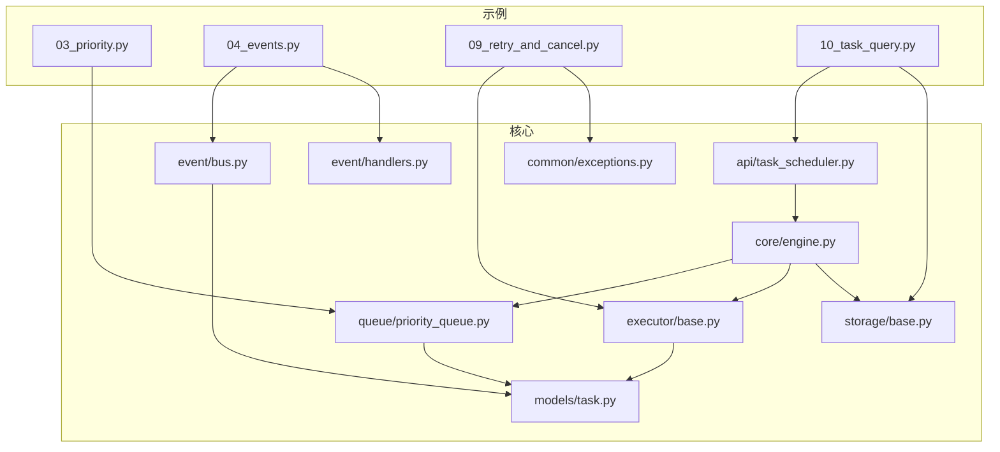
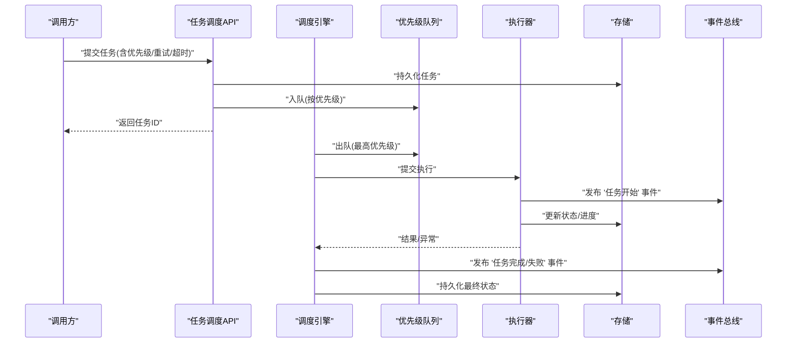
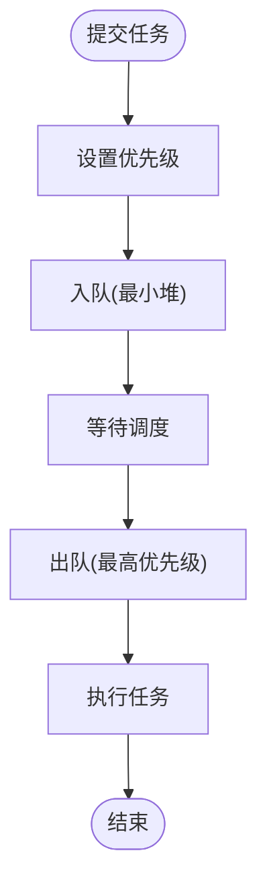
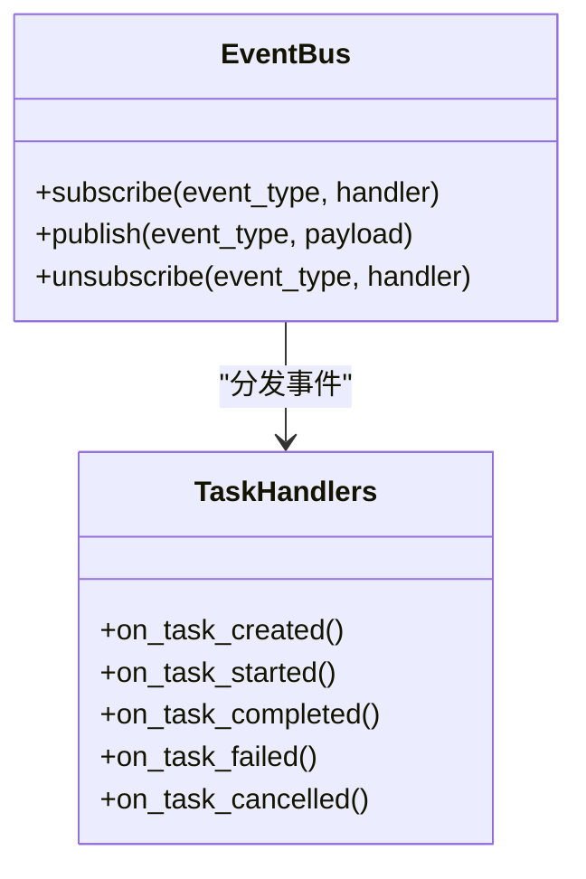
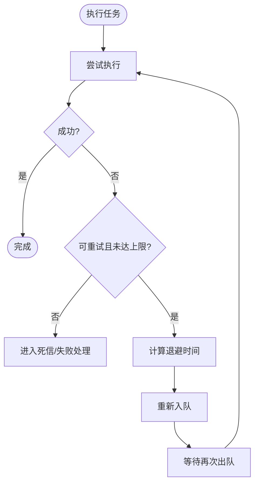
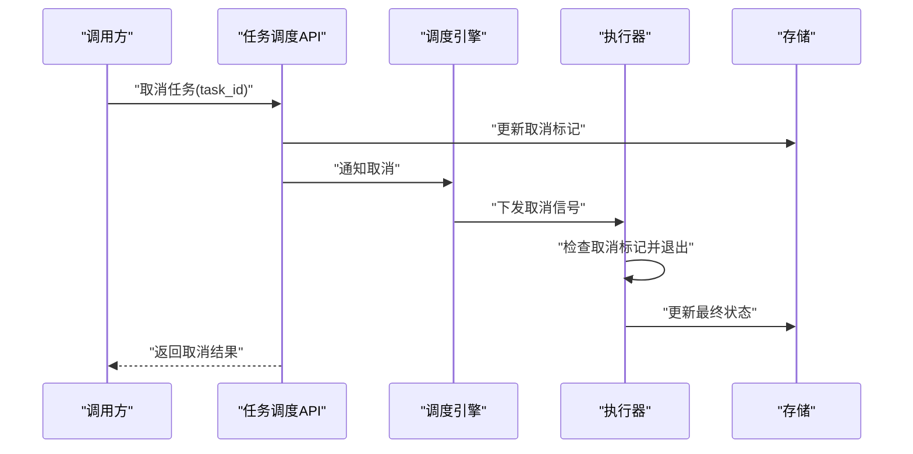
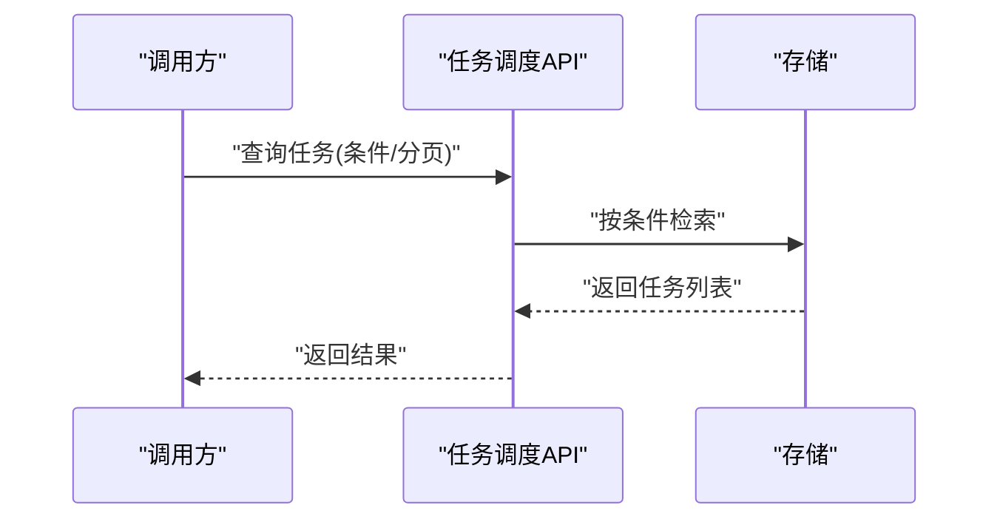
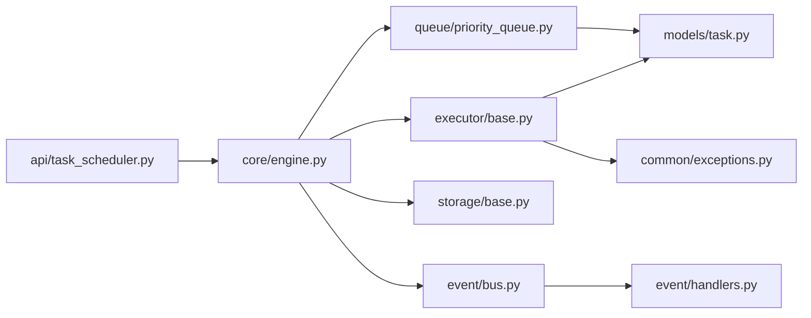

# 高级特性

<cite>
**本文引用的文件**   
- [examples/03_priority.py](file://examples/03_priority.py)
- [examples/04_events.py](file://examples/04_events.py)
- [examples/09_retry_and_cancel.py](file://examples/09_retry_and_cancel.py)
- [examples/10_task_query.py](file://examples/10_task_query.py)
- [src/neotask/models/task.py](file://src/neotask/models/task.py)
- [src/neotask/event/bus.py](file://src/neotask/event/bus.py)
- [src/neotask/event/handlers.py](file://src/neotask/event/handlers.py)
- [src/neotask/queue/priority_queue.py](file://src/neotask/queue/priority_queue.py)
- [src/neotask/executor/base.py](file://src/neotask/executor/base.py)
- [src/neotask/core/engine.py](file://src/neotask/core/engine.py)
- [src/neotask/api/task_scheduler.py](file://src/neotask/api/task_scheduler.py)
- [src/neotask/storage/base.py](file://src/neotask/storage/base.py)
- [src/neotask/common/exceptions.py](file://src/neotask/common/exceptions.py)
</cite>

## 目录
1. [简介](#简介)
2. [项目结构](#项目结构)
3. [核心组件](#核心组件)
4. [架构总览](#架构总览)
5. [详细组件分析](#详细组件分析)
6. [依赖分析](#依赖分析)
7. [性能考虑](#性能考虑)
8. [故障处理指南](#故障处理指南)
9. [结论](#结论)
10. [附录](#附录)

## 简介
本章节面向有一定经验的开发者，聚焦任务调度管理器的高级特性：任务优先级、事件系统、重试机制、任务取消与查询。文档通过示例路径与源码定位，给出复杂业务场景的实现思路、配置要点、性能考量与故障处理策略，帮助读者在生产环境中稳定落地这些能力。

## 项目结构
围绕高级特性的关键代码分布在以下模块：
- 模型层：任务定义与状态（task）
- 队列层：优先级队列（priority_queue）
- 执行层：执行器基类（executor.base）
- 事件层：事件总线与处理器（event.bus, event.handlers）
- 调度与API：调度器与对外接口（core.engine, api.task_scheduler）
- 存储层：持久化抽象（storage.base）
- 异常体系：统一异常（common.exceptions）
- 示例：优先级、事件、重试与取消、任务查询等（examples/*）

图表来源
- [examples/03_priority.py](file://examples/03_priority.py)
- [examples/04_events.py](file://examples/04_events.py)
- [examples/09_retry_and_cancel.py](file://examples/09_retry_and_cancel.py)
- [examples/10_task_query.py](file://examples/10_task_query.py)
- [src/neotask/models/task.py](file://src/neotask/models/task.py)
- [src/neotask/queue/priority_queue.py](file://src/neotask/queue/priority_queue.py)
- [src/neotask/executor/base.py](file://src/neotask/executor/base.py)
- [src/neotask/event/bus.py](file://src/neotask/event/bus.py)
- [src/neotask/event/handlers.py](file://src/neotask/event/handlers.py)
- [src/neotask/core/engine.py](file://src/neotask/core/engine.py)
- [src/neotask/api/task_scheduler.py](file://src/neotask/api/task_scheduler.py)
- [src/neotask/storage/base.py](file://src/neotask/storage/base.py)
- [src/neotask/common/exceptions.py](file://src/neotask/common/exceptions.py)

章节来源
- [examples/03_priority.py](file://examples/03_priority.py)
- [examples/04_events.py](file://examples/04_events.py)
- [examples/09_retry_and_cancel.py](file://examples/09_retry_and_cancel.py)
- [examples/10_task_query.py](file://examples/10_task_query.py)
- [src/neotask/models/task.py](file://src/neotask/models/task.py)
- [src/neotask/queue/priority_queue.py](file://src/neotask/queue/priority_queue.py)
- [src/neotask/executor/base.py](file://src/neotask/executor/base.py)
- [src/neotask/event/bus.py](file://src/neotask/event/bus.py)
- [src/neotask/event/handlers.py](file://src/neotask/event/handlers.py)
- [src/neotask/core/engine.py](file://src/neotask/core/engine.py)
- [src/neotask/api/task_scheduler.py](file://src/neotask/api/task_scheduler.py)
- [src/neotask/storage/base.py](file://src/neotask/storage/base.py)
- [src/neotask/common/exceptions.py](file://src/neotask/common/exceptions.py)

## 核心组件
- 任务模型：承载任务元数据、优先级、状态、重试计数、超时、取消标记等字段，贯穿调度、执行、存储与事件链路。
- 优先级队列：基于堆结构的优先队列，支持按优先级出队与延迟入队，保障高优任务优先消费。
- 执行器基类：定义任务执行的通用生命周期（提交、运行、完成、失败、取消），为线程/进程/异步执行器提供统一契约。
- 事件总线：发布-订阅式事件分发，支持任务生命周期事件（创建、开始、完成、失败、取消等）的解耦处理。
- 调度引擎：协调队列、执行器、存储与事件，驱动任务从入队到出队、执行、落盘与上报。
- 调度API：对外暴露的任务管理接口，涵盖提交、查询、取消、批量操作等。
- 存储抽象：持久化任务与状态，支持内存/SQLite/Redis等后端。
- 异常体系：统一错误类型与语义，便于上层捕获与重试/降级策略。

章节来源
- [src/neotask/models/task.py](file://src/neotask/models/task.py)
- [src/neotask/queue/priority_queue.py](file://src/neotask/queue/priority_queue.py)
- [src/neotask/executor/base.py](file://src/neotask/executor/base.py)
- [src/neotask/event/bus.py](file://src/neotask/event/bus.py)
- [src/neotask/event/handlers.py](file://src/neotask/event/handlers.py)
- [src/neotask/core/engine.py](file://src/neotask/core/engine.py)
- [src/neotask/api/task_scheduler.py](file://src/neotask/api/task_scheduler.py)
- [src/neotask/storage/base.py](file://src/neotask/storage/base.py)
- [src/neotask/common/exceptions.py](file://src/neotask/common/exceptions.py)

## 架构总览
下图展示高级特性在系统中的交互关系：任务由API接收并写入存储与队列；调度引擎拉取任务交由执行器运行；执行过程中触发事件；取消与重试由引擎与执行器协同控制；查询通过API访问存储或内存索引。

图表来源
- [src/neotask/api/task_scheduler.py](file://src/neotask/api/task_scheduler.py)
- [src/neotask/core/engine.py](file://src/neotask/core/engine.py)
- [src/neotask/queue/priority_queue.py](file://src/neotask/queue/priority_queue.py)
- [src/neotask/executor/base.py](file://src/neotask/executor/base.py)
- [src/neotask/storage/base.py](file://src/neotask/storage/base.py)
- [src/neotask/event/bus.py](file://src/neotask/event/bus.py)

## 详细组件分析

### 任务优先级
- 使用方式
  - 参考示例：[examples/03_priority.py](file://examples/03_priority.py)
  - 在提交任务时指定优先级参数，优先级数值越小通常表示越优先（具体以实现为准）。
- 内部机制
  - 优先级队列基于最小堆维护，保证每次出队获得当前最高优先级任务。
  - 任务模型包含优先级字段，用于排序与筛选。
- 配置建议
  - 合理划分优先级区间，避免过多层级导致比较开销上升。
  - 对热点高优任务设置合理的权重，防止低优任务饥饿。
- 性能考量
  - 入队/出队复杂度近似 O(log n)，在高吞吐下关注堆操作次数。
  - 批量入队时可考虑分批合并以减少锁竞争。
- 故障处理
  - 若出现优先级倒置，检查任务模型中优先级字段是否被覆盖或序列化问题。
  - 监控队列长度与出队耗时，必要时扩容消费者。

图表来源
- [src/neotask/queue/priority_queue.py](file://src/neotask/queue/priority_queue.py)
- [src/neotask/models/task.py](file://src/neotask/models/task.py)

章节来源
- [examples/03_priority.py](file://examples/03_priority.py)
- [src/neotask/queue/priority_queue.py](file://src/neotask/queue/priority_queue.py)
- [src/neotask/models/task.py](file://src/neotask/models/task.py)

### 事件系统
- 使用方式
  - 参考示例：[examples/04_events.py](file://examples/04_events.py)
  - 注册事件处理器，监听任务生命周期事件（如创建、开始、完成、失败、取消）。
- 内部机制
  - 事件总线采用发布-订阅模式，解耦执行与观测逻辑。
  - 处理器可同步或异步执行，注意避免阻塞主流程。
- 配置建议
  - 将重IO或外部调用放入独立处理器，避免影响任务执行时延。
  - 为处理器增加幂等与去重逻辑，防止重复消费。
- 性能考量
  - 事件风暴时启用批处理或背压策略。
  - 合理选择处理器并发度，避免过度竞争。
- 故障处理
  - 处理器异常不应影响任务主流程，需隔离与兜底。
  - 记录不可恢复错误的上下文，便于排查。

图表来源
- [src/neotask/event/bus.py](file://src/neotask/event/bus.py)
- [src/neotask/event/handlers.py](file://src/neotask/event/handlers.py)

章节来源
- [examples/04_events.py](file://examples/04_events.py)
- [src/neotask/event/bus.py](file://src/neotask/event/bus.py)
- [src/neotask/event/handlers.py](file://src/neotask/event/handlers.py)

### 重试机制
- 使用方式
  - 参考示例：[examples/09_retry_and_cancel.py](file://examples/09_retry_and_cancel.py)
  - 提交任务时指定最大重试次数与退避策略；执行器在失败时自动重试。
- 内部机制
  - 执行器捕获异常，根据策略计算下一次重试时间，重新入队。
  - 达到最大重试次数后转入死信或失败分支。
- 配置建议
  - 指数退避+抖动，避免雪崩。
  - 区分瞬时错误与永久错误，减少无效重试。
- 性能考量
  - 重试风暴会放大负载，需结合限流与熔断。
  - 监控重试率与平均重试次数，评估策略有效性。
- 故障处理
  - 记录每次重试的异常栈与上下文。
  - 对不可恢复错误快速失败，避免资源浪费。

图表来源
- [src/neotask/executor/base.py](file://src/neotask/executor/base.py)
- [src/neotask/common/exceptions.py](file://src/neotask/common/exceptions.py)

章节来源
- [examples/09_retry_and_cancel.py](file://examples/09_retry_and_cancel.py)
- [src/neotask/executor/base.py](file://src/neotask/executor/base.py)
- [src/neotask/common/exceptions.py](file://src/neotask/common/exceptions.py)

### 任务取消
- 使用方式
  - 参考示例：[examples/09_retry_and_cancel.py](file://examples/09_retry_and_cancel.py)
  - 通过API取消任务，执行器感知取消信号并尽快退出。
- 内部机制
  - 任务模型包含取消标记；执行器在执行循环中定期检查。
  - 取消后清理资源并更新状态。
- 配置建议
  - 为长任务设置合理的超时与取消阈值。
  - 确保取消路径幂等，避免重复释放资源。
- 性能考量
  - 频繁取消可能带来额外状态更新开销，需权衡业务需求。
- 故障处理
  - 取消失败时需回滚部分副作用，保持状态一致性。
  - 记录取消原因与上下文，便于审计。

图表来源
- [src/neotask/api/task_scheduler.py](file://src/neotask/api/task_scheduler.py)
- [src/neotask/core/engine.py](file://src/neotask/core/engine.py)
- [src/neotask/executor/base.py](file://src/neotask/executor/base.py)
- [src/neotask/storage/base.py](file://src/neotask/storage/base.py)

章节来源
- [examples/09_retry_and_cancel.py](file://examples/09_retry_and_cancel.py)
- [src/neotask/api/task_scheduler.py](file://src/neotask/api/task_scheduler.py)
- [src/neotask/core/engine.py](file://src/neotask/core/engine.py)
- [src/neotask/executor/base.py](file://src/neotask/executor/base.py)
- [src/neotask/storage/base.py](file://src/neotask/storage/base.py)

### 任务查询
- 使用方式
  - 参考示例：[examples/10_task_query.py](file://examples/10_task_query.py)
  - 通过API按任务ID、状态、时间范围、优先级等条件查询任务。
- 内部机制
  - 查询接口访问存储层，利用索引或内存视图加速检索。
  - 支持分页与过滤，避免一次性加载大量数据。
- 配置建议
  - 针对高频查询字段建立索引（如状态、更新时间）。
  - 限制单次查询规模，避免拖垮存储。
- 性能考量
  - 聚合查询尽量走只读副本或缓存。
  - 冷数据归档，降低热区压力。
- 故障处理
  - 查询超时或存储不可用时返回降级响应。
  - 记录慢查询日志，持续优化。

图表来源
- [src/neotask/api/task_scheduler.py](file://src/neotask/api/task_scheduler.py)
- [src/neotask/storage/base.py](file://src/neotask/storage/base.py)

章节来源
- [examples/10_task_query.py](file://examples/10_task_query.py)
- [src/neotask/api/task_scheduler.py](file://src/neotask/api/task_scheduler.py)
- [src/neotask/storage/base.py](file://src/neotask/storage/base.py)

### 复杂业务场景示例
- 订单支付回调处理
  - 优先级：高优支付回调优先处理，普通通知次之。
  - 重试：网络异常指数退避重试，超过上限转人工复核。
  - 取消：用户主动撤销支付时，取消相关任务并清理中间态。
  - 事件：支付成功/失败事件驱动后续履约流程。
  - 查询：按订单号与时间范围查询支付流水。
- 数据同步管道
  - 优先级：增量同步高于全量同步。
  - 重试：断点续传，失败重试并记录偏移。
  - 取消：中断长时间同步任务，保留进度。
  - 事件：同步开始/完成/失败告警。
  - 查询：按源表与目标表维度统计同步状态。

[本节为概念性说明，不直接分析具体文件]

## 依赖分析
- 组件耦合
  - 调度API依赖调度引擎与存储抽象，屏蔽底层差异。
  - 调度引擎协调队列、执行器与事件总线，形成核心编排。
  - 执行器依赖任务模型与异常体系，负责具体执行与重试/取消。
  - 事件总线与处理器松耦合，便于扩展观测与治理逻辑。
- 外部依赖
  - 存储后端（内存/SQLite/Redis）通过抽象接口接入。
  - 可选监控指标采集与WebUI（不在本次重点范围内）。

图表来源
- [src/neotask/api/task_scheduler.py](file://src/neotask/api/task_scheduler.py)
- [src/neotask/core/engine.py](file://src/neotask/core/engine.py)
- [src/neotask/queue/priority_queue.py](file://src/neotask/queue/priority_queue.py)
- [src/neotask/executor/base.py](file://src/neotask/executor/base.py)
- [src/neotask/storage/base.py](file://src/neotask/storage/base.py)
- [src/neotask/models/task.py](file://src/neotask/models/task.py)
- [src/neotask/event/bus.py](file://src/neotask/event/bus.py)
- [src/neotask/event/handlers.py](file://src/neotask/event/handlers.py)
- [src/neotask/common/exceptions.py](file://src/neotask/common/exceptions.py)

章节来源
- [src/neotask/api/task_scheduler.py](file://src/neotask/api/task_scheduler.py)
- [src/neotask/core/engine.py](file://src/neotask/core/engine.py)
- [src/neotask/queue/priority_queue.py](file://src/neotask/queue/priority_queue.py)
- [src/neotask/executor/base.py](file://src/neotask/executor/base.py)
- [src/neotask/storage/base.py](file://src/neotask/storage/base.py)
- [src/neotask/models/task.py](file://src/neotask/models/task.py)
- [src/neotask/event/bus.py](file://src/neotask/event/bus.py)
- [src/neotask/event/handlers.py](file://src/neotask/event/handlers.py)
- [src/neotask/common/exceptions.py](file://src/neotask/common/exceptions.py)

## 性能考虑
- 优先级队列
  - 堆操作复杂度 O(log n)，在高并发下关注锁粒度与批量操作。
  - 避免过多细粒度优先级，减少比较成本。
- 执行器
  - 合理设置并发度，避免CPU/IO争用。
  - 短任务与长任务分离队列，降低干扰。
- 事件系统
  - 处理器异步化与批量化，降低主路径延迟。
  - 事件风暴时引入限流与丢弃策略。
- 存储
  - 读写分离与只读副本，提升查询性能。
  - 冷热分层与归档，减少热区压力。
- 重试与取消
  - 退避策略与抖动，避免雪崩。
  - 取消路径轻量，避免长事务。

[本节提供通用指导，不直接分析具体文件]

## 故障处理指南
- 统一异常
  - 使用统一异常体系进行错误分类与传播，便于上层捕获与重试策略匹配。
- 重试边界
  - 仅对可恢复错误重试，避免对永久性错误反复尝试。
  - 记录重试次数与最后一次异常，辅助定位。
- 取消一致性
  - 取消后确保资源释放与状态回滚，避免悬挂任务。
- 事件健壮性
  - 处理器异常隔离，不影响主流程。
  - 对不可恢复错误进行告警与降级。
- 查询容错
  - 存储不可用时返回缓存或降级数据。
  - 慢查询告警与限流保护。

章节来源
- [src/neotask/common/exceptions.py](file://src/neotask/common/exceptions.py)
- [src/neotask/executor/base.py](file://src/neotask/executor/base.py)
- [src/neotask/event/bus.py](file://src/neotask/event/bus.py)
- [src/neotask/storage/base.py](file://src/neotask/storage/base.py)

## 结论
通过优先级、事件、重试、取消与查询等高级特性，任务调度管理器能够支撑复杂生产场景。关键在于合理的配置与监控：明确优先级区间、设计稳健的重试与取消策略、解耦事件处理、优化查询路径，并在异常情况下具备完善的容错与可观测性。

[本节为总结性内容，不直接分析具体文件]

## 附录
- 示例入口
  - 优先级：[examples/03_priority.py](file://examples/03_priority.py)
  - 事件：[examples/04_events.py](file://examples/04_events.py)
  - 重试与取消：[examples/09_retry_and_cancel.py](file://examples/09_retry_and_cancel.py)
  - 任务查询：[examples/10_task_query.py](file://examples/10_task_query.py)
- 关键源码
  - 任务模型：[src/neotask/models/task.py](file://src/neotask/models/task.py)
  - 优先级队列：[src/neotask/queue/priority_queue.py](file://src/neotask/queue/priority_queue.py)
  - 执行器基类：[src/neotask/executor/base.py](file://src/neotask/executor/base.py)
  - 事件总线：[src/neotask/event/bus.py](file://src/neotask/event/bus.py)
  - 事件处理器：[src/neotask/event/handlers.py](file://src/neotask/event/handlers.py)
  - 调度引擎：[src/neotask/core/engine.py](file://src/neotask/core/engine.py)
  - 调度API：[src/neotask/api/task_scheduler.py](file://src/neotask/api/task_scheduler.py)
  - 存储抽象：[src/neotask/storage/base.py](file://src/neotask/storage/base.py)
  - 异常体系：[src/neotask/common/exceptions.py](file://src/neotask/common/exceptions.py)