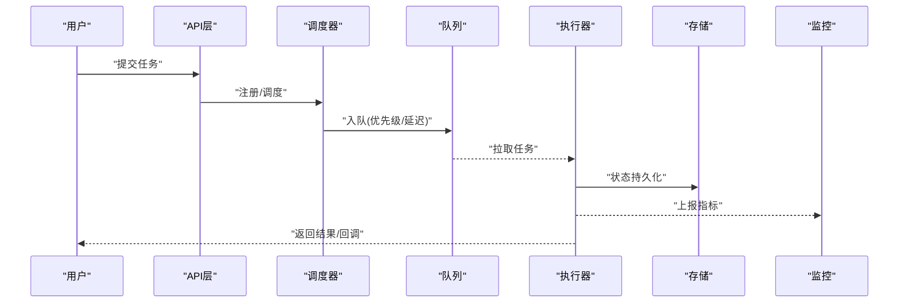
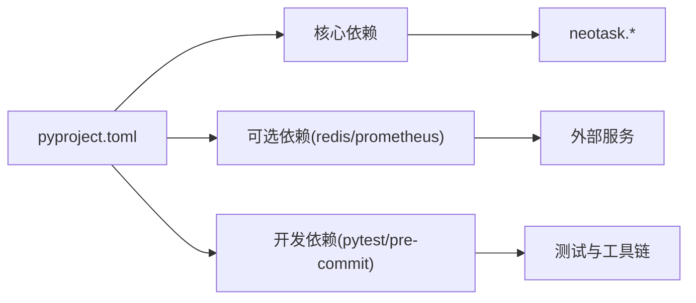

# 贡献指南

<cite>
**本文引用的文件**   
- [README.md](file://README.md)
- [README_zh.md](file://README_zh.md)
- [pyproject.toml](file://pyproject.toml)
- [.pre-commit-config.yaml](file://.pre-commit-config.yaml)
- [scripts/run_benchmarks.sh](file://scripts/run_benchmarks.sh)
- [scripts/run_chaos_tests.sh](file://scripts/run_chaos_tests.sh)
- [scripts/run_v04_validation.sh](file://scripts/run_v04_validation.sh)
- [tests/pytest.ini](file://tests/pytest.ini)
- [tests/conftest.py](file://tests/conftest.py)
- [tests/benchmark/run_benchmark.py](file://tests/benchmark/run_benchmark.py)
- [tests/benchmark/run_complete.py](file://tests/benchmark/run_complete.py)
- [tests/benchmark/test_performance.py](file://tests/benchmark/test_performance.py)
- [tests/benchmark/test_performance_simple.py](file://tests/benchmark/test_performance_simple.py)
- [tests/chaos/test_exception_scenarios.py](file://tests/chaos/test_exception_scenarios.py)
- [tests/integration/test_e2e.py](file://tests/integration/test_e2e.py)
- [tests/integration/test_end_to_end.py](file://tests/integration/test_end_to_end.py)
- [tests/integration/test_failure_recovery.py](file://tests/integration/test_failure_recovery.py)
- [tests/integration/test_task_pool.py](file://tests/integration/test_task_pool.py)
- [tests/integration/test_task_scheduler.py](file://tests/integration/test_task_scheduler.py)
- [tests/integration/test_worker_integration.py](file://tests/integration/test_worker_integration.py)
- [tests/unit/test_cron_parser.py](file://tests/unit/test_cron_parser.py)
- [tests/unit/test_delayed_queue.py](file://tests/unit/test_delayed队列.py)
- [tests/unit/test_event_bus.py](file://tests/unit/test_event_bus.py)
- [tests/unit/test_executors.py](file://tests/unit/test_executors.py)
- [tests/unit/test_future.py](file://tests/unit/test_future.py)
- [tests/unit/test_lifecycle.py](file://tests/unit/test_lifecycle.py)
- [tests/unit/test_metrics.py](file://tests/unit/test_metrics.py)
- [tests/unit/test_periodic_manager.py](file://tests/unit/test_periodic_manager.py)
- [tests/unit/test_priority_queue.py](file://tests/unit/test_priority_queue.py)
- [tests/unit/test_queue.py](file://tests/unit/test_queue.py)
- [tests/unit/test_redis_storage.py](file://tests/unit/test_redis_storage.py)
- [tests/unit/test_simple.py](file://tests/unit/test_simple.py)
- [tests/unit/test_storage.py](file://tests/unit/test_storage.py)
- [tests/unit/test_task.py](file://tests/unit/test_task.py)
- [tests/unit/test_task_lifecycle.py](file://tests/unit/test_task_lifecycle.py)
- [tests/unit/test_time_wheel.py](file://tests/unit/test_time_wheel.py)
- [tests/v.x/test_distributed_v04.py](file://tests/v.x/test_distributed_v04.py)
- [tests/v.x/test_distributed_v04_sync.py](file://tests/v.x/test_distributed_v04_sync.py)
- [tests/v.x/test_integration_v01_v04.py](file://tests/v.x/test_integration_v01_v04.py)
- [tests/v.x/test_integration_v05.py](file://tests/v.x/test_integration_v05.py)
- [tests/v.x/test_integration_v10.py](file://tests/v.x/test_integration_v10.py)
- [tests/v.x/test_v02.py](file://tests/v.x/test_v02.py)
- [examples/readme.txt](file://examples/readme.txt)
- [examples/00_quick_start.py](file://examples/00_quick_start.py)
- [examples/01_simple.py](file://examples/01_simple.py)
- [examples/02_context_manager.py](file://examples/02_context管理器.py)
- [examples/03_priority.py](file://examples/03_priority.py)
- [examples/04_events.py](file://examples/04_events.py)
- [examples/05_cron_tasks.py](file://examples/05_cron_tasks.py)
- [examples/06_delayed_tasks.py](file://examples/06_delayed_tasks.py)
- [examples/07_batch.py](file://examples/07_batch.py)
- [examples/08_periodic.py](file://examples/08_periodic.py)
- [examples/09_retry_and_cancel.py](file://examples/09_retry_and_cancel.py)
- [examples/10_task_query.py](file://examples/10_task_query.py)
- [examples/99_all_features.py](file://examples/99_all_features.py)
</cite>

## 目录
1. [简介](#简介)
2. [项目结构](#项目结构)
3. [核心组件](#核心组件)
4. [架构总览](#架构总览)
5. [详细组件分析](#详细组件分析)
6. [依赖分析](#依赖分析)
7. [性能考虑](#性能考虑)
8. [故障排查指南](#故障排查指南)
9. [结论](#结论)
10. [附录](#附录)

## 简介
本贡献指南面向希望参与任务调度管理器项目的开发者，涵盖开发环境搭建、代码规范、提交流程、代码审查标准、测试要求、文档更新规范、Issue与Feature请求处理流程、Pull Request工作流、社区参与方式与交流渠道，以及版本发布流程与变更日志维护方法。请遵循本指南以确保贡献质量与协作效率。

## 项目结构
仓库采用按功能域划分的模块化组织方式：
- src/neotask：核心库实现，包含API、CLI、配置、事件、执行器、锁、模型、监控、队列、调度器、存储、Web界面、工作进程等模块
- tests：单元测试、集成测试、基准测试、混沌测试与兼容性回归测试
- examples：示例脚本，覆盖快速开始到高级特性
- scripts：自动化脚本（基准、混沌、验证）
- docs：文档与报告
- .github/workflows：CI流水线定义
- pyproject.toml：项目元数据与依赖管理
- .pre-commit-config.yaml：提交前钩子配置

```mermaid
graph TB
A["src/neotask"] --> B["api"]
A --> C["cli"]
A --> D["common"]
A --> E["config"]
A --> F["contrib"]
A --> G["core"]
A --> H["distributed"]
A --> I["event"]
A --> J["executor"]
A --> K["lock"]
A --> L["models"]
A --> M["monitor"]
A --> N["queue"]
A --> O["scheduler"]
A --> P["storage"]
A --> Q["utils"]
A --> R["web"]
A --> S["worker"]
T["tests"] --> U["unit"]
T --> V["integration"]
T --> W["benchmark"]
T --> X["chaos"]
T --> Y["v.x"]
Z["scripts"] --> AA["run_benchmarks.sh"]
Z --> BB["run_chaos_tests.sh"]
Z --> CC["run_v04_validation.sh"]
```

图表来源
- [pyproject.toml](file://pyproject.toml)
- [.pre-commit-config.yaml](file://.pre-commit-config.yaml)

章节来源
- [README.md](file://README.md)
- [README_zh.md](file://README_zh.md)
- [pyproject.toml](file://pyproject.toml)
- [.pre-commit-config.yaml](file://.pre-commit-config.yaml)

## 核心组件
- API层：对外暴露任务池与任务调度接口
- CLI：命令行入口与Web UI启动命令
- 配置与日志：统一配置加载与日志输出
- 事件总线：事件发布/订阅与中间件机制
- 执行器：线程、进程、异步等多种执行后端
- 分布式协调：节点管理、分片、选举与心跳
- 锁服务：内存与Redis锁实现及工厂
- 队列系统：优先级队列、延迟队列、死信队列与调度
- 调度器：Cron解析、周期任务与时间轮
- 存储：内存、SQLite、Redis持久化
- Web界面：路由、WebSocket实时推送
- 监控：指标采集、健康检查与上报
- 工作进程：池化、预取、回收与策略

章节来源
- [src/neotask/api/task_pool.py](file://src/neotask/api/task_pool.py)
- [src/neotask/api/task_scheduler.py](file://src/neotask/api/task_scheduler.py)
- [src/neotask/cli/main.py](file://src/neotask/cli/main.py)
- [src/neotask/config/settings.py](file://src/neotask/config/settings.py)
- [src/neotask/event/bus.py](file://src/neotask/event/bus.py)
- [src/neotask/executor/thread_executor.py](file://src/neotask/executor/thread_executor.py)
- [src/neotask/distributed/coordinator.py](file://src/neotask/distributed/coordinator.py)
- [src/neotask/lock/factory.py](file://src/neotask/lock/factory.py)
- [src/neotask/queue/priority_queue.py](file://src/neotask/queue/priority_queue.py)
- [src/neotask/scheduler/cron_parser.py](file://src/neotask/scheduler/cron_parser.py)
- [src/neotask/storage/redis.py](file://src/neotask/storage/redis.py)
- [src/neotask/web/app.py](file://src/neotask/web/app.py)
- [src/neotask/monitor/metrics.py](file://src/neotask/monitor/metrics.py)
- [src/neotask/worker/pool.py](file://src/neotask/worker/pool.py)

## 架构总览
下图展示从用户调用到任务执行的端到端流程，包括API、调度器、队列、执行器、存储与监控的交互关系。

图表来源
- [src/neotask/api/task_scheduler.py](file://src/neotask/api/task_scheduler.py)
- [src/neotask/scheduler/cron_parser.py](file://src/neotask/scheduler/cron_parser.py)
- [src/neotask/queue/priority_queue.py](file://src/neotask/queue/priority_queue.py)
- [src/neotask/executor/thread_executor.py](file://src/neotask/executor/thread_executor.py)
- [src/neotask/storage/redis.py](file://src/neotask/storage/redis.py)
- [src/neotask/monitor/metrics.py](file://src/neotask/monitor/metrics.py)

## 详细组件分析

### 开发环境搭建
- Python版本与依赖
  - 使用pyproject.toml声明依赖与构建工具，建议使用与项目一致的Python版本
  - 安装依赖后，可通过示例脚本快速验证环境
- 本地运行与示例
  - 参考examples下的脚本进行快速上手与功能验证
- 提交前钩子
  - 启用.pre-commit-config.yaml中的钩子，确保格式与基础检查在提交前通过
- 测试套件
  - 使用tests/pytest.ini配置的测试框架运行单元、集成与基准测试
  - 使用scripts下的脚本批量运行基准、混沌与兼容性验证

章节来源
- [pyproject.toml](file://pyproject.toml)
- [.pre-commit-config.yaml](file://.pre-commit-config.yaml)
- [tests/pytest.ini](file://tests/pytest.ini)
- [scripts/run_benchmarks.sh](file://scripts/run_benchmarks.sh)
- [scripts/run_chaos_tests.sh](file://scripts/run_chaos_tests.sh)
- [scripts/run_v04_validation.sh](file://scripts/run_v04_validation.sh)
- [examples/readme.txt](file://examples/readme.txt)
- [examples/00_quick_start.py](file://examples/00_quick_start.py)

### 代码规范
- 风格与格式化
  - 遵循项目约定的PEP8风格；建议启用编辑器插件或IDE集成
- 类型注解与文档字符串
  - 公共API需添加类型注解与清晰的docstring
- 命名约定
  - 模块与包名小写加下划线；类名大驼峰；函数与变量小写加下划线
- 错误与异常
  - 使用common/exceptions中定义的异常类型，避免裸except
- 日志与可观测性
  - 使用统一的logger与metrics上报关键路径

章节来源
- [src/neotask/common/exceptions.py](file://src/neotask/common/exceptions.py)
- [src/neotask/common/logger.py](file://src/neotask/common/logger.py)
- [src/neotask/monitor/metrics.py](file://src/neotask/monitor/metrics.py)

### 提交流程
- 分支策略
  - main为稳定分支；feature/*用于新功能；fix/*用于缺陷修复；hotfix/*用于紧急修复
- 提交信息
  - 使用语义化提交信息，如feat/fix/docs/chore等前缀，并简要描述变更
- 提交前检查
  - 运行pre-commit钩子与本地测试，确保无新增警告与失败用例
- 合并前要求
  - 至少一名Reviewer批准；CI全绿；变更影响已评估并补充文档

章节来源
- [.pre-commit-config.yaml](file://.pre-commit-config.yaml)
- [tests/pytest.ini](file://tests/pytest.ini)

### 代码审查标准
- 正确性与健壮性
  - 边界条件、并发安全、资源释放与错误恢复
- 可读性与可维护性
  - 清晰命名、合理拆分、注释与文档完善
- 性能与可扩展性
  - 避免不必要的阻塞I/O、合理使用缓存与批处理
- 安全性
  - 输入校验、敏感信息保护、最小权限原则
- 测试覆盖
  - 新增/修改逻辑需配套单测与必要的集成测试

章节来源
- [tests/unit/test_executors.py](file://tests/unit/test_executors.py)
- [tests/integration/test_task_scheduler.py](file://tests/integration/test_task_scheduler.py)

### 测试要求
- 单元测试
  - 针对核心算法与组件编写单测，保证高覆盖率与稳定性
- 集成测试
  - 覆盖跨模块交互与外部依赖（如Redis、SQLite）
- 基准测试
  - 使用tests/benchmark与scripts/run_benchmarks.sh评估性能变化
- 混沌测试
  - 使用scripts/run_chaos_tests.sh模拟异常场景，提升鲁棒性
- 兼容性回归
  - 使用scripts/run_v04_validation.sh与tests/v.x下用例保障向后兼容

章节来源
- [tests/benchmark/run_benchmark.py](file://tests/benchmark/run_benchmark.py)
- [tests/benchmark/run_complete.py](file://tests/benchmark/run_complete.py)
- [tests/benchmark/test_performance.py](file://tests/benchmark/test_performance.py)
- [tests/benchmark/test_performance_simple.py](file://tests/benchmark/test_performance_simple.py)
- [tests/chaos/test_exception_scenarios.py](file://tests/chaos/test_exception_scenarios.py)
- [scripts/run_benchmarks.sh](file://scripts/run_benchmarks.sh)
- [scripts/run_chaos_tests.sh](file://scripts/run_chaos_tests.sh)
- [scripts/run_v04_validation.sh](file://scripts/run_v04_validation.sh)
- [tests/v.x/test_distributed_v04.py](file://tests/v.x/test_distributed_v04.py)
- [tests/v.x/test_integration_v01_v04.py](file://tests/v.x/test_integration_v01_v04.py)

### 文档更新规范
- README与中文说明
  - 新增/变更功能需同步更新README与README_zh.md
- 示例与教程
  - 新增示例应放入examples，并在examples/readme.txt中登记
- 内部文档
  - 重要设计决策与变更记录写入docs目录

章节来源
- [README.md](file://README.md)
- [README_zh.md](file://README_zh.md)
- [examples/readme.txt](file://examples/readme.txt)

### Issue提交与Feature请求
- Issue模板
  - Bug报告：复现步骤、期望行为、实际行为、环境与日志
  - Feature请求：背景、目标、方案与影响范围
- 标签与优先级
  - 使用bug/enhancement/help wanted等标签分类
- 响应时效
  - 维护者将在合理时间内回复并指派负责人

章节来源
- [README.md](file://README.md)
- [README_zh.md](file://README_zh.md)

### Pull Request处理流程
- 创建PR
  - 基于最新main分支创建topic分支，提交变更并附带测试与文档更新
- CI检查
  - 确保所有测试与基准通过
- 评审与修改
  - 根据Reviewer反馈迭代修改直至通过
- 合并策略
  - Squash或Rebase合并，保持历史整洁

章节来源
- [.pre-commit-config.yaml](file://.pre-commit-config.yaml)
- [tests/pytest.ini](file://tests/pytest.ini)

### 社区参与与交流渠道
- 讨论区
  - 使用Issues进行讨论与问题追踪
- 贡献者
  - 欢迎提交PR与Issue，遵守行为准则与贡献指南
- 公告
  - 重大变更与版本发布通过README与仓库公告通知

章节来源
- [README.md](file://README.md)
- [README_zh.md](file://README_zh.md)

### 版本发布流程与变更日志
- 版本号
  - 遵循语义化版本控制（主.次.修订）
- 发布清单
  - 更新CHANGELOG（如有）、README、示例与测试
- 打包与分发
  - 使用pyproject.toml构建并发布至PyPI（参考.github/workflows/publish-pypi.yml）
- 回滚与热修复
  - 通过hotfix分支快速修复并打补丁版本

章节来源
- [pyproject.toml](file://pyproject.toml)
- [.github/workflows/publish-pypi.yml](file://.github/workflows/publish-pypi.yml)

## 依赖分析
- 运行时依赖
  - 由pyproject.toml声明，包含核心库与可选扩展（如Redis、Prometheus）
- 开发依赖
  - 测试框架、基准工具、预提交钩子与代码质量工具
- 外部集成点
  - Redis、SQLite、Web服务器与监控系统

图表来源
- [pyproject.toml](file://pyproject.toml)

章节来源
- [pyproject.toml](file://pyproject.toml)

## 性能考虑
- 执行器选择
  - 根据任务类型选择合适的执行器（线程/进程/异步）
- 队列与调度
  - 合理使用优先级与延迟队列，避免热点键与长尾延迟
- 存储与锁
  - 选择合适存储后端与锁实现，关注序列化与网络开销
- 监控与告警
  - 开启指标采集与健康检查，定位瓶颈与异常

章节来源
- [src/neotask/executor/thread_executor.py](file://src/neotask/executor/thread_executor.py)
- [src/neotask/queue/priority_queue.py](file://src/neotask/queue/priority_queue.py)
- [src/neotask/storage/redis.py](file://src/neotask/storage/redis.py)
- [src/neotask/monitor/metrics.py](file://src/neotask/monitor/metrics.py)

## 故障排查指南
- 常见问题
  - 任务未执行：检查调度器与队列状态、执行器可用性与存储连接
  - 锁冲突：确认锁实现与超时设置，避免死锁
  - 性能退化：查看指标与日志，定位热点与阻塞点
- 调试工具
  - 使用CLI命令与Web UI观察任务与节点状态
  - 使用基准与混沌脚本复现场景
- 日志与指标
  - 统一日志格式与指标命名，便于检索与分析

章节来源
- [src/neotask/cli/main.py](file://src/neotask/cli/main.py)
- [src/neotask/web/app.py](file://src/neotask/web/app.py)
- [src/neotask/common/logger.py](file://src/neotask/common/logger.py)
- [src/neotask/monitor/metrics.py](file://src/neotask/monitor/metrics.py)
- [scripts/run_benchmarks.sh](file://scripts/run_benchmarks.sh)
- [scripts/run_chaos_tests.sh](file://scripts/run_chaos_tests.sh)

## 结论
遵循本贡献指南将有助于提升代码质量、协作效率与系统稳定性。请在提交前完成本地检查与测试，确保变更可追溯、可验证且对现有功能无负面影响。感谢每一位贡献者的付出！

## 附录
- 快速开始示例
  - 参考examples下的脚本逐步体验核心能力
- 测试运行
  - 使用pytest与提供的脚本批量执行各类测试
- 持续集成
  - 参考GitHub Actions配置了解自动化流程

章节来源
- [examples/00_quick_start.py](file://examples/00_quick_start.py)
- [tests/pytest.ini](file://tests/pytest.ini)
- [.github/workflows/publish-pypi.yml](file://.github/workflows/publish-pypi.yml)