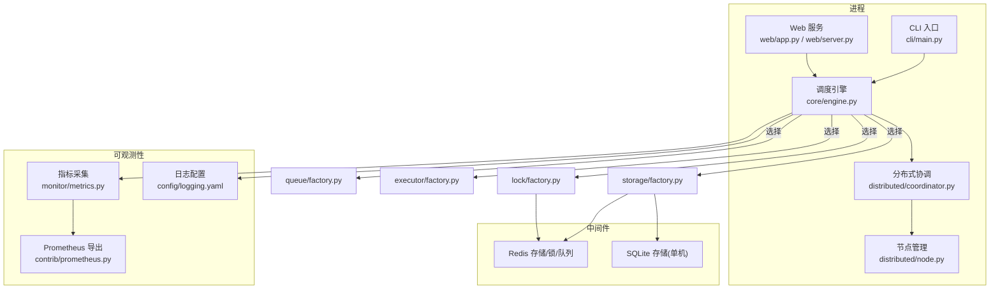
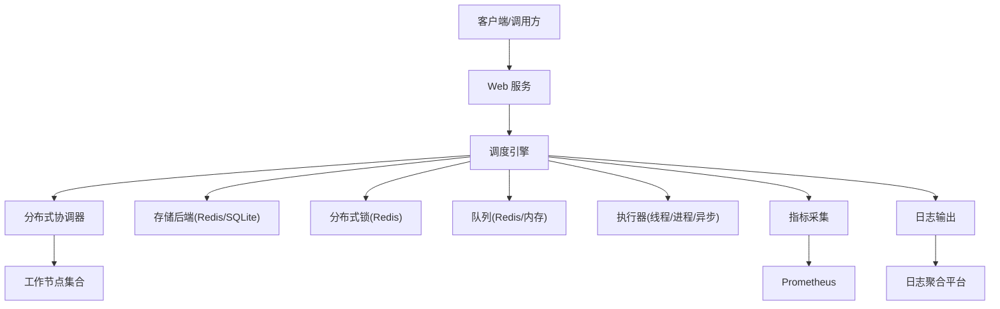
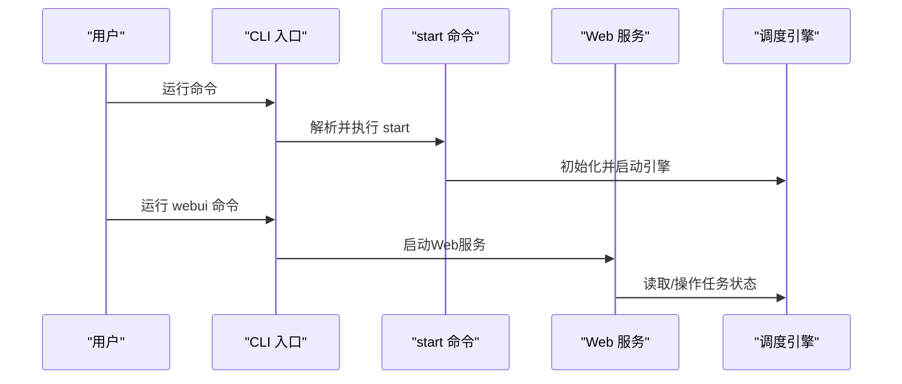
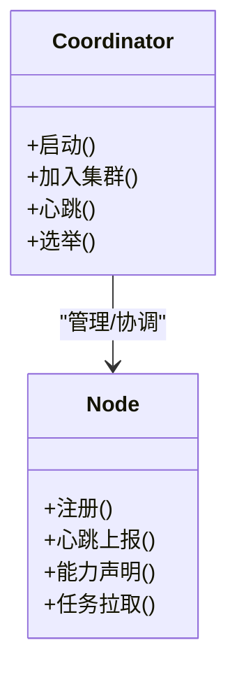
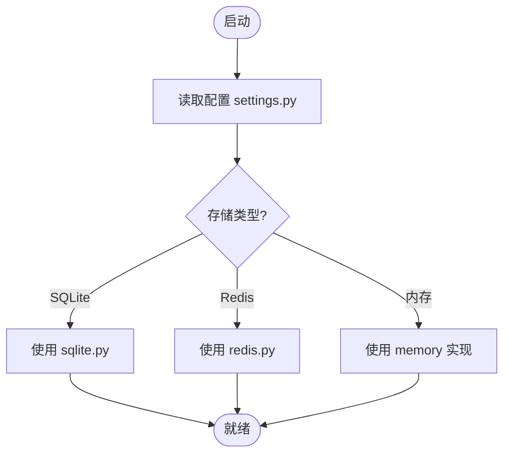
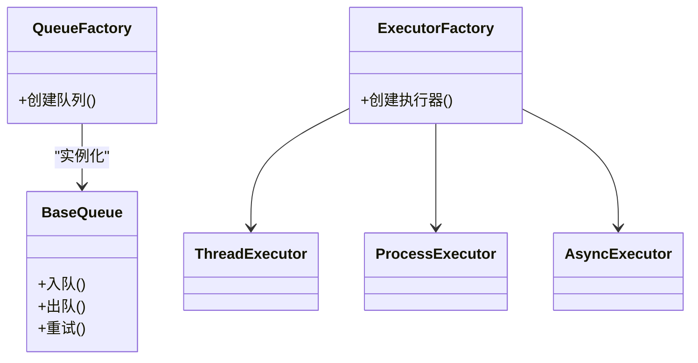
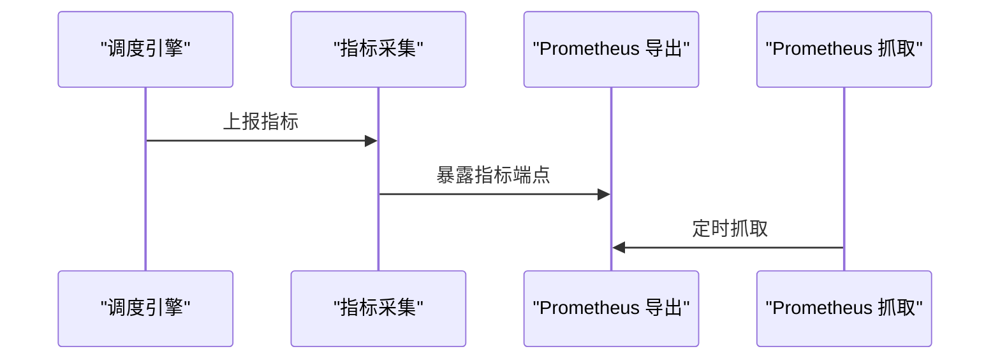
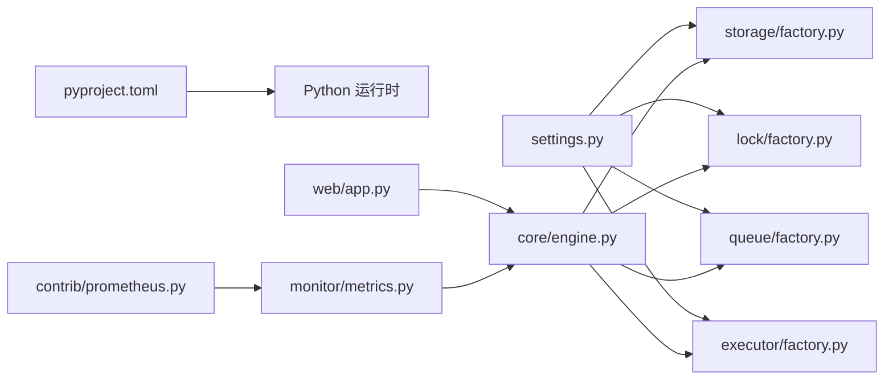

# 部署与运维

<cite>
**本文引用的文件**   
- [README.md](file://README.md)
- [pyproject.toml](file://pyproject.toml)
- [.github/workflows/publish-pypi.yml](file://.github/workflows/publish-pypi.yml)
- [src/neotask/config/settings.py](file://src/neotask/config/settings.py)
- [src/neotask/config/logging.yaml](file://src/neotask/config/logging.yaml)
- [src/neotask/cli/main.py](file://src/neotask/cli/main.py)
- [src/neotask/cli/commands/start.py](file://src/neotask/cli/commands/start.py)
- [src/neotask/cli/commands/webui.py](file://src/neotask/cli/commands/webui.py)
- [src/neotask/web/app.py](file://src/neotask/web/app.py)
- [src/neotask/web/server.py](file://src/neotask/web/server.py)
- [src/neotask/core/engine.py](file://src/neotask/core/engine.py)
- [src/neotask/distributed/coordinator.py](file://src/neotask/distributed/coordinator.py)
- [src/neotask/distributed/node.py](file://src/neotask/distributed/node.py)
- [src/neotask/storage/factory.py](file://src/neotask/storage/factory.py)
- [src/neotask/storage/redis.py](file://src/neotask/storage/redis.py)
- [src/neotask/storage/sqlite.py](file://src/neotask/storage/sqlite.py)
- [src/neotask/lock/factory.py](file://src/neotask/lock/factory.py)
- [src/neotask/lock/redis.py](file://src/neotask/lock/redis.py)
- [src/neotask/queue/factory.py](file://src/neotask/queue/factory.py)
- [src/neotask/queue/base.py](file://src/neotask/queue/base.py)
- [src/neotask/executor/factory.py](file://src/neotask/executor/factory.py)
- [src/neotask/monitor/metrics.py](file://src/neotask/monitor/metrics.py)
- [src/neotask/contrib/prometheus.py](file://src/neotask/contrib/prometheus.py)
- [scripts/run_benchmarks.sh](file://scripts/run_benchmarks.sh)
- [scripts/run_chaos_tests.sh](file://scripts/run_chaos_tests.sh)
</cite>

## 目录
1. [简介](#简介)
2. [项目结构](#项目结构)
3. [核心组件](#核心组件)
4. [架构总览](#架构总览)
5. [详细组件分析](#详细组件分析)
6. [依赖关系分析](#依赖关系分析)
7. [性能考虑](#性能考虑)
8. [故障排查指南](#故障排查指南)
9. [结论](#结论)
10. [附录](#附录)

## 简介
本指南面向生产环境的部署与运维，覆盖单机、集群与容器化部署方案；CI/CD流水线搭建与自动化发布；监控告警、日志收集与性能分析体系；以及故障排查、容量规划与灾难恢复的最佳实践。同时提供生产环境性能调优与安全加固建议。

## 项目结构
本项目为Python任务调度系统，包含CLI入口、Web管理界面、分布式协调、存储与锁实现、队列与执行器工厂、监控指标等模块。关键路径如下：
- CLI与Web服务：cli、web
- 核心引擎与生命周期：core
- 分布式能力：distributed
- 存储与锁：storage、lock
- 队列与执行器：queue、executor
- 配置与日志：config
- 监控与Prometheus集成：monitor、contrib
- 脚本与测试：scripts、tests

图表来源
- [src/neotask/cli/main.py](file://src/neotask/cli/main.py)
- [src/neotask/web/app.py](file://src/neotask/web/app.py)
- [src/neotask/web/server.py](file://src/neotask/web/server.py)
- [src/neotask/core/engine.py](file://src/neotask/core/engine.py)
- [src/neotask/distributed/coordinator.py](file://src/neotask/distributed/coordinator.py)
- [src/neotask/distributed/node.py](file://src/neotask/distributed/node.py)
- [src/neotask/storage/factory.py](file://src/neotask/storage/factory.py)
- [src/neotask/storage/redis.py](file://src/neotask/storage/redis.py)
- [src/neotask/storage/sqlite.py](file://src/neotask/storage/sqlite.py)
- [src/neotask/lock/factory.py](file://src/neotask/lock/factory.py)
- [src/neotask/lock/redis.py](file://src/neotask/lock/redis.py)
- [src/neotask/queue/factory.py](file://src/neotask/queue/factory.py)
- [src/neotask/executor/factory.py](file://src/neotask/executor/factory.py)
- [src/neotask/monitor/metrics.py](file://src/neotask/monitor/metrics.py)
- [src/neotask/contrib/prometheus.py](file://src/neotask/contrib/prometheus.py)
- [src/neotask/config/logging.yaml](file://src/neotask/config/logging.yaml)

章节来源
- [README.md](file://README.md)
- [pyproject.toml](file://pyproject.toml)

## 核心组件
- CLI与Web服务
  - CLI主入口负责命令解析与子命令分发，支持启动调度器与管理面板。
  - Web服务提供REST接口与静态页面，用于任务管理与状态查看。
- 调度引擎
  - 统一编排任务生命周期、调度策略、重试与取消、事件总线与监控上报。
- 分布式协调与节点
  - 协调器负责集群元数据、选举与一致性；节点负责注册、心跳与能力上报。
- 存储与锁
  - 通过工厂模式选择后端：内存、SQLite（单机）、Redis（分布式）。
  - 锁同样支持内存与Redis，确保跨进程/节点互斥。
- 队列与执行器
  - 队列抽象支持优先级、延迟、死信等；执行器支持线程、进程、异步等多种执行模型。
- 监控与Prometheus
  - 内置指标采集与Prometheus导出端点，便于接入监控系统。

章节来源
- [src/neotask/cli/main.py](file://src/neotask/cli/main.py)
- [src/neotask/cli/commands/start.py](file://src/neotask/cli/commands/start.py)
- [src/neotask/cli/commands/webui.py](file://src/neotask/cli/commands/webui.py)
- [src/neotask/web/app.py](file://src/neotask/web/app.py)
- [src/neotask/web/server.py](file://src/neotask/web/server.py)
- [src/neotask/core/engine.py](file://src/neotask/core/engine.py)
- [src/neotask/distributed/coordinator.py](file://src/neotask/distributed/coordinator.py)
- [src/neotask/distributed/node.py](file://src/neotask/distributed/node.py)
- [src/neotask/storage/factory.py](file://src/neotask/storage/factory.py)
- [src/neotask/storage/redis.py](file://src/neotask/storage/redis.py)
- [src/neotask/storage/sqlite.py](file://src/neotask/storage/sqlite.py)
- [src/neotask/lock/factory.py](file://src/neotask/lock/factory.py)
- [src/neotask/lock/redis.py](file://src/neotask/lock/redis.py)
- [src/neotask/queue/factory.py](file://src/neotask/queue/factory.py)
- [src/neotask/queue/base.py](file://src/neotask/queue/base.py)
- [src/neotask/executor/factory.py](file://src/neotask/executor/factory.py)
- [src/neotask/monitor/metrics.py](file://src/neotask/monitor/metrics.py)
- [src/neotask/contrib/prometheus.py](file://src/neotask/contrib/prometheus.py)

## 架构总览
下图展示典型的生产部署形态：多个调度节点通过Redis进行状态共享与分布式锁，Web服务独立部署，Prometheus抓取指标，集中式日志平台收集应用日志。

图表来源
- [src/neotask/web/app.py](file://src/neotask/web/app.py)
- [src/neotask/core/engine.py](file://src/neotask/core/engine.py)
- [src/neotask/distributed/coordinator.py](file://src/neotask/distributed/coordinator.py)
- [src/neotask/storage/factory.py](file://src/neotask/storage/factory.py)
- [src/neotask/lock/factory.py](file://src/neotask/lock/factory.py)
- [src/neotask/queue/factory.py](file://src/neotask/queue/factory.py)
- [src/neotask/executor/factory.py](file://src/neotask/executor/factory.py)
- [src/neotask/monitor/metrics.py](file://src/neotask/monitor/metrics.py)
- [src/neotask/contrib/prometheus.py](file://src/neotask/contrib/prometheus.py)
- [src/neotask/config/logging.yaml](file://src/neotask/config/logging.yaml)

## 详细组件分析

### 组件A：CLI与Web服务
- CLI主入口提供命令路由，start命令用于启动调度器，webui命令用于启动Web管理界面。
- Web服务基于HTTP框架暴露管理API与静态页面，内部与调度引擎交互以查询/控制任务。

图表来源
- [src/neotask/cli/main.py](file://src/neotask/cli/main.py)
- [src/neotask/cli/commands/start.py](file://src/neotask/cli/commands/start.py)
- [src/neotask/cli/commands/webui.py](file://src/neotask/cli/commands/webui.py)
- [src/neotask/web/app.py](file://src/neotask/web/app.py)
- [src/neotask/web/server.py](file://src/neotask/web/server.py)
- [src/neotask/core/engine.py](file://src/neotask/core/engine.py)

章节来源
- [src/neotask/cli/main.py](file://src/neotask/cli/main.py)
- [src/neotask/cli/commands/start.py](file://src/neotask/cli/commands/start.py)
- [src/neotask/cli/commands/webui.py](file://src/neotask/cli/commands/webui.py)
- [src/neotask/web/app.py](file://src/neotask/web/app.py)
- [src/neotask/web/server.py](file://src/neotask/web/server.py)

### 组件B：分布式协调与节点
- 协调器负责集群发现、领导选举与元数据一致性。
- 节点负责注册、心跳上报、能力声明与任务拉取。

图表来源
- [src/neotask/distributed/coordinator.py](file://src/neotask/distributed/coordinator.py)
- [src/neotask/distributed/node.py](file://src/neotask/distributed/node.py)

章节来源
- [src/neotask/distributed/coordinator.py](file://src/neotask/distributed/coordinator.py)
- [src/neotask/distributed/node.py](file://src/neotask/distributed/node.py)

### 组件C：存储与锁工厂
- 存储工厂根据配置选择内存、SQLite或Redis作为持久化后端。
- 锁工厂根据配置选择内存或Redis锁，保证跨进程/节点互斥。

图表来源
- [src/neotask/config/settings.py](file://src/neotask/config/settings.py)
- [src/neotask/storage/factory.py](file://src/neotask/storage/factory.py)
- [src/neotask/storage/sqlite.py](file://src/neotask/storage/sqlite.py)
- [src/neotask/storage/redis.py](file://src/neotask/storage/redis.py)
- [src/neotask/lock/factory.py](file://src/neotask/lock/factory.py)
- [src/neotask/lock/redis.py](file://src/neotask/lock/redis.py)

章节来源
- [src/neotask/config/settings.py](file://src/neotask/config/settings.py)
- [src/neotask/storage/factory.py](file://src/neotask/storage/factory.py)
- [src/neotask/storage/redis.py](file://src/neotask/storage/redis.py)
- [src/neotask/storage/sqlite.py](file://src/neotask/storage/sqlite.py)
- [src/neotask/lock/factory.py](file://src/neotask/lock/factory.py)
- [src/neotask/lock/redis.py](file://src/neotask/lock/redis.py)

### 组件D：队列与执行器
- 队列抽象支持优先级、延迟与死信队列，底层可选择内存或Redis。
- 执行器支持线程池、进程池与异步执行，按任务特性选择合适模型。

图表来源
- [src/neotask/queue/factory.py](file://src/neotask/queue/factory.py)
- [src/neotask/queue/base.py](file://src/neotask/queue/base.py)
- [src/neotask/executor/factory.py](file://src/neotask/executor/factory.py)

章节来源
- [src/neotask/queue/factory.py](file://src/neotask/queue/factory.py)
- [src/neotask/queue/base.py](file://src/neotask/queue/base.py)
- [src/neotask/executor/factory.py](file://src/neotask/executor/factory.py)

### 组件E：监控与Prometheus
- 指标采集模块统一收集调度相关指标。
- Prometheus导出模块提供标准抓取端点，便于接入监控系统。

图表来源
- [src/neotask/monitor/metrics.py](file://src/neotask/monitor/metrics.py)
- [src/neotask/contrib/prometheus.py](file://src/neotask/contrib/prometheus.py)

章节来源
- [src/neotask/monitor/metrics.py](file://src/neotask/monitor/metrics.py)
- [src/neotask/contrib/prometheus.py](file://src/neotask/contrib/prometheus.py)

## 依赖关系分析
- 外部依赖
  - Python运行时与包管理由pyproject.toml定义。
  - Redis作为分布式存储、锁与队列的可选后端。
  - Prometheus用于指标抓取。
- 内部耦合
  - 引擎对存储、锁、队列、执行器采用工厂解耦，降低耦合度。
  - Web服务与引擎通过API交互，保持职责分离。
  - 监控与日志贯穿各组件，形成统一的非功能能力。

图表来源
- [pyproject.toml](file://pyproject.toml)
- [src/neotask/config/settings.py](file://src/neotask/config/settings.py)
- [src/neotask/storage/factory.py](file://src/neotask/storage/factory.py)
- [src/neotask/lock/factory.py](file://src/neotask/lock/factory.py)
- [src/neotask/queue/factory.py](file://src/neotask/queue/factory.py)
- [src/neotask/executor/ffactory.py](file://src/neotask/executor/factory.py)
- [src/neotask/core/engine.py](file://src/neotask/core/engine.py)
- [src/neotask/web/app.py](file://src/neotask/web/app.py)
- [src/neotask/monitor/metrics.py](file://src/neotask/monitor/metrics.py)
- [src/neotask/contrib/prometheus.py](file://src/neotask/contrib/prometheus.py)

章节来源
- [pyproject.toml](file://pyproject.toml)
- [src/neotask/config/settings.py](file://src/neotask/config/settings.py)

## 性能考虑
- 存储层
  - 单机场景优先SQLite以减少依赖；高并发与多节点场景使用Redis，注意连接池与超时配置。
- 锁与队列
  - 分布式锁避免长时间持有，合理设置过期时间；队列在高吞吐下建议使用Redis并开启批量操作。
- 执行器
  - CPU密集型任务使用进程执行器；IO密集型任务使用线程或异步执行器；根据CPU核数与任务特征调整并发度。
- 监控与日志
  - 启用Prometheus指标，关注任务积压、执行耗时、失败率；日志分级输出，避免DEBUG在生产环境。
- 基准与混沌
  - 使用提供的脚本进行基准与混沌测试，评估容量与稳定性。

章节来源
- [scripts/run_benchmarks.sh](file://scripts/run_benchmarks.sh)
- [scripts/run_chaos_tests.sh](file://scripts/run_chaos_tests.sh)
- [src/neotask/config/logging.yaml](file://src/neotask/config/logging.yaml)

## 故障排查指南
- 常见问题定位
  - 无法连接Redis：检查网络连通性与认证配置，确认端口与密码正确。
  - 任务不执行：检查队列是否可用、执行器是否就绪、锁是否被占用。
  - Web不可用：确认端口未被占用，权限与防火墙规则允许访问。
- 日志与指标
  - 查看应用日志定位异常堆栈；通过Prometheus指标观察任务成功率、延迟分布与资源使用。
- 恢复步骤
  - 重启服务后观察心跳与注册状态；必要时清理过期锁与死信队列，重新消费。
- 压测与回归
  - 使用基准脚本验证变更后的吞吐与延迟；混沌脚本模拟异常，验证自愈能力。

章节来源
- [src/neotask/config/logging.yaml](file://src/neotask/config/logging.yaml)
- [src/neotask/monitor/metrics.py](file://src/neotask/monitor/metrics.py)
- [src/neotask/contrib/prometheus.py](file://src/neotask/contrib/prometheus.py)
- [scripts/run_benchmarks.sh](file://scripts/run_benchmarks.sh)
- [scripts/run_chaos_tests.sh](file://scripts/run_chaos_tests.sh)

## 结论
通过合理的存储与锁选型、合适的执行器模型、完善的监控与日志体系，以及规范的CI/CD流程，可实现稳定、可扩展的任务调度系统。建议在上线前完成容量规划与混沌演练，持续优化关键指标并建立告警闭环。

## 附录

### 部署方案

#### 单机部署
- 适用场景：开发、小规模生产或无外部依赖需求。
- 要点
  - 使用SQLite作为存储，无需额外中间件。
  - 启动调度器与Web服务，本地访问管理界面。
  - 日志级别设置为INFO，定期轮转。
- 参考
  - CLI入口与命令：[src/neotask/cli/main.py](file://src/neotask/cli/main.py)、[src/neotask/cli/commands/start.py](file://src/neotask/cli/commands/start.py)、[src/neotask/cli/commands/webui.py](file://src/neotask/cli/commands/webui.py)
  - 存储与锁：[src/neotask/storage/sqlite.py](file://src/neotask/storage/sqlite.py)、[src/neotask/lock/factory.py](file://src/neotask/lock/factory.py)
  - 日志配置：[src/neotask/config/logging.yaml](file://src/neotask/config/logging.yaml)

#### 集群部署
- 适用场景：多节点高可用、水平扩展。
- 要点
  - 使用Redis作为存储、锁与队列后端。
  - 启动多个调度节点，协调器负责选举与元数据一致性。
  - Web服务独立部署，负载均衡访问。
- 参考
  - 分布式协调与节点：[src/neotask/distributed/coordinator.py](file://src/neotask/distributed/coordinator.py)、[src/neotask/distributed/node.py](file://src/neotask/distributed/node.py)
  - 存储与锁工厂：[src/neotask/storage/factory.py](file://src/neotask/storage/factory.py)、[src/neotask/lock/factory.py](file://src/neotask/lock/factory.py)
  - 队列与执行器：[src/neotask/queue/factory.py](file://src/neotask/queue/factory.py)、[src/neotask/executor/factory.py](file://src/neotask/executor/factory.py)

#### 容器化部署
- 适用场景：云原生、弹性伸缩、快速交付。
- 要点
  - 构建镜像时安装依赖，暴露Web端口与指标端口。
  - 通过环境变量注入配置（如Redis地址、日志级别）。
  - 使用编排平台管理副本数与健康检查。
- 参考
  - 应用入口与配置：[src/neotask/cli/main.py](file://src/neotask/cli/main.py)、[src/neotask/config/settings.py](file://src/neotask/config/settings.py)
  - Web服务：[src/neotask/web/app.py](file://src/neotask/web/app.py)、[src/neotask/web/server.py](file://src/neotask/web/server.py)
  - 监控导出：[src/neotask/contrib/prometheus.py](file://src/neotask/contrib/prometheus.py)

### CI/CD流水线与自动化发布
- 流水线目标
  - 自动构建、测试、打包与发布到PyPI。
- 关键步骤
  - 触发条件：推送标签或合并分支。
  - 构建环境：安装依赖、运行单元测试与集成测试。
  - 打包发布：生成包并发布至仓库。
- 参考
  - GitHub Actions工作流：[.github/workflows/publish-pypi.yml](file://.github/workflows/publish-pypi.yml)
  - 项目元数据与依赖：[pyproject.toml](file://pyproject.toml)

章节来源
- [.github/workflows/publish-pypi.yml](file://.github/workflows/publish-pypi.yml)
- [pyproject.toml](file://pyproject.toml)

### 监控告警、日志收集与性能分析
- 监控告警
  - 指标：任务提交量、执行成功率、平均耗时、队列长度、失败重试次数。
  - 告警阈值：失败率突增、队列积压超过阈值、节点心跳丢失。
- 日志收集
  - 结构化日志输出，按级别过滤，集中汇聚到日志平台。
- 性能分析
  - 使用基准脚本评估吞吐与延迟；结合Prometheus指标定位瓶颈。
- 参考
  - 指标与Prometheus：[src/neotask/monitor/metrics.py](file://src/neotask/monitor/metrics.py)、[src/neotask/contrib/prometheus.py](file://src/neotask/contrib/prometheus.py)
  - 日志配置：[src/neotask/config/logging.yaml](file://src/neotask/config/logging.yaml)
  - 基准与混沌：[scripts/run_benchmarks.sh](file://scripts/run_benchmarks.sh)、[scripts/run_chaos_tests.sh](file://scripts/run_chaos_tests.sh)

### 故障排查、容量规划与灾难恢复
- 故障排查
  - 从日志与指标入手，逐步缩小范围至具体组件（存储、锁、队列、执行器）。
- 容量规划
  - 依据峰值QPS与任务复杂度估算CPU/内存与Redis容量；预留冗余。
- 灾难恢复
  - 定期备份SQLite或Redis数据；制定回滚策略与演练计划。
- 参考
  - 存储与锁：[src/neotask/storage/factory.py](file://src/neotask/storage/factory.py)、[src/neotask/lock/factory.py](file://src/neotask/lock/factory.py)
  - 监控与日志：[src/neotask/monitor/metrics.py](file://src/neotask/monitor/metrics.py)、[src/neotask/config/logging.yaml](file://src/neotask/config/logging.yaml)

### 生产环境性能调优与安全加固
- 性能调优
  - 调整执行器并发度与队列预取数量；合理设置Redis连接池与超时。
  - 关闭调试日志，启用高效序列化与批量操作。
- 安全加固
  - 限制Web服务访问来源；启用强认证与最小权限原则。
  - 保护Redis凭据，启用TLS与网络隔离。
- 参考
  - 配置中心：[src/neotask/config/settings.py](file://src/neotask/config/settings.py)
  - 日志级别：[src/neotask/config/logging.yaml](file://src/neotask/config/logging.yaml)
  - 监控端点：[src/neotask/contrib/prometheus.py](file://src/neotask/contrib/prometheus.py)