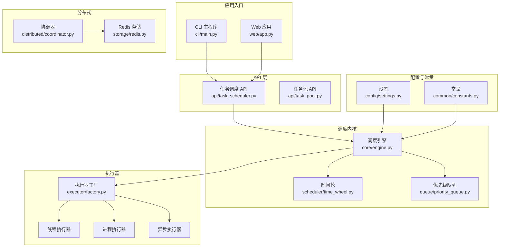
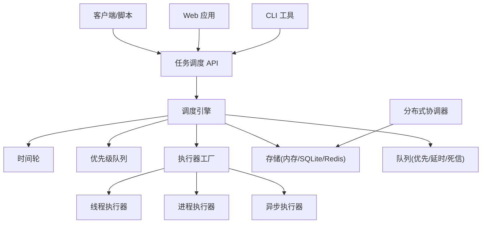
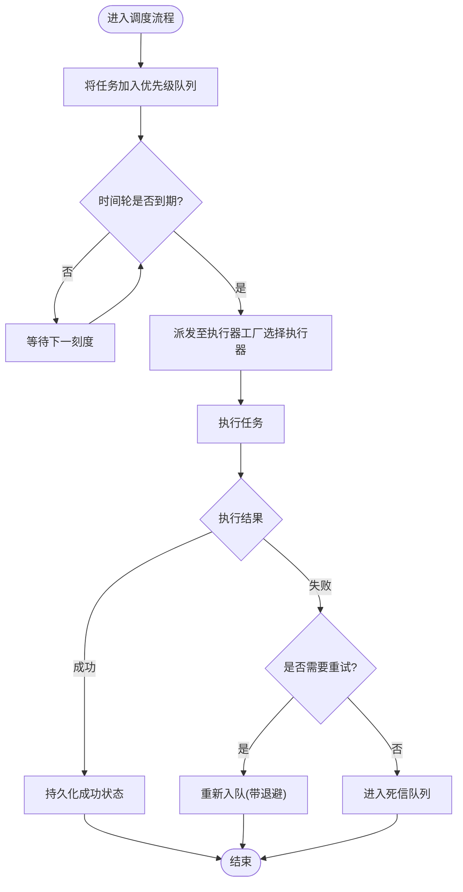
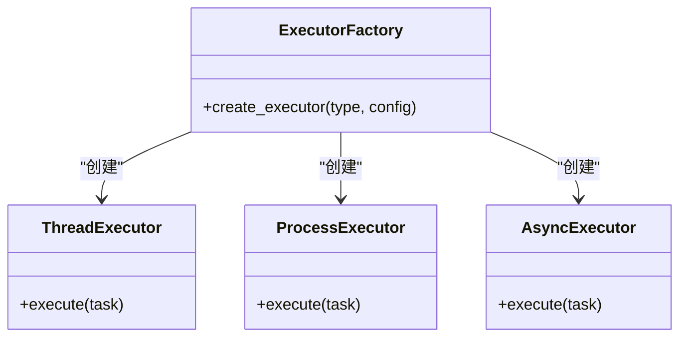
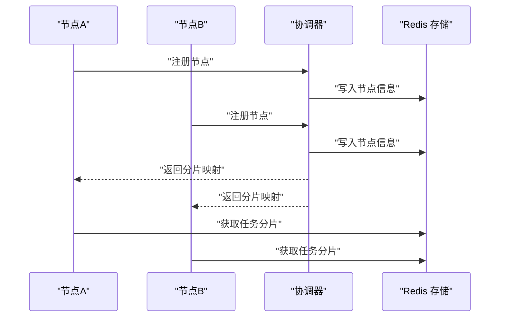
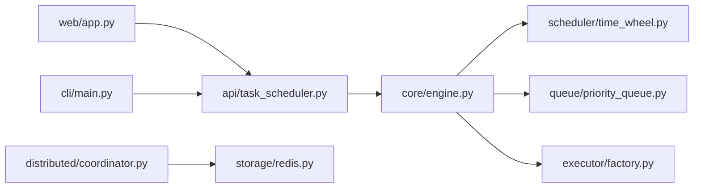

# 项目概述

<cite>
**本文引用的文件**   
- [README.md](file://README.md)
- [README_zh.md](file://README_zh.md)
- [pyproject.toml](file://pyproject.toml)
- [src/neotask/__init__.py](file://src/neotask/__init__.py)
- [examples/00_quick_start.py](file://examples/00_quick_start.py)
- [examples/99_all_features.py](file://examples/99_all_features.py)
- [src/neotask/core/engine.py](file://src/neotask/core/engine.py)
- [src/neotask/api/task_scheduler.py](file://src/neotask/api/task_scheduler.py)
- [src/neotask/executor/factory.py](file://src/neotask/executor/factory.py)
- [src/neotask/queue/priority_queue.py](file://src/neotask/queue/priority_queue.py)
- [src/neotask/scheduler/time_wheel.py](file://src/neotask/scheduler/time_wheel.py)
- [src/neotask/distributed/coordinator.py](file://src/neotask/distributed/coordinator.py)
- [src/neotask/storage/redis.py](file://src/neotask/storage/redis.py)
- [src/neotask/web/app.py](file://src/neotask/web/app.py)
- [src/neotask/cli/main.py](file://src/neotask/cli/main.py)
- [src/neotask/config/settings.py](file://src/neotask/config/settings.py)
- [src/neotask/common/constants.py](file://src/neotask/common/constants.py)
- [tests/unit/test_task_lifecycle.py](file://tests/unit/test_task_lifecycle.py)
- [tests/integration/test_task_scheduler.py](file://tests/integration/test_task_scheduler.py)
</cite>

## 目录
1. [简介](#简介)
2. [项目结构](#项目结构)
3. [核心组件](#核心组件)
4. [架构总览](#架构总览)
5. [详细组件分析](#详细组件分析)
6. [依赖关系分析](#依赖关系分析)
7. [性能考量](#性能考量)
8. [故障排查指南](#故障排查指南)
9. [结论](#结论)
10. [附录](#附录)

## 简介
本项目是一个高性能、可扩展的任务调度管理器，面向生产环境提供统一的异步任务编排能力。其核心价值在于：
- 高性能任务调度：基于时间轮与优先级队列的调度内核，支持高吞吐与低延迟。
- 分布式支持：节点协调、分片与锁机制，便于横向扩展与容错。
- 丰富的执行器类型：线程、进程、异步等多种执行器，适配不同负载场景。
- 可观测性与运维友好：内置监控指标、健康检查与 Web UI，便于定位问题与容量规划。
- 灵活配置与插件化：通过工厂模式与配置中心，快速接入存储、队列、锁等后端。

适用场景包括：
- 定时/周期任务（Cron、延时、批处理）
- 微服务间异步解耦与事件驱动
- 大规模并发任务的高可用执行
- 需要可观测性、可回滚与重试保障的生产系统

设计理念与优势：
- 分层清晰：API 层、调度内核、执行器、存储与队列、分布式协调、Web 与 CLI 工具各司其职。
- 可扩展性强：通过工厂与策略模式替换存储、队列、锁与执行器实现。
- 高可靠：心跳、看门狗、死信队列与重试补偿机制提升鲁棒性。
- 易上手：提供快速开始示例与完整特性演示，降低学习成本。

章节来源
- [README.md](file://README.md)
- [README_zh.md](file://README_zh.md)

## 项目结构
仓库采用按功能域划分的模块化组织方式，核心代码位于 src/neotask 下，示例与测试分别位于 examples 与 tests。

图表来源
- [src/neotask/cli/main.py](file://src/neotask/cli/main.py)
- [src/neotask/web/app.py](file://src/neotask/web/app.py)
- [src/neotask/api/task_scheduler.py](file://src/neotask/api/task_scheduler.py)
- [src/neotask/core/engine.py](file://src/neotask/core/engine.py)
- [src/neotask/scheduler/time_wheel.py](file://src/neotask/scheduler/time_wheel.py)
- [src/neotask/queue/priority_queue.py](file://src/neotask/queue/priority_queue.py)
- [src/neotask/executor/factory.py](file://src/neotask/executor/factory.py)
- [src/neotask/distributed/coordinator.py](file://src/neotask/distributed/coordinator.py)
- [src/neotask/storage/redis.py](file://src/neotask/storage/redis.py)
- [src/neotask/config/settings.py](file://src/neotask/config/settings.py)
- [src/neotask/common/constants.py](file://src/neotask/common/constants.py)

章节来源
- [src/neotask/__init__.py](file://src/neotask/__init__.py)
- [src/neotask/cli/main.py](file://src/neotask/cli/main.py)
- [src/neotask/web/app.py](file://src/neotask/web/app.py)

## 核心组件
- 调度引擎：负责任务的入队、触发、生命周期管理与结果聚合。
- 时间轮与优先级队列：提供高效的时间触发与优先级排序能力。
- 执行器工厂：统一创建线程、进程、异步等不同执行器实例。
- 分布式协调器：管理节点注册、选举、分片与状态同步。
- 存储与队列：支持内存、SQLite、Redis 等后端，满足单机与集群需求。
- Web 与 CLI：提供可视化界面与命令行工具，便于部署与运维。
- 配置与常量：集中管理运行时参数与全局常量。

章节来源
- [src/neotask/core/engine.py](file://src/neotask/core/engine.py)
- [src/neotask/scheduler/time_wheel.py](file://src/neotask/scheduler/time_wheel.py)
- [src/neotask/queue/priority_queue.py](file://src/neotask/queue/priority_queue.py)
- [src/neotask/executor/factory.py](file://src/neotask/executor/factory.py)
- [src/neotask/distributed/coordinator.py](file://src/neotask/distributed/coordinator.py)
- [src/neotask/storage/redis.py](file://src/neotask/storage/redis.py)
- [src/neotask/web/app.py](file://src/neotask/web/app.py)
- [src/neotask/cli/main.py](file://src/neotask/cli/main.py)
- [src/neotask/config/settings.py](file://src/neotask/config/settings.py)
- [src/neotask/common/constants.py](file://src/neotask/common/constants.py)

## 架构总览
整体架构遵循“API 层 -> 调度内核 -> 执行器 -> 存储/队列 -> 分布式协调”的分层模型，Web 与 CLI 作为上层入口，配置与常量贯穿各层。

图表来源
- [src/neotask/api/task_scheduler.py](file://src/neotask/api/task_scheduler.py)
- [src/neotask/core/engine.py](file://src/neotask/core/engine.py)
- [src/neotask/scheduler/time_wheel.py](file://src/neotask/scheduler/time_wheel.py)
- [src/neotask/queue/priority_queue.py](file://src/neotask/queue/priority_queue.py)
- [src/neotask/executor/factory.py](file://src/neotask/executor/factory.py)
- [src/neotask/storage/redis.py](file://src/neotask/storage/redis.py)
- [src/neotask/distributed/coordinator.py](file://src/neotask/distributed/coordinator.py)
- [src/neotask/web/app.py](file://src/neotask/web/app.py)
- [src/neotask/cli/main.py](file://src/neotask/cli/main.py)

## 详细组件分析

### 快速开始
- 安装与运行：参考仓库根目录的快速开始示例，完成基本安装与首次运行。
- 最小可用流程：创建调度器、注册任务、启动并等待完成。
- 更多示例：查看全部特性示例以了解 Cron、延时、批处理、重试与取消等用法。

章节来源
- [examples/00_quick_start.py](file://examples/00_quick_start.py)
- [examples/99_all_features.py](file://examples/99_all_features.py)

### 调度引擎与生命周期
- 职责：接收任务、计算触发时间、维护任务状态、协调执行器与存储。
- 关键流程：任务入队 -> 时间轮到期 -> 派发至执行器 -> 更新状态与持久化。
- 生命周期：新建、排队、执行中、成功/失败、重试、取消、归档。

图表来源
- [src/neotask/core/engine.py](file://src/neotask/core/engine.py)
- [src/neotask/queue/priority_queue.py](file://src/neotask/queue/priority_queue.py)
- [src/neotask/scheduler/time_wheel.py](file://src/neotask/scheduler/time_wheel.py)
- [src/neotask/executor/factory.py](file://src/neotask/executor/factory.py)

章节来源
- [src/neotask/core/engine.py](file://src/neotask/core/engine.py)
- [tests/unit/test_task_lifecycle.py](file://tests/unit/test_task_lifecycle.py)

### 执行器与工厂
- 工厂模式：根据配置或任务属性动态创建线程、进程或异步执行器。
- 线程执行器：适合 CPU 密集型受限或 I/O 密集型的轻量任务。
- 进程执行器：隔离性强，适合重型计算或需独立资源边界任务。
- 异步执行器：结合事件循环，适合高并发 I/O 任务。

图表来源
- [src/neotask/executor/factory.py](file://src/neotask/executor/factory.py)

章节来源
- [src/neotask/executor/factory.py](file://src/neotask/executor/factory.py)

### 分布式协调与存储
- 协调器：负责节点发现、心跳、领导选举与分片分配。
- 存储后端：支持内存、SQLite、Redis；在分布式场景推荐 Redis。
- 锁与会话：基于 Redis 的分布式锁保障任务幂等与互斥。

图表来源
- [src/neotask/distributed/coordinator.py](file://src/neotask/distributed/coordinator.py)
- [src/neotask/storage/redis.py](file://src/neotask/storage/redis.py)

章节来源
- [src/neotask/distributed/coordinator.py](file://src/neotask/distributed/coordinator.py)
- [src/neotask/storage/redis.py](file://src/neotask/storage/redis.py)

### Web 与 CLI 工具
- Web 应用：提供任务查询、统计与实时监控页面。
- CLI：提供启动、停止、查看状态等常用运维命令。
- 路由与 WebSocket：用于实时推送任务状态与指标。

章节来源
- [src/neotask/web/app.py](file://src/neotask/web/app.py)
- [src/neotask/cli/main.py](file://src/neotask/cli/main.py)

### 配置与常量
- 设置模块：集中加载运行时配置，覆盖默认值与环境变量。
- 常量模块：定义全局枚举、错误码与阈值。

章节来源
- [src/neotask/config/settings.py](file://src/neotask/config/settings.py)
- [src/neotask/common/constants.py](file://src/neotask/common/constants.py)

## 依赖关系分析
- 外部依赖：Python 运行时、可选的 Redis 客户端（分布式与持久化场景）。
- 内部依赖：API 层依赖调度引擎；调度引擎依赖时间轮、优先级队列与执行器工厂；分布式协调器依赖存储后端。
- 耦合与内聚：通过工厂与接口抽象降低耦合，提高内聚与可替换性。

图表来源
- [src/neotask/api/task_scheduler.py](file://src/neotask/api/task_scheduler.py)
- [src/neotask/core/engine.py](file://src/neotask/core/engine.py)
- [src/neotask/scheduler/time_wheel.py](file://src/neotask/scheduler/time_wheel.py)
- [src/neotask/queue/priority_queue.py](file://src/neotask/queue/priority_queue.py)
- [src/neotask/executor/factory.py](file://src/neotask/executor/factory.py)
- [src/neotask/distributed/coordinator.py](file://src/neotask/distributed/coordinator.py)
- [src/neotask/storage/redis.py](file://src/neotask/storage/redis.py)
- [src/neotask/web/app.py](file://src/neotask/web/app.py)
- [src/neotask/cli/main.py](file://src/neotask/cli/main.py)

章节来源
- [pyproject.toml](file://pyproject.toml)

## 性能考量
- 时间轮：O(1) 级别的任务到期检测，适合大量定时任务。
- 优先级队列：基于堆结构的插入与弹出复杂度为 O(log n)，保证高优任务优先执行。
- 执行器选择：I/O 密集用线程或异步执行器，CPU 密集用进程执行器以获得更好的隔离与并行度。
- 存储与队列：Redis 在高并发与分布式场景具备更好吞吐与可靠性；内存/SQLite 适用于单机与开发调试。
- 背压与限流：可通过队列容量、执行器并发度与重试退避策略控制系统压力。

[本节为通用性能指导，不直接分析具体文件]

## 故障排查指南
- 常见问题定位：
  - 任务未触发：检查时间轮与优先级队列状态、调度引擎日志与配置。
  - 执行失败：查看执行器日志、重试次数与死信队列。
  - 分布式异常：确认节点心跳、协调器选举与分片一致性。
- 诊断手段：
  - 使用 Web UI 查看任务详情与指标。
  - 启用更详细的日志级别与监控指标采集。
  - 复现路径：参考单元测试与集成测试用例构造最小复现场景。

章节来源
- [tests/integration/test_task_scheduler.py](file://tests/integration/test_task_scheduler.py)
- [tests/unit/test_task_lifecycle.py](file://tests/unit/test_task_lifecycle.py)

## 结论
本项目以清晰的架构与强大的调度内核为核心，提供了高性能、可扩展且易于运维的任务调度解决方案。通过灵活的执行器与存储后端、完善的分布式支持与可观测性能力，能够胜任从单机到集群的多类业务场景。建议在生产环境中结合 Redis 与 Web UI 进行部署，并根据业务特征选择合适的执行器与队列策略。

[本节为总结性内容，不直接分析具体文件]

## 附录
- 版本兼容性与依赖要求：参见项目配置文件中的 Python 版本与第三方库约束。
- 系统环境需求：
  - 单机：Python 运行时与可选 SQLite。
  - 分布式：Python 运行时与 Redis 服务。
- 术语说明：
  - 调度引擎：负责任务生命周期与触发逻辑的核心组件。
  - 时间轮：基于环形缓冲的高效时间触发数据结构。
  - 优先级队列：按优先级排序的任务队列。
  - 执行器：实际执行任务的线程/进程/异步单元。
  - 协调器：分布式环境下管理节点与分片的组件。

章节来源
- [pyproject.toml](file://pyproject.toml)
- [src/neotask/common/constants.py](file://src/neotask/common/constants.py)