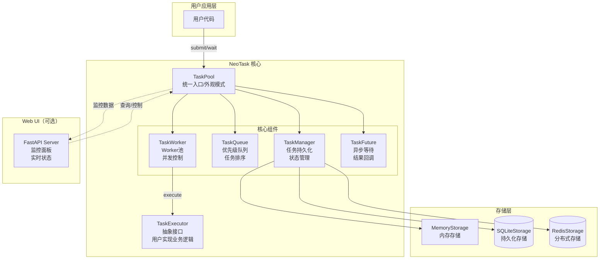
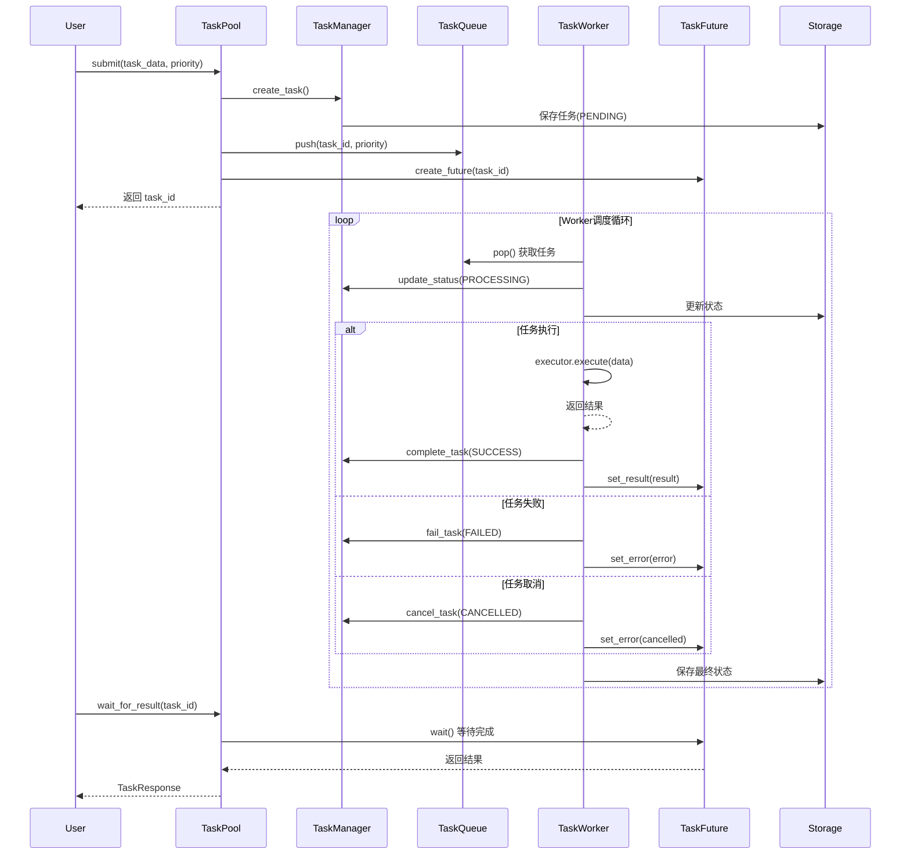
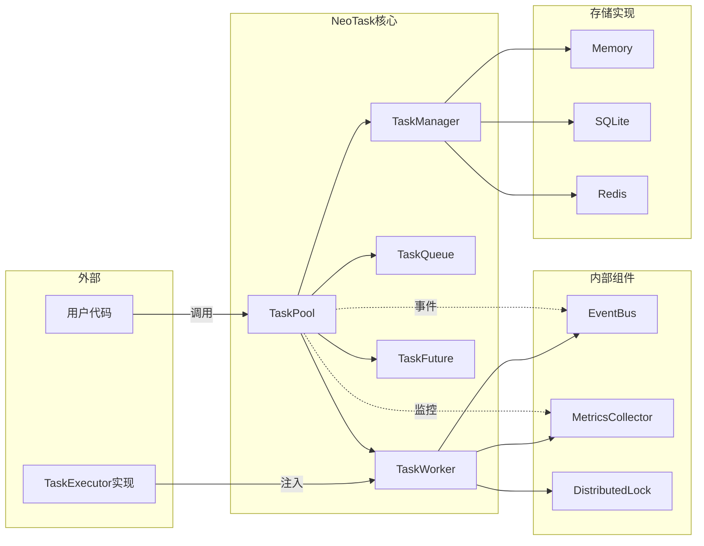
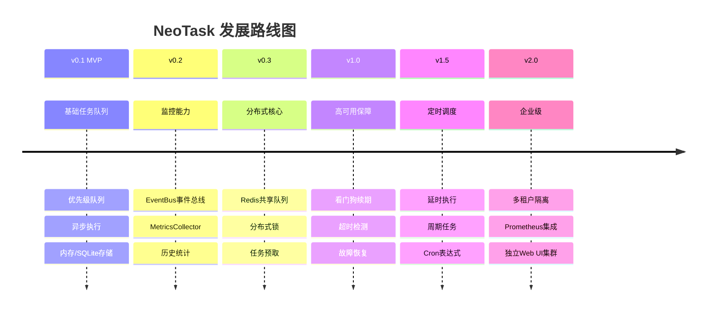

# NeoTask

轻量级 Python 异步任务队列管理器，无需额外服务，pip install 即可用。

NeoTask 是一个纯 Python 实现的异步任务调度系统，专为耗时任务（AI 生成、视频处理、数据爬取等）设计。无需部署 Redis、PostgreSQL 等外部服务，安装后即可在任意 Python 项目中直接使用。

---

## 核心功能

| 功能 | 说明 |
|------|------|
| **零依赖部署** | 纯 Python 实现，仅需 SQLite（Python 内置），无需启动独立服务 |
| **异步并发调度** | 基于 asyncio，支持多 Worker 并发执行，可配置并发数 |
| **优先级队列** | 高优先级任务优先执行，紧急任务不排队 |
| **自动重试** | 失败任务自动重试，支持配置重试次数和超时时间 |
| **持久化存储** | SQLite 存储任务状态，程序重启不丢失 |
| **可选 Web UI** | 一键启动监控面板，实时查看任务状态和统计数据 |
| **命令行工具** | `neotask` 系列命令，方便脚本集成和运维管理 |

---

## 架构设计



## 数据流图



## 组件关系图




## 快速上手

### 安装

```sh
# 基础安装
pip install neotask

# 带 Web UI 支持
pip install neotask[ui]

# 带 Redis 分布式支持
pip install neotask[redis]

# 完整安装
pip install neotask[full]
```


### 基础使用

```python
from neotask import TaskPool, TaskExecutor

# 1. 实现业务执行器
class MyExecutor(TaskExecutor):
    async def execute(self, task_data: dict) -> dict:
        # 业务逻辑
        return {"result": "processed"}

# 2. 创建任务池（统一入口）
pool = TaskPool(
    executor=MyExecutor(),
    max_concurrent=5,
    storage_type="sqlite"
)

# 3. 提交任务
task_id = pool.submit({"data": "value"})

# 4. 等待结果
result = pool.wait_for_result(task_id)

# 5. 优雅关闭
pool.shutdown()
```


### 使用回调函数

```python
def on_task_completed(task_id, result):
    print(f"任务 {task_id} 完成: {result}")

# 提交时指定回调
task_id = pool.submit(
    {"action": "process"},
    callback=on_task_completed
)
```


### 使用 HTTP 回调

```python
# 任务完成后会向指定 URL 发送 POST 请求
task_id = pool.submit(
    {"action": "process"},
    callback_url="https://your-server.com/webhook"
)
```


## 使用方法

### 任务提交

```python
# 立即执行（默认优先级 NORMAL）
task_id = pool.submit({"action": "process"})

# 指定优先级（0=CRITICAL, 1=HIGH, 2=NORMAL, 3=LOW）
task_id = pool.submit({"action": "urgent"}, priority=0)

# 指定任务 ID（用于幂等性控制）
task_id = pool.submit({"action": "process"}, task_id="my-custom-id")
```

### 任务状态查询

```python
# 获取任务状态
status = pool.get_task_status(task_id)
# 返回值: pending / processing / success / failed / cancelled

# 获取任务结果
result = pool.get_task_result(task_id)
# 返回: {"task_id": "...", "status": "...", "result": {...}, "error": ...}

# 取消任务
success = pool.cancel_task(task_id)
```

### 批量任务

```python
# 批量提交（等待全部完成）
scripts = ["任务1", "任务2", "任务3"]
results = pool.batch(scripts, timeout=300)

# 批量提交（不等待，获取批次ID）
batch_response = pool.batch_submit(scripts)
batch_id = batch_response.batch_id

# 查询批次状态
statuses = pool.batch_get_status(batch_id)
results = pool.batch_get_results(batch_id)
```

### 配置选项

```python
pool = TaskPool(
    # 必选参数
    executor=MyExecutor(),           # 任务执行器实例
    
    # 可选参数
    max_concurrent=10,               # 最大并发数，默认 10
    queue_size=1000,                 # 队列最大长度，默认 1000
    retry_times=3,                   # 失败重试次数，默认 3
    timeout_seconds=300,             # 任务超时时间（秒），默认 300
    
    # 存储配置
    storage_type="sqlite",           # 存储类型: memory / sqlite / redis
    sqlite_path="neotask.db",        # SQLite 数据库路径
    redis_url="redis://localhost",   # Redis 连接 URL
    
    # Web UI 配置
    webui_enabled=False,             # 是否启用 Web UI
    webui_port=8080,                 # Web UI 端口
    webui_host="127.0.0.1",          # Web UI 监听地址
    webui_auto_open=False,           # 是否自动打开浏览器
    
    # 日志配置
    log_level="INFO",                # 日志级别: DEBUG/INFO/WARNING/ERROR
    log_file=None,                   # 日志文件路径
)
```

### 命令行工具

```python
# 启动任务池服务
neotask start --config config.yaml

# 启动 Web UI（独立模式）
neotask webui --port 8080 --redis-url redis://localhost

# 查看任务统计
neotask stats --redis-url redis://localhost

# 列出任务
neotask list --status pending --limit 10
```

## 版本与展望

### 当前版本：v0.1 (MVP)

- ✅ 基础任务队列（优先级、并发控制）
- ✅ 内存/SQLite 存储
- ✅ 异步执行引擎
- ✅ 同步/异步等待结果
- ✅ 基础 Web UI
- ✅ 回调函数支持
- ✅ 任务取消功能

### 发展路线图



### 版本对比

| 特性         | v0.1 (MVP) | v0.2 | v0.3 | v1.0 | v1.5 | v2.0 |
| :----------- | :--------- | :--- | :--- | :--- | :--- | :--- |
| 基础任务队列 | ✅          | ✅    | ✅    | ✅    | ✅    | ✅    |
| 优先级队列   | ✅          | ✅    | ✅    | ✅    | ✅    | ✅    |
| 内存存储     | ✅          | ✅    | ✅    | ✅    | ✅    | ✅    |
| SQLite 存储  | ✅          | ✅    | ✅    | ✅    | ✅    | ✅    |
| Web UI       | ✅          | ✅    | ✅    | ✅    | ✅    | ✅    |
| 事件总线     | -          | ✅    | ✅    | ✅    | ✅    | ✅    |
| 指标收集     | -          | ✅    | ✅    | ✅    | ✅    | ✅    |
| Redis 存储   | -          | -    | ✅    | ✅    | ✅    | ✅    |
| 分布式锁     | -          | -    | ✅    | ✅    | ✅    | ✅    |
| 看门狗机制   | -          | -    | -    | ✅    | ✅    | ✅    |
| 故障恢复     | -          | -    | -    | ✅    | ✅    | ✅    |
| 延时任务     | -          | -    | -    | -    | ✅    | ✅    |
| 周期任务     | -          | -    | -    | -    | ✅    | ✅    |
| 多租户       | -          | -    | -    | -    | -    | ✅    |
| Prometheus   | -          | -    | -    | -    | -    | ✅    |

------

## 典型应用场景

| 场景                   | 说明                         | 推荐配置                             |
| :--------------------- | :--------------------------- | :----------------------------------- |
| **AI 文生图/视频生成** | 耗时任务排队，避免阻塞主流程 | max_concurrent=3, storage=sqlite     |
| **批量文件处理**       | 转码、压缩、上传等批量操作   | max_concurrent=10, priority=高低搭配 |
| **网页爬虫调度**       | 分布式爬取，防止被封         | storage=redis, 多节点部署            |
| **定时任务/延迟任务**  | 邮件发送、数据同步等         | cron/interval 调度                   |
| **后台数据处理**       | 数据分析、报表生成           | max_concurrent=5, retry_times=3      |

------

## 性能参考

| 配置                       | 吞吐量       | 平均延迟 | 说明       |
| :------------------------- | :----------- | :------- | :--------- |
| 单 Worker，任务耗时 100ms  | ~10 tasks/s  | ~100ms   | 基础配置   |
| 10 Workers，任务耗时 100ms | ~100 tasks/s | ~110ms   | 推荐配置   |
| 50 Workers，任务耗时 100ms | ~500 tasks/s | ~120ms   | 高性能配置 |

*注：实际性能受 CPU 核心数、任务复杂度、存储 I/O 影响*

------

## 贡献指南

### 开发环境设置

```python
# 克隆仓库
git clone https://github.com/neopen/task-schedule-manager.git
cd task-schedule-manager

# 创建虚拟环境
python -m venv venv
source venv/bin/activate  # Windows: venv\Scripts\activate

# 安装开发依赖
pip install -e ".[dev]"

# 运行测试
pytest

# 查看测试覆盖率
pytest --cov=neotask

# 代码格式化
black src/
isort src/

# 类型检查
mypy src/

# 代码检查
ruff check src/
```

### 项目结构

```
task-schedule-manager/
├── src/neotask/           # 源代码
│   ├── api/               # 对外接口
│   ├── core/              # 核心组件
│   ├── storage/           # 存储层
│   ├── executors/         # 执行器
│   ├── web/               # Web UI
│   └── models/            # 数据模型
├── tests/                 # 单元测试
├── examples/              # 示例代码
└── docs/                  # 文档
```


### 贡献流程

1. Fork 项目仓库
2. 创建特性分支：`git checkout -b feature/amazing-feature`
3. 提交更改：`git commit -m 'Add amazing feature'`
4. 推送分支：`git push origin feature/amazing-feature`
5. 提交 Pull Request

### 代码规范

- 遵循 [PEP 8](https://peps.python.org/pep-0008/) 代码风格
- 添加适当的 [类型注解](https://peps.python.org/pep-0484/)
- 编写单元测试覆盖新功能（覆盖率 ≥ 80%）
- 更新相关文档和示例代码
- 提交信息遵循 [Conventional Commits](https://www.conventionalcommits.org/)

### 测试要求

```sh
# 运行所有测试
pytest tests/

# 运行特定模块测试
pytest tests/unit/test_task.py

# 运行手动测试
python examples/01_simple.py
python examples/05_webui.py
```

## 问题反馈

- **提交 Issue**：https://github.com/neopen/task-schedule-manager/issues
- **功能建议**：使用 Enhancement 标签
- **Bug 报告**：使用 Bug 标签并提供复现步骤
- **安全漏洞**：请直接发送邮件至作者邮箱

------

## 许可证

MIT License - 详见 [LICENSE](https://license/) 文件

Copyright (c) 2024 HiPeng

------

## 致谢

感谢所有贡献者和开源社区的支持。

------

## 联系方式

- 项目主页：https://github.com/neopen/task-schedule-manager
- 作者：HiPeng
- 邮箱：helpenx@gmail.com
- 文档：https://pengline.cn/2026/03/0ec8d887591a40c98be76645d33a2f23