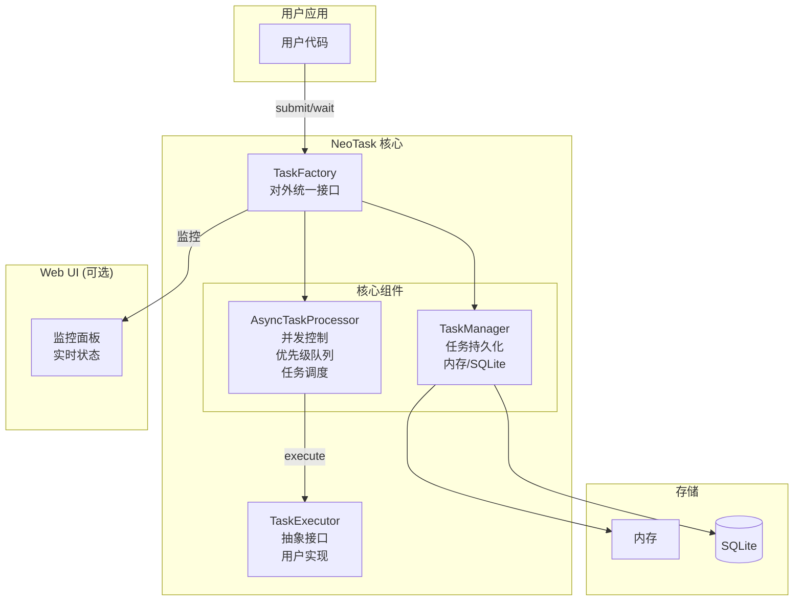
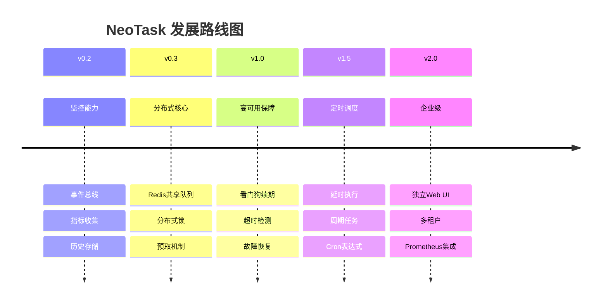

# NeoTask

轻量级 Python 任务队列管理器，无需额外服务，pip install 即可用。

NeoTask 是一个纯 Python 实现的异步任务调度系统，专为耗时任务（AI 生成、视频处理、数据爬取等）设计。无需部署 Redis、PostgreSQL 等外部服务，安装后即可在任意 Python 项目中直接使用。

## 核心功能

- 零依赖部署：纯 Python 实现，仅需 SQLite（内置），无需启动独立服务
- 并发调度：支持多线程/多进程 Worker 池，可配置并发数
- 优先级队列：高优先级任务优先执行，紧急任务不排队
- 自动重试：失败任务自动重试，支持配置重试次数和超时
- 持久化存储：SQLite 存储任务状态，程序重启不丢失
- 可选 Web UI：一键启动监控面板，实时查看任务状态
- 命令行工具：neotask 系列命令，方便脚本集成

## 架构设计



## 快速上手

### 安装

```bash
pip install neotask
```

### 基础使用

```python
from neotask import TaskPool, TaskExecutor

# 1. 定义业务执行器
class MyExecutor(TaskExecutor):
    async def execute(self, task_data: dict) -> dict:
        # 业务逻辑
        print(f"处理任务: {task_data}")
        return {"result": "processed"}

# 2. 创建任务池
pool = TaskPool(
    executor=MyExecutor(),
    max_concurrent=5
)

# 3. 提交任务
task_id = pool.submit({"data": "value"})

# 4. 等待结果
result = pool.wait_for_result(task_id)  # 同步等待
# 或异步等待
# result = await pool.wait_for_result_async(task_id)
```

### Web UI 监控

```python
# 启动任务池（自动启用 Web UI）
pool = TaskPool(
    executor=MyExecutor(),
    max_concurrent=5,
    webui_enabled=True,
    webui_port=8080
)

# 访问 http://localhost:8080 查看监控面板
```

## 使用方法

### 任务提交

```python
# 立即执行
task_id = pool.submit({"action": "process"}, priority=1)

# 延时执行（V4.0+）
task_id = pool.submit_delayed({"action": "delayed"}, delay_seconds=60)

# 周期执行（V4.0+）
task_id = pool.submit_cron({"action": "periodic"}, "*/5 * * * *")
```

### 任务状态查询

```python
# 获取任务状态
status = pool.get_task_status(task_id)

# 获取任务结果
result = pool.get_task_result(task_id)

# 取消任务
pool.cancel_task(task_id)
```

### 统计信息

```python
# 获取实时统计
stats = pool.get_stats()
print(f"队列大小: {stats['queue_size']}")
print(f"活跃工作线程: {stats['active_workers']}")
print(f"平均等待时间: {stats['avg_wait_ms']}ms")
```

### 配置选项

```python
pool = TaskPool(
    executor=MyExecutor(),
    max_concurrent=10,          # 最大并发数
    retry_times=3,              # 重试次数
    timeout_seconds=300,        # 任务超时时间
    storage_type="sqlite",      # 存储类型: memory/sqlite
    webui_enabled=True,         # 启用 Web UI
    webui_port=8080,           # Web UI 端口
    log_level="INFO"           # 日志级别
)
```

## 版本与展望

### 当前版本：v0.1.0 (MVP)

- 基础任务队列功能
- 内存/SQLite 存储
- 异步执行引擎
- 基础 Web UI

### 发展路线图



### 未来特性

- **分布式支持**：Redis 集群、多节点部署
- **高可用保障**：看门狗机制、故障自动恢复
- **定时调度**：延时任务、周期任务、Cron 表达式
- **企业级特性**：多租户、Prometheus 集成、独立 Web UI

## 典型应用场景

- AI 文生图/视频生成任务排队
- 批量文件处理（转码、压缩、上传）
- 网页爬虫任务调度
- 定时任务/延迟任务执行
- 任何需要异步执行的耗时操作

## 贡献指南

### 开发环境设置

```bash
# 克隆仓库
git clone https://github.com/neopen/task-schedule-manager.git
cd task-schedule-manager

# 安装依赖
pip install -e ".[dev]"

# 运行测试
pytest

# 代码格式化
black src/
```

### 贡献流程

1. Fork 项目仓库
2. 创建特性分支：`git checkout -b feature/amazing-feature`
3. 提交更改：`git commit -m 'Add amazing feature'`
4. 推送分支：`git push origin feature/amazing-feature`
5. 提交 Pull Request

### 代码规范

- 遵循 PEP 8 代码风格
- 添加适当的类型注解
- 编写单元测试覆盖新功能
- 更新相关文档

### 问题反馈

- 提交 Issue：https://github.com/neopen/task-schedule-manager/issues
- 功能建议：使用 Enhancement 标签
- Bug 报告：使用 Bug 标签并提供复现步骤

## 许可证

MIT License - 详见 [LICENSE](LICENSE) 文件

## 联系方式

- 项目主页：https://github.com/neopen/task-schedule-manager
- 作者：HiPeng
- 邮箱：helpenx@gmail.com